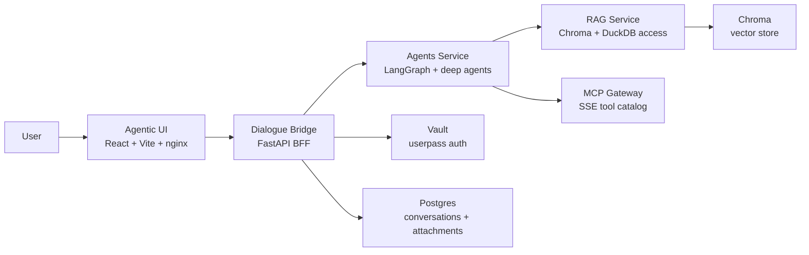
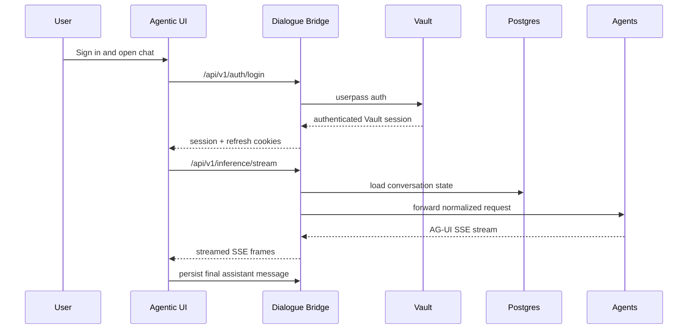
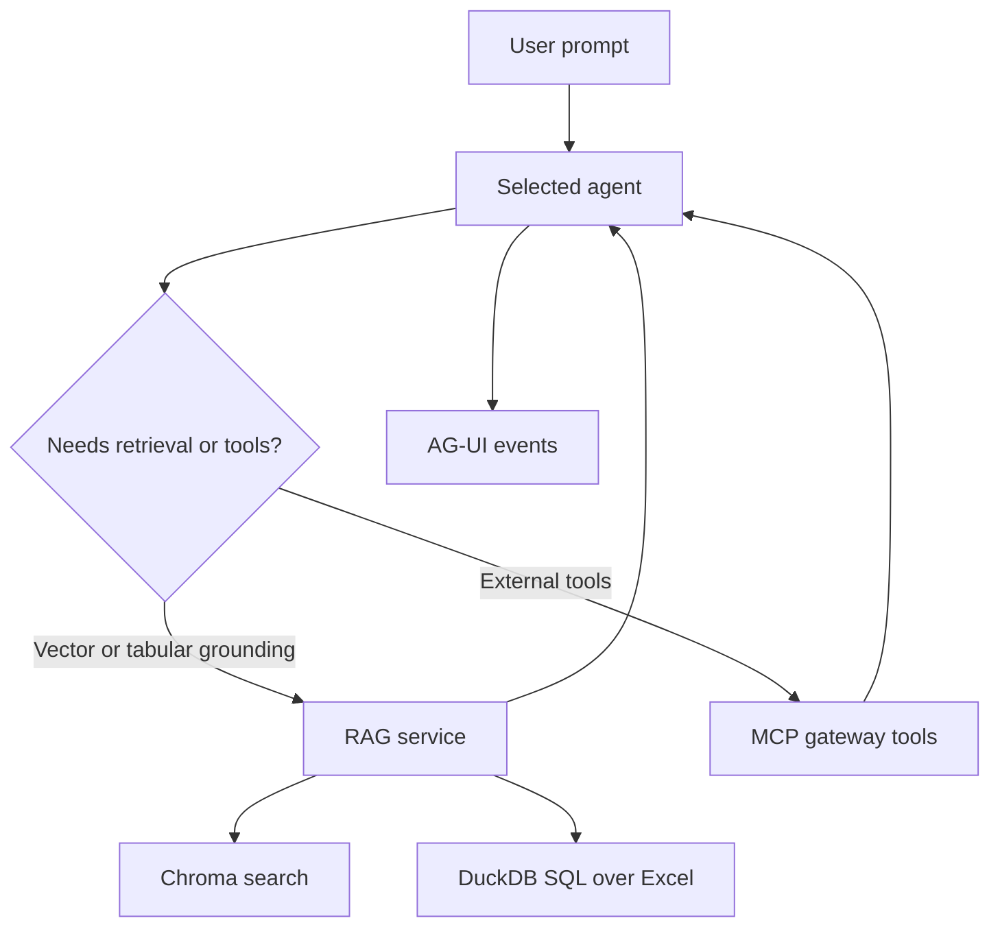
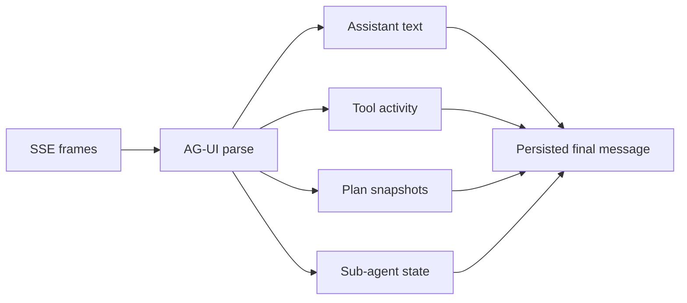

<p align="center">
  
</p>

<h1 align="center">mAgenticX</h1>

<p align="center">
  A multi-service agentic platform for authenticated chat, streamed reasoning traces, retrieval, tool use, and branch-aware conversations.
</p>

<p align="center">
  <a href="#quick-start">Quick Start</a> •
  <a href="#architecture-at-a-glance">Architecture</a> •
  <a href="#services">Services</a> •
  <a href="#documentation-hub">Docs</a>
</p>

<p align="center">
  
</p>

## What mAgenticX Is

mAgenticX is a full-stack agentic system built around a browser chat experience, an authenticated backend-for-frontend, a streaming agent runtime, and a dedicated retrieval layer. It is designed for environments where you need more than plain chat: tool execution, retrieval grounding, attachments, dictation, observability, and visible reasoning artifacts such as plans, sub-agent activity, and tool traces.

The repository is split into focused services, each with its own implementation README. This root document is the landing page for the project: it explains how the platform fits together, where to start, and where to go next.

## Table of Contents

- [What mAgenticX Is](#what-magenticx-is)
- [Why It Exists](#why-it-exists)
- [Architecture at a Glance](#architecture-at-a-glance)
- [Core Flows](#core-flows)
- [Examples](#examples)
- [Services](#services)
- [Repository Map](#repository-map)
- [Quick Start](#quick-start)
- [Screens and Diagrams](#screens-and-diagrams)
- [Documentation Hub](#documentation-hub)
- [Development Notes](#development-notes)
- [License](#license)

## Why It Exists

- To provide a production-shaped agentic chat stack instead of a single demo script.
- To separate concerns cleanly across UI, auth/persistence, agent execution, retrieval, and tool discovery.
- To expose agent runtime behavior in the UI through AG-UI events rather than hiding everything behind a plain text stream.
- To support both retrieval-backed domain agents and more general deep-agent orchestration patterns in the same project.
- To keep each major subsystem independently understandable and deployable.

## Architecture at a Glance



## Core Flows

### Authenticated Chat Flow

The browser talks only to the dialogue bridge. The bridge authenticates against Vault, manages the application session, persists conversation state, and proxies inference streams to the selected agent.



### Retrieval and Tooling Flow

The agents service can combine model reasoning with vector retrieval, spreadsheet analytics, and MCP tools, then emit the resulting activity back to the UI as structured events.



### Browser Rendering Flow

The UI does not just append streamed text. It normalizes AG-UI event frames into visible assistant text, tool traces, plan snapshots, thinking progress, and sub-agent artifacts.



## Examples

Representative use cases supported by the current codebase:

- HR policy support: ask policy or workplace questions against the HR retrieval workflow and surface grounded answers with cited context.
- Orthodox domain support: route religious and theological prompts through the Orthodox workflow with domain-specific retrieval logic.
- Retail and spreadsheet analysis: query tabular business data through the RAG service’s DuckDB-backed Excel layer.
- General agentic orchestration: use the Omni/deep-agent path for planning, delegation, tool use, and sub-agent event rendering.

## Services

| Service | Role | Default Port | Main Stack | Docs |
| --- | --- | ---: | --- | --- |
| `agentic_ui` | Browser chat app and reverse proxy entrypoint | `8050` | React, Vite, nginx | [UI README](src/agentic_ui/README.md) |
| `dialogue_bridge` | Authenticated BFF, persistence layer, SSE proxy | `8002` | FastAPI, SQLAlchemy, Postgres | [Bridge README](src/dialogue_bridge/README.md) |
| `agents` | Streaming agent runtime and AG-UI normalization | `8003` | FastAPI, LangGraph, OpenAI | [Agents README](src/agents/README.md) |
| `rag_service` | Retrieval and SQL over spreadsheet-backed data | `8001` | FastAPI, Chroma, DuckDB | [RAG README](src/rag_service/README.md) |
| `mcp_gateway` | Tool catalog and MCP SSE endpoint | `8005` | docker/mcp-gateway | [MCP Gateway README](src/mcp_gateway/README.md) |
| `vectordb` | Persistent vector storage for retrieval | `8000` | Chroma | integrated |
| `chat_postgres` | Durable chat state, attachments, and feedback | `5432` | PostgreSQL | integrated |
| `vault` | Authentication backend used by the bridge | `8004` | HashiCorp Vault | integrated |

## Repository Map

```text
.
├── README.md
├── LICENSE
├── docs/
│   └── architecture screenshots and diagrams
├── notebooks/
│   └── exploratory and analysis notebooks
└── src/
    ├── agentic_ui/          React SPA, nginx proxy, AG-UI rendering
    ├── dialogue_bridge/     FastAPI BFF, auth, persistence, SSE relay
    ├── agents/              Agent runtime, manifests, AG-UI event output
    ├── rag_service/         Retrieval and DuckDB-backed analytics
    ├── mcp_gateway/         MCP catalog and gateway config
    ├── vectorstores/        Chroma persistence
    ├── vault/               Vault config and bootstrap assets
    ├── docker-compose.yaml
    ├── docker-compose-mcp.yaml
    └── docker-compose-hashicorp.yaml
```

## Quick Start

### Prerequisites

- Docker and Docker Compose for the containerized stack
- Node.js 18+ for standalone UI development
- Python 3.11+ for standalone backend development
- OpenAI API access for the configured models

### Core Stack

The main application services are defined in `src/docker-compose.yaml`:

```bash
docker compose -f src/docker-compose.yaml up --build
```

This core stack includes:

- `agentic_ui`
- `dialogue_bridge`
- `agents`
- `rag_service`
- `vectordb`
- `chat_postgres`

### Supporting Services

The repo also includes separate Compose files for infrastructure that may be run alongside or independently of the core stack:

- `src/docker-compose-mcp.yaml` for the MCP gateway
- `src/docker-compose-hashicorp.yaml` for Vault

The main stack expects external connectivity to `mcp_net` and `hashicorp_vault` when those services are deployed separately. Review those Compose files before assuming a single-command full-environment startup.

### Main URLs

When the default Compose setup is running:

- UI: `http://localhost:8050`
- Dialogue Bridge: `http://localhost:8002`
- Agents: `http://localhost:8003`
- RAG Service: `http://localhost:8001`
- MCP Gateway: `http://localhost:8005/sse` when started
- Vault: `http://localhost:8004` when started

### Local Development

For service-by-service development, use the implementation READMEs:

- [UI local development](src/agentic_ui/README.md#development)
- [Dialogue bridge setup](src/dialogue_bridge/README.md)
- [Agents setup](src/agents/README.md)
- [RAG service setup](src/rag_service/README.md)
- [MCP gateway setup](src/mcp_gateway/README.md)

## Screens and Diagrams

| Network and request flow | Platform overview |
| --- | --- |
|  |  |

| Chat lifecycle | Authentication |
| --- | --- |
|  |  |

## Documentation Hub

Use the root README for orientation, then jump into the service manuals for implementation detail:

- [Agentic UI](src/agentic_ui/README.md)
- [Dialogue Bridge](src/dialogue_bridge/README.md)
- [Agents Service](src/agents/README.md)
- [RAG Service](src/rag_service/README.md)
- [MCP Gateway](src/mcp_gateway/README.md)

## Development Notes

- If you are working on the browser experience, start with `src/agentic_ui`.
- If you are changing auth, sessions, chat persistence, or SSE proxying, start with `src/dialogue_bridge`.
- If you are changing agent workflows, manifests, or AG-UI stream behavior, start with `src/agents`.
- If you are changing retrieval collections, Excel analytics, or DuckDB behavior, start with `src/rag_service`.
- If you are changing available tools or MCP server wiring, start with `src/mcp_gateway`.

## License

This repository is licensed under the [MIT License](LICENSE).
