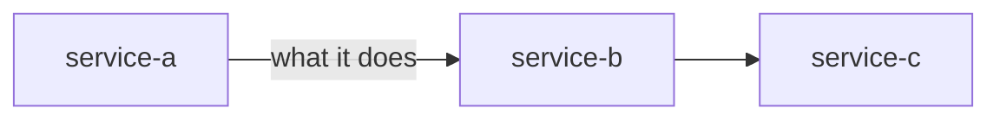
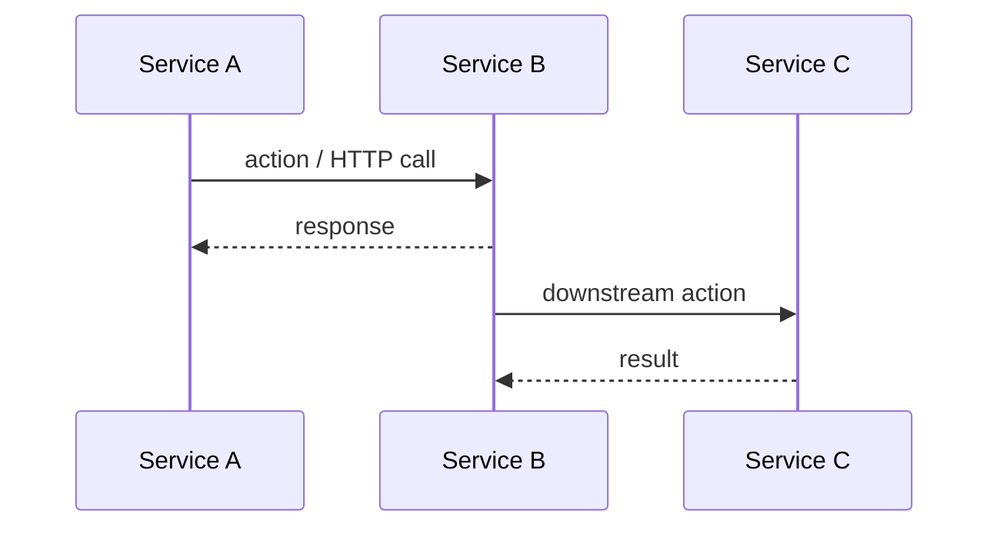
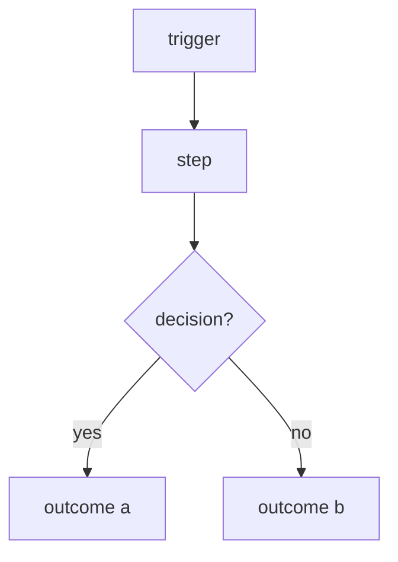

# [Document Title]

[One paragraph. What this document covers, which services are involved, and the mental model a reader needs before diving in. No bullets — prose only.]

---

## Services Involved

---

## [Flow Name] — Full Sequence

[One sentence setting up what the diagram below is showing.]

---

## Phase 1 — [Name]

[Explain what happens in this phase and *why* it works this way. Focus on the reasoning behind the design, not just a restatement of the diagram. 2–4 sentences.]

| Key fact | Value / detail |
| --- | --- |
| [field / constant / timeout] | [value and what it means] |

---

## Phase 2 — [Name]

[Explain the phase — reasoning first, mechanics second.]

| Key fact | Value / detail |
| --- | --- |
| | |

---

## Phase 3 — [Name]

[Continue for as many phases as the flow has. Each phase is one logical step that could have a named owner or a single responsibility.]

---

## Sharp Edges and Behavioral Notes

[The most important section for someone debugging or extending this flow. Each point is a non-obvious behavior, a constraint, or a failure mode that would surprise a reader who only read the diagrams.]

- **[Behavior name]** — [what happens and why it matters]
- **[Failure mode]** — [what triggers it and what the system does]
- **[Constraint]** — [the rule and the reason it exists]

---

## File Map

| Concept | File | What to look for |
| --- | --- | --- |
| [concept] | [src/service/path/file.py](../src/service/path/file.py) | [function / class / constant] |
| [concept] | [src/service/path/file.ts](../src/service/path/file.ts) | [hook / handler / type] |
