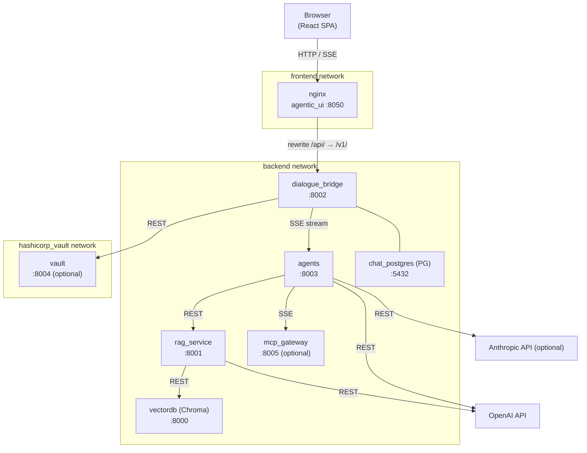
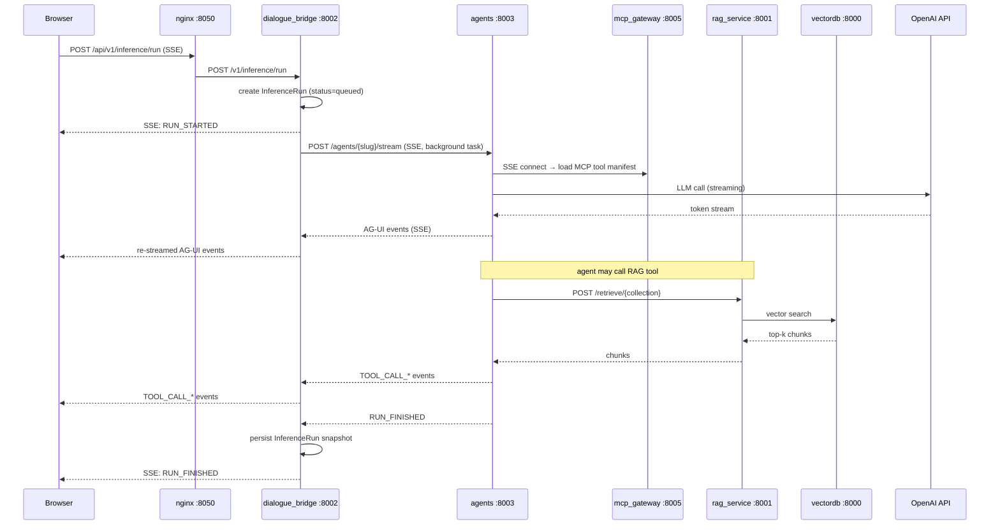

# Architecture Overview

This document describes the full mAgenticX platform: every service, its port, its responsibilities, how services talk to each other, and how the whole system is deployed.

---

## Services at a Glance

| Service | Container | Port | Technology |
| --- | --- | --- | --- |
| agentic_ui | `agentic_ui` | **8050** | React 18 + Vite, served by nginx |
| dialogue_bridge | `dialogue_bridge` | **8002** | FastAPI — BFF (backend-for-frontend) |
| agents | `agents` | **8003** | FastAPI — LangGraph + DeepAgents runtime |
| rag_service | `rag_service` | **8001** | FastAPI — Chroma vector retrieval + DuckDB SQL |
| vectordb | `vectordb` | **8000** | ChromaDB 0.6.3 — vector store |
| chat_postgres | `chat_postgres` | **5432** | PostgreSQL 16.3 — relational store |
| mcp_gateway | `mcp_gateway` | **8005** | Docker MCP Gateway — optional, via `docker-compose-mcp.yaml` |
| vault | `vault` | **8004** | HashiCorp Vault 1.21 — optional, via `docker-compose-hashicorp.yaml` |

The frontend Vite dev server (no nginx) uses **port 8080**.

---

## Full System Map



---

## Phase 1 — agentic_ui (Frontend)

The browser application is a React 18 SPA built with Vite and served in production by nginx. nginx is also the reverse proxy that routes browser API calls to `dialogue_bridge`.

### Responsibilities

- Renders the chat interface, sidebar, voice controls, and settings panels
- Manages client-side session state (localStorage `mx_auth_session` + IndexedDB `mx_ui_state`)
- Opens SSE connections to receive streaming inference events
- Initiates WebRTC signalling for realtime voice mode

### nginx Reverse Proxy

nginx is the only publicly exposed port (8050). It does three things:

1. **Serves the SPA** — all non-`/api/` routes return `index.html`
2. **Proxies API traffic** — `/api/` prefix is stripped; requests are forwarded to `dialogue_bridge:8002`
3. **Injects security headers** — sets `X-Trusted-Proxy-Secret` on every forwarded request so the backend can trust the caller

Key nginx settings:
- `client_max_body_size 50M` — supports attachment uploads
- `proxy_buffering off` — required for SSE and large file streaming
- `resolver 127.0.0.11` — deferred DNS resolution for Docker service names
- `proxy_set_header` chain — propagates `X-Real-IP`, `X-Forwarded-For`, `X-Forwarded-Proto`, `CF-Connecting-IP`

### Dev Mode

`vite.config.ts` configures a dev server on **port 8080** with HMR. The dev server also proxies `/api/` to `localhost:8002` so the frontend works without nginx during local development.

### Key Paths

| URL Pattern | Handler |
| --- | --- |
| `GET /` | nginx → SPA (`index.html`) |
| `GET /api/v1/*` | nginx → `dialogue_bridge:8002/v1/*` |

---

## Phase 2 — dialogue_bridge (BFF)

`dialogue_bridge` is the backend-for-frontend. Every browser request goes through it. It manages authentication, sessions, conversation persistence, and acts as a streaming proxy to the agents service.

### Responsibilities

- Authenticates users (Vault userpass → JWT access + refresh cookies)
- Manages conversations, messages, and attachments in PostgreSQL
- Streams inference events from `agents` to the browser via SSE
- Handles voice signalling (WebRTC SDP exchange with OpenAI Realtime API)
- Serves TTS audio and dictation transcription

### Router Structure

All routes are mounted under the `/v1/` prefix by FastAPI's app router.

| Router | Prefix | Key Endpoints |
| --- | --- | --- |
| `auth_router` | `/v1/auth` | `POST /login`, `GET /session`, `POST /session/refresh`, `POST /logout` |
| `inference_router` | `/v1/inference` | streaming run management, run status, cancellation |
| `speech_router` | `/v1/speech` | TTS streaming, dictation transcription |
| `voice_router` | `/v1/voice` | WebRTC SDP exchange for realtime voice |
| `catalog_router` | `/v1/catalog` | `GET /agents`, `GET /tools`, `GET /tools/search` |
| `preferences_router` | `/v1/preferences` | user voice/model/language preferences |
| `conversations_router` | `/v1/conversations` | create, list, get, update, delete, fork |
| `messages_router` | `/v1/messages` | message CRUD within conversations |
| `attachments_router` | `/v1/attachments` | upload, download, preview |
| `shared_conv_router` | `/v1/shared-conversations` | share snapshots (full / branch / message scope) |
| `search_router` | `/v1/search` | full-text search across conversations |

### Internal Trust Model

All backend-to-backend HTTP calls require the `X-Internal-Proxy-Secret` header (value from `TRUSTED_PROXY_SECRET` env var). The `require_internal_caller` FastAPI dependency validates this on every internal endpoint. nginx injects the header automatically for browser → bridge traffic. The bridge injects it manually when calling the agents service.

### Vault Integration

When Vault is deployed, `dialogue_bridge` calls `vault:8004` to authenticate user credentials (userpass backend) and receive short-lived JWT access tokens. The bridge issues HttpOnly cookies to the browser; it never exposes raw tokens.

Without Vault, the bridge can fall back to a local JWT signing mode (configurable via `VAULT_URL` env var being unset).

---

## Phase 3 — agents Service (Runtime)

`agents` is the LangGraph + DeepAgents execution engine. It streams AG-UI events back to `dialogue_bridge`, which re-streams them to the browser.

### Responsibilities

- Discovers and registers all agent classes at startup
- Runs inference for a given agent slug and conversation history
- Integrates MCP tools from `mcp_gateway`
- Calls `rag_service` for retrieval and structured data queries
- Streams AG-UI protocol events over SSE

### Agent Registry

On startup, `_discover_agents()` scans two Python modules:

```text
src/agents/langgraph_agents/   ← LangGraphAgent subclasses
src/agents/deep_agents/        ← DeepAgent subclasses
```

Each discovered agent class is registered by its `agent_id` slug. The `DISABLED_AGENT_SLUGS` env var (comma-separated list) prevents specific agents from loading. Duplicate slugs raise an error at startup.

### Inference Endpoint

`POST /agents/{agent_slug}/stream` accepts the conversation context and streams the AG-UI event envelope (newline-delimited JSON). `dialogue_bridge` opens this SSE connection from a background asyncio task, decodes the events, accumulates them into an `InferenceRunRuntime`, and re-encodes them to the browser's SSE connection.

### MCP Tool Loading

At the start of each inference request, the agents service opens an SSE connection to `mcp_gateway:8005/sse`, fetches the tool manifest, caches it in `_MCP_TOOL_MANIFEST_CACHE`, and closes the connection after the request completes. The `mcp_session_context()` async context manager handles the lifecycle.

---

## Phase 4 — rag_service (Retrieval)

`rag_service` provides two retrieval backends: semantic vector search via ChromaDB, and structured SQL queries via DuckDB over Excel workbooks.

### Responsibilities

- Accepts retrieval requests from `agents`
- Performs cosine-similarity vector search against named Chroma collections
- Loads Excel workbooks at startup into DuckDB in-memory tables
- Validates and executes read-only SQL queries against those tables

### Endpoints

| Endpoint | Purpose |
| --- | --- |
| `POST /retrieve/{collection_name}` | Vector similarity search; returns top-k chunks with metadata |
| `GET /excel/{table_name}/schema` | Returns column names and types for a loaded workbook table |
| `POST /excel/{table_name}/query/sql` | Executes a validated read-only SELECT against the table |

### Embedding Model

All vector embeddings use OpenAI `text-embedding-3-large` (1536-dim). The model is configured via `OPENAI_API_KEY` and the same org/project settings as the agents service.

### SQL Validation

Every SQL query submitted to `/excel/.../query/sql` is validated before execution:
- Must be a single statement
- Must start with `SELECT` or `WITH` (after stripping whitespace)
- Must not contain forbidden tokens: `INSERT`, `UPDATE`, `DELETE`, `CREATE`, `DROP`, `ALTER`, `EXEC`, `EXECUTE`
- Must reference the requested table name

---

## Phase 5 — Infrastructure Services

### vectordb (ChromaDB)

ChromaDB runs as a standalone HTTP server on port 8000. `rag_service` connects to it via `chromadb.HttpClient`. Collections are pre-loaded from a persistent Docker volume mounted at `./vectorstores/chroma_db_openai/`. ChromaDB's own REST API is not exposed outside the `backend` Docker network.

### chat_postgres (PostgreSQL)

PostgreSQL 16.3 stores all relational data: users, sessions, conversations, messages, attachments, blobs, inference runs, sharing metadata, and reports. `dialogue_bridge` connects via SQLAlchemy (async) with `asyncpg`. The full schema is documented in `docs/architecture/database-schema.md`.

### mcp_gateway (Optional)

The MCP gateway is a Docker-hosted MCP server (from `ghcr.io/github/mcp-server-docker-remote` or similar) that wraps external MCP servers (Tavily, arxiv-mcp-server, etc.) into a single SSE endpoint. The agents service treats it as a single MCP origin. It is activated by including `docker-compose-mcp.yaml` in the compose invocation.

Tool catalog: `src/mcp_gateway/mcp_catalog.yaml`
Tool configuration: `src/mcp_gateway/mcp_config.yaml`
Secrets (API keys for MCP tools): `src/mcp_gateway/mcp_secret.env`

### vault (Optional)

HashiCorp Vault 1.21 issues short-lived JWT access tokens and manages the userpass authentication backend. It is activated by including `docker-compose-hashicorp.yaml`. `dialogue_bridge` calls `vault:8004` for login and token issuance; Vault is otherwise not visible to any other service.

---

## Phase 6 — Inter-Service Data Flows

### Request: User sends a chat message



### Request: Voice realtime session

```mermaid
sequenceDiagram
    participant B as Browser
    participant N as nginx :8050
    participant D as dialogue_bridge :8002
    participant O as OpenAI Realtime API

    B->>N: POST /api/v1/voice/session (SDP offer)
    N->>D: POST /v1/voice/session
    D->>O: POST /v1/realtime/sessions (session config)
    O-->>D: ephemeral token + SDP answer
    D-->>B: SDP answer
    Note over B,O: WebRTC P2P audio established
    B-->O: audio frames (WebRTC DataChannel / MediaStream)
    Note over B,D: bridge exits signalling; not in audio path
```

---

## Phase 7 — Deployment

### Docker Compose Layers

The platform uses a layered compose setup. Services are started by combining compose files:

```text
src/docker-compose.yaml              ← core: ui, bridge, agents, rag, chroma, postgres
src/docker-compose-mcp.yaml          ← optional: mcp_gateway
src/docker-compose-hashicorp.yaml    ← optional: vault
```

Example for full stack:

```bash
docker compose \
  -f src/docker-compose.yaml \
  -f src/docker-compose-mcp.yaml \
  -f src/docker-compose-hashicorp.yaml \
  up -d
```

### Docker Networks

| Network | Members |
| --- | --- |
| `backend` | dialogue_bridge, agents, rag_service, vectordb, chat_postgres, mcp_gateway |
| `frontend` | agentic_ui, dialogue_bridge |
| `hashicorp_vault` | dialogue_bridge, vault |
| `mcp_net` | agents, mcp_gateway |

Only `agentic_ui` (port 8050) is bound to the host. All other services are internal.

### Key Environment Variables

| Variable | Used By | Purpose |
| --- | --- | --- |
| `OPENAI_API_KEY` | agents, rag_service | LLM + embedding API access |
| `OPENAI_ORG` / `OPENAI_PROJ` | agents, rag_service | OpenAI org/project scope |
| `ANTHROPIC_API_KEY` | agents | Claude model access (optional) |
| `DATABASE_URL` | dialogue_bridge | async PostgreSQL connection string |
| `DATABASE_POOL_SIZE` | dialogue_bridge | SQLAlchemy pool size |
| `SESSION_TOKEN_SECRET` | dialogue_bridge | JWT signing key (non-Vault mode) |
| `SESSION_ACCESS_TTL_SECONDS` | dialogue_bridge | Access token lifetime |
| `SESSION_REFRESH_TTL_SECONDS` | dialogue_bridge | Refresh token lifetime |
| `TRUSTED_PROXY_SECRET` | all services | Internal service authentication |
| `VAULT_URL` | dialogue_bridge | HashiCorp Vault base URL |
| `MCP_GATEWAY_URL` | agents | MCP gateway SSE endpoint |
| `RAG_BASE_URL` | agents | RAG service base URL |
| `AGENTS_SERVICE_URL` | dialogue_bridge | Agents runtime base URL |
| `DISABLED_AGENT_SLUGS` | agents | Comma-separated slugs to skip at startup |
| `CORS_ALLOWED_ORIGINS` | dialogue_bridge | Allowed browser origins |

---

## Sharp Edges and Behavioral Notes

- **nginx is the only public port.** Every browser request enters through port 8050. Nothing else should be exposed to the host in production. Exposing `dialogue_bridge:8002` or `agents:8003` directly bypasses the proxy-secret injection and breaks the trust model.

- **`TRUSTED_PROXY_SECRET` must match across all services.** The bridge and agents both validate this header. A mismatch causes 403 errors on all agent inference calls. Vault does not use this header — it has its own authentication.

- **Agent inference is always a detached background task.** `dialogue_bridge` spawns an asyncio task to stream from `agents`. If the browser disconnects, the task runs to completion (the inference run is still persisted). Cancellation requires an explicit API call to the cancellation endpoint, which sends a cancellation signal to the running graph.

- **mcp_gateway is per-request, not per-session.** The agents service opens and closes an SSE connection to `mcp_gateway` on every inference request. The tool manifest is cached in memory (`_MCP_TOOL_MANIFEST_CACHE`) across requests within the same process.

- **ChromaDB collections must exist before the rag_service starts.** The rag_service does not create collections — it reads them from the persistent volume. Missing collections cause retrieval errors at inference time, not at startup.

- **DuckDB tables are loaded at rag_service startup.** Excel files in the `data/` directory are loaded once into in-memory DuckDB tables. Adding or removing workbooks requires restarting the rag_service container.

- **WebRTC audio never touches the bridge.** After the SDP exchange, all audio flows directly between the browser and OpenAI's Realtime API. The bridge is not in the media path and has no visibility into the audio stream.

- **Vault is optional but changes the auth flow.** Without Vault, the bridge issues its own JWTs using `SESSION_TOKEN_SECRET`. With Vault, all token issuance goes through Vault. The two modes are not interchangeable — a deployment that starts with one mode cannot easily switch without invalidating all existing sessions.

- **Postgres is the only stateful service in the core compose.** ChromaDB state lives in a Docker volume (`./vectorstores/chroma_db_openai/`). PostgreSQL state lives in a named volume (`chat_postgres_data`). Both must be backed up for full disaster recovery.

- **The agents service is stateless between requests.** No conversation state is held in memory in the agents process. The full message history is sent on every inference request by `dialogue_bridge`, which reads it from PostgreSQL.

---

## File Map

| Concept | File | What to look for |
| --- | --- | --- |
| Core compose (services, networks, volumes) | [src/docker-compose.yaml](../../src/docker-compose.yaml) | port bindings, environment variable names, volume mounts |
| MCP gateway compose | [src/docker-compose-mcp.yaml](../../src/docker-compose-mcp.yaml) | mcp_gateway service definition, mcp_net network |
| Vault compose | [src/docker-compose-hashicorp.yaml](../../src/docker-compose-hashicorp.yaml) | vault service definition, hashicorp_vault network |
| nginx config template | [src/agentic_ui/nginx.conf.template](../../src/agentic_ui/nginx.conf.template) | proxy_pass rules, header injection, buffer settings |
| Vite dev config | [src/agentic_ui/vite.config.ts](../../src/agentic_ui/vite.config.ts) | dev server port, API proxy target |
| dialogue_bridge FastAPI app | [src/dialogue_bridge/main.py](../../src/dialogue_bridge/main.py) | router registrations, middleware, startup events |
| dialogue_bridge settings | [src/dialogue_bridge/core/settings.py](../../src/dialogue_bridge/core/settings.py) | all env vars consumed by the bridge |
| Agents FastAPI app | [src/agents/main.py](../../src/agents/main.py) | router registrations, startup agent discovery |
| Agents settings | [src/agents/core/settings.py](../../src/agents/core/settings.py) | LLM API keys, RAG URL, MCP URL, disabled slugs |
| Agent discovery | [src/agents/utils/agents.py](../../src/agents/utils/agents.py) | `_discover_agents()`, `DISABLED_AGENT_SLUGS` |
| RAG service app | [src/rag_service/main.py](../../src/rag_service/main.py) | endpoint definitions, DuckDB table loading |
| RAG settings | [src/rag_service/core/settings.py](../../src/rag_service/core/settings.py) | Chroma host/port, proxy secret |
| Internal proxy trust | [src/dialogue_bridge/core/proxy.py](../../src/dialogue_bridge/core/proxy.py) | `require_internal_caller` dependency |
| MCP tool catalog | [src/mcp_gateway/mcp_catalog.yaml](../../src/mcp_gateway/mcp_catalog.yaml) | list of registered MCP servers |
| Frontend API client | [src/agentic_ui/src/lib/api.ts](../../src/agentic_ui/src/lib/api.ts) | all REST call definitions, base URL construction |
| Frontend constants | [src/agentic_ui/src/lib/consts.ts](../../src/agentic_ui/src/lib/consts.ts) | `API_BASE`, feature flags |
