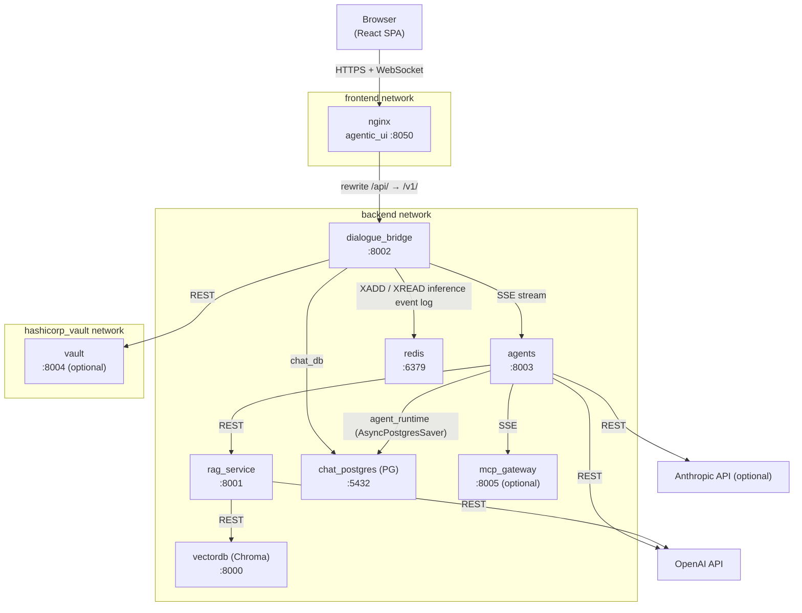
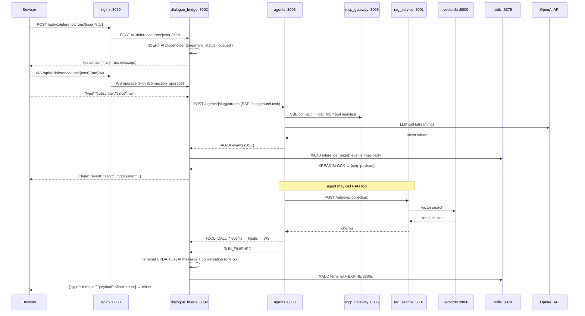

# Architecture Overview

This document describes the full mAgenticX platform: every service, its port, its responsibilities, how services talk to each other, and how the whole system is deployed.

---

## Services at a Glance

| Service | Container | Port | Technology |
| --- | --- | --- | --- |
| agentic_ui | `agentic_ui` | **8050** | React 18 + Vite, served by nginx |
| dialogue_bridge | `dialogue_bridge` | **8002** | FastAPI — BFF (backend-for-frontend) |
| agents | `agents` | **8003** | FastAPI — LangGraph + DeepAgents runtime |
| rag_service | `rag_service` | **8001** | FastAPI — Chroma vector retrieval + DuckDB SQL |
| vectordb | `vectordb` | **8000** | ChromaDB 0.6.3 — vector store |
| chat_postgres | `chat_postgres` | **5432** | PostgreSQL 16 + **pgvector** (`pgvector/pgvector:pg16`) — relational store (`chat_db` + `agent_runtime` DBs); pgvector backs per-message conversation embeddings |
| redis | `redis` | **6379** | Redis 7.4 — per-run Redis Streams as the inference event log |
| mcp_gateway | `mcp_gateway` | **8005** | Docker MCP Gateway — optional, via `docker-compose-mcp.yaml` |
| vault | `vault` | **8004** | HashiCorp Vault 1.21 — optional, via `docker-compose-hashicorp.yaml` |

The frontend Vite dev server (no nginx) uses **port 8080**.

---

## Full System Map



---

## Phase 1 — agentic_ui (Frontend)

The browser application is a React 18 SPA built with Vite and served in production by nginx. nginx is also the reverse proxy that routes browser API calls to `dialogue_bridge`.

### Responsibilities

- Renders the chat interface, sidebar, voice controls, and settings panels
- Manages client-side session state (localStorage `mx_auth_session` + IndexedDB `mx_ui_state`)
- Opens a WebSocket per active inference run to observe streaming events, with automatic reconnect + cursor-based replay on transient failures
- Initiates WebRTC signalling for realtime voice mode

### State architecture & routing

The chat workspace is a **layout-route shell + route views**, with shared state in a **Zustand store** (`src/agentic_ui/src/shared/stores/workspaceStore.ts`):

- **`ChatShell`** ([pages/ChatPage.tsx](../../src/agentic_ui/src/pages/ChatPage.tsx)) is the persistent shell — sidebar, search, profile/dialog modals, and the chrome. It renders `<Outlet/>` and **never unmounts** across the chat routes. All workspace logic (state, hooks, handlers, effects) lives in the `useChatWorkspace` hook it calls.
- **Route views** render in the Outlet: [`pages/ChatView.tsx`](../../src/agentic_ui/src/pages/ChatView.tsx) for `/` and `/c/:conversationId` (header + message body + composer), [`pages/TasksView.tsx`](../../src/agentic_ui/src/pages/TasksView.tsx) for `/tasks`. `SharedConvPage` renders the shell directly with `<ChatShell><ChatView/></ChatShell>` (the `children ?? <Outlet/>` slot) for full shared conversations.
- **`workspaceStore` (Zustand)** holds the shared reactive data (auth/user, agents, conversations + pagination, the open conversation, selected agent, preferences, tools/skills, sidebar/profile UI) with **setState-compatible setters**, so the existing hooks and `create*Handlers` factories consume them unchanged. Consumers subscribe with selectors. The store also carries the per-render **workspace bundle** (`workspace` slice) that `ChatShell` writes each render and the views read via `useChatWorkspaceContext()` — one state mechanism, no parallel React context.
- The **URL is the single source of truth** for the open conversation (see [conversation-management.md](../flows/conversation-management.md)). Voice mode is in-component state with no route.

### nginx Reverse Proxy

nginx is the only publicly exposed port (8050). It does three things:

1. **Serves the SPA** — all non-`/api/` routes return `index.html`
2. **Proxies API traffic** — `/api/` prefix is stripped; requests are forwarded to `dialogue_bridge:8002`
3. **Injects security headers** — sets `X-Trusted-Proxy-Secret` on every forwarded request so the backend can trust the caller

Key nginx settings:

- `client_max_body_size 50M` — supports attachment uploads
- `proxy_buffering off` — required for SSE and large file streaming
- WebSocket upgrade — a dedicated `^~ /api/v1/inference/runs/` location forwards `Upgrade`/`Connection: $connection_upgrade` and bumps `proxy_read_timeout`/`proxy_send_timeout` to 3600s for long-lived run observers
- `resolver 127.0.0.11` — deferred DNS resolution for Docker service names
- `proxy_set_header` chain — overwrites client IP headers with nginx `$remote_addr` before forwarding to the bridge

### Dev Mode

`vite.config.ts` configures a dev server on **port 8080** with HMR. The dev server also proxies `/api/` to `localhost:8002` so the frontend works without nginx during local development.

### Key Paths

| URL Pattern | Handler |
| --- | --- |
| `GET /` | nginx → SPA (`index.html`) |
| `GET /api/v1/*` | nginx → `dialogue_bridge:8002/v1/*` |

---

## Phase 2 — dialogue_bridge (BFF)

`dialogue_bridge` is the backend-for-frontend. Every browser request goes through it. It manages authentication, sessions, conversation persistence, and acts as a streaming proxy to the agents service.

### Responsibilities

- Authenticates users (Vault userpass → JWT access + refresh cookies)
- Manages conversations, messages, and attachments in PostgreSQL
- Persists the per-run AG-UI event log in Redis Streams (`inference:run:{id}:events`) and serves WebSocket observers with cursor-based replay
- Consumes the agents-service SSE stream from inside the detached `InferenceRunManager` task, accumulates the runtime state in memory, and appends each parsed event to Redis
- Handles voice signalling (WebRTC SDP exchange with OpenAI Realtime API)
- Serves TTS audio and dictation transcription
- Runs the **Scheduled Tasks** loop: a single `asyncio` task started in the FastAPI lifespan that claims due jobs (`SELECT ... FOR UPDATE SKIP LOCKED`) and fires them headlessly through the same inference pipeline. The bridge stays single-replica (the in-process `InferenceRunManager` already assumes it); the SKIP-LOCKED claim guards against the deploy-overlap double-fire.

### Router Structure

All routes are mounted under the `/v1/` prefix by FastAPI's app router.

| Router | Prefix | Key Endpoints |
| --- | --- | --- |
| `auth_router` | `/v1/auth` | `POST /login`, `GET /session`, `POST /session/refresh`, `POST /logout` |
| `inference_router` | `/v1/inference` | streaming run management, run status, cancellation |
| `speech_router` | `/v1/speech` | TTS streaming, dictation transcription |
| `voice_router` | `/v1/voice` | WebRTC SDP exchange for realtime voice |
| `catalog_router` | `/v1/catalog` | `GET /agents`, `GET /tools`, `GET /tools/search` |
| `preferences_router` | `/v1/preferences` | user voice/model/language preferences |
| `conversations_router` | `/v1/conversations` | create, list, get, update, delete, fork |
| `messages_router` | `/v1/messages` | message CRUD within conversations |
| `attachments_router` | `/v1/attachments` | upload, download, preview |
| `shared_conv_router` | `/v1/shared-conversations` | share snapshots (full / branch / message scope) |
| `search_router` | `/v1/search` | full-text search across conversations |
| `scheduled_tasks_router` | `/v1/scheduled-tasks` | list, create, update (pause/resume), delete scheduled tasks |

### Internal Trust Model

All backend-to-backend HTTP calls require the `X-Internal-Proxy-Secret` header (value from `TRUSTED_PROXY_SECRET` env var). The `require_internal_caller` FastAPI dependency validates this on every internal endpoint. nginx injects the header automatically for browser → bridge traffic. The bridge injects it manually when calling the agents service.

There is one **reverse hop**: the agents service calls the bridge's internal `POST /v1/internal/memory/search` for the `search_past_conversations` agent tool (the bridge owns the pgvector index — see [conversation-embeddings](../flows/conversation-embeddings.md)). Because nginx injects the proxy secret on *browser* traffic too, that endpoint is guarded by `require_internal_caller` **and** explicitly denied at the nginx edge (`location ^~ /api/v1/internal/ → 404`), so it is reachable only service-to-service on the `backend` network — never from a browser. The agents service authenticates with its existing internal client cert + proxy secret (no new credentials).

In production this application-layer credential is backed by **transport-layer mutual TLS** on the three HTTP service hops — `agentic_ui → dialogue_bridge`, `dialogue_bridge → agents`, and `agents → rag_service`. Each server requires a client certificate signed by the internal CA (`entrypoint-tls.sh` adds `--ssl-cert-reqs 2 --ssl-ca-certs ca.crt` to uvicorn when `REQUIRE_MTLS` is true, default `true`); each caller presents its own service cert (nginx `proxy_ssl_certificate`, Python services via httpx `cert=get_httpx_client_cert()`). So a peer is authenticated cryptographically by its cert, not only by the shared header. `chat_postgres`, `redis`, and `vault` stay password/token-over-verified-TLS (not mTLS); `agents → mcp_gateway` remains plaintext. `REQUIRE_MTLS=false` is the escape hatch and the zero-downtime rollout lever (deploy cert-presenting clients first, then flip enforcement on).

### Vault Integration

`dialogue_bridge` calls `vault:8004` to authenticate user credentials (userpass backend) **and** to sign the session JWTs via Vault's Transit engine — the RS256 private key never leaves Vault. The bridge authenticates to Vault as a machine via AppRole. Sessions are stateless: the bridge issues HttpOnly access + refresh cookies and verifies them per-request by signature against a cached public key (no DB or Vault call on the hot path). Vault is required for login/refresh, but not for verifying an already-issued token.

---

## Phase 3 — agents Service (Runtime)

`agents` is the LangGraph + DeepAgents execution engine. It streams AG-UI events back to `dialogue_bridge`, which re-streams them to the browser.

### Responsibilities

- Discovers and registers all agent classes at startup
- Runs inference for a given agent slug and conversation history
- Persists durable LangGraph checkpoints in its own `agent_runtime` Postgres database (a single process-wide `AsyncPostgresSaver` over a long-lived connection pool, opened in the FastAPI lifespan) so a branch's run state survives across turns and process restarts
- Integrates MCP tools from `mcp_gateway`
- Calls `rag_service` for retrieval and structured data queries
- Streams AG-UI protocol events over SSE

### Agent Registry

On startup, `_discover_agents()` scans two Python modules:

```text
src/agents/langgraph_agents/   ← LangGraphAgent subclasses
src/agents/deep_agents/        ← DeepAgent subclasses
```

Each discovered agent class is registered by its `agent_id` slug. The `DISABLED_AGENT_SLUGS` env var (comma-separated list) prevents specific agents from loading. Duplicate slugs raise an error at startup.

### Inference Endpoint

`POST /agents/{agent_slug}/stream` accepts the conversation context and streams the AG-UI event envelope (newline-delimited JSON). `dialogue_bridge` opens this SSE connection from a background asyncio task, decodes the events, accumulates them into an `InferenceRunRuntime`, and re-encodes them to the browser's SSE connection.

### MCP Tool Loading

At the start of each inference request, the agents service opens an SSE connection to `mcp_gateway:8005/sse`, fetches the tool manifest, caches it in `_MCP_TOOL_MANIFEST_CACHE`, and closes the connection after the request completes. The `mcp_session_context()` async context manager handles the lifecycle.

---

## Phase 4 — rag_service (Retrieval)

`rag_service` provides two retrieval backends: semantic vector search via ChromaDB, and structured SQL queries via DuckDB over Excel workbooks.

### Responsibilities

- Accepts retrieval requests from `agents`
- Performs cosine-similarity vector search against named Chroma collections
- Loads Excel workbooks at startup into DuckDB in-memory tables
- Validates and executes read-only SQL queries against those tables

### Endpoints

| Endpoint | Purpose |
| --- | --- |
| `POST /retrieve/{collection_name}` | Vector similarity search; returns top-k chunks with metadata |
| `GET /excel/{table_name}/schema` | Returns column names and types for a loaded workbook table |
| `POST /excel/{table_name}/query/sql` | Executes a validated read-only SELECT against the table |

### Embedding Model

All vector embeddings use OpenAI `text-embedding-3-large` (1536-dim). The model is configured via `OPENAI_API_KEY` and the same org/project settings as the agents service.

### SQL Validation

Every SQL query submitted to `/excel/.../query/sql` is validated before execution:

- Must be a single statement
- Must start with `SELECT` or `WITH` (after stripping whitespace)
- Must not contain forbidden tokens: `INSERT`, `UPDATE`, `DELETE`, `CREATE`, `DROP`, `ALTER`, `EXEC`, `EXECUTE`
- Must reference the requested table name

---

## Phase 5 — Infrastructure Services

### vectordb (ChromaDB)

ChromaDB runs as a standalone HTTP server on port 8000. `rag_service` connects to it via `chromadb.HttpClient`. Collections are pre-loaded from a persistent Docker volume mounted at `./vectorstores/chroma_db_openai/`. ChromaDB's own REST API is not exposed outside the `backend` Docker network.

### chat_postgres (PostgreSQL)

The image is **`pgvector/pgvector:pg16`** (official Postgres 16 + the `vector` extension; same PG16 base, so the data volume is unaffected by the swap from a stock `postgres:16` image). PostgreSQL runs **two databases on the same instance**:

- **`chat_db`** — all of `dialogue_bridge`'s relational data: users, sessions, conversations, messages (including `streaming_*` columns that carry the inference-run lifecycle, plus the `checkpoint_thread_id` / `checkpoint_id` lineage columns that map a branch onto its durable checkpoint), attachments, blobs, sharing metadata, reports, and the **`message_embeddings`** pgvector table (one embedding per message, powering semantic "most relevant conversations" search — see [conversation-embeddings](../flows/conversation-embeddings.md)). The bridge connects via SQLAlchemy (async) with `asyncpg`. The full schema is documented in `docs/architecture/database-schema.md`.
- **`agent_runtime`** — owned by the **agents** service, holding the LangGraph `AsyncPostgresSaver` checkpoint tables (managed entirely by `langgraph-checkpoint-postgres` via `.setup()`, advisory-locked, at agents-service startup). The agents service connects with `psycopg` over a `psycopg_pool.AsyncConnectionPool`. Threads persist indefinitely — no TTL — and are reaped only when a conversation is deleted.

The `agent_runtime` DB is created automatically on a fresh volume (dev: `chat_postgres` mounts `./postgres-init/create-agent-runtime.sql`); an **existing** volume needs a one-time manual `createdb -U admin agent_runtime` (dev) / `CREATE DATABASE agent_runtime` (prod) before the agents service can start.

### redis (Inference Event Log)

Redis 7.4 (alpine) backs the durable per-run AG-UI event log used by the WebSocket observer. `dialogue_bridge` writes each parsed AG-UI event into a per-run stream (`inference:run:{message_id}:events`) via `XADD … MAXLEN ~ 5000`; the WebSocket handler reads from that stream with `XREAD BLOCK`, replaying from the client's `since=<seq>` cursor on reconnect. On terminal status the stream key gets an `EXPIRE` (default 3600 s), so late reconnects can still replay missed events. The Redis service is reachable only via the `backend` Docker network; AUTH is enforced via the `magenticx_redis_password` Swarm secret (or `REDIS_PASSWORD` env var in local dev). Persistence is disabled — the authoritative final state lives in Postgres.

### mcp_gateway (Optional)

The MCP gateway is a Docker-hosted MCP server (from `ghcr.io/github/mcp-server-docker-remote` or similar) that wraps external MCP servers (Tavily, arxiv-mcp-server, etc.) into a single SSE endpoint. The agents service treats it as a single MCP origin. It is activated by including `docker-compose-mcp.yaml` in the compose invocation.

Tool catalog: `src/mcp_gateway/mcp_catalog.yaml`
Tool configuration: `src/mcp_gateway/mcp_config.yaml`
Secrets (API keys for MCP tools): `src/mcp_gateway/mcp_secret.env`

### vault (Optional)

HashiCorp Vault 1.21 issues short-lived JWT access tokens and manages the userpass authentication backend. It is activated by including `docker-compose-hashicorp.yaml`. `dialogue_bridge` calls `vault:8004` for login and token issuance; Vault is otherwise not visible to any other service.

---

## Phase 6 — Inter-Service Data Flows

### Request: User sends a chat message



### Request: Voice realtime session

```mermaid
sequenceDiagram
    participant B as Browser
    participant N as nginx :8050
    participant D as dialogue_bridge :8002
    participant O as OpenAI Realtime API

    B->>N: POST /api/v1/voice/session (SDP offer)
    N->>D: POST /v1/voice/session
    D->>O: POST /v1/realtime/sessions (session config)
    O-->>D: ephemeral token + SDP answer
    D-->>B: SDP answer
    Note over B,O: WebRTC P2P audio established
    B-->O: audio frames (WebRTC DataChannel / MediaStream)
    Note over B,D: bridge exits signalling; not in audio path
```

---

## Phase 7 — Deployment

### Docker Compose Layers

The platform uses a layered compose setup. Services are started by combining compose files:

```text
src/docker-compose.yaml              ← core: ui, bridge, agents, rag, chroma, postgres
src/docker-compose-mcp.yaml          ← optional: mcp_gateway
src/docker-compose-hashicorp.yaml    ← optional: vault
```

Example for full stack:

```bash
docker compose \
  -f src/docker-compose.yaml \
  -f src/docker-compose-mcp.yaml \
  -f src/docker-compose-hashicorp.yaml \
  up -d
```

### Docker Networks

| Network | Members |
| --- | --- |
| `backend` | dialogue_bridge, agents, rag_service, vectordb, chat_postgres, redis, mcp_gateway |
| `frontend` | agentic_ui, dialogue_bridge |
| `hashicorp_vault` | dialogue_bridge, vault |
| `mcp_net` | agents, mcp_gateway |

Only `agentic_ui` (port 8050) is bound to the host. All other services are internal.

### Key Environment Variables

| Variable | Used By | Purpose |
| --- | --- | --- |
| `OPENAI_API_KEY` | agents, rag_service | LLM + embedding API access |
| `OPENAI_ORG` / `OPENAI_PROJ` | agents, rag_service | OpenAI org/project scope |
| `EMBEDDING_MODEL` / `EMBEDDING_DIMENSIONS` | agents | Conversation-embedding model + dims served by `POST /embed` (default `text-embedding-3-small` / `1536`) |
| `EMBEDDINGS_ENABLED` | dialogue_bridge | Master switch for the embedding sweeper + semantic search (default `true`). Other `EMBEDDINGS_*` knobs tune batch size, sweep cadence, and result limits. |
| `ANTHROPIC_API_KEY` | agents | Claude model access (optional) |
| `DATABASE_URL` | dialogue_bridge | async PostgreSQL connection string |
| `DATABASE_POOL_SIZE` | dialogue_bridge | SQLAlchemy pool size |
| `SESSION_TOKEN_SECRET` | dialogue_bridge | General-purpose HMAC key (e.g. DOCX-preview tokens); not used for auth sessions |
| `JWT_ACCESS_TTL_SECONDS` | dialogue_bridge | Access JWT lifetime (default 28800 / 8 h) |
| `JWT_REFRESH_TTL_SECONDS` | dialogue_bridge | Refresh JWT absolute lifetime (default 864000 / 10 d) |
| `TRUSTED_PROXY_SECRET` | all services | Internal service authentication |
| `LOG_REDACTION_SECRET_FILE` / `LOG_REDACTION_SECRET` | dialogue_bridge, agents, rag_service | Shared HMAC key (Swarm `magenticx_log_redaction_secret`) for hashing `user_id`/`session_id`/`client_ip` in logs. Same key across services so hashes correlate; falls back to a random per-process key if unset (correlation disabled). See [observability](../development/observability.md). |
| `LOG_LEVEL` / `LOG_FORMAT` | all Python services | Log verbosity (default `INFO`) and output mode (`json` in prod, `console` in dev) |
| `REQUIRE_TLS` | agents, rag_service, dialogue_bridge, chat_postgres, agentic_ui | TLS-entrypoint gate; defaults to `true` (fail closed — refuse to start in plaintext if certs are missing/unreadable). Set `false` only as an emergency escape hatch. Not used in local dev (the TLS entrypoints are a prod-only override). |
| `REQUIRE_MTLS` | agents, rag_service, dialogue_bridge | Mutual-TLS gate on the HTTP service hops; defaults to `true` (uvicorn requires a CA-signed client cert). Set `false` as the emergency escape hatch / zero-downtime rollout lever. Prod-only (TLS entrypoints don't run in local dev). |
| `INTERNAL_CLIENT_CERT_PATH` / `INTERNAL_CLIENT_KEY_PATH` | agents, dialogue_bridge | Client cert + key the service presents on outbound internal calls (mTLS). Unset in local dev → no client cert. |
| `VAULT_URL` | dialogue_bridge | HashiCorp Vault base URL (required for login + JWT signing) |
| `VAULT_ROLE_ID_FILE` / `VAULT_ROLE_ID` | dialogue_bridge | AppRole role id for the bridge's Vault identity (file-mounted Swarm secret in prod) |
| `VAULT_SECRET_ID_FILE` / `VAULT_SECRET_ID` | dialogue_bridge | AppRole secret id; pairs with the role id |
| `VAULT_TRANSIT_JWT_KEY` | dialogue_bridge | Transit key that signs session JWTs (default `jwt-rs256`) |
| `REDIS_URL` | dialogue_bridge | Redis connection URL (default `redis://redis:6379/0`) |
| `REDIS_PASSWORD_FILE` / `REDIS_PASSWORD` | dialogue_bridge, redis | Redis AUTH password (file-mounted secret in prod, env var in local dev) |
| `REDIS_STREAM_MAXLEN` | dialogue_bridge | Approximate cap on the per-run event stream (default 5000) |
| `REDIS_STREAM_TERMINAL_TTL_SECONDS` | dialogue_bridge | Replay window after a run ends (default 3600) |
| `REDIS_STREAM_READ_BLOCK_MS` | dialogue_bridge | `XREAD BLOCK` timeout in ms (default 30000) |
| `INFERENCE_WS_SUBSCRIBE_TIMEOUT_SECONDS` | dialogue_bridge | Wait for the WS subscribe frame before closing (default 10) |
| `ATTACHMENT_MAX_SIZE_BYTES` / `ATTACHMENT_MAX_TOTAL_BYTES` / `ATTACHMENT_MAX_PER_MESSAGE` | dialogue_bridge | Per-file, per-message-total, and count limits for attachments (defaults 25 MB / 25 MB / 10) |
| `ATTACHMENT_DOCX_PREVIEW_TOKEN_TTL_SECONDS` | dialogue_bridge | Lifetime of the Office-viewer preview token (default 60) |
| `ATTACHMENT_INLINE_CACHE_MAX_AGE_SECONDS` | dialogue_bridge | `Cache-Control: max-age` for inline blob previews (default 300) |
| `ATTACHMENT_STREAM_CHUNK_BYTES` | dialogue_bridge | Blob streaming chunk size (default 524288) |
| `SPEECH_DICTATION_READ_CHUNK_BYTES` | dialogue_bridge | Dictation upload read-chunk size (default 1 MB) |
| `SHARE_DEFAULT_TTL_DAYS` / `SHARE_MAX_TTL_DAYS` | dialogue_bridge | Default and maximum share-link lifetime (defaults 30 / 365) |
| `GENERATION_TITLE_MAX_LEN` / `GENERATION_TITLE_MIN_CANDIDATES` | dialogue_bridge | Title-generation length cap and minimum usable candidates (defaults 120 / 3) |
| `GENERATION_SUGGESTION_MAX_LEN` / `GENERATION_SUGGESTION_MIN_CANDIDATES` / `GENERATION_SUGGESTION_COUNT` | dialogue_bridge | Suggestion length cap, minimum candidates, and returned count (defaults 160 / 6 / 10) |
| `GENERATION_SUGGESTION_RECENT_CONTEXT_COUNT` | dialogue_bridge | Recent conversations sampled for suggestion context (default 8) |
| `HTTP_<PROFILE>_{CONNECT,READ,WRITE,POOL}_SECONDS` | dialogue_bridge | Upstream httpx timeouts per profile (`AGENTS`, `GENERATION`, `SKILLS`, `VOICE`, `INFERENCE`) |
| `MCP_GATEWAY_URL` | agents | MCP gateway SSE endpoint |
| `RAG_BASE_URL` | agents | RAG service base URL |
| `AGENT_RUNTIME_DATABASE_URL` | agents | psycopg conninfo for the `agent_runtime` checkpoint DB (password-less in prod — TLS + password auto-injected by settings) |
| `AGENT_RUNTIME_DATABASE_PASSWORD_FILE` | agents | File-mounted Postgres password (Swarm `postgres_password` secret) injected into `AGENT_RUNTIME_DATABASE_URL` at settings load; unset in local dev |
| `AGENT_RUNTIME_SETUP_ON_STARTUP` | agents | Run the checkpointer `.setup()` (table create/migrate) at startup; defaults `true` |
| `LANGGRAPH_STRICT_MSGPACK` | agents | Strict msgpack (de)serialization for checkpoint payloads; defaults `true` |
| `LANGGRAPH_AES_KEY_FILE` | agents | File-mounted AES key (Swarm `agent_runtime_aes_key` secret) enabling at-rest `EncryptedSerializer` for checkpoints; empty/unset disables encryption (local dev) |
| `AGENTS_SERVICE_URL` | dialogue_bridge | Agents runtime base URL |
| `DISABLED_AGENT_SLUGS` | agents | Comma-separated slugs to skip at startup |
| `REALTIME_SUPPORTED_VOICES` | agents | Comma-separated allowed realtime voices (defaults to the OpenAI set) |
| `OPENAI_REALTIME_API_URL` | agents | OpenAI Realtime calls endpoint (default `https://api.openai.com/v1/realtime/calls`) |
| `REALTIME_{CONNECT,READ,WRITE,POOL}_TIMEOUT_SECONDS` | agents | Realtime-session httpx timeouts (defaults 15 / 60 / 60 / 15) |
| `REALTIME_ERROR_BODY_MAX_CHARS` | agents | Cap on logged upstream error-body length (default 1000) |
| `TITLE_CANDIDATE_COUNT` / `TITLE_MIN_CANDIDATES` / `TITLE_MAX_LEN` | agents | Title generation: requested count (also templated into the prompt), minimum usable, char cap (defaults 4 / 3 / 120) |
| `TITLE_TEMPERATURE` / `TITLE_MAX_TOKENS` | agents | Title model sampling params (defaults 1.0 / 128) |
| `SUGGESTION_COUNT` / `SUGGESTION_MAX_LEN` | agents | Suggestion count (also templated into the prompt) and char cap (defaults 10 / 160) |
| `SUGGESTION_TEMPERATURE` / `SUGGESTION_MAX_TOKENS` | agents | Suggestion model sampling params (defaults 0.8 / 320) |
| `CORS_ALLOWED_ORIGINS` | dialogue_bridge | Allowed browser origins |

---

## Sharp Edges and Behavioral Notes

- **nginx is the only public port.** Every browser request enters through port 8050. Nothing else should be exposed to the host in production. Exposing `dialogue_bridge:8002` or `agents:8003` directly bypasses the proxy-secret injection and breaks the trust model.

- **`TRUSTED_PROXY_SECRET` must match across all services.** The bridge and agents both validate this header. A mismatch causes 403 errors on all agent inference calls. Vault does not use this header — it has its own authentication.

- **Agent inference is always a detached background task.** `dialogue_bridge` spawns an asyncio task to stream from `agents`. If the browser disconnects, the task runs to completion (the inference run is still persisted). Cancellation requires an explicit API call to the cancellation endpoint, which sends a cancellation signal to the running graph.

- **mcp_gateway is per-request, not per-session.** The agents service opens and closes an SSE connection to `mcp_gateway` on every inference request. The tool manifest is cached in memory (`_MCP_TOOL_MANIFEST_CACHE`) across requests within the same process.

- **ChromaDB collections must exist before the rag_service starts.** The rag_service does not create collections — it reads them from the persistent volume. Missing collections cause retrieval errors at inference time, not at startup.

- **DuckDB tables are loaded at rag_service startup.** Excel files in the `data/` directory are loaded once into in-memory DuckDB tables. Adding or removing workbooks requires restarting the rag_service container.

- **WebRTC audio never touches the bridge.** After the SDP exchange, all audio flows directly between the browser and OpenAI's Realtime API. The bridge is not in the media path and has no visibility into the audio stream.

- **Vault is required for auth and is the JWT signer.** The bridge verifies credentials (userpass) and signs every session JWT via Vault Transit (private key never leaves Vault). Per-request verification is signature-only against a cached public key, so Vault being down does not affect already-issued tokens — only new logins/refreshes fail. There is no local-signing fallback.

- **Postgres is the only stateful service in the core compose.** ChromaDB state lives in a Docker volume (`./vectorstores/chroma_db_openai/`). PostgreSQL state lives in a named volume (`chat_postgres_data`). Both must be backed up for full disaster recovery.

- **The agents service holds no in-process conversation state, but it is no longer stateless across turns.** No per-conversation Python state lives in the agents process between requests, but graph state is now persisted durably in the `agent_runtime` Postgres checkpoint DB keyed by a per-branch `thread_id`. As a result the bridge no longer re-sends the full message history every turn for a branch with a committed checkpoint — on a continue it sends only the new user message plus the branch's `checkpoint_thread_id` and the agent resumes from its durable checkpoint (full history is sent only as the cold-seed path when a branch has no committed checkpoint yet). See [inference-streaming.md](../flows/inference-streaming.md).

- **The agents service now depends on Postgres at startup.** Its lifespan opens the `AsyncPostgresSaver` connection pool and runs `.setup()` before serving; the dev compose adds `depends_on: chat_postgres` to the agents service. If the `agent_runtime` DB does not exist (existing volume, missing one-time `createdb`), the agents service fails to start.

---

## File Map

| Concept | File | What to look for |
| --- | --- | --- |
| Core compose (services, networks, volumes) | [src/docker-compose.yaml](../../src/docker-compose.yaml) | port bindings, environment variable names, volume mounts |
| MCP gateway compose | [src/docker-compose-mcp.yaml](../../src/docker-compose-mcp.yaml) | mcp_gateway service definition, mcp_net network |
| Vault compose | [src/docker-compose-hashicorp.yaml](../../src/docker-compose-hashicorp.yaml) | vault service definition, hashicorp_vault network |
| nginx config template | [src/agentic_ui/nginx.conf.template](../../src/agentic_ui/nginx.conf.template) | proxy_pass rules, header injection, buffer settings |
| Vite dev config | [src/agentic_ui/vite.config.ts](../../src/agentic_ui/vite.config.ts) | dev server port, API proxy target |
| dialogue_bridge FastAPI app | [src/dialogue_bridge/main.py](../../src/dialogue_bridge/main.py) | router registrations, middleware, startup events |
| dialogue_bridge settings | [src/dialogue_bridge/core/settings.py](../../src/dialogue_bridge/core/settings.py) | all env vars consumed by the bridge |
| Agents FastAPI app | [src/agents/main.py](../../src/agents/main.py) | router registrations, startup agent discovery |
| Agents settings | [src/agents/core/settings.py](../../src/agents/core/settings.py) | LLM API keys, RAG URL, MCP URL, disabled slugs |
| Agent discovery | [src/agents/utils/agents.py](../../src/agents/utils/agents.py) | `_discover_agents()`, `DISABLED_AGENT_SLUGS` |
| RAG service app | [src/rag_service/main.py](../../src/rag_service/main.py) | endpoint definitions, DuckDB table loading |
| RAG settings | [src/rag_service/core/settings.py](../../src/rag_service/core/settings.py) | Chroma host/port, proxy secret |
| Internal proxy trust | [src/dialogue_bridge/core/security/internal_trust.py](../../src/dialogue_bridge/core/security/internal_trust.py) | `require_internal_caller` dependency |
| MCP tool catalog | [src/mcp_gateway/mcp_catalog.yaml](../../src/mcp_gateway/mcp_catalog.yaml) | list of registered MCP servers |
| Frontend API client | [src/agentic_ui/src/shared/lib/api/](../../src/agentic_ui/src/shared/lib/api/) | all REST call definitions, base URL construction |
| Frontend constants | [src/agentic_ui/src/shared/lib/consts/](../../src/agentic_ui/src/shared/lib/consts/) | `API_BASE`, feature flags |
