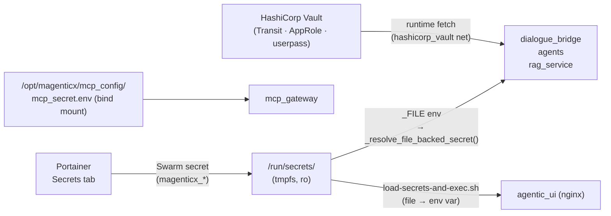

# Secrets — What Each One Is and Where It Belongs

Every sensitive value the production stack needs is delivered as a **file**, never as a plaintext environment variable in the compose YAML or the Portainer "Environment variables" dropdown. The core stack uses **Docker Swarm secrets** (namespaced `magenticx_*`, mounted read-only at `/run/secrets/<alias>` on a tmpfs); the MCP gateway uses a **bind-mounted `.env` file**; and the user-facing auth flow fetches its material from **HashiCorp Vault** at runtime. This document is the authoritative inventory of every secret across the four `docker-compose-denis*.y*ml` files — what it is, which services consume it, and what breaks without it. It does **not** contain any secret values; those live only in Portainer's Secrets tab, Vault, or the operator's offline notes.

---

## Services Involved

---

## How a secret reaches a service

There are four delivery paths; a single service may use more than one.

| Mechanism | Used by | How it works |
| --- | --- | --- |
| **Swarm secret → `*_FILE` env** | the three Python services | The compose `secrets:` list mounts `/run/secrets/<alias>`. A `<NAME>_FILE` env var points at that path; `_resolve_file_backed_secret()` in each `core/settings.py` reads the file, strips it, and feeds the value into a Pydantic `SecretStr`. If `*_FILE` is unset it falls back to the plain env var (this is what local `.env` dev uses). |
| **Swarm secret → env via shim** | `agentic_ui` (nginx) | nginx's `envsubst` can only read env vars, not files. `load-secrets-and-exec.sh` reads `/run/secrets/trusted_proxy_secret` into `$TRUSTED_PROXY_SECRET`, then exec's the TLS entrypoint. |
| **Swarm secret → file path in config** | `chat_postgres`, `redis`, `grafana`, `alertmanager` | The service's own config consumes the file directly: Postgres `POSTGRES_PASSWORD_FILE`, Redis `$(cat /run/secrets/redis_password)` in its command, Grafana `GF_SECURITY_ADMIN_PASSWORD__FILE`, Alertmanager `password_file:` in `alertmanager.yml`. |
| **Bind-mounted file** | `mcp_gateway` | The gateway is plain `docker compose` (not Swarm), so it can't use Swarm secrets. Upstream MCP-server API keys live in `mcp_secret.env`, bind-mounted and passed via `--secrets`. |
| **Vault runtime fetch** | `dialogue_bridge` | The bridge authenticates to Vault with its AppRole identity (role/secret id come from Swarm secrets) and uses the Transit engine to sign/verify session JWTs. The signing key never leaves Vault. |

The in-container **alias** (e.g. `openai_api_key`) is intentionally fixed so application code never changes when the external Swarm name is bumped during rotation.

---

## Core stack secrets — `docker-compose-denis.yaml`

Nine Swarm secrets, declared at the bottom of the compose with `external: true` and a `magenticx_`-prefixed `name:`. The alias column is both the `secrets:` entry name and the `/run/secrets/<alias>` path.

| External Swarm name | Alias / path | Resolved via | Consumed by | Purpose / functionality |
| --- | --- | --- | --- | --- |
| `magenticx_openai_api_key` | `openai_api_key` | `OPENAI_API_KEY_FILE` | `rag_service`, `agents` | OpenAI key for embeddings (rag), every LLM/agent call, and STT / TTS / realtime voice. |
| `magenticx_trusted_proxy_secret` | `trusted_proxy_secret` | `TRUSTED_PROXY_SECRET_FILE` (Python); shim (nginx) | `rag_service`, `agents`, `dialogue_bridge`, `agentic_ui` | The internal-caller shared secret sent as the `X-Internal-Proxy-Secret` header. `require_internal_caller` validates it on every internal hop; the UI's nginx injects it. **Missing it = 403 on all internal calls, and the Python services refuse to start.** |
| `magenticx_session_token_secret` | `session_token_secret` | `SESSION_TOKEN_SECRET_FILE` | `dialogue_bridge` | General-purpose HMAC key (e.g. short-lived DOCX-preview tokens). **No longer the auth-session secret** — auth is now stateless Vault-signed JWTs. |
| `magenticx_redis_password` | `redis_password` | `REDIS_PASSWORD_FILE` (bridge); `cat` in command (redis) | `dialogue_bridge`, `redis` | Redis AUTH password. Redis holds the per-run inference event-log streams; the bridge reads/writes them over `rediss://`. |
| `magenticx_postgres_password` | `postgres_password` | `POSTGRES_PASSWORD_FILE` (pg); `DATABASE_PASSWORD_FILE` (bridge); `AGENT_RUNTIME_DATABASE_PASSWORD_FILE` (agents) | `chat_postgres`, `dialogue_bridge`, `agents` | Password for the `admin` Postgres role. The bridge connects to `chat_db`; agents connects to the separate `agent_runtime` DB (LangGraph checkpointer) on the same instance. Spliced into each password-less `DATABASE_URL` at settings load. |
| `magenticx_agent_runtime_aes_key` | `agent_runtime_aes_key` | `LANGGRAPH_AES_KEY_FILE` | `agents` | AES key for the LangGraph `EncryptedSerializer` — at-rest encryption of checkpoint blobs in `agent_runtime`. Empty ⇒ no encryption, so this is what makes stored conversation state ciphertext. |
| `magenticx_log_redaction_secret` | `log_redaction_secret` | `LOG_REDACTION_SECRET_FILE` | `dialogue_bridge`, `agents`, `rag_service` | Shared HMAC key so the hashed `client_ip` (`h:<16hex>`) correlates across services. Absent ⇒ each process falls back to a random per-process key (correlation degrades, logs stay private). See [observability.md](../development/observability.md). |
| `magenticx_vault_role_id` | `vault_role_id` | `VAULT_ROLE_ID_FILE` | `dialogue_bridge` | AppRole **role id** — the bridge's Vault machine identity. Used to sign session JWTs via Transit and read the verification public key. |
| `magenticx_vault_secret_id` | `vault_secret_id` | `VAULT_SECRET_ID_FILE` | `dialogue_bridge` | AppRole **secret id** — pairs with the role id to authenticate to Vault. |

> `dialogue_bridge`, `agents`, and `rag_service` **refuse to start** without `trusted_proxy_secret`. Outside `development`/`test`, the bridge additionally requires `VAULT_URL` + `vault_role_id` + `vault_secret_id` (stateless JWT auth) and a `session_token_secret`.

---

## Monitoring stack secrets — `docker-compose-denis-monitoring.yml`

Two Swarm secrets, in their own Portainer stack (`magenticx_monitoring`).

| External Swarm name | Alias / path | Resolved via | Consumed by | Purpose / functionality |
| --- | --- | --- | --- | --- |
| `magenticx_grafana_admin_password` | `grafana_admin_password` | `GF_SECURITY_ADMIN_PASSWORD__FILE` | `grafana` | Grafana admin login password. The admin username comes from the non-secret `GRAFANA_USER` stack env var. **Only seeds on first `grafana-data` volume init** — changing it later requires wiping the volume or resetting in-app. |
| `magenticx_alert_smtp_password` | `alert_smtp_password` | `password_file:` in `alertmanager.yml` | `alertmanager` | SMTP password so Alertmanager can email alerts to the configured recipient (host/from/to are set in `alertmanager.yml`). |

---

## MCP gateway secret — `docker-compose-denis-mcp.yaml`

The MCP gateway runs as **plain `docker compose`** (the dind variant can't run under Swarm), so it cannot consume Swarm secrets. Its upstream API keys are a bind-mounted file.

| Source file (on VM) | Mount → flag | Consumed by | Purpose / functionality |
| --- | --- | --- | --- |
| `/opt/magenticx/mcp_config/mcp_secret.env` | `→ /app/mcp_secret` (`--secrets`) | `mcp_gateway` | API keys for the upstream MCP servers the gateway spawns (e.g. the **Tavily** API key for web search; `arxiv-mcp-server` needs none). The gateway injects these into the per-server containers it launches. |

> Treat `mcp_secret.env` like any other secret: `chmod 600`, never commit it. It is the one secret in the production stack not managed by Swarm, so it won't appear in Portainer's Secrets tab.

---

## Vault — the secret store itself — `docker-compose-denis-hashicorp.yaml`

The Vault stack declares **no `secrets:` block** because Vault *is* the secret store. The material below lives inside Vault (or is produced when initializing it) and is **not** a Docker secret. It is reached over the `hashicorp_vault` overlay network.

| Secret material | Where it lives | Purpose / functionality |
| --- | --- | --- |
| **Unseal keys (Shamir, 2-of-3)** | Produced by `vault operator init`; held **offline** by the operator | Required to unseal Vault after every restart. Not stored anywhere in the stack — losing them (with Vault sealed) means the auth backend is unrecoverable. |
| **Initial root token** | Produced by `vault operator init` | Bootstrap admin token for first-time config (Transit, AppRole, userpass). Should be revoked/rotated after setup; not used at runtime. |
| **Transit key `jwt-rs256`** | Inside Vault (Transit engine) | The RSA private key that signs session JWTs. **Never leaves Vault** — the bridge calls Transit to sign and to fetch the public verification key. |
| **AppRole `magenticx-bridge`** | Inside Vault (AppRole auth) | The bridge's machine identity. Its `role_id`/`secret_id` are surfaced to the bridge as the two `magenticx_vault_*` Swarm secrets above. |
| **userpass user credentials** | Inside Vault (userpass auth) | The login identity provider — each end user's username/password. Validated by the bridge during `login`. (Entra/OIDC is a later phase.) |

The Vault server's own TLS key (`/opt/vault/tls/tls.key`) is private material too — see the next section.

---

## TLS private keys — bind-mounted, not Swarm secrets

Every service authenticates with an internal CA-signed certificate. The **private keys** are sensitive but are delivered as bind-mounted files from `/opt/magenticx/<service>/tls/` (and `/opt/vault/tls/`), not as Swarm secrets, because the TLS entrypoints need them on a predictable path before the app starts.

| File | Sensitivity | Notes |
| --- | --- | --- |
| `tls.key` / `server.key` | **Private** (mode `600`, owner UID 1000) | Per-service private key. An unreadable key under the fail-closed `REQUIRE_TLS=true` crash-loops the container — see the production TLS file-permissions guidance. |
| `tls.crt` / `server.crt` | Public | The service's certificate. |
| `ca.crt` | Public | The shared internal CA used to verify peers (and, under mTLS, client certs). |

Rotation of a key/cert is a file copy + `chown 1000:1000` + container restart — never replace a key in place while the container runs.

---

## Sharp Edges and Operational Notes

- **Never put a secret value in the Portainer "Environment variables" dropdown.** That field is for non-sensitive config only (log level, feature flags). Secrets go in the **Secrets** sub-tab and are referenced by `external: true` name.
- **Swarm secrets are immutable — rotation uses a versioned name + fixed alias.** Bump the `name:` (e.g. `magenticx_openai_api_key_2026q3`), keep the alias (`openai_api_key`) constant, create the new secret in Portainer, redeploy (rolling update), then delete the old one. Application code never changes because `/run/secrets/openai_api_key` is stable.
- **`POSTGRES_PASSWORD_FILE` only takes effect on first data-dir init.** To move an existing cluster onto the secret, `ALTER USER admin WITH PASSWORD '<new>'` from the container console **before** deploying the revision that switches the bridge/agents to the file-backed password.
- **An unreadable `*_FILE` is fail-loud.** `_resolve_file_backed_secret()` raises if the `*_FILE` path is set but unreadable, rather than silently falling through to a plain env var — so a permission slip surfaces as a startup crash, not a silent wrong-value boot.
- **The log-redaction secret is fail-safe, not fail-loud.** Without it each service hardens to a random per-process key; logs stay private but the `client_ip` hash stops correlating across services/restarts. Provision it.
- **Blast radius, highest first:** `magenticx_postgres_password` (all chat + agent state), the Vault unseal keys / Transit key (every session JWT), `magenticx_openai_api_key` (cost + data egress), `magenticx_trusted_proxy_secret` (internal trust boundary), `magenticx_agent_runtime_aes_key` (checkpoint confidentiality). Rotate these first on any suspected exposure.
- **Local dev needs none of this.** With no `*_FILE` vars set, settings fall back to plain env vars from `src/.env`, and the dev defaults fill in the rest (random session/redaction secrets, no Vault). See `CLAUDE.md` § Local Development Setup.

---

## File Map

| Concept | File | What to look for |
| --- | --- | --- |
| Core stack secret declarations | [src/docker-compose-denis.yaml](../../src/docker-compose-denis.yaml) | top-level `secrets:` block, per-service `secrets:` lists |
| Monitoring stack secrets | [src/docker-compose-denis-monitoring.yml](../../src/docker-compose-denis-monitoring.yml) | `grafana_admin_password`, `alert_smtp_password` |
| MCP gateway secret file | [src/docker-compose-denis-mcp.yaml](../../src/docker-compose-denis-mcp.yaml) | `--secrets` flag + `mcp_secret.env` bind mount |
| Vault server | [src/docker-compose-denis-hashicorp.yaml](../../src/docker-compose-denis-hashicorp.yaml) | listener TLS, raft storage; Transit/AppRole set up via `src/vault/` |
| File-backed secret resolution | [src/dialogue_bridge/core/settings.py](../../src/dialogue_bridge/core/settings.py) | `_resolve_file_backed_secret` |
| nginx secret shim | [src/agentic_ui/load-secrets-and-exec.sh](../../src/agentic_ui/load-secrets-and-exec.sh) | `/run/secrets/trusted_proxy_secret` → env |
| Vault setup scripts | [src/vault/](../../src/vault/) | Transit + AppRole + userpass init, RBAC scripts |
| Env var reference | [docs/architecture/configuration.md](configuration.md) | which env var points at each secret |
