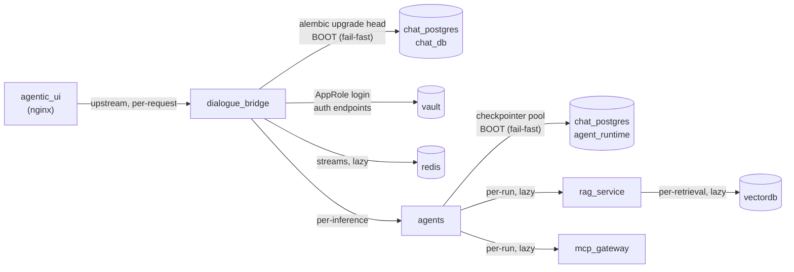

# Service Startup — Minimum Requirements to Boot

This document answers one question per service: **what does it absolutely need in order to start?** It is the operational companion to [configuration.md](configuration.md) — where that doc is the exhaustive *"everything you can tune"* reference, this one is the short *"the boot fails without these"* list. Three of the services are FastAPI/uvicorn apps whose `core/settings.py` validates its inputs at import time (a missing required secret raises before the server ever binds a port), and whose FastAPI **lifespan** then connects to the data stores it cannot run without (fail-fast, so the container crash-loops until the dependency is reachable rather than serving in a broken state). The infrastructure services (Postgres, Redis, Chroma, nginx, Vault) start from image defaults plus a handful of command flags and the fail-closed TLS entrypoints. Everything a service needs at boot falls into one of the three gate types in the legend below; everything *else* it talks to is connected lazily and only degrades a feature, not the boot.

---

## Services Involved

Note: in Swarm there is **no `depends_on` ordering** — every service may start in any order. Services that need a dependency at boot **fail fast and let Swarm restart them** until the dependency is up; they do not block-wait. So "X needs Y at boot" means "X crash-loops until Y is reachable," not "Swarm starts Y first."

---

## How to read the gate types

Each requirement below is tagged with how it blocks startup:

| Gate | Symbol | What happens if it's missing | When it fires |
| --- | --- | --- | --- |
| **Hard config gate** | 🔴 | A `model_validator` in `core/settings.py` raises. The process **never starts** — uvicorn doesn't bind. | At settings import (instant). |
| **Boot dependency** | 🟠 | The FastAPI lifespan tries to connect and **fails fast**; the container exits non-zero and Swarm restarts it on a loop. | During lifespan, before serving. |
| **Fail-closed transport** | 🔒 | An `entrypoint-*.sh` refuses to start the server because a cert/key/CA is missing or unreadable (`REQUIRE_TLS`/`REQUIRE_MTLS` default `true`). | Before the app process even launches. |
| **Lazy / runtime** | 🟢 | Boot succeeds; the dependency is only contacted when a request needs it. Its absence degrades **one feature**, not the service. | On first request that uses it. |

The "Configure via" column links to the exact section of [configuration.md](configuration.md).

---

## dialogue_bridge

The BFF has the largest boot surface — it is the only service that is both an auth authority (needs Vault) and the schema owner (runs migrations).

| Requirement | Gate | Why it blocks startup | Configure via |
| --- | --- | --- | --- |
| `TRUSTED_PROXY_SECRET` | 🔴 | `_finalize_secrets` raises: *"Refusing to start without an internal-caller shared secret."* | [Proxy trust & logging](configuration.md#proxy-trust--logging) |
| `DATABASE_URL` | 🔴 | The field is `Field(...)` — **no default**. Pydantic raises at import if unset. (Password may come from `DATABASE_PASSWORD_FILE`.) | [Database](configuration.md#database-databasesettings) |
| `VAULT_URL` + `VAULT_ROLE_ID` + `VAULT_SECRET_ID` | 🔴 | **Outside `development`/`test` only.** Stateless JWT auth is signed via Vault Transit, so the AppRole identity is mandatory in prod — `_finalize_secrets` raises listing whichever is missing. | [Vault](configuration.md#vault-vaultsettings--stateless-jwt-auth) |
| `SESSION_TOKEN_SECRET` | 🔴 | **Outside `development`/`test` only.** Raises if empty (dev auto-generates a random one). General-purpose HMAC key — DOCX-preview tokens + log-redaction fallback. | [Session & cookies](configuration.md#session--cookies-sessionsettings) |
| `chat_postgres` (`chat_db`) reachable | 🟠 | The lifespan runs `alembic upgrade head` in a subprocess **before serving** (unless `RUN_MIGRATIONS_ON_STARTUP=false`). If Postgres is down, migrations fail and boot aborts. | [App & lifecycle](configuration.md#app--lifecycle) |
| TLS cert/key (+ CA for mTLS) | 🔒 | `REQUIRE_TLS`/`REQUIRE_MTLS` default `true`; `entrypoint-tls.sh` refuses to start if the cert/key/CA is missing or unreadable. | [Deploy-time safety toggles](configuration.md#deploy-time-safety-toggles-cross-service) |
| JWT TTLs / CORS in range | 🔴 | Out-of-range `JWT_*_TTL_SECONDS` raise; `CORS_ALLOWED_ORIGINS` with `*` while credentials on raises. Validated, not clamped. | [JWT](configuration.md#jwt-jwtsettings) · [CORS](configuration.md#cors-corssettings) |
| **Vault** reachable | 🟢 | Not a boot gate — the AppRole login happens on the auth path. The stack boots without Vault, but `login`/`refresh` return 500 until it's up. | [Vault](configuration.md#vault-vaultsettings--stateless-jwt-auth) |
| **Redis** reachable | 🟢 | Connected lazily for the per-run event streams. Boot succeeds; inference streaming fails if Redis is down. | [Redis](configuration.md#redis-redissettings) |
| **agents** service reachable | 🟢 | Contacted per-inference only. | [Upstream, inference, rate limits](configuration.md#upstream-inference-rate-limits) |

**Minimum to boot (prod):** `TRUSTED_PROXY_SECRET`, `DATABASE_URL` (+ DB password secret), Vault AppRole trio, `SESSION_TOKEN_SECRET`, a reachable `chat_db`, and valid TLS material. In **dev/test**, only `TRUSTED_PROXY_SECRET` + `DATABASE_URL` are hard gates (Vault/session secrets auto-fallback, TLS entrypoints aren't used).

---

## agents

The LangGraph + DeepAgents runtime. Smaller config surface, but it has a **hard boot dependency on its own database** — the durable checkpointer.

| Requirement | Gate | Why it blocks startup | Configure via |
| --- | --- | --- | --- |
| `TRUSTED_PROXY_SECRET` | 🔴 | `_require_proxy_secret` raises — same internal-caller gate as the other Python services. | [Proxy trust, logging & redaction](configuration.md#proxy-trust-logging--redaction) |
| `chat_postgres` (`agent_runtime`) reachable | 🟠 | The lifespan calls `_init_durable_checkpointer`, which opens the `AsyncPostgresSaver` psycopg pool and (by design) **fails fast and loud** if `agent_runtime` is unreachable. It even creates the DB if missing, then runs `setup()` DDL when `AGENT_RUNTIME_SETUP_ON_STARTUP=true`. No checkpointer ⇒ no boot. | [Durable checkpointer](configuration.md#durable-checkpointer-checkpointersettings) |
| TLS cert/key (+ CA for mTLS) | 🔒 | `REQUIRE_TLS`/`REQUIRE_MTLS` default `true`; the entrypoint refuses to start without readable certs. The checkpointer URL also auto-appends `sslmode=verify-full` when `INTERNAL_CA_CERT_PATH` is set. | [Deploy-time safety toggles](configuration.md#deploy-time-safety-toggles-cross-service) |
| `OPENAI_API_KEY` | 🟢* | **Not** a startup raise — the field tolerates empty. But every agent run, title, suggestion, and voice call needs it, so it is *functionally* required. Treat as mandatory in any real deployment. | [App, API keys, RAG, MCP](configuration.md#app-api-keys-rag-mcp) |
| **rag_service** reachable | 🟢 | Only the HR/Orthodox/Retail workflow agents call it, per-run. | [App, API keys, RAG, MCP](configuration.md#app-api-keys-rag-mcp) |
| **mcp_gateway** reachable | 🟢 | Connected per-run to load live MCP tools; the manifest cache means it's not hit every time. Agents without MCP tools run fine if it's down. | [App, API keys, RAG, MCP](configuration.md#app-api-keys-rag-mcp) |

**Minimum to boot (prod):** `TRUSTED_PROXY_SECRET`, a reachable `agent_runtime` DB (+ its password secret), and valid TLS material. `OPENAI_API_KEY` isn't boot-enforced but nothing useful runs without it.

---

## rag_service

The generic retrieval backend — the smallest boot surface. Notably, it does **not** need the vector store up to start.

| Requirement | Gate | Why it blocks startup | Configure via |
| --- | --- | --- | --- |
| `TRUSTED_PROXY_SECRET` | 🔴 | `_require_proxy_secret` raises — identical gate to the others. | [rag_service](configuration.md#rag_service) |
| TLS cert/key (+ CA for mTLS) | 🔒 | `REQUIRE_TLS`/`REQUIRE_MTLS` default `true`. | [Deploy-time safety toggles](configuration.md#deploy-time-safety-toggles-cross-service) |
| Excel workbooks in `data/` | 🟠 | DuckDB tables are loaded from the `data/` workbooks at import (`core/duck_db.py`). A malformed/missing workbook the loader expects can fail import; a healthy `data/` directory is part of the image. | [rag_service](configuration.md#rag_service) |
| `OPENAI_API_KEY` | 🟢* | Not a startup raise, but needed to embed queries on every `/retrieve`. Functionally required to serve retrieval. | [rag_service](configuration.md#rag_service) |
| **vectordb** (Chroma) reachable | 🟢 | The Chroma `HttpClient` is created **per `/retrieve` request**, not at boot. rag_service starts fine with Chroma down; only retrieval calls fail. | [vectordb](configuration.md#vectordb-chromadbchroma063) |

**Minimum to boot:** `TRUSTED_PROXY_SECRET` + valid TLS material. Everything else is lazy.

---

## Infrastructure services

These have no `settings.py`; they boot from image env vars + command flags. Their "minimum" is mostly the secret they initialize from and the fail-closed TLS entrypoint.

| Service | Minimum to start | Notes |
| --- | --- | --- |
| **chat_postgres** | `POSTGRES_PASSWORD_FILE` (first-init only), `POSTGRES_DB=chat_db` | TLS via `entrypoint-postgres-tls.sh` (🔒 `REQUIRE_TLS`). The `agent_runtime` DB is created out-of-band (the agents service creates it if missing). The password file only takes effect on **first** data-dir init. See [secrets.md](secrets.md). |
| **redis** | `/run/secrets/redis_password` | Configured purely by command flags; TLS is **hardwired** in the command (`--tls-port 6379`, plain port disabled) — no `REQUIRE_TLS` toggle. Ephemeral (`--save "" --appendonly no`). |
| **vectordb** | `vectorstore` volume mount | `IS_PERSISTENT=TRUE`, `PERSIST_DIRECTORY=/chroma/chroma`. No auth/TLS today (tracked in the security audit). |
| **agentic_ui (nginx)** | `BFF_BASE_URL`, `TRUSTED_PROXY_SECRET` (via the secret shim), TLS material | 🔒 `REQUIRE_TLS` via `entrypoint-nginx-tls.sh`; needs the CA to verify the bridge upstream. The `load-secrets-and-exec.sh` shim reads the proxy secret from `/run/secrets` into the env before `envsubst` renders the template. |
| **vault** | raft storage volume, TLS listener config | Required by the bridge for auth in prod. `VAULT_LOCAL_CONFIG` holds the full server config; `SKIP_SETCAP=true` + `cap_add: IPC_LOCK`. |

---

## Fail-closed transport — the cross-cutting boot gate

The single most common "service won't boot" cause after secrets is TLS. The `src/tls/entrypoint-*.sh` scripts default `REQUIRE_TLS=true` and `REQUIRE_MTLS=true`, and test **readability** (`-r`), so a cert that exists but is `root:600`-owned (unreadable by the UID-1000 container user) crash-loops the service instead of silently downgrading to plaintext. After copying or rotating any TLS file on the production VM, fix ownership/permissions (the `chown -R 1000:1000` + `chmod` recipe lives in the deployment guide) or the affected service will refuse to start. Local dev never runs these entrypoints, so it stays HTTP-only with no certs and no flags.

---

## Sharp Edges and Behavioral Notes

- **`TRUSTED_PROXY_SECRET` is the universal gate.** All three Python services raise immediately without it — it's the first thing to check when a service won't boot after a secret rename.
- **"Dev mode" relaxes three of the bridge's four hard gates.** With `APP_ENV` unset or `development`/`test`, Vault config and `SESSION_TOKEN_SECRET` are not required (auto-fallbacks kick in) and the TLS entrypoints aren't used — but `TRUSTED_PROXY_SECRET` and `DATABASE_URL` are *always* required. Prod is simply "`APP_ENV` not in {development, test}"; the production compose leaves it unset on purpose.
- **agents fails fast on its own DB, by design.** Unlike a lazily-connected store, the checkpointer is opened in the lifespan and the comment is explicit: *fail fast and loud if `agent_runtime` is unreachable.* This is intentional — a running agents service with no checkpointer would lose every conversation on the first turn, so it refuses to serve at all.
- **rag_service starts without Chroma; agents starts without the MCP gateway; the bridge starts without Vault/Redis.** These are all 🟢 lazy — the service boots green and only the dependent feature 500s. Don't diagnose a down vectordb by looking at whether rag_service started; look at whether `/retrieve` calls fail.
- **Swarm ignores `depends_on`.** Boot order is not guaranteed. The whole design leans on fail-fast + restart loops: bring up Postgres and Vault and the dependent services stop crash-looping on their own. There is no orchestrated "wait for X."
- **Two databases, one instance.** The bridge migrates `chat_db`; agents owns `agent_runtime` on the *same* Postgres. Either can independently block its owner's boot. See [configuration.md → agents reads two databases](configuration.md#sharp-edges-and-behavioral-notes).
- **`*_FILE` unreadable is fail-loud; unset is a silent fallback** to the plain env var (what local `.env` relies on). A permission slip on a mounted secret raises at startup — it does not quietly skip.

---

## File Map

| Concept | File | What to look for |
| --- | --- | --- |
| bridge start gates | [src/dialogue_bridge/core/settings.py](../../src/dialogue_bridge/core/settings.py) | `_finalize_secrets` (`TRUSTED_PROXY_SECRET`, Vault trio, `SESSION_TOKEN_SECRET`); `DatabaseSettings.url = Field(...)` |
| bridge migration lifespan | [src/dialogue_bridge/main.py](../../src/dialogue_bridge/main.py) | `lifespan` → `_run_alembic_upgrade`, `RUN_MIGRATIONS_ON_STARTUP` |
| agents proxy gate | [src/agents/core/settings.py](../../src/agents/core/settings.py) | `_require_proxy_secret` |
| agents checkpointer boot | [src/agents/main.py](../../src/agents/main.py) | `_init_durable_checkpointer`, `_ensure_checkpointer_database` (fail-fast) |
| rag start gate | [src/rag_service/core/settings.py](../../src/rag_service/core/settings.py) | `_require_proxy_secret` |
| rag DuckDB load | [src/rag_service/core/duck_db.py](../../src/rag_service/core/duck_db.py) | `TABLES` loaded from `data/` at import |
| TLS fail-closed | [src/tls/entrypoint-tls.sh](../../src/tls/entrypoint-tls.sh) | `REQUIRE_TLS`, `REQUIRE_MTLS`, `-r` readability check |
| full tunable surface | [docs/architecture/configuration.md](configuration.md) | every env var, per service |
| secret delivery | [docs/architecture/secrets.md](secrets.md) | which var is backed by which secret |
</content>
</invoke>
