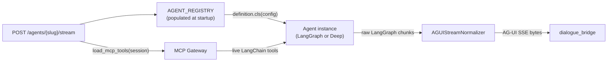
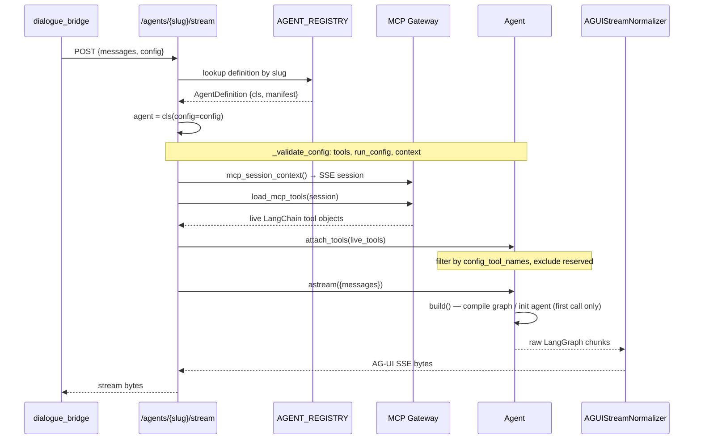
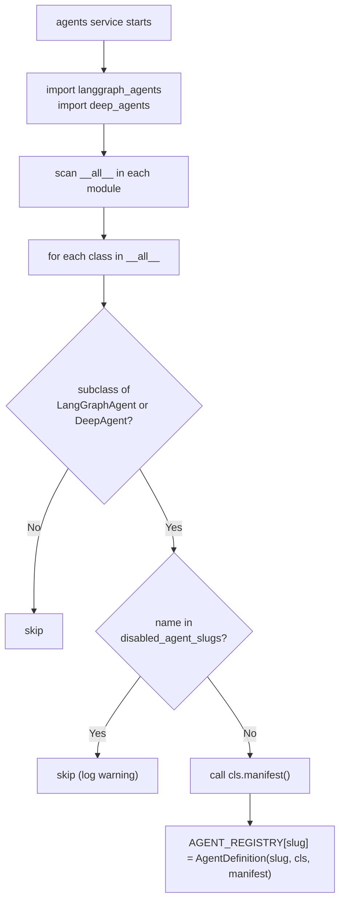
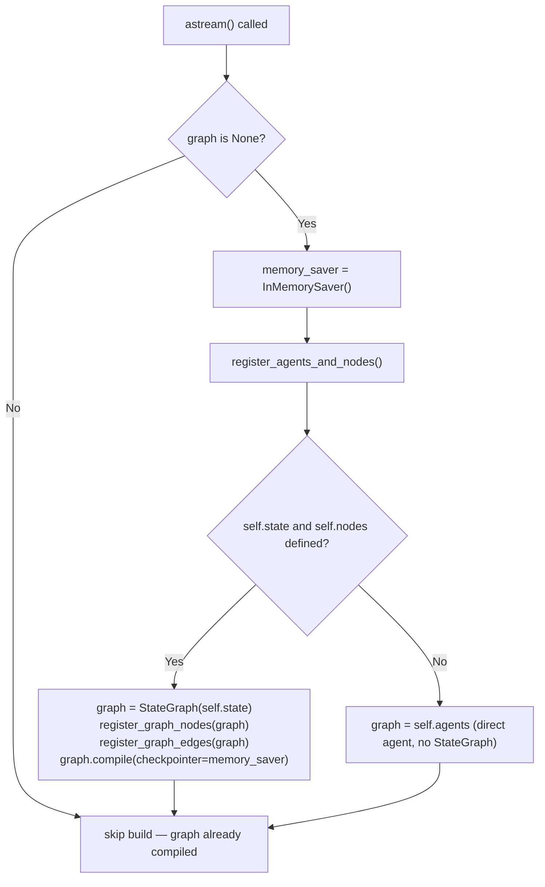
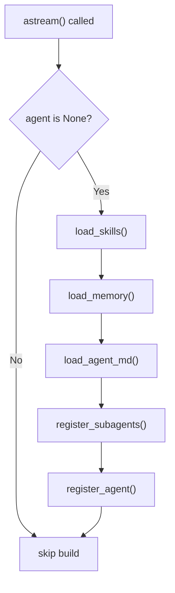

# Agent Development Guide

The platform supports two agent patterns: **LangGraph agents** (explicit graph-based workflows with state machines, nodes, and edges) and **Deep agents** (autonomous agents with convention-based asset discovery, sub-agent delegation, and a persistent filesystem). Both inherit from `BaseAgent`, which handles configuration validation, tool filtering, manifest generation, and error encoding. Every agent is discovered automatically at startup — no manual registration is required.

---

## Services Involved



---

## Full Sequence — Inference Request



---

## Phase 1 — BaseAgent: The Shared Foundation

Every agent subclasses `BaseAgent`. It provides four responsibilities that subclasses inherit and must not override:

### Class-Level Identity Attributes

```python
class MyAgent(LangGraphAgent):  # or DeepAgent
    name        = "my-agent"          # slug — URL routing, registry key
    agent_id    = "my-agent"          # ID in UI manifest
    label       = "My Agent"          # Human-readable display name
    version     = "1.0.0"             # Semver string
    type        = "langgraph agent"   # Set automatically by base class
    description = "Does X and Y"      # Shown in agent picker
    icon        = "BrainCircuit"      # UI icon name (Lucide icon)
```

`name` is the only field that must be unique across all agents — it is the key used for URL routing (`/agents/{name}/stream`) and registry lookup.

### Configuration Validation

When the agents service instantiates an agent, it passes the `config` dict from the inference request. `_validate_config()` normalizes and validates three keys:

| Key | Required | Shape | Notes |
| --- | --- | --- | --- |
| `tools` | No | `[{tool_name: str, server_id?: str}]` | Empty list if no tools selected |
| `run_config` | No | `{configurable?: {thread_id: str, ...}}` | Used as LangGraph config |
| `context` | **Yes** | `{user_id: str, conversation_id: str}` | Both must be non-empty strings |

After validation, these are available as:

```python
self.config_tools       # raw tool selector list
self.config_tool_names  # normalized cache keys ["server_id/tool_name", ...]
self.run_config         # passed to graph.astream(..., config=self.run_config)
self.context            # {"user_id": "...", "conversation_id": "..."}
```

### Tool Attachment

`attach_tools(live_tools)` is called once per request after the MCP session loads tools:

1. `_filter_live_tools(live_tools)` — keeps only tools whose cache key is in `self.config_tool_names`. Logs a WARNING for any configured key that has no matching live tool.
2. `_apply_live_tools(filtered)` — extends `self.tools` and updates `self.tools_names`.

After `attach_tools()`, `self.tools` is the list of LangChain tool objects to pass to LLMs or agent factories.

### Manifest and Error Encoding

`manifest()` returns the dict served by `GET /agents`. `_encode_run_error(exc)` produces a well-formed SSE `RUN_ERROR` frame from any exception — it is called automatically by `astream()` on unhandled exceptions and should not be called manually.

---

## Phase 2 — Building a LangGraph Agent

A LangGraph agent expresses its logic as a directed graph: nodes do work, edges control flow, and a compiled graph drives execution. Use this pattern when the workflow has a known, bounded structure.

### Step-by-Step

#### 1. Create the module

```text
src/agents/langgraph_agents/my_agent/
    __init__.py       ← agent class (exported here)
    agents.py         ← LLM chain builders
    nodes.py          ← node callables + state type
```

#### 2. Define the state

```python
# nodes.py
from pydantic import BaseModel
from typing import Annotated
from langgraph.graph.message import add_messages

class MyAgentState(BaseModel):
    messages: Annotated[list, add_messages] = []
    intent: str = ""
    context: str = ""
```

The state type is assigned to `self.state` in `__init__` — the base class uses it to decide whether to wrap the agent in a `StateGraph` or use it directly.

#### 3. Define the agent class

```python
# __init__.py
from langgraph.graph import StateGraph, START, END
from runtime import LangGraphAgent
from .agents import build_my_agents
from .nodes import MyAgentState, build_my_nodes

class MyAgent(LangGraphAgent):
    name        = "my-agent"
    agent_id    = "my-agent"
    label       = "My Agent"
    version     = "1.0.0"
    description = "Short description for the UI"
    icon        = "Sparkles"

    def __init__(self, *, config=None):
        super().__init__(config=config)
        self.state = MyAgentState

    def register_agents(self) -> None:
        self.agents = build_my_agents(tools=self.tools)

    def register_nodes(self) -> None:
        self.nodes = build_my_nodes(
            agents=self.agents,
            agui=self.agui_emitter,
        )

    def register_graph_nodes(self, graph: StateGraph) -> StateGraph:
        graph.add_node("router",   self.nodes.router)
        graph.add_node("generate", self.nodes.generate)
        return graph

    def register_graph_edges(self, graph: StateGraph) -> StateGraph:
        graph.add_edge(START, "router")
        graph.add_conditional_edges(
            "router",
            self.nodes.route_decision,
            {"generate": "generate", "end": END},
        )
        graph.add_edge("generate", END)
        return graph
```

#### 4. Build nodes that emit AG-UI events

Nodes receive the graph state and a `RunnableConfig`. The AG-UI emitter is threaded through via closure — nodes write events to the `StreamWriter` provided by LangGraph's `get_stream_writer()`:

```python
# nodes.py
from langgraph.config import get_stream_writer
from dataclasses import dataclass
from typing import Any
from runtime.protocols.agui import AGUIEmitter

@dataclass
class MyNodes:
    generate_chain: Any
    agui: AGUIEmitter

async def _generate(state: MyAgentState, config) -> dict:
    writer = get_stream_writer()
    thread_id = config["configurable"].get("thread_id", "")

    self.agui.thinking_start(writer)
    self.agui.thought("Planning response...", writer)
    self.agui.thinking_end(writer)

    self.agui.response_start(thread_id, writer)
    async for chunk in self.generate_chain.astream(state.messages):
        self.agui.response_chunk(thread_id, chunk.content, writer)
    self.agui.response_end(thread_id, writer)

    return {"messages": [chunk]}

def build_my_nodes(agents, agui: AGUIEmitter) -> MyNodes:
    nodes = MyNodes(generate_chain=agents.generate_chain, agui=agui)
    nodes.generate = lambda s, c: _generate.__get__(nodes)(s, c)
    return nodes
```

`stream_mode = "custom"` is the default for `LangGraphAgent`. In this mode, bytes yielded from nodes via the writer are forwarded directly as SSE — the normalizer is not used. If you want full AG-UI normalization (tool calls, sub-agents, thinking from LLM introspection), set:

```python
stream_mode = ["messages", "updates"]
```

and let the normalizer handle all event synthesis from the raw LangGraph chunk stream.

#### 5. Export the class

```python
# src/agents/langgraph_agents/__init__.py
from .my_agent import MyAgent

__all__ = ["MyAgent", ...]
```

The `_discover_agents()` function scans `__all__` in this module. The agent appears in `GET /agents` and is routable at `POST /agents/my-agent/stream` immediately.

---

## Phase 3 — Building a Deep Agent

A Deep agent uses the `deepagents` library's autonomous agent factory. The platform provides lifecycle hooks for asset discovery (AGENT.md instructions, skills, memory) and sub-agent registration. Use this pattern for open-ended, multi-step tasks where the agent decides its own plan.

### Implementation Steps

#### 1. Create the agent module

```text
src/agents/deep_agents/my_deep_agent/
    __init__.py       ← agent class (exported here)
    AGENT.md          ← system prompt / behavioral instructions (auto-discovered)
    skills/           ← skill subdirectories (auto-discovered)
        web_search/
            SKILL.md
```

#### 2. Define the agent class

```python
# __init__.py
from deepagents import create_deep_agent
from deepagents.backends import FilesystemBackend
from runtime import DeepAgent
from core.settings import settings

class MyDeepAgent(DeepAgent):
    name        = "my-deep-agent"
    agent_id    = "my-deep-agent"
    label       = "My Deep Agent"
    version     = "1.0.0"
    description = "Autonomous agent for complex multi-step tasks"
    icon        = "BrainCircuit"

    def register_agent(self):
        return create_deep_agent(
            model="openai:gpt-4o",
            name=self.name,
            tools=self.tools,
            memory=self.agent_md_paths,    # from load_agent_md()
            skills=self.skills_paths,      # from load_skills()
            subagents=self.sub_agents,     # from register_subagents()
            checkpointer=self.checkpointer,
            backend=FilesystemBackend(root_dir=self._impl_dir, virtual_mode=True),
            context_schema=self.context,
        )
```

`register_agent()` is the only required override. All other hooks are optional with sensible defaults.

#### 3. Write AGENT.md

`AGENT.md` is injected as always-on context into the agent's system prompt via `MemoryMiddleware`. It defines the agent's personality, responsibilities, and behavioral conventions:

```markdown
# MyDeepAgent

You are MyDeepAgent, an autonomous assistant specialized in...

## Responsibilities
- Task A — description
- Task B — description

## Working with Your Store

Your persistent store is at `/filesystem/`. Before starting a task:
1. Run `ls /filesystem/` to check prior work.
2. Save outputs with names like `/filesystem/<topic>_<date>.md`.

## Behavior Guidelines
- Plan before acting on complex tasks.
- Be concise in chat; be thorough in stored documents.
- Always confirm before taking irreversible actions.
```

`load_agent_md()` returns `["./AGENT.md"]` if the file exists in the agent's implementation directory. Pass `self.agent_md_paths` to `create_deep_agent(memory=...)`.

#### 4. Create skills

Skills are modular capabilities the agent can invoke. Each skill lives in its own subdirectory:

```text
skills/
    data_analysis/
        SKILL.md         ← skill description and usage instructions
        helpers.py       ← optional Python helpers (not auto-loaded)
```

`load_skills()` returns `["./skills/"]` if the directory exists. The skills directory is passed to `create_deep_agent(skills=...)` and loaded by `SkillsMiddleware`.

#### 5. Register sub-agents (optional)

Override `register_subagents()` to declare specialist sub-agents the orchestrator can delegate to:

```python
from deepagents import SubAgent

def register_subagents(self):
    return [
        SubAgent(
            model="openai:gpt-4o-mini",
            name="researcher",
            description="Deep research on a specific topic",
            system_prompt="You are a specialist research agent...",
            tools=[],
        ),
        SubAgent(
            model="openai:gpt-4o",
            name="writer",
            description="Produce well-structured written output",
            system_prompt="You are a specialist writing agent...",
            tools=[],
        ),
    ]
```

Sub-agent delegation emits `TASK_SUBAGENT` and `SUBAGENT_EVENT` AG-UI events automatically via the normalizer — no manual event emission is needed.

#### 6. Use persistent directories

Three path properties are available on every Deep agent instance:

| Property | Path | Purpose |
| --- | --- | --- |
| `self.filesystem_dir` | `<impl_dir>/filesystem/` | Root for `FilesystemBackend` — all files the agent creates |
| `self.store_dir` | `<impl_dir>/store/` | Persistent artifacts across runs |
| `self.memory_dir` | `<impl_dir>/memory/` | Long-term memory store (passed to `load_memory()`) |

All three are created automatically if they do not exist. `FilesystemBackend(root_dir=self._impl_dir, virtual_mode=True)` uses `self._impl_dir` as the root, so the agent's file operations resolve relative to the module directory.

#### 7. Override lifecycle hooks when needed

| Hook | Default | Override when |
| --- | --- | --- |
| `load_skills()` | Auto-discovers `./skills/` | Skills are in a non-standard path |
| `load_memory()` | Returns `None` | Using a persistent memory backend |
| `load_agent_md()` | Auto-discovers `./AGENT.md` | Multiple or non-standard instruction files |
| `register_subagents()` | Returns `None` | Agent has specialist sub-agents |

#### 8. Reserved tool names

Deep agents automatically exclude the following tool names from MCP attachment — these are built-in `deepagents` library tools that conflict with MCP-provided tools of the same name:

```python
RESERVED_DEEPAGENT_TOOL_NAMES = {
    "write_todos", "ls", "read_file", "write_file",
    "edit_file", "glob", "grep", "execute", "task"
}
```

If an MCP server provides a tool named `grep`, it will be silently excluded and a WARNING is logged. Design MCP tool names to avoid this set.

#### 9. Export the class

```python
# src/agents/deep_agents/__init__.py
from .my_deep_agent import MyDeepAgent

__all__ = ["MyDeepAgent", ...]
```

---

## Phase 4 — Tool Integration

### How Tools Are Selected

The inference request carries a `config.tools` array of selector objects. The bridge forwards this verbatim:

```json
{
  "tools": [
    { "tool_name": "tavily-search", "server_id": "tavily" },
    { "tool_name": "download_paper", "server_id": "arxiv" }
  ]
}
```

`_validate_tool_config()` normalizes each entry and `_build_tool_key_from_config()` converts it to a cache key (`"tavily/tavily-search"`, `"arxiv/download_paper"`). These keys are stored in `self.config_tool_names`.

At stream time, the MCP gateway provides live LangChain tool objects. `attach_tools()` keeps only the ones whose cache key matches an entry in `self.config_tool_names`.

### Tool Cache Key Format

| Has `server_id` | Cache key |
| --- | --- |
| Yes | `"{server_id}/{tool_name}"` |
| No | `"{tool_name}"` |

Server ID overrides apply automatically for known servers (tavily, arxiv). If you register a new MCP server and its tools need a non-default server ID, add an entry to `_TOOL_SERVER_OVERRIDES` in `mcp_tools.py`.

### Accessing Tools in Agent Code

After `attach_tools()` completes:

```python
self.tools         # List[Any] — LangChain tool objects, filtered and ready
self.tools_names   # List[str] — tool names (for logging, binding to LLMs)
```

Pass `self.tools` to `create_react_agent()`, `create_deep_agent()`, or any LangChain tool-binding call. The tools list is already filtered — do not filter again.

---

## Phase 5 — AG-UI Streaming

### Stream Mode Choice

The `stream_mode` class attribute controls what LangGraph emits:

| Value | Use when |
| --- | --- |
| `"custom"` (default for LangGraph) | Nodes emit events manually via `get_stream_writer()` and the emitter |
| `["messages", "updates"]` (default for Deep) | Let the normalizer synthesize all events from raw LangGraph chunks |

Custom mode gives full control over every event. Messages+updates mode is automatic but requires the normalizer to correctly classify chunks.

### Emitting Events in Custom Mode

Get the writer inside a node and pass it to every emitter call:

```python
from langgraph.config import get_stream_writer
from runtime.protocols.agui import AGUIEmitter

async def my_node(state, config):
    writer = get_stream_writer()
    thread_id = config["configurable"].get("thread_id", "")
    agui: AGUIEmitter = ...  # threaded in via closure

    # Thinking phase
    agui.thinking_start(writer)
    agui.thought("Analyzing request...", writer)
    agui.thinking_end(writer)

    # Tool call
    agui.tool_call_start("tc_001", "my_tool", writer)
    agui.tool_call_args("tc_001", "my_tool", {"query": "..."}, writer)
    result = await run_tool(...)
    agui.tool_call_result("tc_001", result, writer, thread_id=thread_id)
    agui.tool_call_end("tc_001", writer)

    # Text response
    agui.response_start(thread_id, writer)
    async for chunk in llm.astream(messages):
        agui.response_chunk(thread_id, chunk.content, writer)
    agui.response_end(thread_id, writer)

    return updated_state
```

**Writer vs return** — pass `writer` when inside a node (streaming mode). Omit `writer` to receive bytes as a return value (batch collection, testing).

### Plan Snapshots

Emit a plan when the agent has a structured task list to show the user:

```python
from runtime.protocols.agui.events import PlanItem

agui.plan_snapshot(
    items=[
        PlanItem(content="Research topic", status="completed"),
        PlanItem(content="Write summary",  status="in_progress"),
        PlanItem(content="Send email",     status="pending"),
    ],
    writer=writer,
)
```

In `["messages", "updates"]` mode, call the `write_todos` tool instead — the normalizer converts it to a `PLAN_SNAPSHOT` event automatically.

### HITL (Human-in-the-Loop)

In `["messages", "updates"]` mode, HITL is handled automatically: any `__interrupt__` in the LangGraph update payload becomes a `HITL_INTERRUPT` custom event. The graph must be compiled with a `checkpointer`:

```python
# LangGraph agents: the InMemorySaver is created automatically in build()
self.memory_saver = InMemorySaver()
graph.compile(checkpointer=self.memory_saver)

# In a node:
from langgraph.types import interrupt
result = interrupt({"question": "Do you want to proceed?"})
```

In custom stream mode, emit the interrupt manually:

```python
agui.hitl_interrupt(
    thread_id=thread_id,
    interrupt={"question": "Approve this action?"},
    writer=writer,
)
```

#### DeepAgent: gating tools with `interrupt_on`

DeepAgents (built on `create_deep_agent`) can opt-in tools for HITL approval declaratively. Pass a `dict[str, bool]` to `interrupt_on` — keys are tool names, values mark them as gated. LangChain's `HumanInTheLoopMiddleware` then pauses the graph before any gated tool runs and surfaces a `HITLInterruptEvent` with one entry per pending call inside `value.action_requests`.

Example from [`omni_agent/__init__.py`](../../src/agents/deep_agents/omni_agent/__init__.py):

```python
HITL_GATED_TOOLS: dict[str, bool] = {
    # Filesystem mutations — anything that writes to disk goes through approval.
    "write_file": True,
    "edit_file": True,
    # Code execution — arbitrary shell / python is always user-approved.
    "execute": True,
    # Subagent delegation — researcher / writer hand-offs require approval so
    # the user can see the prompt before a model spends tokens on it.
    "task": True,
}

class OmniAgent(DeepAgent):
    def register_agent(self) -> Any:
        return create_deep_agent(
            ...
            checkpointer=self.checkpointer,
            interrupt_on=HITL_GATED_TOOLS,
        )
```

`interrupt_on` requires a configured `checkpointer` — without one, the middleware can't pause/resume. DeepAgent's base class wires this for you.

#### Resume — what the bridge sends, what the middleware expects

When the user approves/rejects, the bridge POSTs `AgentResumeRequest{thread_id, interrupt_id, decision, reason, value}` to `/agents/{slug}/resume`. The endpoint:

1. Reads the cached `InMemorySaver` for `thread_id` from `runtime/checkpointer_cache.py` (it was populated by the original `/stream` call's `build()`).
2. Calls `compiled_graph.get_state(config)` to inspect `snapshot.interrupts`.
3. Verifies `snapshot.interrupts[0].id == req.interrupt_id` (when supplied); 409s on a stale click.
4. Computes `decision_count = len(snapshot.interrupts[0].value.action_requests)` so the resume payload has the exact length the middleware validates against.
5. Builds `Command(resume={"decisions": [<decision_dict>] * decision_count})` and feeds it to `agent.astream(payload={"messages": []}, command=resume_command)`.

Decision dicts:

- **Approve:** `{"type": "approve"}`. Tool executes. The `reason`/`value` from the bridge are not used — LangChain's `ApproveDecision` has no `message` slot.
- **Reject:** `{"type": "reject", "message": req.reason or "User rejected this action."}`. The middleware injects a `ToolMessage(content=<message>)` instead of running the tool, then **lets the agent loop continue** — reject is non-terminal in LangChain. The default message is non-optional; without it the middleware raises `KeyError: 'message'`.

#### Process-level checkpointer cache

Each `/stream` and `/resume` request creates a fresh agent instance (`cls(config=config)`), so the in-memory `InMemorySaver` would normally be garbage-collected between calls. [`runtime/checkpointer_cache.py`](../../src/agents/runtime/checkpointer_cache.py) keeps one shared `InMemorySaver` per `thread_id` (default 256-entry LRU), so the resume call can rehydrate the same checkpoint the original stream wrote to. Both `LangGraphAgent.build()` and `DeepAgent.build()` look up `thread_id` in this cache before creating a new saver. The cache is process-local; for multi-replica deploys, swap to `PostgresSaver` from `langgraph-checkpoint-postgres`.

---

## Phase 6 — Agent Registration and Discovery

No manual registration is required. `_discover_agents()` runs at module load time and populates `AGENT_REGISTRY`:



**Export requirement** — the agent class must appear in `__all__` of either `langgraph_agents/__init__.py` or `deep_agents/__init__.py`. If it is not exported, it is not discovered.

**Disabling agents** — set `DISABLED_AGENT_SLUGS=my-agent,other-agent` in the environment. Slugs are case-insensitive. Disabled agents do not appear in `GET /agents` and return `404` from the stream endpoint.

**Duplicate slugs** — if two classes have the same `name`, the second one silently overwrites the first in the registry. Slugs must be unique across both `langgraph_agents` and `deep_agents`.

---

## Phase 7 — Lifecycle and Build Caching

Both `LangGraphAgent.build()` and `DeepAgent.build()` are called lazily on the first `astream()` call. The agent instance is created fresh per request (one `cls(config=config)` call per stream request), so build caching within an instance is only relevant for multi-turn checkpointed conversations — it does not persist across requests.

### LangGraph Build Sequence



If `self.state` is `None`, the agent is treated as a runnable directly (e.g., a pre-compiled LangGraph agent or a LangChain runnable). Set `self.state = None` in `__init__` when not using a `StateGraph`.

### Deep Agent Build Sequence



Each lifecycle hook runs exactly once per instance. Exceptions in `register_agent()` propagate to `astream()`, which encodes them as `RUN_ERROR` SSE frames.

---

## Sharp Edges and Behavioral Notes

- **One instance per request, no pooling.** `cls(config=config)` is called inside the stream endpoint for every inference request. State on `self` is ephemeral. Do not use class-level mutable state as a substitute for instance state — it is shared across all concurrent requests.

- **`build()` runs inside the stream generator, not before it.** If `register_agent()` raises an exception (e.g., missing model config), the error surfaces as a `RUN_ERROR` SSE frame after the stream starts, not as an HTTP error. The HTTP response is `200 OK` regardless — errors are signalled in the SSE data.

- **`self.tools` is empty until `attach_tools()` is called.** `build()` runs after `attach_tools()` in the stream endpoint, so `register_agent()` and `register_nodes()` see the fully populated `self.tools` list. Do not access `self.tools` in `__init__` or class-level code — it will be empty.

- **`run_config` defaults to a random `thread_id` if not provided.** HITL and multi-turn checkpointing require a stable `thread_id` across turns — the bridge sends `conversation_id` as `thread_id`. If a custom client omits `run_config`, each stream call gets a fresh ephemeral graph state with no memory of prior turns.

- **The normalizer's `thread_id` is fixed at construction time.** `AGUIStreamNormalizer(thread_id=...)` is initialized in `__init__`, using the `thread_id` from the config received at instantiation. Changing `run_config.configurable.thread_id` after construction has no effect on the normalizer.

- **`stream_mode="custom"` bypasses the normalizer entirely.** In custom mode, `astream()` forwards str/bytes chunks directly as SSE. If you emit AG-UI events via the writer in custom mode, they go directly to the bridge. If you also return structured dicts (e.g., LangGraph `add_messages` reducer output), they are encoded as bytes and forwarded verbatim — they will not be parsed as AG-UI events.

- **Reserved Deep agent tool names are checked by name only, not by server.** `RESERVED_DEEPAGENT_TOOL_NAMES` matches on `tool.name` (the LangChain tool's `.name` attribute). If an MCP server provides a tool named `ls` under a non-standard server ID, it is still excluded.

- **Assets in `skills/` and `AGENT.md` are loaded relative to the concrete class file, not the Python working directory.** `self._impl_dir` is resolved via `inspect.getfile(type(self))`. If the class is defined in a submodule, the paths resolve relative to that file. Do not rely on `os.getcwd()` for asset paths.

- **`FilesystemBackend(virtual_mode=True)` means all file paths are sandboxed.** The `deepagents` library maps virtual paths (`/filesystem/file.md`) to real paths under `self._impl_dir`. Writing to an absolute path outside the impl dir is blocked.

- **Duplicate `name` values silently overwrite.** `_discover_agents()` iterates modules in import order. If two agents share a slug, only the last-imported one is reachable. The service logs nothing — the collision is invisible at runtime.

---

## Checklist: New Agent

**LangGraph agent:**

- [ ] Subclass `LangGraphAgent` with unique `name`, `label`, `description`, `icon`
- [ ] Assign `self.state` in `__init__`
- [ ] Implement `register_agents()` — build LLM chains, store on `self.agents`
- [ ] Implement `register_nodes()` — build node callables, store on `self.nodes`
- [ ] Implement `register_graph_nodes()` — `graph.add_node()` for each node
- [ ] Implement `register_graph_edges()` — `graph.add_edge()` / `graph.add_conditional_edges()`
- [ ] Nodes use `get_stream_writer()` and emit via `self.agui_emitter`
- [ ] Class exported in `langgraph_agents/__init__.py` → `__all__`

**Deep agent:**

- [ ] Subclass `DeepAgent` with unique `name`, `label`, `description`, `icon`
- [ ] Write `AGENT.md` in the implementation directory
- [ ] Create `skills/` subdirectories with `SKILL.md` files (optional)
- [ ] Implement `register_subagents()` returning `[SubAgent(...), ...]` (optional)
- [ ] Implement `register_agent()` calling `create_deep_agent(...)` with all lifecycle values
- [ ] Class exported in `deep_agents/__init__.py` → `__all__`

**Both:**

- [ ] Verify slug is unique across all agents
- [ ] Check that any needed MCP tool names are not in `RESERVED_DEEPAGENT_TOOL_NAMES` (Deep only)
- [ ] Confirm the `icon` value resolves in the UI's icon registry

---

## File Map

| Concept | File | What to look for |
| --- | --- | --- |
| Base agent class | [src/agents/runtime/base_agent.py](../../src/agents/runtime/base_agent.py) | `BaseAgent`, `attach_tools()`, `_validate_config()`, `_encode_run_error()` |
| LangGraph agent base | [src/agents/runtime/langgraph_agent.py](../../src/agents/runtime/langgraph_agent.py) | `LangGraphAgent`, `build()`, `astream()`, abstract method list |
| Deep agent base | [src/agents/runtime/deep_agent.py](../../src/agents/runtime/deep_agent.py) | `DeepAgent`, lifecycle hooks, `RESERVED_DEEPAGENT_TOOL_NAMES`, `_apply_live_tools()` |
| Agent discovery | [src/agents/utils/agents.py](../../src/agents/utils/agents.py) | `_discover_agents()`, `AGENT_REGISTRY`, `AgentDefinition` |
| Tool cache key logic | [src/agents/utils/mcp_tools.py](../../src/agents/utils/mcp_tools.py) | `build_tool_cache_key()`, `_TOOL_SERVER_OVERRIDES`, `mcp_session_context()` |
| AG-UI event emitter | [src/agents/runtime/protocols/agui/emitter.py](../../src/agents/runtime/protocols/agui/emitter.py) | `AGUIEmitter` — all emit methods |
| AG-UI normalizer | [src/agents/runtime/protocols/agui/normalizer.py](../../src/agents/runtime/protocols/agui/normalizer.py) | `AGUIStreamNormalizer.handle_chunk()` |
| Custom event types | [src/agents/runtime/protocols/agui/events.py](../../src/agents/runtime/protocols/agui/events.py) | `PlanItem`, `PlanSnapshot`, `TaskSubAgentEvent`, `HITLInterruptEvent` |
| Stream endpoint | [src/agents/main.py](../../src/agents/main.py) | `POST /agents/{slug}/stream` — full instantiation + attach + stream flow |
| Agent settings | [src/agents/core/settings.py](../../src/agents/core/settings.py) | `AgentRegistrySettings.disabled_agent_slugs`, `McpSettings`, `RuntimeModelsSettings` |
| LangGraph agent exports | [src/agents/langgraph_agents/\_\_init\_\_.py](../../src/agents/langgraph_agents/__init__.py) | `__all__` — agents that will be discovered |
| Deep agent exports | [src/agents/deep_agents/\_\_init\_\_.py](../../src/agents/deep_agents/__init__.py) | `__all__` — agents that will be discovered |
