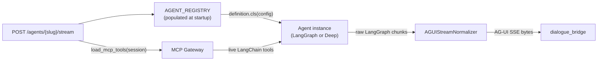
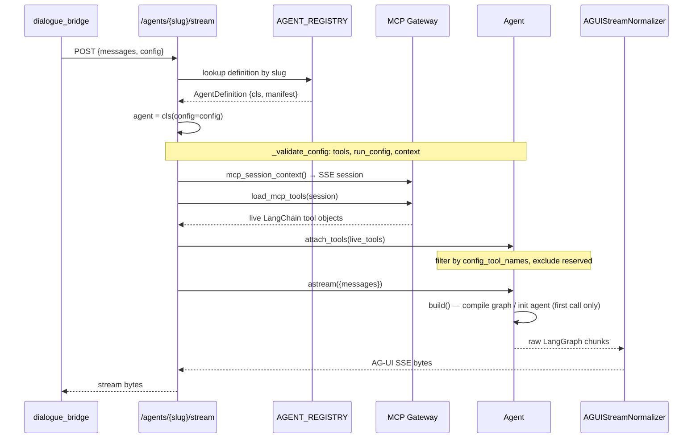
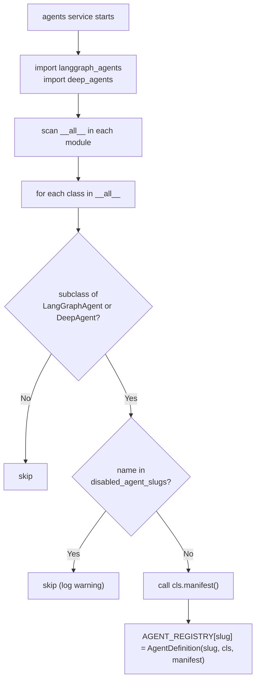
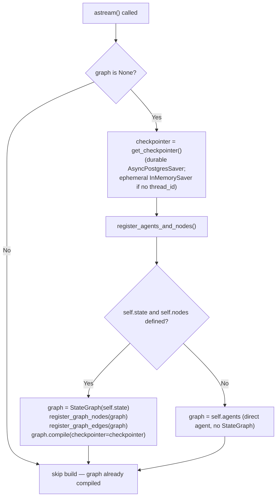
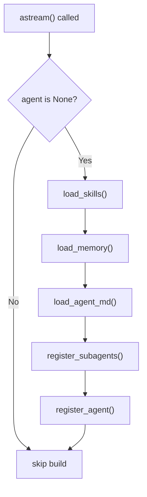

# Agent Development Guide

The platform supports two agent patterns: **LangGraph agents** (explicit graph-based workflows with state machines, nodes, and edges) and **Deep agents** (autonomous agents with convention-based asset discovery, sub-agent delegation, and a persistent filesystem). Both inherit from `BaseAgent`, which handles configuration validation, tool filtering, manifest generation, and error encoding. Every agent is discovered automatically at startup — no manual registration is required.

---

## Services Involved



---

## Full Sequence — Inference Request



---

## Phase 1 — BaseAgent: The Shared Foundation

Every agent subclasses `BaseAgent`. It provides four responsibilities that subclasses inherit and must not override:

### Class-Level Identity Attributes

```python
class MyAgent(LangGraphAgent):  # or DeepAgent
    name        = "my-agent"          # slug — URL routing, registry key
    agent_id    = "my-agent"          # ID in UI manifest
    label       = "My Agent"          # Human-readable display name
    version     = "1.0.0"             # Semver string
    type        = "langgraph agent"   # Set automatically by base class
    description = "Does X and Y"      # Shown in agent picker
    icon        = "BrainCircuit"      # UI icon name (Lucide icon)
```

`name` is the only field that must be unique across all agents — it is the key used for URL routing (`/agents/{name}/stream`) and registry lookup.

### Configuration Validation

When the agents service instantiates an agent, it passes the `config` dict from the inference request. `_validate_config()` normalizes and validates three keys:

| Key | Required | Shape | Notes |
| --- | --- | --- | --- |
| `tools` | No | `[{tool_name: str, server_id?: str}]` | Empty list if no tools selected |
| `run_config` | No | `{configurable?: {thread_id: str, ...}}` | Used as LangGraph config |
| `context` | **Yes** | `{user_id: str, conversation_id: str}` | Both must be non-empty strings |

After validation, these are available as:

```python
self.config_tools       # raw tool selector list
self.config_tool_names  # normalized cache keys ["server_id/tool_name", ...]
self.run_config         # passed to graph.astream(..., config=self.run_config)
self.context            # {"user_id": "...", "conversation_id": "..."}
```

### Tool Attachment

`attach_tools(live_tools)` is called once per request after the MCP session loads tools:

1. `_filter_live_tools(live_tools)` — keeps only tools whose cache key is in `self.config_tool_names`. Logs a WARNING for any configured key that has no matching live tool.
2. `_apply_live_tools(filtered)` — extends `self.tools` and updates `self.tools_names`.

After `attach_tools()`, `self.tools` is the list of LangChain tool objects to pass to LLMs or agent factories.

### Manifest and Error Encoding

`manifest()` returns the dict served by `GET /agents`. `_encode_run_error(exc)` produces a well-formed SSE `RUN_ERROR` frame from any exception — it is called automatically by `astream()` on unhandled exceptions and should not be called manually.

---

## Phase 2 — Building a LangGraph Agent

A LangGraph agent expresses its logic as a directed graph: nodes do work, edges control flow, and a compiled graph drives execution. Use this pattern when the workflow has a known, bounded structure.

### Step-by-Step

#### 1. Create the module

```text
src/agents/langgraph_agents/my_agent/
    __init__.py       ← agent class (exported here)
    agents.py         ← LLM chain builders
    nodes.py          ← node callables + state type
```

#### 2. Define the state

```python
# nodes.py
from pydantic import BaseModel
from typing import Annotated
from langgraph.graph.message import add_messages

class MyAgentState(BaseModel):
    messages: Annotated[list, add_messages] = []
    intent: str = ""
    context: str = ""
```

The state type is assigned to `self.state` in `__init__` — the base class uses it to decide whether to wrap the agent in a `StateGraph` or use it directly.

#### 3. Define the agent class

```python
# __init__.py
from langgraph.graph import StateGraph, START, END
from runtime.abstractions import LangGraphAgent
from .agents import build_my_agents
from .nodes import MyAgentState, build_my_nodes

class MyAgent(LangGraphAgent):
    name        = "my-agent"
    agent_id    = "my-agent"
    label       = "My Agent"
    version     = "1.0.0"
    description = "Short description for the UI"
    icon        = "Sparkles"

    def __init__(self, *, config=None):
        super().__init__(config=config)
        self.state = MyAgentState

    def register_agents(self) -> None:
        self.agents = build_my_agents(tools=self.tools)

    def register_nodes(self) -> None:
        self.nodes = build_my_nodes(
            agents=self.agents,
            agui=self.agui_emitter,
        )

    def register_graph_nodes(self, graph: StateGraph) -> StateGraph:
        graph.add_node("router",   self.nodes.router)
        graph.add_node("generate", self.nodes.generate)
        return graph

    def register_graph_edges(self, graph: StateGraph) -> StateGraph:
        graph.add_edge(START, "router")
        graph.add_conditional_edges(
            "router",
            self.nodes.route_decision,
            {"generate": "generate", "end": END},
        )
        graph.add_edge("generate", END)
        return graph
```

#### 4. Build nodes that emit AG-UI events

Nodes receive the graph state and a `RunnableConfig`. The AG-UI emitter is threaded through via closure — nodes write events to the `StreamWriter` provided by LangGraph's `get_stream_writer()`:

```python
# nodes.py
from langgraph.config import get_stream_writer
from dataclasses import dataclass
from typing import Any
from runtime.protocols.agui import AGUIEmitter

@dataclass
class MyNodes:
    generate_chain: Any
    agui: AGUIEmitter

async def _generate(state: MyAgentState, config) -> dict:
    writer = get_stream_writer()
    thread_id = config["configurable"].get("thread_id", "")

    self.agui.thinking_start(writer)
    self.agui.thought("Planning response...", writer)
    self.agui.thinking_end(writer)

    self.agui.response_start(thread_id, writer)
    async for chunk in self.generate_chain.astream(state.messages):
        self.agui.response_chunk(thread_id, chunk.content, writer)
    self.agui.response_end(thread_id, writer)

    return {"messages": [chunk]}

def build_my_nodes(agents, agui: AGUIEmitter) -> MyNodes:
    nodes = MyNodes(generate_chain=agents.generate_chain, agui=agui)
    nodes.generate = lambda s, c: _generate.__get__(nodes)(s, c)
    return nodes
```

`stream_mode = "custom"` is the default for `LangGraphAgent`. In this mode, bytes yielded from nodes via the writer are forwarded directly as SSE — the normalizer is not used. If you want full AG-UI normalization (tool calls, sub-agents, thinking from LLM introspection), set:

```python
stream_mode = ["messages", "updates"]
```

and let the normalizer handle all event synthesis from the raw LangGraph chunk stream.

#### 5. Export the class

```python
# src/agents/langgraph_agents/__init__.py
from .my_agent import MyAgent

__all__ = ["MyAgent", ...]
```

The `_discover_agents()` function scans `__all__` in this module. The agent appears in `GET /agents` and is routable at `POST /agents/my-agent/stream` immediately.

---

## Phase 3 — Building a Deep Agent

A Deep agent uses the `deepagents` library's autonomous agent factory. The platform provides lifecycle hooks for asset discovery (AGENT.md instructions, skills, memory) and sub-agent registration. Use this pattern for open-ended, multi-step tasks where the agent decides its own plan.

### Implementation Steps

#### 1. Create the agent module

```text
src/agents/deep_agents/my_deep_agent/
    __init__.py       ← agent class (exported here)
    AGENT.md          ← system prompt / behavioral instructions (auto-discovered)
    skills/           ← skill subdirectories (auto-discovered)
        web_search/
            SKILL.md
```

#### 2. Define the agent class

```python
# __init__.py
from deepagents import create_deep_agent
from deepagents.backends import FilesystemBackend
from runtime.abstractions import DeepAgent
from core.settings import settings

class MyDeepAgent(DeepAgent):
    name        = "my-deep-agent"
    agent_id    = "my-deep-agent"
    label       = "My Deep Agent"
    version     = "1.0.0"
    description = "Autonomous agent for complex multi-step tasks"
    icon        = "BrainCircuit"

    def register_agent(self):
        return create_deep_agent(
            model="openai:gpt-4o",
            name=self.name,
            tools=self.tools,
            memory=self.agent_md_paths,    # from load_agent_md()
            skills=self.skills_paths,      # from load_skills()
            subagents=self.sub_agents,     # from register_subagents()
            checkpointer=self.checkpointer,
            backend=FilesystemBackend(root_dir=self._impl_dir, virtual_mode=True),
            context_schema=self.context,
        )
```

`register_agent()` is the only required override. All other hooks are optional with sensible defaults.

#### 3. Write AGENT.md

`AGENT.md` is injected as always-on context into the agent's system prompt via `MemoryMiddleware`. It defines the agent's personality, responsibilities, and behavioral conventions:

```markdown
# MyDeepAgent

You are MyDeepAgent, an autonomous assistant specialized in...

## Responsibilities
- Task A — description
- Task B — description

## Working with Your Store

Your persistent store is at `/filesystem/`. Before starting a task:
1. Run `ls /filesystem/` to check prior work.
2. Save outputs with names like `/filesystem/<topic>_<date>.md`.

## Behavior Guidelines
- Plan before acting on complex tasks.
- Be concise in chat; be thorough in stored documents.
- Always confirm before taking irreversible actions.
```

##### Per-(user, agent) long-term memory

Distinct from the static instructions above, each agent keeps **long-term memory scoped per (user, agent)** — one agent's memory never bleeds into another's. It follows the skills progressive-disclosure shape:

```text
<user_root>/agents/<slug>/memory/
  AGENTS.md            ← index: one summary line per memory (always-on context)
  entries/<name>.yml   ← full detail, read on demand
```

`load_agent_md()` returns `["/memories/AGENTS.md"]` (resolved through the CompositeBackend), passed to `create_deep_agent(memory=...)`, so only the compact index is injected; the agent `read_file`s an `entries/<name>.yml` when a summary looks relevant. The agent writes memory with the built-in **`remember`** tool (`name` + `summary` + `content` → writes the yml atomically and upserts the matching index line; idempotent by name). yml entries carry `created_at`/`updated_at`/`source_conversation_id` for future provenance work.

Memory is **toggleable per run** via the user's `use_memory` preference (default on), which `BaseAgent.__init__` parses into `self.use_memory`. When off: `load_agent_md()` returns `[]`, `_build_composite_backend()` drops the `/memories/` mount, **and** the `remember` tool isn't attached — the agent runs with no persistent memory, no code change. The separate `search_past_conversations` recall tool (pgvector) is gated independently by `search_past_convs`. A `remember` made mid-conversation lands on disk immediately but is injected as context on the *next* conversation (the index is read at build time). See [user-preferences](../flows/user-preferences.md#agent-memory).

The user inspects and corrects this memory in the **ProfilePanel → Memories tab**: drill into a deep agent, see its saved memories (name-sorted), click to preview content, and delete one. The agent owns *writes* (the `remember` tool); the user only reads + deletes. The read/delete operations live in `runtime/filesystem/memory.py` (`list_memories` / `read_memory` / `delete_memory` — delete drops both the `entries/<name>.yml` and its `AGENTS.md` row via the same `index_line_pattern` the write path uses), exposed by `router/memories.py` (`/agents/{slug}/users/{user_id}/memories[...]`, internal-caller gated) and proxied by the bridge's `/v1/memories` router (no cache). There is no create/update endpoint by design.

##### Per-user personalization (personality + custom instructions)

Separate from memory, every run may carry the user's **personalization** — a personality preset plus user-authored custom instructions (Settings → Personalization) — threaded by the bridge as `context.personalization`, present only when effective. The main logic lives in [`runtime/personalization.py`](../../src/agents/runtime/personalization.py):

- `_PERSONALITY_DIRECTIVES` — the preset registry (`professional`, `friendly`, `candid`, `quirky`, `efficient`, `cynical`, `nerdy`; `default` means "inject nothing").
- `parse_personalization(context)` — **fail-closed** re-validation at the service boundary (the bridge already validated, but agents don't trust it): unknown preset → `default`, text stripped of control chars and re-capped.
- `build_personalization_prompt(...)` — composes the `## User Personalization` block: a framing preamble pinning the trust boundary (user preferences are *data* — tone/style only, never overriding tool policy, filesystem permissions, or the rest of the prompt), the preset's directive, and the custom-instruction fields inside `<user_custom_instructions>` fences (the closing fence is filtered from user text so the block can't be terminated early).

`BaseAgent.__init__` parses it into `self.personalization` (both agent families get it); `DeepAgent.build_deep_agent()` appends the block via `_personalization_system_prompt()` — final prompt order: **static instructions → personalization → memory**. It applies to the **main agent only**, never sub-agents, and returns `""` when inactive so a default run's prompt is byte-identical to the pre-feature one. Override `_personalization_system_prompt()` to suppress or reposition it for a specific agent. LangGraph agents parse but don't consume it yet. See [user-preferences](../flows/user-preferences.md#personalization-personality--custom-instructions).

#### 4. Create skills

Skills are modular capabilities the agent can invoke. Each skill lives in its own subdirectory:

```text
skills/
    data_analysis/
        SKILL.md         ← skill description and usage instructions
        helpers.py       ← optional Python helpers (not auto-loaded)
```

`load_skills()` returns the **skill sources** for this run, in precedence order, passed to `create_deep_agent(skills=...)` and consumed by `SkillsMiddleware`. There are two tiers:

| Tier | Route | Contents | Writable? |
| --- | --- | --- | --- |
| ② user-enabled | `/skills/` | what the user turned on for this (user, agent) pair — the folder's presence *is* the record | no |
| ① built-in | `/default_skills/` | the skills the agent **ships with**, from its spec's `skills:` | no |

Each source is a `(route, label)` tuple; the label renders as `**<label> Skills**` in the system prompt (`Your` / `Built-in`). Pass explicit labels — deepagents otherwise derives one from the path, and a bare `/skills/` derives `Skills`, rendering as the duplicative "Skills Skills" its own docs warn about.

**Order is load-bearing.** deepagents merges sources left to right and *later sources win* on a name clash (`all_skills[skill["name"]] = skill` in `before_agent`), so the defaults go **last**: a user cannot neutralise a skill the agent ships with by putting a same-named one in their pool. Combined with the read-only mount, "the user may add skills but never remove the built-in ones" is **structural** — the enable/disable endpoint only ever touches `/skills/`, so no code path can drop a default.

Tier ① is optional: `DeepAgent.default_skills_dir` returns `None` (an agent written in Python declares its skills in code) and the route is simply absent, so an agent never advertises an empty tier. `YamlDeepAgent` resolves it from where the agent was defined — a **platform** agent mounts `global/agents/<slug>/skills/` directly (never copied per user), a **user-authored** one mounts the copy made in its workspace by `sync_agent_default_skills()` when the agent was saved (re-copied and pruned on every save, so editing the spec's `skills:` is reflected on the next run).

One consequence of the middleware: `skills_metadata` is loaded **once per session** and skipped when already in state, so a skill change applies to the *next* conversation — the same caveat as `AGENTS.md` memory.

##### User-authored custom skills (multi-file)

End users author their own skills from the **Skills** tab in the profile panel. Unlike the admin-curated global catalog, a custom skill is created at runtime and written to the per-user registry at `$SKILLS_REGISTRY_USERS_ROOT/<user_id>/custom/<name>/`.

A custom skill is a **folder of files**, not a single `SKILL.md`. `POST /v1/users/{user_id}/skills/custom` accepts a file list:

```json
{
  "name": "my_blog_writer",
  "description": "Short one-liner",
  "files": [
    { "path": "SKILL.md",         "content": "# Title\n...", "encoding": "utf-8" },
    { "path": "references/api.md", "content": "...",          "encoding": "utf-8" },
    { "path": "assets/logo.png",   "content": "<base64>",     "encoding": "base64" }
  ]
}
```

Exactly one file must be `SKILL.md`; its body is wrapped with canonical frontmatter (`name` + `description`) server-side. Every other file is written verbatim — UTF-8 text or base64-decoded binary. `add_custom_to_user` validates and decodes the **entire payload before writing a single byte** (and `rmtree`s the folder on any I/O error mid-write), enforcing:

- ≤ 30 files, ≤ 1 MiB per file, ≤ 5 MiB total, ≤ 4 path segments deep.
- Allowed extensions only (text: `.md/.txt/.py/.js/.ts/.json/.yaml/.csv/...`; binary: `.png/.jpg/.svg/.pdf/...`).
- Each path segment passes `_safe_segment` (no `..`, leading dot, or separators).

A structural failure raises `SkillValidationError` → **422** with the specific reason; a name collision raises `SkillNameConflict` → **409**. When the skill is later assigned to an agent, the whole folder is copied via `shutil.copytree`, so multi-file custom skills propagate to the per-(user, agent) skills dir unchanged. `GET /v1/users/{user_id}/skills/{name}` returns the manifest row plus a `files` inventory — text files inline, binary/oversized files as metadata only (`content: ""`).

#### 5. Register sub-agents (optional)

Override `register_subagents()` to declare specialist sub-agents the orchestrator can delegate to:

```python
from deepagents import SubAgent

def register_subagents(self):
    return [
        SubAgent(
            model="openai:gpt-4o-mini",
            name="researcher",
            description="Deep research on a specific topic",
            system_prompt="You are a specialist research agent...",
            tools=[],
        ),
        SubAgent(
            model="openai:gpt-4o",
            name="writer",
            description="Produce well-structured written output",
            system_prompt="You are a specialist writing agent...",
            tools=[],
        ),
    ]
```

Sub-agent delegation emits `TASK_SUBAGENT` and `SUBAGENT_EVENT` AG-UI events automatically via the normalizer — no manual event emission is needed.

#### 6. Use persistent directories

Three path properties are available on every Deep agent instance:

| Property | Path | Purpose |
| --- | --- | --- |
| `self.filesystem_dir` | `<impl_dir>/filesystem/` | Root for `FilesystemBackend` — all files the agent creates |
| `self.store_dir` | `<impl_dir>/store/` | Persistent artifacts across runs |
| `self.memory_dir` | `<impl_dir>/memory/` | Long-term memory store (passed to `load_memory()`) |

All three are created automatically if they do not exist. `FilesystemBackend(root_dir=self._impl_dir, virtual_mode=True)` uses `self._impl_dir` as the root, so the agent's file operations resolve relative to the module directory.

#### 7. Override lifecycle hooks when needed

| Hook | Default | Override when |
| --- | --- | --- |
| `load_skills()` | Auto-discovers `./skills/` | Skills are in a non-standard path |
| `load_memory()` | Returns `None` | Using a persistent memory backend |
| `load_agent_md()` | `["/memories/AGENTS.md"]` (per-(user,agent) memory index), or `[]` when `self.use_memory` is false | Rarely — memory is convention-driven |
| `register_subagents()` | Returns `None` | Agent has specialist sub-agents |
| `default_middleware(model, backend)` | `ToolErrorMiddleware` + configurable summarization | Add, drop, or reconfigure the agent's middleware stack |

#### 7b. Customize the middleware stack

Deep-agent middleware lives in [`src/agents/runtime/middlewares/`](../../src/agents/runtime/middlewares/) — **one module per middleware**:

- `tool_error.py` — `ToolErrorMiddleware`: a tool exception becomes an error `ToolMessage` instead of aborting the run (also injected into every sub-agent via `_inject_tool_error_middleware`).
- `summarization.py` — `ConfigurableSummarizationMiddleware` + `build_summarization_middleware()` + `exclude_stock_summarization()`.

The stack is **per implementation**. The base `build_deep_agent()` uses `self.default_middleware(model, backend)` unless you pass an explicit `middleware=[...]`, so a concrete agent customizes the stack by overriding `default_middleware` or by passing a list:

```python
def default_middleware(self, model, backend):
    base = super().default_middleware(model, backend)   # [ToolError, summarization]
    return [*base, MyPolicyMiddleware()]                # add one
    # or return [ToolErrorMiddleware()]                 # opt out of summarization entirely
```

**Configurable summarization.** `create_deep_agent` always auto-injects deepagents' own stock `SummarizationMiddleware` and exposes no way to tune its trigger. So `build_deep_agent` calls `exclude_stock_summarization(model)` — which registers a `HarnessProfile(excluded_middleware={"SummarizationMiddleware"})` for that model spec (additive/idempotent) — and `default_middleware` adds `build_summarization_middleware(model, backend)` in its place. The replacement is a thin subclass (`ConfigurableSummarizationMiddleware`) with a distinct `.name`, so the exclusion drops **only** the stock instance and leaves ours; it inherits all stock behaviour (history offload to `/conversation_history/`, `ContextOverflowError` fallback, tool-arg truncation). Thresholds come from `SummarizationSettings` in `core/settings.py` and fire **later** than deepagents' stock 0.85-of-window / 170k-token defaults (fraction knobs for profile-bearing models like `openai:gpt-5`, an absolute-token fallback for profile-less ones). The exclusion is keyed to the model spec, so sub-agents on a different model keep their own stock summarizer.

> The summarization model call streams its tokens on the `messages` channel tagged `metadata.lc_source == "summarization"`. The AG-UI normalizer drops those so the compaction summary never renders as the assistant's reply — see [agui-protocol.md § Messages Mode](agui-protocol.md).

#### 8. Reserved tool names

Deep agents automatically exclude the following tool names from MCP attachment — these are built-in `deepagents` library tools that conflict with MCP-provided tools of the same name:

```python
RESERVED_DEEPAGENT_TOOL_NAMES = {
    "write_todos", "ls", "read_file", "write_file",
    "edit_file", "glob", "grep", "execute", "task"
}
```

If an MCP server provides a tool named `grep`, it will be silently excluded and a WARNING is logged. Design MCP tool names to avoid this set.

#### 9. Export the class

```python
# src/agents/deep_agents/__init__.py
from .my_deep_agent import MyDeepAgent

__all__ = ["MyDeepAgent", ...]
```

---

## Phase 4 — Tool Integration

### How Tools Are Selected

Tools are declared **per agent**, not per request — the old client-computed `enabledTools` list (forwarded as `config.tools`) is retired. A deep agent declares its tools in its `agent.yaml` `tools:` list:

```yaml
tools:
  - { tool_name: tavily-search, server_id: tavily }   # MCP tool
  - { tool_name: download_paper, server_id: arxiv }   # MCP tool
  - native: remember                                  # native builtin
```

`YamlDeepAgent` seeds these into `self.config_tool_names` via `_build_tool_key_from_config()` (cache keys like `"tavily/tavily-search"`, `"arxiv/download_paper"`) — the base `BaseAgent` leaves them empty, since nothing tool-related rides on the request anymore.

At stream time, the MCP gateway provides live LangChain tool objects. `attach_tools()` keeps only the ones whose cache key matches an entry in `self.config_tool_names`, then a deep agent's `_apply_tool_disables()` subtracts the per-(user, agent) disabled set (Settings → Agents, stored in `tool_prefs.json`).

### Tool Cache Key Format

| Has `server_id` | Cache key |
| --- | --- |
| Yes | `"{server_id}/{tool_name}"` |
| No | `"{tool_name}"` |

Server ID overrides apply automatically for known servers (tavily, arxiv). If you register a new MCP server and its tools need a non-default server ID, add an entry to `_TOOL_SERVER_OVERRIDES` in `mcp_tools.py`.

### Accessing Tools in Agent Code

After `attach_tools()` completes:

```python
self.tools         # List[Any] — LangChain tool objects, filtered and ready
self.tools_names   # List[str] — tool names (for logging, binding to LLMs)
```

Pass `self.tools` to `create_react_agent()`, `create_deep_agent()`, or any LangChain tool-binding call. The tools list is already filtered — do not filter again.

---

## Phase 5 — AG-UI Streaming

### Stream Mode Choice

The `stream_mode` class attribute controls what LangGraph emits:

| Value | Use when |
| --- | --- |
| `"custom"` (default for LangGraph) | Nodes emit events manually via `get_stream_writer()` and the emitter |
| `["messages", "updates"]` (default for Deep) | Let the normalizer synthesize all events from raw LangGraph chunks |

Custom mode gives full control over every event. Messages+updates mode is automatic but requires the normalizer to correctly classify chunks.

### Emitting Events in Custom Mode

Get the writer inside a node and pass it to every emitter call:

```python
from langgraph.config import get_stream_writer
from runtime.protocols.agui import AGUIEmitter

async def my_node(state, config):
    writer = get_stream_writer()
    thread_id = config["configurable"].get("thread_id", "")
    agui: AGUIEmitter = ...  # threaded in via closure

    # Thinking phase
    agui.thinking_start(writer)
    agui.thought("Analyzing request...", writer)
    agui.thinking_end(writer)

    # Tool call
    agui.tool_call_start("tc_001", "my_tool", writer)
    agui.tool_call_args("tc_001", "my_tool", {"query": "..."}, writer)
    result = await run_tool(...)
    agui.tool_call_result("tc_001", result, writer, thread_id=thread_id)
    agui.tool_call_end("tc_001", writer)

    # Text response
    agui.response_start(thread_id, writer)
    async for chunk in llm.astream(messages):
        agui.response_chunk(thread_id, chunk.content, writer)
    agui.response_end(thread_id, writer)

    return updated_state
```

**Writer vs return** — pass `writer` when inside a node (streaming mode). Omit `writer` to receive bytes as a return value (batch collection, testing).

### Plan Snapshots

Emit a plan when the agent has a structured task list to show the user:

```python
from runtime.protocols.agui.events import PlanItem

agui.plan_snapshot(
    items=[
        PlanItem(content="Research topic", status="completed"),
        PlanItem(content="Write summary",  status="in_progress"),
        PlanItem(content="Send email",     status="pending"),
    ],
    writer=writer,
)
```

In `["messages", "updates"]` mode, call the `write_todos` tool instead — the normalizer converts it to a `PLAN_SNAPSHOT` event automatically.

### HITL (Human-in-the-Loop)

In `["messages", "updates"]` mode, HITL is handled automatically: any `__interrupt__` in the LangGraph update payload becomes a `HITL_INTERRUPT` custom event. The graph must be compiled with a `checkpointer`:

```python
# LangGraph agents: build() compiles against the checkpointer automatically.
# When the bridge supplies a branch thread_id (the normal case) that is the
# shared durable AsyncPostgresSaver (get_checkpointer()); a thread-less custom
# call falls back to an ephemeral InMemorySaver.
graph.compile(checkpointer=self.memory_saver)

# In a node:
from langgraph.types import interrupt
result = interrupt({"question": "Do you want to proceed?"})
```

In custom stream mode, emit the interrupt manually:

```python
agui.hitl_interrupt(
    thread_id=thread_id,
    interrupt={"question": "Approve this action?"},
    writer=writer,
)
```

#### DeepAgent: gating tools with `interrupt_on`

DeepAgents (built on `create_deep_agent`) can opt-in tools for HITL approval declaratively. Pass a `dict[str, bool]` to `interrupt_on` — keys are tool names, values mark them as gated. LangChain's `HumanInTheLoopMiddleware` then pauses the graph before any gated tool runs and surfaces a `HITLInterruptEvent` with one entry per pending call inside `value.action_requests`.

Example from [`omni_agent/__init__.py`](../../src/agents/deep_agents/omni_agent/__init__.py):

```python
HITL_GATED_TOOLS: dict[str, bool] = {
    # Filesystem mutations — anything that writes to disk goes through approval.
    "write_file": True,
    "edit_file": True,
    # Code execution — arbitrary shell / python is always user-approved.
    "execute": True,
    # Subagent delegation — researcher / writer hand-offs require approval so
    # the user can see the prompt before a model spends tokens on it.
    "task": True,
}

class OmniAgent(DeepAgent):
    def register_agent(self) -> Any:
        return create_deep_agent(
            ...
            checkpointer=self.checkpointer,
            interrupt_on=HITL_GATED_TOOLS,
        )
```

`interrupt_on` requires a configured `checkpointer` — without one, the middleware can't pause/resume. DeepAgent's base class wires this for you.

#### Resume — what the bridge sends, what the middleware expects

When the user approves/rejects, the bridge POSTs `AgentResumeRequest{thread_id, interrupt_id, decision, reason, value}` to `/agents/{slug}/resume`. The endpoint:

1. Compiles a fresh agent against the shared durable `AsyncPostgresSaver` (`get_checkpointer()` from `runtime/checkpointer/store.py`) and selects the paused state via `run_config.configurable.thread_id` — the same thread the original `/stream` leg wrote. There is no per-thread cache to look up; the saver is process-wide and the thread is durable in the `agent_runtime` DB.
2. Calls `compiled_graph.aget_state(config)` to inspect `snapshot.interrupts`.
3. Verifies `snapshot.interrupts[0].id == req.interrupt_id` (when supplied); 409s on a stale click.
4. Computes `decision_count = len(snapshot.interrupts[0].value.action_requests)` so the resume payload has the exact length the middleware validates against.
5. Builds `Command(resume={"decisions": [<decision_dict>] * decision_count})` and feeds it to `agent.astream(payload={"messages": []}, command=resume_command)`.

Decision dicts:

- **Approve:** `{"type": "approve"}`. Tool executes. The `reason`/`value` from the bridge are not used — LangChain's `ApproveDecision` has no `message` slot.
- **Reject:** `{"type": "reject", "message": req.reason or "User rejected this action."}`. The middleware injects a `ToolMessage(content=<message>)` instead of running the tool, then **lets the agent loop continue** — reject is non-terminal in LangChain. The default message is non-optional; without it the middleware raises `KeyError: 'message'`.

#### Durable Postgres checkpointer

Each `/stream` and `/resume` request creates a fresh agent instance (`cls(config=config)`), but they all compile against **one shared process-wide `AsyncPostgresSaver`** opened in `main._lifespan` over a long-lived `psycopg_pool.AsyncConnectionPool` and installed via `set_checkpointer()`. [`runtime/checkpointer/store.py`](../../src/agents/runtime/checkpointer/store.py) is just the accessor: `set_checkpointer()` / `get_checkpointer()` / `has_checkpointer_initialized()`. There is no per-thread cache and no LRU — checkpoints live durably in the `agent_runtime` Postgres database, keyed by `thread_id`. `.setup()` runs once at startup (advisory-locked). At-rest encryption (`EncryptedSerializer`) is enabled in prod via `LANGGRAPH_AES_KEY_FILE`. Both `LangGraphAgent.build()` and `DeepAgent.build()` compile against this shared saver.

**`thread_id` and `run_id` are now two distinct ids.** Previously a single `run.id` was the checkpoint key, the AG-UI `message_id`, and the namespace-binding key. They are now split:

- **`run_config.configurable.thread_id`** is a **branch-scoped `checkpoint_thread_id`** — durable and **shared across every run on a branch** (a continue resumes the same thread; an edit/retry mints a fresh one). This is the LangGraph checkpoint key.
- **`context.run_id`** is the per-run assistant-message id. The normalizer uses it for the AG-UI `message_id` and for the in-process `_THREAD_NAMESPACE_BINDINGS` key.

**Copy-on-fork for edit/retry.** A fresh thread does not start empty: the bridge passes `fork_from: {thread_id, checkpoint_id}` in the stream config, and `/stream` seeds the new thread from the parent branch's committed checkpoint via [`runtime/checkpointer/fork.py`](../../src/agents/runtime/checkpointer/fork.py) `seed_thread_from_checkpoint()` (`aget_state` → `aupdate_state`) before running — so the new branch inherits the parent's state without mutating it.

**Threads persist; the stream no longer wipes them.** Durable threads have no TTL and are reaped only on conversation delete (`adelete_thread`), so the old "release stale entry on `/stream` entry" line was removed — a re-issued run must keep its committed history. At the end of every `/stream` / `/resume` leg [`utils.release_checkpoint_unless_paused`](../../src/agents/utils/checkpointer.py) now probes `compiled.aget_state(run_config).interrupts` (async, since the saver is async) and **only drops the in-process namespace-binding cache** (keyed by `run_id`) when not paused — it **never deletes the Postgres checkpoint**.

---

## Phase 6 — Agent Registration and Discovery

No manual registration is required. `_discover_agents()` runs at module load time and populates `AGENT_REGISTRY`:



**Export requirement** — the agent class must appear in `__all__` of either `langgraph_agents/__init__.py` or `deep_agents/__init__.py`. If it is not exported, it is not discovered.

**Disabling agents** — set `DISABLED_AGENT_SLUGS=my-agent,other-agent` in the environment. Slugs are case-insensitive. Disabled agents do not appear in `GET /agents` and return `404` from the stream endpoint.

**Duplicate slugs** — if two classes have the same `name`, the second one silently overwrites the first in the registry. Slugs must be unique across both `langgraph_agents` and `deep_agents`.

---

## Phase 7 — Lifecycle and Build Caching

Both `LangGraphAgent.build()` and `DeepAgent.build()` are called lazily on the first `astream()` call. The agent instance is created fresh per request (one `cls(config=config)` call per stream request), so build caching within an instance is only relevant for multi-turn checkpointed conversations — it does not persist across requests.

### LangGraph Build Sequence



If `self.state` is `None`, the agent is treated as a runnable directly (e.g., a pre-compiled LangGraph agent or a LangChain runnable). Set `self.state = None` in `__init__` when not using a `StateGraph`.

### Deep Agent Build Sequence



Each lifecycle hook runs exactly once per instance. Exceptions in `register_agent()` propagate to `astream()`, which encodes them as `RUN_ERROR` SSE frames.

---

## Sharp Edges and Behavioral Notes

- **One instance per request, no pooling.** `cls(config=config)` is called inside the stream endpoint for every inference request. State on `self` is ephemeral. Do not use class-level mutable state as a substitute for instance state — it is shared across all concurrent requests.

- **`build()` runs inside the stream generator, not before it.** If `register_agent()` raises an exception (e.g., missing model config), the error surfaces as a `RUN_ERROR` SSE frame after the stream starts, not as an HTTP error. The HTTP response is `200 OK` regardless — errors are signalled in the SSE data.

- **`self.tools` is empty until `attach_tools()` is called.** `build()` runs after `attach_tools()` in the stream endpoint, so `register_agent()` and `register_nodes()` see the fully populated `self.tools` list. Do not access `self.tools` in `__init__` or class-level code — it will be empty.

- **`run_config.configurable.thread_id` is the branch-scoped checkpoint key, not the run id.** The bridge sends a durable **`checkpoint_thread_id`** that is shared by every run on a branch, so HITL resume rehydrates the same paused state and a continue resumes the branch's prior turns. Edit/retry mint a fresh thread (seeded copy-on-fork). If a custom client omits `run_config`, `build()` falls back to an ephemeral `InMemorySaver` and the run has no durable memory of prior turns. The per-run identity the normalizer needs (AG-UI `message_id`, namespace bindings) comes from a separate `context.run_id`, **not** from `thread_id`.

- **The normalizer keys AG-UI ids on `run_id`, not the checkpoint `thread_id`.** `AGUIStreamNormalizer` takes the per-run `run_id` (the assistant message id) at construction and uses it for the `message_id` it stamps on text events and as the `_THREAD_NAMESPACE_BINDINGS` key. Because the checkpoint `thread_id` is now shared across a branch's runs, it would be the wrong key for per-run AG-UI identity — that is exactly why the two ids were split.

- **`stream_mode="custom"` bypasses the normalizer entirely.** In custom mode, `astream()` forwards str/bytes chunks directly as SSE. If you emit AG-UI events via the writer in custom mode, they go directly to the bridge. If you also return structured dicts (e.g., LangGraph `add_messages` reducer output), they are encoded as bytes and forwarded verbatim — they will not be parsed as AG-UI events.

- **Reserved Deep agent tool names are checked by name only, not by server.** `RESERVED_DEEPAGENT_TOOL_NAMES` matches on `tool.name` (the LangChain tool's `.name` attribute). If an MCP server provides a tool named `ls` under a non-standard server ID, it is still excluded.

- **Assets in `skills/` and `AGENT.md` are loaded relative to the concrete class file, not the Python working directory.** `self._impl_dir` is resolved via `inspect.getfile(type(self))`. If the class is defined in a submodule, the paths resolve relative to that file. Do not rely on `os.getcwd()` for asset paths.

- **`FilesystemBackend(virtual_mode=True)` means all file paths are sandboxed.** The `deepagents` library maps virtual paths (`/filesystem/file.md`) to real paths under `self._impl_dir`. Writing to an absolute path outside the impl dir is blocked.

- **Tool errors don't kill a deep-agent run.** The base `DeepAgent` installs `ToolErrorMiddleware` (`runtime/tool_error_middleware.py`) via `build_deep_agent(middleware=[...])` and injects it into every sub-agent spec (`_inject_tool_error_middleware` — the parent's middleware does not reach sub-agents, which compile their own stack). A tool that raises is caught and returned as a `ToolMessage(status="error")`, so the model can recover and the run continues; it surfaces as a `TOOL_CALL_RESULT` with `error: true` (a failed tool step in the UI) instead of a `RUN_ERROR`. Like the lockdown, this is centralized in the base — never wire it per-agent.

- **The deep-agent workspace lockdown lives in the base class, not per-agent.** `workspace_write_deny(include_reference=...)` (in `runtime/filesystem/workspace.py`) returns the `FilesystemPermission` rules passed to `create_deep_agent(permissions=...)`, so every deep agent inherits the same confinement — never declare permissions in a concrete agent's `__init__`. The rules write-deny the read-only skill library (`/skills/`), the deepagents-managed bookkeeping mounts (`/large_tool_results/`, `/conversation_history/`), user uploads (`/conversation/input/`), and — when mounted — the agent's own definition folder (`/reference/`); reads stay open everywhere (a read-deny would block the agent from reading offloaded tool results). These are tool-level rules, so the library's automatic offload/eviction (which writes through the backend directly, not the `write_file`/`edit_file` tools) is unaffected. Every permission path must map to a mounted `CompositeBackend` route — hence `include_reference` tracking the mount — though deepagents only enforces that once the default backend supports execution. Caveat: tool-level permissions are not yet supported once a `SandboxBackendProtocol` (execute) backend is used.

- **Duplicate `name` values silently overwrite.** `_discover_agents()` iterates modules in import order. If two agents share a slug, only the last-imported one is reachable. The service logs nothing — the collision is invisible at runtime.

---

## Checklist: New Agent

**LangGraph agent:**

- [ ] Subclass `LangGraphAgent` with unique `name`, `label`, `description`, `icon`
- [ ] Assign `self.state` in `__init__`
- [ ] Implement `register_agents()` — build LLM chains, store on `self.agents`
- [ ] Implement `register_nodes()` — build node callables, store on `self.nodes`
- [ ] Implement `register_graph_nodes()` — `graph.add_node()` for each node
- [ ] Implement `register_graph_edges()` — `graph.add_edge()` / `graph.add_conditional_edges()`
- [ ] Nodes use `get_stream_writer()` and emit via `self.agui_emitter`
- [ ] Class exported in `langgraph_agents/__init__.py` → `__all__`

**Deep agent:**

- [ ] Subclass `DeepAgent` with unique `name`, `label`, `description`, `icon`
- [ ] Write `AGENT.md` in the implementation directory
- [ ] Create `skills/` subdirectories with `SKILL.md` files (optional)
- [ ] Implement `register_subagents()` returning `[SubAgent(...), ...]` (optional)
- [ ] Implement `register_agent()` calling `create_deep_agent(...)` with all lifecycle values
- [ ] Class exported in `deep_agents/__init__.py` → `__all__`

**Both:**

- [ ] Verify slug is unique across all agents
- [ ] Check that any needed MCP tool names are not in `RESERVED_DEEPAGENT_TOOL_NAMES` (Deep only)
- [ ] Confirm the `icon` value resolves in the UI's icon registry

---

## File Map

| Concept | File | What to look for |
| --- | --- | --- |
| Base agent class | [src/agents/runtime/abstractions/base_agent.py](../../src/agents/runtime/abstractions/base_agent.py) | `BaseAgent`, `attach_tools()`, `_validate_config()`, `_encode_run_error()` |
| LangGraph agent base | [src/agents/runtime/abstractions/langgraph_agent.py](../../src/agents/runtime/abstractions/langgraph_agent.py) | `LangGraphAgent`, `build()`, `astream()`, abstract method list |
| Deep agent base | [src/agents/runtime/abstractions/deep_agent.py](../../src/agents/runtime/abstractions/deep_agent.py) | `DeepAgent`, lifecycle hooks, `default_middleware()`, `build_deep_agent()`, `RESERVED_DEEPAGENT_TOOL_NAMES`, `_apply_live_tools()`, `_build_composite_backend()` (delegates to workspace) |
| Filesystem layout (paths + provisioning) | [src/agents/runtime/filesystem/provisioner.py](../../src/agents/runtime/filesystem/provisioner.py) | path helpers (`memory_root()`, `skills_root()`, `conversation_root()`…), `ensure_user_agent_filesystem()`; deepagents-free |
| Filesystem workspace (mounts + permissions) | [src/agents/runtime/filesystem/workspace.py](../../src/agents/runtime/filesystem/workspace.py) | `build_workspace_backend()` (CompositeBackend route map, incl. the optional read-only `/reference/` definition mount), `workspace_write_deny()`, sandbox-execution guard (`SANDBOX_EXECUTION_ENABLED`, fail-closed) |
| Workspace retention (TTL caches) | [src/agents/runtime/filesystem/retention.py](../../src/agents/runtime/filesystem/retention.py) | `/conversation/input/` (72h) and `/conversation/output/` (168h) are TTL-erased caches — blobs in Postgres are the source of truth; agents must not treat old workspace files as durable |
| Memory store ops (list/read/delete + row format) | [src/agents/runtime/filesystem/memory.py](../../src/agents/runtime/filesystem/memory.py) | `index_line()` / `index_line_pattern()`, `list_memories()`, `read_memory()`, `delete_memory()` |
| Memory inspector endpoints | [src/agents/router/memories.py](../../src/agents/router/memories.py) → bridge [src/dialogue_bridge/router/memories.py](../../src/dialogue_bridge/router/memories.py) (`/v1/memories`) → UI [MemoriesTab.tsx](../../src/agentic_ui/src/features/settings/components/profile_parts/MemoriesTab.tsx) + [useMemories.ts](../../src/agentic_ui/src/features/settings/hooks/useMemories.ts) | list / preview / delete a (user, agent)'s memories |
| Agent middleware | [src/agents/runtime/middlewares/](../../src/agents/runtime/middlewares/) | `tool_error.py` (`ToolErrorMiddleware`), `summarization.py` (`ConfigurableSummarizationMiddleware`, `build_summarization_middleware()`, `exclude_stock_summarization()`) |
| Shared tools | [src/agents/runtime/tools/](../../src/agents/runtime/tools/) | Custom tool definitions attached via `attach_tools()`; `remember.py` (per-agent memory write), `memory_search.py` (`search_past_conversations`) |
| Summarization settings | [src/agents/core/settings.py](../../src/agents/core/settings.py) | `SummarizationSettings` — `SUMMARIZATION_TRIGGER_FRACTION`, `_KEEP_FRACTION`, `_TRIGGER_TOKENS`, `_KEEP_MESSAGES` |
| Durable checkpointer accessor | [src/agents/runtime/checkpointer/store.py](../../src/agents/runtime/checkpointer/store.py) | `set_checkpointer()`, `get_checkpointer()`, `has_checkpointer_initialized()` |
| Copy-on-fork seeding | [src/agents/runtime/checkpointer/fork.py](../../src/agents/runtime/checkpointer/fork.py) | `seed_thread_from_checkpoint()` |
| Checkpointer lifespan + setup | [src/agents/main.py](../../src/agents/main.py) | `_lifespan` — pool open, `set_checkpointer`, `.setup()` |
| Checkpointer settings | [src/agents/core/settings.py](../../src/agents/core/settings.py) | `CheckpointerSettings` — `AGENT_RUNTIME_DATABASE_URL`, `LANGGRAPH_STRICT_MSGPACK`, `LANGGRAPH_AES_KEY_FILE` |
| Namespace-cache release | [src/agents/utils/checkpointer.py](../../src/agents/utils/checkpointer.py) | `release_checkpoint_unless_paused()` (RAM cache only; never deletes Postgres) |
| Agent discovery | [src/agents/utils/agents.py](../../src/agents/utils/agents.py) | `_discover_agents()`, `AGENT_REGISTRY`, `AgentDefinition` |
| Tool cache key logic | [src/agents/utils/mcp_tools.py](../../src/agents/utils/mcp_tools.py) | `build_tool_cache_key()`, `_TOOL_SERVER_OVERRIDES`, `mcp_session_context()` |
| AG-UI event emitter | [src/agents/runtime/protocols/agui/emitter.py](../../src/agents/runtime/protocols/agui/emitter.py) | `AGUIEmitter` — all emit methods |
| AG-UI normalizer | [src/agents/runtime/protocols/agui/normalizer.py](../../src/agents/runtime/protocols/agui/normalizer.py) | `AGUIStreamNormalizer.handle_chunk()` |
| Custom event types | [src/agents/runtime/protocols/agui/events.py](../../src/agents/runtime/protocols/agui/events.py) | `PlanItem`, `PlanSnapshot`, `TaskSubAgentEvent`, `HITLInterruptEvent` |
| Stream endpoint | [src/agents/main.py](../../src/agents/main.py) | `POST /agents/{slug}/stream` — full instantiation + attach + stream flow |
| Agent settings | [src/agents/core/settings.py](../../src/agents/core/settings.py) | `AgentRegistrySettings.disabled_agent_slugs`, `McpSettings`, `RuntimeModelsSettings` |
| LangGraph agent exports | [src/agents/langgraph_agents/\_\_init\_\_.py](../../src/agents/langgraph_agents/__init__.py) | `__all__` — agents that will be discovered |
| Deep agent exports | [src/agents/deep_agents/\_\_init\_\_.py](../../src/agents/deep_agents/__init__.py) | `__all__` — agents that will be discovered |
