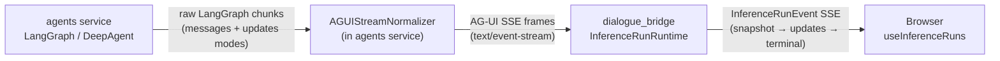
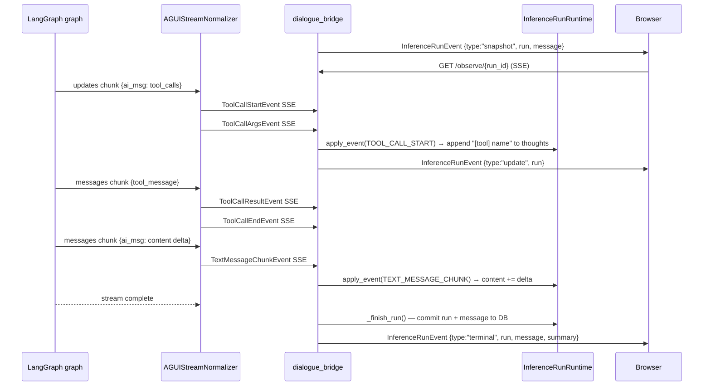
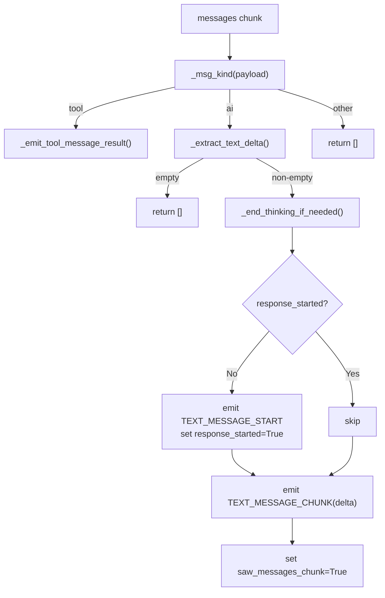
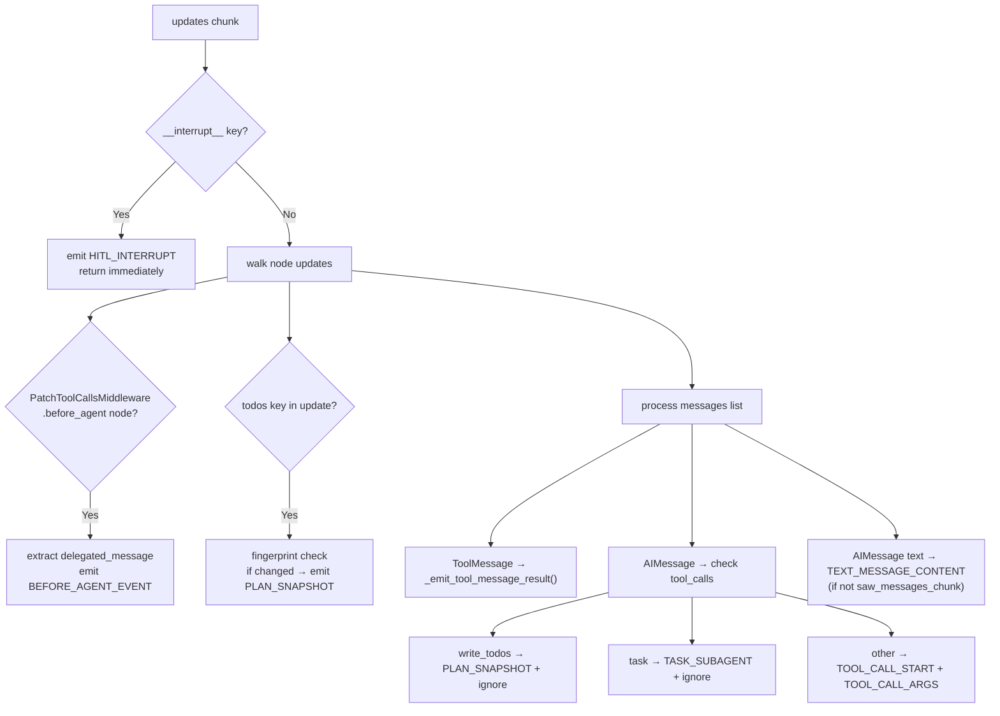
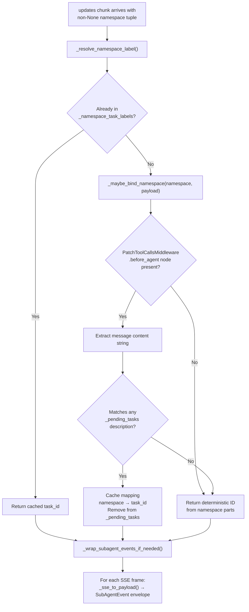
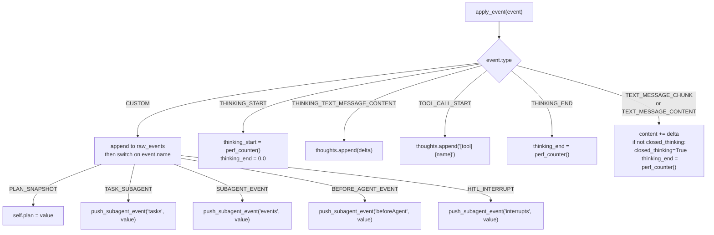
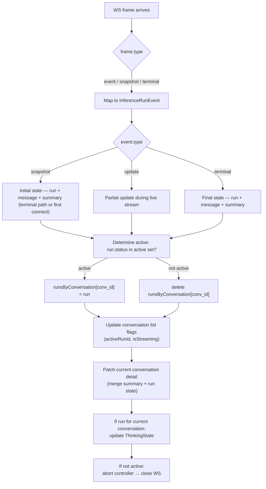
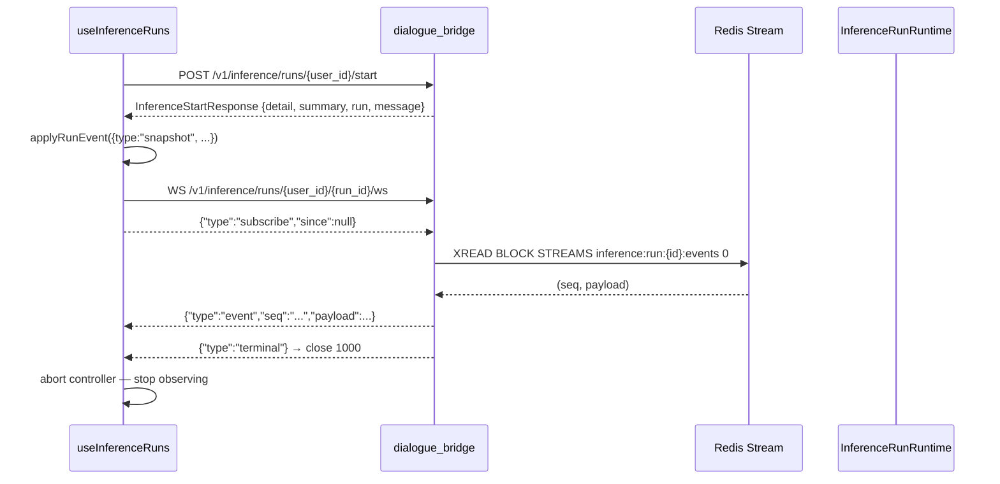

# AG-UI Protocol

The AG-UI protocol is the event contract that flows between the agents service and every consumer of an inference stream. Agents produce a stream of typed Server-Sent Events; the dialogue bridge accumulates them into an `InferenceRunRuntime` snapshot; the client observes a higher-level `InferenceRunEvent` SSE feed that delivers the accumulated state on connect, then streams deltas. The protocol has a standard layer (run lifecycle, thinking, text, tool calls) and a custom-event layer (plan snapshots, sub-agent delegation, HITL interrupts) layered on top of the `CUSTOM` event type.

---

## Services Involved



The normalizer and emitter live inside the agents service process. The bridge does not interpret individual AG-UI frames during streaming — it accumulates them via `apply_event()` and forwards the run-level snapshot to the UI.

---

## Full Sequence



---

## Phase 1 — Event Taxonomy

All events are SSE frames with a `data:` prefix containing a JSON object. Every frame includes a `type` field and a `timestamp` field (epoch milliseconds, set by `AGUIEmitter._emit()`).

### Standard Events

| `type` | Key fields | When emitted |
| --- | --- | --- |
| `RUN_STARTED` | `thread_id`, `run_id` | Before any output — run is now active |
| `RUN_FINISHED` | `thread_id`, `run_id` | After all output — run is done |
| `THINKING_START` | — | Agent enters a reasoning/thinking phase |
| `THINKING_TEXT_MESSAGE_CONTENT` | `delta: str` | One chunk of inner-monologue text |
| `THINKING_END` | — | Reasoning phase complete |
| `TEXT_MESSAGE_START` | `message_id: str` | Agent begins producing a text response |
| `TEXT_MESSAGE_CHUNK` | `message_id`, `delta: str` | One incremental text chunk (streaming) |
| `TEXT_MESSAGE_CONTENT` | `message_id`, `delta: str` | Full text content (updates-mode synthesis) |
| `TEXT_MESSAGE_END` | `message_id` | Text response complete |
| `TOOL_CALL_START` | `tool_call_id`, `tool_call_name` | Agent is about to invoke a tool |
| `TOOL_CALL_ARGS` | `tool_call_id`, `delta: str (JSON)` | Arguments for the tool call |
| `TOOL_CALL_RESULT` | `tool_call_id`, `message_id`, `content` | Tool returned a result |
| `TOOL_CALL_END` | `tool_call_id` | Tool call complete |
| `RUN_ERROR` | `message: str` | Fatal error — stream will not continue |

`TEXT_MESSAGE_CHUNK` is emitted when the agent's `stream_mode` includes `"messages"` (streaming tokens). `TEXT_MESSAGE_CONTENT` is emitted from the `"updates"` mode when the full AI message is available in a node snapshot but no individual tokens were streamed. Both contribute to the same `content` accumulation in `InferenceRunRuntime`.

### Custom Events

All custom events share a wrapper shape:

```json
{
  "type": "CUSTOM",
  "name": "<custom_event_name>",
  "value": { ... },
  "timestamp": 1234567890000
}
```

| `name` | Payload type | Purpose |
| --- | --- | --- |
| `PLAN_SNAPSHOT` | `PlanSnapshot` | Current state of the agent's task list |
| `TASK_SUBAGENT` | `TaskSubAgentEvent` | Orchestrator delegated a task to a sub-agent |
| `SUBAGENT_EVENT` | `SubAgentEvent` | An AG-UI event emitted by a sub-agent, wrapped with task context |
| `BEFORE_AGENT_EVENT` | `BeforeAgentEvent` | Pre-execution message injected by `PatchToolCallsMiddleware` into a sub-agent |
| `HITL_INTERRUPT` | `HITLInterruptEvent` | Graph paused — waiting for human input |

#### `PlanSnapshot`

```json
{
  "items": [
    { "content": "Research the topic", "status": "completed" },
    { "content": "Write the report",   "status": "in_progress" },
    { "content": "Send email",          "status": "pending" }
  ],
  "updated_at": 1234567890000,
  "metadata": null
}
```

`status` is a three-value enum: `"pending"`, `"in_progress"`, `"completed"`.

#### `TaskSubAgentEvent`

```json
{
  "task_id": "tc_abc123",
  "subagent_type": "ResearchAgent",
  "description": "Find all recent papers on transformer attention"
}
```

Emitted once when the orchestrator calls the `task` tool. `task_id` is the LangGraph tool call ID and is the correlation key for all subsequent `SUBAGENT_EVENT` frames from that sub-agent.

#### `SubAgentEvent`

```json
{
  "task_id": "tc_abc123",
  "namespace": ["ResearchAgent:tc_abc123"],
  "event": {
    "type": "TEXT_MESSAGE_CHUNK",
    "message_id": "...",
    "delta": "I found three relevant papers...",
    "timestamp": 1234567890000
  }
}
```

Every standard AG-UI event emitted by a sub-agent is re-emitted wrapped in this envelope, so the client can route sub-agent output to the correct task card without knowing the LangGraph namespace structure.

#### `HITLInterruptEvent`

```json
{
  "thread_id": "conv-uuid",
  "interrupt": { "id": "...", "value": { "question": "Approve this action?" } },
  "metadata": {}
}
```

When the LangGraph graph hits an `__interrupt__` node, no other events from that chunk are emitted — the HITL event is the entire output of that update cycle.

---

## Phase 2 — AGUIEmitter

`AGUIEmitter` is a stateless helper that converts high-level method calls into encoded SSE bytes. It wraps the `ag_ui` library's `EventEncoder` and adds two platform-specific concerns: timestamp injection and namespace attachment.

```python
emitter = AGUIEmitter()

# With writer callback (streaming mode)
emitter.tool_call_start(tool_call_id, name, writer=queue.put_nowait)

# Without writer (collect mode — returns bytes)
frame: bytes = emitter.thought(delta)
```

**Timestamp injection** — `_emit()` checks `hasattr(event_obj, "timestamp")` and sets it to `int(time.time() * 1000)` if not already present. This gives every frame an epoch-millisecond timestamp even if the underlying `ag_ui` model does not auto-populate it.

**Namespace attachment** — `_attach_namespace()` decodes the SSE frame, parses the `data:` JSON, injects `payload["namespace"] = namespace`, and re-encodes. This is used when wrapping sub-agent events — the `namespace` field carries the LangGraph subgraph path so consumers can distinguish orchestrator from sub-agent frames without parsing the `SUBAGENT_EVENT` outer envelope.

**Writer vs return** — every emitter method accepts an optional `writer` callable. When provided, `writer(sse_bytes)` is called and `None` is returned. When absent, the encoded bytes are returned directly. The normalizer always passes a `writer`; direct agent implementations may use either style.

---

## Phase 3 — AGUIStreamNormalizer

The normalizer bridges the gap between LangGraph's raw stream format and the AG-UI event contract. LangGraph agents use `stream_mode=["messages", "updates"]`, which produces an interleaved stream of two distinct payload types. The normalizer handles both and synthesizes them into a coherent sequence of AG-UI events.

### Envelope Unwrapping

Every LangGraph chunk is a sequence. `_unwrap_envelope()` scans for the first element matching the allowed mode strings (`"messages"` or `"updates"`), then extracts:

- **`namespace`** — the tuple immediately before the mode string (identifies which subgraph produced the chunk; `None` for the orchestrator)
- **`mode`** — `"messages"` or `"updates"`
- **`payload`** — the element immediately after mode
- **`metadata`** — optional dict after payload

Legacy two-tuple `(msg, meta)` messages mode chunks are also handled by extracting the meta dict when present.

### Messages Mode (`"messages"`)

Used for streaming token-by-token output. The payload is a single message object.



`_msg_kind()` classifies messages by duck-typing — it checks for `tool_call_id` attribute, `role`, `type`, and class name substrings to identify `ToolMessage`, `AIMessage`, or unknown.

### Updates Mode (`"updates"`)

Used for structured node snapshot output. The payload is a dict keyed by node name. This mode provides tool call intent (args included) and full message content, but individual tokens are not available.



**`saw_messages_chunk` flag** — set to `True` by the messages handler when any streaming token has been seen. The updates handler checks this before emitting `TEXT_MESSAGE_CONTENT`: if streaming tokens already covered the content, the updates-mode full-text synthesis is skipped to avoid duplicate output.

### Per-Actor Stream State

The normalizer maintains a `_stream_state` dict keyed by actor identifier (`"__orchestrator__"` or the namespace label string). Each actor entry tracks:

| Flag | Set when |
| --- | --- |
| `response_started` | First `TEXT_MESSAGE_START` emitted for this actor |
| `response_ended` | `TEXT_MESSAGE_END` emitted |
| `thinking_started` | `THINKING_START` emitted but `THINKING_END` not yet emitted |
| `saw_messages_chunk` | A streaming `TEXT_MESSAGE_CHUNK` was seen |

`_end_thinking_if_needed()` checks `thinking_started` and emits `THINKING_END` if needed — this handles agents that transition from thinking to text or tool calls without explicitly closing the thinking phase.

### Tool Call Correlation

Tool calls span two modes: `args` arrive in the `updates` chunk (from the `AIMessage.tool_calls` list), and `result` arrives in the `messages` chunk (from the subsequent `ToolMessage`). Four sets track state to prevent double-emission:

| Set | Purpose |
| --- | --- |
| `_started_tool_call_ids` | `TOOL_CALL_START` + `TOOL_CALL_ARGS` emitted (dedup guard) |
| `_pending_tool_call_ids` | Waiting for a matching `ToolMessage` result |
| `_finished_tool_call_ids` | `TOOL_CALL_RESULT` + `TOOL_CALL_END` emitted (dedup guard) |
| `_ignored_tool_call_ids` | `write_todos` and `task` — result message is expected but discarded |

`_emit_tool_message_result()` checks all four sets before emitting. A `ToolMessage` whose `tool_call_id` is in `_ignored_tool_call_ids` is silently consumed (removed from the set) and produces no events.

---

## Phase 4 — Special Tool Handling

Three tool names break the standard start/args/result/end lifecycle:

### `write_todos` — Plan Snapshot

The `write_todos` tool is called by the agent's internal planning system to update its task list. Its `ToolMessage` result has no meaning to the client; only the `PlanSnapshot` matters.

When the normalizer sees a tool call where `name == "write_todos"`:

1. Extracts `todos` from the tool args.
2. Computes `_fingerprint(todos)` — a stable `json.dumps` with `sort_keys=True`.
3. Compares to `_last_plan_fingerprint`. If identical (LangGraph replayed the same AIMessage), skips.
4. Emits `PLAN_SNAPSHOT` custom event and updates the fingerprint.
5. Adds `tool_call_id` to `_ignored_tool_call_ids`.

The same deduplication logic runs from the `"todos"` key path inside node updates — both paths converge to the same fingerprint check so only one `PLAN_SNAPSHOT` is emitted regardless of how many times LangGraph replays the state.

### `task` — Sub-Agent Delegation

The `task` tool is how an orchestrator agent delegates work to a sub-agent. There is no meaningful result to return — the sub-agent's output arrives as namespaced chunks.

When `name == "task"`:

1. Extracts `subagent_type` and `description` from args.
2. If this `tool_call_id` has not been seen (`not in _emitted_subagent_task_ids`):
   - Emits `TASK_SUBAGENT` custom event.
   - Records in `_emitted_subagent_task_ids` (dedup across replays).
   - Stores `{description, subagent_type}` in `_pending_tasks[tool_call_id]`.
3. Adds `tool_call_id` to `_ignored_tool_call_ids`.

`_pending_tasks` is later used by `_maybe_bind_namespace()` to bind the LangGraph subgraph namespace to the task ID (see Phase 5).

### `__interrupt__` — HITL

`__interrupt__` is a LangGraph built-in — it appears as a key in the updates payload when the graph's execution is paused. The normalizer treats HITL as a pre-emption: when `__interrupt__` is present in a payload dict, all other node updates in that dict are ignored.

The interrupt value is normalized to `{"id": ..., "value": ...}` if the raw value has attributes (LangGraph `Interrupt` object); otherwise it is passed through as-is.

---

## Phase 5 — Sub-Agent Namespace Wrapping

LangGraph assigns a `namespace` tuple to each subgraph invocation. The normalizer must map these opaque tuples to the `task_id` strings declared by `TASK_SUBAGENT` events so the client can route sub-agent output correctly.



`PatchToolCallsMiddleware` is a LangGraph middleware that injects a `before_agent` message into the subgraph's input containing the task description. The normalizer uses this known message to match the namespace to the pending task. If the description matches a `_pending_tasks` entry, the binding is cached in `_namespace_task_labels` and the pending entry is removed (preventing double-binding).

If binding fails (e.g., description mismatch due to whitespace), `_namespace_task_id()` falls back to a deterministic ID derived from the namespace tuple itself — the first part after a `:` separator, or the first non-empty element.

`_wrap_subagent_events_if_needed()` iterates the list of SSE bytes for that chunk. For each frame it calls `_sse_to_payload()` to decode the JSON, then wraps it in a `SubAgentEvent` envelope via `emitter.subagent_event()`. If SSE decoding fails, `_raw_event_payload()` produces a fallback `{"type": "RAW_SSE_EVENT", "raw_sse": "..."}` dict.

---

## Phase 6 — Bridge Accumulation

The dialogue bridge never parses individual AG-UI frames during the live stream — it forwards raw bytes to the client. But it does parse frames via `_parse_sse_bytes()` for the `InferenceRunRuntime` accumulator, which builds the in-memory snapshot that becomes the terminal `MessageTable` row and the intermediate `InferenceRunEvent` updates.

`_parse_sse_bytes(buffer, chunk)` accumulates bytes into a string buffer, splits on `\n\n` (SSE frame boundary), parses lines starting with `data:`, JSON-decodes each payload, and filters to dicts that have a `"type"` field. The unparsed remainder is returned as the new buffer.

`InferenceRunRuntime.apply_event()` dispatches on `event["type"]`:



`thinking_duration_seconds()` computes the elapsed time from `first_event_ts` (or `thinking_start`) to `thinking_end` (or now). This value is stored on the `MessageTable` row as `thinkingTime` and rendered in the `ChainOfThought` component header.

`push_subagent_event(key, value)` appends to the list at `self.subagents[key]`, creating the dict and the list lazily. The keys used are `"tasks"`, `"events"`, `"beforeAgent"`, and `"interrupts"`.

---

## Phase 7 — Client-Side Observation

The UI uses `useInferenceRuns` to manage the full lifecycle: starting runs, observing their event streams, stopping them, and hydrating on page load.

### Run Observation

`connectInferenceWebSocket(userId, runId, callback, signal)` opens a WebSocket to `/v1/inference/runs/{userId}/{runId}/ws` and sends a `{"type":"subscribe","since":<lastSeenSeq>|null}` frame on open. Every server frame is normalized into an `InferenceRunEvent` shape and passed to `applyRunEvent()`:



The `ThinkingState` update inside `applyRunEvent` uses `message?.thinking ?? run.thinking ?? []` — it prefers the message-level thinking array (final, persisted) over the run-level snapshot (live). This ensures the CoT display shows the complete thought sequence after the run finishes.

Every successful frame updates `lastSeenInferenceSeq[runId]` with the server-assigned `seq` (Redis stream ID). On any non-terminal close, the client reconnects with exponential backoff `[250, 500, 1000, 2000, 5000]` ms, resending `subscribe` with the latest cursor — missed events replay from Redis (1 h post-terminal TTL). Close codes `4401` / `4403` / `4404` are surfaced as `PermanentInferenceWebSocketError` without retry; the toast surface only fires after 5 sustained transient failures.

### Run Lifecycle



`beginRun()` calls `startInference()`, applies the returned conversation detail/summary plus the run placeholder state, and immediately begins observing via `observeRun()` → `connectInferenceWebSocket()`. The start endpoint is backend-owned: normal send, edit, retry, new conversation, and shared conversation continuation all persist their user-side action, create the AI placeholder, and return hydrated state from one request. The abort controller stored in `controllersRef` is used both to close the WebSocket on unmount and to signal that a run has ended (triggered by `applyRunEvent` when the terminal event arrives).

**Page load hydration** — on mount, `useEffect` calls `getActiveInferenceRuns(userId)`. For each active run returned, `observeRunId()` is called so the UI reconnects to any stream that was already running before the page loaded.

**Sidebar streaming state** — terminal run status is authoritative. When a terminal event arrives, the UI clears `runsByConversation`, `activeRunId`, and `isStreaming` for that conversation. IndexedDB snapshots also strip those transient flags, so a refresh cannot resurrect a stale spinner without a matching active run from the backend.

---

## Phase 8 — UI Rendering

### Chain of Thought

`ChainOfThought.tsx` renders the `message.thinking` array as a collapsible step list. Each entry is classified as either a text thought or a tool invocation by testing against `/^\s*\[tool\]\s*/i`. Tool steps render with a `Wrench` icon; text steps render with a numbered label.

`buildCoTSteps(thoughts, {activeIndex, isComplete})` assigns a status to each step:

| Condition | Status |
| --- | --- |
| `isComplete` | `"complete"` for all steps |
| `index < activeIndex` | `"complete"` |
| `index === activeIndex` | `"active"` |
| `index > activeIndex` | `"pending"` |

When `isComplete=true`, a final "Completed" step with a `CheckCircle2` icon is appended. The component header reads `"Thought for {duration}"` when `message.thinkingTime` is present, computed by `formatThinkingDuration()` which produces `"1m 23s"` or `"45s"` format.

### Plan Snapshot

The `message.plan` field (type `PlanSnapshot`) drives a plan card in the message. Each `PlanItem` has a `content` string and a `status` that maps to a visual indicator (pending / in-progress spinner / completed checkmark). The plan is updated in real time as `PLAN_SNAPSHOT` events arrive — `onPlanSnapshot` in the inference handler calls `resetActivePlan()` on new snapshots and rebuilds the display.

### Sub-Agent Events

`message.subagents` is a dict with four optional lists:

```typescript
{
  tasks: TaskSubAgentEvent[]     // delegation declarations
  events: SubAgentEvent[]        // wrapped sub-agent AG-UI events
  beforeAgent: BeforeAgentEvent[] // pre-execution messages
  interrupts: HITLInterruptEvent[] // paused-waiting-for-human
}
```

The UI uses `tasks` to render task cards (one per sub-agent invocation) and `events` to populate each card's inner event stream by filtering on `task_id`.

---

## Sharp Edges and Behavioral Notes

- **`THINKING_END` is not always explicit.** The normalizer emits `THINKING_END` lazily in `_end_thinking_if_needed()` — it fires the first time a non-thinking event (text chunk or tool result) arrives while `thinking_started=true`. An agent that never produces output after thinking will leave the thinking phase open until the stream ends. The bridge handles this by storing `thinking_end = 0.0` and using `perf_counter()` as the end time in `thinking_duration_seconds()` if `thinking_end` is not set.

- **`TEXT_MESSAGE_CONTENT` and `TEXT_MESSAGE_CHUNK` both accumulate to `content`.** The bridge accumulates both event types via `content += delta`. A well-behaved agent emits one or the other, not both — but the accumulator does not prevent double-counting if a buggy agent emits both for the same text.

- **The `message_id` in `TEXT_MESSAGE_START` is the `thread_id`, not a per-message UUID.** `AGUIStreamNormalizer.thread_id` is the LangGraph `configurable.thread_id`, which equals the `conversation_id`. All text events in one run share the same `message_id`. Consumers that expect a unique per-message ID will be surprised.

- **`TOOL_CALL_ARGS` serializes args as a JSON string, not an object.** The `delta` field in `ToolCallArgsEvent` is `json.dumps({"name": name, "args": args or {}})`. Clients must JSON-parse the `delta` field to access the arguments dict.

- **Sub-agent namespace binding can fail silently.** If `_maybe_bind_namespace()` cannot match the before_agent message content to a pending task (e.g., due to whitespace normalization differences), the namespace falls back to a deterministic ID from `_namespace_task_id()`. The events are still emitted as `SUBAGENT_EVENT` but with a generated `task_id` that does not match any `TASK_SUBAGENT` event — the UI will render an orphaned sub-agent stream with no associated task card.

- **HITL pre-empts everything.** When `__interrupt__` appears in an updates payload, all other node updates in that dict are skipped. If a graph node emits both a tool call and an interrupt in the same update (unusual but possible), the tool call start/args events are not emitted. The agent graph still has the tool call recorded in its checkpoint; it will re-emit when the human resumes.

- **The `BEFORE_AGENT_EVENT` is consumed for namespace binding, not for display.** The normalizer reads it to match the namespace to a `_pending_tasks` entry. It is also emitted as a custom event that the bridge stores in `subagents["beforeAgent"]`, but the current UI does not render it — it exists for future debugging tooling.

- **`RUN_ERROR` bypasses the normalizer.** When `agent.astream()` raises an unhandled exception, `BaseAgent._encode_run_error()` directly encodes a `RUN_ERROR` SSE frame without going through the normalizer. The bridge forwards it to the client, which marks the run as failed and displays an error state.

- **The namespace field injected by `_attach_namespace()` is not part of the AG-UI spec.** It is a platform extension added by re-encoding the SSE frame with an extra JSON field. Clients that use a strict AG-UI parser may reject these frames. The bridge's `_parse_sse_bytes()` parses them correctly because it uses plain JSON decoding.

- **`_fingerprint()` uses `sort_keys=True` but not `default=str`.** If a todos list contains non-JSON-serializable values (e.g., Python `datetime` objects from a misconfigured agent), `json.dumps` will raise and the plan snapshot will never be emitted. The exception is not caught.

---

## File Map

| Concept | File | What to look for |
| --- | --- | --- |
| Custom event type constants | [src/agents/runtime/protocols/agui/events.py](../../src/agents/runtime/protocols/agui/events.py) | `HITL_INTERRUPT_EVENT_TYPE`, `PLAN_SNAPSHOT_EVENT_TYPE`, etc. |
| Custom event Pydantic models | [src/agents/runtime/protocols/agui/events.py](../../src/agents/runtime/protocols/agui/events.py) | `HITLInterruptEvent`, `PlanSnapshot`, `PlanItem`, `TaskSubAgentEvent`, `SubAgentEvent`, `BeforeAgentEvent` |
| AG-UI event emission | [src/agents/runtime/protocols/agui/emitter.py](../../src/agents/runtime/protocols/agui/emitter.py) | `AGUIEmitter` — all public methods |
| Namespace attachment | [src/agents/runtime/protocols/agui/emitter.py](../../src/agents/runtime/protocols/agui/emitter.py) | `_attach_namespace()` |
| LangGraph → AG-UI translation | [src/agents/runtime/protocols/agui/normalizer.py](../../src/agents/runtime/protocols/agui/normalizer.py) | `AGUIStreamNormalizer.handle_chunk()` |
| Envelope unwrapping | [src/agents/runtime/protocols/agui/normalizer.py](../../src/agents/runtime/protocols/agui/normalizer.py) | `_unwrap_envelope()` |
| Messages mode handling | [src/agents/runtime/protocols/agui/normalizer.py](../../src/agents/runtime/protocols/agui/normalizer.py) | `_handle_messages_payload()` |
| Updates mode handling | [src/agents/runtime/protocols/agui/normalizer.py](../../src/agents/runtime/protocols/agui/normalizer.py) | `_handle_updates_payload()` |
| Tool call correlation sets | [src/agents/runtime/protocols/agui/normalizer.py](../../src/agents/runtime/protocols/agui/normalizer.py) | `_pending_tool_call_ids`, `_started_tool_call_ids`, `_finished_tool_call_ids`, `_ignored_tool_call_ids` |
| Plan snapshot deduplication | [src/agents/runtime/protocols/agui/normalizer.py](../../src/agents/runtime/protocols/agui/normalizer.py) | `_fingerprint()`, `_last_plan_fingerprint` |
| Sub-agent namespace binding | [src/agents/runtime/protocols/agui/normalizer.py](../../src/agents/runtime/protocols/agui/normalizer.py) | `_maybe_bind_namespace()`, `_resolve_namespace_label()` |
| Sub-agent event wrapping | [src/agents/runtime/protocols/agui/normalizer.py](../../src/agents/runtime/protocols/agui/normalizer.py) | `_wrap_subagent_events_if_needed()` |
| Protocol package exports | [src/agents/runtime/protocols/agui/\_\_init\_\_.py](../../src/agents/runtime/protocols/agui/__init__.py) | All exported symbols |
| Bridge event accumulation | [src/dialogue_bridge/utils/inference_runs.py](../../src/dialogue_bridge/utils/inference_runs.py) | `InferenceRunRuntime.apply_event()` |
| Thinking duration calculation | [src/dialogue_bridge/utils/inference_runs.py](../../src/dialogue_bridge/utils/inference_runs.py) | `thinking_duration_seconds()` |
| SSE frame parsing | [src/dialogue_bridge/router/inference.py](../../src/dialogue_bridge/router/inference.py) | `_parse_sse_bytes()` |
| Client-side type definitions | [src/agentic_ui/src/lib/types.ts](../../src/agentic_ui/src/lib/types.ts) | `InferenceRun`, `InferenceRunEvent`, `MessageOut`, `ThinkingState` |
| Client AG-UI Zod schemas | [src/agentic_ui/src/lib/agui.ts](../../src/agentic_ui/src/lib/agui.ts) | `PlanSnapshotSchema`, `HITLInterruptPayloadSchema`, `CustomAguiEventSchema` |
| Run observation and lifecycle | [src/agentic_ui/src/hooks/useInferenceRuns.ts](../../src/agentic_ui/src/hooks/useInferenceRuns.ts) | `applyRunEvent()`, `observeRunId()`, `beginRun()`, `stopRun()` |
| Inference runtime | [src/agentic_ui/src/runtime/inference.ts](../../src/agentic_ui/src/runtime/inference.ts) | `handleSendMessage()`, `handleStopStreaming()`, edit/retry/shared continue start requests |
| Chain of thought rendering | [src/agentic_ui/src/components/chat/message_parts/ChainOfThought.tsx](../../src/agentic_ui/src/components/chat/message_parts/ChainOfThought.tsx) | `buildCoTSteps()`, `CoT` component |
