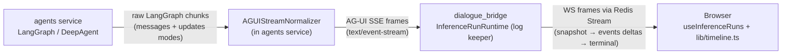
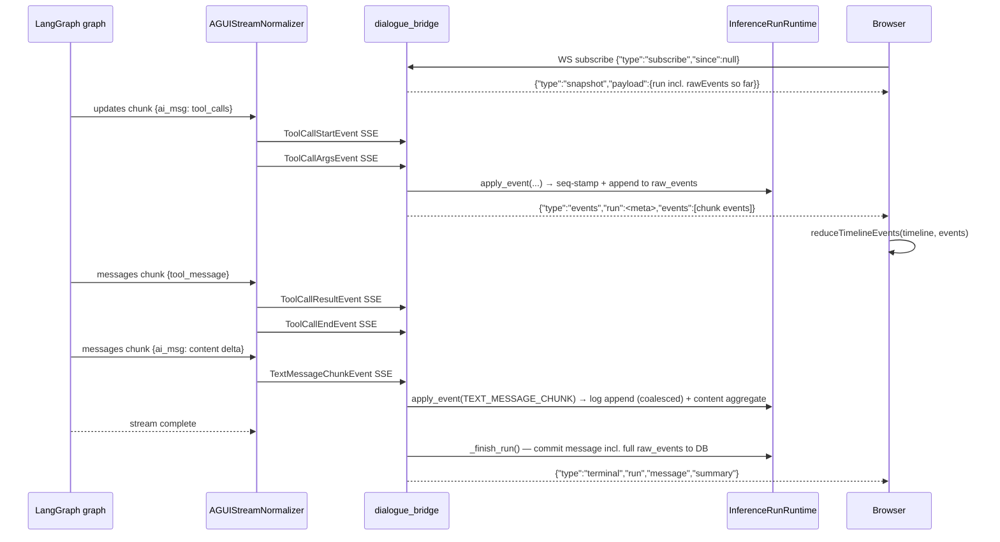
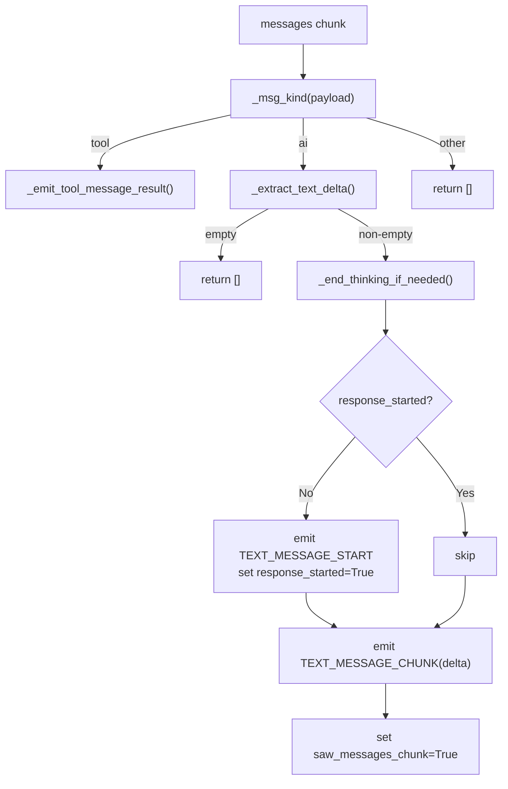
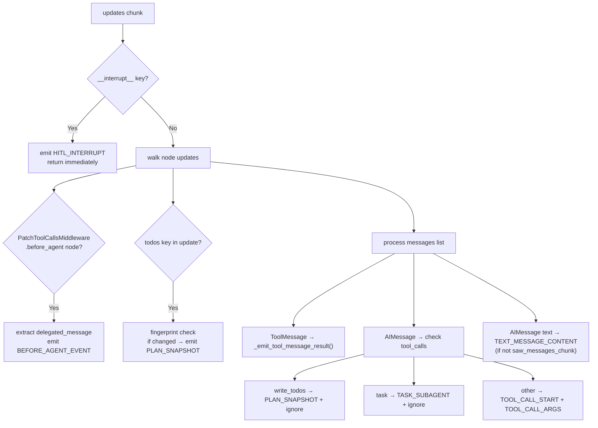
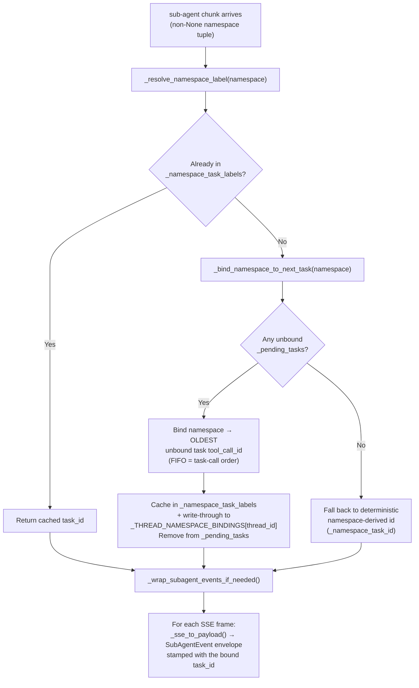
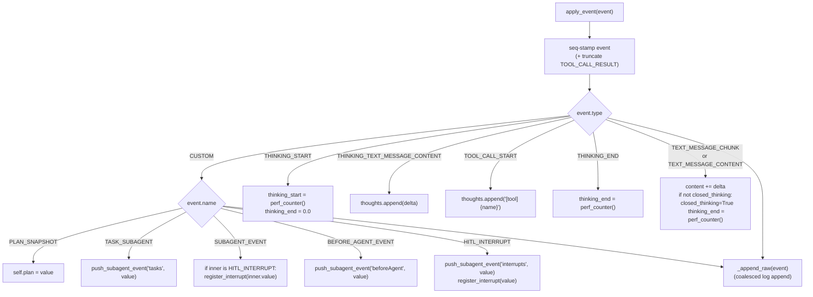
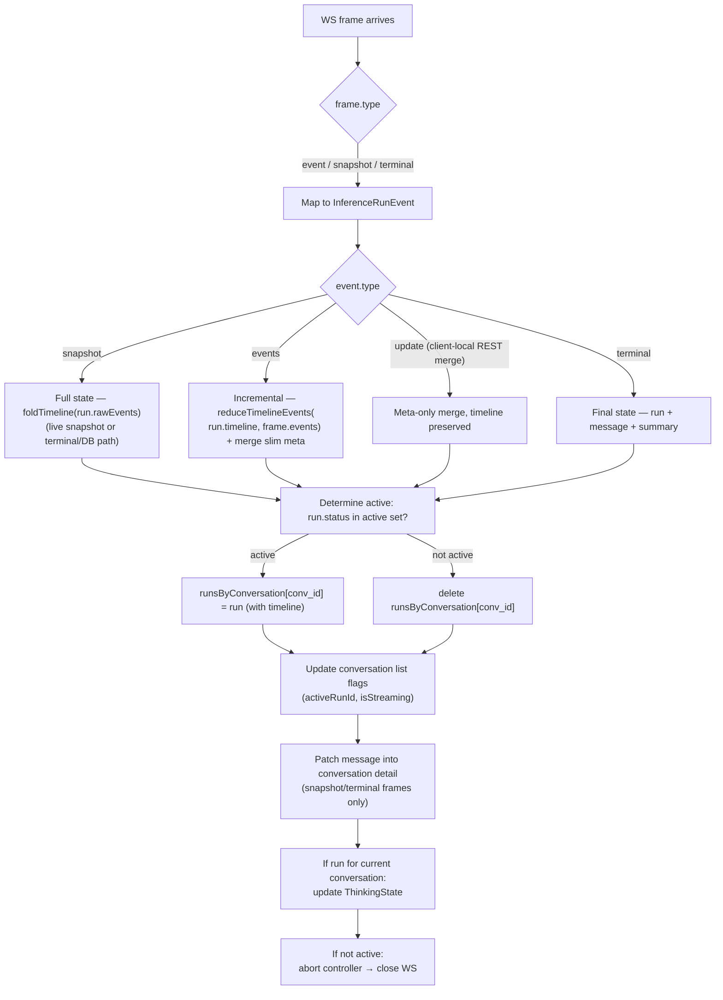
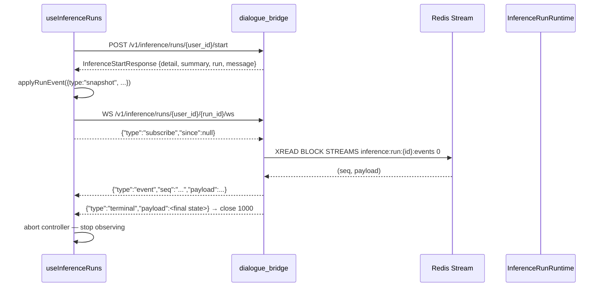

# AG-UI Protocol

The AG-UI protocol is the event contract that flows between the agents service and every consumer of an inference stream. Agents produce a stream of typed Server-Sent Events; the dialogue bridge keeps them as a seq-stamped, delta-coalesced **event log** (`raw_events`) and forwards them in per-chunk `events` frames; the client observes the run over WebSocket — one snapshot frame on subscribe (the full log so far), then deltas — and folds the raw events into the rendered timeline with a single pure reducer (`lib/timeline.ts`). The protocol has a standard layer (run lifecycle, thinking, text, tool calls) and a custom-event layer (plan snapshots, sub-agent delegation, HITL interrupts) layered on top of the `CUSTOM` event type.

---

## Services Involved



The normalizer and emitter live inside the agents service process. The bridge interprets each AG-UI frame just enough to keep the log and its flat aggregates (`apply_event()`): it seq-stamps every event, appends it to `raw_events` with delta coalescing, tracks `pending_interrupts`, and maintains `content`/`thoughts`/`plan`/`subagents` for previews, search, voice and export. **Timeline semantics live exclusively in the client reducer** — the bridge never ships a rendered shape, so renderer changes never require a bridge deploy.

---

## Full Sequence



---

## Phase 1 — Event Taxonomy

All events are SSE frames with a `data:` prefix containing a JSON object. Every frame includes a `type` field and a `timestamp` field (epoch milliseconds, set by `AGUIEmitter._emit()`).

### Standard Events

| `type` | Key fields | When emitted |
| --- | --- | --- |
| `RUN_STARTED` | `thread_id`, `run_id` | Before any output — run is now active |
| `RUN_FINISHED` | `thread_id`, `run_id` | After all output — run is done |
| `THINKING_START` | — | Agent enters a reasoning/thinking phase |
| `THINKING_TEXT_MESSAGE_CONTENT` | `delta: str` | One chunk of inner-monologue text |
| `THINKING_END` | — | Reasoning phase complete |
| `TEXT_MESSAGE_START` | `message_id: str` | Agent begins producing a text response |
| `TEXT_MESSAGE_CHUNK` | `message_id`, `delta: str` | One incremental text chunk (streaming) |
| `TEXT_MESSAGE_CONTENT` | `message_id`, `delta: str` | Full text content (updates-mode synthesis) |
| `TEXT_MESSAGE_END` | `message_id` | Text response complete |
| `TOOL_CALL_START` | `tool_call_id`, `tool_call_name` | Agent is about to invoke a tool |
| `TOOL_CALL_ARGS` | `tool_call_id`, `delta: str (JSON)` | Arguments for the tool call |
| `TOOL_CALL_RESULT` | `tool_call_id`, `message_id`, `content` | Tool returned a result |
| `TOOL_CALL_END` | `tool_call_id` | Tool call complete |
| `RUN_ERROR` | `message: str` | Fatal error — stream will not continue |

`TEXT_MESSAGE_CHUNK` is emitted when the agent's `stream_mode` includes `"messages"` (streaming tokens). `TEXT_MESSAGE_CONTENT` is emitted from the `"updates"` mode when the full AI message is available in a node snapshot but no individual tokens were streamed. Both contribute to the same `content` accumulation in `InferenceRunRuntime`.

### Custom Events

All custom events share a wrapper shape:

```json
{
  "type": "CUSTOM",
  "name": "<custom_event_name>",
  "value": { ... },
  "timestamp": 1234567890000
}
```

| `name` | Payload type | Purpose |
| --- | --- | --- |
| `PLAN_SNAPSHOT` | `PlanSnapshot` | Current state of the agent's task list |
| `TASK_SUBAGENT` | `TaskSubAgentEvent` | Orchestrator delegated a task to a sub-agent |
| `SUBAGENT_EVENT` | `SubAgentEvent` | An AG-UI event emitted by a sub-agent, wrapped with task context |
| `BEFORE_AGENT_EVENT` | `BeforeAgentEvent` | Pre-execution message injected by `PatchToolCallsMiddleware` into a sub-agent |
| `HITL_INTERRUPT` | `HITLInterruptEvent` | Graph paused — waiting for human input |
| `BRIDGE_HITL_RESOLVED` | `{interrupt_id, decision, reason}` | **Bridge-synthesized** (never emitted by the agents service): appended to the event log when `/resume` is accepted, so resolution state survives reloads. The client reducer flips the matching approval's status on it. |

#### `PlanSnapshot`

```json
{
  "items": [
    { "content": "Research the topic", "status": "completed" },
    { "content": "Write the report",   "status": "in_progress" },
    { "content": "Send email",          "status": "pending" }
  ],
  "updated_at": 1234567890000,
  "metadata": null
}
```

`status` is a three-value enum: `"pending"`, `"in_progress"`, `"completed"`.

#### `TaskSubAgentEvent`

```json
{
  "task_id": "tc_abc123",
  "subagent_type": "ResearchAgent",
  "description": "Find all recent papers on transformer attention"
}
```

Emitted once when the orchestrator calls the `task` tool. `task_id` is the LangGraph tool call ID and is the correlation key for all subsequent `SUBAGENT_EVENT` frames from that sub-agent.

#### `SubAgentEvent`

```json
{
  "task_id": "tc_abc123",
  "namespace": ["ResearchAgent:tc_abc123"],
  "event": {
    "type": "TEXT_MESSAGE_CHUNK",
    "message_id": "...",
    "delta": "I found three relevant papers...",
    "timestamp": 1234567890000
  }
}
```

Every standard AG-UI event emitted by a sub-agent is re-emitted wrapped in this envelope, so the client can route sub-agent output to the correct task card without knowing the LangGraph namespace structure.

#### `HITLInterruptEvent`

```json
{
  "thread_id": "run-uuid (the assistant message id)",
  "interrupt": { "id": "<langgraph-interrupt-id>", "value": { "action_requests": [...], "review_configs": [...] } },
  "metadata": { "namespace": "researcher" }
}
```

When the LangGraph graph hits an `__interrupt__` node, no other events from that chunk are emitted — the HITL event is the entire output of that update cycle.

**Dedup contract:** `thread_id` is the run-level LangGraph thread (`run.id`) — every HITL within a run shares the same value, so it is **not** a unique identifier. The bridge and UI dedupe by `interrupt.id`, which is the LangGraph interrupt's unique id captured at the normalizer. Using `thread_id` as a dedup key silently drops every interrupt after the first; this is the bug fix that switched the chain to `interrupt.id`.

**Interrupt value shape (LangChain HITL middleware):** `value` is a serialized `HITLRequest` — `{"action_requests": [<one per pending tool call>], "review_configs": [...]}`. The agents-side `/resume` endpoint reads `action_requests` length from the checkpoint snapshot (not from the wire event) to size the resume `Command(resume={"decisions": [...]})` so its length matches what the middleware expects.

---

## Phase 2 — AGUIEmitter

`AGUIEmitter` is a stateless helper that converts high-level method calls into encoded SSE bytes. It wraps the `ag_ui` library's `EventEncoder` and adds two platform-specific concerns: timestamp injection and namespace attachment.

```python
emitter = AGUIEmitter()

# With writer callback (streaming mode)
emitter.tool_call_start(tool_call_id, name, writer=queue.put_nowait)

# Without writer (collect mode — returns bytes)
frame: bytes = emitter.thought(delta)
```

**Timestamp injection** — `_emit()` checks `hasattr(event_obj, "timestamp")` and sets it to `int(time.time() * 1000)` if not already present. This gives every frame an epoch-millisecond timestamp even if the underlying `ag_ui` model does not auto-populate it.

**Namespace attachment** — `_attach_namespace()` decodes the SSE frame, parses the `data:` JSON, injects `payload["namespace"] = namespace`, and re-encodes. This is used when wrapping sub-agent events — the `namespace` field carries the LangGraph subgraph path so consumers can distinguish orchestrator from sub-agent frames without parsing the `SUBAGENT_EVENT` outer envelope.

**Writer vs return** — every emitter method accepts an optional `writer` callable. When provided, `writer(sse_bytes)` is called and `None` is returned. When absent, the encoded bytes are returned directly. The normalizer always passes a `writer`; direct agent implementations may use either style.

---

## Phase 3 — AGUIStreamNormalizer

The normalizer bridges the gap between LangGraph's raw stream format and the AG-UI event contract. LangGraph agents use `stream_mode=["messages", "updates"]`, which produces an interleaved stream of two distinct payload types. The normalizer handles both and synthesizes them into a coherent sequence of AG-UI events.

### Envelope Unwrapping

Every LangGraph chunk is a sequence. `_unwrap_envelope()` scans for the first element matching the allowed mode strings (`"messages"` or `"updates"`), then extracts:

- **`namespace`** — the tuple immediately before the mode string (identifies which subgraph produced the chunk; `None` for the orchestrator)
- **`mode`** — `"messages"` or `"updates"`
- **`payload`** — the element immediately after mode
- **`metadata`** — optional dict after payload

Legacy two-tuple `(msg, meta)` messages mode chunks are also handled by extracting the meta dict when present.

### Messages Mode (`"messages"`)

Used for streaming token-by-token output. The payload is a single message object.



`_msg_kind()` classifies messages by duck-typing — it checks for `tool_call_id` attribute, `role`, `type`, and class name substrings to identify `ToolMessage`, `AIMessage`, or unknown.

### Updates Mode (`"updates"`)

Used for structured node snapshot output. The payload is a dict keyed by node name. This mode provides tool call intent (args included) and full message content, but individual tokens are not available.



**`saw_messages_chunk` flag** — set to `True` by the messages handler when any streaming token has been seen. The updates handler checks this before emitting `TEXT_MESSAGE_CONTENT`: if streaming tokens already covered the content, the updates-mode full-text synthesis is skipped to avoid duplicate output.

### Per-Actor Stream State

The normalizer maintains a `_stream_state` dict keyed by actor identifier (`"__orchestrator__"` or the namespace label string). Each actor entry tracks:

| Flag | Set when |
| --- | --- |
| `response_started` | First `TEXT_MESSAGE_START` emitted for this actor |
| `response_ended` | `TEXT_MESSAGE_END` emitted |
| `thinking_started` | `THINKING_START` emitted but `THINKING_END` not yet emitted |
| `saw_messages_chunk` | A streaming `TEXT_MESSAGE_CHUNK` was seen |

`_end_thinking_if_needed()` checks `thinking_started` and emits `THINKING_END` if needed — this handles agents that transition from thinking to text or tool calls without explicitly closing the thinking phase.

### Tool Call Correlation

Tool calls span two modes: `args` arrive in the `updates` chunk (from the `AIMessage.tool_calls` list), and `result` arrives in the `messages` chunk (from the subsequent `ToolMessage`). Four sets track state to prevent double-emission:

| Set | Purpose |
| --- | --- |
| `_started_tool_call_ids` | `TOOL_CALL_START` + `TOOL_CALL_ARGS` emitted (dedup guard) |
| `_pending_tool_call_ids` | Waiting for a matching `ToolMessage` result |
| `_finished_tool_call_ids` | `TOOL_CALL_RESULT` + `TOOL_CALL_END` emitted (dedup guard) |
| `_ignored_tool_call_ids` | `write_todos` and `task` — result message is expected but discarded |

`_emit_tool_message_result()` checks all four sets before emitting. A `ToolMessage` whose `tool_call_id` is in `_ignored_tool_call_ids` is silently consumed (removed from the set) and produces no events.

---

## Phase 4 — Special Tool Handling

Three tool names break the standard start/args/result/end lifecycle:

### `write_todos` — Plan Snapshot

The `write_todos` tool is called by the agent's internal planning system to update its task list. Its `ToolMessage` result has no meaning to the client; only the `PlanSnapshot` matters.

When the normalizer sees a tool call where `name == "write_todos"`:

1. Extracts `todos` from the tool args.
2. Computes `_fingerprint(todos)` — a stable `json.dumps` with `sort_keys=True`.
3. Compares to `_last_plan_fingerprint`. If identical (LangGraph replayed the same AIMessage), skips.
4. Emits `PLAN_SNAPSHOT` custom event and updates the fingerprint.
5. Adds `tool_call_id` to `_ignored_tool_call_ids`.

The same deduplication logic runs from the `"todos"` key path inside node updates — both paths converge to the same fingerprint check so only one `PLAN_SNAPSHOT` is emitted regardless of how many times LangGraph replays the state.

### `task` — Sub-Agent Delegation

The `task` tool is how an orchestrator agent delegates work to a sub-agent. There is no meaningful result to return — the sub-agent's output arrives as namespaced chunks.

When `name == "task"`:

1. Extracts `subagent_type` and `description` from args.
2. If this `tool_call_id` has not been seen (`not in _emitted_subagent_task_ids`):
   - Emits `TASK_SUBAGENT` custom event.
   - Records in `_emitted_subagent_task_ids` (dedup across replays).
   - Stores `{description, subagent_type}` in `_pending_tasks[tool_call_id]`.
3. Adds `tool_call_id` to `_ignored_tool_call_ids`.

`_pending_tasks` is later consumed by `_bind_namespace_to_next_task()` (via `_resolve_namespace_label()`) to bind the LangGraph subgraph namespace to the task ID in task-call order (see Phase 5).

### `__interrupt__` — HITL

`__interrupt__` is a LangGraph built-in — it appears as a key in the updates payload when the graph's execution is paused. The normalizer treats HITL as a pre-emption: when `__interrupt__` is present in a payload dict, all other node updates in that dict are ignored.

The interrupt value is normalized to `{"id": ..., "value": ...}` if the raw value has attributes (LangGraph `Interrupt` object); otherwise it is passed through as-is.

---

## Phase 5 — Sub-Agent Namespace Wrapping

LangGraph assigns a freshly-generated `namespace` tuple (e.g. `("tools:<uuid>",)`) to each subgraph invocation. **That uuid is not derivable from the `task` tool_call_id** — deepagents (0.6.10) runs the sub-agent via `subagent.ainvoke(state, {"configurable": {"ls_agent_type": "subagent"}})`, with no `checkpoint_ns` seeded from the call id — so there is no hard id link in the wire data. The normalizer must still map each opaque namespace to the `task_id` declared by its `TASK_SUBAGENT` event so the client can route sub-agent output to the right task card.



**Order-based binding.** Because the namespace uuid carries no link to the task call, binding is by **order**: the first time a sub-agent namespace is seen, it is bound to the *oldest still-unbound* `task` tool_call_id in `_pending_tasks` (insertion-ordered = task-call order). The bind is anchored by the `PatchToolCallsMiddleware.before_agent` marker, which 0.6.10 emits **stamped with the sub-agent's namespace** the moment the gated `task` is approved (its body is empty, so there is nothing to content-match — the namespace + arrival order is the signal). `_resolve_namespace_label()` also binds lazily on the first metadata-bearing chunk if the marker was missed. `task` is HITL-gated, so sub-agents start sequentially and FIFO is exact; two parallel sub-agents of the *same* type are the residual ambiguity (each still binds to a distinct task — no drop or collision).

**Binding persists across HITL resume (`_THREAD_NAMESPACE_BINDINGS`).** A fresh `AGUIStreamNormalizer` is built per request, so without persistence a `/resume` leg would start with an empty `_namespace_task_labels`. That is fatal when a **sub-agent's own tool** is gated: on resume the orchestrator does not re-emit the `task` call (the sub-agent is mid-flight), so `_pending_tasks` is empty and the sub-agent's continuation would fall back to the raw namespace id — orphaning it into a new task card. The module-level `_THREAD_NAMESPACE_BINDINGS` store (keyed by `thread_id`) is rehydrated in `__init__` and written through on every bind, so the mapping survives the paused→resume boundary. It is dropped by `release_namespace_bindings(thread_id)` on the same lifecycle as the checkpointer cache — on a fresh `/stream` start and on a non-paused terminal (via `release_checkpoint_unless_paused`). The client mirrors this with a stable-namespace route (see Phase 8).

If no task is pending and the namespace is unbound, `_namespace_task_id()` falls back to a deterministic id derived from the tuple — the first part after a `:` separator, or the first non-empty element.

`_wrap_subagent_events_if_needed()` iterates the list of SSE bytes for that chunk. For each frame it calls `_sse_to_payload()` to decode the JSON, then wraps it in a `SubAgentEvent` envelope (stamped with the bound `task_id`) via `emitter.subagent_event()`. If SSE decoding fails, `_raw_event_payload()` produces a fallback `{"type": "RAW_SSE_EVENT", "raw_sse": "..."}` dict.

---

## Phase 6 — Bridge Log Keeping

The dialogue bridge parses frames via `_parse_sse_bytes()` and feeds each event to `InferenceRunRuntime.apply_event()`. Its primary output is the **event log**: every event gets a monotonic `seq` stamp and is appended to `raw_events` — the durable per-run log that the client replays into the rendered timeline and that `_finish_run` persists onto the `MessageTable` row. The chunk's stamped events are then published as one `{"type":"events"}` delta frame to the Redis stream.

`_parse_sse_bytes(buffer, chunk)` accumulates bytes into a string buffer, splits on `\n\n` (SSE frame boundary), parses lines starting with `data:`, JSON-decodes each payload, and filters to dicts that have a `"type"` field. The unparsed remainder is returned as the new buffer.

**Log coalescing** (`_append_raw` / `_coalesce_key`): consecutive `TEXT_MESSAGE_CHUNK`/`TEXT_MESSAGE_CONTENT` (same `messageId` + namespace) and `TOOL_CALL_ARGS` (same `toolCallId`) merge into one stored event with a concatenated `delta`, keeping the `seq` of the last merged wire event and gaining `timestampEnd`. `SUBAGENT_EVENT` envelopes merge one level down when they share a `task_id` with mergeable inner deltas. `THINKING_TEXT_MESSAGE_CONTENT` is **never coalesced** — each thinking event is one discrete thought step, and merging would make the hydrated view flatter than the live one. `TOOL_CALL_RESULT` content is truncated at `settings.inference.tool_result_max_chars` with a `"truncated": true` flag.

Alongside the log, `apply_event()` maintains flat aggregates used for previews / search / voice / export and the pause decision — never for the timeline:



`thinking_duration_seconds()` computes the elapsed time from `first_event_ts` (or `thinking_start`) to `thinking_end` (or now). This value is stored on the `MessageTable` row as `thinkingTime` and used as the fallback duration label on legacy timelines.

`push_subagent_event(key, value)` appends to the list at `self.subagents[key]`, creating the dict and the list lazily. The keys used are `"tasks"`, `"beforeAgent"`, and `"interrupts"` — the old heavyweight `"events"` key is no longer accumulated, because the full log already carries every `SUBAGENT_EVENT` and the UI folds sub-agent panels from it.

`pending_interrupt_ids` (exposed as the `pending_interrupts` count) is what the inference manager inspects after the upstream `/stream` call ends to decide whether the run is genuinely terminal or paused on a HITL checkpoint. It is a set of **interrupt identities** keyed by `interrupt.id`, never a bare counter: a sub-agent interrupt is delivered twice (top-level `HITL_INTERRUPT` with namespace metadata + the same event wrapped in `SUBAGENT_EVENT`), so `register_interrupt` makes the second envelope a no-op, and each resume round-trip (see below) removes exactly one identity — the payload's `interrupt_id`, or the oldest pending entry as a fallback. A counter here double-counts every sub-agent pause, drifts upward across resume legs, and leaves the bridge waiting for a resume after the run has actually finished.

---

## Phase 6.5 — HITL Resume Round-Trip

When LangGraph emits `__interrupt__`, the agents-service normalizer translates it into an AG-UI `HITL_INTERRUPT` event (`metadata.namespace` carries the namespace path so the bridge / UI know which subagent paused). The graph state is auto-saved by the LangGraph checkpointer keyed by `thread_id`. The upstream `/stream` HTTP body ends naturally after the interrupt — no error frame.

```mermaid
sequenceDiagram
    autonumber
    participant UI as Browser
    participant Bridge as dialogue_bridge
    participant Task as Run task
    participant Redis as Redis Stream
    participant Agents as agents service

    Note over Task: First /stream leg ends with pending_interrupts > 0
    Task->>Task: await resume_event vs cancel_event

    UI->>Bridge: POST /v1/inference/runs/{user}/{run}/resume<br/>{interruptId, threadId, decision, reason?, value?}
    Bridge->>Bridge: validate ownership; request_run_resume(run, payload)
    Bridge->>Task: set resume_event + store payload (incl. interrupt_id)
    Bridge-->>UI: 200 InferenceRunOut (snapshot)

    Task->>Task: pop payload; pending_interrupts -= 1
    Task->>Redis: XADD events frame carrying CUSTOM BRIDGE_HITL_RESOLVED<br/>(also appended to raw_events — resolution survives reloads)
    Task->>Agents: POST /agents/{slug}/resume<br/>AgentResumeRequest{thread_id, interrupt_id, decision, value, reason}
    Agents->>Agents: has_checkpointer(thread_id)?
    Agents->>Agents: rehydrate cached InMemorySaver
    Agents->>Agents: verify snapshot.interrupts[0].id == req.interrupt_id
    Agents->>Agents: size decisions[] = len(action_requests)
    Agents->>Agents: graph.astream(Command(resume=...), config)
    Agents-->>Task: AG-UI SSE frames
    loop For each resume chunk
        Task->>Task: runtime.apply_event(event)
        Task->>Redis: XADD inference:run:{id}:events
        Redis-->>UI: WS frame
    end
    Note over Task: Run can pause again; the loop in _run re-enters this flow.

    alt no cached checkpoint
        Agents-->>Task: 409 Conflict (no paused checkpoint)
        Task->>Bridge: _finish_run("failed", "no paused checkpoint")
        Bridge->>Redis: terminal XADD + EXPIRE
    end
    alt interrupt_id mismatch
        Agents-->>Task: 409 Conflict (stale interrupt)
        Task->>Bridge: _finish_run("failed", ...)
    end
```

**LangChain `Command(resume=...)` decision payload:** the middleware expects `{"decisions": [<decision>, ...]}` where the list length equals the number of pending tool calls in the interrupted state. The agents `/resume` endpoint reads `snapshot.interrupts[0].value.action_requests` to compute the count and replicates the user's single decision N times.

| User intent | Decision dict | LangChain behaviour |
| --- | --- | --- |
| `approve` | `{"type": "approve"}` | Tool executes. `reason`/`value` are dropped — `ApproveDecision` has no `message` slot. |
| `reject` | `{"type": "reject", "message": req.reason or "User rejected this action."}` | Tool does **not** execute; a `ToolMessage` with `content=<message>` is appended in its place and the agent loop continues, so the agent can react to the rejection. `message` is mandatory — the default text prevents a `KeyError` when the user rejects without typing a reason. |

The checkpointer cache is process-local in the agents service (single-replica). Switching to a Postgres-backed checkpointer is a drop-in if multi-replica is ever required; nothing else in the resume flow needs to change. The sub-agent namespace→task binding store (`_THREAD_NAMESPACE_BINDINGS`, Phase 5) shares this exact lifecycle and single-replica assumption — it is rehydrated on each resume leg so a sub-agent's post-approval output keeps its original task card, and released alongside the checkpointer when the run truly ends.

---

## Phase 7 — Client-Side Observation

The UI uses `useInferenceRuns` to manage the full lifecycle: starting runs, observing their event streams, stopping them, and hydrating on page load.

### Run Observation

`connectInferenceWebSocket(userId, runId, callback, signal)` opens a WebSocket to `/v1/inference/runs/{userId}/{runId}/ws` and sends a `{"type":"subscribe","since":<lastSeenSeq>|null}` frame on open. Every server frame is normalized into an `InferenceRunEvent` shape and passed to `applyRunEvent()`, which merges it via `mergeRunEvent()`:



Per-event `seq` numbers (stamped by the bridge, distinct from the Redis entry-id `seq` on the WS envelope) make the fold idempotent: events already folded — e.g. the overlap between the live snapshot and the first deltas — are skipped via `timeline.lastSeq`. The `ThinkingState` update derives its flat thought strings from the folded timeline (`timelineThoughtStrings`), falling back to `message.thinking` on terminal frames.

Every successful frame updates `lastSeenInferenceSeq[runId]` with the server-assigned `seq` (Redis stream ID). On any non-terminal close, the client reconnects with exponential backoff `[250, 500, 1000, 2000, 5000]` ms, resending `subscribe` with the latest cursor — missed events replay from Redis (1 h post-terminal TTL). Close codes `4401` / `4403` / `4404` are surfaced as `PermanentInferenceWebSocketError` without retry; the toast surface only fires after 5 sustained transient failures.

### Run Lifecycle



`beginRun()` calls `startInference()`, applies the returned conversation detail/summary plus the run placeholder state, and immediately begins observing via `observeRun()` → `connectInferenceWebSocket()`. The start endpoint is backend-owned: normal send, edit, retry, new conversation, and shared conversation continuation all persist their user-side action, create the AI placeholder, and return hydrated state from one request. The abort controller stored in `controllersRef` is used both to close the WebSocket on unmount and to signal that a run has ended (triggered by `applyRunEvent` when the terminal event arrives).

**Page load hydration** — on mount, `useEffect` calls `getActiveInferenceRuns(userId)`. For each active run returned, `observeRunId()` is called so the UI reconnects to any stream that was already running before the page loaded.

**Sidebar streaming state** — terminal run status is authoritative. When a terminal event arrives, the UI clears `runsByConversation`, `activeRunId`, and `isStreaming` for that conversation. IndexedDB snapshots also strip those transient flags, so a refresh cannot resurrect a stale spinner without a matching active run from the backend.

---

## Phase 8 — UI Rendering: the Run Timeline

The AI message body is the **derived run timeline**: a temporal block sequence `[Thinking, Content, Subagent, Content, Thinking, …]` folded from the raw event log by `lib/timeline.ts`. The same reducer runs incrementally on live `events` frames (`reduceTimelineEvents`) and in batch on hydration (`foldTimeline` via the memoized `useRunTimeline` hook, keyed to the message's final event state) — live and hydrated views cannot drift because they are the same function. Nothing derived is ever persisted.

Block semantics (`reduceTimelineEvents`):

| Event | Effect on blocks |
| --- | --- |
| `THINKING_START` / `THINKING_TEXT_MESSAGE_CONTENT` | Opens (or appends a thought item to) the open Thinking block; thinking after content starts a **new** Thinking block — that's the alternation |
| `TOOL_CALL_*` | Tool item inside the open Thinking block (implicitly opening one — the deep-agent path never emits `THINKING_START`); lifecycle maps to `input-streaming → input-available → output-available`, durations from event timestamps |
| `TEXT_MESSAGE_CHUNK`/`CONTENT` | Closes the open Thinking block, appends to the open Content block |
| `TASK_SUBAGENT` / `SUBAGENT_EVENT` | Opens a Subagent block at its log position (closing open blocks) and folds the inner events into the panel's own nested mini-timeline. The reducer keys the block by the **stable LangGraph namespace** (`fold.namespaceToKey`), aliased to the `task_id` on first sighting — so a sub-agent's post-resume continuation (which may arrive under a fallback `task_id` after a HITL pause) rejoins the same block instead of orphaning |
| `HITL_INTERRUPT` | Binds the approval onto the stalled tool item it gates (`tool.approval`, nearest resultless tool in the open Thinking block, name-matched via the action request) + entry in `timeline.interrupts`; a standalone approval item is the fallback for interrupts that don't gate a tool call |
| `BRIDGE_HITL_RESOLVED` | Flips the matching approval to approved/rejected. On approve it arms a single-shot `pendingRetool` marker: the resumed graph re-executes the tool under a **fresh `toolCallId`**, and the next matching `TOOL_CALL_START` merges into the stalled item (args re-stream, result lands there) instead of creating a duplicate step |
| `PLAN_SNAPSHOT` | Replaces `timeline.plan` (not a block) |

The **Done sentinel** (`finalizeTimeline`) closes all open blocks and stamps `terminal`/`terminalStatus` — it fires **only** from a terminal run status (completed/cancelled/failed), never from `THINKING_END`, so a HITL-paused run keeps an open, done-less timeline. Rendering lives in `message_parts/TimelineBlocks.tsx` behind `AgentRunTimeline.tsx`: the Thinking block interior is a claude.ai-style vertical step flow (icon column + connector line), where thoughts are dot steps and each tool call is one compact clickable row that expands inline to its Parameters/Result code blocks. A HITL-gated tool carries its whole approval lifecycle on that one row — amber "Needs approval" while pending (the composer takeover is the approval surface), an emerald "Approved" trace plus the result once re-executed, or an orange "Rejected" with the reason (the tool never ran). Closed Thinking blocks end with a green Done step; the run's last block carries the terminal status (Done/Stopped/Failed). Once terminal, the plan card and sub-agent panels leave the body for two AI-action-bar buttons that open right-side panels (`RunSidePanels.tsx`); the pending HITL approval takes over the composer (`HitlInputTakeover.tsx`).

Legacy messages persisted before the full-log change carry CUSTOM-only logs; `foldTimeline` detects the absence of text/thinking/tool events and reconstructs a coarse `[Thinking, …subagents…, Content]` timeline from the aggregated `content`/`thinking` columns instead.

### Plan Snapshot

`timeline.plan` (type `PlanSnapshot`) drives the live plan card above the composer while the run streams and the post-run Plan side panel. Each `PlanItem` has a `content` string and a `status` that maps to a visual indicator (pending / in-progress spinner / completed checkmark); each `PLAN_SNAPSHOT` event wholesale-replaces the plan.

### Sub-Agent Events

Sub-agent rendering folds entirely from the `TASK_SUBAGENT` / `SUBAGENT_EVENT` events in the log — each delegation becomes a Subagent block whose nested blocks reuse the same Thinking/Content primitives. The persisted `message.subagents` dict (`tasks` / `beforeAgent` / `interrupts`) remains as a flat aggregate for non-timeline consumers; the old `events` key is no longer written.

---

## Sharp Edges and Behavioral Notes

- **`THINKING_END` is not always explicit.** The normalizer emits `THINKING_END` lazily in `_end_thinking_if_needed()` — it fires the first time a non-thinking event (text chunk or tool result) arrives while `thinking_started=true`. An agent that never produces output after thinking will leave the thinking phase open until the stream ends. The bridge handles this by storing `thinking_end = 0.0` and using `perf_counter()` as the end time in `thinking_duration_seconds()` if `thinking_end` is not set.

- **`TEXT_MESSAGE_CONTENT` and `TEXT_MESSAGE_CHUNK` both accumulate to `content`.** The bridge accumulates both event types via `content += delta`. A well-behaved agent emits one or the other, not both — but the accumulator does not prevent double-counting if a buggy agent emits both for the same text.

- **The `message_id` in `TEXT_MESSAGE_START` is the `thread_id`, not a per-message UUID.** `AGUIStreamNormalizer.thread_id` is the LangGraph `configurable.thread_id`, which equals the run id (the assistant message id). All text events in one run share the same `message_id`. Consumers that expect a unique per-message ID will be surprised; the bridge's log coalescing leans on it as part of the text merge key.

- **`TOOL_CALL_ARGS` serializes args as a JSON string, not an object.** The `delta` field in `ToolCallArgsEvent` is `json.dumps({"name": name, "args": args or {}})`. Clients must JSON-parse the `delta` field to access the arguments dict.

- **Sub-agent namespace binding is order-based, and persists across resume.** Binding maps a namespace to the oldest unbound `task` tool_call_id (`_bind_namespace_to_next_task`), since the LangGraph namespace uuid carries no link to the call id. FIFO is exact while `task` is HITL-gated (sequential starts); two concurrent sub-agents of the *same* type are the residual ambiguity (each still binds to a distinct task — never dropped or collided). The binding is persisted per `thread_id` in `_THREAD_NAMESPACE_BINDINGS` and rehydrated on every `/resume` leg, which is what keeps a sub-agent whose **own tool** was HITL-gated from orphaning its post-approval continuation into a new task card. Only if no task is pending and the namespace is genuinely unknown does it fall back to a generated `task_id` (`_namespace_task_id`) that matches no `TASK_SUBAGENT` — the orphan case.

- **HITL pre-empts everything.** When `__interrupt__` appears in an updates payload, all other node updates in that dict are skipped. If a graph node emits both a tool call and an interrupt in the same update (unusual but possible), the tool call start/args events are not emitted. The agent graph still has the tool call recorded in its checkpoint; it will re-emit when the human resumes.

- **The `BEFORE_AGENT_EVENT` marker anchors namespace binding, not display.** In 0.6.10 the `PatchToolCallsMiddleware.before_agent` node update arrives stamped with the sub-agent's namespace but with an **empty body** — so the normalizer uses its namespace + arrival order (not its content) to trigger the bind, and emits a `BEFORE_AGENT_EVENT` with an empty `message`. The bridge stores it in `subagents["beforeAgent"]`; the current UI does not render it.

- **`RUN_ERROR` bypasses the normalizer.** When `agent.astream()` raises an unhandled exception, `BaseAgent._encode_run_error()` directly encodes a `RUN_ERROR` SSE frame without going through the normalizer. The bridge forwards it to the client, which marks the run as failed and displays an error state.

- **The namespace field injected by `_attach_namespace()` is not part of the AG-UI spec.** It is a platform extension added by re-encoding the SSE frame with an extra JSON field. Clients that use a strict AG-UI parser may reject these frames. The bridge's `_parse_sse_bytes()` parses them correctly because it uses plain JSON decoding.

- **`_fingerprint()` uses `sort_keys=True` but not `default=str`.** If a todos list contains non-JSON-serializable values (e.g., Python `datetime` objects from a misconfigured agent), `json.dumps` will raise and the plan snapshot will never be emitted. The exception is not caught.

---

## File Map

| Concept | File | What to look for |
| --- | --- | --- |
| Custom event type constants | [src/agents/runtime/agui/events.py](../../src/agents/runtime/agui/events.py) | `HITL_INTERRUPT_EVENT_TYPE`, `PLAN_SNAPSHOT_EVENT_TYPE`, etc. |
| Custom event Pydantic models | [src/agents/runtime/agui/events.py](../../src/agents/runtime/agui/events.py) | `HITLInterruptEvent`, `PlanSnapshot`, `PlanItem`, `TaskSubAgentEvent`, `SubAgentEvent`, `BeforeAgentEvent` |
| AG-UI event emission | [src/agents/runtime/agui/emitter.py](../../src/agents/runtime/agui/emitter.py) | `AGUIEmitter` — all public methods |
| Namespace attachment | [src/agents/runtime/agui/emitter.py](../../src/agents/runtime/agui/emitter.py) | `_attach_namespace()` |
| LangGraph → AG-UI translation | [src/agents/runtime/agui/normalizer.py](../../src/agents/runtime/agui/normalizer.py) | `AGUIStreamNormalizer.handle_chunk()` |
| Envelope unwrapping | [src/agents/runtime/agui/normalizer.py](../../src/agents/runtime/agui/normalizer.py) | `_unwrap_envelope()` |
| Messages mode handling | [src/agents/runtime/agui/normalizer.py](../../src/agents/runtime/agui/normalizer.py) | `_handle_messages_payload()` |
| Updates mode handling | [src/agents/runtime/agui/normalizer.py](../../src/agents/runtime/agui/normalizer.py) | `_handle_updates_payload()` |
| Tool call correlation sets | [src/agents/runtime/agui/normalizer.py](../../src/agents/runtime/agui/normalizer.py) | `_pending_tool_call_ids`, `_started_tool_call_ids`, `_finished_tool_call_ids`, `_ignored_tool_call_ids` |
| Plan snapshot deduplication | [src/agents/runtime/agui/normalizer.py](../../src/agents/runtime/agui/normalizer.py) | `_fingerprint()`, `_last_plan_fingerprint` |
| Sub-agent namespace binding | [src/agents/runtime/agui/normalizer.py](../../src/agents/runtime/agui/normalizer.py) | `_bind_namespace_to_next_task()`, `_resolve_namespace_label()`, `_namespace_task_id()` |
| Namespace binding persistence across resume | [src/agents/runtime/agui/normalizer.py](../../src/agents/runtime/agui/normalizer.py) | `_THREAD_NAMESPACE_BINDINGS`, `release_namespace_bindings()` (cleared via `utils/checkpointer.py` + `main.py`) |
| Sub-agent event wrapping | [src/agents/runtime/agui/normalizer.py](../../src/agents/runtime/agui/normalizer.py) | `_wrap_subagent_events_if_needed()` |
| Protocol package exports | [src/agents/runtime/agui/\_\_init\_\_.py](../../src/agents/runtime/agui/__init__.py) | All exported symbols |
| Bridge log keeping | [src/dialogue_bridge/utils/inference_runs.py](../../src/dialogue_bridge/utils/inference_runs.py) | `InferenceRunRuntime.apply_event()`, `_append_raw()`, `_coalesce_key()`, `_truncate_tool_result()` |
| Delta frame publishing | [src/dialogue_bridge/utils/inference_runs.py](../../src/dialogue_bridge/utils/inference_runs.py) | `InferenceRunManager._publish_delta()`, `build_live_snapshot()` |
| Thinking duration calculation | [src/dialogue_bridge/utils/inference_runs.py](../../src/dialogue_bridge/utils/inference_runs.py) | `thinking_duration_seconds()` |
| SSE frame parsing | [src/dialogue_bridge/utils/inference_runs.py](../../src/dialogue_bridge/utils/inference_runs.py) | `_parse_sse_bytes()` |
| Client-side type definitions | [src/agentic_ui/src/lib/types.ts](../../src/agentic_ui/src/lib/types.ts) | `InferenceRun`, `InferenceRunEvent`, `MessageOut`, `RunTimeline`, `TimelineBlock`, `ThinkingState` |
| Client AG-UI Zod schemas | [src/agentic_ui/src/lib/agui.ts](../../src/agentic_ui/src/lib/agui.ts) | `PlanSnapshotSchema`, `HITLInterruptPayloadSchema`, `CustomAguiEventSchema` |
| Timeline reducer | [src/agentic_ui/src/lib/timeline.ts](../../src/agentic_ui/src/lib/timeline.ts) | `reduceTimelineEvents()`, `foldTimeline()`, `finalizeTimeline()`, `pendingTimelineInterrupts()` |
| Run observation and lifecycle | [src/agentic_ui/src/hooks/useInferenceRuns.ts](../../src/agentic_ui/src/hooks/useInferenceRuns.ts) | `applyRunEvent()`, `mergeRunEvent()`, `observeRunId()`, `beginRun()`, `stopRun()` |
| Settled-message timeline | [src/agentic_ui/src/hooks/useRunTimeline.ts](../../src/agentic_ui/src/hooks/useRunTimeline.ts) | `useRunTimeline()` memoized fold |
| Inference runtime | [src/agentic_ui/src/runtime/inference.ts](../../src/agentic_ui/src/runtime/inference.ts) | `handleSendMessage()`, `handleStopStreaming()`, edit/retry/shared continue start requests |
| Timeline rendering | [src/agentic_ui/src/components/chat/message_parts/TimelineBlocks.tsx](../../src/agentic_ui/src/components/chat/message_parts/TimelineBlocks.tsx) | `TimelineBlocks`, `SubagentPanel`, Done sentinel, tool cards |
