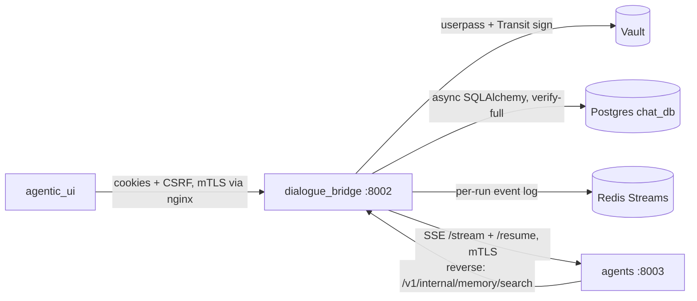

# Dialogue Bridge — Complete Reference (Replication Guide, Inference-Focused)

This is an exhaustive, replicate-from-scratch reference for the **`dialogue_bridge`** service (`src/dialogue_bridge/`) — the backend-for-frontend (BFF) of mAgenticX and the only service the browser talks to. It reflects the **current shipped code**. The bridge's headline responsibility, and the deepest section here (§10–§12), is **how it handles inference**: detached server-owned runs, a per-run Redis-Streams event log, and WebSocket observers with cursor replay.

**Stack:** Python 3.12 · FastAPI · uvicorn (port **8002**) · SQLAlchemy async + asyncpg · Pydantic v2 · Redis (event log + skills cache) · Alembic · pgvector · runs as non-root `1000:1000`.

> **README drift:** the checked-in `README.md` predates two refactors. Ignore it where it (a) references old `core/` paths (`core/database.py`, `core/auth_session.py`, `core/proxy.py`, `core/rate_limit.py`) — the real layout is `core/database/{engine,models}.py`, `core/auth/{session,tokens,providers,vault}.py`, `core/security/{internal_trust,rate_limit,user_rate_limit,tls}.py`; (b) describes a `sessions` table and `SESSION_MAX_PER_USER` — that table was **dropped** (migration `0008`), auth is now stateless Vault-Transit-signed JWTs; (c) implies SSE is the primary observer transport — it's **WebSocket** now (SSE is legacy/deprecated).

---

## Table of contents
1. [What the bridge is & owns](#1-what-the-bridge-is--owns)
2. [Directory structure (actual)](#2-directory-structure-actual)
3. [Bootstrap & lifecycle (`main.py`)](#3-bootstrap--lifecycle-mainpy)
4. [Configuration (`core/settings.py`)](#4-configuration-coresettingspy)
5. [Database schema (every table)](#5-database-schema-every-table)
6. [Migration chain](#6-migration-chain)
7. [Auth & session (stateless JWT)](#7-auth--session-stateless-jwt)
8. [Security (CSRF, rate limits, internal trust, TLS)](#8-security-csrf-rate-limits-internal-trust-tls)
9. [HTTP API — all routers](#9-http-api--all-routers)
10. [**Inference — architecture & lifecycle**](#10-inference--architecture--lifecycle)
11. [**Inference — event transport (Redis Streams + WebSocket)**](#11-inference--event-transport-redis-streams--websocket)
12. [**Inference — cancel, HITL resume, persistence, reaping**](#12-inference--cancel-hitl-resume-persistence-reaping)
13. [Conversation & message tree](#13-conversation--message-tree)
14. [Attachments & blobs](#14-attachments--blobs)
15. [Conversation embeddings & memory search (pgvector)](#15-conversation-embeddings--memory-search-pgvector)
16. [Sharing & export](#16-sharing--export)
17. [Scheduled tasks](#17-scheduled-tasks)
18. [Skills, memories, catalog (agents-service proxies)](#18-skills-memories-catalog-agents-service-proxies)
19. [Observability](#19-observability)
20. [Deployment](#20-deployment)
21. [Replication checklist & sharp edges](#21-replication-checklist--sharp-edges)

---

## 1. What the bridge is & owns

The BFF. The browser talks **only** to the bridge (via nginx). It owns:
1. **Auth & session** — Vault userpass login, stateless Vault-Transit-signed JWT cookies, CSRF.
2. **Persistence** — conversations, the append-only message tree, attachments/blobs (in Postgres), preferences, shares, scheduled tasks, message embeddings.
3. **Inference run lifecycle** — detached server-owned asyncio tasks that call the agents service, fan events through per-run Redis Streams, and persist the terminal result. **This is the core.**
4. **Capability proxying** — agent catalog cache, tool catalog, skills, memories, dictation/TTS/realtime voice, title/suggestion generation.
5. **Browser-facing safety** — CSRF, CORS, rate limiting, proxy-aware client IP.

It does **not** run agent logic, retrieval, or SQL — those are the agents/rag services.



---

## 2. Directory structure (actual)

```text
src/dialogue_bridge/
├── main.py                     App factory, lifespan (alembic → orphan-reap → scheduler → embed sweeper), router wiring, /health
├── alembic.ini                 sqlalchemy.url blank (env.py sources it from settings at runtime)
├── core/
│   ├── settings.py             Pydantic-settings; every group + boot validators + *_FILE secret resolution
│   ├── error_handling.py       Shared exception handler + upstream-retry helper
│   ├── cache/
│   │   ├── client.py           Shared async Redis client factory (rediss:// TLS conditional)
│   │   ├── integration.py      fastapi-redis-sdk install (pool lifespan, global budget, caching); env prime→warm→scrub
│   │   └── policies.py         Cache key families, TTL/eviction-group registry, shared imperative CacheBackend
│   ├── auth/
│   │   ├── session.py          login/refresh/logout, cookies, CSRF, auth dependencies, Redis sid denylist, refresh_guard
│   │   ├── tokens.py           mint/verify stateless JWTs (RS256 via Vault Transit)
│   │   ├── providers.py        AuthProvider ABC + AuthIdentity + Vault userpass IdP
│   │   └── vault.py            Vault client (AppRole login, Transit sign/verify, userpass)
│   ├── security/
│   │   ├── internal_trust.py   require_internal_caller, internal_service_headers, client-IP resolution
│   │   ├── rate_limit.py       fastapi-redis-sdk policies: verified-identity budget + auth/inference/speech deps
│   │   └── tls.py              httpx verify=/cert= mTLS helpers
│   └── database/
│       ├── engine.py           async engine, SessionLocal, get_db, Postgres verify-full SSL, Base, gen_uuid
│       └── models.py           EVERY ORM table
├── router/                     auth, inference, speech, voice, catalog, preferences, usage, conversations, messages,
│                               attachments, shared_conv, search, skills, memories, scheduled_tasks, internal_memory
├── schemas/__init__.py         ALL Pydantic request/response models (flat)
├── utils/                      business logic + DB queries (one file per domain)
│   ├── inference_runs.py       ★ InferenceRunManager, InferenceRunRuntime, run state machine, SSE parse, persistence
│   ├── inference_start.py      the 5 start modes → placeholder creation
│   ├── inference.py            history assembly, path resolution, nearest_committed_ai, multimodal serialization
│   ├── event_log.py            ★ RedisEventLog (XADD/XREAD/EXPIRE) per-run stream
│   ├── conversations.py · messages.py · attachments.py · embeddings.py · shared_conv.py · share_export.py
│   ├── scheduled_tasks.py (Scheduler loop) · agents.py (agent cache) · titles.py · suggestions.py
│   ├── speech.py · voice.py · search.py · skills.py · skills_cache.py · memories.py · usage.py · validators.py
├── observability/              config, context, events, filters, formatters, middleware, redaction, stream_metrics, exception_handlers
├── migrations/versions/        0001_baseline … 0015_personalization
├── requirements.txt · Dockerfile
```

---

## 3. Bootstrap & lifecycle (`main.py`)

Import-time `sys.path.append(PACKAGE_ROOT)` (`main.py:1-7`) → absolute imports. `configure_logging()` at import (`:47`); importing `core.settings` constructs `Settings()`, so **any settings-validation failure aborts import**.

**Migrations run in a subprocess** — `_run_alembic_upgrade()` (`main.py:51-76`) runs `alembic -c <root>/alembic.ini upgrade head` via `subprocess` (not in-process: alembic's `env.py` spins its own `asyncio.run` in a worker thread and would deadlock nested event loops). Non-zero exit → `RuntimeError` → **startup crashes**.

**Lifespan** (`main.py:79-116`), in order:
1. If `RUN_MIGRATIONS_ON_STARTUP` (default `True`) → `await asyncio.to_thread(_run_alembic_upgrade)` (keeps the loop responsive). `false` → warn and skip (emergency knob).
2. `await cleanup_orphaned_inference_runs()` — flip every `messages` row in an active streaming state to `failed` and clear every `active_assistant_message_id` (a process restart killed those asyncio tasks; runs *before* the scheduler so a restart-interrupted scheduled fire reads as failed).
3. `scheduler.start()` — in-process scheduled-tasks loop (no-op if `SCHEDULER_ENABLED=false`).
4. Launch `run_embedding_sweeper(stop_event)` as a background task (no-op if `EMBEDDINGS_ENABLED=false`).
5. `yield`. Shutdown: set the sweeper stop event → `scheduler.stop()` → `await asyncio.wait_for(embedding_task, 10)` (cancel on timeout).

**App** — `FastAPI(title="Bridge Service", lifespan=lifespan)`, `register_exception_handlers(app)` (handles `HTTPException`, `RequestValidationError`, catch-all `Exception`; 429s are produced by fastapi-redis-sdk's own `RateLimitExceeded` handler, registered by `install_redis_sdk`).

**Middleware** (request-path order is reverse of add order): `RequestLoggingMiddleware → RateLimitMiddleware (SDK global budget) → CacheResponseCaptureMiddleware (SDK) → CORSMiddleware → routes`. `install_redis_sdk(app)` (`core/cache/integration.py`) adds the SDK middlewares + wraps the lifespan with the Redis pool context. Then `add_pagination(app)`. `GET /health` → `{"status":"ok"}`, `include_in_schema=False`, exempt from logging + the budget.

**16 routers, all `/v1/*`**: `auth`, `inference`, `speech`, `voice`, `catalog`, `preferences`, `usage`, `conversations`, `messages`, `attachments`, `shared-conversations`, `search`, `skills`, `memories`, `scheduled-tasks`, and `internal` (service-to-service, `require_internal_caller` + nginx-denied).

**Scheduler loop** (`utils/scheduled_tasks.py`): every `poll_interval_seconds` (30) → `_tick()`: reap timed-out headless fires → `claim_due_tasks` under `SELECT … FOR UPDATE SKIP LOCKED` (advances `next_run_at` and commits *before* firing → deploy-overlap double-fire safety) → `fire_scheduled_task` (reuses `start_inference_flow` + `inference_run_manager.launch`).

**Embedding sweeper** (`utils/embeddings.py`): claims batches of finalized, non-error, non-empty, **non-private** messages with no embedding, embeds via the agents `/embed` proxy, upserts `ON CONFLICT (message_id) DO NOTHING`; sleeps 0.75s after a productive pass / 8s idle; wakes early on stop.

---

## 4. Configuration (`core/settings.py`)

`SettingsConfigDict(env_file=".env", extra="ignore", case_sensitive=False)`; root `Settings()` singleton. `_resolve_file_backed_secret(*names)` reads `<NAME>_FILE` (raises on unreadable path) else `<NAME>`. `DATABASE_PASSWORD_FILE` is spliced into a password-less `DATABASE_URL` (inline password wins → local dev untouched).

Groups (env alias → default):
- **App** — `APP_ENV`/`ENV`→`development` (gates the boot validators), `APP_VERSION`/`IMAGE_TAG`, `LOG_SERVICE_NAME`→`dialogue_bridge`.
- **Database** — `DATABASE_URL` (**required**, SecretStr), echo/pool knobs, `RUN_MIGRATIONS_ON_STARTUP`→True.
- **Session** — `SESSION_COOKIE_SECURE`→True, `SESSION_COOKIE_SAMESITE`→lax, `SESSION_COOKIE_DOMAIN`→None, cookie names (auto `__Host-mx_session`/`_refresh`/`_csrf` when secure+no-domain), `SESSION_CSRF_HEADER_NAME`→`X-CSRF-Token`, `SESSION_TOKEN_SECRET` (general-purpose HMAC — DOCX-preview tokens + redaction fallback).
- **Vault** — `VAULT_URL`, `VAULT_USERPASS_MOUNT`→userpass, `VAULT_APPROLE_MOUNT`→approle, `VAULT_ROLE_ID`/`VAULT_SECRET_ID` (file-backed), `VAULT_TRANSIT_MOUNT`→transit, `VAULT_TRANSIT_JWT_KEY`→`jwt-rs256`, `VAULT_HTTP_TIMEOUT`→10.
- **JWT** — `JWT_ISSUER`→`magenticx-bridge`, `JWT_AUDIENCE`→`magenticx`, `JWT_ACCESS_TTL_SECONDS`→28800 (8h, bound 60–86400), `JWT_REFRESH_IDLE_TTL_SECONDS`→604800 (7d), `JWT_REFRESH_ABSOLUTE_TTL_SECONDS`→2592000 (30d), `JWT_REFRESH_REUSE_GRACE_SECONDS`→30, `JWT_LEEWAY_SECONDS`→30, `JWT_SIGN_VERSION_CACHE_SECONDS`→60. Out-of-range → startup fail.
- **TLS** — `INTERNAL_CA_CERT_PATH` (str; drives Postgres verify-full + Redis TLS), `INTERNAL_CLIENT_CERT_PATH`/`_KEY_PATH` (SecretStr).
- **Upstream** — `AGENTS_SERVICE_URL`→`https://agents:8003`.
- **Inference** — `INFERENCE_TOOL_RESULT_MAX_CHARS`→16000, `INFERENCE_WS_SUBSCRIBE_TIMEOUT_SECONDS`→10.0.
- **Speech / Attachments / Share / Generation / Embeddings** — dictation 25MiB; attachments 25MiB each + 10/msg + DOCX-preview-token TTL 60s; share default 30d / max 365d; embeddings `EMBEDDINGS_ENABLED`→True, `dimensions`→1536 (must match agents + migration 0010), sweeper batch 64 / 0.75s active / 8s idle.
- **HTTP timeouts** — per-upstream `httpx.Timeout` (inference read/write 180s; generation 120s; voice 75s).
- **Voice** — `realtime_model`→`gpt-realtime`, `default_realtime_voice`→alloy, 11-voice frozenset.
- **Proxy** — `TRUSTED_PROXY_HEADER_NAME`→`X-Internal-Proxy-Secret`, `TRUSTED_PROXY_SECRET` (file-backed).
- **Redis** — `REDIS_URL`→`redis://redis:6379/0`, `REDIS_PASSWORD[_FILE]`, `REDIS_STREAM_MAXLEN`→20000, `REDIS_STREAM_TERMINAL_TTL_SECONDS`→3600, `REDIS_STREAM_READ_BLOCK_MS`→30000, skills-cache TTLs 86400/7200/7200.
- **Rate limit** — auth 4/60, inference 10/60, **per-user 300/60** (app-wide), `INFERENCE_MAX_ACTIVE_RUNS_PER_USER`→5.
- **Scheduler** — `SCHEDULER_ENABLED`→True, poll 30s, claim batch 10, `run_timeout_seconds`→600 (headless HITL watchdog), max 50 tasks/user, `min_interval_seconds`→300.
- **Logging** — `LOG_LEVEL`→INFO, `LOG_FORMAT`→console, `LOG_TIMEZONE`/`TZ`→Europe/Athens, `LOG_REDACTION_SECRET`.
- **CORS** — `CORS_ALLOWED_ORIGINS`→localhost:8080/8050 + 127.0.0.1:8080/8050, credentials True (**wildcard + credentials = startup error**), methods `GET,POST,PUT,PATCH,DELETE`, computed default headers, exposed download/range headers, max-age 600.

**Boot validators (`_finalize_secrets`, refuse to start):** (1) empty `TRUSTED_PROXY_SECRET` → raise (all envs); (2) outside dev/test, missing any of `VAULT_URL`/`VAULT_ROLE_ID`/`VAULT_SECRET_ID` → raise; (3) outside dev/test, empty `SESSION_TOKEN_SECRET` → raise (dev generates a random one); (4) redaction-secret fallback to token_secret (never fails). Plus: missing `DATABASE_URL`, out-of-range JWT durations, credentialed CORS wildcard, a failed `alembic upgrade head`, or an unreadable `*_FILE` path all abort startup.

---

## 5. Database schema (every table)

Async engine (`core/database/engine.py`): `create_async_engine(url, connect_args={"ssl": ctx})` where `ctx` is a `verify-full` context (`check_hostname=True`, `CERT_REQUIRED`, CA from `INTERNAL_CA_CERT_PATH`) or `None` (dev). SQLite (tests) uses `NullPool` (no pool sizing). `SessionLocal = async_sessionmaker(expire_on_commit=False)`; `get_db()` yields a session. `Base = declarative_base()`; `gen_uuid()` = `str(uuid4())` is every PK default. `EMBEDDING_DIMENSIONS = 1536`.

| Table | Key columns / notes |
|---|---|
| **agents** | `id`, `slug`(unique), name/description/icon, `version`, `type`(server_default `"langgraph agent"`), `is_active`, timestamps. Cached manifests from the agents service. |
| **users** | `id`, `username`(unique,idx), `vault_user_id`(unique,idx), `email`(unique,idx), display_name/avatar/full_name/department/role_title, `last_login_at`, `is_active`. `upsert_user_from_vault` maps a Vault entity → row. |
| **user_preferences** | 1:1 with users (unique `user_id`). `tools`(JSON), `prefers_agentic_chat`, `suggestions_enabled`, `show_message_token_usage`(0006), `search_past_convs`(0011, gates cross-conv memory tool), `use_memory`(0012, gates persistent memory), `personality`+`custom_instructions`(0015, threaded to runs as `context.personalization`), `voice_mode_voice`/`_language`. |
| **conversations** | `user_id`, `agent_id`(last-used pointer), `forked_parent_id`/`forked_message_id`(self-ref fork lineage, SET NULL), `agent_name`, `title`, `is_private`, `is_archived`/`archived_at`, `is_reported`/`reported_at`, **`active_assistant_message_id`**(FK→messages SET NULL — the AI msg currently streaming; `post_update=True` to break the write cycle), `last_message_preview`/`last_message_at`. |
| **messages** ★ | The append-only tree AND the run. `conversation_id`(CASCADE), **`parent_message_id`**(self-FK SET NULL — the tree edge; edits/retries are *sibling* rows, never overwrites), `sender`(`message_sender_enum` user/ai), `content`, `liked`, `reasoning_steps`/`reasoning_time_seconds`, `input_tokens`/`output_tokens`(0004), `is_error`/`error_message`, **`checkpoint_thread_id`**(0007, per-branch LangGraph thread), **`checkpoint_id`**(0007, durable head from `CHECKPOINT_COMMITTED`), `raw_events`(JSON, ordered AG-UI events), `agent_id`(SET NULL)/`agent_name`, **`streaming_status`**(queued/running/cancelling/completed/cancelled/failed), `streaming_message_path`/`streaming_enabled_tools`(JSON), `streaming_started_at`/`_completed_at`/`_cancel_requested_at`, `scheduled_task_id`(0009, SET NULL). **Two partial indexes**: unique `WHERE streaming_status IN ('queued','running','cancelling')` (≤1 active stream per conversation) + `WHERE streaming_status IS NOT NULL`. |
| **conversation_reports** | unique `conversation_id`; reason/details/status, optional `message_id`. |
| **conversation_shares** | `token`(unique), `conversation_id`, `owner_user_id`, `snapshot_until_message_id`, `snapshot_json`(frozen payload), `is_active`, `revoked_at`, `expires_at`(idx). |
| **attachments** / **blobs** | attachment metadata (file_name/mime_type/size_bytes) → `blob_id`(1:1). **blobs.data is `LargeBinary` — bytes live in Postgres, no filesystem/object store.** |
| **scheduled_tasks** | `user_id`, `agent_id`(SET NULL)/agent_name/agent_slug, `conversation_id`(bound mode), `prompt`, `enabled_tools`, `target_mode`(fresh/bound), `schedule_kind`(one_off/interval/cron), `schedule_spec`(JSON), `timezone`, `status`, `next_run_at`, `last_run_*`, `run_count`/`max_runs`, `expires_at`. Partial index `WHERE status='active'`. `last_run_message_id` is a plain String (NOT an FK — avoids a cycle). |
| **message_embeddings** | `message_id` PK+FK(CASCADE) 1:1, `embedding Vector(1536)` (pgvector), `model`, `created_at`. **HNSW cosine index** (`vector_cosine_ops`) in migration 0010. Separate table so the hot `messages` table stays lean. |

The `conversations ↔ messages` cross-FK cycle is resolved via `use_alter` in the baseline.

---

## 6. Migration chain

`alembic.ini` leaves `sqlalchemy.url` blank; `env.py` sources it from `settings` and rewrites `postgresql+asyncpg://` → `postgresql+psycopg2://`, translating the asyncpg `ssl=` to libpq `sslmode=verify-full`+`sslrootcert`. `compare_type`/`compare_server_default` on; revision ids ≤32 chars.

| Rev | Summary |
|---|---|
| `0001_baseline` | Full snapshot (incl. the now-dropped `sessions` table). Cross-FKs resolved post-hoc (`use_alter`); enums created implicitly by `create_table`; the two `messages` partial indexes. `alembic stamp`-able on the pre-existing prod DB. |
| `0002` | `agents.type` (server_default `langgraph agent`). |
| `0003` | `messages.agent_id`+`agent_name` (+ backfill AI messages from their conversation's agent). |
| `0004` | `messages.input_tokens`/`output_tokens`. |
| `0005` | **destructive** — drop `messages.plan`/`subagents`/`type` + orphaned `message_type_enum`. |
| `0006` | `user_preferences.show_message_token_usage`. |
| `0007` | `messages.checkpoint_thread_id`(+idx)+`checkpoint_id` (checkpoint lineage). |
| `0008` | **drop `sessions` table** (+4 indexes) — stateless JWT auth. |
| `0009` | `scheduled_tasks` (+partial `WHERE status='active'`) + `messages.scheduled_task_id`. |
| `0010` | `CREATE EXTENSION vector` + `message_embeddings` + hand-written **HNSW** cosine index (needs `pgvector/pgvector:pg16`). |
| `0011` | `user_preferences.search_past_convs`. |
| `0012` | `user_preferences.use_memory`. |
| `0013` | `attachments.origin` (user-uploaded vs agent-generated). |
| `0014` | link auth identities — `users.vault_user_id` nullable + `oidc_subject` + `auth_providers` (Entra OIDC SSO). |
| `0015` | `user_preferences.personality` + `custom_instructions` (personalization). **Current head.** |

Partial/`postgresql_where` and pgvector-opclass indexes are always hand-written (autogenerate blind spots). **No inference-run table exists** — the run is the `messages.streaming_*` columns, present since the baseline.

---

## 7. Auth & session (stateless JWT)

**Model:** after Vault verifies the credential, the bridge issues two **RS256 JWTs signed by Vault's Transit engine** (the private key never leaves Vault). There is **no session table** — sessions are stateless. Per-request verification is signature-only against a cached Transit public key (no DB/Vault call on the hot path). The only shared state is a **fail-open Redis logout denylist keyed by `sid`**.

**Login** (`POST /v1/auth/login`, `router/auth.py`): rate-limited per-IP (`AUTHENTICATE_LIMIT` 4/60). → `get_provider("vault").authenticate(username,password)` (userpass IdP in `core/auth/providers.py` → `core/auth/vault.py`); `VaultAuthError` 400/401/403 → 401 generic, other → 502, unconfigured → 500 → `upsert_user_from_vault` → 403 if inactive → `mint_login_session(user)` (`core/auth/session.py` → `core/auth/tokens.py`) mints the access (8h) + refresh (7d idle / 30d absolute) pair via Transit, both carrying a shared login-session `sid` → `refresh_guard.register(...)` → `issue_session_cookies` sets access + refresh + CSRF cookies. Returns `AuthResponse{authenticated, user_id, user, tokenTtl}`.

**Per-request auth dependencies** (`core/auth/session.py`):
- `require_session` → verifies the access JWT (from `Authorization: Bearer` OR the `__Host-`/access cookie), checks the Redis denylist (fail-open), requires `act=true`; 401 on failure.
- `require_current_user` → lightweight `AuthUser(id, is_active)` (no DB load).
- `require_bound_user_id` → 403 if path `{user_id}` ≠ JWT `sub`.
- `validate_userId` (`utils/validators.py`) → the standard per-user gate.
- `validate_convId`/`_full` → load `ConversationTable` scoped by `(id, user_id)`, 404 if not owned.
- `require_csrf_protection` → for non-GET/HEAD/OPTIONS, constant-time compare `X-CSRF-Token` header vs CSRF cookie (double-submit); pure-bearer clients (no access cookie) are exempt.
- `authenticate_websocket_user` (for the inference WS) → verifies the access-cookie JWT, denylist, `act`, and `sub == user_id`; **returns `None` instead of raising** (caller sends a WS close code).

**Refresh** (`POST /v1/auth/session/refresh`, CSRF-gated): `require_refresh_session` verifies the refresh cookie; `refresh_guard.status(sid,jti)=="reuse"` → revoke the whole session + 401 (replay defense); else `rotate_session` mints a new pair reusing the original `sid`, `refresh_guard.rotate` advances the `jti` and graces the old one for `JWT_REFRESH_REUSE_GRACE_SECONDS`; re-issue cookies. Stateless — no DB write.

**Logout** (`POST /v1/auth/logout`, CSRF-gated): reads access-then-refresh token, denylists its `sid` in Redis for the full refresh TTL (so a token stolen before logout is rejected on the next request), clears cookies. No per-user session cap (stateless tokens carry no server-side roster).

**Cookies:** access + refresh (HTTP-only) + CSRF (readable). `__Host-` prefix when `SESSION_COOKIE_SECURE=true` and no domain (drops the domain attribute).

---

## 8. Security (CSRF, rate limits, internal trust, TLS)

- **CSRF** — double-submit cookie on every state-mutating endpoint (`require_csrf_protection`).
- **Rate limiting, one engine (fastapi-redis-sdk), two layers** — policies in `core/security/rate_limit.py`, installed by `core/cache/integration.py`. (1) Global budget middleware: ~300/min per verified-JWT-user (`verified_identity`; IP fallback), Redis-counted (atomic Lua window; survives deploys, holds across replicas), header-silent, exempts `/health` + `/v1/internal/*`. (2) Strict `rate_limit` dependencies (emit `X-RateLimit-*` + `Retry-After` on 429) — policy: *paid APIs, outward artifacts, and unbounded-storage writes get their own per-user window*: auth `/login` + `/oidc/login` 4/60 per resolved IP, `/session/refresh` 10/60 per IP (Vault Transit mint), inference `/start` 10/60 per user, speech router 20/60 per user, voice `/realtime/{uid}/session` 15/60 (paid Realtime), share create 10/60 (public tokens), PDF export 10/60 (heavy render), custom-skill upload 10/60 (disk writes), message POST 30/60 (blob growth), suggestions 10/60 (LLM-backed). The run-stream **WebSocket** is outside the HTTP middleware — `allow_ws_connect` meters handshakes in-route (20/60 per verified user, close code `4429`). Everything **fails open** on a Redis outage (logged + counted as degraded), same stance as the logout denylist.
- **Internal trust** (`core/security/internal_trust.py`) — `require_internal_caller` validates `X-Internal-Proxy-Secret` via `secrets.compare_digest` (403 else); `internal_service_headers(request_id[,session_id,user_id])` builds outbound headers for the agents hop (always the proxy secret; auto-derives raw `X-User-Id`/`X-Session-Id` from the request context so ids correlate with the DB); `resolve_client_ip` only trusts forwarded headers from a trusted proxy.
- **mTLS** (`core/security/tls.py`) — `get_httpx_verify()`/`get_httpx_client_cert()` for the bridge→agents hop; same single-SSLContext approach as the agents service.
- **Three unauthenticated endpoints**: `GET /health`, `GET /v1/shared-conversations/{token}` (public share), `GET /v1/attachments/public/{token}` (HMAC-token-gated Office blob for the Online Viewer, served with `CSP: default-src 'none'; sandbox;` + `nosniff` + `no-store`).
- **`/v1/internal/*`** — defense-in-depth: internal secret **and** nginx `location ^~ /api/v1/internal/ { return 404; }` at the edge.

---

## 9. HTTP API — all routers

nginx strips `/api/`, so the browser calls `/api/v1/...` and FastAPI sees `/v1/...`. Legend: **user** = `validate_userId` (auth + path-user binding); **conv** = `validate_convId(_full)`; **CSRF** = state-mutating (needs `X-CSRF-Token`).

**Auth** `/v1/auth`: `POST /login` (public, rate-limited), `GET /session` (session), `POST /session/refresh` (refresh+CSRF), `POST /logout` (CSRF).

**Inference** `/v1/inference` — see §10–§12: `POST /runs/{user_id}/start`, `GET /runs/{user_id}` (`?status=active`), `WS /runs/{user_id}/{run_id}/ws`, `POST …/cancel`, `POST …/resume`.

**Conversations** `/v1/conversations`: `POST /{uid}` (create), `POST /{uid}/{cid}/fork`, `POST …/share`, `POST …/share/export-pdf`, `DELETE …/share/{share_id}`, `GET /{uid}` + `/archived` + `/shares`, `GET /{uid}/{cid}` (detail), `DELETE /{uid}/{cid}`, `PATCH …/title` · `…/archive` · `…/unarchive`, `POST …/report`.

**Messages** `/v1/messages`: `POST /{uid}/{cid}` (append), `PATCH …/{mid}` (finalize AI placeholder), `POST …/{mid}/like` · `…/dislike`.

**Attachments** `/v1/attachments`: `GET /download/…/{blob_id}` (byte-range 206), `GET /preview/…` (inline), `GET /preview-token/…` (`DocxPreviewTokenOut`), `GET /public/{token}` (**public**, token-gated Office blob), `GET /images/{uid}` (paginated base64).

**Catalog** `/v1/catalog`: `GET /agents` (cache→sync), `GET /tools` (proxy agents `/tools`), `GET /{uid}/suggestions`.

**Preferences** `/v1/preferences`: `GET /{uid}`, `PUT /{uid}` (CSRF).

**Usage** `/v1/usage`: `GET /{uid}/summary` (read-only rollup for Settings → Usage — all-time totals + today/7d/30d windows via one FILTER-clause aggregate, capped per-agent ranking by denormalized `agent_name`, sparse 30-day daily series; `utils/usage.py`).

**Speech** `/v1/speech`: `POST /dictation/{uid}` (multipart), `POST /read-aloud/{uid}/{cid}/{mid}`, `POST /read-aloud-preview/{uid}`.

**Voice** `/v1/voice`: `POST /realtime/{uid}/session`, `…/conversation-event`, `…/end` (all CSRF).

**Shared** `/v1/shared-conversations/{token}` (**public**). **Search** `/v1/search/{uid}` (`?q&limit`). **Skills** `/v1/skills` (+ user pool + per-(user,agent) enablement — proxies to agents, Redis-cached). **Memories** `/v1/memories/users/{uid}/agents/{aid}[/{name}]` (read + delete; agent owns writes). **Scheduled tasks** `/v1/scheduled-tasks/{uid}` (list/create/patch/delete). **Internal** `POST /v1/internal/memory/search` (`require_internal_caller`, pgvector search backing the agent's `search_past_conversations` tool).

Schemas are all in `schemas/__init__.py` — camelCase response aliases + snake_case `validation_alias` for ORM ingestion, UTC ISO-8601 `Z` timestamps. Key models: `AuthRequest`/`AuthResponse`/`UserProfile`, `ConversationSummary`/`ConversationDetail`/`MessageOut`/`AttachmentOut`, `MessageIn`/`AttachmentIn` (base64 `validate=True` + size caps), `ConversationIn`/`ConversationShareIn`/`ConversationPdfExportIn`, `UserPreferences`/`ToolsPreferences`/`ToolPreference`, `ScheduledTaskCreate`/`Update`/`Out`, `MemorySearchRequest`/`MemoryMessageMatch`, and the inference DTOs below.

---

## 10. Inference — architecture & lifecycle

**The run *is* the assistant `messages` row.** There is no `inference_runs` table. A message becomes a run when its `streaming_status` is non-NULL; its `id` is simultaneously the `run_id`, the `assistantMessageId`, and the AG-UI `message_id` root, **and** the Redis stream key. The run executes as a **detached asyncio task** owned by a process-global `InferenceRunManager`. The HTTP `start` returns immediately; the browser watches over a WebSocket.

**Two thread ids:** `checkpoint_thread_id` is **branch-scoped** (the LangGraph durable-saver thread, shared across a branch's runs); `run_id` is **per-run** (AG-UI bindings + Redis key). Keep them distinct.

### The 5 start modes — `POST /v1/inference/runs/{user_id}/start` → `start_inference_flow` (`utils/inference_start.py`)
Body `InferenceStartPayload{mode, agentId?, isPrivate, title?, sharedConversationToken?, conversationId?, parentMessageId?, targetMessageId?, messagePath?, enabledTools?, message?}`. Deps: `validate_userId` + `require_csrf_protection` + rate limit. Dispatch by `mode`:
- **`new`** — needs `agentId`+`message`; resolves a title (via agents), `init_conv` creates the conversation + first user message; parent = that message.
- **`send`** — needs `conversationId`/`parentMessageId`/`agentId`/`message`; validates parent + `messagePath` lineage; `init_message` appends a user message under the parent.
- **`edit`** — needs `targetMessageId` (a **user** msg); reuses the agent that originally answered; creates a **sibling** user message under `target.parent_message_id` (append-only).
- **`retry`** — needs `targetMessageId` (an **AI** msg); parent = `target.parent_message_id`; reuses `target.agent_id`. **Only mode that passes the client `messagePath` through** (others force `None`).
- **`shared_continue`** — needs `sharedConversationToken`; clones the shared conversation into the user's account; parent = the copied leaf.

Then `create_inference_run_record` (`utils/inference_runs.py`): reaps stale queued runs (>2 min, no live task); enforces **per-user active cap** (`INFERENCE_MAX_ACTIVE_RUNS_PER_USER`=5 → 429) and **per-conversation** single-active guard (→ 409 via the partial unique index); allocates the branch thread (`send` on a committed branch reuses the ancestor's `checkpoint_thread_id`; new/edit/retry/shared_continue → fresh UUID); inserts the AI placeholder `messages` row (`sender="ai"`, `content=""`, `streaming_status="queued"`, `streaming_enabled_tools`, `streaming_started_at`, `checkpoint_thread_id`); sets `conversation.active_assistant_message_id`. Then `inference_run_manager.launch(run.id)` fires the detached task; the endpoint returns `InferenceStartResponse{detail, summary, run, message}` (201).

### The run task — `InferenceRunManager._run` (`utils/inference_runs.py`)
Process-global manager with per-run dicts (`_tasks`, `_cancel_events`, `_runtimes`, `_run_metas`, `_resume_events`, `_resume_payloads`); `launch` is idempotent and registers a done-callback that pops all per-run state.

1. **Mark running**; load conversation (eager messages+attachments+blobs).
2. Build `run_meta` once (static wire fields → no per-chunk DB hit).
3. Resolve the **per-message agent** (`run.agent_id or conversation.agent_id` — a conversation may mix agents); `thread_id = run.checkpoint_thread_id or run.id`.
4. **Payload-mode decision** (re-derived from the tree via `nearest_committed_ai` — nearest AI ancestor carrying *both* `checkpoint_thread_id` and `checkpoint_id`):
   - **`delta_resume`** — committed ancestor on the *same* thread → send only the new user message.
   - **`delta_fork`** — committed ancestor on a *different* thread (edit/retry) → send new message + `fork_from={thread_id, checkpoint_id}`.
   - **`full_seed`** — no committed checkpoint → send the full reconstructed branch history (`prepare_inference_history`, strips a trailing empty AI placeholder), cold-seed a thread.
5. Serialize history (`serialise_message_with_images_for_agent`): images inlined as base64 `data:` URLs; non-image attachments as text bullets (deep agents get `/conversation/input/<name>` references). Seed deep-agent input files (PUT to the agent's input dir).
6. Build the **config block** sent to both `/stream` and `/resume`:
   ```json
   {"run_config": {"configurable": {"thread_id": "<branch thread>"}},
    "context": {"user_id","conversation_id","run_id","search_past_convs","use_memory","personalization?"},
    "tools": [...],
    "fork_from": {"thread_id","checkpoint_id"}   // /stream only, delta_fork}
   ```
7. **Leg loop:** race `_do_stream` against the cancel event. On completion with no pending interrupts → `_finish_run` completed. On pending interrupts → pause and race resume vs cancel (§12).

`_do_stream` (`utils/inference_runs.py`) opens `httpx.AsyncClient(verify=get_httpx_verify(), cert=get_httpx_client_cert(), timeout=inference_timeout)`, POSTs to `{AGENTS_SERVICE_URL}/agents/{slug}/stream` with `internal_service_headers(...)` + `Accept: text/event-stream`, and iterates `response.aiter_bytes()`. `_parse_sse_bytes` accumulates and splits on `\n\n`, keeps `data:` JSON dicts with a `type`. Each event → `runtime.apply_event(event)`; a `RUN_ERROR` marks failed + terminal snapshot + returns `"failed"`; otherwise the seq-stamped applied event is batched and `_publish_delta`'d.

### `InferenceRunRuntime.apply_event` — the accumulator
Assigns a monotonic `seq`, then:
- **`TOOL_CALL_RESULT`** — content truncated to `INFERENCE_TOOL_RESULT_MAX_CHARS` (16000, flags `truncated:true`), also unwrapped inside `SUBAGENT_EVENT`.
- **`CUSTOM`** — `SUBAGENT_EVENT` unwraps its inner event; nested `HITL_INTERRUPT` → `register_interrupt`, nested `TOKEN_USAGE` → `_accumulate_usage`; top-level `HITL_INTERRUPT`/`TOKEN_USAGE` likewise; **`CHECKPOINT_COMMITTED`** captures `produced_checkpoint_id` and **returns `None`** — deliberately not streamed and not persisted to `raw_events` (it carries internal thread/checkpoint UUIDs that must not leak into share snapshots/clones).
- **THINKING_*** — tracks thinking duration + collects thought previews.
- **TEXT_MESSAGE_CHUNK/CONTENT** — concatenated into `content`; first content chunk closes the thinking timer.
- Every non-suppressed event → `_append_raw` (with **coalescing**: consecutive text deltas by `(messageId, namespace)` and `TOOL_CALL_ARGS` by `toolCallId` merge into one entry — even one level down inside `SUBAGENT_EVENT` by `task_id`; **`THINKING_TEXT_MESSAGE_CONTENT` is NOT coalesced** — discrete steps).
- **Interrupts tracked as an identity set** (`pending_interrupt_ids`, keyed by `interrupt.id`) — a sub-agent interrupt is delivered twice (top-level + wrapped), and each `/resume` resolves exactly one id, so a bare counter would drift and the run would hang forever.
- **Token usage** summed across all AI messages + resume legs, deduped by `message_id`.

---

## 11. Inference — event transport (Redis Streams + WebSocket)

The browser transport is a **WebSocket**, not SSE. SSE is only the upstream (bridge → agents) hop. The full path:

```
agents /stream (SSE) → bridge _do_stream: _parse_sse_bytes → runtime.apply_event (accumulate/coalesce/truncate)
   → _publish_delta → RedisEventLog.append (XADD)  [inference:run:{run_id}:events]
   ◀ WS subscriber: stream_run_events → RedisEventLog.read_since (XREAD BLOCK)
   → router sends {snapshot|event|terminal} JSON frames → browser
```
The detached task produces into Redis whether or not any browser is attached — that's what makes reconnect/resume/replay work.

**`core/cache/client.py`** — one `create_redis_client()` shared by every raw-Redis consumer (event log, sid denylist, OIDC state, the skills CacheBackend). `decode_responses=True`. TLS is conditional on `rediss://` (verify the server cert against `INTERNAL_CA_CERT_PATH`, `ssl_cert_reqs="required"`, hostname check on — Redis is password-over-verified-TLS, **not** mTLS). Password from `REDIS_PASSWORD[_FILE]` (empty → no AUTH, local dev).

**`core/cache/integration.py`** — fastapi-redis-sdk installation. The SDK's settings singleton is env-driven, so the installer *primes* the env from `core.settings` (credentialed `REDIS_URL` — the SDK's URL mode ignores its separate password field — plus `mx:sdk` key prefix, CA path for `rediss://`, header/fail-open flags), warms `get_settings()` once, then restores the password-less URL so nothing credentialed lingers in the process env or reaches subprocesses (alembic). **`core/cache/policies.py`** — cache key families + eviction groups + the shared imperative `CacheBackend` (used by `utils/skills_cache.py`; per-(user, agent) entries join group `skills:agents:{user_id}`, so pool-deletion cascade is one `delete_group`).

**`utils/event_log.py` — `RedisEventLog`:**
- Stream key `inference:run:{run_id}:events`.
- `append(run_id, event)` → `XADD key {"payload": json} MAXLEN ~ 20000` (approximate trim); returns the entry_id (the `seq` cursor).
- Two frame shapes: **`events` delta** `{"type":"events","run":{...,"pendingInterrupts":N},"events":[<seq-stamped>...]}` (O(chunk), never cumulative), and **terminal snapshot** `{"type":"terminal","run":<InferenceRunOut>,"message":<MessageOut>,"summary":<ConversationSummary>}`.
- `read_since(since, ...)` → `XREAD BLOCK 30000` from `since` (or `"0"` for full backlog); returns when a terminal-status frame is seen, `cancel_event` set, or `on_idle()` true (escape hatch for a terminal-in-DB run whose terminal frame never reached this consumer).
- `mark_terminal(run_id)` → `EXPIRE key 3600` (replay window after the run ends; after expiry the durable record is the `messages` row).

**WebSocket endpoint** `WS /v1/inference/runs/{user_id}/{run_id}/ws` (`router/inference.py`):
1. `authenticate_websocket_user` (access cookie); failure → close `4401`. Codes `4401`/`4403`/`4404`/`4400` mirror HTTP.
2. `get_active_run_for_user` (owner-scoped); missing → `4404`.
3. `accept()`, then wait ≤`INFERENCE_WS_SUBSCRIBE_TIMEOUT_SECONDS` (10s) for the first frame `{"type":"subscribe","since":"<seq>"|null}`.
4. `async for seq, event in stream_run_events(run_id, since)`: `SNAPSHOT_SEQ_SENTINEL` → `{"type":"snapshot","payload":...}`; else `{"type":"event","seq":seq,"payload":...}`.
5. After the stream ends, always send a **DB-authoritative** `{"type":"terminal","payload":<final state>}` (flips the run to its real status even if the terminal stream entry was lost), then close.

**`stream_run_events`** — three cases: terminal-in-DB → one DB `snapshot`, return; fresh subscribe (`since` None) on an in-process live run → capture `last_entry_id` first, yield a **synthesized live snapshot** (`build_live_snapshot` from the in-process runtime — full coalesced `raw_events`, so MAXLEN trimming never strands a late subscriber), then tail from the captured cursor (client dedupes by `seq`); reconnect (`since` given) or no in-process runtime → plain Redis replay from cursor with `_run_went_terminal` as the `on_idle` escape.

**nginx** (`agentic_ui/nginx.conf.template`) — a dedicated `location ^~ /api/v1/inference/runs/` block forwards `Upgrade`/`Connection` (WS handshake), injects the proxy secret + request id, disables buffering, and sets `proxy_read_timeout/send_timeout 3600s` so live tails aren't dropped. **Browser client** (`agentic_ui/src/lib/api.ts` `connectInferenceWebSocket`) persists `lastSeenInferenceSeq`, resends it as `since` on reconnect (backoff `[250,500,1000,2000,5000]`ms), treats close `4401/4403/4404` as permanent.

**Stream instrumentation** (`observability/stream_metrics.py`) — `StreamMetrics` tracks chunk_count, bytes_forwarded, first-byte latency, total duration, and (with a separator) event_count, for both the upstream inference SSE and blob downloads.

---

## 12. Inference — cancel, HITL resume, persistence, reaping

**Cancel** (`POST …/cancel` → `request_run_cancel`): 404 if not the user's active run; set `streaming_status="cancelling"` + `streaming_cancel_requested_at`; `inference_run_manager.request_cancel` sets the per-run cancel event (checked at each `_do_stream` await). If no live task (other replica / restart), flip straight to `cancelled` (preserving content). Publish a status-only frame. `_finish_run` normalizes a `completed` verdict to `cancelled` when a cancel was requested mid-flight.

**HITL resume** (`POST …/resume` → `request_run_resume`): body `InferenceRunResumeIn{decision: approve|reject, reason?, value?, interruptId?, decisions?}` (`decisions` = per-action list for a **batched** interrupt — approve some / reject others). `request_resume` returns True **only if a live `_run` task is waiting** on the resume event; else 409 ("not paused"). The `_run` loop: when `_do_stream` ends with `pending_interrupts > 0`, it holds the task alive and races the resume event vs cancel. On resume it removes the resolved `interrupt_id` from the set, emits a `BRIDGE_HITL_RESOLVED` `CUSTOM` marker (so a reloaded client doesn't re-show an answered approval), then starts `_do_resume` — a parallel leg POSTing to `{AGENTS_SERVICE_URL}/agents/{slug}/resume` (same config block + `thread_id` + decision/decisions). Same SSE parse/fold/publish loop into the same Redis stream. A **409 from the agents service** (no cached checkpoint — process restart between interrupt and resume) → failed terminal with a "start a new message" hint.

**Persistence — `_finish_run`** (idempotent; the single terminal write): onto the same `messages` row it writes `streaming_status` (completed/cancelled/failed) + `streaming_completed_at`, `content`, `reasoning_steps`, `reasoning_time_seconds`, **`raw_events`** (deep-copied coalesced log), `input_tokens`/`output_tokens`, `is_error`/`error_message`, and **`checkpoint_id = runtime.produced_checkpoint_id`** (only if the agent reported a head — advances the branch head so the next `send` resumes / edit-retry forks from it). It also clears `active_assistant_message_id` and updates the conversation preview/`last_message_at`. **Zero DB writes per stream chunk** — only at creation and finalization (plus small cancel/cleanup writes off the happy path).

**Orphan reaping** — `cleanup_orphaned_inference_runs()` (lifespan startup) bulk-flips every active-status message to `failed` and clears all `active_assistant_message_id`, because a process restart killed the in-memory tasks; a reconnecting client gets a `terminal(failed)` frame rather than a hung socket.

**Run state machine:**
```
create → queued → (launch) running
   running ──cancel──► cancelled
   running ──RUN_ERROR/exception/seed-fail──► failed
   running ──stream ends, no pending interrupts──► completed
   running ──stream ends, pending interrupts──► PAUSED ──resume──► (new _do_resume leg) → running
                                                        └─cancel──► cancelled
terminal → _finish_run writes content+raw_events+checkpoint_id; event_log.mark_terminal (TTL); WS sends terminal frame
```

---

## 13. Conversation & message tree

- **Append-only tree** — `messages.parent_message_id` (self-FK) is the only tree edge. Edits and retries create **sibling** rows under the same parent; content is **never** overwritten. Branch identity flows through `checkpoint_thread_id`; the durable head is `checkpoint_id`.
- **History materialization** — a run's branch is ordered by `streaming_message_path` (the message-id list the agent saw as context), or reconstructed via `prepare_inference_history` for a `full_seed`. A trailing empty AI placeholder is stripped so the agent never sees unfinished assistant output as context.
- **Create** — `POST /v1/conversations/{uid}` validates the agent, resolves a title (multiple candidates via the agents `/titles` endpoint, random pick; falls back to preview/agent-name/"New conversation"), `init_conv` creates the conversation + first message atomically.
- **Fork** — `POST …/fork` uses `build_message_lineage` + `clone_branch_to_conversation` to copy a branch into a new conversation (`forked_parent_id`/`forked_message_id` record lineage).
- **Reactions** — `like`/`dislike` toggle the nullable `liked` (True/False/None).
- **Report / archive / title** — flag columns on the conversation.

---

## 14. Attachments & blobs

- **Ingestion** — attachments arrive as base64 in `MessageIn.attachments`; `AttachmentIn` validates with `base64.b64decode(..., validate=True)`, enforces per-file/total/count caps (25MiB / 25MiB / 10). A `BlobTable` row stores the raw bytes; an `AttachmentTable` row stores metadata + the FK. **Blobs live in Postgres — no filesystem/object storage.**
- **Download** — `GET /download/...` streams non-image blobs with `Range`/`206 Partial Content` support (chunked, `stream_chunk_bytes`=512KiB); images are served only via the paginated base64 `images` endpoint. `preview` is the inline variant.
- **Office preview** — `preview-token` mints a short-lived HMAC token (signed with `SESSION_TOKEN_SECRET`, TTL 60s); `public/{token}` serves the raw Office blob **without a session** (for the Microsoft Office Online Viewer), under a locked-down CSP/`nosniff`/`no-store`.

---

## 15. Conversation embeddings & memory search (pgvector)

- **Store** — `message_embeddings` (1:1 with `messages`, `Vector(1536)` + `model`, HNSW cosine index). Separate table so `messages` stays lean and embeddings version independently.
- **Sweeper** (`utils/embeddings.py`, lifespan background task) — claims batches of finalized, non-error, non-empty, **non-private** messages with no embedding, embeds them via the agents **`/embed`** proxy (the bridge has no OpenAI key), and upserts `ON CONFLICT (message_id) DO NOTHING`. Active/idle sleep 0.75s/8s; disabled by `EMBEDDINGS_ENABLED=false`.
- **Search** — `search_user_messages(db, user_id, query, limit, exclude_conversation_id)` runs pgvector cosine search over the user's message embeddings. Exposed **only** at `POST /v1/internal/memory/search` (`require_internal_caller` + nginx-denied), which backs the agents service's `search_past_conversations` tool — gated per-run by the `search_past_convs` context flag (from the user preference).

---

## 16. Sharing & export

- **Share** — `POST …/share` selects a scoped message set (`full`/`branch`/`message` mode + optional `branchPath`), builds a frozen `snapshot_json`, resolves `expires_at` against `share.default_ttl_days`/`max_ttl_days` (422 if too far), inserts `ConversationShareTable` with `token = token_urlsafe(32)`. `GET /v1/shared-conversations/{token}` is **public**, checks active/not-revoked/not-expired, and renders `SharedConversationDetail` from the snapshot. `DELETE …/share/{id}` sets `is_active=false`+`revoked_at`.
- **PDF export** — `POST …/share/export-pdf` renders the scoped messages to a PDF and returns raw `application/pdf` (not persisted).
- **Shared-continue** — the `shared_continue` inference mode clones a shared conversation into the viewer's account.

---

## 17. Scheduled tasks

- **Model** — `scheduled_tasks` with `schedule_kind` (`one_off`/`interval`/`cron`), `target_mode` (`fresh` = new conversation per fire / `bound` = append to one), `next_run_at`, `run_count`/`max_runs`, `expires_at`, `status` (active/paused/completed/failed). Validators enforce per-kind fields (one_off → future `runAt`; interval → ≥ `min_interval_seconds` 300; cron → valid cron + IANA tz).
- **Loop** — the in-process `Scheduler` (`utils/scheduled_tasks.py`) polls every 30s: reap timed-out headless fires (`run_timeout_seconds` 600 — the HITL watchdog), `claim_due_tasks` under `FOR UPDATE SKIP LOCKED` (advances `next_run_at` and commits *before* firing → no double-fire across a deploy overlap), then `fire_scheduled_task` reuses `start_inference_flow` + `inference_run_manager.launch` (a headless run that completes while the user is offline). The resulting message carries `scheduled_task_id`; the task's `last_run_*` fields are updated from the fire.
- **API** — `GET/POST/PATCH/DELETE /v1/scheduled-tasks/{uid}` (list hydrates a derived `liveStatus` from the latest fire; PATCH pauses/resumes via `status`).

---

## 18. Skills, memories, catalog (agents-service proxies)

- **Catalog** — `GET /v1/catalog/agents` returns the in-memory agent cache; on miss, `sync_agents_with_service` calls the agents `/agents`, upserts manifests into `AgentTable` by id, deactivates any missing, and primes the cache. `utils/agents.py` holds the **lazy `_AGENT_CACHE`** (refresh-when-empty; adding/removing an agent needs a bridge restart to propagate — an architecture constraint). `GET /v1/catalog/tools` proxies the agents `/tools` (no bridge-side tool cache).
- **Skills** — `/v1/skills/*` proxies the agents skills endpoints, Redis-cached (global 24h, user pool/agent-assignment 2h) with explicit invalidation on mutation. The on-disk per-user filesystem in the agents service is the source of truth, not Postgres.
- **Memories** — `/v1/memories/*` proxies the agents memory endpoints (read + delete only; the agent owns writes via its `remember` tool).

---

## 19. Observability

Queue-based structured logging (mirrors the agents service): a non-blocking `QueueHandler`→`QueueListener`, console or JSON formatter (`LOG_FORMAT`), a `RequestContextFilter` injecting per-request context, `uvicorn.access`/`httpx` pinned to WARNING. `RequestLoggingMiddleware` sets `request_id`/`client_ip`/`user_id`/`session_id`/etc. per request; `/health` silent. **Redaction:** `user_id`/`session_id` logged **raw** (correlate with the DB), only `client_ip` HMAC-hashed (`h:<16hex>`); secrets `[REDACTED]`, content fields dropped. `StreamMetrics` instruments inference SSE + blob streaming (chunk count, bytes, first-byte latency, duration, event count).

---

## 20. Deployment

- **Dockerfile** — `python:3.12-slim`, installs deps, copies app, uvicorn on **8002**. Runs as `1000:1000`; TLS + secret-loading are prod-only compose overrides (the same `load-secrets-and-exec.sh` + `entrypoint-tls.sh` pattern as the other services; `REQUIRE_TLS`/`REQUIRE_MTLS` fail-closed). Local compose runs plain uvicorn (HTTP).
- **Compose** — depends on `agents`, `chat_postgres`, `redis`; on the `backend`/`frontend`/`hashicorp_vault` networks; env includes `DATABASE_URL`, `VAULT_URL`, `SESSION_TOKEN_SECRET`, `TRUSTED_PROXY_SECRET`, `REDIS_URL`(+password), Vault AppRole ids.
- **Postgres image must be `pgvector/pgvector:pg16`** (migration 0010 needs the `vector` extension). Migrations run automatically on startup (`alembic upgrade head` in the lifespan).

---

## 21. Replication checklist & sharp edges

**To stand up a replica:** provide `DATABASE_URL` (pgvector-capable Postgres), `TRUSTED_PROXY_SECRET` (won't boot without it), `SESSION_TOKEN_SECRET`, and — for login — `VAULT_URL` + AppRole `VAULT_ROLE_ID`/`VAULT_SECRET_ID` (+ a Transit `jwt-rs256` key + userpass auth), `AGENTS_SERVICE_URL`, and `REDIS_URL`. Keep the `pgvector/pgvector:pg16` image.

**Sharp edges (don't get bitten):**
- **The run *is* the assistant message** — `run_id == assistantMessageId == messages.id`, and that same value is the Redis stream key and the AG-UI `message_id` root. Branch `checkpoint_thread_id` stays distinct from `run_id`.
- **Transport is WebSocket, not SSE** (SSE is only the upstream agents hop; the legacy browser SSE route is deprecated). The WS terminal frame is **DB-authoritative** to survive lost stream entries.
- **`CHECKPOINT_COMMITTED` is captured but never persisted** to `raw_events` (thread/checkpoint UUIDs must not leak into share snapshots); only `checkpoint_id` lands on the message column.
- **Interrupts are tracked by id, never a counter** — a sub-agent interrupt is double-delivered (top-level + `SUBAGENT_EVENT`), so a counter would drift and the run would hang.
- **Payload mode (`delta_resume`/`delta_fork`/`full_seed`) is re-derived at run time from the message tree** via `nearest_committed_ai`, independent of the create-time thread allocation.
- **`publish` is fail-open** — a lost wire frame never crashes the run; the DB row is the durable record after the Redis TTL (3600s) expires.
- **The stream reader must see decoded strings** — `read_since` looks the `"payload"` field up by str key, so the client's `decode_responses=True` is load-bearing: a bytes-returning client (or fakeredis, which ignores `decode_responses` for XREAD) would silently skip *every* entry, never see the terminal frame, and block forever on the live tail. `read_since` now coerces bytes entry-ids/field-names defensively, but production still relies on `create_redis_client()` setting `decode_responses=True`.
- **One active stream per conversation** is enforced by a partial unique index; per-user active runs capped at 5.
- **Startup reaps orphaned runs** — a restart mid-stream can't resume (the in-memory task/runtime is gone), so those flip to `failed`.
- **Blobs are in Postgres** (`blobs.data`), no object storage. Embeddings are bridge-stored but **agents-computed** (bridge has no OpenAI key).
- **Auth is stateless** — no session table (dropped in 0008); logout relies on a fail-open Redis `sid` denylist; refresh rotates with replay detection.
- **`/v1/internal/*` is defense-in-depth** — internal secret + nginx edge deny; exempt from the per-user rate limiter.
- **Alembic runs in a subprocess** (in-process deadlocks); a failed migration crashes startup unless `RUN_MIGRATIONS_ON_STARTUP=false`.
- **README is stale** on `core/` paths, the `sessions` table, and SSE-as-primary — trust this document + the code.

---

*Generated from a full parallel read of the current `src/dialogue_bridge/` source (bootstrap/DB, both inference paths, routers/schemas) plus the README and observability layer. `file:line` references in the source are accurate as of this writing; verify before relying on exact line numbers.*
