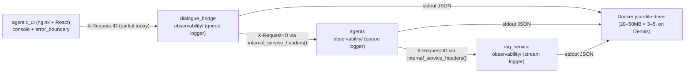
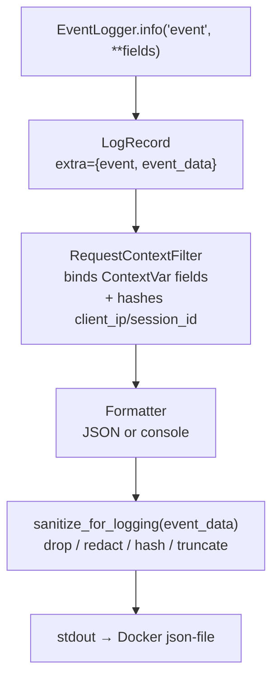
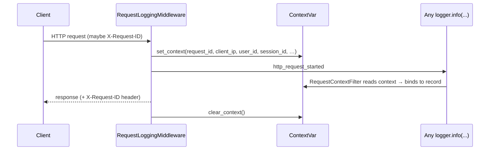
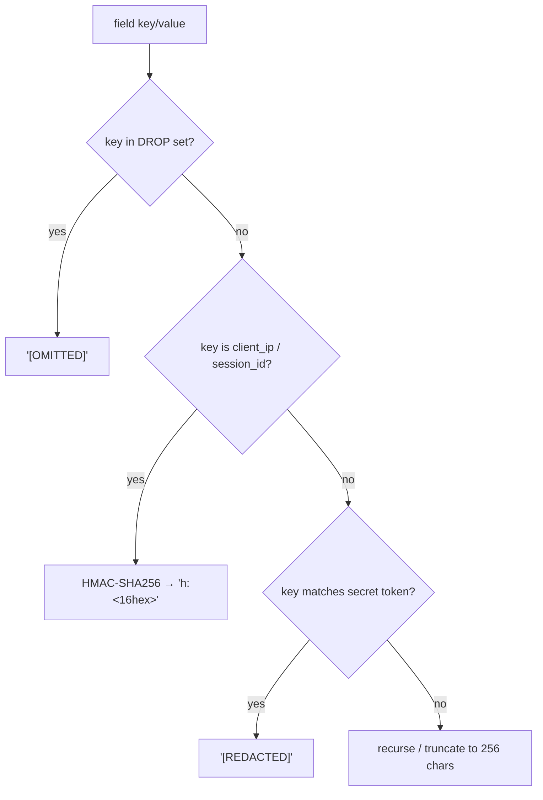
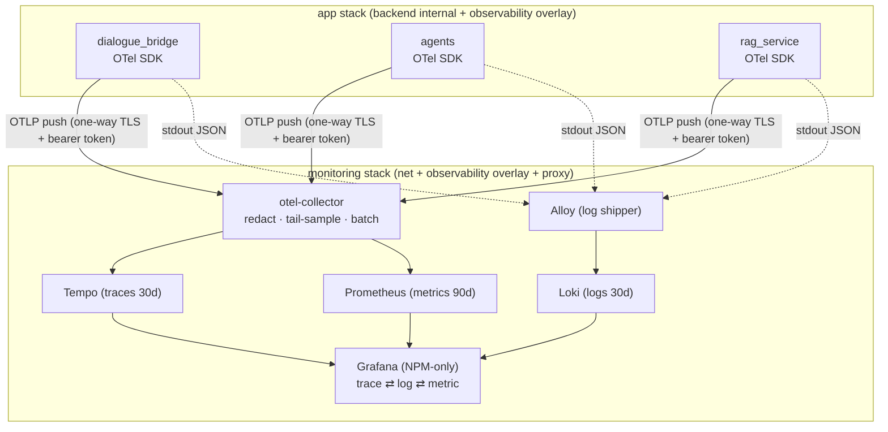

# Observability — Logging, Redaction, and the Traceability Roadmap

Every mAgenticX service emits **structured, event-oriented logs** through an in-house `observability/` package that is intentionally near-identical across `dialogue_bridge`, `agents`, and `rag_service`. Each log line is a single JSON object (or a human-readable console line in dev) carrying a stable `event` name, the request context (`request_id`, hashed `user_id`/`session_id`, `conversation_id`, …), and an arbitrary `fields` payload that is **sanitized before it is written** — secrets redacted, content omitted, identifiers HMAC-hashed. Logs go to stdout only; on the Dennis VM Docker's `json-file` driver rotates them on disk. This document is the authoritative reference for what each service logs today, how PII is kept out of the logs, and the phased plan to layer full OpenTelemetry traces + metrics on top of the existing Grafana/Prometheus stack so that one user action can be followed end-to-end. **Phases 0 and 1 of that plan are implemented; Phases 2–7 are the roadmap.**

---

## Services Involved

The three Python services share the same package layout: `config.py` (handler/formatter wiring), `context.py` (a request-scoped `ContextVar`), `middleware.py` (`RequestLoggingMiddleware`), `events.py` (the `EventLogger` API), `filters.py` (`RequestContextFilter`, which binds context onto every record), `formatters.py` (JSON vs console), `redaction.py` (sanitization), and `exception_handlers.py`. `dialogue_bridge` and `agents` additionally use a queue-based async handler (`QueueHandler` → `SimpleQueue` → listener) so logging never blocks the event loop; `rag_service` uses a simpler direct `StreamHandler`. `dialogue_bridge` also has `stream_metrics.py` for streaming responses.

---

## Phase A — The shared logging pipeline

A log call (`logger.info("event_name", **fields)`) flows through the same stages in every service. Understanding this pipeline is the prerequisite for everything below: redaction happens **inside** it, and the future trace correlation will hook **into** it.

| Key fact | Value / detail |
| --- | --- |
| Log API | `get_logger(__name__)` → `EventLogger`; `.info/.warning/.error/.exception(event, message=None, **fields)` |
| Record shape | `extra={"event": <name>, "event_data": <fields dict>}` |
| Context binding | `RequestContextFilter.filter()` attaches `service`, `env`, `version`, `request_id`, `user_id`, `session_id`, … to every record |
| Format switch | `LOG_FORMAT=json` (prod) or `console` (dev default) |
| Level | `LOG_LEVEL` (default `INFO`); `uvicorn.access` and `httpx` pinned to `WARNING` |
| Destination | stdout only — no file sink in app code; Docker captures it |
| Bridge/agents | non-blocking `QueueHandler` + listener, flushed on shutdown via `shutdown_logging()` / `atexit` |
| rag_service | direct `StreamHandler(sys.stdout)` (no queue) |

---

## Phase B — Request context & cross-service correlation

Each service stores a per-request dict in a `ContextVar` (`context.py`), populated by `RequestLoggingMiddleware` from the inbound request and path params, and cleared in a `finally`. `RequestContextFilter` stamps that context onto every log record, so any log emitted while handling a request is automatically attributed.

**Context fields by service** (defaults shown where the field is missing):

| Field | dialogue_bridge | agents | rag_service |
| --- | --- | --- | --- |
| `request_id` | ✅ (header or UUID) | ✅ | ✅ |
| `client_ip` | ✅ (hashed) | ✅ (hashed) | ❌ |
| `http_method` / `http_path` | ✅ | ✅ | ✅ |
| `user_id` | ✅ (hashed, else `anonymous`) | ✅ (hashed, from `X-User-Id`) | ✅ (hashed, from `X-User-Id`) |
| `session_id` | ✅ (hashed, else `no-session`) | ✅ (hashed, from `X-Session-Id`) | ✅ (hashed, from `X-Session-Id`) |
| `conversation_id` / `message_id` | ✅ | ✅ | ❌ |
| `agent_slug` / `thread_id` | ❌ | ✅ | ❌ |
| `status_code` | ✅ (post-response) | ✅ | ✅ |

> **Both identities are masked.** `user_id` and `session_id` are the two correlation identities, and **both are HMAC-hashed** to `h:<16hex>` — never logged raw. Any user-id field is hashed, including audit fields like `requested_user_id`/`authenticated_user_id` (suffix-matched), so a raw user id never reaches the logs. `anonymous`/`no-session` are the blank sentinels (logged as-is). Filter "everything for a user" with `user=h:…`, "everything for a session" with `session=h:…`.

**Cross-service `X-Request-ID` propagation** is the correlation seam, and as of the correlation fix it is **end-to-end**: one id, originated at the browser, flows through every hop so a single `X-Request-ID` traces a whole request `agentic_ui → dialogue_bridge → agents → rag_service`. The id is **untrusted input** — every service validates it via `sanitize_request_id()` (charset `[A-Za-z0-9._-]`, ≤128 chars) and regenerates a server-side UUID if it's missing or malformed, so a forged/oversized value cannot inject into the logs. It is correlation-only, never an auth input.

| Hop | Propagated? | How |
| --- | --- | --- |
| `agentic_ui` → `dialogue_bridge` | ✅ | `withSessionRequest` mints `X-Request-ID` (`crypto.randomUUID()`) on every API call; nginx forwards it (or generates `$request_id` at the edge if absent) |
| `dialogue_bridge` main inference stream → `agents` | ✅ | the detached run inherits the request context (via `asyncio.create_task` copy); `_do_stream`/`_do_resume` pass `internal_service_headers(get_context().get("request_id"))` |
| `dialogue_bridge` agent-sync / thread-reap → `agents` | ✅ | passes `get_context().get("request_id")` |
| `agents` retail-agent → `rag_service` | ✅ | passes `get_context().get("request_id")` |

**Cross-service `session_id` AND `user_id` propagation** mirrors it, so a single `session=h:…` (or `user=h:…`) traces the whole flow too. The bridge resolves the raw session/user from the auth cookie and **never forwards them raw** — it forwards the *hashed* tokens as `X-Session-Id` / `X-User-Id` headers (`bridge → agents → rag`); agents/rag set them in context at request start, so every line (access + business) carries both. The forwarding is automatic: `internal_service_headers()` auto-derives session + user from the current request context, so **every** internal hop carries them (inference, title generation, catalog/agent sync, tools/skills fetch, voice, suggestions, and the HR/orthodox/retail rag retrievals) — not just inference. **One exception:** the unauthenticated global skills catalog endpoint `GET /api/v1/skills` (`get_skills`) has no auth dependency, so it has no session/user in context and its `skills_listed`/`skills_list_cache_hit` lines log `no-session`/`anonymous`. The hash is **idempotent and strict**: a canonical `h:<16hex>` passes through unchanged (all services log the same token), but any other value — including a forged `h:abc|inject` — is re-hashed, so `X-Session-Id` cannot inject into the logs. The bridge's own `http_request_started` line is the one exception (logged pre-auth → `no-session`); its paired `completed` line carries the session via `request.state`.

> Verified live: a single inference logged the same `req=cea88b76…` **and** `session=h:4acdd59f0e4e464c` in both `dialogue_bridge` (`/start` + access line) and `agents` (`/stream` lifecycle), with no `user_id` anywhere. The remaining step — upgrading these `X-Request-ID` / `X-Session-Id` headers to a W3C `traceparent` so the flow also draws a span tree in Tempo — is **Phase 3**.

---

## Phase C — What each service logs (event catalog)

Every event name below is a stable string emitted via `EventLogger`. The `http_request_*` triplet is common to all three (from `RequestLoggingMiddleware`); the rest are service-specific.

### Common (all services) — `RequestLoggingMiddleware`

| Event | Level | Key fields |
| --- | --- | --- |
| `http_request_started` | INFO | `query` (sanitized params, bridge/agents) |
| `http_request_completed` | INFO | `duration_ms`, `response_class`, `content_type` |
| `http_request_failed` | ERROR | `duration_ms`, exc traceback |
| `http_exception` | WARN/ERROR | `status_code`, `detail` (5xx only) |
| `request_validation_failed` | WARN | validation `errors` (no input) |
| `unhandled_exception` | ERROR | `exception_type`, traceback |
| `/health` | — | **silenced** (never logged) |

### dialogue_bridge

| Event | Level | Notes |
| --- | --- | --- |
| `service_startup` / `service_shutdown` | INFO | lifespan |
| `database_migrations_started` / `database_migrations_completed` | INFO | alembic subprocess around app start |
| `rate_limit_exceeded` | WARN | slowapi, `status_code`, limit |
| `upstream_request_retrying` | WARN | `UpstreamErrorHandler`, `upstream_service`, `operation`, `attempt`, `failure_reason` |
| `blob_download_completed` / `_aborted` / `_error` | INFO/WARN | from `StreamMetrics`: `chunk_count`, `bytes_forwarded`, `first_byte_latency_ms`, `total_stream_duration_ms`, `served_bytes`, `partial` |
| `logged_db_operation` success/failure events | INFO/ERROR | per-call `success_event`/`failure_event`, `duration_ms`, auto-rollback on failure |

### agents

| Event | Level | Notes |
| --- | --- | --- |
| `service_startup` / `service_shutdown` | INFO | lifespan (durable checkpointer pool) |
| `agent_stream_request_received` | INFO | `agent_slug`, `input_messages` |
| `agent_initialization_started` / `_completed` / `_failed` | INFO/WARN | per-run agent build |
| `agent_stream_started` / `agent_stream_completed` | INFO | run lifecycle |
| `agent_stream_failed` | ERROR | traceback |
| `mcp_session_connected`, `mcp_tools_loaded`, `agent_tools_attached` | INFO | tool wiring, `attached_tool_count` |
| `checkpoint_committed` | INFO | durable LangGraph head (`thread_id`, `checkpoint_id`) |
| `checkpoint_commit_emit_failed`, `checkpoint_interrupt_probe_failed`, `checkpoint_release_failed` | WARN | checkpointer edge cases |
| `tool_call_error` | WARN | tool raised → encoded as `ToolMessage(status=error)`, `exception_type` |
| `agent_run_error` | ERROR | encoded as SSE `RUN_ERROR` frame |
| `event_loop_exception` | ERROR | non-cancellation loop errors (uvloop noise suppressed) |

### rag_service

| Event | Level | Key fields |
| --- | --- | --- |
| `service_startup` / `service_shutdown` | INFO | `loaded_tables` |
| `retrieval_started` | INFO | `collection_name`, `k`, `query_length` |
| `retrieval_completed` | INFO | `collection_name`, `k`, `document_count`, **`duration_ms`** (added in Phase 1) |
| `retrieval_no_results` | WARN | `collection_name`, `k`, **`duration_ms`** |
| `retrieval_failed` | WARN | `failure_reason=dependency_failed`, **`duration_ms`**, → 503 |
| `schema_served` / `schema_table_not_found` | INFO/WARN | `table`, `column_count` |
| `sql_query_started` | INFO | `table`, `sql_length` (never the SQL text) |
| `sql_query_completed` | INFO | `table`, `row_count`, `column_count`, **`duration_ms`** (added in Phase 1) |
| `sql_query_failed` / `sql_table_not_found` | WARN | `failure_reason=operation_failed`, **`duration_ms`**, → 400/404 |

---

## Phase D — Redaction & PII (the privacy contract)

`sanitize_for_logging()` runs over every `event_data` payload (and `sanitize_context_value()` over context fields) **before** it reaches stdout. It applies four tiers, plus recursion into dicts/lists and a 256-char string cap. As of Phase 1 this is enforced in **all three** services with the **same secret**, so a given user/IP hashes to the same token everywhere — making cross-service correlation possible without ever storing the raw identifier.

| Tier | Trigger (exact-match unless noted) | Result |
| --- | --- | --- |
| **Drop** | `username, title, file_name, filename, message_content, content, history, messages, prompt, completion, query, answer, text, input, output, delta, chunk, sql, page_content, documents` | `[OMITTED]` |
| **Hash** | `client_ip`, `session_id` | `h:<HMAC-SHA256 prefix>` (one-way, correlatable) |
| **Redact** | key *contains* `password, token, authorization, cookie, secret, csrf, datab64, data_b64` | `[REDACTED]` |
| **Truncate** | any string | first 256 chars + `...<truncated>` |

| Key fact | Value / detail |
| --- | --- |
| Shared secret | `magenticx_log_redaction_secret` Swarm secret → `LOG_REDACTION_SECRET_FILE=/run/secrets/log_redaction_secret` on all 3 services |
| Resolution | each `core/settings.py` `LoggingSettings.redaction_secret` reads the file, then env `LOG_REDACTION_SECRET`, then falls back to a **random per-process key** (one-way; correlation disabled) |
| Local dev | set `LOG_REDACTION_SECRET` in `src/.env` to make hashes correlate across the three local containers (optional) |
| Content stance | LLM prompts/completions and retrieved documents are **never** logged — the drop set blocks the field names and the upstream services don't pass raw content as log fields |

---

## Phase 0 — Deploy safety (implemented)

**Goal:** make every subsequent observability rollout downtime-free on the single-replica Swarm services before changing anything else.

`rag_service`, `agents`, and `dialogue_bridge` had **no `deploy:` block**, so Swarm used the default `stop-first` update order — the old task is killed before the new one is healthy, a real gap on `replicas: 1`. Phase 0 adds a start-first update policy that **pauses** (not rolls back) on failure. These services publish no host ports, so start-first cannot cause a port collision, and Swarm ignores the (now redundant) `container_name`/`restart` keys.

**Why `failure_action: pause`, not `rollback`.** Swarm's automatic rollback acts on a *single service in isolation*. For a lockstep multi-service deploy (e.g. a bridge↔agents protocol change), if one service's new task fails its health window while the others go healthy, auto-rollback would revert just that one — leaving the stack in a split state (`agents=new`, `bridge=old`) that is *more* broken than a clean halt. `pause` stops the rollout with the previous version still serving and surfaces it to the operator, who then makes a coordinated fix-forward or whole-stack rollback decision deliberately. Rollback stays a human, all-or-nothing action.

| Key fact | Value / detail |
| --- | --- |
| File | [src/docker-compose-denis.yaml](../../src/docker-compose-denis.yaml) |
| Added per service | `deploy.update_config.order: start-first`, `monitor: 30s`, `failure_action: pause` |
| Services | `rag_service`, `agents`, `dialogue_bridge` |
| On a bad rollout | the update **pauses**, old version keeps serving; operator decides fix-forward vs a coordinated manual rollback |
| Risk | none — additive, no port conflict, no automatic version skew, reversible by removing the block |

---

## Phase 1 — Redaction parity & shared-secret correlation (implemented)

**Goal — the hard gate before any log is centralized:** every service must redact identically and hash identifiers with the *same* key, or centralized logs would either leak PII (rag) or be impossible to correlate per user/session (random per-process keys).

Three defects were closed:

1. **`rag_service` had no redaction at all** — it logged `event_data` verbatim. Phase 1 ports `redaction.py` into it and routes both the JSON and console formatters through `sanitize_for_logging()`.
2. **The HMAC key diverged across services** — `agents` used a random per-process key, `dialogue_bridge` fell back to the session-token secret, `rag_service` had none — so the same user hashed to three different tokens (or none). Phase 1 introduces a shared `magenticx_log_redaction_secret`, mounted as `LOG_REDACTION_SECRET_FILE` on all three, read by each `LoggingSettings`. With it provisioned, `user_id`/`session_id`/`client_ip` hash identically everywhere (verified: same secret → identical `h:…`, divergent random keys → different).
3. **`rag_service` retrieval had no timing** — Chroma and DuckDB latency were invisible. Phase 1 adds `duration_ms` to `retrieval_completed`/`sql_query_completed` (and the failure paths) via a backported `elapsed_ms`/`logged_operation` helper.

The content drop-set was also expanded in all three services to cover LLM/RAG content keys (`prompt, completion, query, answer, text, input, output, delta, chunk, sql, page_content, documents`).

| Concept | File | Change |
| --- | --- | --- |
| rag redaction (new) | [src/rag_service/observability/redaction.py](../../src/rag_service/observability/redaction.py) | ported `sanitize_for_logging` / `sanitize_context_value` |
| rag operations (new) | [src/rag_service/observability/operations.py](../../src/rag_service/observability/operations.py) | `elapsed_ms`, `logged_operation` |
| rag formatters | [src/rag_service/observability/formatters.py](../../src/rag_service/observability/formatters.py) | sanitize `event_data` in JSON + console |
| rag settings | [src/rag_service/core/settings.py](../../src/rag_service/core/settings.py) | `LoggingSettings.redaction_secret` + random-fallback hardening |
| rag retrieval/SQL timing | [src/rag_service/main.py](../../src/rag_service/main.py) | `duration_ms` on retrieval + DuckDB events |
| bridge secret resolution | [src/dialogue_bridge/core/settings.py](../../src/dialogue_bridge/core/settings.py) | `_load_redaction_secret` reads `LOG_REDACTION_SECRET_FILE` |
| drop-set expansion | [src/dialogue_bridge/observability/redaction.py](../../src/dialogue_bridge/observability/redaction.py), [src/agents/observability/redaction.py](../../src/agents/observability/redaction.py) | content keys added |
| compose wiring | [src/docker-compose-denis.yaml](../../src/docker-compose-denis.yaml) | `LOG_REDACTION_SECRET_FILE` env + `log_redaction_secret` secret on all 3 |

> **Operator step:** create the Swarm secret `magenticx_log_redaction_secret` (32-byte hex) in Portainer **before** deploying this stack revision, exactly like the other `magenticx_*` secrets.

---

## Roadmap — Phases 2–7 (target: full traceability)

The end state pushes OpenTelemetry traces + metrics + logs from each service to an OTel Collector that fans out to **Tempo** (traces), **Loki** (logs), and the **existing Prometheus** (metrics), all visualized in the **existing Grafana**. From any alert, error, or metric spike you click straight to the distributed trace (UI → bridge → agents → LangGraph nodes → OpenAI/MCP/rag → Chroma/DuckDB → Postgres) and its correlated logs, filtered by `user_id`/`session_id`/`run_id`/`trace_id`.

**Locked decisions:** OTel-native SDK (keep the bespoke logger as transport); **push** OTLP (never scrape `/metrics` — it would sit behind mTLS); one neutral attachable `observability` overlay bridges the `internal: true` backend to the monitoring `net`; OTLP secured with one-way TLS + bearer token; **head-sample 15% + 100% of errors/slow**; LLM/retrieval **content capture OFF**; high-cardinality ids live on traces/logs **only, never as metric labels** (jump via exemplars); retention **metrics 90d / logs 30d / traces 30d**; Grafana host port removed, NPM-only.

| Phase | Goal | Gated behind |
| --- | --- | --- |
| **2** | Stand up OTel Collector + Tempo + Loki + Alloy in the monitoring stack (inert) | new `observability` overlay + configs in Portainer |
| **3** | Ship the OTel SDK + W3C `traceparent` propagation + RED/LLM/retrieval metrics in all 3 images, `OTEL_ENABLED=false` | start-first (Phase 0) |
| **4** | Flip `OTEL_ENABLED=true` | collector reachable & accepting |
| **5** | Centralize logs via Alloy → Loki, correlated by `trace_id` | Phase 1 redaction (done) |
| **6** | Frontend RUM: originate `traceparent`, beacon errors + Web Vitals, gate `console.*` | NPM forwards `traceparent` |
| **7** | Grafana dashboards (RED, run explorer, per-user/session, LLM/cost, retrieval, streaming) + alerts + SLOs | all signals flowing |

> None of Phases 2–7 touch the mTLS entrypoints or `REQUIRE_MTLS`; they are standard Portainer stack updates. SSH stays inspection-only.

---

## Sharp Edges and Behavioral Notes

- **The redaction secret must be provisioned in prod, or correlation silently degrades.** Without `magenticx_log_redaction_secret`, each service hardens to a *random per-process* key — logs stay private but `user_id`/`session_id` hashes no longer match across services or survive a restart. This is fail-safe (never the reversible default), not fail-loud; provision the secret.
- **The inference hop inherits the id from the request task, not an explicit hand-off.** `_run`/`_do_stream` run in `asyncio.create_task` children of the `/start` request, so they inherit a *copy* of its context (including `request_id`) — that's why `get_context().get("request_id")` returns the right id in the detached run even though it executes after `/start` has returned and the middleware cleared its own context. If a run were ever launched outside a request context, `get_context()` returns `{}` and `internal_service_headers(None)` falls back to agents minting its own id (graceful degradation, not a crash).
- **The correlation id is untrusted and validated everywhere.** `sanitize_request_id()` rejects anything outside `[A-Za-z0-9._-]{1,128}` (newlines, the `|` console delimiter, oversized values) and regenerates a server-side UUID — verified: a request with `X-Request-ID: evil|injected …` is dropped and replaced, never written to the log. The id is for correlation only and is never consulted for auth.
- **`query`, `sql`, and `text` are in the drop set.** rag only ever logs `query_length`/`sql_length`, so nothing useful is lost there; in the bridge, request query-params logged under `query` now show as `[OMITTED]`. This is deliberate — those fields can carry user content or preview tokens.
- **Exact-match drop keys.** The drop set matches the *whole* lowercased key, so `output_tokens` or `input_size` are **not** dropped — only a field literally named `output`/`input` is. Redact tokens (`password`, `secret`, …) use *substring* match instead.
- **rag_service uses a direct StreamHandler, not the queue.** Its log volume is low and it has no long-lived event loop pressure like the streaming services, so it skips the `QueueHandler` indirection that bridge/agents use.
- **`/health` is never logged** in any service — healthchecks would otherwise dominate the log at 30s intervals.
- **Docker `json-file` is the only sink today.** Logs rotate at 20–50MB × 3–5 files on Dennis and are lost on volume loss; there is no aggregation until Phase 5 (Loki).
- **`agents` suppresses uvloop cancellation noise.** The event-loop exception handler swallows `CancelledError`/`BrokenPipeError`/`ConnectionResetError` (normal on client disconnect mid-stream) and only logs genuine `event_loop_exception`s.

---

## File Map

| Concept | File | What to look for |
| --- | --- | --- |
| Logging setup (bridge) | [src/dialogue_bridge/observability/config.py](../../src/dialogue_bridge/observability/config.py) | `configure_logging`, queue handler |
| Event API | [src/dialogue_bridge/observability/events.py](../../src/dialogue_bridge/observability/events.py) | `EventLogger`, `get_logger`, `log_event` |
| Request context | [src/dialogue_bridge/observability/context.py](../../src/dialogue_bridge/observability/context.py) | `set_context` / `get_context` / `clear_context` |
| Request middleware | [src/dialogue_bridge/observability/middleware.py](../../src/dialogue_bridge/observability/middleware.py) | `RequestLoggingMiddleware`, `duration_ms` |
| Context binding | [src/dialogue_bridge/observability/filters.py](../../src/dialogue_bridge/observability/filters.py) | `RequestContextFilter.filter` |
| Formatters | [src/dialogue_bridge/observability/formatters.py](../../src/dialogue_bridge/observability/formatters.py) | `JsonFormatter`, `ConsoleFormatter` |
| Redaction | [src/dialogue_bridge/observability/redaction.py](../../src/dialogue_bridge/observability/redaction.py) | `sanitize_for_logging`, `_stable_hash`, drop set |
| DB operation timing | [src/dialogue_bridge/observability/operations.py](../../src/dialogue_bridge/observability/operations.py) | `logged_db_operation`, `elapsed_ms` |
| Stream metrics | [src/dialogue_bridge/observability/stream_metrics.py](../../src/dialogue_bridge/observability/stream_metrics.py) | `StreamMetrics`, `first_byte_latency_ms` |
| Cross-service headers | [src/dialogue_bridge/core/proxy.py](../../src/dialogue_bridge/core/proxy.py) | `internal_service_headers` (X-Request-ID injection) |
| agents run-lifecycle logs | [src/agents/router/inference.py](../../src/agents/router/inference.py) | `agent_stream_*`, mcp + checkpoint events |
| agents redaction | [src/agents/observability/redaction.py](../../src/agents/observability/redaction.py) | drop set, `_harden_redaction_secret` (settings) |
| rag redaction (Phase 1) | [src/rag_service/observability/redaction.py](../../src/rag_service/observability/redaction.py) | ported sanitizer |
| rag retrieval/SQL logging | [src/rag_service/main.py](../../src/rag_service/main.py) | `retrieval_*`, `sql_query_*`, `duration_ms` |
| Redaction secret (all) | [src/dialogue_bridge/core/settings.py](../../src/dialogue_bridge/core/settings.py) | `LoggingSettings.redaction_secret` |
| Deploy + secret wiring | [src/docker-compose-denis.yaml](../../src/docker-compose-denis.yaml) | `deploy.update_config`, `log_redaction_secret` |
| Monitoring stack | [src/docker-compose-denis-monitoring.yml](../../src/docker-compose-denis-monitoring.yml) | Grafana, Prometheus, cAdvisor, node-exporter (+ Phase 2 additions) |
