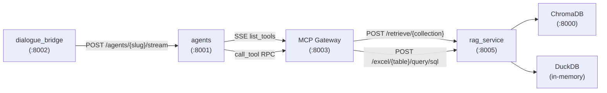
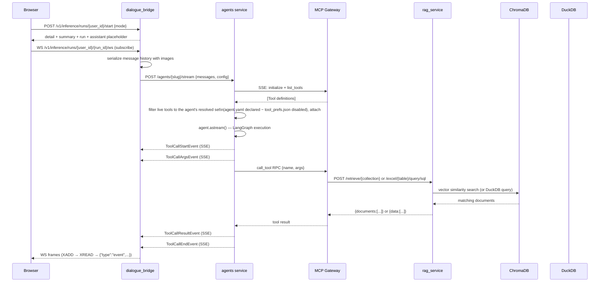
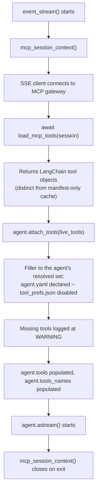
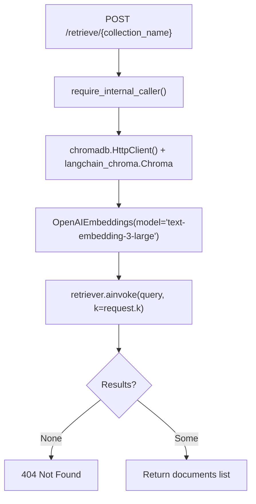
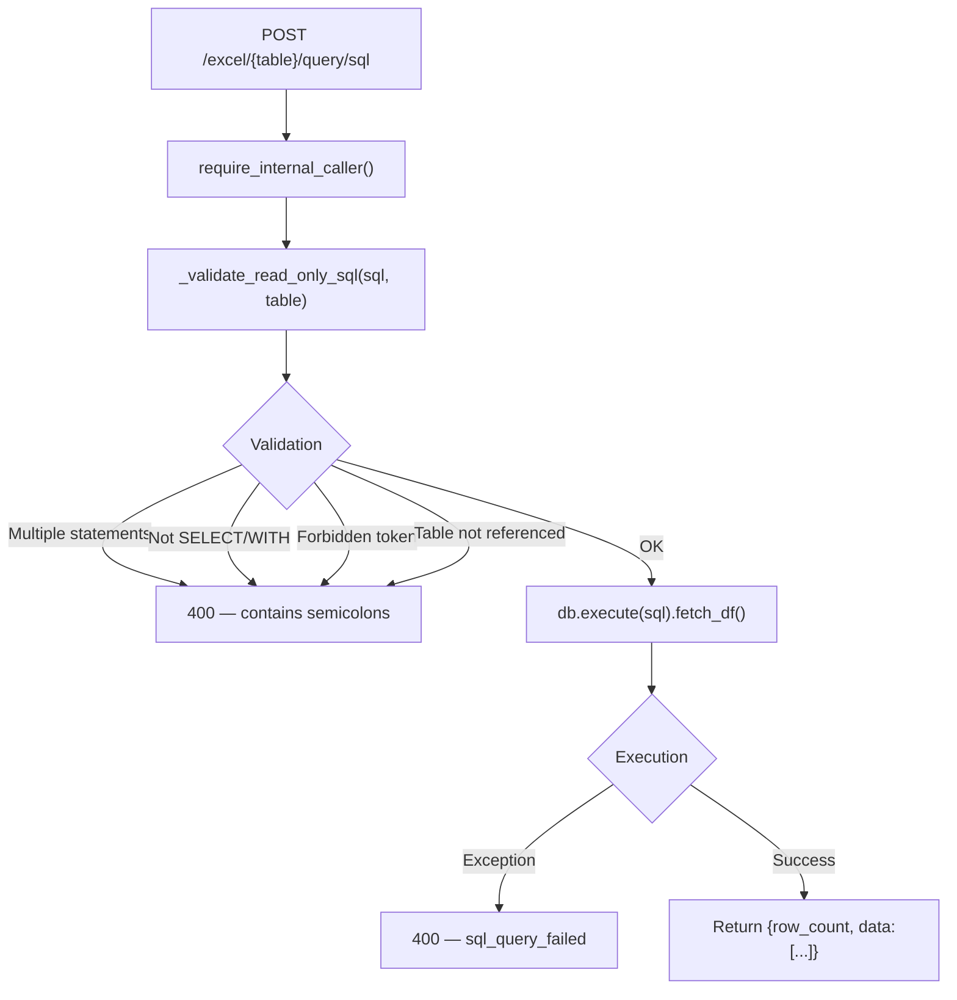
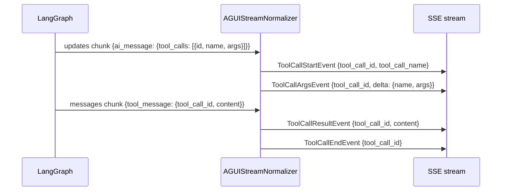
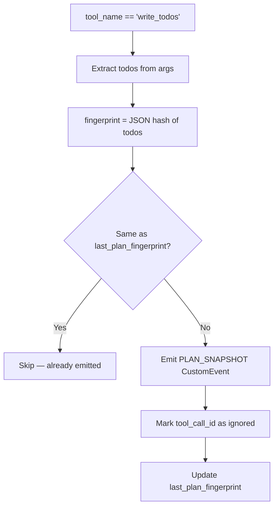
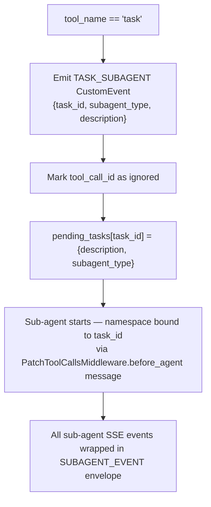
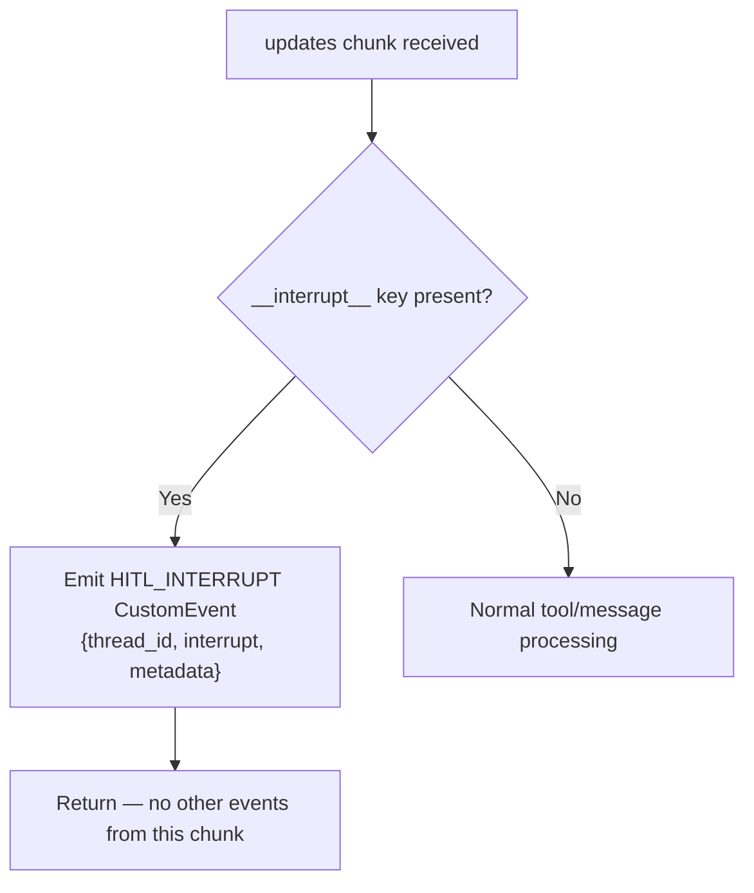
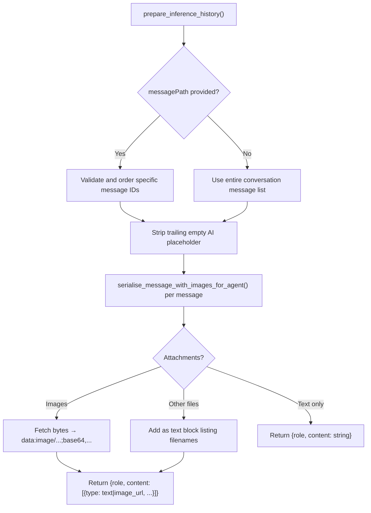

# Retrieval and Tools

The platform exposes two kinds of external capability to agents: **retrieval** (semantic search over a vector store and SQL queries over uploaded spreadsheets) and **tools** (arbitrary actions provided by MCP servers). Both are accessed through the same request path — the agent is loaded, MCP tools are attached, and the agent decides at runtime which tools to call. The RAG service is a separate FastAPI process that agents reach through a dedicated endpoint; it never talks to the dialogue bridge directly.

---

## Services Involved



All calls between services carry an `X-Internal-Proxy-Secret` header validated by a `require_internal_caller()` dependency. Agents and the RAG service are never reachable from the public internet — only the dialogue bridge and MCP gateway have access.

---

## Full Sequence



---

## Phase 1 — Tool Discovery and the Manifest Cache

The agents service maintains an in-memory manifest cache (`_MCP_TOOL_MANIFEST_CACHE`) populated by calling `GET /tools` on the MCP gateway via an SSE client. The cache key format is `"{server_id}/{tool_name}"` for named servers and `"{tool_name}"` for tools with no explicit server identity.

**Server ID overrides** are hardcoded in `mcp_tools.py` for known multi-tool servers. A tool named `tavily-search` is automatically assigned `server_id="tavily"`, and `download_paper` is assigned `server_id="arxiv"` — these overrides ensure clean keys even when the MCP server does not declare a server_id in tool metadata:

```python
_TOOL_SERVER_OVERRIDES: dict[str, str] = {
    "tavily-crawl": "tavily",
    "tavily-extract": "tavily",
    "tavily-map": "tavily",
    "tavily-search": "tavily",
    "download_paper": "arxiv",
    "search_papers": "arxiv",
    "read_paper": "arxiv",
    "list_papers": "arxiv",
}
```

`list_mcp_tools()` is called from two places:

- The `GET /tools` endpoint in the agents service (serves the UI tool catalog)
- The `event_stream()` generator on every inference request (loads live LangChain tool objects)

When `MCP_MANIFEST_CACHE_ENABLED=true` and the cache is already populated, a `GET /tools` request logs `tools_cache_hit` and returns the cached list without hitting the gateway. A `force_refresh=True` call always fetches fresh data.

`ToolManifest` fields exposed to the UI:

| Field | Source |
| --- | --- |
| `server_id` | Extracted from tool metadata or overrides |
| `tool_name` | Exact name as declared by the MCP server |
| `description` | `tool.description` or `annotations.title` |
| `parameter_count` | `len(schema.properties or annotations.properties)` |

---

## Phase 2 — Per-Request MCP Session and Tool Attachment

Every inference stream request opens a fresh MCP session, but **which** tools attach is decided by the agent itself, not by the request. The old model — where the client computed an `enabledTools` list and the bridge forwarded it as `config["tools"]` — is retired. `BaseAgent.__init__` no longer seeds its tool filter from the request config; `config_tools` / `config_tool_names` default empty. Instead:

- A **deep agent declares its tools per agent** in its `agent.yaml` `tools:` list (native + MCP). A `YamlDeepAgent` resolves that declared set from its spec at build time.
- A user **disables specific tools per (user, agent)** in Settings → Agents. That disabled set is persisted server-side in a `tool_prefs.json` at the agent's root (`runtime/filesystem/tool_prefs.py`). The agent's **effective tool set = declared − disabled** (`_apply_tool_disables`).



`agent.attach_tools()` filters the live tool list down to the agent's resolved tool set. Tools outside that set are silently dropped: the MCP gateway may expose 50 tools but the agent sees only the ones its `agent.yaml` declares and its owner has not disabled. Because the client sends no tool list, an empty request config never widens or narrows what the agent can call.

The config structure the bridge sends carries no `tools` key:

```json
{
  "config": {
    "context": {
      "user_id": "...",
      "conversation_id": "..."
    },
    "run_config": {
      "configurable": { "thread_id": "..." }
    }
  }
}
```

**LangGraph agents (`hr_policies` / `orthodox` / `retail`) are unaffected.** Their RAG retrieval is a graph **node** that calls `rag_service` over HTTP (Phase 3), never a bound tool, so they have no attachable tool set and the empty request tool list changes nothing for them.

---

## Phase 3 — Vector Retrieval (Chroma + OpenAI Embeddings)

The RAG service exposes `POST /retrieve/{collection_name}`. The MCP gateway calls this on behalf of any tool that performs semantic search. The collection name maps to a Chroma collection pre-populated with embedded documents.



**Request shape:**

```json
{ "query": "search text", "k": 10 }
```

**Response shape:**

```json
{
  "query": "search text",
  "k": 10,
  "documents": [
    { "content": "matched chunk text", "metadata": { "source": "...", ... } }
  ]
}
```

Errors from the Chroma HTTP client are caught and returned as `503 SERVICE_UNAVAILABLE` — the upstream is treated as a dependency that may be temporarily unavailable.

---

## Phase 4 — Structured Data Queries (DuckDB)

On startup the RAG service scans the `data/` directory for Excel files (`.xlsx`, `.xls`, `.xlsm`). Each file is loaded into an in-memory DuckDB instance via pandas `read_excel`. The table name is derived by lowercasing the filename and replacing non-word characters with underscores (e.g., `"Sales Report Q1.xlsx"` → `"sales_report_q1"`).

Two endpoints serve structured data:

**`GET /excel/{table}/schema`** — returns column names and DuckDB type strings. Used by agents to discover the shape of available data before writing queries.

**`POST /excel/{table}/query/sql`** — executes an agent-supplied SQL query:



**SQL validation rules** (enforced in `_validate_read_only_sql`):

| Check | Rejection reason |
| --- | --- |
| Contains a SQL comment (`--`, `/*`, `*/`) | Comment-based evasion of the forbidden-token denylist |
| Contains `;` after stripping trailing | Multiple statements |
| First token not `SELECT` or `WITH` | Non-read operation |
| Contains `INSERT`, `UPDATE`, `DELETE`, `DROP`, `CREATE`, `ALTER`, `TRUNCATE`, `COPY`, `ATTACH`, `DETACH`, `PRAGMA`, `VACUUM`, `CALL`, or `EXECUTE` | Write/admin operation |
| `{table}` not referenced in query | Scope enforcement |

The DuckDB instance is entirely in-memory — it persists only for the process lifetime. If the `data/` directory is missing or contains no loadable files, the service fails at startup. `TABLES` (a global dict) tracks which table names are available; the lifespan handler logs each loaded workbook.

---

## Phase 5 — Tool Call Lifecycle Events

When an agent calls a tool, the `AGUIStreamNormalizer` translates LangGraph's raw chunk stream into a sequence of AG-UI events the UI and the dialogue bridge accumulate:



The normalizer tracks tool call correlation across the two stream modes (`updates` for starts/args, `messages` for results) using three sets:

| Set | Contents |
| --- | --- |
| `_pending_tool_call_ids` | IDs for which start/args have been emitted; awaiting result |
| `_started_tool_call_ids` | IDs where start was emitted (deduplication guard) |
| `_finished_tool_call_ids` | IDs where result/end were emitted (deduplication guard) |
| `_ignored_tool_call_ids` | IDs for `write_todos` and `task` — no ToolMessage expected |

Deduplication is necessary because LangGraph may re-emit the same `AIMessage` across multiple chunks when subgraph checkpointing is involved.

---

## Phase 6 — Special Tool Handling

Three tool names receive special handling in the normalizer — they do not produce standard tool call events and their `ToolMessage` result is intentionally ignored.

### `write_todos` → Plan Snapshot

When the agent calls `write_todos`, the normalizer extracts the `todos` argument and emits a `PLAN_SNAPSHOT` custom event instead of tool call events. A JSON fingerprint of the todos list prevents re-emitting the same snapshot twice (common when subgraph checkpointing replays an AIMessage):



**`PlanItem` status values:** `"pending"`, `"in_progress"`, `"completed"`.

### `task` → Sub-Agent Delegation

When the orchestrator calls `task(subagent_type=..., description=...)`, the normalizer emits a `TASK_SUBAGENT` custom event and marks the tool call as ignored. It also records `pending_tasks[task_id]` for later namespace binding:



The namespace-to-task_id binding happens via message content matching: the before_agent message injected by `PatchToolCallsMiddleware` contains the task description, and the normalizer scans for a `pending_tasks` entry whose description matches. Once bound, every event emitted by that subgraph namespace is re-emitted as a `SUBAGENT_EVENT` carrying the `task_id` and the original event as a nested dict.

### `__interrupt__` → HITL

LangGraph's human-in-the-loop mechanism emits an `__interrupt__` key in the updates payload when the graph is paused waiting for human input. The normalizer treats this with highest priority — when `__interrupt__` is present, all other events from the same chunk are discarded:



The `thread_id` in `HITLInterruptEvent` is the graph's checkpointer thread. The client uses this to resume the graph via a subsequent call that passes the human decision back through the conversation.

---

## Phase 7 — Message History Preparation

Before the dialogue bridge posts to the agents service, it serializes the conversation's message history. This includes multimodal content — images are fetched from storage, base64-encoded, and embedded as data URLs so the agent receives a self-contained payload with no external references:



This is the only point in the pipeline where blob storage is accessed for inference — the agents service never reads attachments directly.

---

## Sharp Edges and Behavioral Notes

- **The MCP session lives for exactly one inference request.** A new SSE connection is opened and closed for every call to `event_stream()`. There is no connection pool or shared session. If the MCP gateway is unreachable, the inference request fails immediately.

- **Tool attachment is a filter, not a lookup — and the filter source is the agent, not the request.** `attach_tools()` receives the full list of live tools from the MCP gateway and keeps only those in the agent's resolved set (`agent.yaml` declared − `tool_prefs.json` disabled). If a declared tool matches no live tool, the mismatch is logged at WARNING and the agent runs without it — it does not error. The client no longer supplies a tool list, so `config_tools` / `config_tool_names` are empty.

- **The DuckDB instance is per-process and in-memory.** Restarting the RAG service reloads all Excel files from disk into a fresh DuckDB instance. Any query sent between the process restart and the first workbook load will 404. The `TABLES` global is only populated after `_lifespan()` completes.

- **`write_todos` and `task` tool results are never forwarded to the client.** Their `ToolMessage` responses from LangGraph are captured by `_ignored_tool_call_ids` and silently dropped. The agent graph still receives the result internally; the client only sees the `PLAN_SNAPSHOT` or `TASK_SUBAGENT` custom event.

- **HITL stops all other events in that chunk.** If a graph emits both a tool call and an `__interrupt__` in the same update chunk (possible in edge cases), only the `HITLInterruptEvent` is emitted. The client must resume the session before the tool call that triggered the interrupt can complete.

- **Plan snapshot deduplication uses JSON fingerprinting.** Because LangGraph may replay the same `AIMessage` across checkpointing boundaries, the normalizer compares a JSON hash of the todos list against `_last_plan_fingerprint`. The same plan items from two different chunks produces one `PLAN_SNAPSHOT` event. A plan with a single item changed produces a new event.

- **SQL validation rejects comments outright; the DuckDB engine lock is the load-bearing control.** Comments (`--`, `/*`, `*/`) are rejected before any matching, closing the comment-splitting evasion (e.g. `read/**/_csv`) of the forbidden-token denylist. A sufficiently obfuscated query (e.g., hex-encoded string literals containing SQL keywords) could still in principle slip past the string-pattern denylist — but the DuckDB instance is configured `enable_external_access=false` + `disabled_filesystems` + `lock_configuration`, so even a bypassed query cannot reach the filesystem or escape the in-memory read-only Excel copies. No persistent writes are possible.

- **OpenAI embeddings are called by the RAG service, not the agents service.** If `OPENAI_API_KEY` is missing from the RAG service's environment, the Chroma retriever will fail on the first call. The RAG service does not validate the key at startup.

- **The bridge parses agent SSE into detached run state.** `InferenceRunManager` consumes upstream AG-UI frames, updates an in-memory accumulator, and appends each parsed event to the per-run Redis stream (`inference:run:{message_id}:events`). Browser observers connect via WebSocket and replay from that stream. Encoding or framing errors now fail the run instead of being forwarded as opaque bytes.

- **Sub-agent namespace binding can fail silently.** If the `before_agent` message injected by `PatchToolCallsMiddleware` does not match any `pending_tasks` description (e.g., due to whitespace differences), the namespace remains unbound and sub-agent events are emitted without a `SUBAGENT_EVENT` wrapper. The events still reach the client but the UI cannot associate them with the correct task card.

---

## File Map

| Concept | File | What to look for |
| --- | --- | --- |
| RAG service entry & endpoints | [src/rag_service/main.py](../../src/rag_service/main.py) | `retrieve`, `schema`, `sql_query` route handlers |
| Vector retrieval | [src/rag_service/main.py](../../src/rag_service/main.py) | `POST /retrieve/{collection_name}` handler |
| Chroma configuration | [src/rag_service/core/chroma.py](../../src/rag_service/core/chroma.py) | `embeddings_model`, `chroma_settings` |
| DuckDB ingestion | [src/rag_service/core/duck_db.py](../../src/rag_service/core/duck_db.py) | `db`, `TABLES`, Excel loading loop |
| SQL validation | [src/rag_service/main.py](../../src/rag_service/main.py) | `_validate_read_only_sql()` |
| RAG service settings | [src/rag_service/core/settings.py](../../src/rag_service/core/settings.py) | `RagSettings`, `ApiKeysSettings`, `ProxySettings` |
| RAG error handling | [src/rag_service/core/error_handling.py](../../src/rag_service/core/error_handling.py) | `RagOperationErrorHandler`, `register_exception_handlers` |
| MCP tool cache & manifest | [src/agents/utils/mcp_tools.py](../../src/agents/utils/mcp_tools.py) | `_MCP_TOOL_MANIFEST_CACHE`, `list_mcp_tools()`, `_prime_manifest_cache()` |
| MCP session per request | [src/agents/utils/mcp_tools.py](../../src/agents/utils/mcp_tools.py) | `mcp_session_context()`, `load_mcp_tools()` |
| Tool server ID overrides | [src/agents/utils/mcp_tools.py](../../src/agents/utils/mcp_tools.py) | `_TOOL_SERVER_OVERRIDES` |
| Agent base (tool filtering) | [src/agents/runtime/abstractions/base_agent.py](../../src/agents/runtime/abstractions/base_agent.py) | `attach_tools()`; `config_tools`/`config_tool_names` now default empty (no longer seeded from the request config) |
| Per-(user, agent) tool disables | [src/agents/runtime/filesystem/tool_prefs.py](../../src/agents/runtime/filesystem/tool_prefs.py) | `tool_prefs.json` load/save, `_apply_tool_disables()` (declared − disabled) |
| LangGraph agent build & stream | [src/agents/runtime/abstractions/langgraph_agent.py](../../src/agents/runtime/abstractions/langgraph_agent.py) | `build()`, `astream()` |
| Deep agent build lifecycle | [src/agents/runtime/abstractions/deep_agent.py](../../src/agents/runtime/abstractions/deep_agent.py) | `build()`, `register_agent()`, asset discovery |
| Tool call lifecycle events | [src/agents/runtime/protocols/agui/emitter.py](../../src/agents/runtime/protocols/agui/emitter.py) | `tool_call_start()`, `tool_call_args()`, `tool_call_result()`, `tool_call_end()` |
| Stream normalization & routing | [src/agents/runtime/protocols/agui/normalizer.py](../../src/agents/runtime/protocols/agui/normalizer.py) | `handle_chunk()`, `_handle_updates_payload()`, `_handle_messages_payload()` |
| Special tool handling | [src/agents/runtime/protocols/agui/normalizer.py](../../src/agents/runtime/protocols/agui/normalizer.py) | `write_todos` branch, `task` branch, `__interrupt__` priority check |
| HITL, plan, sub-agent event models | [src/agents/runtime/protocols/agui/events.py](../../src/agents/runtime/protocols/agui/events.py) | `HITLInterruptEvent`, `PlanSnapshot`, `TaskSubAgentEvent`, `SubAgentEvent` |
| Agent stream endpoint | [src/agents/main.py](../../src/agents/main.py) | `POST /agents/{agent_slug}/stream` |
| Agent catalog endpoints | [src/agents/main.py](../../src/agents/main.py) | `GET /agents`, `GET /tools` |
| Inference runs (bridge) | [src/dialogue_bridge/router/inference.py](../../src/dialogue_bridge/router/inference.py) | `startInferenceFlow()`, `inference_run_websocket()`, `cancelInferenceRun()` |
| Message history serialization | [src/dialogue_bridge/utils/inference.py](../../src/dialogue_bridge/utils/inference.py) | `prepare_inference_history()`, `serialise_message_with_images_for_agent()` |
| Internal caller auth | [src/agents/core/proxy.py](../../src/agents/core/proxy.py) | `require_internal_caller()` |
