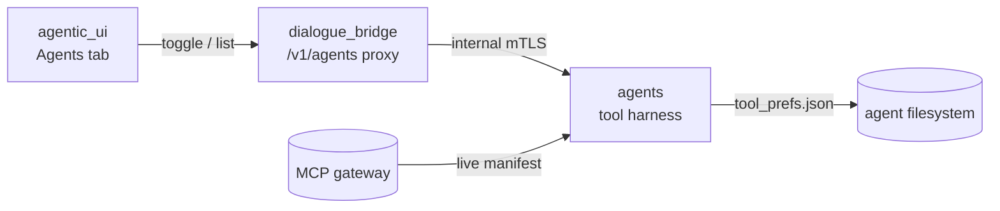
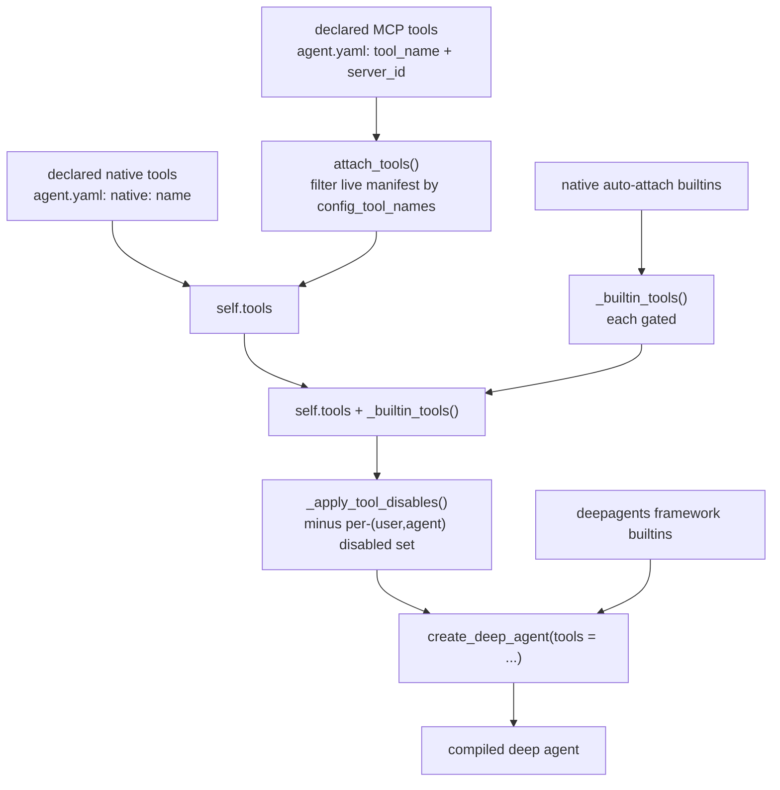
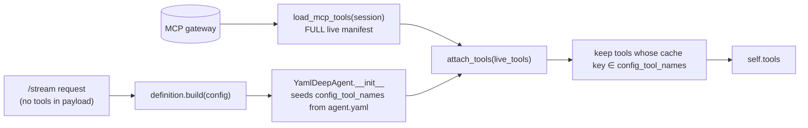
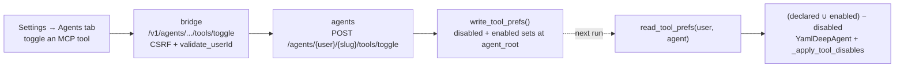
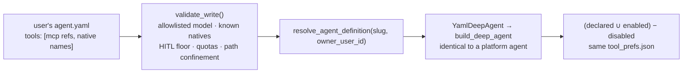

# Tool Harness

This document describes every tool a **deep agent** can call: where each tool comes from, how they are assembled at build time, how MCP tools are injected from the live gateway manifest at stream time, and what a user can switch off. It lives entirely in the **agents** service (`runtime/`), with a thin proxy in **dialogue_bridge** for the read/toggle endpoints and an Agents tab in **agentic_ui**. The mental model to hold throughout: tools are declared **per agent** (in `agent.yaml`), never per request — the old client-computed `enabledTools` list was retired in migration `0016` (see [conversation → inference](../flows/inference-streaming.md)). A user can only *disable* a subset of what an agent already declares; they can never add a tool.

The single assembly line, in `DeepAgent.build_deep_agent()`:

```text
tools = _apply_tool_disables( self.tools + _builtin_tools() )   # our tools, minus user disables
create_deep_agent(tools = tools, ...)                            # framework then adds its own builtins
```

---

## Services Involved



---

## The four classes of tool

A deep agent's live toolset is drawn from four distinct sources. Only one class is code we authored; the rest are the framework's or external.

| Class | Examples | Origin | How it attaches | Disable-able |
| --- | --- | --- | --- | --- |
| **framework** | `write_todos`, `ls`, `read_file`, `write_file`, `edit_file`, `task` | Provided by the **deepagents** library — not our code. | Added inside `create_deep_agent(...)`. Names are *reserved*; a colliding MCP tool is dropped. | No — always present |
| **native · auto-attach** | `remember`, `search_past_conversations`, `present_artifact` | **Custom-made, platform-owned.** Registered in `runtime/tools/registry.py` with `auto_attach=True`. | Given to every deep agent via `_builtin_tools()`, each behind a gate. | No via the Agents tab — `remember`/`search_past_conversations` follow the Personalization prefs; `present_artifact` is always on |
| **native · opt-in** | *(slot exists; none shipped — the three above are all auto-attach)* | Same registry, `auto_attach=False`. | Declared in `agent.yaml` as `{ native: <name> }`, resolved by `resolve_native_tool()`. | No via the Agents tab (as above) |
| **MCP** | `tavily/tavily-search`, `arxiv/download_paper` | External servers behind the MCP gateway — a **live manifest**, not code. | Declared in `agent.yaml` (`tool_name` + `server_id`); or **enabled per agent** from the gateway catalog (Agents tab). Filtered from the live manifest at stream time. | Yes — per (user, agent): disable a declared one, or enable any gateway tool |

The three native builtins are the only tools we wrote and ship in the image. Everything else is either the framework's or an external MCP server's.

---

## Phase 1 — Assembly at build time

When a deep agent is built, the four sources converge. The critical detail is ordering: our tools (`self.tools + _builtin_tools()`) pass through `_apply_tool_disables()`, but the **framework builtins are added afterwards by `create_deep_agent` itself**, so a user's disable set can never remove them.



| Key fact | Value / detail |
| --- | --- |
| Assembly call | `tools=self._apply_tool_disables(self.tools + self._builtin_tools())` in `deep_agent.py` |
| `self.tools` | declared MCP tools (filtered from the live manifest) + resolved declared native tools |
| Framework builtins | added by `create_deep_agent`, **outside** the disable filter |
| Registry warm-up | with no `user_id` in context, `_builtin_tools()` returns `[]` (no identity to bind) |

---

## Phase 2 — MCP injection at stream time

The inference request carries **no tool list**. On every `/stream` (and `/resume`), the router opens an MCP session, pulls the **entire** live gateway manifest, and hands it to `attach_tools()`. The agent keeps only the tools whose canonical cache key it declared — for a `YamlDeepAgent`, those keys are seeded in `__init__` from its `agent.yaml`. This is identical across the send / edit / retry / resume flows; the mode only changes which history and checkpoint are fed, never the tools.



| Key fact | Value / detail |
| --- | --- |
| Manifest source | `load_mcp_tools(session)` — unfiltered, every server the gateway exposes |
| Filter key | `config_tool_names` (spec-derived for YAML agents; empty for base/LangGraph) |
| Base agent default | `BaseAgent.__init__` leaves `config_tools` / `config_tool_names` empty — nothing tool-related rides on the request |

---

## Phase 3 — The native builtins and their gates

Each auto-attach builtin's `builder(ctx)` returns the tool **or** `None` when its gate is off — so "off" means the tool is simply never attached. Gates read from the run context, which the bridge threads from the user's preferences.

| Tool | What it does | Gate — attached only when… |
| --- | --- | --- |
| `remember` | Writes a durable fact to this (user, agent)'s long-term memory. | `use_memory` is on (same flag that mounts `/memories/`) |
| `search_past_conversations` | Semantic recall across the user's earlier conversations (pgvector). | `search_past_convs` is opted in |
| `present_artifact` | Marks a finished `output/` file as a user-facing deliverable. | a `conversation_id` exists (no preference gate) |

Registration order in `registry.py` is the attach order: `remember → search_past_conversations → present_artifact`. These three are **not** toggled in the Agents tab: `remember` and `search_past_conversations` follow the Personalization prefs above, and `present_artifact` is always on.

---

## Phase 4 — What a user can change, and how

The Agents tab governs **MCP tools only**, and in two directions: **disable** a tool the agent declares, or **enable** any other tool from the gateway catalog for just this agent. Native builtins are never listed here (they're managed as in Phase 3). The two override sets persist on the agents service (not the bridge DB) and are applied at the next build. Matching is by the canonical cache key.



| Key fact | Value / detail |
| --- | --- |
| Effective set | `(declared_mcp ∪ enabled) − disabled` — `enabled` unions into `config_tool_names`; `disabled` is subtracted by `_apply_tool_disables` |
| Scope | per `(user, agent)` — never bleeds across users or agents |
| Store | `<agent_root>/tool_prefs.json` → `{"version":2,"disabledTools":[...],"enabledTools":[...]}` (v1 disabled-only files still read) |
| Catalog source | the *available* rows come from the cached MCP manifest map, which the tools endpoint warms via `list_mcp_tools()` before listing |
| Natives | never enter either set — `toggle_agent_tool` ignores native keys and `_apply_tool_disables` subtracts native keys, so `present_artifact` can never be disabled |
| Applies to | deep agents only — the MCP Servers tab is read-only; LangGraph agents expose no tool model |

---

## Phase 5 — User-authored agents inside the same harness

A user can build their own agent (Settings → Agents → Your agents), and the point of the design is that **nothing about the harness changes**: the same `AgentSpec`, the same `YamlDeepAgent`, the same four tool classes, the same override sets. A user-authored agent cannot express a capability a platform agent cannot — because the prompt is user data but the *capability surface* stays platform-governed.



| Guarantee | How it holds |
| --- | --- |
| No user-supplied tool code | `tools:` entries are *references* — an MCP `server/tool` pair validated against the live gateway manifest, or a native name validated against the in-code registry. There is no path by which a spec contributes executable code. |
| The approval gates can't be removed | `_HITL_FLOOR = (write_file, edit_file, execute, task)` is enforced in `validate_write`, so a spec that omits or falsifies a gate is **rejected**. Without this, authoring an agent would be a one-line bypass of the confirmation gate on `write_file`/`execute`. |
| Models are allowlisted | `settings.registry.allowed_agent_models`, not free text — a user cannot select something nonexistent or costly. |
| Definitions are config, never code | `extra="forbid"` on every spec model; the agent folder accepts `.md/.txt/.yaml/.yml` only, ≤20 files, ≤256 KiB each, ≤1 MiB total, depth ≤3. |
| Overrides work identically | The Agents tab reads and writes the same `<agent_root>/tool_prefs.json` for a user agent as for a platform one; `agent_root` is per-`(user, slug)`, so two users' same-named agents cannot alias. |
| Skills are references too | `skills:` must name skills already in the user's pool; they are copied into the read-only `/default_skills/` mount at save time and layered *after* the user-enabled tier, so they can be added to but never removed. See [agent-development](agent-development.md). |

The agent's own definition folder is additionally mounted read-only at `/reference/`, so prompt-adjacent material (notes, checklists, examples) is readable on demand — but a run cannot rewrite its own definition, and therefore cannot edit its next system prompt.

---

## Sharp Edges and Behavioral Notes

- **`present_artifact` is always on; native builtins can't be disabled here.** The Agents tab lists MCP tools only. `toggle_agent_tool` ignores native keys and `_apply_tool_disables` subtracts native keys from the disabled set — so even a legacy pre-model disable of a native is neutralized. `remember` / `search_past_conversations` are turned on/off via the Personalization prefs, not this tab.
- **Framework builtins are un-disable-able.** They enter through `create_deep_agent`, downstream of `_apply_tool_disables`. Neither the Agents tab nor `tool_prefs.json` can touch `write_todos`, `read_file`, etc.
- **The available catalog needs a warm manifest cache.** `list_agent_tools` reads the cached MCP manifest map (primed only by `list_mcp_tools()`, not the per-stream loader); the tools endpoint calls it before listing. If the gateway is down, the *available* list is empty but declared tools still show.
- **Overrides are fail-open.** A missing or corrupt `tool_prefs.json` yields empty disabled + enabled sets — a broken file must never silently strip a declared tool nor silently grant a catalog one. The safe default is the agent's declared baseline.
- **Reserved names win over MCP.** `DeepAgent._apply_live_tools` drops any live MCP tool whose name collides with a reserved deepagents builtin, so a rogue server can't shadow `read_file`.
- **The request never carries tools.** Since migration `0016`, `config["tools"]` is not sent by the bridge and not read by `BaseAgent`. A `YamlDeepAgent` is the only thing that populates `config_tool_names`, from its spec.
- **LangGraph agents are unaffected by all of this.** Their RAG retrieval is a graph *node* calling `rag_service` over HTTP, not a bound tool — an empty tool list changes nothing for them. This is why retiring the global tool list was safe.
- **A user agent can never shadow a platform one.** Resolution checks the platform cache *first*, and creation rejects a reserved platform slug outright — so the per-agent tools endpoint is never ambiguous about which agent it is configuring.
- **Python deep agents declare no MCP tools.** Without an `agent.yaml` spec, `config_tool_names` is empty, so a Python deep agent gets framework + native builtins only.

---

## File Map

| Concept | File | What to look for |
| --- | --- | --- |
| Native-tool registry + builtins + gates | [src/agents/runtime/tools/registry.py](../../src/agents/runtime/tools/registry.py) | `NATIVE_TOOLS`, `build_auto_attach_tools`, `resolve_native_tool`, `native_catalog` |
| Builtin implementations | [src/agents/runtime/tools/](../../src/agents/runtime/tools/) | `remember.py`, `memory_search.py`, `present_artifact.py` |
| Assembly + builtins + disable filter | [src/agents/runtime/abstractions/deep_agent.py](../../src/agents/runtime/abstractions/deep_agent.py) | `build_deep_agent`, `_builtin_tools`, `_apply_tool_disables`, `_apply_live_tools` |
| MCP filter (`attach_tools`, cache keys) | [src/agents/runtime/abstractions/base_agent.py](../../src/agents/runtime/abstractions/base_agent.py) | `attach_tools`, `_filter_live_tools`, `_build_tool_key_from_config` |
| YAML → spec tools (native + MCP) | [src/agents/runtime/abstractions/yaml_agent.py](../../src/agents/runtime/abstractions/yaml_agent.py) | `config_tool_names` seed, `_resolve_native_tools` |
| Per-(user, agent) disable store | [src/agents/runtime/filesystem/tool_prefs.py](../../src/agents/runtime/filesystem/tool_prefs.py) | `read_disabled_tools`, `set_tool_disabled` |
| Agents-tab list / toggle | [src/agents/utils/agent_tools.py](../../src/agents/utils/agent_tools.py) · [router/agent_tools.py](../../src/agents/router/agent_tools.py) | `list_agent_tools`, `toggle_agent_tool` |
| Live MCP manifest load | [src/agents/utils/mcp_tools.py](../../src/agents/utils/mcp_tools.py) · [router/inference.py](../../src/agents/router/inference.py) | `load_mcp_tools`, `mcp_session_context`, `attach_tools` call |
| Bridge proxy | [src/dialogue_bridge/router/agent_tools.py](../../src/dialogue_bridge/router/agent_tools.py) | GET list + POST toggle (CSRF) |
| User-agent spec validation (tool refs, HITL floor, quotas) | [src/agents/runtime/abstractions/user_agents.py](../../src/agents/runtime/abstractions/user_agents.py) | `validate_write`, `_HITL_FLOOR`, `_ALLOWED_EXTENSIONS` |
| Ownership-aware resolution | [src/agents/utils/agents.py](../../src/agents/utils/agents.py) | `resolve_agent_definition`, `_load_user_agent`, `_USER_AGENT_CACHE` |
| Frontend Agents tab | [src/agentic_ui/src/features/settings/components/profile_parts/AgentsTab.tsx](../../src/agentic_ui/src/features/settings/components/profile_parts/AgentsTab.tsx) | optimistic toggle, `getAgentTools` / `toggleAgentTool` |
