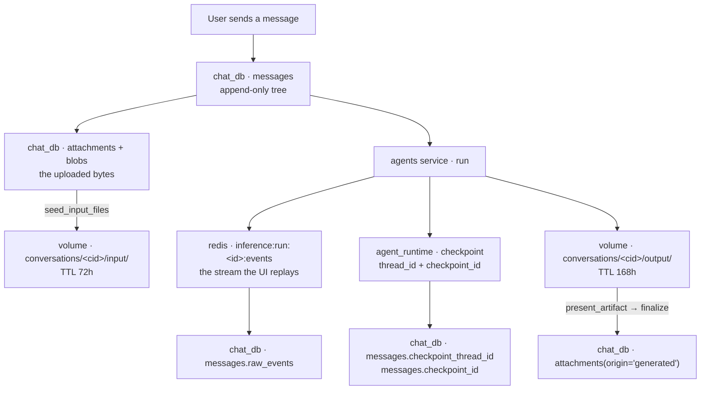

# State & storage map — what exists, where it lives, and what is not persisted

Every durable thing in the platform, the store that owns it, and the stores that
merely cache or mirror it. Written to answer one question directly: *if this
store were lost, what could be rebuilt and what is gone?*

Tools are deliberately out of scope — an MCP tool is a live manifest from
whichever servers the gateway currently has open, owned by nothing here.

---

## 1. The five stores

| # | Store | Physical location | What it owns |
| --- | --- | --- | --- |
| 1 | **`chat_db`** (Postgres) | `chat_postgres` | Conversations, messages, attachments, users, preferences, agent *metadata*, shares, scheduled tasks, embeddings |
| 2 | **`agent_runtime`** (Postgres) | Same instance, **different database** | LangGraph checkpoints — the agent's own memory of a thread |
| 3 | **Agents volume** | `magenticx_data:/var/magenticx` | Agent definitions, skills, per-agent memory, tool prefs, conversation input/output files |
| 4 | **Redis** | `redis` | Run event log (durable-ish), skill caches, logout denylist |
| 5 | **Vectorstore** | `vectorstore` volume (Chroma) | RAG corpora — unrelated to a conversation's own state |

Stores 1 and 3 are the two that hold user-created content. **Neither is a
backup of the other**, and §6 is the list of things that live in exactly one.

---

## 2. A conversation, end to end



### 2.1 The message tree — `chat_db`

`messages` is **append-only**. An edit or a retry creates a *sibling* row, never
an overwrite, which is what makes branches navigable. Relevant columns:

- `parent_id` — the tree edge.
- `streaming_message_path` — the branch context the agent actually saw as
  history, so a reload reconstructs which siblings were in scope.
- `raw_events` — the AG-UI event log for that message. This is why a chart, an
  artifact card, a plan, or a sub-agent panel survives reload: the timeline is
  **re-folded from these events**, not stored as rendered state.
- `checkpoint_thread_id` / `checkpoint_id` — the pointer into store 2.

### 2.2 The checkpointer — `agent_runtime`

A **separate database on the same Postgres instance**. LangGraph's
`AsyncPostgresSaver` owns it, and its schema is not ours.

The relationship to `messages` is the subtle part: `chat_db` holds what the
*user* sees, `agent_runtime` holds what the *agent* remembers. They are two
recordings of the same conversation from different vantage points.

- **One thread per branch.** A new/edit/retry/shared-continue mints a fresh
  `checkpoint_thread_id`; a fork copies the thread rather than sharing it, so
  branches cannot contaminate each other.
- **No TTL.** Checkpoints are kept for the life of the conversation.
- Losing `agent_runtime` does not lose the conversation — the bridge falls back
  to a cold seed from the message tree. Losing `chat_db` loses it outright.

### 2.3 The event log — Redis

`inference:run:<run_id>:events`, a Redis Stream. This is the live channel: WS
observers replay from a cursor, so a reconnect mid-run resumes rather than
restarts. On terminal state the key gets a TTL, because by then the same events
have been written to `messages.raw_events` — Redis is the *live* copy, Postgres
the durable one.

### 2.4 Files — the split that matters

| Direction | Postgres | Volume |
| --- | --- | --- |
| **Upload** | `attachments` + `blobs` (the truth) | `conversations/<cid>/input/` — a **cache**, TTL 72h |
| **Agent output** | only if `present_artifact` promoted it | `conversations/<cid>/output/` — TTL 168h |

An upload is durable in Postgres and mirrored to the volume for the agent to
read. An agent's output is the reverse: it lives **only on the volume** until
`present_artifact` designates it, at which point the bridge reads it back at run
finalize and stores it as `attachments(origin='generated')`.

**So anything the agent wrote and did not present is deleted after 7 days.**
That is intended — `output/` is scratch — but it is the one place where "the
agent made me a file" and "I still have the file" differ.

---

## 3. The agent filesystem

One volume, two planes.

```text
global/                                   ← platform-owned, shared by all users
    agents/<slug>/
        agent.yaml · AGENT.md · subagents/
        skills/<name>/                    tier ① DEFAULT skills
    skills/<category>/<name>/SKILL.md     the browsable catalogue

workspaces/users/<user_id>/               ← one user's everything
    skills/
        manifest.json                     the user's POOL
        custom/<name>/SKILL.md            user-authored skills
    custom_agents/<slug>/agent.yaml       user-authored agent definitions
    agents/<slug>/
        memory/{AGENTS.md, entries/*.yml}
        skills/<name>/                    tier ② ASSIGNED skills
        default_skills/<name>/            tier ① for user-authored agents
        tool_prefs.json                   disabled/enabled MCP keys
        conversations/<cid>/{input,output}
```

### 3.1 The four skill pools

This is the part worth being precise about, because three of the four look alike
from the UI and behave differently at runtime.

| # | Pool | Where | Who puts things in it | Removable by the user? |
| --- | --- | --- | --- | --- |
| ① | **Global catalogue** | `global/skills/` | Platform (seeded from the image) | No — read-only, browsable |
| ② | **User pool** | `workspaces/users/<u>/skills/manifest.json` | The user (adds from catalogue, or authors a custom one) | Yes |
| ③ | **Assigned to an agent** | `users/<u>/agents/<slug>/skills/` | The user, per agent, from their pool | Yes — toggled per (user, agent) |
| ④ | **Agent defaults** | `global/agents/<slug>/skills/` or `users/<u>/agents/<slug>/default_skills/` | The agent's own definition | **No** — mounted read-only, no toggle |

The flow between them is one-directional: **catalogue → pool → assigned**. A
skill is *copied* at each hop, not referenced, so removing it from the pool does
not silently break an agent already using it.

**Where `create_skill` lands.** When an agent authors a skill it goes into the
**user pool (②)** and is then **assigned to that agent (③)** — deliberately not
into ④. Tier ④ is part of an agent's *definition*; a tool call at runtime must
not be able to edit the definition, and ③ is the tier the user can see and undo.
That distinction is the reason `sync_agent_default_skills` is kept separate from
the per-agent enable path.

### 3.2 Per-agent memory

`users/<u>/agents/<slug>/memory/` — `AGENTS.md` plus `entries/*.yml`. Scoped per
**(user, agent)**, not per conversation, which is what makes it durable across
conversations. Volume only; nothing in Postgres.

---

## 4. Custom agents — and yes, they are YAML agents

**Confirmed.** A user-authored agent is loaded as a `YamlDeepAgent`:

```python
factory=(lambda cfg, s=spec, sd=agent_dir: YamlDeepAgent(s, sd, config=cfg))
```

There is no separate "custom agent" runtime class. The builder produces an
`AgentSpec` document — `agent.yaml` plus `AGENT.md`, `subagents/*.md` and any
reference files — and one generic engine interprets it. A platform agent written
declaratively (`Omni (YAML)`) and a user-authored one take the identical path;
the only difference is *which plane* the definition is read from.

**Where a custom agent lives — the answer is "both, but not the same thing":**

| Part | Store |
| --- | --- |
| Definition (`agent.yaml`, `AGENT.md`, subagents, files) | **Volume only** — `users/<u>/custom_agents/<slug>/` |
| Metadata row (`slug`, `name`, `description`, `icon`, `version`, `type`, `is_active`, `owner_user_id`) | **`chat_db.agents`** |

`agents.owner_user_id` is the discriminator: `NULL` = platform agent discovered
from the service manifest; set = user-authored, definition in that user's
workspace. It is also what every ownership check keys on, and what
`conversations.agent_id` foreign-keys to.

So the metadata is in Postgres and the substance is not.

---

## 5. Redis keyspaces

| Key | Contents | Failure stance |
| --- | --- | --- |
| `inference:run:<id>:events` | Run event stream; TTL applied on terminal | Loss = the live replay channel; `raw_events` still has it |
| `skills:global` | The catalogue | Cache — rebuilt from the volume |
| `skills:user:<u>:registry` | A user's pool, 2h TTL | Cache — **but nothing invalidates it on a tool-created skill** |
| `skills:user:<u>:agent:<a>` | Assigned set, 2h TTL | Cache |
| `skills:agents:<u>` | Agent list for the Skills tab | Cache |
| `auth:logout:sid:<sid>` | Instant-logout denylist | **Fail-open** — a Redis outage does not lock users out |

---

## 6. What lives in exactly one place

The gaps, stated plainly. Each is a thing a user created that a single store's
loss would destroy.

| Object | Lives only in | Consequence |
| --- | --- | --- |
| **Custom agent definition** | Volume | The Postgres row survives and points at nothing — the agent appears in the list and cannot run |
| **Custom skill content** (`SKILL.md` + files) | Volume | No Postgres record at all; the skill simply ceases to exist |
| **User skill pool** (`manifest.json`) | Volume | Every user's added-skill selection is lost |
| **Per-agent assigned skills** | Volume | Reverts to nothing assigned |
| **Per-agent memory** (`AGENTS.md`, entries) | Volume | Everything every agent learned about every user |
| **Per-(user, agent) tool prefs** | Volume | Enable/disable choices reset |
| **Unpresented agent output** | Volume, 7-day TTL | By design, but invisible to the user |
| **Checkpoints** | `agent_runtime` | Recoverable — cold-seed from the message tree |

`chat_db` has an automated story (`pg_dump`). **The volume does not** — and it
is the store holding everything in the table above. That asymmetry is the single
largest durability gap in the platform today.

---

## 7. Flows worth building (not yet built)

Falling out of §6 rather than invented:

1. **Mirror custom agent definitions into Postgres.** The row already exists;
   it holds no `agent.yaml`. Persisting the definition would make the volume a
   *cache* of user-authored agents rather than their only home, and would let a
   fresh agents container rehydrate a user's workspace instead of losing it.
2. **Mirror custom skills into Postgres.** Same argument, and stronger — a
   custom skill has no Postgres presence whatsoever.
3. **Persist the user pool + per-agent assignments.** These are *selections*,
   not content: small rows, and the thing a user would most notice losing.
4. **Invalidate the skills cache on a tool-created skill.** Known gap: an agent
   authors a skill and it is invisible in Settings for up to 2h.
5. **Back up the volume.** Even without 1–3, the volume needs the equivalent of
   `pg_dump`. Today it has neither a mirror nor a backup.

Items 1–3 share one shape — *definition in Postgres, materialised to the volume
on boot* — which would also make the agents service stateless enough to scale
past one replica. That is a design decision worth taking deliberately rather
than arriving at.

---

## 8. File map

| Concern | File |
| --- | --- |
| Bridge tables | `src/dialogue_bridge/core/database/models.py` |
| Checkpointer config | `src/agents/core/settings.py` (`CheckpointerSettings`) |
| Checkpointer access | `src/agents/utils/checkpointer.py` |
| Path authority (every volume path) | `src/agents/runtime/filesystem/layout.py` |
| Workspace mounts + write-deny | `src/agents/runtime/filesystem/workspace.py` |
| Input/output TTL sweeper | `src/agents/runtime/filesystem/retention.py` |
| Skill pools ①–④ | `src/agents/runtime/skill_registry/` |
| Custom agent CRUD + validation | `src/agents/runtime/abstractions/user_agents.py` |
| YAML agent engine | `src/agents/runtime/abstractions/yaml_agent.py` |
| Agent resolution (platform vs user) | `src/agents/utils/agents.py` |
| Run event log | `src/dialogue_bridge/utils/event_log.py` |
| Redis cache policies | `src/dialogue_bridge/core/cache/policies.py` |
| Artifact capture at finalize | `src/dialogue_bridge/utils/inference_runs.py` |
