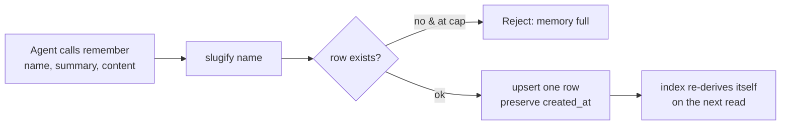
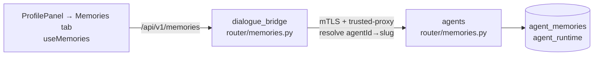

# Agent Memory

Every deep agent keeps **per-(user, agent) long-term memory** — durable facts it learns about a user (preferences, ongoing projects, key people, decisions, dates) that persist across conversations and are injected into its context at the start of each new chat. Memory is scoped to the **(user, agent) pair**: one agent's memory never bleeds into another's, mirroring how skills are scoped.

The shape follows the skills progressive-disclosure pattern: a compact **`AGENTS.md` index** (one summary line per memory) is always injected, and the full body of each memory lives in an **`entries/<name>.yml`** detail file the agent reads on demand. The agent **writes** memory through its built-in `remember` tool; the **user** inspects and deletes it through the ProfilePanel **Memories** tab. There is no user-facing create/update — writes are the agent's job.

Two independent preference gates govern memory (see [user-preferences](user-preferences.md#agent-memory)):

- **`use_memory`** (default **on**) — mounts the `/memories/` route (`AGENTS.md` + `entries/`) and attaches the `remember` tool. Off ⇒ the agent runs with no persistent memory at all.
- **`search_past_convs`** (default **off**, opt-in) — a *separate* capability: the `search_past_conversations` pgvector recall tool over the user's past messages (see [conversation-embeddings](conversation-embeddings.md)). Not part of this memory store.

---

## Where it lives

**In `agent_runtime`, not on the filesystem.** `/memories/` is a *virtual* route:
the agent reads `AGENTS.md` and `entries/<name>.yml` exactly as it would real
files, but there is no directory behind them — every read and write is a query
against the `agent_memories` table.

Memory used to live only on the agents-service volume, which has no backup:
losing it destroyed everything every agent had learned about every user. It sits
in `agent_runtime` rather than `chat_db` because the **agent** writes it, mid-run,
with no browser request to hang persistence off — and that is the database this
service already owns and creates. One consequence: the bridge holds no
connection to it, so the Memories tab is served by the agents service (below).

```text
CompositeBackend route "/memories/"
        │
        ▼
StoreBackend(store=AgentMemoryStore, namespace=(user_id, agent_slug))
        │   keys:  /AGENTS.md          → derived, never stored
        │          /entries/<name>.yml → one row each
        ▼
agent_memories  (agent_runtime)
```

The namespace is what keeps one agent's memory out of another's context; a
namespace shorter than `(user_id, agent_slug)` is rejected rather than silently
widening the scope.

### The row

| Column | |
| --- | --- |
| `user_id`, `agent_slug`, `name` | primary key — the pair plus the entry slug |
| `raw` | **the yml the agent reads back, verbatim** |
| `summary`, `content` | the queryable projection of `raw` |
| `source_conversation_id`, `source_run_id`, `source_thread_id` | provenance |
| `created_by`, `trust_level` | provenance |
| `created_at`, `updated_at` | |

`raw` and the projected columns are written from one record in one statement, so
they cannot drift; reads return `raw` byte for byte, with no render step.

**Provenance is in columns only — deliberately absent from `raw`.** A durable
memory is future context, so an entry written after the agent read a poisoned
page behaves like a stored prompt injection; the columns are what make such an
entry findable by query later. Keeping them out of the bytes means the agent
cannot rewrite its own audit trail through `write_file`.

`trust_level` is a coarse signal, not a guarantee: it is set per **run** from
whether the run had any MCP tool attached, not per turn. Treat it as a review
hint, never as authorization.

The table is created on boot by `AgentMemoryStore.setup()` (`CREATE TABLE IF NOT
EXISTS`, awaited before the app serves). `agent_runtime` has **no alembic
chain** — DDL-on-boot is the convention the durable checkpointer established, so
memory schema changes are code, not migrations.

### `AGENTS.md` is derived

The index is not a row. A read synthesises it from the live rows: the standard
template plus one `index_line()` per memory.

```text
## Memories
- **user-timezone** — User is in Athens (EET).
```

That deletes the drift class where the index and the entries disagree — and it
means a `write_file` to `AGENTS.md` is a **no-op**: the index cannot be edited
out of step with what it indexes. The row format lives in
`harness/memory/index.py` and is the single authority for it.

---

## Write path — the `remember` tool



`harness/tools/remember.py` (`build_remember_tool`, bound per run to
`user_id`/`agent_slug`/`conversation_id` plus the run identity):

1. **Slugify** `name` → `[a-z0-9-]`. Still enforced with nothing on disk: the
   slug is the key the agent later addresses as `entries/<slug>.yml`, so it must
   not carry slashes or dots into a path the model will try to read.
2. **Cap check** — a *new* entry is refused at `MEMORY_MAX_ENTRIES` (default
   **60**, env-tunable), counted in rows. Updates always go through, so a full
   memory can still be corrected.
3. **Upsert one row**, preserving the original `created_at`.

The tool is **async** — a save is a database round trip — and returns a string on
every path. It never raises: it runs inside a live turn, and an exception would
fail the user's run, whereas a message is something the agent can react to.

**Idempotent by name**, and that is load-bearing rather than a nicety: LangGraph
checkpoints at super-step boundaries, so a node re-entered after an approval
pause, a tool retry, or a container restart runs this again. Keying on the name
and preserving `created_at` makes the second write produce the same row.

It no longer maintains the index — that was two writes that could disagree.

Attached only when `use_memory` is on (gated in `DeepAgent._builtin_tools`), and
listed in `RESERVED_DEEPAGENT_TOOL_NAMES` so an MCP tool cannot shadow it.

---

## Read / delete path — the Memory inspector

The browser talks only to the bridge, which proxies to the agents service. Here
that proxy is not a convention but a necessity: `agent_memories` lives in
`agent_runtime`, and the bridge holds no connection to it. The bridge contributes
auth, CSRF, and the `agentId → slug` translation (which needs `chat_db`) — and
owns nothing about memory. No Redis cache; the inspector is low-traffic and a
delete must reflect immediately.

Reads go straight to the table rather than through the `/memories/` route: that
route exists to make the store look like a filesystem *to the model*, while the
inspector wants the columns, including the provenance the yml omits.



| Action | Bridge (`/v1/memories`, `validate_userId`) | Agents (`require_internal_caller`) | Store |
| --- | --- | --- | --- |
| List | `GET /users/{user_id}/agents/{agent_id}` | `GET /agents/{slug}/users/{user_id}/memories` | `list_pair` (metadata only, name-sorted) |
| Preview | `GET /users/{user_id}/agents/{agent_id}/{name}` | `GET /agents/{slug}/users/{user_id}/memories/{name}` | `read_entry` (full content) |
| Delete | `DELETE /users/{user_id}/agents/{agent_id}/{name}` (+ CSRF) | `DELETE /agents/{slug}/users/{user_id}/memories/{name}` | `delete_entry` (one row) |

**UI** — the **Memories** tab (`profile_parts/MemoriesTab.tsx`, fed by the `useMemories` hook) lists the user's deep agents; drilling into one (with a Back button) shows that agent's memories **sorted by name**, each clickable to lazily load and preview its content, with a **delete** button behind an inline confirm step. Optimistic delete drops the row immediately and restores it on failure.

---

## Sharp edges

- **Mid-conversation saves apply on the *next* conversation.** `AGENTS.md` is injected into context at build time (start of a conversation). A `remember` commits immediately, but the agent only *reads it as always-on context* next time. Within the same chat it can still `read_file /memories/AGENTS.md` — and because the index is derived, that read reflects the save straight away.
- **60-entry hard cap per (user, agent).** New saves beyond `MEMORY_MAX_ENTRIES` are refused (updates still allowed), so the index stays context-cheap. Counted in rows. There is no automatic eviction/decay yet (tracked under *Memory lifecycle* in `src/TODO`).
- **Delete is one row.** The index is derived from what remains, so it can never
  be left pointing at a memory that is gone — which the previous two-file version
  had to keep in step by hand. Idempotent.
- **The agent cannot edit `AGENTS.md`.** Writes to it are accepted and ignored.
  This closes a bypass (the index could previously be edited out of step with the
  entries), but it *is* a behaviour change from the on-disk version.
- **`batch()` bridges onto the event loop.** deepagents' `StoreBackend.ls()` is
  synchronous and the protocol layer runs it via `asyncio.to_thread`, so
  `ls`/`glob`/`grep` arrive on a worker thread rather than through `abatch`. The
  bridge avoids a second, synchronous pool; it is refused if called *on* the loop
  thread, where it would deadlock.
- **No FK to `users`** — that table is in `chat_db`, a different database. Deleting
  a user does **not** cascade to their memories; that needs an explicit sweep.
- **Per-(user, agent) isolation.** Memory is keyed by agent slug — switching agents shows a different memory set. The workspace-scoped tier is future work (see *Projects / Workspaces* in `src/TODO`).
- **No create/update endpoint by design.** The user can only inspect and delete; the agent owns writes via `remember`.
- **`use_memory` off ⇒ nothing.** Mount dropped, `AGENTS.md` not injected, `remember` not attached — and the system prompt's memory instructions are omitted, so the agent won't claim a memory it doesn't have.

---

## File map

| Concern | File |
| --- | --- |
| The store (`BaseStore` over `agent_memories`, DDL, typed CRUD) | [src/agents/harness/memory/store.py](../../src/agents/harness/memory/store.py) |
| Shared connection pool handle | [src/agents/harness/memory/pool.py](../../src/agents/harness/memory/pool.py) |
| `AGENTS.md` index row format | [src/agents/harness/memory/index.py](../../src/agents/harness/memory/index.py) |
| `AGENTS.md` template (the prose the model reads) | [src/agents/harness/memory/template.py](../../src/agents/harness/memory/template.py) |
| The `/memories/` route wiring | [src/agents/harness/filesystem/workspace.py](../../src/agents/harness/filesystem/workspace.py) |
| Pool install + table creation on boot | [src/agents/harness/checkpointer/bootstrap.py](../../src/agents/harness/checkpointer/bootstrap.py) |
| `remember` write tool (slugify, cap, upsert) | [src/agents/harness/tools/remember.py](../../src/agents/harness/tools/remember.py) |
| Provenance plumbing (`run_id`, `thread_id`, `trust_level`) | [src/agents/harness/tools/registry.py](../../src/agents/harness/tools/registry.py) · [src/agents/harness/abstractions/deep_agent.py](../../src/agents/harness/abstractions/deep_agent.py) (`_trust_level`) |
| Memory gating + system-prompt block | [src/agents/harness/abstractions/deep_agent.py](../../src/agents/harness/abstractions/deep_agent.py) (`_builtin_tools`, `load_agent_md`, `_memory_system_prompt`) |
| Cap setting (`MEMORY_MAX_ENTRIES`) | [src/agents/core/settings.py](../../src/agents/core/settings.py) (`FilesystemSettings`) |
| Agents inspector endpoints | [src/agents/router/memories.py](../../src/agents/router/memories.py) |
| Bridge proxy + router | [src/dialogue_bridge/utils/memories.py](../../src/dialogue_bridge/utils/memories.py) · [src/dialogue_bridge/router/memories.py](../../src/dialogue_bridge/router/memories.py) |
| Frontend API + hook + tab | [src/agentic_ui/src/shared/lib/api/](../../src/agentic_ui/src/shared/lib/api/) · [src/agentic_ui/src/features/settings/hooks/useMemories.ts](../../src/agentic_ui/src/features/settings/hooks/useMemories.ts) · [src/agentic_ui/src/features/settings/components/profile_parts/MemoriesTab.tsx](../../src/agentic_ui/src/features/settings/components/profile_parts/MemoriesTab.tsx) |

See also: [user-preferences](user-preferences.md#agent-memory) (the `use_memory` gate), [conversation-embeddings](conversation-embeddings.md) (the separate `search_past_conversations` recall tool), [agent-development](../development/agent-development.md#per-user-agent-long-term-memory).
