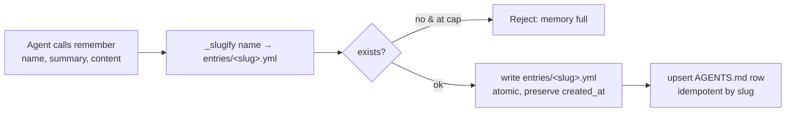
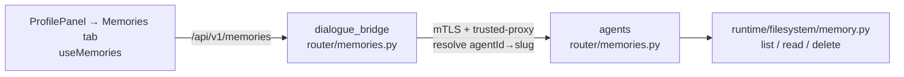

# Agent Memory

Every deep agent keeps **per-(user, agent) long-term memory** — durable facts it learns about a user (preferences, ongoing projects, key people, decisions, dates) that persist across conversations and are injected into its context at the start of each new chat. Memory is scoped to the **(user, agent) pair**: one agent's memory never bleeds into another's, mirroring how skills are scoped.

The shape follows the skills progressive-disclosure pattern: a compact **`AGENTS.md` index** (one summary line per memory) is always injected, and the full body of each memory lives in an **`entries/<name>.yml`** detail file the agent reads on demand. The agent **writes** memory through its built-in `remember` tool; the **user** inspects and deletes it through the ProfilePanel **Memories** tab. There is no user-facing create/update — writes are the agent's job.

Two independent preference gates govern memory (see [user-preferences](user-preferences.md#agent-memory)):

- **`use_memory`** (default **on**) — mounts the `/memories/` tree (`AGENTS.md` + `entries/`) and attaches the `remember` tool. Off ⇒ the agent runs with no persistent memory at all.
- **`search_past_convs`** (default **off**, opt-in) — a *separate* capability: the `search_past_conversations` pgvector recall tool over the user's past messages (see [conversation-embeddings](conversation-embeddings.md)). Not part of this memory store.

---

## On-disk layout

Memory lives on the **agents service** filesystem volume (`AGENTS_FILESYSTEM_ROOT`, default `/var/agents/filesystem`), a sibling of the per-agent skills tree:

```text
<filesystem_root>/<user_id>/agents/<agent_slug>/
  memory/
    AGENTS.md            ← the index, injected as always-on context
    entries/
      <name>.yml         ← one memory each (name, summary, content, timestamps, provenance)
  skills/                ← (sibling — see retrieval-and-tools / agent-development)
  <conversation_id>/     ← (sibling — per-conversation working dir)
```

The `/memories/` CompositeBackend route maps to `memory/`. An `entries/<name>.yml`:

```yaml
name: user-timezone
summary: User is in Athens (EET).        # ← the AGENTS.md index row text
content: |                               # ← full detail, read on demand
  The user works from Athens, Greece. Default to EET.
created_at: 2026-06-30T12:00:00+00:00
updated_at: 2026-06-30T12:00:00+00:00
source_conversation_id: <uuid>           # provenance — where it was learned
```

The `AGENTS.md` index row format is the single source of truth in `runtime/filesystem/memory.py` (`index_line` / `index_line_pattern`), shared by the write and delete paths so they never drift:

```text
## Memories
- **user-timezone** — User is in Athens (EET).
```

---

## Write path — the `remember` tool



`runtime/tools/remember.py` (`build_remember_tool`, bound per run to `user_id`/`agent_slug`/`conversation_id`):

1. **Slugify** `name` → `[a-z0-9-]` (also defeats path traversal — no slashes/dots can survive).
2. **Cap check** — if this is a *new* entry and the count is already at `MEMORY_MAX_ENTRIES` (default **60**, env-tunable), reject with a clear message. Updates to an existing entry always go through.
3. **Write** `entries/<slug>.yml` atomically (temp + rename), preserving the original `created_at` on update.
4. **Upsert** the `AGENTS.md` index row (idempotent by slug — re-`remember`ing the same name replaces its row in place, never duplicates).

The tool is attached only when `use_memory` is on (gated in `DeepAgent._builtin_tools`), and is listed in `RESERVED_DEEPAGENT_TOOL_NAMES` so an MCP tool can't shadow it.

---

## Read / delete path — the Memory inspector

The browser talks only to the bridge, which proxies to the agents service (which owns the volume), mirroring the skills CRUD pattern. No Redis cache — the inspector is low-traffic and a delete must reflect immediately.



| Action | Bridge (`/v1/memories`, `validate_userId`) | Agents (`require_internal_caller`) | Filesystem |
| --- | --- | --- | --- |
| List | `GET /users/{user_id}/agents/{agent_id}` | `GET /agents/{slug}/users/{user_id}/memories` | `list_memories` (metadata only, name-sorted) |
| Preview | `GET /users/{user_id}/agents/{agent_id}/{name}` | `GET /agents/{slug}/users/{user_id}/memories/{name}` | `read_memory` (full content) |
| Delete | `DELETE /users/{user_id}/agents/{agent_id}/{name}` (+ CSRF) | `DELETE /agents/{slug}/users/{user_id}/memories/{name}` | `delete_memory` (yml **and** AGENTS.md row) |

**UI** — the **Memories** tab (`profile_parts/MemoriesTab.tsx`, fed by the `useMemories` hook) lists the user's deep agents; drilling into one (with a Back button) shows that agent's memories **sorted by name**, each clickable to lazily load and preview its content, with a **delete** button behind an inline confirm step. Optimistic delete drops the row immediately and restores it on failure.

---

## Sharp edges

- **Mid-conversation saves apply on the *next* conversation.** `AGENTS.md` is injected into context at build time (start of a conversation). A `remember` lands on disk immediately, but the agent only *reads it as always-on context* next time. Within the same chat it can still `read_file /memories/AGENTS.md` to see it.
- **60-entry hard cap per (user, agent).** New saves beyond `MEMORY_MAX_ENTRIES` are refused (updates still allowed), so the index stays context-cheap. There is no automatic eviction/decay yet (tracked under *Memory lifecycle* in `src/TODO`).
- **Delete removes both halves.** `delete_memory` drops `entries/<name>.yml` *and* its `AGENTS.md` row (matched via `index_line_pattern`); it's idempotent and also cleans a stale row whose file is already gone.
- **Per-(user, agent) isolation.** Memory is keyed by agent slug — switching agents shows a different memory set. The workspace-scoped tier is future work (see *Projects / Workspaces* in `src/TODO`).
- **No create/update endpoint by design.** The user can only inspect and delete; the agent owns writes via `remember`.
- **`use_memory` off ⇒ nothing.** Mount dropped, `AGENTS.md` not injected, `remember` not attached — and the system prompt's memory instructions are omitted, so the agent won't claim a memory it doesn't have.

---

## File map

| Concern | File |
| --- | --- |
| Memory store ops (row format + list/read/delete) | [src/agents/runtime/filesystem/memory.py](../../src/agents/runtime/filesystem/memory.py) |
| Path helpers + provisioning (`memory_root`, `ensure_user_agent_filesystem`) | [src/agents/runtime/filesystem/provisioner.py](../../src/agents/runtime/filesystem/provisioner.py) |
| `AGENTS.md` seed template | [src/agents/runtime/filesystem/agent_md_template.py](../../src/agents/runtime/filesystem/agent_md_template.py) |
| `remember` write tool (slugify, cap, upsert) | [src/agents/runtime/tools/remember.py](../../src/agents/runtime/tools/remember.py) |
| Memory gating + system-prompt block | [src/agents/runtime/deep_agent.py](../../src/agents/runtime/deep_agent.py) (`_builtin_tools`, `load_agent_md`, `_memory_system_prompt`) |
| Cap setting (`MEMORY_MAX_ENTRIES`) | [src/agents/core/settings.py](../../src/agents/core/settings.py) (`FilesystemSettings`) |
| Agents inspector endpoints | [src/agents/router/memories.py](../../src/agents/router/memories.py) |
| Bridge proxy + router | [src/dialogue_bridge/utils/memories.py](../../src/dialogue_bridge/utils/memories.py) · [src/dialogue_bridge/router/memories.py](../../src/dialogue_bridge/router/memories.py) |
| Frontend API + hook + tab | [src/agentic_ui/src/lib/api.ts](../../src/agentic_ui/src/lib/api.ts) · [src/agentic_ui/src/hooks/useMemories.ts](../../src/agentic_ui/src/hooks/useMemories.ts) · [src/agentic_ui/src/components/chat/profile_parts/MemoriesTab.tsx](../../src/agentic_ui/src/components/chat/profile_parts/MemoriesTab.tsx) |

See also: [user-preferences](user-preferences.md#agent-memory) (the `use_memory` gate), [conversation-embeddings](conversation-embeddings.md) (the separate `search_past_conversations` recall tool), [agent-development](../development/agent-development.md#per-user-agent-long-term-memory).
