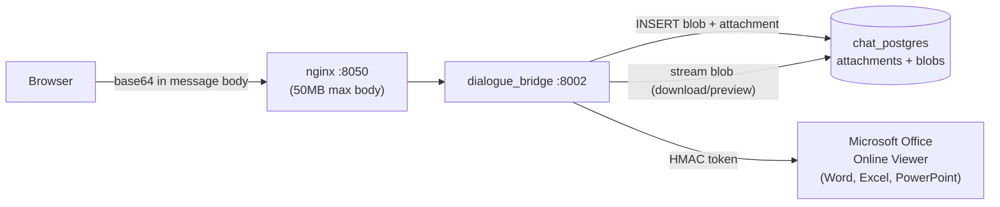
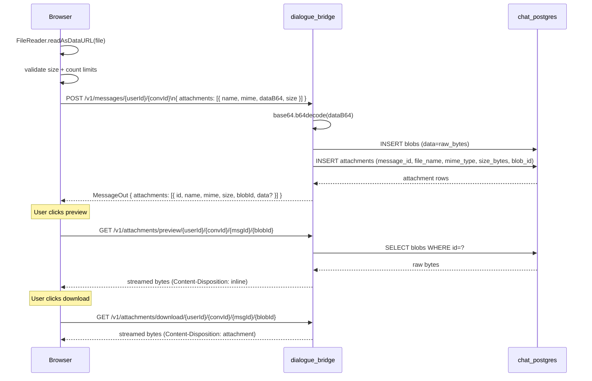
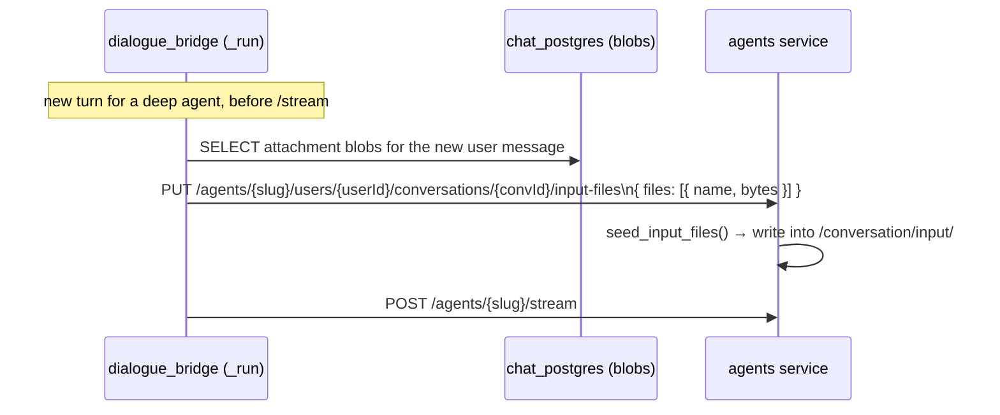
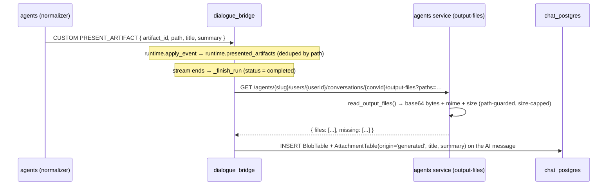

# Attachments

Attachments are binary files uploaded alongside chat messages. They are stored as raw bytes directly in PostgreSQL (not on disk or in object storage), with each attachment owning exactly one blob row containing its data. The upload path encodes files as base64 in the HTTP request body; the backend decodes and persists them. Download streams the blob back in 512KB chunks with HTTP byte-range support. Preview is handled client-side for most types (PDF, code, text). Word documents (`.docx`), Excel workbooks (`.xlsx`/`.xlsm`), and PowerPoint decks (`.ppt`/`.pptx`) all use Microsoft's free Office Online Viewer via a short-lived HMAC-signed token. Attachments are not indexed for RAG retrieval — they are chat artifacts only.

---

## Services Involved



---

## Full Sequence — Upload, Render, Download



---

## Phase 1 — Database Tables

Attachments and blobs are separate tables with a strict one-to-one relationship. The split exists so attachment metadata can be queried without loading large binary payloads.

### attachments

| Column | Type | Constraints | Description |
| --- | --- | --- | --- |
| `id` | String (UUID) | PK | Row identifier |
| `message_id` | String (FK) | → `messages.id` CASCADE; INDEXED | Owning message |
| `file_name` | String | NOT NULL | User-facing filename |
| `mime_type` | String | NOT NULL | Content-Type string |
| `size_bytes` | Integer | Nullable | File size; computed from blob if null |
| `blob_id` | String (FK) | → `blobs.id` CASCADE; INDEXED | Reference to binary data |
| `created_at` | DateTime | `now()`; INDEXED | — |
| `updated_at` | DateTime | `now()` | — |

### blobs

| Column | Type | Constraints | Description |
| --- | --- | --- | --- |
| `id` | String (UUID) | PK | Row identifier |
| `data` | LargeBinary | NOT NULL | Raw binary file content |
| `created_at` | DateTime | `now()` | — |

**Cascade chain:** deleting a message cascades to its attachments; deleting an attachment cascades (via ORM `delete-orphan`) to its blob. Deleting a conversation cascades through messages → attachments → blobs. No orphaned blobs are possible through normal API usage.

**No deduplication:** every upload creates a new blob row, even if the binary content is identical to an existing one. Content hashing is not performed.

---

## Phase 2 — Upload Flow

Files never hit a file system. The entire path is in-memory: browser → base64 string in JSON → decoded bytes → database.

### Client-Side Validation

`uploadGuards.ts` enforces limits before any network call:

| Limit | Value | Note |
| --- | --- | --- |
| Per-file size | 25 MB | Raw bytes |
| Total per message | 25 MB | Raw bytes across all files |
| Max files per message | 10 | Hard limit |
| Max pending (before send) | 5 | UX limit, not enforced server-side |
| Proxy body limit | ~50 MB | After base64 inflation (~33% overhead); nginx `client_max_body_size 50m` |

If any limit is breached, the send is blocked with a toast and no request is made.

### Encoding

```typescript
// handlers/attachments.ts
const reader = new FileReader();
reader.readAsDataURL(file);  // produces "data:mime/type;base64,<payload>"
const dataB64 = result.split(",")[1];  // strip the data URL prefix
```

The base64 payload is sent as part of the standard message creation request body — there is no separate upload endpoint.

### Server-Side Persistence

```python
# utils/conversations.py — init_attachments()
for item in items:
    raw = base64.b64decode(item.dataB64, validate=True)
    blob = BlobTable(data=raw)
    attach = AttachmentTable(
        message_id=message_id,
        file_name=item.name,
        mime_type=item.mime,
        size_bytes=item.size or len(raw),
        blob=blob,
    )
    db.add(attach)
# flushed atomically with the parent message INSERT
```

The `validate=True` flag on `b64decode` causes an immediate error on malformed input rather than silent truncation.

---

## Phase 3 — Download and Preview Endpoints

The session-authenticated endpoints validate the requesting user via the `validate_userId` dependency. Access is limited to the conversation owner.

### `GET /v1/attachments/download/{userId}/{convId}/{msgId}/{blobId}`

Streams the blob with `Content-Disposition: attachment`. Supports the HTTP `Range` header for partial content (206 responses), enabling resume-capable downloads and media seeking. Data is streamed in 512KB chunks to avoid loading large blobs entirely into memory.

### `GET /v1/attachments/preview/{userId}/{convId}/{msgId}/{blobId}`

Same as download but `Content-Disposition: inline`. Used for in-browser rendering (PDF viewer, `<iframe>`, ``).

### `GET /v1/attachments/preview-token/{userId}/{convId}/{msgId}/{blobId}`

Issues a short-lived (60-second) HMAC-SHA256 signed token bound to a specific `blobId` **and its MIME type**. The token is URL-safe base64 and encodes the blob ID, MIME type, expiry timestamp, and signature. A token is issued **only for Office documents** — resolved by file extension (`docx`, `xlsx`, `xlsm`, `ppt`, `pptx`), falling back to a stored MIME that is already canonical; any other type returns `415`. (Extension-first because browsers frequently report a non-canonical upload MIME — `octet-stream`/`x-zip` — for OOXML files.) Used by the frontend to construct a Microsoft Office Online Viewer URL for Word, Excel, and PowerPoint previews.

### `GET /v1/attachments/public/{token}`

No session authentication required — token validation only. Validates the HMAC token, looks up the blob by the embedded `blobId`, and returns the bytes **under the MIME bound into the token** (re-checked against the Office allowlist), never the stored MIME. This endpoint is intentionally public so that Microsoft's viewer servers can fetch the document from outside the user's session. Responses carry `Cache-Control: no-store`, `X-Content-Type-Options: nosniff`, and a locked-down `Content-Security-Policy` (`default-src 'none'; sandbox;`) so a blob can never render as executable HTML on the app origin.

| Property | Value |
| --- | --- |
| Token TTL | 60 seconds |
| Signature | HMAC-SHA256 using `SESSION_TOKEN_SECRET` |
| MIME allowlist | Token issued only for Office documents — resolved by extension (`docx`/`xlsx`/`xlsm`/`ppt`/`pptx`) or a canonical stored MIME, else `415`; the canonical MIME is signed into the token and re-checked on serve |
| Response hardening | `X-Content-Type-Options: nosniff` + `Content-Security-Policy: default-src 'none'; sandbox;` — blob can't render as HTML on the app origin |
| No-session scope | Token validates ownership transitively — only tokens issued for blobs the user owns can be generated |

### `GET /v1/attachments/images/{userId}`

Returns a paginated list of all image attachments for a user across all conversations. Each item includes `dataB64` (base64-encoded image data) for inline embedding. Used by the image gallery feature in the UI.

---

## Phase 4 — Client-Side Preview

The frontend classifies each attachment by MIME type and file extension, then routes it to the appropriate renderer. All Microsoft Office formats (Word, Excel, PowerPoint) use the same short-lived token + Office Online Viewer pipeline.

### Preview Registry

`attachment_preview/registry.ts` maps MIME types and extensions to preview kinds:

| File Type | Extensions | Preview Kind | Size Limit | Renderer |
| --- | --- | --- | --- | --- |
| PDF | `.pdf` | `pdf` | — | `<iframe>` or PDF.js |
| Word | `.docx` | `docx` | 25 MB | `/preview-token` → Microsoft Office Online Viewer `<iframe>` |
| Excel | `.xlsx`, `.xlsm` | `xlsx` | 25 MB | `/preview-token` → Microsoft Office Online Viewer `<iframe>` |
| PowerPoint | `.ppt`, `.pptx` | `pptx` | 25 MB | `/preview-token` → Microsoft Office Online Viewer `<iframe>` |
| Markdown | `.md`, `.mdx` | `markdown` | 5 MB | React Markdown renderer |
| JSON | `.json` | `json` | 5 MB | Code block with syntax highlight |
| CSV | `.csv` | `csv` | 5 MB | Table renderer (PapaParse) |
| Code | `.py`, `.ts`, `.js`, `.java`, … | `code` | 5 MB | Prism.js / highlight.js |
| Plain text | `.txt`, `.log` | `text` | 5 MB | Pre-formatted text area |
| Images | `image/*` | (inline in chat) | — | `` with `data:` URL |

Files that don't match any known type are shown as an unsupported preview with a download-only option.

### Render Flow

1. `AttachmentPreviewPanel.tsx` opens when a user clicks a non-image attachment
2. Registry determines `previewKind` and size limit
3. If file exceeds the size limit for its kind, shows "File too large to preview" with a download button
4. For text kinds: `fetchAttachmentPreviewBlob()` fetches the blob, decodes as UTF-8, passes to the appropriate renderer
5. For PDF: `fetchAttachmentPreviewBlob()` fetches the bytes, then renders them as an object URL whose MIME is **forced** to `application/pdf` (`URL.createObjectURL(new Blob([bytes], { type: "application/pdf" }))`) used as the `<iframe src>`. Forcing the type guarantees the iframe renders through the browser's PDF viewer and can never execute a blob whose stored bytes are HTML/SVG — a same-origin stored-XSS guard.
6. For Word / Excel / PowerPoint (`.docx`, `.xlsx`/`.xlsm`, `.ppt`/`.pptx`): calls `fetchDocxPreviewToken()` → `/preview-token/...` to get a 60-second signed token, constructs a `/api/v1/attachments/public/{token}` URL, then embeds it in `https://view.officeapps.live.com/op/embed.aspx?src=...` as an `<iframe>`

`PreviewChrome.tsx` wraps every renderer with consistent controls: close button, download button, and filename display.

---

## Phase 5 — Attachment Lifecycle

### Binding to Messages

Attachments belong to messages, not conversations. The FK chain is:

```text
conversation → messages → attachments → blobs
```

Each FK uses `CASCADE DELETE`, so the chain unwinds automatically when any ancestor is removed. There are no orphan records possible through normal API operations.

### On Message Edit or Retry

Edit and retry create a new sibling message row (new UUID) rather than updating the original. Attachments from the original message are not copied to the new sibling — the user must re-attach files when editing a message with attachments.

### On Conversation Fork

`clone_branch_to_conversation()` deep-copies all blob data — blobs are not shared between the source and forked conversation. Each fork independently owns complete copies of all attachment data.

```python
# utils/conversations.py
cloned_blob = BlobTable(data=source_blob.data)  # full byte copy
cloned_attachment = AttachmentTable(
    message_id=cloned_message.id,  # new UUID
    file_name=source_attachment.file_name,
    mime_type=source_attachment.mime_type,
    size_bytes=source_attachment.size_bytes,
    blob=cloned_blob,
)
```

Storage implication: forking a conversation doubles the blob storage for every attachment in the forked branch.

### In Conversation Shares

When a share snapshot is built, every attachment's blob is base64-encoded and embedded directly in `snapshot_json`:

```python
"data": b64_encode(attachment.blob.data)
```

The share is fully self-contained — the blob rows are not referenced by the share. If the original blobs are later deleted (via conversation deletion), the share snapshot still carries the embedded data.

When a recipient forks from a share (`/continue`), the base64 data is decoded and written into fresh blob rows owned by the new conversation.

---

## Phase 6 — RAG and Attachments

Attachments are **not indexed for retrieval**. Uploading a PDF or Excel file does not add its content to ChromaDB or make it queryable via the RAG endpoints. The `rag_service` has no knowledge of the `attachments` or `blobs` tables.

The RAG system operates on two separate data sources:

- ChromaDB collections populated out-of-band (not from user uploads)
- Excel workbooks loaded from the `rag_service/data/` directory at startup

Attachments still reach **deep agents** out-of-band of RAG — as files on the agent's conversation filesystem and (for images) inline base64 in the message — never through ChromaDB. See Phase 7 below. Automatic file-to-text extraction / chunking into the vector store is not performed.

---

## Phase 7 — Attachments and the Agent Filesystem

Beyond chat display, uploaded files are made available to **deep agents** at inference time. The chat_db blob is the durable system of record; the agent gets a disk-backed copy seeded onto its conversation filesystem for the turn. Uploads live **on disk, not in the LangGraph checkpoint** — the durable checkpoint stores graph state only, never blob bytes.

### Input / output filesystem split

The workspace builder (`runtime/filesystem/workspace.py`, `build_workspace_backend()` — `DeepAgent._build_composite_backend()` delegates to it) splits the per-conversation mount into two routes:

| Route | Mode | Contents |
| --- | --- | --- |
| `/conversation/input/` | read-only (write-denied via `FilesystemPermission`) | User-uploaded files seeded for this conversation |
| `/conversation/output/` | read-write | Agent-produced artifacts |

The write-deny on `input/` keeps the agent from clobbering the user's uploads; artifacts go to `output/`. Omni's system prompt (`deep_agents/omni_agent/system_prompts.py`) instructs the agent to write to `/conversation/output/`. `ensure_user_agent_filesystem()` mkdirs both `input/` and `output/`.

### Seeding flow (chat_db blob → bridge → agents input/)



- The bridge's `_run` seeds **only the new turn's attachments** (deep agents only) before streaming, via `build_agent_input_files_url()` (`utils/agents.py`) → `PUT .../input-files`. The agents endpoint calls `seed_input_files()` (`runtime/filesystem/provisioner.py`), which writes the bytes under `conversation_input_root()`.
- The serialiser `serialise_message_with_images_for_agent()` still **inlines images as base64** in the message content (vision on the upload turn). For deep agents it additionally references each **non-image** file by its `/conversation/input/<name>` path (flag `include_input_paths=True`) so the agent can open it with its filesystem tools.
- **LangGraph agents have no filesystem** — they are not seeded; they receive message content only (inline images, no input-path references).

### Generated deliverables (`present_artifact` → generated attachments)

Writing a file to `/conversation/output/` does **not** surface it to the user — that dir is the agent's private workspace and fills up with drafts, scratch notes, and sub-agent helper files. A deep agent promotes exactly one file into a user-facing deliverable by calling the built-in **`present_artifact(path, title, summary)`** tool. This is an explicit, intentional act — nothing in `output/` is captured unless presented — which is what keeps sub-agent noise out of the user's view.

The tool never emits an AG-UI event itself (deep agents don't stream the `custom` channel). It validates that `path` resolves under the output mount and the file exists, then returns a confirmation. The **normalizer** detects the `present_artifact` tool call by name and — **for the top-level orchestrator only** (a sub-agent's call is dropped; the orchestrator re-presents the final doc) — synthesizes a `PRESENT_ARTIFACT` custom event carrying display metadata (`title`, `summary`, `filename`, `mime`), but no bytes. See [agui-protocol.md](../development/agui-protocol.md).

At run finalize the bridge reads the presented files back and persists them as `attachments(origin='generated')` on the **assistant** message — so they flow through the exact same download / preview / Office-viewer machinery as uploads:



- **Capture is fail-open and completed-only.** `_capture_generated_artifacts()` runs inside `_finish_run` only for a `completed` run, in the same transaction as the finalize write. Any error (agent unreachable, file gone, bad base64) is logged and skipped — the assistant reply is already generated, so a capture failure never fails the run. `missing` paths (absent / oversized / off-mount) are skipped, not fatal.
- **The `PRESENT_ARTIFACT` event stays in `raw_events`** (unlike `CHECKPOINT_COMMITTED`, which is suppressed) so the UI can render a live artifact card during streaming (Phase 2 of the feature); the persisted `attachments(origin='generated')` are the durable, downloadable copy on the settled message.
- **Only deep agents produce generated artifacts** — the `present_artifact` tool is attached in `DeepAgent._builtin_tools()` (needs a `conversation_id`), and LangGraph agents have no filesystem.

### Cleanup

The conversation filesystem (`input/` + `output/`) is removed by `delete_conversation_files()` during the conversation-delete reap (see [conversation-management.md](conversation-management.md)). There is no per-turn cleanup; seeded input files accumulate for the life of the conversation.

---

## Sharp Edges and Behavioral Notes

- **Blobs live in PostgreSQL.** There is no filesystem or object storage. A very large attachment — or many forks of a conversation with large attachments — directly increases the database size. Monitor `pg_table_size('blobs')` in production.

- **No deduplication.** Uploading the same file twice creates two independent blob rows. Forking creates another copy. There is no content-hash check or blob-sharing mechanism.

- **Base64 inflates payload size by ~33%.** A 25 MB file becomes ~33 MB in the request body. nginx's `client_max_body_size 50m` gives room for up to ~37 MB raw files in a single message before the body limit is hit; the application-level 25 MB cap is the binding constraint.

- **No separate upload endpoint.** Attachments are always part of a message creation request. There is no pre-upload or chunked-upload flow. The entire file must be in memory as base64 before the request is sent.

- **Edit does not copy attachments.** If a user edits a message that had attachments, the new sibling message starts with no attachments. The user must re-attach any files they want in the edited version.

- **Office preview requires public-internet reachability.** Word/Excel/PowerPoint preview embeds `https://view.officeapps.live.com`, which fetches the document via `/api/v1/attachments/public/{token}`. Microsoft's servers must be able to reach the public endpoint — this works in production (behind Cloudflare/NPM) but **not in local dev** (`localhost:8050` is unreachable from the public internet). Locally, Office previews show an empty iframe; download still works.

- **Office preview token is single-use by intent, not by mechanism.** The 60-second TTL is the only expiry mechanism; the token is not revoked after first use. This window is sufficient for Microsoft's viewer to fetch the document during iframe load.

- **Images are returned with inline base64 on message fetch.** When the backend returns a `MessageOut`, image attachments include their `data` field pre-populated with base64. Non-image attachments have `data: null` — the client must call the download or preview endpoint to get the bytes.

- **Byte-range support is on download and preview, not images.** The `/download` and `/preview` endpoints support `Range` headers; the `/images` batch endpoint does not. Large images retrieved via the gallery are served in full.

- **Deletion is permanent and cascades immediately.** There is no soft-delete or recycle bin for attachments. Deleting a message or conversation immediately removes all associated attachments and blobs from the database with no recovery path. The disk-backed agent copies under `/conversation/input/` and `/conversation/output/` are not on the DB cascade — they are removed by the separate conversation-delete reap call to the agents service.

- **Seeded files are disk-backed, not checkpointed.** Uploads are written to the agent's `/conversation/input/` on disk and referenced by path; they are never serialized into the durable LangGraph checkpoint. A resumed run re-reads them from disk, so input files must remain present for the life of the conversation.

- **Only deep agents get filesystem seeding.** LangGraph agents have no `CompositeBackend` mount, so they never receive input-path references — they only see inline images and any text the message already carries.

---

## File Map

| Concept | File | What to look for |
| --- | --- | --- |
| DB tables | [src/dialogue_bridge/core/database/models.py](../../src/dialogue_bridge/core/database/models.py) | `AttachmentTable`, `BlobTable`, FK cascade definitions |
| Attachments router | [src/dialogue_bridge/router/attachments.py](../../src/dialogue_bridge/router/attachments.py) | download, preview, preview-token, public, images endpoints |
| Upload persistence | [src/dialogue_bridge/utils/conversations.py](../../src/dialogue_bridge/utils/conversations.py) | `init_attachments()`, `clone_branch_to_conversation()` |
| Agent filesystem seeding (bridge) | [src/dialogue_bridge/utils/agents.py](../../src/dialogue_bridge/utils/agents.py) | `build_agent_input_files_url()`, `serialise_message_with_images_for_agent(include_input_paths=...)` |
| Input/output backend split + permissions | [src/agents/runtime/filesystem/workspace.py](../../src/agents/runtime/filesystem/workspace.py) | `build_workspace_backend()` (mount routes), `WORKSPACE_WRITE_DENY` (`/conversation/input/` write-deny) — `DeepAgent._build_composite_backend()` delegates here |
| Filesystem provisioner | [src/agents/runtime/filesystem/provisioner.py](../../src/agents/runtime/filesystem/provisioner.py) | `seed_input_files()`, `delete_conversation_files()`, `conversation_input_root()`, `conversation_output_root()`, `ensure_user_agent_filesystem()` |
| Input-files seed endpoint | [src/agents/main.py](../../src/agents/main.py) | `PUT /agents/{slug}/users/{user_id}/conversations/{conversation_id}/input-files` |
| `present_artifact` tool | [src/agents/runtime/tools/present_artifact.py](../../src/agents/runtime/tools/present_artifact.py) | `build_present_artifact_tool()` — path-guarded, returns a confirmation (never emits); registered in `DeepAgent._builtin_tools()` |
| Output-files read endpoint + util | [src/agents/router/inference.py](../../src/agents/router/inference.py) | `GET …/output-files` → `runtime.filesystem.read_output_files()` / `resolve_output_file()` (path-guarded, size-capped) |
| Generated-artifact capture (bridge) | [src/dialogue_bridge/utils/inference_runs.py](../../src/dialogue_bridge/utils/inference_runs.py) | `InferenceRunRuntime.presented_artifacts`, `_fetch_output_files()`, `_capture_generated_artifacts()` (called in `_finish_run`), `build_agent_output_files_url()` |
| Generated-artifact rendering (frontend) | [src/agentic_ui/src/features/chat/components/message_parts/MessageAttachments.tsx](../../src/agentic_ui/src/features/chat/components/message_parts/MessageAttachments.tsx) | `origin === "generated"` branch — left-aligned card, Sparkles icon, agent title/summary |
| Share snapshot builder | [src/dialogue_bridge/utils/conversations.py](../../src/dialogue_bridge/utils/conversations.py) | `_attachment_to_share_snapshot()`, `build_share_snapshot()` |
| Pydantic schemas | [src/dialogue_bridge/schemas/\_\_init\_\_.py](../../src/dialogue_bridge/schemas/__init__.py) | `AttachmentIn`, `AttachmentOut`, `ImageOut`, `DocxPreviewTokenOut` |
| HMAC token helpers | [src/dialogue_bridge/utils/attachments.py](../../src/dialogue_bridge/utils/attachments.py) | `generate_docx_preview_token()`, `validate_docx_preview_token()` |
| Frontend API calls | [src/agentic_ui/src/lib/api.ts](../../src/agentic_ui/src/lib/api.ts) | `downloadAttachment()`, `fetchAttachmentBlob()`, `fetchAttachmentPreviewBlob()`, `getAttachmentPreviewUrl()`, `fetchDocxPreviewToken()` |
| Frontend types | [src/agentic_ui/src/lib/types.ts](../../src/agentic_ui/src/lib/types.ts) | `AttachmentIn`, `AttachmentOut` |
| Upload validation | [src/agentic_ui/src/lib/uploadGuards.ts](../../src/agentic_ui/src/lib/uploadGuards.ts) | size limits, count limits, base64 inflation check |
| Upload handlers | [src/agentic_ui/src/handlers/attachments.ts](../../src/agentic_ui/src/handlers/attachments.ts) | `handleFileUpload()`, `handlePaste()`, `fileToAttachmentIn()` |
| Preview registry | [src/agentic_ui/src/components/chat/attachment_preview/registry.ts](../../src/agentic_ui/src/components/chat/attachment_preview/registry.ts) | MIME → preview kind mapping, size limits per type |
| Preview panel | [src/agentic_ui/src/components/chat/AttachmentPreviewPanel.tsx](../../src/agentic_ui/src/components/chat/AttachmentPreviewPanel.tsx) | per-type renderer dispatch |
| Message attachment display | [src/agentic_ui/src/components/chat/message_parts/MessageAttachments.tsx](../../src/agentic_ui/src/components/chat/message_parts/MessageAttachments.tsx) | inline chat attachment UI, image lightbox |
