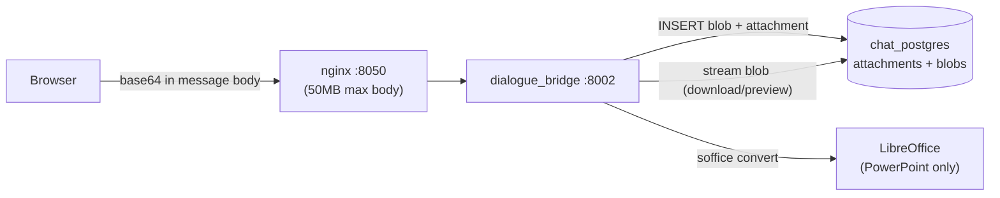
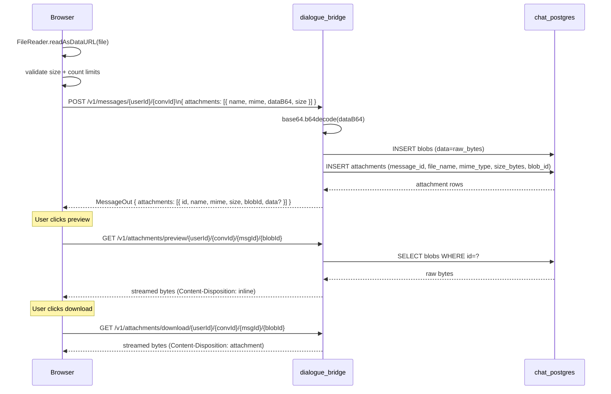

# Attachments

Attachments are binary files uploaded alongside chat messages. They are stored as raw bytes directly in PostgreSQL (not on disk or in object storage), with each attachment owning exactly one blob row containing its data. The upload path encodes files as base64 in the HTTP request body; the backend decodes and persists them. Download streams the blob back in 512KB chunks with HTTP byte-range support. Preview is handled client-side for most types (PDF, Office documents, code, text) with one server-side conversion path for PowerPoint files (LibreOffice → PDF). Attachments are not indexed for RAG retrieval — they are chat artifacts only.

---

## Services Involved



---

## Full Sequence — Upload, Render, Download



---

## Phase 1 — Database Tables

Attachments and blobs are separate tables with a strict one-to-one relationship. The split exists so attachment metadata can be queried without loading large binary payloads.

### attachments

| Column | Type | Constraints | Description |
| --- | --- | --- | --- |
| `id` | String (UUID) | PK | Row identifier |
| `message_id` | String (FK) | → `messages.id` CASCADE; INDEXED | Owning message |
| `file_name` | String | NOT NULL | User-facing filename |
| `mime_type` | String | NOT NULL | Content-Type string |
| `size_bytes` | Integer | Nullable | File size; computed from blob if null |
| `blob_id` | String (FK) | → `blobs.id` CASCADE; INDEXED | Reference to binary data |
| `created_at` | DateTime | `now()`; INDEXED | — |
| `updated_at` | DateTime | `now()` | — |

### blobs

| Column | Type | Constraints | Description |
| --- | --- | --- | --- |
| `id` | String (UUID) | PK | Row identifier |
| `data` | LargeBinary | NOT NULL | Raw binary file content |
| `created_at` | DateTime | `now()` | — |

**Cascade chain:** deleting a message cascades to its attachments; deleting an attachment cascades (via ORM `delete-orphan`) to its blob. Deleting a conversation cascades through messages → attachments → blobs. No orphaned blobs are possible through normal API usage.

**No deduplication:** every upload creates a new blob row, even if the binary content is identical to an existing one. Content hashing is not performed.

---

## Phase 2 — Upload Flow

Files never hit a file system. The entire path is in-memory: browser → base64 string in JSON → decoded bytes → database.

### Client-Side Validation

`uploadGuards.ts` enforces limits before any network call:

| Limit | Value | Note |
| --- | --- | --- |
| Per-file size | 25 MB | Raw bytes |
| Total per message | 25 MB | Raw bytes across all files |
| Max files per message | 10 | Hard limit |
| Max pending (before send) | 5 | UX limit, not enforced server-side |
| Proxy body limit | ~50 MB | After base64 inflation (~33% overhead); nginx `client_max_body_size 50m` |

If any limit is breached, the send is blocked with a toast and no request is made.

### Encoding

```typescript
// handlers/attachments.ts
const reader = new FileReader();
reader.readAsDataURL(file);  // produces "data:mime/type;base64,<payload>"
const dataB64 = result.split(",")[1];  // strip the data URL prefix
```

The base64 payload is sent as part of the standard message creation request body — there is no separate upload endpoint.

### Server-Side Persistence

```python
# utils/conversations.py — init_attachments()
for item in items:
    raw = base64.b64decode(item.dataB64, validate=True)
    blob = BlobTable(data=raw)
    attach = AttachmentTable(
        message_id=message_id,
        file_name=item.name,
        mime_type=item.mime,
        size_bytes=item.size or len(raw),
        blob=blob,
    )
    db.add(attach)
# flushed atomically with the parent message INSERT
```

The `validate=True` flag on `b64decode` causes an immediate error on malformed input rather than silent truncation.

---

## Phase 3 — Download and Preview Endpoints

All four endpoints validate the requesting user via the `validate_userId` dependency. Access is limited to the conversation owner.

### `GET /v1/attachments/download/{userId}/{convId}/{msgId}/{blobId}`

Streams the blob with `Content-Disposition: attachment`. Supports the HTTP `Range` header for partial content (206 responses), enabling resume-capable downloads and media seeking. Data is streamed in 512KB chunks to avoid loading large blobs entirely into memory.

### `GET /v1/attachments/preview/{userId}/{convId}/{msgId}/{blobId}`

Same as download but `Content-Disposition: inline`. Used for in-browser rendering (PDF viewer, `<iframe>`, ``).

### `GET /v1/attachments/preview-derived/{userId}/{convId}/{msgId}/{blobId}`

**PowerPoint only.** Converts the blob to PDF using LibreOffice in headless mode (`soffice --headless --convert-to pdf`), then streams the result inline. Conversion limits:

| Limit | Value |
| --- | --- |
| Max input size | 25 MB |
| Conversion timeout | 45 seconds |
| Cache-Control | `private, max-age=300` (5 min browser cache) |

Returns 400 if the MIME type is not a presentation type, 422 on timeout or conversion failure, 500 if LibreOffice is not installed.

### `GET /v1/attachments/images/{userId}`

Returns a paginated list of all image attachments for a user across all conversations. Each item includes `dataB64` (base64-encoded image data) for inline embedding. Used by the image gallery feature in the UI.

---

## Phase 4 — Client-Side Preview

The frontend classifies each attachment by MIME type and file extension, then routes it to the appropriate renderer. No server processing is involved except for PowerPoint files.

### Preview Registry

`attachment_preview/registry.ts` maps MIME types and extensions to preview kinds:

| File Type | Extensions | Preview Kind | Size Limit | Renderer |
| --- | --- | --- | --- | --- |
| PDF | `.pdf` | `pdf` | — | `<iframe>` or PDF.js |
| Word | `.docx` | `docx` | 25 MB | mammoth.js |
| Excel | `.xlsx`, `.xlsm` | `xlsx` | 25 MB | SheetJS |
| PowerPoint | `.ppt`, `.pptx` | `presentation` | 25 MB | `/preview-derived` → PDF.js |
| Markdown | `.md`, `.mdx` | `markdown` | 5 MB | React Markdown renderer |
| JSON | `.json` | `json` | 5 MB | Code block with syntax highlight |
| CSV | `.csv` | `csv` | 5 MB | Table renderer (PapaParse) |
| Code | `.py`, `.ts`, `.js`, `.java`, … | `code` | 5 MB | Prism.js / highlight.js |
| Plain text | `.txt`, `.log` | `text` | 5 MB | Pre-formatted text area |
| Images | `image/*` | (inline in chat) | — | `` with `data:` URL |

Files that don't match any known type are shown as an unsupported preview with a download-only option.

### Render Flow

1. `AttachmentPreviewPanel.tsx` opens when a user clicks a non-image attachment
2. Registry determines `previewKind` and size limit
3. If file exceeds the size limit for its kind, shows "File too large to preview" with a download button
4. For text kinds: `fetchAttachmentPreviewBlob()` fetches the blob, decodes as UTF-8, passes to the appropriate renderer
5. For Office kinds: fetches blob, passes binary data to the client library
6. For PDF: uses the preview URL as `<iframe src={...}>` — no separate fetch needed
7. For PowerPoint: calls `getAttachmentDerivedPreviewUrl()` which points to `/preview-derived`; the result (PDF) is rendered as a PDF

`PreviewChrome.tsx` wraps every renderer with consistent controls: close button, download button, and filename display.

---

## Phase 5 — Attachment Lifecycle

### Binding to Messages

Attachments belong to messages, not conversations. The FK chain is:

```
conversation → messages → attachments → blobs
```

Each FK uses `CASCADE DELETE`, so the chain unwinds automatically when any ancestor is removed. There are no orphan records possible through normal API operations.

### On Message Edit or Retry

Edit and retry create a new sibling message row (new UUID) rather than updating the original. Attachments from the original message are not copied to the new sibling — the user must re-attach files when editing a message with attachments.

### On Conversation Fork

`clone_branch_to_conversation()` deep-copies all blob data — blobs are not shared between the source and forked conversation. Each fork independently owns complete copies of all attachment data.

```python
# utils/conversations.py
cloned_blob = BlobTable(data=source_blob.data)  # full byte copy
cloned_attachment = AttachmentTable(
    message_id=cloned_message.id,  # new UUID
    file_name=source_attachment.file_name,
    mime_type=source_attachment.mime_type,
    size_bytes=source_attachment.size_bytes,
    blob=cloned_blob,
)
```

Storage implication: forking a conversation doubles the blob storage for every attachment in the forked branch.

### In Conversation Shares

When a share snapshot is built, every attachment's blob is base64-encoded and embedded directly in `snapshot_json`:

```python
"data": b64_encode(attachment.blob.data)
```

The share is fully self-contained — the blob rows are not referenced by the share. If the original blobs are later deleted (via conversation deletion), the share snapshot still carries the embedded data.

When a recipient forks from a share (`/continue`), the base64 data is decoded and written into fresh blob rows owned by the new conversation.

---

## Phase 6 — RAG and Attachments

Attachments are **not indexed for retrieval**. Uploading a PDF or Excel file does not add its content to ChromaDB or make it queryable via the RAG endpoints. The `rag_service` has no knowledge of the `attachments` or `blobs` tables.

The RAG system operates on two separate data sources:
- ChromaDB collections populated out-of-band (not from user uploads)
- Excel workbooks loaded from the `rag_service/data/` directory at startup

If an agent needs to reason about the content of an uploaded file, that content must be passed as text in the message body. File-to-text extraction is not automated.

---

## Sharp Edges and Behavioral Notes

- **Blobs live in PostgreSQL.** There is no filesystem or object storage. A very large attachment — or many forks of a conversation with large attachments — directly increases the database size. Monitor `pg_table_size('blobs')` in production.

- **No deduplication.** Uploading the same file twice creates two independent blob rows. Forking creates another copy. There is no content-hash check or blob-sharing mechanism.

- **Base64 inflates payload size by ~33%.** A 25 MB file becomes ~33 MB in the request body. nginx's `client_max_body_size 50m` gives room for up to ~37 MB raw files in a single message before the body limit is hit; the application-level 25 MB cap is the binding constraint.

- **No separate upload endpoint.** Attachments are always part of a message creation request. There is no pre-upload or chunked-upload flow. The entire file must be in memory as base64 before the request is sent.

- **Edit does not copy attachments.** If a user edits a message that had attachments, the new sibling message starts with no attachments. The user must re-attach any files they want in the edited version.

- **PowerPoint preview requires LibreOffice.** If `soffice` is not in the container's PATH, the `/preview-derived` endpoint returns 500. The Docker image must include LibreOffice for this endpoint to work.

- **Images are returned with inline base64 on message fetch.** When the backend returns a `MessageOut`, image attachments include their `data` field pre-populated with base64. Non-image attachments have `data: null` — the client must call the download or preview endpoint to get the bytes.

- **Byte-range support is on download and preview, not images.** The `/download` and `/preview` endpoints support `Range` headers; the `/images` batch endpoint does not. Large images retrieved via the gallery are served in full.

- **Deletion is permanent and cascades immediately.** There is no soft-delete or recycle bin for attachments. Deleting a message or conversation immediately removes all associated attachments and blobs from the database with no recovery path.

---

## File Map

| Concept | File | What to look for |
| --- | --- | --- |
| DB tables | [src/dialogue_bridge/core/database.py](../../src/dialogue_bridge/core/database.py) | `AttachmentTable`, `BlobTable`, FK cascade definitions |
| Attachments router | [src/dialogue_bridge/router/attachments.py](../../src/dialogue_bridge/router/attachments.py) | download, preview, preview-derived, images endpoints |
| Upload persistence | [src/dialogue_bridge/utils/conversations.py](../../src/dialogue_bridge/utils/conversations.py) | `init_attachments()`, `clone_branch_to_conversation()` |
| Share snapshot builder | [src/dialogue_bridge/utils/conversations.py](../../src/dialogue_bridge/utils/conversations.py) | `_attachment_to_share_snapshot()`, `build_share_snapshot()` |
| Pydantic schemas | [src/dialogue_bridge/schemas/\_\_init\_\_.py](../../src/dialogue_bridge/schemas/__init__.py) | `AttachmentIn`, `AttachmentOut`, `ImageOut` |
| Frontend API calls | [src/agentic_ui/src/lib/api.ts](../../src/agentic_ui/src/lib/api.ts) | `downloadAttachment()`, `fetchAttachmentBlob()`, `fetchAttachmentPreviewBlob()`, `getAttachmentPreviewUrl()` |
| Frontend types | [src/agentic_ui/src/lib/types.ts](../../src/agentic_ui/src/lib/types.ts) | `AttachmentIn`, `AttachmentOut` |
| Upload validation | [src/agentic_ui/src/lib/uploadGuards.ts](../../src/agentic_ui/src/lib/uploadGuards.ts) | size limits, count limits, base64 inflation check |
| Upload handlers | [src/agentic_ui/src/handlers/attachments.ts](../../src/agentic_ui/src/handlers/attachments.ts) | `handleFileUpload()`, `handlePaste()`, `fileToAttachmentIn()` |
| Preview registry | [src/agentic_ui/src/components/chat/attachment_preview/registry.ts](../../src/agentic_ui/src/components/chat/attachment_preview/registry.ts) | MIME → preview kind mapping, size limits per type |
| Preview panel | [src/agentic_ui/src/components/chat/AttachmentPreviewPanel.tsx](../../src/agentic_ui/src/components/chat/AttachmentPreviewPanel.tsx) | per-type renderer dispatch |
| Message attachment display | [src/agentic_ui/src/components/chat/message_parts/MessageAttachments.tsx](../../src/agentic_ui/src/components/chat/message_parts/MessageAttachments.tsx) | inline chat attachment UI, image lightbox |
