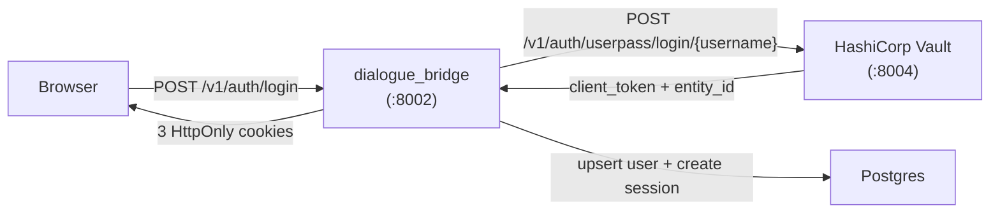
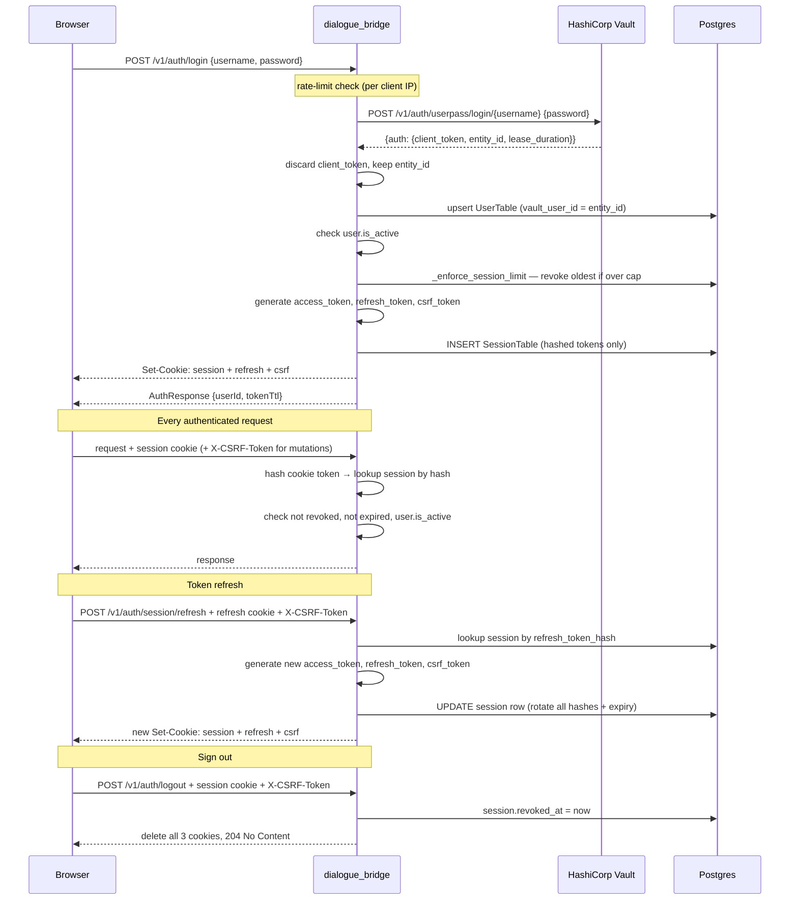
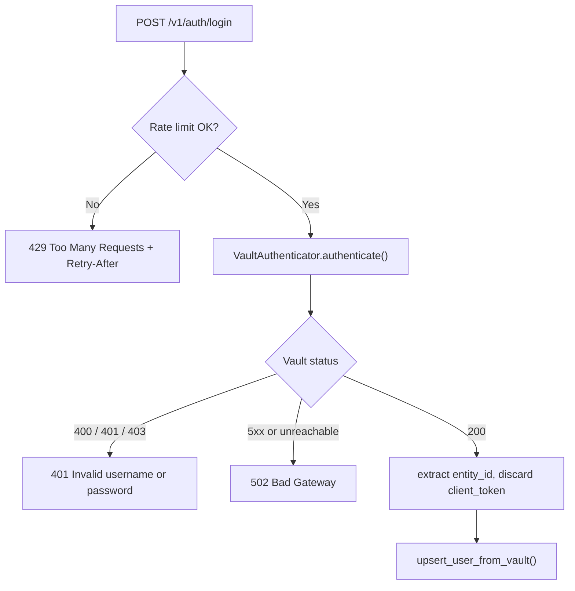
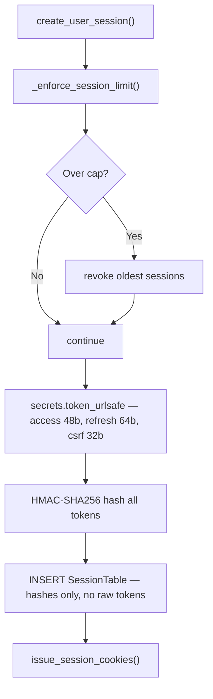
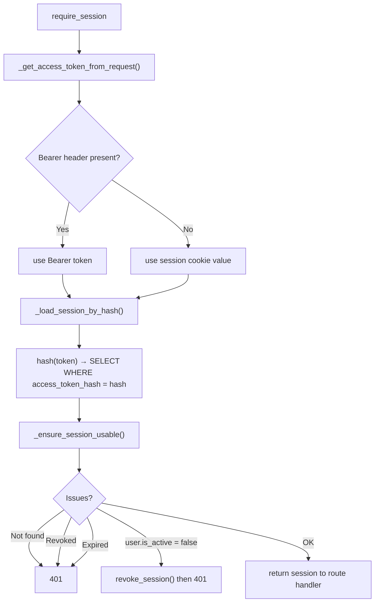
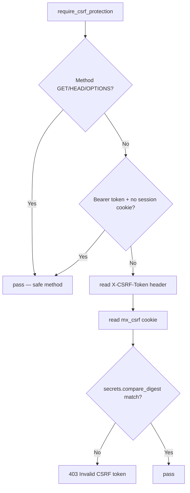
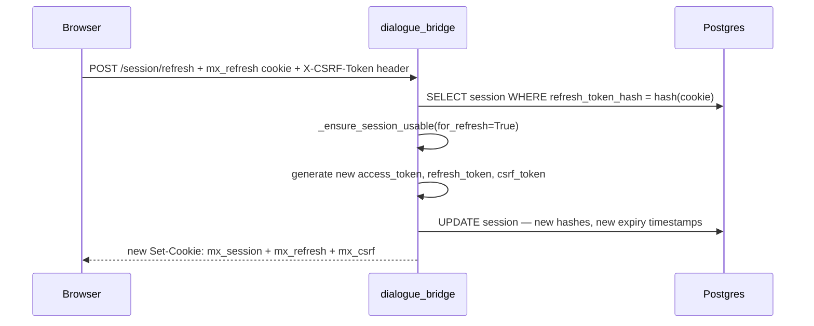
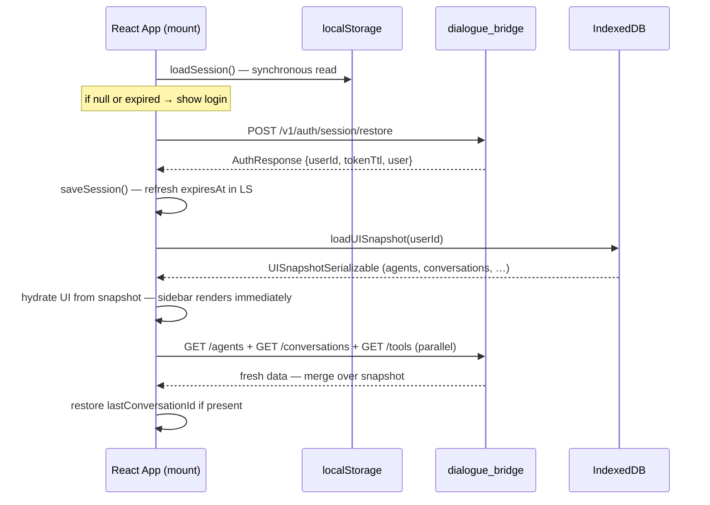
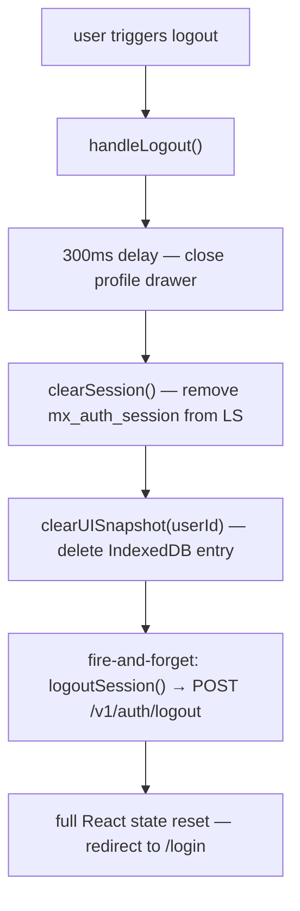

# Authentication Flow

The platform uses HashiCorp Vault as the identity authority and the dialogue bridge as the session authority. Vault validates credentials and returns a stable entity identity; the bridge then issues its own application session — three HttpOnly cookies — and never touches Vault again for the lifetime of that session. The raw tokens are never stored anywhere; the database holds only HMAC-SHA256 hashes, so a full database dump cannot be used to forge sessions.

---

## Services Involved



---

## Full Sequence



---

## Phase 1 — Vault Credential Validation

The browser sends `POST /v1/auth/login` with `{username, password}`. The endpoint is rate-limited per client IP using SlowAPI — the limit and window are configured via `AUTH_RATE_LIMIT_MAX_ATTEMPTS` and `AUTH_RATE_LIMIT_WINDOW_SECONDS`. A `429` response includes a `Retry-After` header the UI uses to show a countdown.

`VaultAuthenticator.authenticate()` issues a single HTTP call to Vault's userpass backend:

```http
POST {VAULT_URL}/v1/auth/{userpass_mount}/login/{username}
Body: {"password": "..."}
```

Vault returns an `auth` block containing a `client_token` and an `entity_id`. The bridge extracts only the `entity_id` (a stable UUID that Vault assigns to the identity regardless of credential changes) and immediately discards the `client_token`. The Vault token is never stored. The bridge does not keep a Vault session open after login.



| Vault response field | How the bridge uses it |
| --- | --- |
| `auth.entity_id` | Stored as `user.vault_user_id` — stable user key across password changes |
| `auth.client_token` | Discarded immediately after login |
| `auth.lease_duration` | Ignored — bridge manages its own TTLs |

---

## Phase 2 — Local User Upsert

After Vault confirms the identity, the bridge runs `upsert_user_from_vault()`. It looks up the user by `vault_user_id` (the Vault `entity_id`). If no row exists this is the user's first login and a new `UserTable` row is created. On subsequent logins the username and any available profile fields (email, display_name, department, role_title) are refreshed from the Vault metadata.

The bridge then checks `user.is_active`. If a user has been disabled locally the login is rejected with `403` even after Vault accepted the credentials — the bridge is the access authority for the application layer.

`user.last_login_at` is updated on every successful login and committed before the session is created.

---

## Phase 3 — Session Creation and Cookie Issuance

`create_user_session()` handles session lifecycle before issuing tokens.

**Session cap enforcement** — `_enforce_session_limit()` counts all non-revoked, non-expired sessions for the user (ordered by `created_at` ascending). If the count would exceed `SESSION_MAX_PER_USER` (default: `3`) after adding the new session, the oldest sessions are revoked silently to stay within the cap. This means signing in on a fourth device quietly expires the oldest session, signing that device out.

**Token generation** — three separate secrets are generated using `secrets.token_urlsafe`:

| Token | Length | Purpose |
| --- | --- | --- |
| `access_token` | 48 bytes (64-char URL-safe) | Identifies the session on each request |
| `refresh_token` | 64 bytes (86-char URL-safe) | Used only to rotate the session |
| `csrf_token` | 32 bytes (43-char URL-safe) | Included in non-safe requests to prove browser origin |

**Hash storage** — all three tokens are HMAC-SHA256 hashed with a server-side secret (`TOKEN_SECRET`) before being written to the database. The raw tokens exist only in the `Set-Cookie` headers sent to the browser. A database compromise cannot be used to forge sessions.

The metadata `user_agent_hash` and `ip_hash` are also HMAC-hashed and stored for auditing without persisting raw fingerprint data.



**Cookie issuance** — `issue_session_cookies()` sets three cookies:

| Cookie | HttpOnly | JS-readable | Expiry | Purpose |
| --- | --- | --- | --- | --- |
| `mx_session` (or `__Host-mx_session`) | Yes | No | `ACCESS_TTL_SECONDS` (default: 900s / 15 min) | Access token |
| `mx_refresh` (or `__Host-mx_refresh`) | Yes | No | `REFRESH_TTL_SECONDS` (default: 604800s / 7 days) | Refresh token |
| `mx_csrf` (or `__Host-mx_csrf`) | **No** | **Yes** | `REFRESH_TTL_SECONDS` | CSRF value for double-submit |

The CSRF cookie is intentionally **not** HttpOnly. JavaScript reads it and copies its value into the `X-CSRF-Token` request header on every mutation. An attacker's page cannot read a cookie it did not set, so it cannot forge the header — this is the double-submit pattern.

When `SESSION_COOKIE_SECURE=true` and no `SESSION_COOKIE_DOMAIN` is configured, cookie names get the `__Host-` prefix. `__Host-` cookies must be `Secure`, must have no `Domain` attribute, and must have `Path=/`. This prevents subdomain-based cookie injection attacks entirely.

---

## Phase 4 — Per-Request Session Validation

Every protected endpoint depends on `require_session`. The dependency chain is:



The token is hashed on every request before querying — the database index is on the hash column, so lookups are O(log n) without storing the raw credential. Bearer token support exists for API clients that cannot set cookies; when a Bearer token is present and no session cookie is set, the request is also exempt from CSRF checks (programmatic clients are not vulnerable to browser-based CSRF).

User-scoped endpoints additionally call `require_bound_user_id` which checks that the `user_id` path parameter matches `current_user.id`. This prevents one authenticated user from accessing another user's resources using a valid but differently-scoped token.

---

## Phase 5 — CSRF Protection

`require_csrf_protection` is applied as a FastAPI dependency on all state-mutating endpoints (POST, PATCH, DELETE).



`secrets.compare_digest` performs a constant-time comparison, preventing timing attacks. The check is skipped for Bearer-only clients because they cannot be targeted by cross-site form submissions — the browser will not automatically attach an Authorization header to a cross-origin request.

---

## Phase 6 — Token Refresh

Access tokens expire after 15 minutes by default. The browser calls `POST /v1/auth/session/refresh` using the refresh cookie (7-day TTL). This endpoint is CSRF-protected.

`rotate_user_session()` updates the **same session row** — it does not create a new one. All three token hashes are replaced, and both expiry timestamps are extended from the current time. This means a session that is actively refreshed stays alive indefinitely; a session that goes unused for 7 days expires naturally.



---

## Phase 7 — Sign Out

`POST /v1/auth/logout` is CSRF-protected and tries both the access and refresh cookies — whichever is present. `revoke_session()` sets `session.revoked_at = utcnow()`. The row is not deleted; revoked rows remain in the database for audit trail purposes.

`clear_session_cookies()` calls `delete_cookie()` for all three cookie names. If no valid session is found (e.g. already expired), the cookies are still cleared — logout always succeeds from the browser's perspective.

---

## Phase 8 — Client-Side Storage and Page Load Hydration

The browser maintains two parallel stores that let the UI rehydrate instantly on page load without waiting for a network round-trip. Neither store holds any credential material — tokens live exclusively in the three HttpOnly cookies that the browser attaches automatically.

### localStorage — `mx_auth_session`

`saveSession()` writes a single JSON key (`mx_auth_session`) to `localStorage` immediately after a successful login or token refresh. The value is the `StoredSession` shape:

| Field | Type | Source | Purpose |
| --- | --- | --- | --- |
| `userId` | `string` | `AuthResponse.userId` | Primary key for IndexedDB lookup |
| `expiresAt` | `number` (epoch ms) | `Date.now() + tokenTtl * 1000` | Drives the auto-refresh timer |
| `user` | `{ id, name, email, createdAt, lastLoginAt }` | `AuthResponse` | Profile display without a network call |
| `lastConversationId` | `string \| null` | Updated on navigation | Deep-link target on next page load |
| `selectedAgent` | `string \| null` | Updated on agent change | Restores last-used agent |
| `isPrivateMode` | `boolean` | Updated on toggle | Restores privacy preference |

`loadSession()` reads the key synchronously and returns `null` if the key is absent or the stored `expiresAt` is already in the past. `clearSession()` removes the key. `updateSession()` does a read-merge-write cycle to update a subset of fields without overwriting the rest.

**What is not stored here:** access tokens, refresh tokens, CSRF tokens — those are HttpOnly cookies and never accessible to JavaScript.

### IndexedDB — `mx_ui_state`

For state too large or too structured for `localStorage`, the UI uses an IndexedDB database (`mx_ui_state`, version 2) with a single `state` object store keyed by `userId`. The value is a `UISnapshotSerializable`:

| Field | Purpose |
| --- | --- |
| `agents` | List of `AgentSnapshot` objects — React icon components are stripped before storage and re-resolved after load |
| `conversations` | Serialized conversation list for instant sidebar render |
| `availableTools` | Tool definitions the agent runtime reported |
| `userPreferences` | User-level settings (e.g. default model) |
| `sidebarOpen`, `isVoiceMode`, `isPrivateMode` | UI toggle state |

`selectedImage` is explicitly excluded from the snapshot — in-flight image attachments are not persisted.

`AgentSnapshot` serialization strips React icon components (which are not JSON-safe) and stores only the icon key; `deserializeAgents()` re-resolves the key to the live icon component after load.

`saveUISnapshot()` and `loadUISnapshot()` are async and operate on the IndexedDB connection pool managed by `getDB()`. `clearUISnapshot()` deletes the entry by `userId`.

### Page Load Hydration Sequence



1. **Synchronous localStorage read** (`useInitialSessionState`) — runs before the first render. If no session is found the app goes straight to the login page.
2. **`restoreSession()` call** — validates the session cookies with the server. A `401` means the session has expired; cookies are cleared and the user is redirected to login. On `200` the response contains a fresh `tokenTtl` which is used to update `expiresAt` in localStorage.
3. **IndexedDB snapshot** — loaded after the server confirms the session is valid. The snapshot hydrates the full UI state so the sidebar and agent list appear before the parallel network fetches complete.
4. **Parallel API fetches** — agents, conversations, and available tools are all fetched simultaneously. Results are merged over the snapshot, replacing stale data.
5. **Last conversation restore** — if `lastConversationId` is set and the conversation still exists, the app opens it directly.

### Auto-Refresh Scheduling

`useSessionAutoRefreshEffect` registers a `setTimeout` that fires 2 minutes before `localStorage.expiresAt`. When it fires:

1. `performRefresh()` calls `POST /v1/auth/session/refresh` (uses the refresh cookie — no credentials in the request body).
2. On success the server rotates all three session cookies and returns a new `tokenTtl`.
3. `saveSession()` is called with the updated `expiresAt`, which re-arms the timer for the next cycle.

If the tab is inactive (e.g. the device slept through the refresh window), the next request will get a `401` from the bridge and trigger a logout + redirect.

### UI Snapshot Persistence

`useUISnapshotPersistence` watches the UI state and debounces writes to IndexedDB via a `requestPersist()` helper. Writes happen after any change to agents, conversations, tools, preferences, or UI toggles. The debounce avoids hammering IndexedDB on rapid state changes (e.g. streaming a long conversation).

### Logout Cleanup



`logoutSession()` is intentionally fire-and-forget. The server will revoke the session and clear the cookies when it receives the request, but the UI does not wait for the response before resetting state. If the request fails (e.g. network drop), the local storage is still cleared and the user is redirected — on the next visit `restoreSession()` will return `401` and complete the cleanup.

---

## Sharp Edges and Behavioral Notes

- **Vault is only called at login.** After the initial credential check, the bridge's session system is completely independent of Vault. Vault downtime does not affect users who are already authenticated.

- **Raw tokens are never persisted.** A full Postgres dump exposes only HMAC hashes keyed by `TOKEN_SECRET`. Without the server secret, the hashes cannot be reversed or used to forge sessions.

- **The session cap silently expires the oldest session.** There is no warning to the user on the evicted device. The next request from that device will receive a `401` and be redirected to the login page.

- **`__Host-` prefix is security-critical in production.** Without it and with a shared parent domain, a subdomain could set a cookie that overrides the session cookie. Always configure `SESSION_COOKIE_SECURE=true` in production environments without setting `SESSION_COOKIE_DOMAIN` to get `__Host-` prefix automatically.

- **Refresh rotates both tokens, not just the access token.** After a successful refresh, the old refresh token hash is no longer in the database — the browser's old refresh cookie becomes invalid immediately. This provides a basic refresh-token rotation guarantee: if an old refresh token is replayed, it will not find a matching hash and will return `401`.

- **Logout does not require a valid session.** If the access token is expired but the refresh token is still valid, logout still works. If both are missing or invalid, the cookies are cleared anyway. This prevents a scenario where a user cannot log out of a browser with an expired session.

- **`user_agent_hash` and `ip_hash` are stored but not enforced.** They are available for auditing and anomaly detection but the session validation does not reject a request that comes from a different IP or user agent than the one at login time.

- **There is no refresh-token replay detection yet.** If a refresh token is stolen and used before the legitimate client refreshes, both will succeed — the legitimate client's next refresh will then fail with `401`. This is noted in `src/TODO` as a planned improvement.

- **localStorage is not a security boundary.** `mx_auth_session` holds profile data and navigation state but never tokens. Any XSS that can read localStorage can read the userId and expiresAt, but cannot forge requests without the HttpOnly cookies — so the exposure is data leakage, not session hijacking.

- **IndexedDB is cleared per userId, not globally.** Switching users on the same browser triggers `clearUISnapshot(previousUserId)` and `saveUISnapshot(newUserId)` independently. Two users who share a browser will each have their own isolated snapshot entry.

- **If the auto-refresh fires while the tab is in the background and the device clock drifted**, `expiresAt` may appear in the past on wake. The next API call gets `401`, which clears all local storage and redirects — the user must log in again even though the server session might still have been valid.

---

## File Map

| Concept | File | What to look for |
| --- | --- | --- |
| Vault credential check | [src/dialogue_bridge/core/auth_client.py](../../src/dialogue_bridge/core/auth_client.py) | `VaultAuthenticator.authenticate()` |
| Session creation | [src/dialogue_bridge/core/auth_session.py](../../src/dialogue_bridge/core/auth_session.py) | `create_user_session()`, `_enforce_session_limit()` |
| Token hashing | [src/dialogue_bridge/core/auth_session.py](../../src/dialogue_bridge/core/auth_session.py) | `_hash_token()` |
| Cookie issuance | [src/dialogue_bridge/core/auth_session.py](../../src/dialogue_bridge/core/auth_session.py) | `issue_session_cookies()` |
| Per-request validation | [src/dialogue_bridge/core/auth_session.py](../../src/dialogue_bridge/core/auth_session.py) | `require_session()`, `_load_session_by_hash()`, `_ensure_session_usable()` |
| CSRF double-submit | [src/dialogue_bridge/core/auth_session.py](../../src/dialogue_bridge/core/auth_session.py) | `require_csrf_protection()` |
| Token rotation | [src/dialogue_bridge/core/auth_session.py](../../src/dialogue_bridge/core/auth_session.py) | `rotate_user_session()` |
| Session revocation | [src/dialogue_bridge/core/auth_session.py](../../src/dialogue_bridge/core/auth_session.py) | `revoke_session()` |
| User upsert from Vault | [src/dialogue_bridge/core/database.py](../../src/dialogue_bridge/core/database.py) | `upsert_user_from_vault()` |
| Session DB model | [src/dialogue_bridge/core/database.py](../../src/dialogue_bridge/core/database.py) | `SessionTable` |
| Auth endpoints | [src/dialogue_bridge/router/auth.py](../../src/dialogue_bridge/router/auth.py) | `authenticate`, `refresh_session`, `logout`, `session_me` |
| Rate limiting | [src/dialogue_bridge/core/rate_limit.py](../../src/dialogue_bridge/core/rate_limit.py) | `AUTHENTICATE_LIMIT`, `limiter` |
| Session settings | [src/dialogue_bridge/core/settings.py](../../src/dialogue_bridge/core/settings.py) | `SessionSettings` — TTLs, cookie names, domain, max_per_user |
| localStorage session marker | [src/agentic_ui/src/lib/authStorage.ts](../../src/agentic_ui/src/lib/authStorage.ts) | `StoredSession`, `saveSession()`, `loadSession()`, `clearSession()`, `updateSession()` |
| IndexedDB UI snapshot | [src/agentic_ui/src/lib/uiStateStorage.ts](../../src/agentic_ui/src/lib/uiStateStorage.ts) | `UISnapshotSerializable`, `saveUISnapshot()`, `loadUISnapshot()`, `clearUISnapshot()` |
| Page load hydration | [src/agentic_ui/src/hooks/useSessionEffects.ts](../../src/agentic_ui/src/hooks/useSessionEffects.ts) | `useInitialSessionState`, `useAuthRehydrateEffect`, `useUISnapshotPersistence` |
| Auto-refresh scheduling | [src/agentic_ui/src/hooks/useSessionEffects.ts](../../src/agentic_ui/src/hooks/useSessionEffects.ts) | `useSessionAutoRefreshEffect` |
| Login / logout handlers | [src/agentic_ui/src/handlers/auth.ts](../../src/agentic_ui/src/handlers/auth.ts) | `handleLogin`, `handleLogout`, `handleLogoutLocal` |
