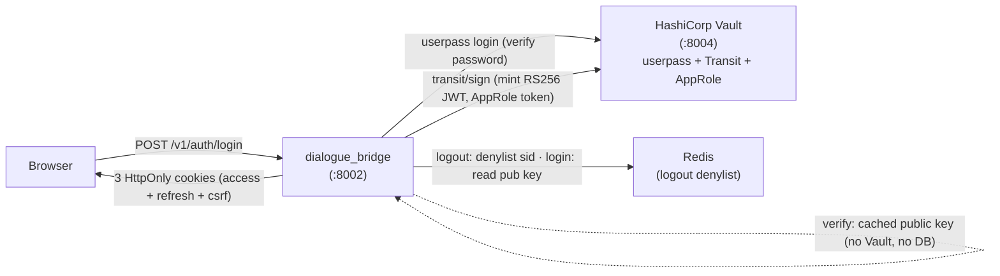
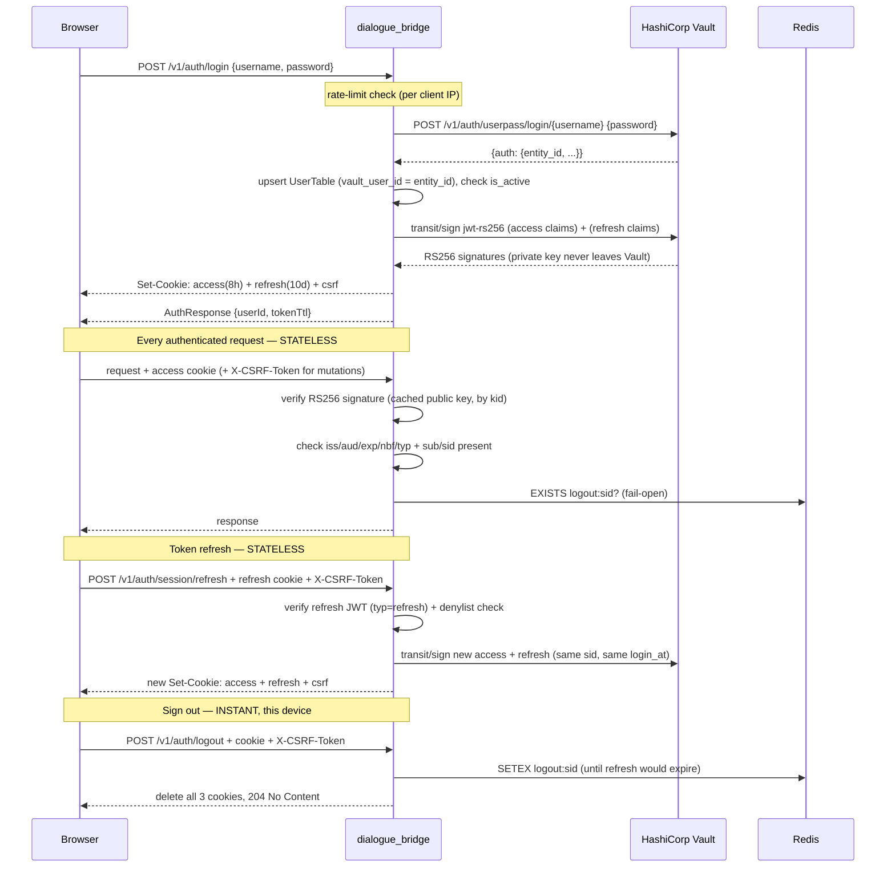
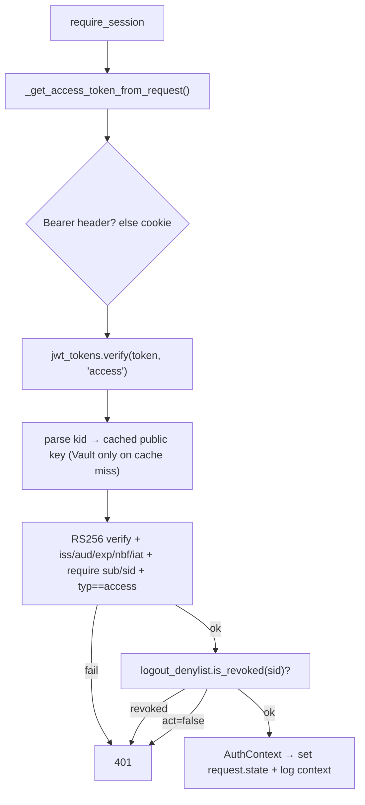
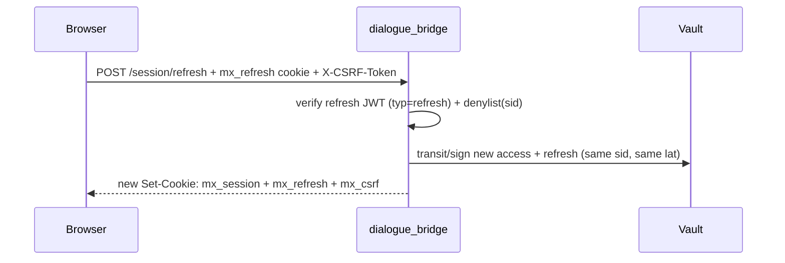
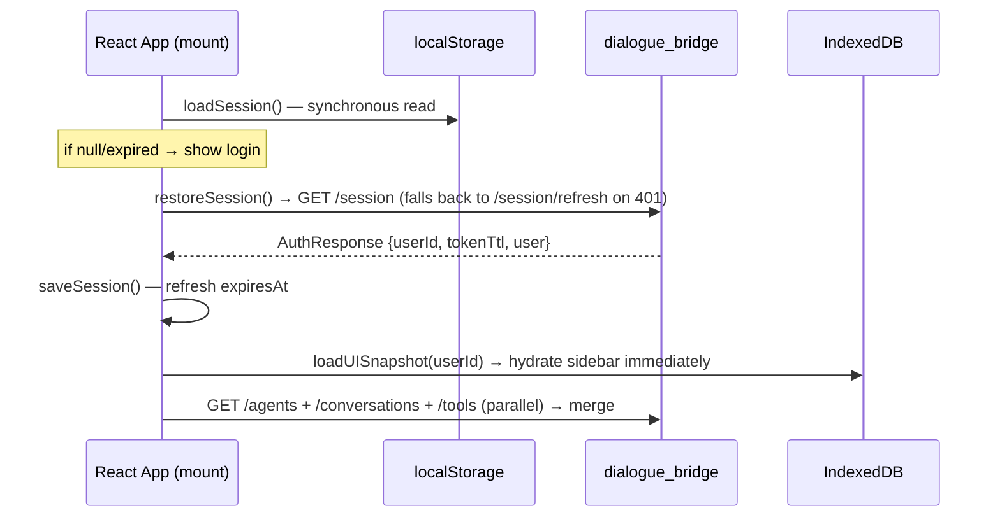

# Authentication Flow

The platform uses HashiCorp Vault as both the **identity authority** (it verifies credentials at login) and the **cryptographic signer** of session tokens (it holds the RS256 private key and signs JWTs via its Transit engine — the key never leaves Vault). The dialogue bridge is a thin **token issuer**: after Vault confirms the credential, the bridge mints a short-lived access JWT and a longer-lived refresh JWT, both signed by Vault, and hands them to the browser as HttpOnly cookies.

Sessions are **stateless**. There is no session row in the database; every request is authorised by verifying the JWT signature against Vault's public key (cached in-process) — no per-request database or Vault call. This is what lets the bridge scale horizontally behind a gateway: any instance on any VM can validate any token on its own. The only shared state is a small Redis **logout denylist** that makes sign-out (and a stolen-token replay) take effect instantly; it is empty in the normal case and fails open.

> **Future-proofing:** because the *app* only ever verifies "a bridge-issued JWT", swapping the upstream credential check from Vault userpass to Keycloak/Entra ID later changes only the login step — the token format and every verifier stay the same.

---

## Services Involved



---

## Full Sequence



---

## Phase 1 — Vault Credential Validation

The browser sends `POST /v1/auth/login` with `{username, password}`. The endpoint is rate-limited per client IP using SlowAPI (`AUTH_RATE_LIMIT_MAX_ATTEMPTS` / `AUTH_RATE_LIMIT_WINDOW_SECONDS`); a `429` carries a `Retry-After` header.

`VaultAuthenticator.authenticate()` issues a single HTTP call to Vault's userpass backend:

```http
POST {VAULT_URL}/v1/auth/{userpass_mount}/login/{username}
Body: {"password": "..."}
```

Vault returns an `auth` block; the bridge extracts the stable `entity_id` (used as `user.vault_user_id`) and discards everything else. The user's Vault token is **not** used to sign JWTs — the bridge signs with its own machine identity (see Phase 3).

| Vault response field | How the bridge uses it |
| --- | --- |
| `auth.entity_id` | Stored as `user.vault_user_id` — stable user key across password changes |
| `auth.client_token` | Discarded |
| `auth.lease_duration` | Ignored |

---

## Phase 2 — Local User Upsert

`upsert_user_from_vault()` looks the user up by `vault_user_id`. First login creates a `UserTable` row; later logins refresh the username. The bridge then enforces `user.is_active` — a locally disabled user is rejected with `403` even after Vault accepted the password. `user.last_login_at` is updated and committed.

---

## Phase 3 — Token Minting (Vault-Transit-signed JWTs)

Instead of creating a database session, the bridge mints two JWTs via `mint_tokens()`. Both are **RS256**, signed by Vault's Transit engine.

### The bridge's Vault identity (AppRole)

To sign, the bridge needs its own Vault token. It authenticates as a machine via **AppRole** (`VAULT_ROLE_ID` / `VAULT_SECRET_ID`), caches the token, and re-authenticates automatically on expiry or a `401/403`. Its policy grants exactly two capabilities: `update transit/sign/jwt-rs256` and `read transit/keys/jwt-rs256`.

### Signing (`core/vault_service.py`)

The bridge builds the JWT signing input — `base64url(header) + "." + base64url(payload)` — and POSTs it to Transit:

```http
POST transit/sign/jwt-rs256
{ "input": "<std-base64 of signing input>",
  "signature_algorithm": "pkcs1v15",   # RS256 == RSASSA-PKCS1-v1_5; Vault defaults to PSS, so this is mandatory
  "hash_algorithm": "sha2-256",
  "prehashed": false,
  "marshaling_algorithm": "jws",        # emits base64url-no-pad — already the JWT 3rd segment
  "key_version": <current version> }
```

The response signature (`vault:v<N>:<sig>`) has its prefix stripped and is appended as the third segment. The **RSA private key never leaves Vault.** The JWT header `kid` is the Transit key version, so rotation is transparent: new tokens carry the new version; old tokens still verify against the older (still-published) public key.

### Token model

| Token | TTL (default) | Claims |
| --- | --- | --- |
| **access** | 8 h (`JWT_ACCESS_TTL_SECONDS`) | `sub` (user id), `sid` (login/session id), `typ="access"`, `act` (is_active), `iss`, `aud`, `iat`, `nbf`, `exp`, `jti` |
| **refresh** | 10 d absolute (`JWT_REFRESH_TTL_SECONDS`) | `sub`, `sid`, `typ="refresh"`, `lat` (login time), `iss`, `aud`, `iat`, `nbf`, `exp` = `lat + 10d`, `jti` |

`sid` is a per-login id shared by both tokens (and stable across refresh) — it is the key the logout denylist uses. The refresh `exp` is computed from the **original** `lat`, so refreshing does **not** slide the 10-day window: it is a hard cap.

### Cookies

`issue_session_cookies()` sets three cookies (unchanged transport from the previous design):

| Cookie | HttpOnly | Expiry | Purpose |
| --- | --- | --- | --- |
| `mx_session` (or `__Host-mx_session`) | Yes | access TTL (8 h) | access JWT |
| `mx_refresh` (or `__Host-mx_refresh`) | Yes | refresh TTL (≤10 d) | refresh JWT |
| `mx_csrf` (or `__Host-mx_csrf`) | **No** | refresh TTL | CSRF double-submit value |

`__Host-` prefixing applies when `SESSION_COOKIE_SECURE=true` and no `SESSION_COOKIE_DOMAIN` is set. The access JWT lives in an HttpOnly cookie — JavaScript cannot read it (XSS-safe), and it is still verified with **zero** server state.

---

## Phase 4 — Per-Request Verification (stateless)

Every protected endpoint depends on `require_session`. There is **no database lookup and no Vault call** on this path.



`verify()` fails closed: the algorithm allow-list is **`RS256` only** (rejecting `alg:none` and HS/RS confusion), `iss`/`aud`/`exp`/`iat`/`nbf`/`sub` are required, and the `typ` claim must match — so an access token cannot be replayed at the refresh endpoint, or vice versa. Public keys are fetched from Vault once per key version and cached, so a Vault outage does not break verification of existing tokens.

`require_current_user` returns a lightweight `AuthUser(id, is_active)` built **from the claims** (no DB). User-scoped endpoints add `require_bound_user_id`, which checks the `user_id` path parameter equals the token's `sub`. The two auth endpoints that return the full profile (`GET /session`, refresh) load the `UserTable` row from Postgres explicitly — that is the only place a user row is read on the auth path.

---

## Phase 5 — CSRF Protection

Unchanged. `require_csrf_protection` runs on every state-mutating endpoint: it compares the `X-CSRF-Token` header against the `mx_csrf` cookie with `secrets.compare_digest` (constant-time). It is skipped for safe methods and for Bearer-only clients (which cannot be targeted by browser CSRF). Because the access JWT rides in a cookie, CSRF protection is still required.

---

## Phase 6 — Token Refresh (stateless)

Access tokens expire after 8 hours. The browser calls `POST /v1/auth/session/refresh` with the refresh cookie (CSRF-protected). `require_refresh_session` verifies the refresh JWT (`typ=refresh`) and checks the denylist. `rotate_session()` then mints a **new** access + refresh pair via Transit, **preserving the original `sid` and `lat`** — so the denylist entry still covers the rotated tokens and the 10-day absolute cap does not slide. No database row is written.



---

## Phase 7 — Sign Out (instant, per device)

`POST /v1/auth/logout` is CSRF-protected. Logout works in two layers:

1. **Cookie clear** — `clear_session_cookies()` deletes all three cookies, so that device immediately has no token. This alone logs the device out, with **zero server state**.
2. **Denylist (theft defense)** — `revoke_current_session()` reads the caller's token, extracts its `sid`, and writes it to the Redis denylist for the full refresh lifetime. This kills any **copy** of the token (e.g. one exfiltrated before logout) instantly, on every VM.

Logout always succeeds from the browser's perspective even if no valid token is present or Redis is unavailable (the denylist write is best-effort).

---

## Phase 8 — Client-Side Storage and Page Load Hydration

The browser keeps two stores so the UI rehydrates instantly. **Neither holds any token** — tokens live only in the HttpOnly cookies.

### localStorage — `mx_auth_session`

`saveSession()` writes one JSON key after login/refresh:

| Field | Source | Purpose |
| --- | --- | --- |
| `userId` | `AuthResponse.user_id` | IndexedDB key |
| `expiresAt` | `Date.now() + tokenTtl * 1000` | drives the auto-refresh timer (tokenTtl is the access TTL, ~8 h) |
| `user` | `AuthResponse.user` | profile display without a network call |
| `lastConversationId`, `selectedAgent`, `isPrivateMode` | UI state | deep-link / restore |

`loadSession()` returns `null` if absent or expired; `clearSession()` removes it; `updateSession()` is a read-merge-write.

### IndexedDB — `mx_ui_state`

A single `state` store keyed by `userId` holding a `UISnapshotSerializable` (agents, conversations, available tools, preferences, UI toggles). Icon components are stripped before storage and re-resolved on load. Bump the snapshot `version` and add a migration branch when the shape changes.

### Page Load Hydration



### Auto-Refresh Scheduling

`useSessionAutoRefreshEffect` schedules a `setTimeout` to fire **10 minutes** before `expiresAt` (a 2-minute margin is too thin on an 8-hour token). It calls `POST /v1/auth/session/refresh`; on success the server rotates all three cookies and returns a fresh `tokenTtl`, which re-arms the timer. If the device slept through the window, the next request returns `401`, clearing local storage and redirecting to login.

### Logout Cleanup

`handleLogout()` clears `mx_auth_session`, deletes the per-`userId` IndexedDB snapshot, fires `logoutSession()` (`POST /v1/auth/logout`) fire-and-forget, and resets React state to `/login`.

---

## Sharp Edges and Behavioral Notes

- **Vault is needed to MINT a token, not to verify one.** Login and refresh call Vault (Transit sign). Per-request verification uses the cached public key — if Vault is down, existing sessions keep working and refreshing as long as the public key is cached; only brand-new logins fail.

- **No database session state.** There is no `sessions` table lookup on any request, which is what makes the bridge horizontally scalable behind a gateway — any instance validates any token on its own. Moving a user between VMs never logs them out.

- **Instant logout requires shared state, by design.** A stateless token cannot be "un-issued", so per-device logout clears the cookie (zero state) and, for theft defense, denylists the `sid` in Redis. The denylist is checked per request (one O(1) `EXISTS`), **fails open** (Redis down → request still served on a valid signature; a *new* logout just isn't enforced until Redis recovers), and is empty in the common case.

- **`signature_algorithm=pkcs1v15` is load-bearing.** Vault Transit defaults to PSS (= PS256). RS256 *is* PKCS#1 v1.5; minting with the default would produce tokens that fail `algorithms=["RS256"]` verification.

- **No refresh-token reuse detection.** Stateless refresh cannot detect replay of an old refresh token (that needs a server-side store). This is the accepted trade-off for statelessness; it is bounded by the short-ish access TTL, the absolute 10-day refresh cap, the instant-logout denylist, TLS, and HttpOnly/CSRF cookies. A future store could reinstate reuse detection.

- **`is_active` is read from the claim per request, and from the DB at login/refresh.** Mid-session deactivation therefore takes effect at the next refresh (≤8 h) or via an explicit denylist entry — there is no admin-disable path wired today.

- **`__Host-` prefix is security-critical in production.** Configure `SESSION_COOKIE_SECURE=true` with no `SESSION_COOKIE_DOMAIN`.

- **localStorage is not a security boundary.** It holds profile/navigation data, never tokens. XSS reading it leaks data, not session control (the JWT is HttpOnly).

---

## File Map

| Concept | File | What to look for |
| --- | --- | --- |
| Vault credential check | [src/dialogue_bridge/core/auth_client.py](../../src/dialogue_bridge/core/auth_client.py) | `VaultAuthenticator.authenticate()` |
| Bridge Vault identity + Transit signing | [src/dialogue_bridge/core/vault_service.py](../../src/dialogue_bridge/core/vault_service.py) | `VaultServiceClient` — AppRole login, `sign()`, `public_key_pem()`, `current_sign_version()` |
| JWT mint / verify | [src/dialogue_bridge/core/auth/tokens.py](../../src/dialogue_bridge/core/auth/tokens.py) | `mint_tokens()`, `verify()`, claim model |
| Session deps + cookies | [src/dialogue_bridge/core/auth/session.py](../../src/dialogue_bridge/core/auth/session.py) | `require_session`, `require_current_user`, `require_refresh_session`, `require_csrf_protection`, `issue_session_cookies`, `revoke_current_session` |
| Instant-logout denylist | [src/dialogue_bridge/core/logout_denylist.py](../../src/dialogue_bridge/core/logout_denylist.py) | `LogoutDenylist` (fail-open) |
| Auth endpoints | [src/dialogue_bridge/router/auth.py](../../src/dialogue_bridge/router/auth.py) | `authenticate`, `session_me`, `refresh_session`, `logout` |
| User upsert from Vault | [src/dialogue_bridge/core/database/models.py](../../src/dialogue_bridge/core/database/models.py) | `upsert_user_from_vault()` |
| Settings | [src/dialogue_bridge/core/settings.py](../../src/dialogue_bridge/core/settings.py) | `JWTSettings`, `VaultSettings` (AppRole + Transit) |
| Vault setup runbook | [src/vault/vault_init.sh](../../src/vault/vault_init.sh) | Transit key + AppRole role + policy |
| Rate limiting | [src/dialogue_bridge/core/security/rate_limit.py](../../src/dialogue_bridge/core/security/rate_limit.py) | `AUTHENTICATE_LIMIT`, `limiter` |
| localStorage marker | [src/agentic_ui/src/lib/authStorage.ts](../../src/agentic_ui/src/lib/authStorage.ts) | `StoredSession`, `saveSession()`, `loadSession()` |
| Auto-refresh scheduling | [src/agentic_ui/src/hooks/useSessionEffects.ts](../../src/agentic_ui/src/hooks/useSessionEffects.ts) | `useSessionAutoRefreshEffect` (10-min buffer) |
| Login / logout handlers | [src/agentic_ui/src/handlers/auth.ts](../../src/agentic_ui/src/handlers/auth.ts) | `handleLogin`, `handleLogout` |
