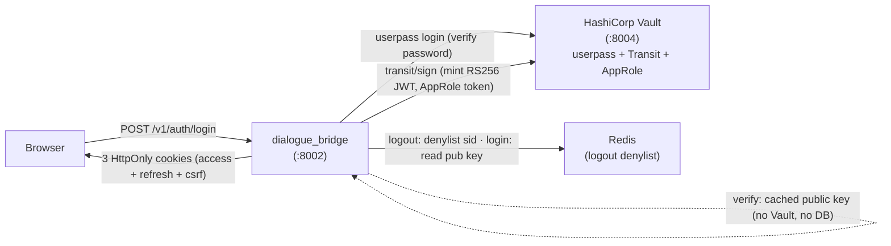
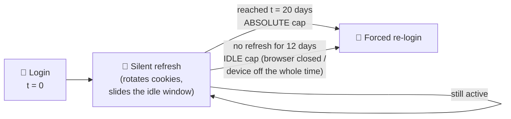
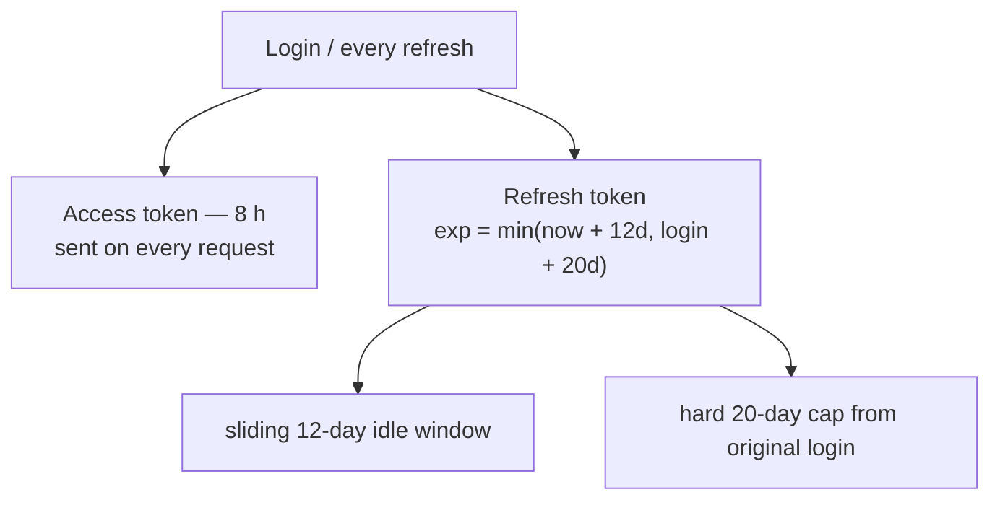
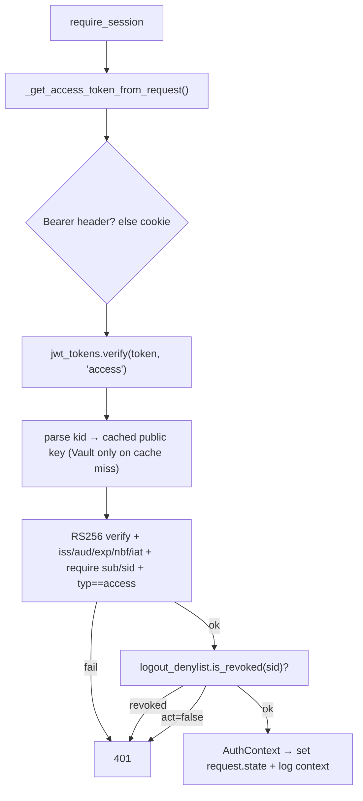
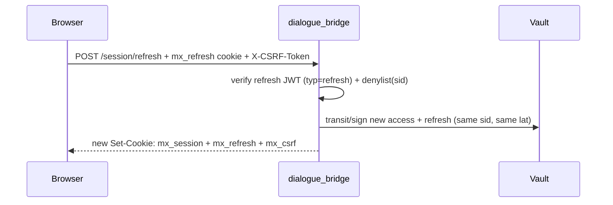
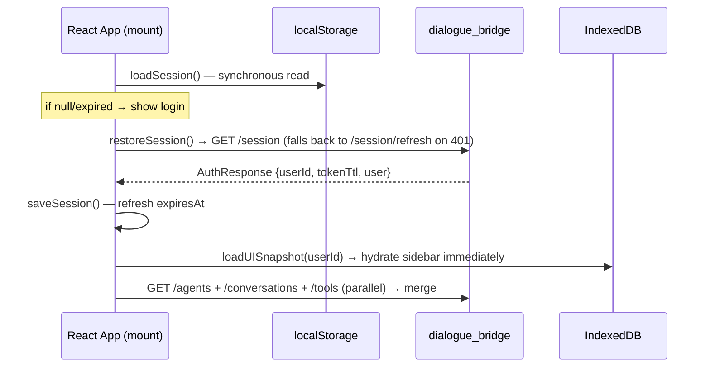
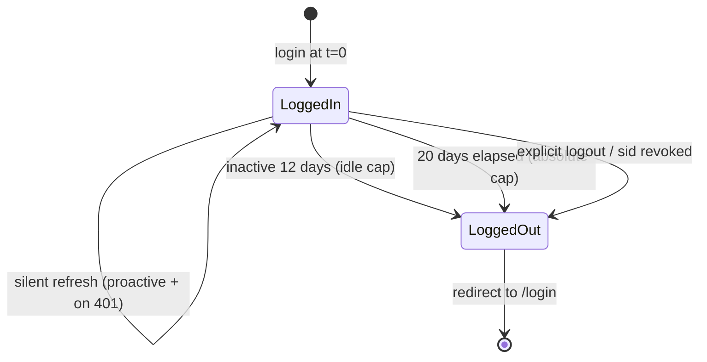
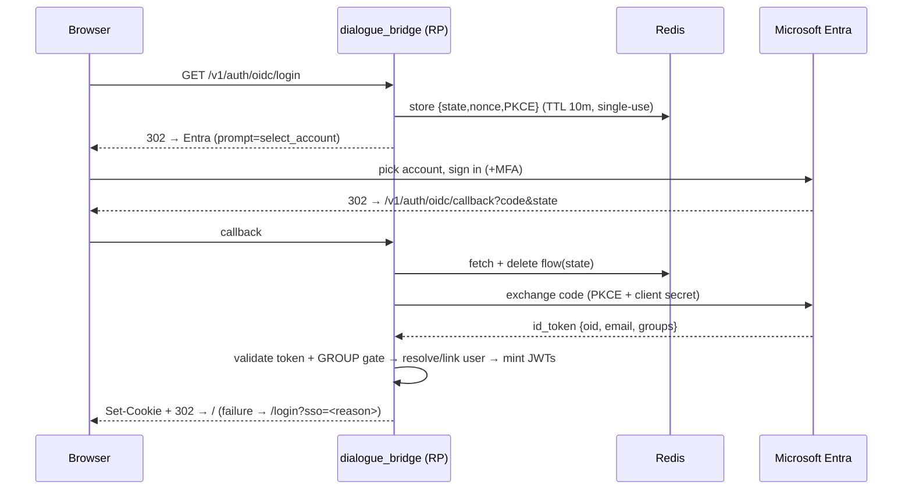
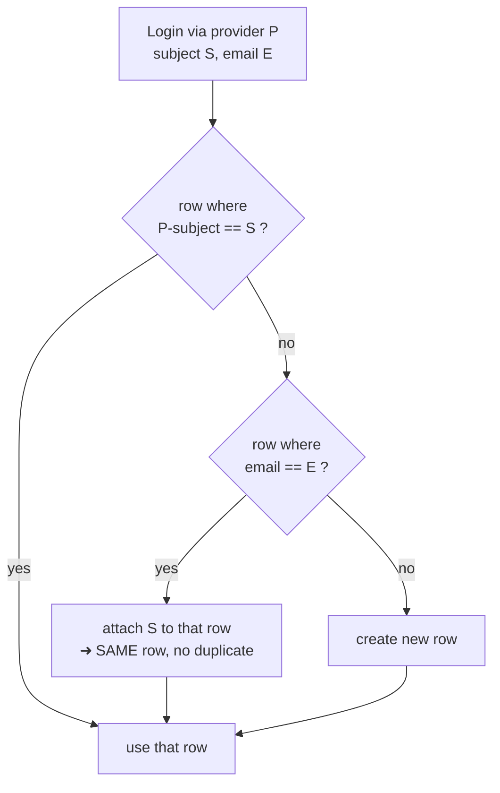

# Authentication Flow

The platform uses HashiCorp Vault as both the **identity authority** (it verifies credentials at login) and the **cryptographic signer** of session tokens (it holds the RS256 private key and signs JWTs via its Transit engine — the key never leaves Vault). The dialogue bridge is a thin **token issuer**: after Vault confirms the credential, the bridge mints a short-lived access JWT and a longer-lived refresh JWT, both signed by Vault, and hands them to the browser as HttpOnly cookies.

Sessions are **stateless**. There is no session row in the database; every request is authorised by verifying the JWT signature against Vault's public key (cached in-process) — no per-request database or Vault call. This is what lets the bridge scale horizontally behind a gateway: any instance on any VM can validate any token on its own. The only shared state is a small Redis **logout denylist** that makes sign-out (and a stolen-token replay) take effect instantly; it is empty in the normal case and fails open.

> **Future-proofing:** because the *app* only ever verifies "a bridge-issued JWT", swapping the upstream credential check from Vault userpass to Keycloak/Entra ID later changes only the login step — the token format and every verifier stay the same.

---

## Services Involved



---

## Full Sequence


---

## Phase 1 — Vault Credential Validation

The browser sends `POST /v1/auth/login` with `{username, password}`. The endpoint is rate-limited per resolved client IP via `fastapi-redis-sdk` (`AUTH_RATE_LIMIT_MAX_ATTEMPTS` / `AUTH_RATE_LIMIT_WINDOW_SECONDS`, Redis-counted so the brute-force guard survives restarts); a `429` carries `Retry-After` + `X-RateLimit-*` headers. The same limit guards `GET /v1/auth/oidc/login`.

`VaultAuthenticator.authenticate()` issues a single HTTP call to Vault's userpass backend:

```http
POST {VAULT_URL}/v1/auth/{userpass_mount}/login/{username}
Body: {"password": "..."}
```

Vault returns an `auth` block; the bridge extracts the stable `entity_id` (used as `user.vault_user_id`) and discards everything else. The user's Vault token is **not** used to sign JWTs — the bridge signs with its own machine identity (see Phase 3).

| Vault response field | How the bridge uses it |
| --- | --- |
| `auth.entity_id` | Stored as `user.vault_user_id` — stable user key across password changes |
| `auth.client_token` | Discarded |
| `auth.lease_duration` | Ignored |

---

## Phase 2 — Local User Upsert

`upsert_user_from_vault()` looks the user up by `vault_user_id`. First login creates a `UserTable` row; later logins refresh the username. The bridge then enforces `user.is_active` — a locally disabled user is rejected with `403` even after Vault accepted the password. `user.last_login_at` is updated and committed.

---

## Phase 3 — Token Minting (Vault-Transit-signed JWTs)

Instead of creating a database session, the bridge mints two JWTs via `mint_tokens()`. Both are **RS256**, signed by Vault's Transit engine.

### The bridge's Vault identity (AppRole)

To sign, the bridge needs its own Vault token. It authenticates as a machine via **AppRole** (`VAULT_ROLE_ID` / `VAULT_SECRET_ID`), caches the token, and re-authenticates automatically on expiry or a `401/403`. Its policy grants exactly two capabilities: `update transit/sign/jwt-rs256` and `read transit/keys/jwt-rs256`.

### Signing (`core/vault_service.py`)

The bridge builds the JWT signing input — `base64url(header) + "." + base64url(payload)` — and POSTs it to Transit:

```http
POST transit/sign/jwt-rs256
{ "input": "<std-base64 of signing input>",
  "signature_algorithm": "pkcs1v15",   # RS256 == RSASSA-PKCS1-v1_5; Vault defaults to PSS, so this is mandatory
  "hash_algorithm": "sha2-256",
  "prehashed": false,
  "marshaling_algorithm": "jws",        # emits base64url-no-pad — already the JWT 3rd segment
  "key_version": <current version> }
```

The response signature (`vault:v<N>:<sig>`) has its prefix stripped and is appended as the third segment. The **RSA private key never leaves Vault.** The JWT header `kid` is the Transit key version, so rotation is transparent: new tokens carry the new version; old tokens still verify against the older (still-published) public key.

### Token model

| Token | TTL (default) | Claims |
| --- | --- | --- |
| **access** | 8 h (`JWT_ACCESS_TTL_SECONDS`) | `sub` (user id), `sid` (login/session id), `typ="access"`, `act` (is_active), `iss`, `aud`, `iat`, `nbf`, `exp`, `jti` |
| **refresh** | **rolling** — `exp = min(now + IDLE, lat + ABSOLUTE)`; defaults **12 d idle** (`JWT_REFRESH_IDLE_TTL_SECONDS`) / **20 d absolute** (`JWT_REFRESH_ABSOLUTE_TTL_SECONDS`) | `sub`, `sid`, `typ="refresh"`, `lat` (login time), `iss`, `aud`, `iat`, `nbf`, `exp`, `jti` |

`sid` is a per-login id shared by both tokens (and stable across refresh) — the key the logout denylist and refresh-reuse detection use. The refresh window is **rolling**: each refresh slides `exp` forward by the idle window, but never past `lat + ABSOLUTE`. Net effect — an active user stays signed in up to the absolute cap; being idle longer than the idle window logs them out; the absolute cap forces a periodic full re-auth regardless of activity. The per-refresh `jti` is what makes rotation + reuse detection possible (Phase 6).

**Product target — "stay signed in for 20 days":** with the current defaults a logged-in user is kept signed in silently for up to **20 days** (absolute cap), after which they must re-authenticate. Going **12 days** without the client managing a single refresh (browser closed / device off the whole time) expires the refresh token early. The frontend refreshes both proactively (before the access token expires) and reactively (on any `401`), so an active session slides toward the 20-day cap without ever showing the login screen. Because the access token trails the refresh cap by at most one access TTL, the effective hard logout lands at 20 days + ≤ 8 h in the edge case of a session held open right at the boundary.



Two tokens, two jobs — the short access token is presented on every request; the long refresh token silently buys a new pair, its expiry re-derived on each refresh:



### Cookies

`issue_session_cookies()` sets three cookies (unchanged transport from the previous design):

| Cookie | HttpOnly | Expiry | Purpose |
| --- | --- | --- | --- |
| `mx_session` (or `__Host-mx_session`) | Yes | access TTL (8 h) | access JWT |
| `mx_refresh` (or `__Host-mx_refresh`) | Yes | rolling refresh TTL (≤ absolute cap, 20 d) | refresh JWT |
| `mx_csrf` (or `__Host-mx_csrf`) | **No** | rolling refresh TTL | CSRF double-submit value |
| `mx_device` (or `__Host-mx_device`) | Yes | absolute refresh TTL (20 d) | opaque id indexing this browser's *parked* sessions — only issued when multi-account is enabled (Phase 10) |

`__Host-` prefixing applies when `SESSION_COOKIE_SECURE=true` and no `SESSION_COOKIE_DOMAIN` is set. The access JWT lives in an HttpOnly cookie — JavaScript cannot read it (XSS-safe), and it is still verified with **zero** server state.

---

## Phase 4 — Per-Request Verification (stateless)

Every protected endpoint depends on `require_session`. There is **no database lookup and no Vault call** on this path.



`verify()` fails closed: the algorithm allow-list is **`RS256` only** (rejecting `alg:none` and HS/RS confusion), `iss`/`aud`/`exp`/`iat`/`nbf`/`sub` are required, and the `typ` claim must match — so an access token cannot be replayed at the refresh endpoint, or vice versa. Public keys are fetched from Vault once per key version and cached, so a Vault outage does not break verification of existing tokens.

`require_current_user` returns a lightweight `AuthUser(id, is_active)` built **from the claims** (no DB). User-scoped endpoints add `require_bound_user_id`, which checks the `user_id` path parameter equals the token's `sub`. The two auth endpoints that return the full profile (`GET /session`, refresh) load the `UserTable` row from Postgres explicitly — that is the only place a user row is read on the auth path.

---

## Phase 5 — CSRF Protection

Unchanged. `require_csrf_protection` runs on every state-mutating endpoint: it compares the `X-CSRF-Token` header against the `mx_csrf` cookie with `secrets.compare_digest` (constant-time). It is skipped for safe methods and for Bearer-only clients (which cannot be targeted by browser CSRF). Because the access JWT rides in a cookie, CSRF protection is still required.

---

## Phase 6 — Token Refresh (stateless)

Access tokens expire after 8 hours. The browser calls `POST /v1/auth/session/refresh` with the refresh cookie (CSRF-protected). `require_refresh_session` verifies the refresh JWT (`typ=refresh`) and checks the denylist.

**Refresh-token rotation + reuse detection.** Every refresh rotates the refresh token (fresh `jti`); the `RefreshTokenGuard` tracks the single currently-valid `jti` per `sid` in Redis. On refresh the presented `jti` is classified: the current one — or the just-rotated-from one inside a short grace window that tolerates a legitimate concurrent/retried refresh — is **ok**; an older, already-rotated `jti` replayed past the grace is **reuse** (a stolen refresh token replayed after the real client already rotated). Reuse **revokes the whole session** (denylist the `sid`) so neither the attacker's nor the victim's copy survives — both must re-authenticate. The guard **fails open** on a Redis error (degrades to no reuse detection, never a lockout), consistent with the logout denylist.

`rotate_session()` mints a **new** access + refresh pair via Transit, preserving the original `sid` and `lat` (so the denylist still covers the session and the absolute cap is measured from the original login) while the refresh `exp` slides forward by the idle window. The new `jti` is then registered as current and the old one graced. No database row is written.



---

## Phase 7 — Sign Out (instant, per device)

`POST /v1/auth/logout` is CSRF-protected. Logout works in two layers:

1. **Cookie clear** — `clear_session_cookies()` deletes all three cookies, so that device immediately has no token. This alone logs the device out, with **zero server state**.
2. **Denylist (theft defense)** — `revoke_current_session()` reads the caller's token, extracts its `sid`, and writes it to the Redis denylist for the full refresh lifetime. This kills any **copy** of the token (e.g. one exfiltrated before logout) instantly, on every VM.

Logout always succeeds from the browser's perspective even if no valid token is present or Redis is unavailable (the denylist write is best-effort).

`revoke_current_session()` returns `(sid, user_id)` — the id comes from whichever token verified, **not** from a fresh `require_session`, because a logout commonly arrives with an already-expired access token. With multi-account enabled that identity is used to drop the account from the browser's parked index, so a signed-out account is never left listed as something to switch back into.

---

## Phase 8 — Client-Side Storage and Page Load Hydration

The browser keeps two stores so the UI rehydrates instantly. **Neither holds any token** — tokens live only in the HttpOnly cookies.

### localStorage — `mx_auth_session`

`saveSession()` writes one JSON key after login/refresh:

| Field | Source | Purpose |
| --- | --- | --- |
| `userId` | `AuthResponse.user_id` | IndexedDB key |
| `expiresAt` | `Date.now() + tokenTtl * 1000` | drives the auto-refresh timer (tokenTtl is the access TTL, ~8 h) |
| `user` | `AuthResponse.user` | profile display without a network call |
| `lastConversationId`, `selectedAgent`, `isPrivateMode` | UI state | deep-link / restore |

`loadSession()` returns `null` if absent or expired; `clearSession()` removes it; `updateSession()` is a read-merge-write.

### IndexedDB — `mx_ui_state`

A single `state` store keyed by `userId` holding a `UISnapshotSerializable` (agents, conversations, available tools, preferences, UI toggles). Icon components are stripped before storage and re-resolved on load. Bump the snapshot `version` and add a migration branch when the shape changes.

### Page Load Hydration



### Auto-Refresh Scheduling

Silent refresh has **two triggers**, both routed through the single `ensureFreshSession()` primitive ([shared/lib/sessionRefresh.ts](../../src/agentic_ui/src/shared/lib/sessionRefresh.ts)):

1. **Proactive (timer).** `useSessionAutoRefreshEffect` schedules a `setTimeout` to fire **10 minutes** before `expiresAt` (a 2-minute margin is too thin on an 8-hour token). Because browsers throttle/suspend timers in a backgrounded tab (and a slept device pauses them), the hook also re-evaluates on **`visibilitychange`/`focus`**: via the same scheduler it refreshes immediately if the access token already expired or is about to, otherwise re-arms the drifted timer.

   ```mermaid
   sequenceDiagram
       participant T as Timer (useSessionAutoRefreshEffect)
       participant R as ensureFreshSession
       participant L as Web Lock "mx-session-refresh"
       participant B as Bridge

       Note over T: fires ~10 min before access expiry<br/>also on visibilitychange / focus
       T->>R: ensureFreshSession()
       R->>L: acquire cross-tab lock
       alt another tab already refreshed
           L-->>R: got lock, marker still fresh
           R-->>T: already-fresh → skip network, re-arm
       else this tab does the refresh
           R->>B: POST /session/refresh
           B-->>R: rotate cookies + new tokenTtl
           R-->>T: refreshed → re-arm timer
       end
   ```

2. **Reactive (401 interceptor).** Every API call goes through `requestRaw` ([shared/lib/http.ts](../../src/agentic_ui/src/shared/lib/http.ts)); a `401` triggers **one** silent refresh and **one** retry of the original request (rebuilt so it picks up the rotated CSRF cookie) before the app gives up. The inference **WebSocket** mirrors this: a `4401` close refreshes once and reconnects with the fresh cookie. This is what stops a stale access token — after device sleep, or a request racing the expiry — from bouncing an otherwise-valid session to the login screen. Only when the refresh **itself** fails (idle > 12 d, absolute > 20 d, or the `sid` was revoked) does the app emit `mx:unauthorized` and return to login.

   ```mermaid
   sequenceDiagram
       participant C as Component (API call)
       participant H as http.ts (requestRaw)
       participant R as ensureFreshSession
       participant B as Bridge

       C->>H: GET /conversations
       H->>B: request (access cookie expired)
       B-->>H: 401
       H->>R: ensureFreshSession()
       R->>B: POST /session/refresh (refresh + CSRF cookie)
       alt refresh token still valid (<12d idle, <20d abs)
           B-->>R: 200 — rotate access/refresh/csrf
           R-->>H: refreshed
           H->>B: RETRY GET /conversations (fresh cookie)
           B-->>H: 200
           H-->>C: data — user noticed nothing
       else refresh token dead / revoked
           B-->>R: 401
           R-->>H: failed
           H->>H: emitUnauthorized()
           H-->>C: logout + "Session expired" → /login
       end
   ```

   The inference WebSocket applies the same repair to a `4401` close — refresh once, then reconnect:

   ```mermaid
   sequenceDiagram
       participant W as Inference WS loop
       participant B as Bridge
       participant R as ensureFreshSession

       W->>B: connect (access cookie stale)
       B-->>W: close 4401
       alt first 4401 → try refresh
           W->>R: ensureFreshSession(force)
           R-->>W: refreshed
           W->>B: reconnect with fresh cookie
       else refresh failed, or a 2nd 4401
           W->>W: emitUnauthorized() → logout
       end
   ```

`ensureFreshSession()` calls `POST /v1/auth/session/refresh` (on success the server rotates all three cookies and returns a fresh `tokenTtl`, re-arming the proactive timer). It is **single-flight** on two levels: an in-process promise singleton dedupes a burst of concurrent `401`s within a tab, and the **cross-tab Web Locks** lock (`mx-session-refresh`) ensures only one tab across the origin performs the network refresh while the rest pick up the rotated token from the shared session marker — so tabs never rotate the refresh token concurrently (which would otherwise trip server-side reuse detection). The auth endpoints themselves (`login`, `session/refresh`, `GET /session`) opt out of the interceptor via `skipAuthRetry` so a failed refresh can never recurse.

These three end-states — and only these — return the user to login; every transient access-token expiry in between is repaired silently:



### Logout Cleanup

`handleLogout()` clears `mx_auth_session`, deletes the per-`userId` IndexedDB snapshot, fires `logoutSession()` (`POST /v1/auth/logout`) fire-and-forget, and resets React state to `/login`.

---

## Phase 9 — Microsoft Entra ID (OIDC) Federated Sign-In

Entra is an **additional** login method **alongside** username/password, not a replacement. The bridge acts as the OIDC **Relying Party** (authorization-code + PKCE via Microsoft's MSAL): Entra proves identity, then the bridge mints the **same session JWTs** as the password path — everything in Phases 4–8 is unchanged. The provider stays **inert unless configured**: `ENTRA_TENANT_ID` + `ENTRA_CLIENT_ID` + `ENTRA_CLIENT_SECRET` must all be set (`settings.entra.enabled`), and `GET /v1/auth/config → {oidcEnabled}` tells the login page whether to render the "Sign in with Microsoft" button.



### Identity linking — one row per human

The same person must map to **one** `users` row whether they sign in via Vault or Microsoft. The link key is the **normalized email**; a row can carry both `vault_user_id` and `oidc_subject`. One helper — `upsert_user_from_identity` — serves both login paths:



Migration `0014_link_identities` makes `vault_user_id` nullable and adds `oidc_subject` (nullable, unique) + `auth_providers`. A subject/email clash fails closed (`IdentityConflictError` → `/login?sso=conflict`). The local `users` row is created automatically on first login (JIT) and the second provider is linked on *its* first login — the database is never provisioned by hand.

**Where the link email comes from (the key asymmetry):**

| Provider | Email source |
| --- | --- |
| **Microsoft (Entra)** | the id_token `email` / `preferred_username` claim |
| **Vault** | the **identity entity's `email` metadata** — read via `vault_service.read_entity_email()` (needs `read identity/entity/id/*` on the bridge's AppRole policy). A Vault userpass **username can never be an email** (Vault's `GenericNameRegex` forbids `@`), so the email lives on the entity, not the username. A username-that-happens-to-be-an-email is only a last-resort fallback (`_username_as_email`). |

A Vault user whose entity has **no** `email` set simply stays a Vault-only account (nothing to match), which is why the bridge also validates the username against Vault's allowed pattern up front — an `@`-containing login is rejected as invalid credentials rather than 500-ing Vault on an unroutable path.

> **The whole model in one line:** there is no self-registration — an admin provisions the user in Vault (userpass user **+ entity `email`**) and/or Entra (tenant user **+ allowed group**); **matching emails across the two ⇒ one account.** Set the same email on both sides and the logins merge automatically.

### Group gate

`ENTRA_ALLOWED_GROUP_IDS` (comma-separated group Object IDs) restricts who may sign in. The callback requires the id_token `groups` claim to intersect the allowed set, **fail closed**; a groups "overage" is denied (use a dedicated security group). Empty = no restriction.

### Security notes

Real authorization-code + **PKCE**; `state`/`nonce`/PKCE held single-use in Redis (10-min TTL) as CSRF/replay defense; full id_token validation (signature vs Entra JWKS, `iss`/`aud`/`nonce`/`exp`) by MSAL. **Entra's own tokens are never stored** — the id_token authenticates once and is discarded; only the bridge's session JWT persists. The client secret is a file-backed `SecretStr`. MSAL is synchronous, so all of its network calls run via `asyncio.to_thread` to avoid blocking the event loop.

### Production enablement

Entra ships **default-off**, so the images deploy to production inert: the additive `0014` migration applies on startup and existing login is unaffected (the Vault entity-email read fails gracefully if the policy below isn't present yet). To turn it on:

- **Secret + config:** `ENTRA_CLIENT_SECRET` as a Swarm secret (`magenticx_entra_client_secret` → `ENTRA_CLIENT_SECRET_FILE`); the other `ENTRA_*` (including the production redirect URI) as service env in the production compose.
- **Vault:** add `read identity/entity/id/*` to the bridge's AppRole policy on the production Vault (already in `vault_init.sh`), then set each Vault user's entity `email` so it can link to their Microsoft login.
- **Egress:** the bridge needs outbound HTTPS to the Microsoft identity platform (server-side code exchange + JWKS).
- **Deploy:** standard rolling update — this change does **not** touch mTLS. Recommended: deploy the images inert first, then enable as a deliberate second step.

---

## Phase 10 — Multiple accounts per browser (opt-in)

Off by default (`MULTI_ACCOUNT_ENABLED=false`); every endpoint below 404s while it is
disabled, so a deployment that does not want it cannot even probe it.

One browser can be signed in to several accounts while **exactly one is active per
request**. That invariant is the whole design: every authorization check, rate
limiter and audit line downstream keeps interpreting a request the same way, and
nothing anywhere has to ask "which of the caller's identities is this for?".

### Why parked sessions are server-side

The session cookies carry the `__Host-` prefix, which forces `Path=/`. Extra
accounts therefore cannot be parked in a cookie scoped to just the switch
endpoint: every parked JWT (~1 KB) would ride on every request, and the 4 KB
per-cookie ceiling caps a token map at about three accounts. So the active
account keeps using the normal cookies unchanged, and the dormant ones live in
Redis, indexed by the small opaque `mx_device` cookie:

```text
auth:parked:<device_id>  ->  hash { user_id: <AES-GCM sealed refresh token> }   TTL = refresh idle TTL
```

Two properties make that acceptable for a credential store:

* **Encrypted at rest** with `PARKED_TOKEN_KEY`, and the `(device_id, user_id)`
  pair is bound in as additional authenticated data — so a sealed blob cannot be
  replayed under a different device or user even by someone who can write Redis.
  Boot **fails closed** if the feature is on without the key.
* **Nothing identifying is stored** beside the token. Display names and emails for
  the switcher come from Postgres at request time, so a Redis dump does not also
  leak a roster of who is signed in on which browser.

### Endpoints

| Method | Path | Notes |
| --- | --- | --- |
| GET | `/v1/auth/accounts` | Active account + parked ones. **Never returns a token.** |
| POST | `/v1/auth/accounts/switch` | Promote a parked account; rate-limited; audited |
| POST | `/v1/auth/accounts/logout-all` | Sign out of every account on this browser |
| POST | `/v1/auth/login?park=true` | "Add another account" — parks the outgoing session instead of replacing it |

**Three factors are required to switch**: a valid *active* session, the device
cookie, **and** a CSRF token. The device cookie alone must never suffice — that
would turn one stolen cookie into every parked account. `GET /accounts` carries
the same requirement, so the roster cannot be enumerated with a stolen device
cookie either. Neither route sits on `auth_rate_limit`: that is the per-IP
*credential* bucket protecting login and refresh, and an authenticated read
sharing it lets any chatty client starve sign-in.

### The switch

1. `take()` the parked refresh token — deleted as it is read, so it is single-use.
2. Verify it through the same `verify_token` + denylist path as a cookie-borne
   refresh, so a session revoked elsewhere cannot be promoted back.
3. Mint a fresh pair for the incoming account, preserving its `sid` so the
   denylist and the absolute refresh cap still apply to the original login.
4. Rotate the **outgoing** account's refresh token and park that.
5. Replace every cookie in one response.

Both directions rotate, which is why `RefreshTokenGuard` is not a problem here: a
parked token is never rotated *while* parked, so it stays the current `jti`; and
because each switch rotates it, a captured parked token is single-use and its
replay trips the reuse detector.

### Client side

The switch is driven by a **full-screen blocking interstitial** that is
load-bearing, not decoration: rendering it unmounts the entire workspace tree, so
nothing is left alive to receive a late response from the account being left and
paint it under the new identity. The sequence is: show interstitial → leave the
conversation route → `resetForAccountSwitch()` (blank every per-user store slice)
→ `POST /accounts/switch` → re-run the **same** post-login bootstrap → hide.

Two client-side rules that are easy to get wrong, and were:

* **The bootstrap only replaces what it fetches.** Archived and shared
  conversation lists, `selectedAgent`, starter suggestions, private mode and the
  pagination cursors are *not* fetched by it, so without `resetForAccountSwitch()`
  they survive a switch and are shown under the new identity.
* **"Add another account" ends in a hard reload**, not a router navigation. The
  workspace store is module-level, so a client-side navigate arrives at `/` still
  holding the previous account's `userId` — and every request keyed on that stale
  id is rejected as *"Token does not grant access to this user"*.

### Logout semantics

Unchanged: logout always ends the **active** session and drops it from the parked
index. To sign out of a specific account, switch to it and then log out.
"Log out of all accounts" exists separately so a shared machine is not left
holding dormant logins.

### Known gaps

* **OIDC cannot add an account.** `?park=true` is honoured on password login only;
  the Entra callback has no way to carry the intent through the redirect.
* **"Log out of all accounts" has no UI yet** — the endpoint is implemented and
  tested, but nothing calls it.
* **CSRF enforcement on the new routes is not covered by tests**, because the test
  suite overrides `require_csrf_protection` app-wide. The dependency is declared
  the same way as on `/logout` and `/session/refresh`.

---

## Sharp Edges and Behavioral Notes

- **Vault is needed to MINT a token, not to verify one.** Login and refresh call Vault (Transit sign). Per-request verification uses the cached public key — if Vault is down, existing sessions keep working and refreshing as long as the public key is cached; only brand-new logins fail.

- **No database session state.** There is no `sessions` table lookup on any request, which is what makes the bridge horizontally scalable behind a gateway — any instance validates any token on its own. Moving a user between VMs never logs them out.

- **Instant logout requires shared state, by design.** A stateless token cannot be "un-issued", so per-device logout clears the cookie (zero state) and, for theft defense, denylists the `sid` in Redis. The denylist is checked per request (one O(1) `EXISTS`), **fails open** (Redis down → request still served on a valid signature; a *new* logout just isn't enforced until Redis recovers), and is empty in the common case.

- **`signature_algorithm=pkcs1v15` is load-bearing.** Vault Transit defaults to PSS (= PS256). RS256 *is* PKCS#1 v1.5; minting with the default would produce tokens that fail `algorithms=["RS256"]` verification.

- **Refresh-token rotation + reuse detection (Redis-backed).** Each refresh rotates the refresh token and records its `jti` per `sid`; replaying an already-rotated refresh token past a short grace window is treated as theft and **revokes the whole session**. Bounded server state (one key per active session, TTL = the absolute cap), and it **fails open** on a Redis outage — degrading to no reuse detection (the prior posture), never to a lockout. Concurrent refreshes can't false-trip it: the client refreshes **cross-tab single-flight** (Web Locks — only one tab across the origin calls `/session/refresh`; the others see the rotated token in the shared session marker and skip), so two tabs never diverge the tracked `jti`. The server-side grace window is the backstop for the rare browser without Web Locks.

- **`is_active` is read from the claim per request, and from the DB at login/refresh.** Mid-session deactivation therefore takes effect at the next refresh (≤8 h) or via an explicit denylist entry — there is no admin-disable path wired today.

- **`__Host-` prefix is security-critical in production.** Configure `SESSION_COOKIE_SECURE=true` with no `SESSION_COOKIE_DOMAIN`.

- **localStorage is not a security boundary.** It holds profile/navigation data, never tokens. XSS reading it leaks data, not session control (the JWT is HttpOnly).

---

## File Map

| Concept | File | What to look for |
| --- | --- | --- |
| Vault credential check | [src/dialogue_bridge/core/auth_client.py](../../src/dialogue_bridge/core/auth_client.py) | `VaultAuthenticator.authenticate()` |
| Bridge Vault identity + Transit signing | [src/dialogue_bridge/core/vault_service.py](../../src/dialogue_bridge/core/vault_service.py) | `VaultServiceClient` — AppRole login, `sign()`, `public_key_pem()`, `current_sign_version()` |
| JWT mint / verify | [src/dialogue_bridge/core/auth/tokens.py](../../src/dialogue_bridge/core/auth/tokens.py) | `mint_tokens()`, `verify()`, claim model |
| Session deps + cookies | [src/dialogue_bridge/core/auth/session.py](../../src/dialogue_bridge/core/auth/session.py) | `require_session`, `require_current_user`, `require_refresh_session`, `require_csrf_protection`, `issue_session_cookies`, `revoke_current_session` |
| Instant-logout denylist | [src/dialogue_bridge/core/logout_denylist.py](../../src/dialogue_bridge/core/logout_denylist.py) | `LogoutDenylist` (fail-open) |
| Auth endpoints | [src/dialogue_bridge/router/auth.py](../../src/dialogue_bridge/router/auth.py) | `authenticate`, `session_me`, `refresh_session`, `logout`, `auth_config`, `oidc_login`, `oidc_callback` |
| Entra OIDC flow (MSAL) | [src/dialogue_bridge/core/auth/oidc.py](../../src/dialogue_bridge/core/auth/oidc.py) | `begin_login`, `complete_login`, group gate |
| Identity link/upsert | [src/dialogue_bridge/core/database/models.py](../../src/dialogue_bridge/core/database/models.py) | `upsert_user_from_identity` (link-by-email), `IdentityConflictError` |
| User upsert from Vault | [src/dialogue_bridge/core/database/models.py](../../src/dialogue_bridge/core/database/models.py) | `upsert_user_from_vault()` |
| Settings | [src/dialogue_bridge/core/settings.py](../../src/dialogue_bridge/core/settings.py) | `JWTSettings`, `VaultSettings` (AppRole + Transit), `EntraSettings` (OIDC) |
| Vault setup runbook | [src/vault/vault_init.sh](../../src/vault/vault_init.sh) | Transit key + AppRole role + policy |
| Rate limiting | [src/dialogue_bridge/core/security/rate_limit.py](../../src/dialogue_bridge/core/security/rate_limit.py) | `AUTHENTICATE_LIMIT`, `limiter` |
| localStorage marker | [src/agentic_ui/src/shared/lib/authStorage.ts](../../src/agentic_ui/src/shared/lib/authStorage.ts) | `StoredSession`, `saveSession()`, `loadSession()` |
| Silent-refresh primitive | [src/agentic_ui/src/shared/lib/sessionRefresh.ts](../../src/agentic_ui/src/shared/lib/sessionRefresh.ts) | `ensureFreshSession()` — single-flight + cross-tab refresh, shared by both triggers |
| 401 refresh-and-retry interceptor | [src/agentic_ui/src/shared/lib/http.ts](../../src/agentic_ui/src/shared/lib/http.ts) | `requestRaw` (reactive trigger; `skipAuthRetry` opt-out) |
| Auto-refresh scheduling | [src/agentic_ui/src/features/auth/hooks/useSessionEffects.ts](../../src/agentic_ui/src/features/auth/hooks/useSessionEffects.ts) | `useSessionAutoRefreshEffect` (proactive trigger, 10-min buffer) |
| Login / logout handlers | [src/agentic_ui/src/features/auth/handlers/auth.ts](../../src/agentic_ui/src/features/auth/handlers/auth.ts) | `handleLogin`, `handleLogout` |
