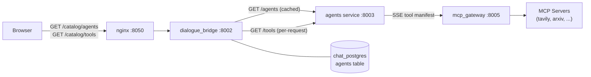
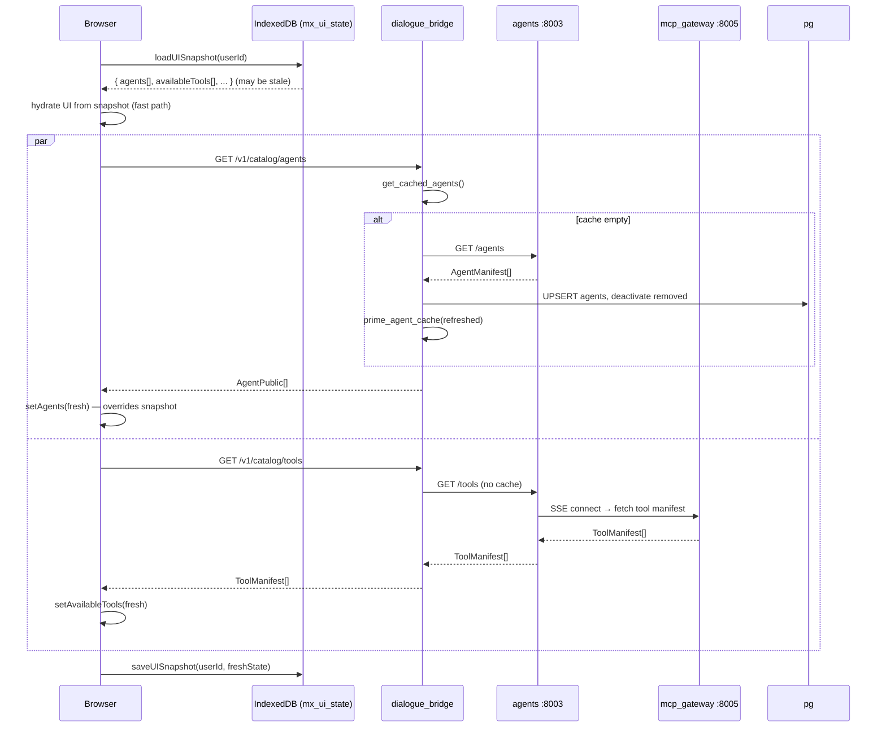
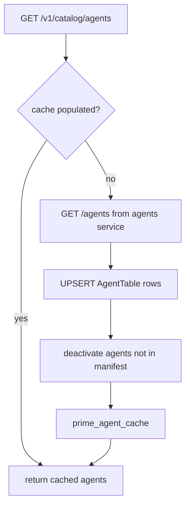
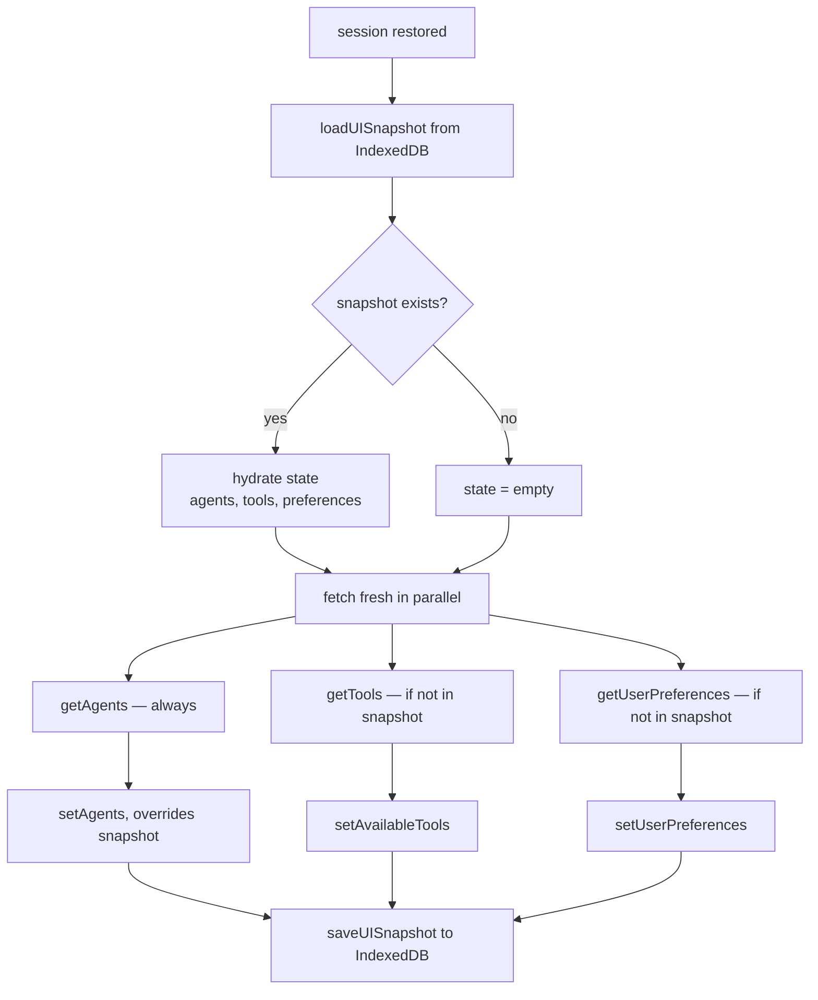
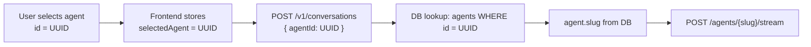
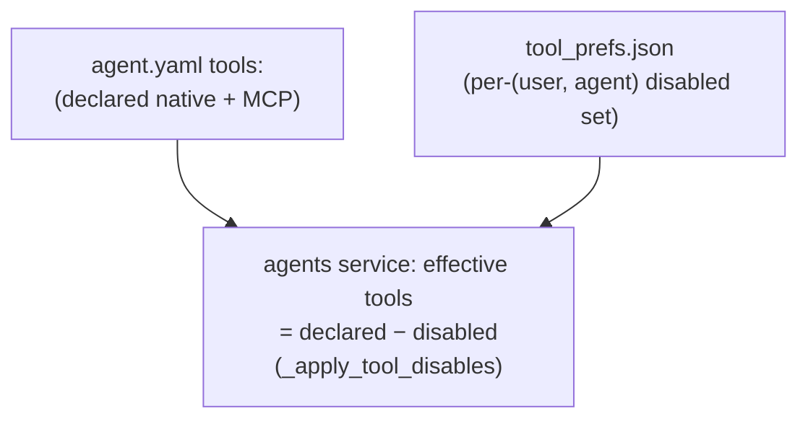

# Catalog

The catalog is the discovery layer that tells the frontend which agents and tools are available at any given moment. `dialogue_bridge` exposes three endpoints under `/v1/catalog`: one for agents (backed by an in-memory cache synced from the agents service), one for tools (always fetched fresh from the agents service, which aggregates them from the MCP gateway), and one that generates personalized conversation starter suggestions via an LLM call. On page load the frontend fetches both lists in parallel, merges them with any previously cached snapshot from IndexedDB, and uses the result to populate the agent selector and the **read-only** MCP Servers browse tab. The catalog is purely informational for tools: an inference request carries only the selected agent UUID — it does **not** carry a tool list. Tool enablement is owned by the agents service (declared per agent in `agent.yaml`, disabled per (user, agent) in Settings → Agents), not computed from the catalog and sent per request. See [user-preferences.md § Tool control moved to the Agents tab](user-preferences.md#tool-control-moved-to-the-agents-tab).

---

## Services Involved



---

## Full Sequence — Startup Catalog Load



---

## Phase 1 — Agent Catalog

### Backend: in-memory cache + sync

The agents endpoint uses an in-memory dictionary (`_AGENT_CACHE`) keyed by agent UUID. On every `GET /v1/catalog/agents` call the handler calls `get_cached_agents()`. If the cache is populated, it returns immediately. If the cache is empty (first call after restart, or after a sync error), it triggers `sync_agents_with_service(db)`:



**Sync logic:**

- Each agent in the manifest is upserted into `AgentTable` (`is_active = true`)
- Any agent in the DB that is *not* in the manifest is set `is_active = false`
- The in-memory cache is repopulated with only `is_active = true` agents
- If the agents service is unreachable, the endpoint returns 503

**Cache properties:**

- No TTL — the cache persists until the process restarts or a sync is triggered
- Only active agents are stored; inactive agents are absent from the cache
- The cache is also used by the inference system to resolve `agent_id → agent.slug` for constructing the stream URL

**Response shape:**

```json
[
  {
    "id": "550e8400-e29b-41d4-a716-446655440000",
    "name": "Research Agent",
    "description": "Researches and analyzes documents",
    "icon": "Search",
    "version": "1.0.0",
    "isActive": true
  }
]
```

All returned agents have `isActive: true`. The endpoint never returns inactive agents.

### Frontend: icon mapping and state

`getAgents()` in `api.ts` maps each response item to the frontend `Agent` type. The critical transformation is `icon`: the backend sends a Lucide icon name string (e.g., `"Search"`); the frontend calls `mapIcon()` to resolve it to the actual React component. This is why the frontend `Agent` type holds a `LucideIcon` component reference rather than a string.

```typescript
type Agent = {
  id: string;
  name: string;
  description: string;
  icon: LucideIcon;       // React component — NOT the string from the API
  iconName?: string;      // Original string preserved for serialization
  version?: string;
  isActive: boolean;
};
```

`iconName` is preserved separately because `LucideIcon` components cannot be serialized to IndexedDB. The snapshot stores `iconName` and re-runs `mapIcon()` on hydration.

---

## Phase 2 — Tool Catalog

### Backend: no cache, always fresh

`GET /v1/catalog/tools` proxies directly to the agents service on every request. There is no server-side caching.

The agents service opens an SSE connection to the MCP gateway on each tool fetch, reads the full tool manifest, closes the connection, and returns the list. The dialogue_bridge forwards the result as-is.

**Why no cache?** MCP servers can come online or go offline at any time. A stale tool cache would show tools that are currently unavailable, causing inference failures when the agent tries to call them.

**Response shape:**

```json
[
  {
    "server_id": "arxiv-mcp-server",
    "tool_name": "search_arxiv",
    "description": "Search for academic papers on arXiv",
    "parameter_count": 4
  },
  {
    "server_id": "tavily",
    "tool_name": "tavily_search",
    "description": "Web search via Tavily",
    "parameter_count": 3
  }
]
```

The frontend maps `server_id → serverId` and `tool_name → toolName` (camelCase keys).

```typescript
type ToolMetadata = {
  serverId: string;
  toolName: string;
  description: string;
  parameterCount: number;
};
```

### MCP gateway tool registration

Tools are registered in two files in `src/mcp_gateway/`:

- **`mcp_catalog.yaml`** — the registry of available MCP server metadata (names, descriptions, tool lists, icons). Large file (~506 KB); used for discovery.
- **`mcp_config.yaml`** — runtime parameters for each server (e.g., `storage_path` for the arxiv server).
- **`mcp_secret.env`** — API keys for MCP tools (e.g., Tavily API key); not checked into version control.

### Tool search

There is **no backend search endpoint** for tools. Filtering is done entirely on the client. When the user types in the tool search box, the frontend filters `availableTools` in memory by name and description substring match. The full tool list is always loaded upfront.

---

## Phase 3 — Suggestions

`GET /v1/catalog/{userId}/suggestions` generates personalized conversation starter ideas.

**Inputs:**

- `userId` — validated against the authenticated session
- `agentId` (optional query param) — if provided, fetches agent context to make suggestions relevant to that agent

**Backend logic:**

1. Fetch the 8 most recent **non-private** conversations for the user
2. If `agentId` is provided, fetch the agent's name and description from the DB
3. Pass the conversation list (titles, last message, agent names) and agent context to `generate_conversation_suggestions()`, which calls the LLM
4. Return 1–10 unique, trimmed suggestion strings

**Response:**

```json
{ "suggestions": ["What were the main findings?", "Can you summarize the methodology?"] }
```

**When called:** When the user opens a new chat window. The frontend calls `getSuggestions(userId, selectedAgentId)` and renders the result as clickable starter chips. If `suggestionsEnabled` is `false` in user preferences, the frontend skips the call entirely and renders nothing.

---

## Phase 4 — Frontend Startup Hydration

The catalog is loaded as part of `useAuthRehydrateEffect`, which runs once after a successful session restore. The flow is designed to show a working UI immediately (from IndexedDB snapshot) while refreshing stale data in the background.



Agents are **always** re-fetched even if the snapshot has them — because an agent may have been added or removed since the last load. Tools and preferences are only fetched if not already in the snapshot (optimization to reduce startup API calls).

---

## Phase 5 — From Catalog to Inference Request

Only the selected agent flows into an inference request — the tool list does not. Here is the complete mapping:

### Agent selection → stream URL



The frontend always works with agent UUIDs. The `slug` (the URL path segment used to route to the correct agent class) lives only in the backend database, populated during the agent sync.

### Tools → resolved by the agent, not sent by the client

The catalog's tool list is **display-only**. It populates the read-only MCP Servers browse tab and gives the Agents tab the names to render, but the frontend no longer computes an `enabledTools` list and no inference request carries one. The bridge does not forward a `config["tools"]` list to the agents service.



Tool resolution happens entirely on the agents service when a `YamlDeepAgent` is built: it reads the tools declared in the agent's `agent.yaml` and subtracts the owner's disabled set from `tool_prefs.json`. An empty request tool list is meaningless now — the agent never depended on the client to tell it which tools to attach. LangGraph agents (`hr_policies` / `orthodox` / `retail`) reach RAG through a graph node over HTTP, so they carry no tool set at all.

### Full inference request shapes

**New conversation inference start:**

```json
{
  "mode": "new",
  "agentId": "550e8400-e29b-41d4-a716-446655440000",
  "isPrivate": false,
  "message": {
    "sender": "user",
    "type": "text",
    "content": "Search for recent ML papers",
    "attachments": []
  }
}
```

**Existing conversation inference start:**

```json
{
  "mode": "send",
  "conversationId": "conv-uuid",
  "parentMessageId": "msg-uuid",
  "messagePath": ["msg-uuid-1", "msg-uuid-2"],
  "message": {
    "sender": "user",
    "type": "text",
    "content": "Use the search tools for this",
    "attachments": []
  }
}
```

Edit, retry, and shared conversation continuation use the same `/start` endpoint with `mode: "edit"`, `mode: "retry"`, or `mode: "shared_continue"`. The bridge persists the user-side action and AI placeholder before launching the run, so the frontend does not call conversation/message persistence APIs separately for inference starts.

---

## Phase 6 — Caching Summary

| Data | Backend cache | Frontend cache | Refresh trigger |
| --- | --- | --- | --- |
| Agents | In-memory `_AGENT_CACHE` (no TTL) | IndexedDB snapshot | Process restart; empty cache on first request |
| Tools | None | IndexedDB snapshot | Every page load if not in snapshot |
| Suggestions | None | None | Every new-chat open |
| Selected agent | — | IndexedDB `selectedAgent` (UUID) | On agent change |

---

## Sharp Edges and Behavioral Notes

- **Agents are synced lazily, not on a schedule.** The sync from the agents service only happens when the cache is empty. If an agent is added or removed while the dialogue_bridge process is running, the change is not visible until the process restarts (or the cache is cleared). There is no periodic background sync.

- **The icon string from the backend must be mapped before use.** The backend stores and returns icon names as plain strings (`"Search"`, `"Building2"`). These are meaningless to React until `mapIcon()` resolves them to `LucideIcon` components. If an unknown icon name is received, `mapIcon()` falls back to a default icon silently.

- **IndexedDB snapshots store `iconName`, not the component.** React components cannot be serialized. On hydration, the snapshot restores `iconName` and re-runs `mapIcon()`. If a new agent with an unrecognized icon name appears between sessions, the snapshot will restore correctly (default icon) rather than crashing.

- **Tool search is entirely client-side.** There is no `GET /catalog/tools/search` endpoint. The full tool list is always loaded, and filtering is a local substring match. For deployments with very large MCP tool catalogs, this could become slow.

- **Tools are fetched on every load, agents are not.** This asymmetry is intentional: agent availability changes infrequently (requires a service redeploy), while MCP tool availability changes with server uptime. Accepting stale agent data for a session is acceptable; stale tool data would silently fail inference calls.

- **If the agents service is down, the catalog 503s and the UI shows no agents.** If the IndexedDB snapshot has a stale agent list, the UI will briefly show it and then overwrite it with an empty list when the fresh fetch fails. There is no "use stale data on error" fallback for the agents fetch.

- **Tool enablement is not in the request path at all.** No `enabledTools` list is computed by the frontend or sent to the bridge; the agents service resolves an agent's tools from its `agent.yaml` declaration minus the per-(user, agent) disabled set. If a declared tool's MCP server is currently offline, the agent still tries to call it and gets a tool execution error — the catalog is not a pre-flight availability check.

- **A conversation is permanently bound to an agent UUID.** The `agentId` is written to the `conversations` table at creation time and never changes. If the agent is later removed from the service and deactivated, the conversation record still references it. The inference flow will fail for that conversation until a different agent is selected.

---

## File Map

| Concept | File | What to look for |
| --- | --- | --- |
| Catalog endpoints | [src/dialogue_bridge/router/catalog.py](../../src/dialogue_bridge/router/catalog.py) | `GET /agents`, `GET /tools`, `GET /{userId}/suggestions` handlers |
| Agent sync + cache | [src/dialogue_bridge/utils/agents.py](../../src/dialogue_bridge/utils/agents.py) | `_AGENT_CACHE`, `get_cached_agents()`, `sync_agents_with_service()`, `prime_agent_cache()` |
| Agent DB table | [src/dialogue_bridge/core/database/models.py](../../src/dialogue_bridge/core/database/models.py) | `AgentTable`, `is_active` column |
| Pydantic schemas | [src/dialogue_bridge/schemas/\_\_init\_\_.py](../../src/dialogue_bridge/schemas/__init__.py) | `AgentPublic`, `ToolManifest` |
| Suggestion generation | [src/dialogue_bridge/utils/conversations.py](../../src/dialogue_bridge/utils/conversations.py) | `generate_conversation_suggestions()` |
| MCP catalog registry | [src/mcp_gateway/mcp_catalog.yaml](../../src/mcp_gateway/mcp_catalog.yaml) | registered MCP servers and tool lists |
| MCP server config | [src/mcp_gateway/mcp_config.yaml](../../src/mcp_gateway/mcp_config.yaml) | runtime parameters per server |
| Frontend API calls | [src/agentic_ui/src/lib/api.ts](../../src/agentic_ui/src/lib/api.ts) | `getAgents()`, `getTools()`, `getSuggestions()` |
| Frontend types | [src/agentic_ui/src/lib/types.ts](../../src/agentic_ui/src/lib/types.ts) | `Agent`, `ToolMetadata` (the `ToolPreference` type was deleted) |
| Icon mapping | [src/agentic_ui/src/lib/consts.ts](../../src/agentic_ui/src/lib/consts.ts) | `mapIcon()`, icon name → LucideIcon lookup |
| Startup hydration | [src/agentic_ui/src/hooks/useSessionEffects.ts](../../src/agentic_ui/src/hooks/useSessionEffects.ts) | `useAuthRehydrateEffect`, parallel catalog fetches |
| IndexedDB snapshot | [src/agentic_ui/src/lib/uiStateStorage.ts](../../src/agentic_ui/src/lib/uiStateStorage.ts) | `UISnapshotSerializable`, `agents`, `availableTools` fields |
| Inference request building | [src/agentic_ui/src/runtime/inference.ts](../../src/agentic_ui/src/runtime/inference.ts) | `agentId` and start-mode payloads (no tool list is computed or sent) |
