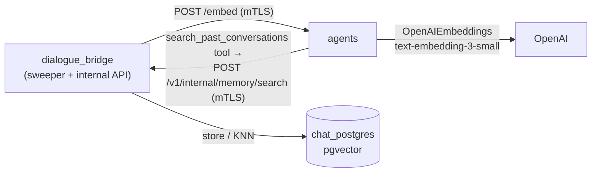
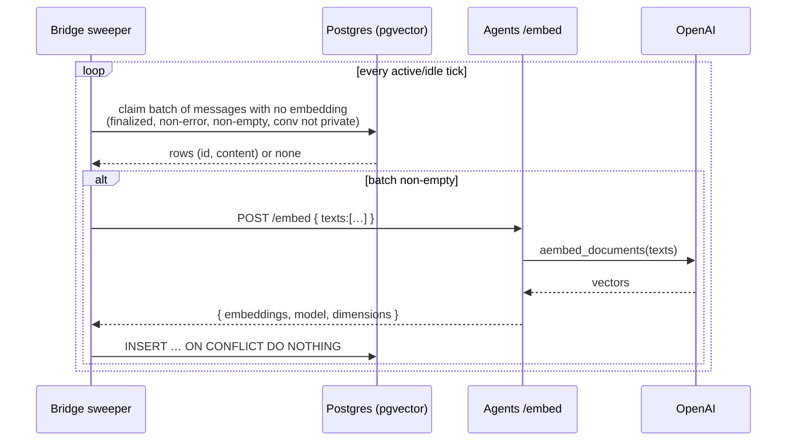

# Conversation Embeddings & Semantic Search

Every message is embedded into a vector so the platform can answer "which of this user's past conversations are most relevant to *this* query?" — the foundation for cross-chat retrieval and memory. Embeddings live in Postgres via **pgvector** (`message_embeddings`, one row per message). The dialogue_bridge holds no OpenAI key, so it generates embeddings the same way it proxies realtime voice: by calling the **agents** service (`POST /embed`), which embeds with OpenAI and returns the vectors over the internal hop. Generation happens entirely off the request path — a background **sweeper** in the bridge embeds messages that don't have a vector yet, which transparently covers both newly-created messages and the historical backfill. Retrieval embeds the query, runs a cosine KNN over the vectors, and rolls the nearest messages up to their conversations, strictly scoped to the requesting user and excluding private chats.

---

## Services Involved

There is **no UI** for this. The pgvector index is consumed by an **agent tool**
(`search_past_conversations`), which deep agents get when the user opts in
(`search_past_convs` preference, default off), so the model can pull
up the user's relevant past messages mid-reasoning. The agents service reaches the
bridge-owned index through an internal, browser-denied endpoint.

---

## Embedding Sweep — Full Sequence

How a message goes from "just created" to "searchable". The sweeper is the only writer of `message_embeddings`.

---

## Phase 1 — Storage model

Each message gets its **own** vector (one per message, not one per conversation), stored in a dedicated `message_embeddings` table rather than a column on `messages`. Keeping it separate keeps the hot `messages` table lean and lets embeddings be regenerated or model-versioned without touching message rows. The vector is `vector(1536)` — `text-embedding-3-small`'s output, chosen because 1536 ≤ pgvector's 2000-dim ceiling for HNSW/IVFFlat indexes (the larger `text-embedding-3-large` is 3072 and could be stored but not HNSW-indexed without `halfvec`).

| Key fact | Value / detail |
| --- | --- |
| Table | `message_embeddings` (PK `message_id`, FK → `messages.id` CASCADE) |
| Vector type | `vector(1536)` — cosine |
| Index | `ix_message_embeddings_hnsw` — HNSW `vector_cosine_ops` (hand-written in migration `0010`) |
| Extension | `vector` (image `pgvector/pgvector:pg16`); enabled by migration `0010` |
| Dimension source of truth | agents `EMBEDDING_DIMENSIONS` = `MessageEmbeddingTable.EMBEDDING_DIMENSIONS` = migration `0010` `_DIMENSIONS` = **1536** |

---

## Phase 2 — Generation (the sweeper)

Embeddings are produced by a background loop (`run_embedding_sweeper`) started in the bridge lifespan, **not** by hooks in the inference path. Each pass claims a batch of messages that have no embedding row yet — defined purely by a `LEFT JOIN … IS NULL` — embeds them in one `/embed` call, and upserts. Because eligibility is "row without a vector", the *same* mechanism handles fresh messages (picked up within seconds) and the entire historical backfill (drained newest-first behind them), and it is self-healing: a failed pass leaves the rows unembedded so they're retried next tick. This deliberately decouples embedding from the request/streaming path — nothing a user does ever blocks on or waits for an embedding.

| Key fact | Value / detail |
| --- | --- |
| Eligibility | `content` non-null/non-empty · `is_error = false` · `streaming_status IS NULL OR = 'completed'` · conversation `is_private = false` |
| Ordering | `created_at DESC` — recent conversations become searchable first |
| Batch / cadence | `EMBEDDINGS_SWEEPER_BATCH_SIZE` (64) · active `0.75s` / idle `8s` between passes |
| Idempotency | `INSERT … ON CONFLICT (message_id) DO NOTHING` |
| Content cap | first `EMBEDDINGS_MAX_CHARS_PER_MESSAGE` (8000) chars per message |
| Disable switch | `EMBEDDINGS_ENABLED=false` → the loop is a no-op |

---

## Phase 3 — Retrieval (the agent tool)

A deep agent can be given a built-in tool, **`search_past_conversations`**, so the model can recall the user's earlier context on demand. It is **opt-in**: attached only when the user enabled the `search_past_convs` preference (default off — see [user-preferences](user-preferences.md)), which the bridge threads into the run config as `context.search_past_convs`. When called, the tool POSTs to the bridge's internal `/v1/internal/memory/search`, which embeds the query through the same `/embed` path and runs `ORDER BY embedding <=> :query` (cosine, HNSW-served) over the user's non-private message embeddings — returning the nearest **individual messages** (not a conversation roll-up), each with its conversation title, who said it, the message's created/updated dates, and a similarity score. The current conversation is excluded so the tool surfaces *other* chats the agent isn't already holding in context.

The tool is built **per run**, closing over the current `user_id` + `conversation_id` (from `BaseAgent.self.context`). That's safe because each request builds its own agent instance and compiled graph — nothing is shared across users — so the bound `user_id` can never leak. The bridge owns `chat_db`, so the agent reaches the index through this internal hop rather than touching the DB directly.

| Key fact | Value / detail |
| --- | --- |
| Tool | `search_past_conversations(query, limit=5)` — attached by `DeepAgent._builtin_tools()` **only when** `context.search_past_convs` is true (user opt-in) |
| Endpoint | `POST /v1/internal/memory/search` (auth: `require_internal_caller` — internal proxy secret + **denied at nginx**) |
| Caller | agents service over the internal mTLS hop (`DIALOGUE_BRIDGE_URL`); `user_id`/`conversation_id`/`search_past_convs` come from the run config |
| Max results | `EMBEDDINGS_TOOL_MAX_LIMIT` (20); per-message content capped at `EMBEDDINGS_TOOL_MESSAGE_MAX_CHARS` (800) |
| Scope | `conversations.user_id = run user AND is_private = false AND conversation_id <> current` (enforced in SQL) |
| Result shape | `MemoryMessageMatch` — `messageId`, `conversationId`, `conversationTitle`, `sender`, `content`, `score`, `createdAt`, `updatedAt` (the matched **message's** timestamps) |

---

## Sharp Edges and Behavioral Notes

- **The internal endpoint is fenced two ways.** `require_internal_caller` demands the shared proxy secret, but nginx injects that same secret on browser traffic — so `/api/v1/internal/` is **also returned 404 at the nginx edge**. The agents service calls the bridge directly on the `backend` network (never through nginx), so the endpoint stays strictly server-to-server. Removing the nginx deny would re-open an IDOR (any browser could pass any `user_id`).
- **Reverse hop.** This is the one `agents → bridge` call (every other HTTP hop runs the other way). It reuses the agents service's existing internal mTLS client cert + proxy secret; no new certs. `DIALOGUE_BRIDGE_URL` must point at the bridge (`https://dialogue_bridge:8002` in prod, `http://` locally).
- **Per-run tool binding.** `search_past_conversations` captures `user_id` at build time, relying on the invariant that agent instances + graphs are per-request (see `router/inference.py` → `definition.cls(config=req.config)`). If graph caching is ever made cross-request, switch the tool to read `user_id` from `get_context()` instead, or it would leak across users.
- **Private conversations are excluded twice.** The sweeper never embeds a private conversation's messages (`c.is_private = false` in the claim), and the search query filters `is_private = false` again — so even if a conversation were toggled private after its messages were embedded, those vectors can never surface in results.
- **Embeddings lag, by design.** A new message is searchable within a sweep tick (seconds), not instantly. This is intentional: embedding is fully off the request path, so streaming/latency is never affected. Don't add inline embedding hooks expecting real-time freshness.
- **First-boot `ConnectError` is normal.** If the bridge's sweeper runs before the agents service is ready, the pass logs `embedding_sweeper_embed_failed (ConnectError)` and simply retries on the next tick — no rows are lost.
- **Vectors are bound as text + `CAST(... AS vector)`.** The bridge never reads raw vectors back into Python, so it intentionally avoids the asyncpg `register_vector` codec; vectors are sent as `'[…]'` literals and cast in SQL. Keep it that way unless you start selecting the `embedding` column into the app.
- **Dimension is fixed at DDL time.** Changing the model/dimension means a new migration *and* a full re-embed (truncate `message_embeddings` and let the sweeper refill). The three dimension constants must move together.
- **No backwards re-embed on model swap.** The `model` column records which model produced each vector; a future model change can re-embed selectively by filtering on it rather than wiping everything.
- **Postgres image is load-bearing.** pgvector requires `pgvector/pgvector:pg16` (same PG16 base as before, so the data volume is unaffected). On a stock `postgres:16.x` image, migration `0010`'s `CREATE EXTENSION vector` fails and the bridge won't boot.

---

## File Map

| Concept | File | What to look for |
| --- | --- | --- |
| Embed endpoint (provider call) | [src/agents/router/embeddings.py](../../src/agents/router/embeddings.py) | `POST /embed`, `OpenAIEmbeddings.aembed_documents` |
| Embed request/response schema | [src/agents/schemas.py](../../src/agents/schemas.py) | `EmbedRequest`, `EmbedResponse` |
| Embedding model config (agents) | [src/agents/core/settings.py](../../src/agents/core/settings.py) | `RuntimeModelsSettings.embedding`, `embedding_dimensions` |
| Agent memory tool | [src/agents/runtime/tools/memory_search.py](../../src/agents/runtime/tools/memory_search.py) | `build_memory_search_tool`, `search_past_conversations` |
| Tool injection into deep agents | [src/agents/runtime/abstractions/deep_agent.py](../../src/agents/runtime/abstractions/deep_agent.py) | `DeepAgent._builtin_tools`, `build_deep_agent(tools=...)` |
| Bridge URL config (agents) | [src/agents/core/settings.py](../../src/agents/core/settings.py) | `BridgeSettings.memory_search_url`, `DIALOGUE_BRIDGE_URL` |
| Sweeper + message search + agents client | [src/dialogue_bridge/utils/embeddings.py](../../src/dialogue_bridge/utils/embeddings.py) | `run_embedding_sweeper`, `search_user_messages`, `embed_texts` |
| ORM model | [src/dialogue_bridge/core/database/models.py](../../src/dialogue_bridge/core/database/models.py) | `MessageEmbeddingTable`, `EMBEDDING_DIMENSIONS` |
| Migration | [src/dialogue_bridge/migrations/versions/0010_message_embeddings.py](../../src/dialogue_bridge/migrations/versions/0010_message_embeddings.py) | `CREATE EXTENSION`, table, HNSW index |
| Internal search endpoint | [src/dialogue_bridge/router/internal_memory.py](../../src/dialogue_bridge/router/internal_memory.py) | `searchUserMemory` (`POST /v1/internal/memory/search`) |
| Internal-caller guard | [src/dialogue_bridge/core/security/internal_trust.py](../../src/dialogue_bridge/core/security/internal_trust.py) | `require_internal_caller` |
| nginx edge deny | [src/agentic_ui/nginx.conf.template](../../src/agentic_ui/nginx.conf.template) | `location ^~ /api/v1/internal/` |
| Pipeline config (bridge) | [src/dialogue_bridge/core/settings.py](../../src/dialogue_bridge/core/settings.py) | `EmbeddingsSettings`, `HttpTimeoutSettings.embeddings_timeout` |
| Sweeper lifecycle | [src/dialogue_bridge/main.py](../../src/dialogue_bridge/main.py) | lifespan: `run_embedding_sweeper` start/stop |
| Request / result schemas | [src/dialogue_bridge/schemas/__init__.py](../../src/dialogue_bridge/schemas/__init__.py) | `MemorySearchRequest`, `MemoryMessageMatch` |
