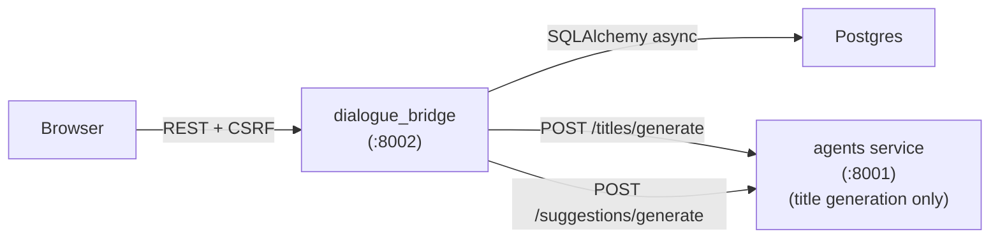
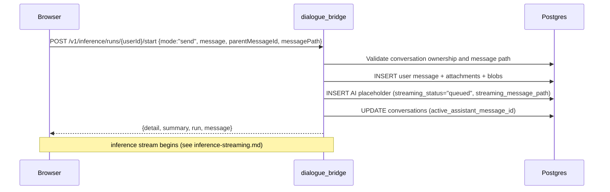
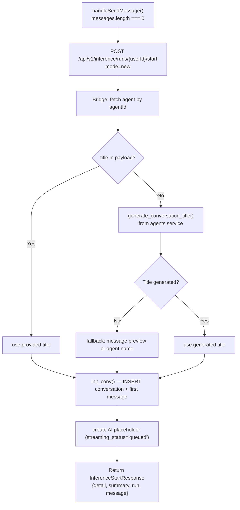
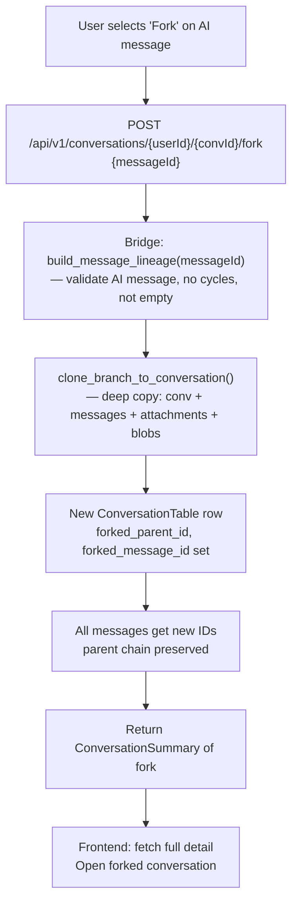
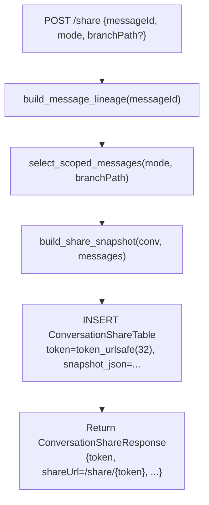
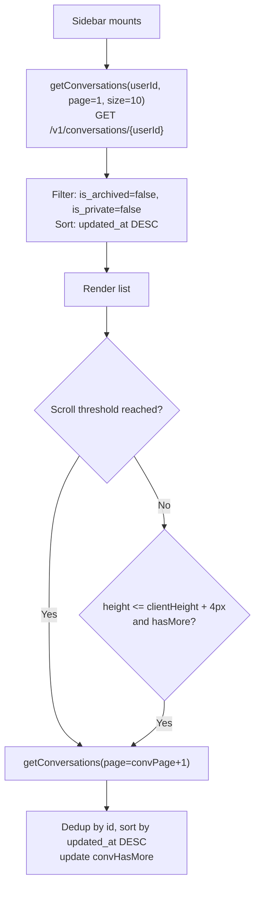

# Conversation Management

A conversation is the top-level container for every chat session — it owns a message tree, belongs to one user and one agent, and carries metadata for sidebar display, privacy, archiving, sharing, and reporting. The message tree is a self-referencing structure (each message has a `parent_message_id`) that supports branching: editing a user message or retrying an AI response creates a sibling rather than overwriting the existing row. All CRUD, branching, sharing, and export operations are served by the dialogue bridge; the UI aggregates state across three paginated lists (active, archived, shared).

---

## Client-side routing — the URL is the source of truth

The browser URL decides which view is shown. `App.tsx` is a **layout route**: a persistent `ChatShell` ([pages/ChatPage.tsx](../../src/agentic_ui/src/pages/ChatPage.tsx)) wraps an `<Outlet/>` and **never unmounts** across the chat routes; only the routed view inside it changes:

| Route | View (in the shell's `<Outlet/>`) |
| --- | --- |
| `/` | [`ChatView`](../../src/agentic_ui/src/pages/ChatView.tsx) — empty **new-chat** state |
| `/c/:conversationId` | `ChatView` — that conversation |
| `/tasks` | [`TasksView`](../../src/agentic_ui/src/pages/TasksView.tsx) — the scheduled-tasks page (see [scheduled-tasks.md](scheduled-tasks.md)) |
| `/login`, `/share/:token`, … | their own pages |

The shell's workspace logic lives in the `useChatWorkspace` hook; shared state is in the Zustand `workspaceStore` and the per-render bundle is read by the views via `useChatWorkspaceContext()` (see [architecture/overview.md](../architecture/overview.md#state-architecture--routing)). `SharedConvPage` renders `<ChatShell><ChatView/></ChatShell>` directly for full shared conversations.

**One generation-guarded effect in `useChatWorkspace` keyed on `useParams().conversationId` owns all conversation loading.** It is intentionally never blocked:

- Every navigation bumps a `loadGenRef` counter; a slower, superseded `getConversationDetail` fetch drops its own result (`gen !== loadGenRef.current`). Rapid `A→B→C` switching always converges to the last route — there is **no `if (loadingConversation) return` guard** (that guard, plus the old click-handler `setTimeout` choreography, was the bug that made mid-animation switches silently stall).
- No `:conversationId` (`/` or `/tasks`) → conversation-scoped state is erased synchronously (no timers). Leaving a conversation fully clears it; **Back re-fetches** from the route.
- Selecting a sidebar row, New chat, fork, and open-task-result are all just `navigate(...)` calls; the effect reacts. Browser **back/forward work for free**.
- A conversation created from `/` (first message sent) is promoted into the URL by a small effect (`navigate('/c/:id', { replace:true })`); the load effect short-circuits (id already current) instead of refetching.
- **Voice mode is URL-less** — in-component state on whatever conversation is current; it is force-closed on every navigation (see [voice-mode.md](voice-mode.md)).
- Background inference runs are **not** stopped on navigation (they persist in `useInferenceRuns`, keyed by conversation id); returning to `/c/:id` reattaches the live run via the branch-snap below.

There is no `lastConversationId` auto-resume any more — refreshing on `/c/:id` resumes that conversation because the URL carries it; the bare `/` always loads empty.

---

## Services Involved



---

## Full Sequence — Send Message (Existing Conversation)



---

## Phase 1 — Conversation Creation

Normal chat starts are owned by the inference endpoint. For `mode: "new"`, the bridge creates the conversation, first user message, AI placeholder, and inference run in one committed flow, then returns hydrated conversation state.



**Request shape:**

```json
{
  "mode": "new",
  "agentId": "...",
  "isPrivate": false,
  "title": null,
  "message": {
    "sender": "user",
    "type": "text",
    "content": "Hello",
    "parentMessageId": null,
    "attachments": []
  }
}
```

**Title generation** — `generate_conversation_title()` calls the agents service `POST /titles/generate` with the first message content. If the agents service is unavailable or returns no title, the bridge falls back to: first 200 chars of the message content → agent name → `"New conversation"`.

**`agent_name` denormalization** — the agent's label is stored directly on the `ConversationTable` row (and on each AI message). This survives agent renames/deactivation: messages always show the name the user saw at the time.

**Per-message agent** — the agent is chosen per message, not per conversation. Each AI message records the agent that produced it (`messages.agent_id` + `agent_name`) and renders that agent's name + icon in its action bar, so a single conversation can mix agents. `conversations.agent_id` is a last-used pointer (updated to each new run's agent) used for the sidebar/header default and to seed the header picker on conversation switch. Switching the header agent picker no longer clears the chat — it sets the agent the next message goes to, in the same conversation. Forking clones each message's `agent_id`/`agent_name`, preserving mixed-agent threads. See [inference-streaming.md](inference-streaming.md) for how each run resolves its agent (`new`/`send` use the selected agent; `edit`/`retry` inherit the original branch's agent).

**Response** — the bridge returns both `ConversationDetail` (full message list, used to populate the chat view immediately) and `ConversationSummary` (sidebar entry). The frontend appends the summary to the top of the conversation list and sorts by `updated_at DESC`.

---

## Phase 2 — Message Threading and Branching

Every message in a conversation is connected to its predecessor via `parent_message_id`. The root message has `parent_message_id = NULL`. The full history is a tree, not a list; the UI maintains a `branchSelections` map (`parentId → child index`) to track which branch is visible at each fork point.

### Adding a Message

`POST /v1/messages/{user_id}/{conversation_id}` — `init_message()` validates that `parent_message_id` (if provided) belongs to the same conversation, inserts the row, then updates `last_message_preview` and `last_message_at` on the conversation.

**Attachments** — each `AttachmentIn` becomes an `AttachmentTable` row linked to the message. Binary data is stored in a separate `BlobTable` row (`LargeBinary` column). Images are base64-encoded into the response payload so the UI can render them inline without a separate fetch.

### Editing a User Message

When a user edits a message, the UI does not `PATCH` the existing row. Instead it calls the backend-owned inference start endpoint with `mode: "edit"`:

1. The payload includes `conversationId`, `targetMessageId`, and the edited user `message`.
2. The bridge validates that `targetMessageId` is a user message in the conversation.
3. The bridge creates a sibling user message under the original parent.
4. The same transaction creates the AI placeholder and queued run under that new user message.
5. The UI hydrates from the returned `detail`, `summary`, `run`, and `message`.

The original message is preserved. The user can navigate between branches using the branch selector arrows in the UI.

### Retrying an AI Response

`handleRetryAiMessage(message)` calls the inference start endpoint with `mode: "retry"` and the AI `targetMessageId`. The bridge validates that the target is an AI message, uses its parent user message as the run parent, and creates only a new AI placeholder sibling plus the run. No new user message is created for retry.

### Branches and Durable Checkpoint Threads

Each branch is backed by its own durable LangGraph checkpoint thread in the agents-service `agent_runtime` database, recorded on the AI message as `checkpoint_thread_id`. `create_inference_run_record(mode=...)` allocates the thread per mode:

- **`send`** — inherits the leaf AI message's `checkpoint_thread_id` (the nearest committed AI ancestor), so a continuation resumes the same branch's durable state.
- **`new`** — mints a fresh thread (a brand-new conversation has no committed checkpoint).
- **`edit` / `retry`** — mint a **fresh** thread and **copy-on-fork**: the stream config carries `fork_from: {thread_id, checkpoint_id}` pointing at the parent branch's committed checkpoint, and the agents `/stream` endpoint seeds the new thread from that checkpoint (`seed_thread_from_checkpoint`) before running. The new branch starts from the parent's state but never mutates it.

A branch with no committed checkpoint yet (new conversation, pre-migration branch, `shared_continue`, or a never-committed fork target) takes the full-history cold-seed path on its next turn, then becomes checkpoint-backed once the run commits its `checkpoint_id`. See [inference-streaming.md](inference-streaming.md) for the delta-vs-seed payload decision and the `CHECKPOINT_COMMITTED` capture-back.

### Branch Selection vs Active Runs

A run lives on a specific path through the message tree — `MessageTable.streaming_message_path` records the root-to-running-AI-message lineage, exposed to the frontend as `InferenceRun.messagePath`. When the user re-enters a conversation that has an active run, the run's branch may not be the default branch (e.g., they retried an AI message, putting the streaming reply on a sibling), so the default `branchSelections` (index 0 at every fork) would hide the running message.

`useInferenceRuns.deriveBranchSelectionsForActiveRun(detail)` walks `run.messagePath` against the fetched `messages` list and returns the `{parentId → childIndex}` map that puts the running message on the visible path. It's called in two spots in [`pages/ChatPage.tsx`](../../src/agentic_ui/src/pages/ChatPage.tsx):

1. **The URL-driven load effect** — when the route's `:conversationId` resolves to a fetched detail, right before `setCurrentConversation`. Combined with `hydrateConversationDetailFromLiveRun` (which overlays in-memory `rawEvents`/`content`/`plan`/`subagents`) the conversation opens on the running branch with the live state already populated. This single effect covers both clicking a sidebar row and a fresh page load / refresh on `/c/:id` (the old separate "session restore on mount" path is gone).
2. **`snappedRunIdRef`-guarded effect** — fires when `runsByConversation` populates *after* the conversation is already mounted (the race condition: on a refresh the conversation detail can arrive before `getActiveInferenceRuns` does, so the first snap runs with an empty map). The ref ensures the snap fires exactly once per run id — the user can then navigate branches manually without being snapped back.

After the initial snap there is no further branch override, so a brand-new run (e.g., next user turn) gets its own one-time snap when its run id first appears in `runsByConversation`.

---

## Phase 3 — Conversation Lifecycle Operations

### Archive and Unarchive

Archiving is a soft-delete — the conversation is hidden from the default list but not deleted. The bridge sets `is_archived=True` and `archived_at=now()` (unarchive reverses this). Archived conversations are served by a separate `GET /archived` endpoint and rendered in a distinct section of the sidebar.

### Rename

`PATCH /{user_id}/{conversation_id}/title { title }` — updates the `title` column. The frontend mirrors the rename into the open conversation detail view without a full refetch and re-sorts the sidebar.

### Delete

`DELETE /{user_id}/{conversation_id}` — cascades through messages → attachments → blobs via DB foreign key cascade. The bridge does not implement soft-delete for conversations: deletion is permanent and immediate.

**Checkpoint reap.** Conversation delete is the *only* time durable checkpoint threads are reaped (there is no time-based sweep — threads otherwise persist indefinitely). Before/alongside the DB cascade, the bridge collects the distinct `checkpoint_thread_id` values across the conversation's AI messages and calls the agents endpoint `POST /agents/{slug}/users/{user_id}/conversations/{conversation_id}/reap` with `{thread_ids: [...]}`. The agents service `adelete_thread`s each thread from the `agent_runtime` checkpoint DB and `rmtree`s the conversation's filesystem directory (uploaded input files + agent output artifacts — see [attachments.md](attachments.md)). A failed reap of one thread is logged and does not block the rest.

### Report

`POST /{user_id}/{conversation_id}/report { messageId?, reason, details? }` — at most one report per conversation is allowed (enforced by `uq_conversation_reports_conversation_id`). A second report attempt returns `409 CONFLICT`. The bridge sets `is_reported=True` and `reported_at=now()` on the conversation row.

| Field | Constraint |
| --- | --- |
| `reason` | Required, max 120 characters (truncated by Pydantic) |
| `details` | Optional, max 2000 characters (truncated by Pydantic) |
| `messageId` | Optional; if provided, validated to belong to this conversation |

---

## Phase 4 — Forking

Forking clones the branch ending at a selected AI message into a new standalone conversation.



`build_message_lineage()` walks the `parent_message_id` chain from the target message back to the root, collecting the branch. It validates that the target is an AI message and that the chain contains no cycles.

`clone_branch_to_conversation()` deep-copies every message in the lineage with fresh UUIDs. Attachment and blob rows are also deep-copied — the fork is fully independent; deleting the original conversation does not affect the fork's files.

The fork's `forked_parent_id` and `forked_message_id` columns record the origin for audit purposes but are not used for data access (SET NULL on parent deletion).

---

## Phase 5 — Sharing and Export

### Creating a Share Link

`POST /{user_id}/{conversation_id}/share { messageId, mode, branchPath?, expiresAt? }` — builds a frozen JSON snapshot and stores it in `ConversationShareTable.snapshot_json`. The snapshot is independent of the live conversation; future edits do not affect it.

**Share modes:**

| Mode | Messages included |
| --- | --- |
| `"full"` | All messages on the visible branch (uses `branchPath` if provided, else the lineage to `messageId`) |
| `"branch"` | Full lineage from root to `messageId` |
| `"message"` | Only `messageId` plus its preceding user message (single exchange) |



**Snapshot contents** — `build_share_snapshot()` produces a JSON object with:

- `title`, `shareMode`, agent metadata (`id`, `name`, `description`, `icon`, `version`, `isActive`)
- `messages[]` — each message with `id`, `parentMessageId`, `content`, `sender`, `type`, `liked`, timestamps, `thinking`, `plan`, `subagents`, `rawEvents`, `error`
- `attachments[]` per message — `id`, `name`, `mime`, `size`, `timestamp`, `data` (base64-encoded binary)

The share URL is `/share/{token}`. Accessing it calls `GET /v1/shared-conversations/{token}` which reads `snapshot_json` directly — no join to `conversations` or `messages`.

### Continuing a Shared Conversation

`POST /v1/inference/runs/{user_id}/start` with `mode: "shared_continue"` — imports the snapshot into the authenticated user's workspace as a new conversation, appends the first continuation user message, creates the AI placeholder/run, and starts inference. Returns `InferenceStartResponse`. After this point the conversation is owned by the authenticated user and editable; the original share snapshot is unaffected.

### Revoking a Share

`DELETE /{user_id}/{conversation_id}/share/{share_id}` — sets `is_active=False` and `revoked_at=now()`. The row is not deleted. The share URL returns a `404` or `410` for revoked shares; the snapshot data remains in the DB for audit purposes.

### PDF Export

`POST /{user_id}/{conversation_id}/share/export-pdf { messageId, mode, branchPath? }` — uses the same `select_scoped_messages()` logic as sharing, then calls `render_conversation_pdf()`. The PDF includes:

- Title, agent name, exported timestamp
- Each message with role, timestamp, content
- Markdown rendering (headings, code blocks with language tag, tables, task checkboxes, blockquotes, bullets, horizontal rules, footnotes)
- Image attachments embedded inline
- Page numbers in the footer

The response carries `Content-Disposition: attachment; filename="{sanitized_title}_{mode}.pdf"` and `Cache-Control: no-store`.

---

## Phase 6 — Sidebar and Pagination

The sidebar manages three independent paginated lists: active, archived, and shared conversations. Each uses a page size of 10 and loads more on scroll.



**Scroll trigger** — fires when `scrollTop + clientHeight >= scrollHeight - 16px`.

**Auto-load** — on mount, if the container is not tall enough to require scrolling and `hasMore=true`, the next page is loaded automatically.

**Deduplication** — when merging pages, items are deduplicated by `id` before updating the state list. This prevents duplicates if a conversation's `updated_at` changed between page loads (causing it to shift pages).

**Sort discipline** — after every mutating operation (rename, archive, new message, fork), the conversation list is re-sorted by `updated_at DESC`. This keeps the most recently active conversation at the top without a full refetch.

---

## Phase 7 — Suggestions

When a conversation reaches its first AI response, the bridge calls the agents service to generate suggested follow-up questions. `POST /suggestions/generate { user_input: [messages] }` returns `ConversationSuggestions { suggestions: [str] }`. These are rendered as clickable chips below the AI message. The feature can be disabled per-user via `UserPreferences.suggestions_enabled`.

---

## Sharp Edges and Behavioral Notes

- **Conversation deletion is immediate and irreversible.** There is no trash or grace period. Deleting a conversation cascades through all messages, attachments, and blobs in a single transaction. If the user navigates away mid-delete, the cascade is complete — nothing is left. The DB cascade does not reach the agents-service durable checkpoints or filesystem; the bridge issues a separate `reap` call to the agents service for those (see Delete above).

- **Edit/retry never mutate the parent branch's checkpoint.** A fresh `checkpoint_thread_id` is minted and seeded copy-on-fork from the parent's committed checkpoint, so sibling branches have fully independent durable state — consistent with the append-only message tree.

- **Branch orphaning on message delete.** If a message is deleted (e.g., via cascade from conversation delete), children with `parent_message_id` pointing at it are SET NULL. This orphans their branch chain — the children still exist in the DB but their lineage is severed. The UI may render orphaned messages incorrectly. In practice this only occurs during cascade deletion of the whole conversation.

- **`last_message_preview` is only updated when a preview exists.** The bridge checks `if preview` before updating `last_message_preview` on the conversation. An AI placeholder message with `content=NULL` does not update the preview; it remains the last user message's text until inference completes.

- **`isPrivate` conversations are excluded from all listing endpoints.** `GET /{userId}` and `GET /{userId}/archived` both filter `is_private=False`. There is no endpoint to list private conversations in the current implementation — they can only be accessed by direct ID if the client already knows the ID (e.g., navigating straight to its `/c/:conversationId` URL).

- **Share snapshots grow without bound.** `snapshot_json` is stored as a Postgres JSON column with no size cap. A conversation with 200 messages and large image attachments (base64-encoded inline) can produce a snapshot of tens of megabytes. There is no compression or external blob storage for snapshots.

- **Title generation is best-effort.** If the agents service is down, the conversation is created with a fallback title. There is no retry or deferred title generation — the title stays as the fallback until the user renames it manually.

- **Fork deep-copies blobs.** Each forked message's attachments and their binary blob data are fully duplicated. Two forks of a conversation with a 25 MB image attachment consume 3× the blob storage. There is no content-addressable deduplication.

- **`branchSelections` is in-memory UI state only.** The selected branch index per parent is not persisted. On page reload the UI defaults to the most recently created sibling (last `created_at ASC`). If the user was viewing an older branch, the view resets to the latest one. **Exception:** if the conversation has an active inference run, `deriveBranchSelectionsForActiveRun` pins the visible branch to the run's `messagePath` regardless of recency, so a HITL-paused run is always visible on entry.

- **Shared continuation always creates a new conversation through inference start.** Even if the authenticated user already has the original conversation, `mode: "shared_continue"` clones the shared snapshot into a separate owned copy, appends the continuation user message, creates the AI placeholder/run, and starts inference. The source share and copied conversation are not linked.

---

## File Map

| Concept | File | What to look for |
| --- | --- | --- |
| Conversation CRUD endpoints | [src/dialogue_bridge/router/conversations.py](../../src/dialogue_bridge/router/conversations.py) | All route handlers, `init_conv()`, `validate_convId_full()` |
| Message CRUD endpoints | [src/dialogue_bridge/router/messages.py](../../src/dialogue_bridge/router/messages.py) | `addMessage`, `updateMessage`, `likeMessage`, `dislikeMessage` |
| Share snapshot builder | [src/dialogue_bridge/utils/share_export.py](../../src/dialogue_bridge/utils/share_export.py) | `build_share_snapshot()`, `select_scoped_messages()`, `render_conversation_pdf()` |
| Message lineage builder | [src/dialogue_bridge/router/conversations.py](../../src/dialogue_bridge/router/conversations.py) | `build_message_lineage()`, `clone_branch_to_conversation()` |
| Title generation proxy | [src/dialogue_bridge/router/conversations.py](../../src/dialogue_bridge/router/conversations.py) | `generate_conversation_title()` call to agents service |
| Pydantic schemas | [src/dialogue_bridge/schema/](../../src/dialogue_bridge/schema/) | `ConversationIn`, `ConversationDetail`, `ConversationSummary`, `MessageIn`, `MessageOut`, `ConversationShareResponse` |
| Conversation ORM models | [src/dialogue_bridge/core/database/models.py](../../src/dialogue_bridge/core/database/models.py) | `ConversationTable`, `MessageTable` (incl. `checkpoint_thread_id` / `checkpoint_id`), `ConversationShareTable`, `ConversationReportTable` |
| Checkpoint-thread allocation per mode | [src/dialogue_bridge/utils/inference_runs.py](../../src/dialogue_bridge/utils/inference_runs.py) | `create_inference_run_record(mode=...)`, `nearest_committed_ai()` |
| Conversation reap (checkpoints + filesystem) | [src/agents/main.py](../../src/agents/main.py) | `reap_conversation()` route, `adelete_thread`, `delete_conversation_files` |
| Conversation API calls (frontend) | [src/agentic_ui/src/lib/api.ts](../../src/agentic_ui/src/lib/api.ts) | `createConversation`, `getConversations`, `deleteConversation`, `forkConversation`, `shareConversation`, `addMessageToConversation` |
| Conversation action handlers | [src/agentic_ui/src/handlers/conversations.ts](../../src/agentic_ui/src/handlers/conversations.ts) | `handleConversationSelect`, `handleForkConversation`, `handleDeleteConversation`, `clearChatAndStopThinking` |
| Send message flow | [src/agentic_ui/src/runtime/inference.ts](../../src/agentic_ui/src/runtime/inference.ts) | `handleSendMessage()` — new, existing, edit, retry, shared continuation start modes |
| Sidebar rendering | [src/agentic_ui/src/components/chat/ChatSidebar.tsx](../../src/agentic_ui/src/components/chat/ChatSidebar.tsx) | Scroll trigger, auto-load, rename inline edit, action menu |
| Conversation state | [src/agentic_ui/src/pages/ChatPage.tsx](../../src/agentic_ui/src/pages/ChatPage.tsx) | `currentConversation`, `conversations`, `branchSelections`, pagination state |
