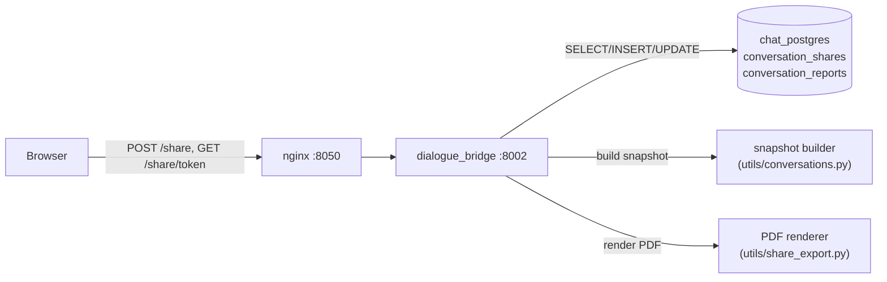
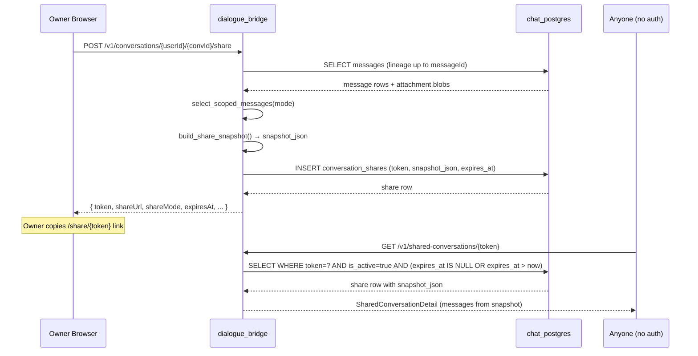
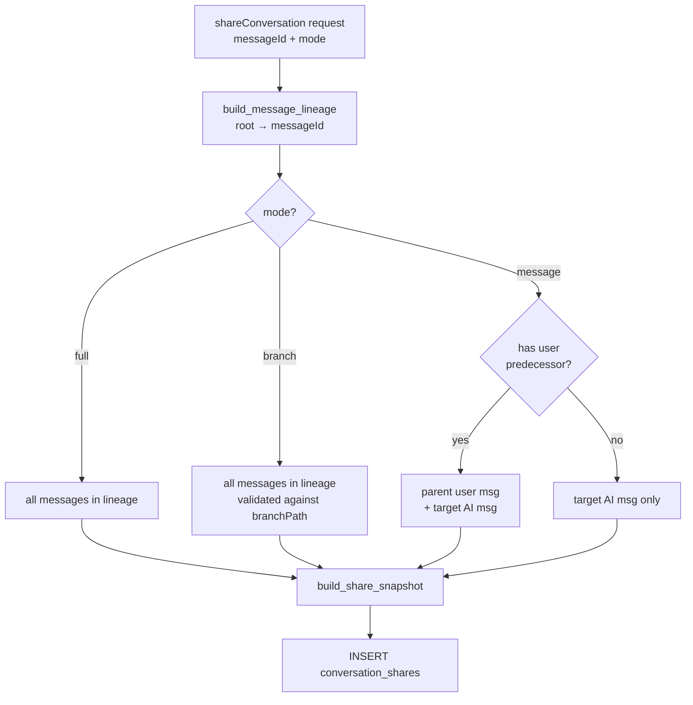
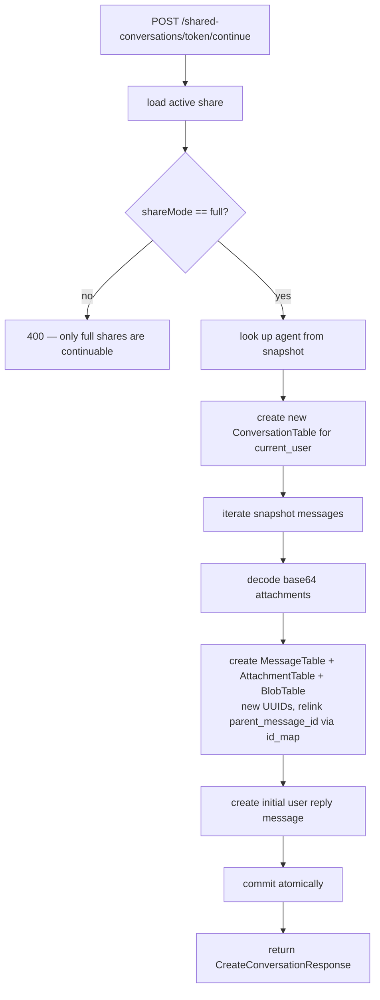

# Conversation Sharing

Conversation sharing lets an owner publish a frozen, read-only snapshot of a conversation (or a subset of it) via a token-bearing URL. The snapshot is self-contained — it embeds all message content and attachment data — so the share remains stable even if the original conversation is later edited or deleted. Recipients can view the share without authentication; authenticated users can fork the snapshot into their own workspace and continue the conversation. Owners can revoke shares at any time and set an expiration date up to one year in the future. A separate, lighter-weight report mechanism lets users flag conversations for moderation without creating a public link.

---

## Services Involved



---

## Full Sequence — Create and View a Share



---

## Phase 1 — Database Tables

### conversation_shares

| Column | Type | Default | Description |
| --- | --- | --- | --- |
| `id` | String (UUID) | `gen_uuid()` | Row PK |
| `token` | String | `token_urlsafe(32)` | URL-safe random token; UNIQUE, INDEXED |
| `conversation_id` | String (FK) | — | Source conversation; CASCADE delete; INDEXED |
| `owner_user_id` | String (FK) | — | Share creator; CASCADE delete |
| `snapshot_until_message_id` | String (FK) | — | Last message included; SET NULL on message delete; INDEXED |
| `title` | String | `null` | Conversation title at share creation |
| `snapshot_json` | JSON | — | Frozen snapshot (messages + attachments); NOT NULL |
| `is_active` | Boolean | `true` | `false` after revocation |
| `revoked_at` | DateTime | `null` | Revocation timestamp |
| `expires_at` | DateTime | `null` | Expiry timestamp; `null` = never expires; INDEXED |
| `created_at` | DateTime | `now()` | Creation timestamp |
| `updated_at` | DateTime | `now()` | Last update timestamp |

Multiple shares per conversation are allowed — there is no unique constraint on `conversation_id`. A conversation can have several active links with different scopes or expiration dates simultaneously.

### conversation_reports

| Column | Type | Default | Description |
| --- | --- | --- | --- |
| `id` | String (UUID) | `gen_uuid()` | Row PK |
| `conversation_id` | String (FK) | — | Reported conversation; CASCADE delete; **UNIQUE** |
| `user_id` | String (FK) | — | Reporter; CASCADE delete |
| `message_id` | String (FK) | `null` | Specific message reported (optional); SET NULL |
| `reason` | String | — | Required; max 120 chars |
| `details` | Text | `null` | Extended description; max 2000 chars |
| `status` | String | `"open"` | Moderation status |
| `created_at` | DateTime | `now()` | — |
| `updated_at` | DateTime | `now()` | — |

The `UNIQUE` constraint on `conversation_id` means a conversation can only be reported once.

---

## Phase 2 — Share Scope Modes

The three share modes determine which messages are included in the snapshot. All three use the same message object format; only the selection differs.



### Mode: `full`

Every message from the conversation root down to the target message is included. This is the only mode from which a recipient can fork and continue the conversation. `branchPath` is validated if provided to confirm the message belongs to the expected branch.

### Mode: `branch`

Behaves identically to `full` for most conversations. The distinction matters only when `branchPath` is explicitly supplied: the lineage is filtered to match the provided path, ensuring the snapshot captures a specific branch of the message tree rather than an unexpected one.

### Mode: `message`

The minimal snapshot: just the target AI message and its immediate user predecessor (if one exists). Used for sharing a single response without exposing the full conversation context.

### Snapshot JSON Structure

All modes produce the same JSON envelope:

```json
{
  "shareMode": "full | branch | message",
  "title": "Conversation Title",
  "agent": {
    "id": "agent-uuid",
    "name": "Agent Name",
    "description": "...",
    "icon": "IconName",
    "version": "1.0.0",
    "isActive": true
  },
  "messages": [
    {
      "id": "msg-uuid",
      "parentMessageId": "parent-uuid",
      "content": "Message text",
      "sender": "user | ai",
      "type": "text | file | image | audio | tool",
      "liked": null,
      "created_at": "2026-05-10T14:00:00Z",
      "updated_at": "2026-05-10T14:00:00Z",
      "attachments": [
        {
          "id": "att-uuid",
          "name": "report.pdf",
          "mime": "application/pdf",
          "size": 102400,
          "timestamp": "2026-05-10T14:00:00Z",
          "data": "<base64-encoded blob>"
        }
      ],
      "thinking": ["reasoning step 1", "..."],
      "thinkingTime": 2500,
      "error": false,
      "errorMessage": null,
      "rawEvents": [],
      "plan": {},
      "subagents": {}
    }
  ]
}
```

Attachment blobs are base64-encoded and embedded directly in the JSON. The snapshot is fully self-contained.

---

## Phase 3 — API Endpoints

### Owner Endpoints (authentication + CSRF required)

**`POST /v1/conversations/{userId}/{conversationId}/share`** — Create a share link

```json
{
  "messageId": "msg-uuid",
  "mode": "full | branch | message",
  "branchPath": ["id1", "id2"],
  "expiresAt": "2026-06-10T00:00:00Z"
}
```

- `messageId` must point to an AI message
- `expiresAt` defaults to 30 days from creation; max 365 days; `null` = never expires
- Returns `ConversationShareResponse` with `token`, `shareUrl`, `shareMode`, `isActive`, `expiresAt`

**`DELETE /v1/conversations/{userId}/{conversationId}/share/{shareId}`** — Revoke a share

Sets `is_active = false`, `revoked_at = now()`. Permanent — cannot be un-revoked. Returns 204.

**`GET /v1/conversations/{userId}/shares`** — List owner's shares

Paginated (`page`, `size` 1–50). Each item includes a computed `status` field:
- `"active"` — `is_active = true` and not expired
- `"expired"` — `expires_at` is in the past
- `"revoked"` — `is_active = false`

**`POST /v1/conversations/{userId}/{conversationId}/share/export-pdf`** — Export to PDF

Builds the message selection from `messageId` + `mode` identically to a share, then renders a PDF. The PDF is returned directly in the response (not persisted, no token created). See Phase 5.

### Public Endpoint (no authentication required)

**`GET /v1/shared-conversations/{token}`** — Fetch a share

Validates: `is_active = true`, `revoked_at IS NULL`, `expires_at IS NULL OR expires_at > now()`. Returns the full `SharedConversationDetail` from `snapshot_json`. Anyone with the URL can call this.

### Fork Endpoint (authentication + CSRF required)

**`POST /v1/shared-conversations/{token}/continue`** — Fork a share into a new conversation

Only valid for `shareMode = "full"` shares. Creates a new conversation owned by the current user, clones all snapshot messages into it, then creates an initial reply message. Returns `CreateConversationResponse` with the new conversation detail. See Phase 4.

---

## Phase 4 — Snapshot Freeze and Deletion Resilience

The decision to store `snapshot_json` instead of DB foreign-key references is deliberate:

| If this changes after share creation | Effect on share |
| --- | --- |
| Owner edits a message | Share shows original content |
| Owner deletes a message | Share still shows the message |
| Owner deletes the conversation | DB CASCADE deletes the share row, link 404s |
| Owner renames the conversation | Share title unchanged |
| Agent is updated or removed | Share shows agent data at creation time |
| Attachment blob is deleted | Share still embeds the base64 data |

The one case where deletion does cascade is conversation deletion — the `conversation_shares.conversation_id` FK has `CASCADE`, so all share rows for a conversation are deleted when the conversation is removed. A recipient accessing the link after that gets a 404.

---

## Phase 5 — Forking a Share (continue)

`create_conversation_from_share()` in `router/shared_conv.py` drives the fork flow:



**What gets new UUIDs:** conversation, messages, attachments, blobs.

**What is preserved:** message content, sender, type, created/updated timestamps, reasoning steps, thinking time, raw events, plan, subagents, attachment filenames, MIME types, sizes, and binary blob data (deep copied — not shared references).

**Parent remapping:** a `message_id_map` tracks old → new IDs during the clone loop so `parent_message_id` links are correctly rewritten to the new UUIDs.

---

## Phase 6 — PDF Export

The PDF renderer (`utils/share_export.py`) is a custom in-house builder — no third-party PDF library.

**What the PDF contains:**

1. **Per-page header:** logo (if present at `utils/assets/logo.png`), export timestamp, page number
2. **Title block:** conversation title, agent name, export timestamp, horizontal rule
3. **Messages:** each rendered with sender label (`YOU` / `ASSISTANT`), timestamp, and Markdown-rendered content

**Markdown support in PDF:** headings (h1–h6 with scaled sizes), code blocks (dark background, language tag), tables, bullet/task lists, blockquotes, horizontal rules, bold/italic/strikethrough (rendered to plain weight in PDF). Inline links are rendered as plain text.

**Font handling:** `_FontRegistry` loads Unicode-capable TrueType fonts (Windows: `ARIALUNI.TTF`, `Nirmala.ttc`; Linux fallbacks: DejaVu, Liberation, Noto). Fonts are subsetted to used codepoints to keep file size small.

**Page dimensions:** 8.5" × 11" (612 × 792pt), 56pt margins, 512KB chunk streaming.

The export endpoint returns PDF bytes directly in the response with `Content-Disposition: attachment`. Nothing is persisted.

---

## Phase 7 — Conversation Reports

Reports are a lightweight moderation signal, separate from sharing.

**`POST /v1/conversations/{userId}/{conversationId}/report`** (auth + CSRF required):

```json
{
  "reason": "Contains harmful content",
  "details": "Optional extended explanation (max 2000 chars)",
  "messageId": "optional-specific-message-uuid"
}
```

Validation:
- `reason` is required; max 120 chars
- A conversation can only be reported once (409 Conflict if already reported)
- If `messageId` is provided, it must belong to the conversation

Side effects:
- Creates `ConversationReportTable` row with `status = "open"`
- Sets `conversations.is_reported = true` and `conversations.reported_at = now()`

There are no endpoints to list or resolve reports via the public API. Report management is expected to be handled by a backend admin process.

---

## Sharp Edges and Behavioral Notes

- **Conversation deletion removes all its shares.** The `conversation_id` FK has `CASCADE DELETE`, so deleting a conversation immediately invalidates all share links for it. Existing recipients get a 404. There is no grace period.

- **Only `full` shares can be forked.** Attempting `POST /shared-conversations/{token}/continue` on a `branch` or `message` share returns 400. The share mode is enforced strictly because forking requires a complete, coherent message tree.

- **Revocation is permanent.** Setting `is_active = false` cannot be reversed via the API. If a user wants to re-share, they must create a new share with a new token.

- **Multiple active shares per conversation are allowed.** An owner can create a `full` share (for a team member who needs to fork it) and a `message` share (for a public post) from the same conversation simultaneously. Revoking one does not affect the other.

- **`expiresAt` defaults to 30 days.** Shares do not default to never-expiring. If the frontend does not send `expiresAt`, the backend applies a 30-day default. The maximum allowed expiry is 365 days from creation.

- **The snapshot embeds blob data as base64.** For conversations with large attachments, `snapshot_json` can be very large (the base64 overhead is ~33%). A conversation with many multi-MB attachments will produce a snapshot that is proportionally larger.

- **No cross-tab share revocation notification.** If an owner revokes a share while a recipient has the page open, the recipient's already-loaded snapshot continues to display normally. The revocation only affects new fetch requests against the token.

- **Reports have a one-per-conversation limit.** A second report attempt for the same conversation returns 409. There is no mechanism to amend or withdraw a report via the public API.

- **PDF export is transient.** The PDF is generated on every request and never cached. Repeated exports of the same conversation re-run the full render pipeline each time.

---

## File Map

| Concept | File | What to look for |
| --- | --- | --- |
| DB tables (shares + reports) | [src/dialogue_bridge/core/database.py](../../src/dialogue_bridge/core/database.py) | `ConversationShareTable`, `ConversationReportTable` |
| Public share endpoints | [src/dialogue_bridge/router/shared_conv.py](../../src/dialogue_bridge/router/shared_conv.py) | `getSharedConversation()`, `continueSharedConversation()`, `create_conversation_from_share()` |
| Owner share endpoints | [src/dialogue_bridge/router/conversations.py](../../src/dialogue_bridge/router/conversations.py) | `shareConversation()`, `revokeConversationShare()`, `getConversationShares()`, `exportConversationPdf()` |
| Snapshot builder | [src/dialogue_bridge/utils/conversations.py](../../src/dialogue_bridge/utils/conversations.py) | `build_share_snapshot()`, `build_message_lineage()`, `clone_branch_to_conversation()` |
| Scoped message selection + PDF | [src/dialogue_bridge/utils/share_export.py](../../src/dialogue_bridge/utils/share_export.py) | `select_scoped_messages()`, `render_conversation_pdf()`, `_PdfDocument`, `_FontRegistry` |
| Pydantic schemas | [src/dialogue_bridge/schemas/\_\_init\_\_.py](../../src/dialogue_bridge/schemas/__init__.py) | `ConversationShareIn`, `ConversationShareResponse`, `SharedConversationDetail` |
| Frontend API calls | [src/agentic_ui/src/lib/api.ts](../../src/agentic_ui/src/lib/api.ts) | `shareConversation()`, `revokeSharedConversationLink()`, `getSharedConversation()`, `continueSharedConversation()`, `downloadConversationPdfExport()` |
| Frontend types | [src/agentic_ui/src/lib/types.ts](../../src/agentic_ui/src/lib/types.ts) | `ConversationShareMode`, `ConversationShareResponse`, `SharedConversationDetail` |
| Share UI handlers | [src/agentic_ui/src/handlers/share.ts](../../src/agentic_ui/src/handlers/share.ts) | `handleCreateShareLink()`, `handleRevokeSharedConversation()`, `loadSharedConversationPage()` |
