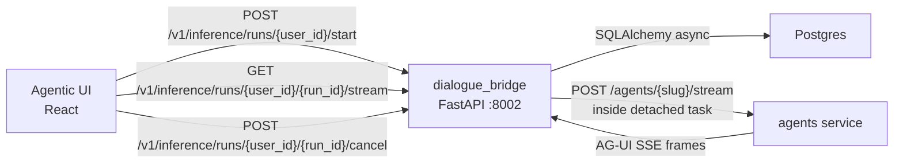
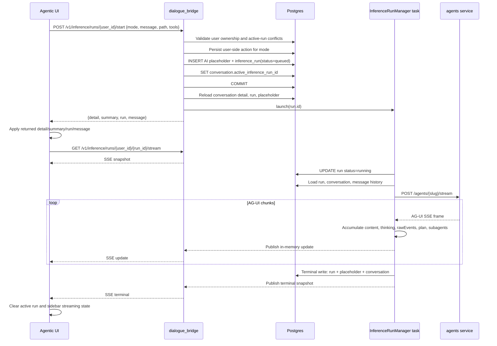
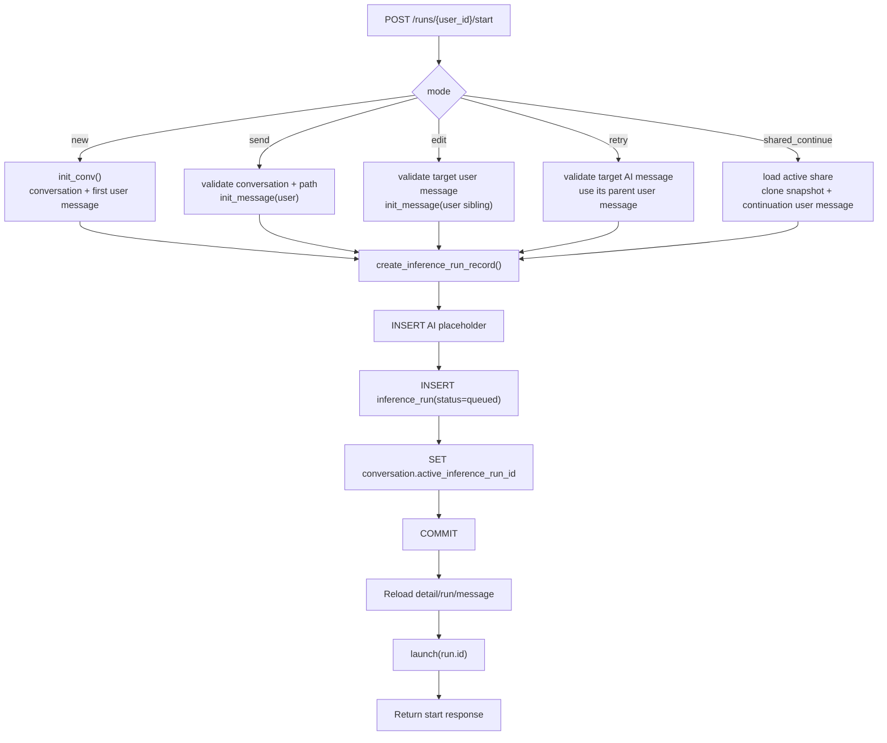
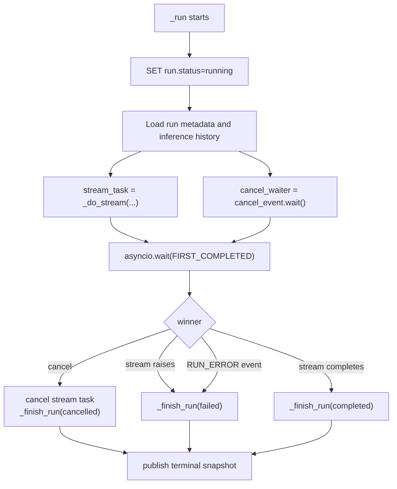
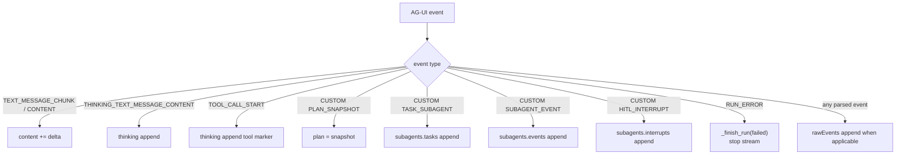
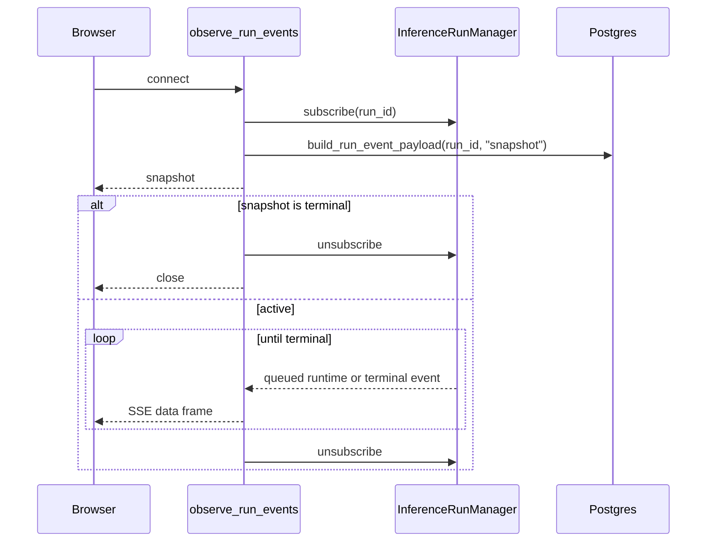
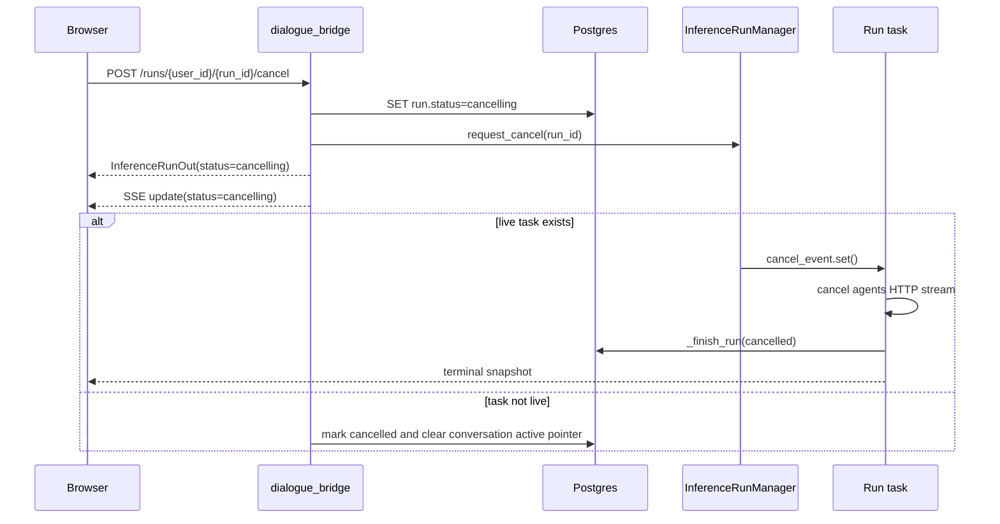
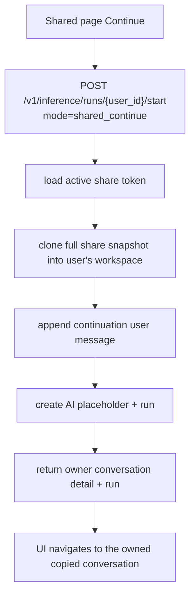

# Inference and Streaming Flow

Inference is backend-owned. The UI sends one start request, and the dialogue bridge persists the user-side action, creates the AI placeholder, creates the run, commits, launches the detached task, and returns the hydrated conversation state. The UI observes what the backend owns; it does not separately create durable user messages, AI placeholders, or runs.

Dictation, read aloud, and realtime voice mode do not use this flow.

---

## Services Involved



---

## Start Modes

`POST /v1/inference/runs/{user_id}/start` accepts a discriminated `mode` payload:

| Mode | Backend action before run creation | Run parent |
| --- | --- | --- |
| `new` | Create conversation and first user message | New first user message |
| `send` | Append a user message to an existing conversation | New user message |
| `edit` | Create an edited user-message sibling branch | New edited user message |
| `retry` | Create no user message; retry an AI response | Original AI message's parent user message |
| `shared_continue` | Clone a full shared snapshot into the user workspace and append the first continuation message | New continuation user message |

The response is always:

```json
{
  "detail": "ConversationDetail",
  "summary": "ConversationSummary",
  "run": "InferenceRunOut",
  "message": "MessageOut for the AI placeholder"
}
```

The `detail` and `summary` are the source of truth for the UI immediately after start. If the user switches conversations after the request returns, a later conversation detail fetch plus active-run hydration can reconstruct the same state.

---

## Full Sequence



## Database Execution Map

The inference flow is designed so live streaming does not write to Postgres per chunk. Database work happens at start, observer snapshots, task startup, terminal finalization, hydration, and cancel.

```mermaid
sequenceDiagram
    participant UI as Agentic UI
    participant Start as start_inference_flow
    participant Runs as create_inference_run_record
    participant Task as InferenceRunManager task
    participant Obs as observe_run_events
    participant PG as Postgres

    UI->>Start: POST /runs/{user_id}/start

    rect rgb(35, 35, 35)
        Note over Start,PG: Start request transaction
        Start->>PG: SELECT current user for route ownership dependency
        Start->>PG: SELECT conversation + messages + attachments for ownership/path validation
        alt mode = new
            Start->>PG: INSERT conversation
            Start->>PG: INSERT first user message + attachments/blobs
        else mode = send
            Start->>PG: INSERT user message + attachments/blobs
            Start->>PG: UPDATE conversation preview/timestamps from user message
        else mode = edit
            Start->>PG: INSERT edited user sibling + attachments/blobs
            Start->>PG: UPDATE conversation preview/timestamps from user message
        else mode = retry
            Start->>PG: No user message INSERT
        else mode = shared_continue
            Start->>PG: SELECT active share
            Start->>PG: INSERT copied conversation
            Start->>PG: INSERT copied snapshot messages + attachments/blobs
            Start->>PG: INSERT continuation user message + attachments/blobs
        end
        Runs->>PG: SELECT stale queued runs for conversation
        opt stale queued run without live task
            Runs->>PG: UPDATE stale run status=failed
            Runs->>PG: UPDATE stale assistant message error fields
            Runs->>PG: CLEAR conversation.active_inference_run_id if needed
        end
        Runs->>PG: SELECT count(active runs for user)
        Runs->>PG: SELECT active run for conversation
        Runs->>PG: INSERT AI placeholder message
        Runs->>PG: INSERT inference_run(status=queued, message_path, enabled_tools)
        Runs->>PG: UPDATE conversation.active_inference_run_id + last_message_at
        Start->>PG: COMMIT
    end

    rect rgb(30, 42, 55)
        Note over Start,PG: Response hydration after commit
        Start->>PG: SELECT conversation detail + messages + attachments
        Start->>PG: SELECT inference_run by id
        Start->>PG: SELECT AI placeholder + attachments/blobs
    end

    par Observer connects
        UI->>Obs: GET /runs/{user_id}/{run_id}/stream
        Obs->>PG: SELECT inference_run by id
        Obs->>PG: SELECT assistant message + attachments/blobs
        Obs->>PG: SELECT conversation + agent for summary snapshot
    and Task starts
        Task->>PG: SELECT inference_run by id
        Task->>PG: UPDATE inference_run status=running
        Task->>PG: COMMIT
        Task->>PG: SELECT conversation detail + messages + attachments
        Task->>PG: SELECT agent metadata if not already cached
    end

    loop Every AG-UI stream chunk
        Task->>Task: Accumulate content/thinking/rawEvents/plan/subagents in memory
        Note over Task,PG: No Postgres read or write per chunk
    end

    rect rgb(55, 40, 35)
        Note over Task,PG: Terminal finalization
        Task->>PG: SELECT inference_run by id
        Task->>PG: UPDATE inference_run content/status/thinking/rawEvents/plan/subagents/error/completed_at
        Task->>PG: SELECT assistant message + attachments/blobs
        Task->>PG: UPDATE assistant message content/thinking/rawEvents/plan/subagents/error fields
        Task->>PG: SELECT conversation by id
        Task->>PG: CLEAR conversation.active_inference_run_id
        Task->>PG: UPDATE conversation preview/timestamps
        Task->>PG: COMMIT
    end

    Task->>PG: SELECT inference_run by id for terminal snapshot
    Task->>PG: SELECT assistant message + attachments/blobs
    Task->>PG: SELECT conversation + agent for terminal summary
    Task->>Obs: publish terminal payload to subscriber queues
```



| Moment | Database work | Why it exists |
| --- | --- | --- |
| Start request | Ownership/path reads, mode-specific writes, active-run checks, AI placeholder insert, run insert, conversation active pointer update, one commit | Makes the whole user action durable before the UI observes it |
| Response hydration | Conversation detail, run, and placeholder reloads | Returns canonical backend state to the UI |
| Observer connect/reconnect | Run, message, conversation summary reads | Lets the UI recover from refresh or navigation |
| Task startup | Run status update, conversation/history read, agent metadata read | Prepares the request sent to the agents service |
| Stream chunks | No database execution | Keeps token streaming latency independent of DB writes |
| Terminal finalization | Run update, placeholder update, conversation active pointer clear, one commit | Persists the final answer and removes active streaming state |
| Terminal publish | Run, message, conversation summary reads | Sends a final authoritative SSE snapshot |
| Cancel, optional | Run status update to `cancelling`; if no live task, message/conversation cleanup and commit | Makes cancellation visible immediately and clears orphaned active state |

---

## Phase 1 - Backend-Owned Start

The router is intentionally thin. `router/inference.py::startInferenceFlow()` validates CSRF/session/rate limit, calls `utils/inference_start.py::start_inference_flow()`, launches the run, and returns the already-built response.

`start_inference_flow()` does the orchestration:

1. Dispatches by `payload.mode`.
2. Validates conversation ownership before any existing-conversation write.
3. Rejects unsupported modes or missing mode-specific fields.
4. Persists the user-side action for `new`, `send`, `edit`, and `shared_continue`.
5. Uses the existing user prompt for `retry`.
6. Calls `create_inference_run_record()` to create the AI placeholder and queued run.
7. Commits once.
8. Reloads and returns `ConversationDetail`, `ConversationSummary`, `InferenceRunOut`, and the placeholder `MessageOut`.



`create_inference_run_record()` also enforces:

- one active run per conversation, backed by the partial unique index on active statuses
- per-user active-run limits
- stale queued-run cleanup before creating a new run
- message lineage validation before storing `message_path`

If `launch()` raises after the DB commit, the router marks the run as failed with `mark_run_launch_failed()` and returns a 500. That prevents a queued run from being left active forever.

---

## Lineage Rules

Inference history is branch-aware. The backend does not blindly trust the client path.

- `messagePath` entries must all belong to the conversation.
- Each entry must be parent-linked to the next entry.
- For `send`, the path must end at the selected parent before the new user message is inserted.
- For `edit`, the target must be a user message; the new user message is a sibling under the original parent.
- For `retry`, the target must be an AI message; the run parent is that AI message's parent user message.
- The stored run `message_path` is rebuilt by the backend and ends in the new AI placeholder.

This matters for branching: editing and retrying should create siblings, not overwrite existing messages or accidentally run against a stale branch.

---

## Phase 2 - Detached Task Lifecycle

`InferenceRunManager.launch(run_id)` creates an `asyncio.Task` for `_run(run_id, cancel_event)` and stores the task and cancellation event in memory. The task:

1. Marks the run as `running`.
2. Loads static run metadata and the prepared message history.
3. Starts `_do_stream()` against the agents service.
4. Races the stream task against `cancel_event.wait()`.
5. Finishes as `completed`, `cancelled`, or `failed`.



Terminal status is idempotent and authoritative. A run that has already failed or cancelled cannot later be marked completed by a late stream result.

---

## Phase 3 - AG-UI Runtime Accumulation

The bridge streams the agents service response as AG-UI events and accumulates a runtime state in memory. Runtime updates do not write to the database.



Live update payloads include enough state for the UI to render the current response: `content`, `thinking`, `rawEvents`, `plan`, and `subagents`.

---

## Phase 4 - SSE Observation

`GET /v1/inference/runs/{user_id}/{run_id}/stream` opens an observer connection. `observe_run_events()` subscribes around snapshot emission so a terminal event cannot be missed between "read snapshot" and "start listening".



Each subscriber queue is bounded. If a browser stalls, old in-memory updates may be dropped, but the terminal database write still contains the final content.

---

## Phase 5 - Terminal Write

`_finish_run()` is the only durable write after start. It updates:

- `InferenceRunTable`: status, content, thinking, raw events, plan, subagents, error, completion time
- AI placeholder `MessageTable`: content, thinking, reasoning time, raw events, plan, subagents, error fields
- `ConversationTable`: clears `active_inference_run_id`, updates preview/timestamps from the final AI message

After commit, the manager publishes a fresh terminal snapshot. The UI treats terminal run status as authoritative and clears `activeRunId`/`isStreaming` even if an older summary still contains active-run flags.

---

## Phase 6 - Cancel Flow



Cancel interrupts the agents HTTP stream at the next await inside the bridge task; it does not wait for the next agent chunk.

---

## Phase 7 - UI Hydration and Sidebar State

`useInferenceRuns` is the only AG-UI observer in the frontend.

- `beginRun()` calls `startInference(userId, request)`.
- It applies the returned `detail`, `summary`, `run`, and placeholder `message`.
- It opens the SSE observer at `/v1/inference/runs/{user_id}/{run_id}/stream`.
- On mount, it calls `getActiveInferenceRuns(userId)` and observes every active run.
- When active-run hydration returns, conversations not returned as active are cleared locally.
- Terminal events always clear `runsByConversation`, `activeRunId`, and `isStreaming` for that conversation.

The IndexedDB UI snapshot intentionally does not persist transient streaming state. Serialized and deserialized conversation summaries force `activeRunId: null` and `isStreaming: false`; after rehydrating a snapshot, the app fetches fresh conversations and active runs from the backend.

---

## Shared Conversation Continuation

Shared continuation uses the same start endpoint and run lifecycle as normal chat.



The original shared conversation is not mutated. The copied conversation belongs to the authenticated user and behaves like any normal conversation after creation.

---

## Sharp Edges and Behavioral Notes

- **Start is atomic; launch is not part of the DB transaction.** The run and placeholder commit before `launch()`. If launch fails, the bridge marks the run failed so the conversation is not left active.
- **One active run per conversation.** The backend pre-checks, and the database partial unique index enforces active statuses `queued`, `running`, and `cancelling`.
- **Streaming has no intermediate DB writes.** Refresh during a live run gets a DB snapshot plus live in-memory updates. After completion, the terminal write is durable.
- **Startup cleanup fails orphaned active runs.** On bridge startup, active runs from a previous process are marked failed and conversation active pointers are cleared.
- **Stale queued runs are cleaned before creating a new run.** This protects conversations from a queued row left behind before task launch.
- **Slow observers can miss intermediate updates.** The final terminal snapshot is authoritative and contains the completed response state.
- **`RUN_ERROR` is terminal failed.** It cannot later become completed.
- **Frontend snapshots must not restore spinners.** Sidebar streaming indicators come from fresh backend summary/detail or active-run hydration, not persisted UI cache.

---

## File Map

| Concept | File | What to look for |
| --- | --- | --- |
| Start endpoint | [src/dialogue_bridge/router/inference.py](../../src/dialogue_bridge/router/inference.py) | `startInferenceFlow()` |
| Backend start orchestration | [src/dialogue_bridge/utils/inference_start.py](../../src/dialogue_bridge/utils/inference_start.py) | `start_inference_flow()` and mode helpers |
| Run creation and lineage | [src/dialogue_bridge/utils/inference_runs.py](../../src/dialogue_bridge/utils/inference_runs.py) | `create_inference_run_record()` |
| Lineage validation | [src/dialogue_bridge/utils/inference.py](../../src/dialogue_bridge/utils/inference.py) | `resolve_inference_message_path()` |
| Task lifecycle | [src/dialogue_bridge/utils/inference_runs.py](../../src/dialogue_bridge/utils/inference_runs.py) | `InferenceRunManager._run()` |
| Stream loop | [src/dialogue_bridge/utils/inference_runs.py](../../src/dialogue_bridge/utils/inference_runs.py) | `InferenceRunManager._do_stream()` |
| Runtime accumulator | [src/dialogue_bridge/utils/inference_runs.py](../../src/dialogue_bridge/utils/inference_runs.py) | `InferenceRunRuntime.apply_event()` |
| Terminal write | [src/dialogue_bridge/utils/inference_runs.py](../../src/dialogue_bridge/utils/inference_runs.py) | `_finish_run()` |
| Observer generator | [src/dialogue_bridge/utils/inference_runs.py](../../src/dialogue_bridge/utils/inference_runs.py) | `observe_run_events()` |
| Cancel path | [src/dialogue_bridge/utils/inference_runs.py](../../src/dialogue_bridge/utils/inference_runs.py) | `request_run_cancel()` |
| Shared clone helper | [src/dialogue_bridge/utils/shared_conv.py](../../src/dialogue_bridge/utils/shared_conv.py) | `create_conversation_from_share_record()` |
| Frontend inference runtime | [src/agentic_ui/src/runtime/inference.ts](../../src/agentic_ui/src/runtime/inference.ts) | `handleSendMessage()`, edit/retry/shared continue start requests |
| Frontend observer hook | [src/agentic_ui/src/hooks/useInferenceRuns.ts](../../src/agentic_ui/src/hooks/useInferenceRuns.ts) | `beginRun()`, `applyRunEvent()`, `observeRunId()` |
| Frontend API calls | [src/agentic_ui/src/lib/api.ts](../../src/agentic_ui/src/lib/api.ts) | `startInference()`, `observeInferenceRun()`, `getActiveInferenceRuns()` |
| UI snapshot storage | [src/agentic_ui/src/lib/uiStateStorage.ts](../../src/agentic_ui/src/lib/uiStateStorage.ts) | transient run flags are stripped |
