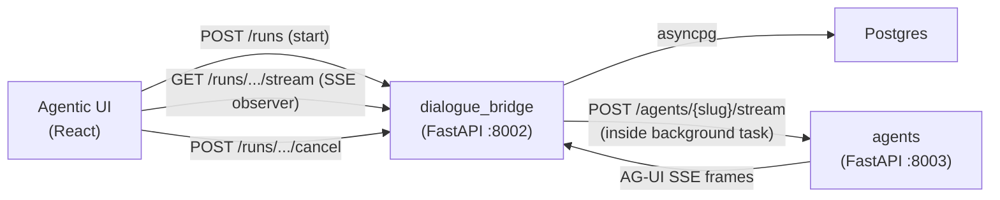
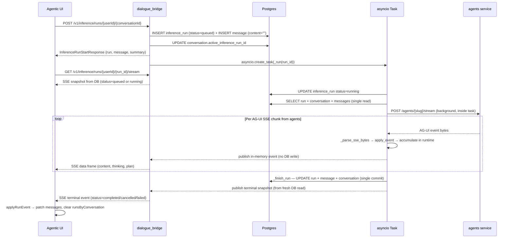
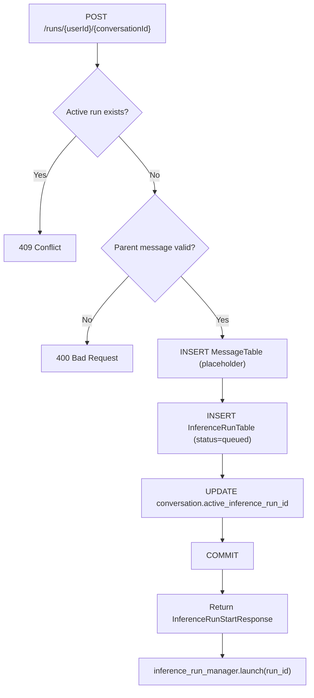
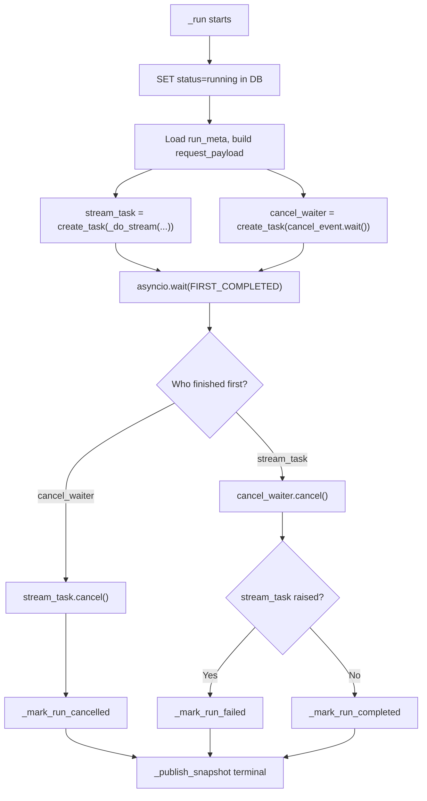
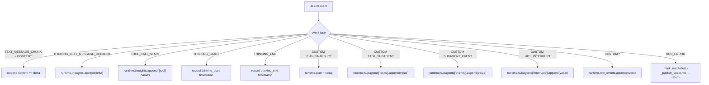
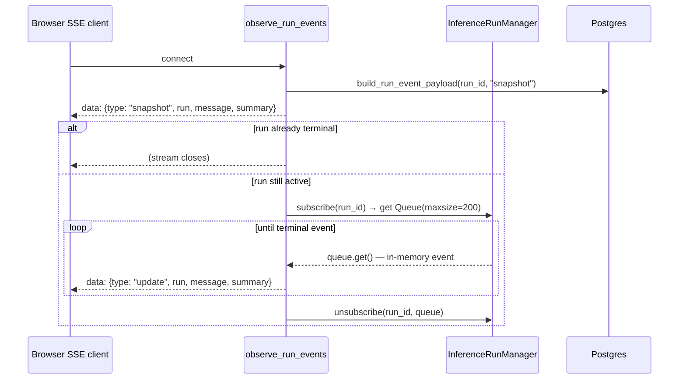
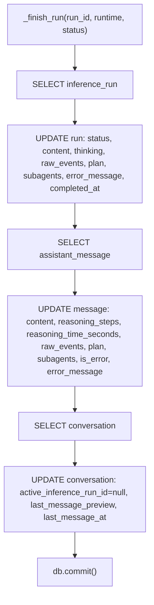
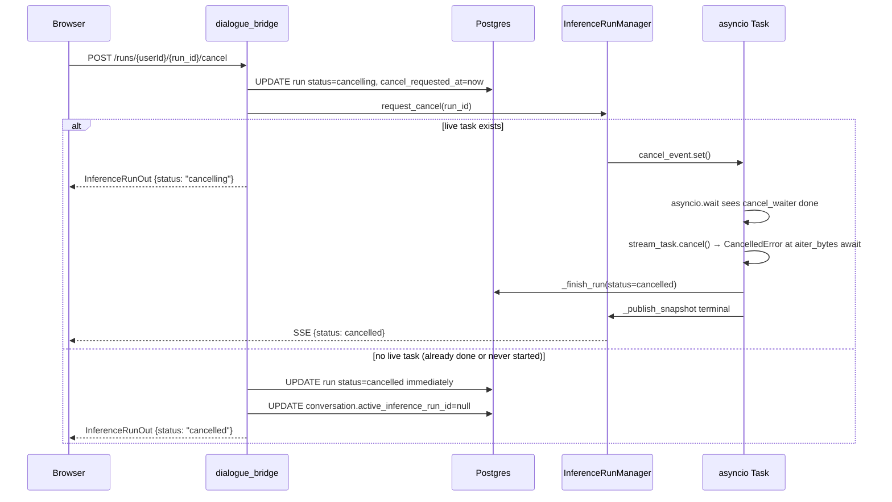
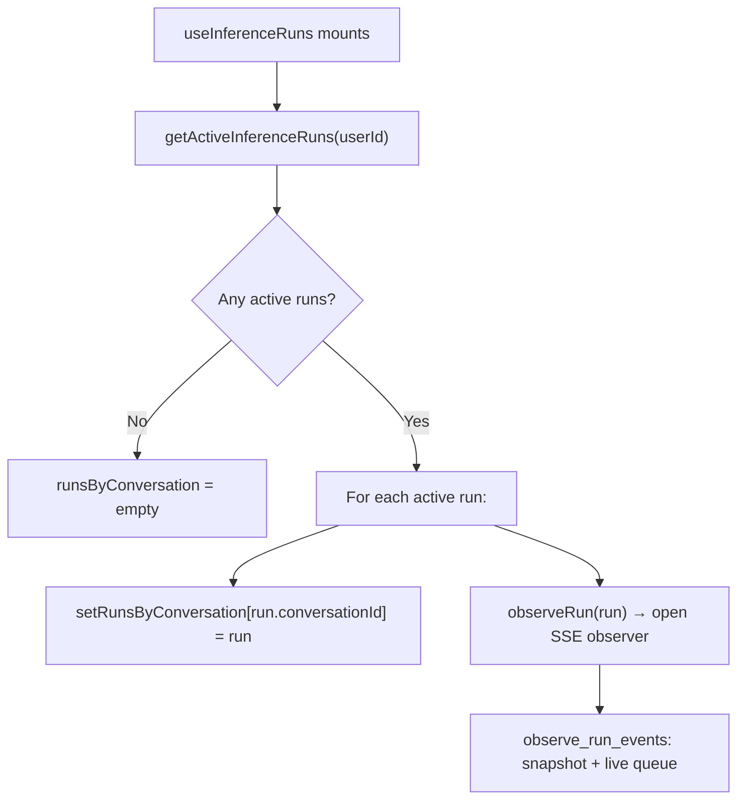

# Inference and Streaming Flow

When a user sends a message, the platform does not stream the agent response directly through the same HTTP connection that initiated the request. Instead, the dialogue bridge creates a persistent server-side `asyncio` task — an **inference run** — that owns the agent stream independently of any browser connection. The browser opens a separate SSE observer endpoint to receive events from that task. It can disconnect, refresh, or reconnect freely without interrupting the run. The server writes to the database exactly twice per run: once at creation and once at completion.

---

## Services Involved

---

## Full Sequence

---

## Phase 1 — Run Creation

The browser calls `POST /v1/inference/runs/{userId}/{conversationId}` with a JSON body containing `parentMessageId`, an optional `messagePath` (the branch of message IDs to use as history), and an optional `enabledTools` list. The endpoint is protected by CSRF double-submit and validates both the user session and conversation ownership before touching the database.

`create_inference_run()` performs all DB work in a single transaction:

1. Checks for an existing active run on the same conversation. If one exists it returns `409 Conflict` immediately — the partial unique index on `inference_runs` enforces this at the DB level too.
2. Validates that `parentMessageId` belongs to the conversation's message set.
3. Inserts a `MessageTable` row for the AI placeholder with `sender="ai"`, `content=""`, `raw_events=[]`. This is the message the browser will start rendering immediately.
4. Inserts an `InferenceRunTable` row with `status="queued"`, the resolved `message_path` (existing path plus the new placeholder message ID), and serialized `enabled_tools`.
5. Sets `conversation.active_inference_run_id = run.id` so any client loading the conversation knows a run is active.
6. Commits and returns the run + loaded message.

The router then returns the full `InferenceRunStartResponse` to the browser **before** launching the background task. Only after the response is sent does it call `inference_run_manager.launch(run.id)`.

| Field | Value at creation |
| --- | --- |
| `status` | `queued` |
| `content` | `""` |
| `thinking` | `null` |
| `raw_events` | `[]` |
| `message_path` | `[...existing branch ids, new_message_id]` |
| `completed_at` | `null` |

---

## Phase 2 — The Detached asyncio Task

`InferenceRunManager.launch(run_id)` creates an `asyncio.Event` for cancellation and an `asyncio.Task` wrapping `_run(run_id, cancel_event)`. Both are stored in internal dicts keyed by `run_id`. A done-callback removes them automatically when the task finishes.

`_run()` is the top-level task coroutine. It starts by opening a DB session, loading the run, checking it is still in `ACTIVE_RUN_STATUSES`, and setting `status = "running"`. It then opens a second DB session to re-load the run and capture a `run_meta` dict — a frozen snapshot of all static run fields (IDs, timestamps, path, tools). This dict is passed into the stream loop so that building in-memory events requires no further DB reads.

After setup, `_run()` races two tasks using `asyncio.wait`:

This racing pattern is why cancellation is immediate. When `cancel_event.set()` fires, the `asyncio.wait` returns immediately, and `stream_task.cancel()` throws `CancelledError` at whichever `await` is currently executing inside `aiter_bytes()` — which is the actual HTTP read of the agent stream. There is no waiting for the next chunk to arrive.

---

## Phase 3 — Stream Loop and In-Memory Accumulation

`_do_stream()` opens an `httpx.AsyncClient` and POSTs to the agents service stream endpoint. The timeout is set at `connect=30s, read=180s`. The `Accept: text/event-stream` header is sent along with an internal service secret header for TLS-fronted inter-service authentication.

For each raw byte chunk arriving from the agents service, `_parse_sse_bytes()` maintains an SSE text buffer, splitting on `\n\n` to extract complete events and parsing each `data:` line as JSON. Events that have a `type` field are passed to `InferenceRunRuntime.apply_event()`.

`InferenceRunRuntime` is the in-memory accumulator for the entire run:

After each chunk that contained at least one event, `_publish_runtime_event()` is called. This builds a lightweight `{type: "update", run: {...}, message: {...}}` payload entirely from `run_meta` + `runtime` state — zero DB reads — and puts it on every subscriber queue via `InferenceRunManager.publish()`.

---

## Phase 4 — SSE Observer and Pub/Sub Fan-Out

When the browser opens `GET /v1/inference/runs/{userId}/{run_id}/stream`, `observe_run_events(run_id)` is started as an async generator. Its first action is always to emit a DB snapshot regardless of whether the task is currently running:

The immediate snapshot on connect is the reconnect mechanism. A browser that refreshes mid-stream reconnects and receives the last known DB state (which may be slightly behind the in-memory accumulator if no terminal write has happened yet), then immediately resumes receiving live in-memory events from the queue.

`InferenceRunManager.publish()` iterates all registered queues for the run. Each queue has `maxsize=200`. If a queue is full (a slow or stalled browser), the oldest event is silently dropped and the new one is placed — preventing a slow observer from blocking the stream task.

The `controllersRef` in `useInferenceRuns` holds an `AbortController` per active run. When the SSE stream ends (terminal event received), the controller is aborted and cleaned from the ref. This prevents duplicate observer connections if `observeRunId` is called again for a run that already has an open observer.

---

## Phase 5 — Terminal Write and Finalization

All three terminal outcomes — completed, cancelled, failed — go through `_finish_run()`. This is the **only DB write during or after a run** (excluding the creation write). It is atomic:

After the commit, `_publish_snapshot()` reads the run fresh from DB and publishes the terminal event to all observers. The `type` field in this event is `"terminal"` for completed/cancelled and still carries the full `InferenceRunOut` + `MessageOut` + `ConversationSummary`. When the observer receives an event whose `run.status` is in `TERMINAL_RUN_STATUSES`, it stops reading and returns.

`reasoning_time_seconds` is computed from `InferenceRunRuntime.thinking_duration_seconds()`: it measures from `first_event_ts` (or `thinking_start`) to `thinking_end` (or the timestamp when the first text chunk arrived, which implicitly closes the thinking block).

---

## Phase 6 — Cancel Flow

The cancel path has two cases depending on whether the live task is still running.

After `request_cancel()` returns, the cancel endpoint also calls `build_run_event_payload` and publishes an update event so the browser sees `status: "cancelling"` immediately via the SSE stream without waiting for the task to finish.

---

## Phase 7 — Page Load Hydration

On mount, `useInferenceRuns` calls `getActiveInferenceRuns(userId)` which hits `GET /v1/inference/runs/{userId}?status=active`. This returns all runs in `(queued, running, cancelling)` status for the user. For each one, the hook calls `observeRun(run)` to open an SSE observer. This means that if the user closes and reopens the browser while a run is in progress, the UI immediately reconnects to the live stream and resumes rendering.

The hook also watches `currentActiveRunId` (derived from the currently open conversation's `activeRunId` field). Whenever the user navigates to a conversation that has an active run, `observeRunId` is called automatically.

---

## Phase 8 — Startup Cleanup

`cleanup_orphaned_inference_runs()` runs in the FastAPI lifespan at service startup, before the server begins accepting requests. It bulk-updates all runs in `ACTIVE_RUN_STATUSES` to `failed` with the message `"Inference run was interrupted by service restart."`, and sets all `conversation.active_inference_run_id` to `null`. This prevents orphaned `queued` or `running` rows from blocking new runs on conversations that had in-flight tasks when the process was killed.

---

## Sharp Edges and Behavioral Notes

- **The run is launched after the HTTP response.** `inference_run_manager.launch(run.id)` is called after the `201` response is already sent. This means the browser receives a run with `status: "queued"` and must open the SSE observer to see it transition to `"running"`. There is no race condition here because the DB snapshot on observer connect always reflects the latest status.

- **There can be exactly one active run per conversation at a time.** This is enforced at two levels: `create_inference_run()` checks with a `SELECT` and raises `409`, and the DB has a partial unique index `uq_inference_runs_one_active_per_conversation` on `(conversation_id)` where `status IN ('queued', 'running', 'cancelling')`.

- **The in-memory queue has maxsize=200. Slow observers lose events.** If the browser's SSE connection is slow or stalled, the queue fills up and the oldest event is evicted to make room for the newest. The observer will not miss the content permanently — the terminal DB write captures everything — but mid-stream rendering may skip intermediate thought steps.

- **Reconnecting gets a stale snapshot then resumes live.** The DB snapshot on reconnect reflects only the last `_finish_run` write, which happens at the end of the run. While the run is live, the snapshot shows `content: ""` because no intermediate DB writes happen. This means a reconnect during a long run will briefly show an empty message before the next in-memory event arrives and fills in the accumulated content.

- **`run_meta` is captured once and never updated during the stream.** The `status` field inside `run_meta` stays `"running"` for the entire stream loop. The browser derives visual state from the events it receives, not from polling the run status directly.

- **Cancel interrupts at the next `await`, not at the next chunk.** `stream_task.cancel()` throws `CancelledError` at whichever `await` is executing inside `aiter_bytes()`. If the agents service is slow to send chunks, the cancel is still immediate from the bridge's perspective — the HTTP connection to the agents service is dropped at the OS level.

- **`RUN_ERROR` from the agents service is treated as a failure, not a cancellation.** If the agent stream itself emits `{type: "RUN_ERROR"}`, `_do_stream` calls `_mark_run_failed` directly and returns. This differs from a task cancellation in that the content accumulated up to the error is still saved.

- **Startup cleanup is a bulk UPDATE, not per-run finalization.** `cleanup_orphaned_inference_runs()` does not call `_finish_run()` — it uses a raw `UPDATE ... WHERE status IN (...)`. This means orphaned runs get `status=failed` but their `content`, `thinking`, and `raw_events` fields stay whatever was last in the DB (which for most crashes is `""` / `null` since no intermediate writes happen). Expect empty AI messages after a crash.

- **The legacy `/stream/{userId}/{conversationId}` endpoint still exists.** It proxies the agent SSE stream directly to the browser without creating a run or any DB record. It is superseded by the detached run flow but remains available.

---

## File Map

| Concept | File | What to look for |
| --- | --- | --- |
| Run creation | [src/dialogue_bridge/utils/inference_runs.py](../../src/dialogue_bridge/utils/inference_runs.py) | `create_inference_run()` |
| Task lifecycle | [src/dialogue_bridge/utils/inference_runs.py](../../src/dialogue_bridge/utils/inference_runs.py) | `InferenceRunManager._run()` |
| Stream loop | [src/dialogue_bridge/utils/inference_runs.py](../../src/dialogue_bridge/utils/inference_runs.py) | `InferenceRunManager._do_stream()` |
| In-memory accumulator | [src/dialogue_bridge/utils/inference_runs.py](../../src/dialogue_bridge/utils/inference_runs.py) | `InferenceRunRuntime.apply_event()` |
| In-memory event builder | [src/dialogue_bridge/utils/inference_runs.py](../../src/dialogue_bridge/utils/inference_runs.py) | `InferenceRunManager._build_runtime_event()` |
| Pub/sub fan-out | [src/dialogue_bridge/utils/inference_runs.py](../../src/dialogue_bridge/utils/inference_runs.py) | `InferenceRunManager.publish()`, `subscribe()`, `unsubscribe()` |
| SSE observer generator | [src/dialogue_bridge/utils/inference_runs.py](../../src/dialogue_bridge/utils/inference_runs.py) | `observe_run_events()` |
| Terminal DB write | [src/dialogue_bridge/utils/inference_runs.py](../../src/dialogue_bridge/utils/inference_runs.py) | `_finish_run()` |
| Cancel signal | [src/dialogue_bridge/utils/inference_runs.py](../../src/dialogue_bridge/utils/inference_runs.py) | `request_run_cancel()`, `InferenceRunManager.request_cancel()` |
| Startup cleanup | [src/dialogue_bridge/utils/inference_runs.py](../../src/dialogue_bridge/utils/inference_runs.py) | `cleanup_orphaned_inference_runs()` |
| API endpoints | [src/dialogue_bridge/router/inference.py](../../src/dialogue_bridge/router/inference.py) | `startInferenceRun`, `observeInferenceRun`, `cancelInferenceRun`, `listInferenceRuns` |
| DB models | [src/dialogue_bridge/core/database.py](../../src/dialogue_bridge/core/database.py) | `InferenceRunTable`, partial unique index, `ConversationTable.active_inference_run_id` |
| Frontend hook | [src/agentic_ui/src/hooks/useInferenceRuns.ts](../../src/agentic_ui/src/hooks/useInferenceRuns.ts) | `beginRun`, `stopRun`, `applyRunEvent`, `observeRunId`, hydration `useEffect` |
| Frontend API calls | [src/agentic_ui/src/lib/api.ts](../../src/agentic_ui/src/lib/api.ts) | `startInferenceRun`, `getActiveInferenceRuns`, `cancelInferenceRun`, `observeInferenceRun` |
| Service startup | [src/dialogue_bridge/main.py](../../src/dialogue_bridge/main.py) | `lifespan` → `cleanup_orphaned_inference_runs()` |
