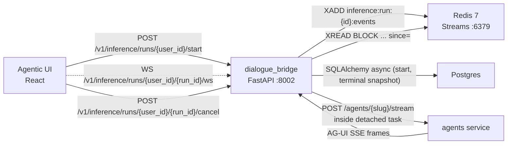
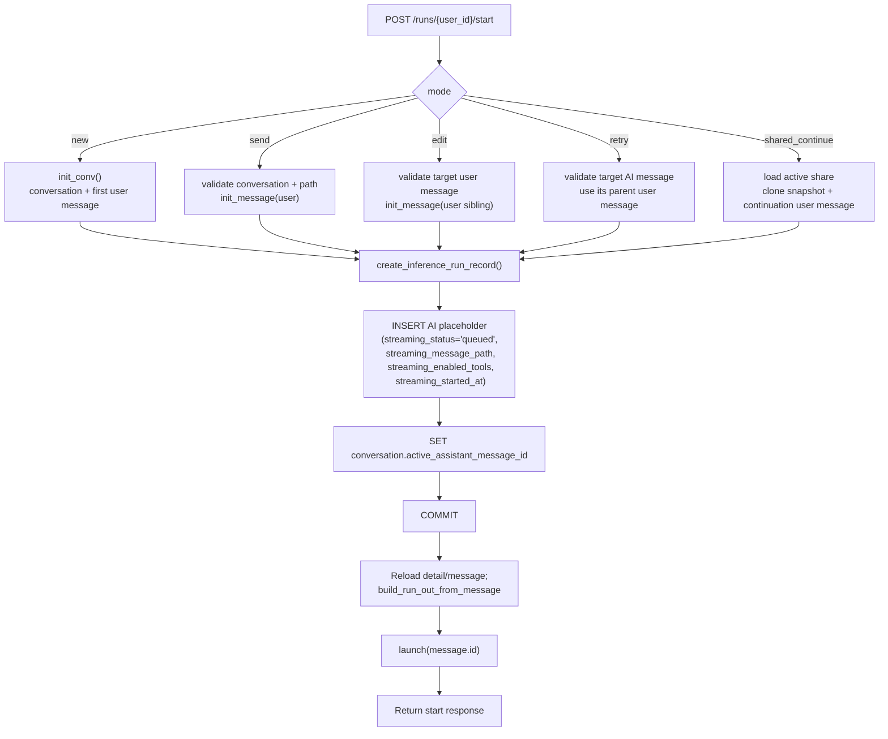
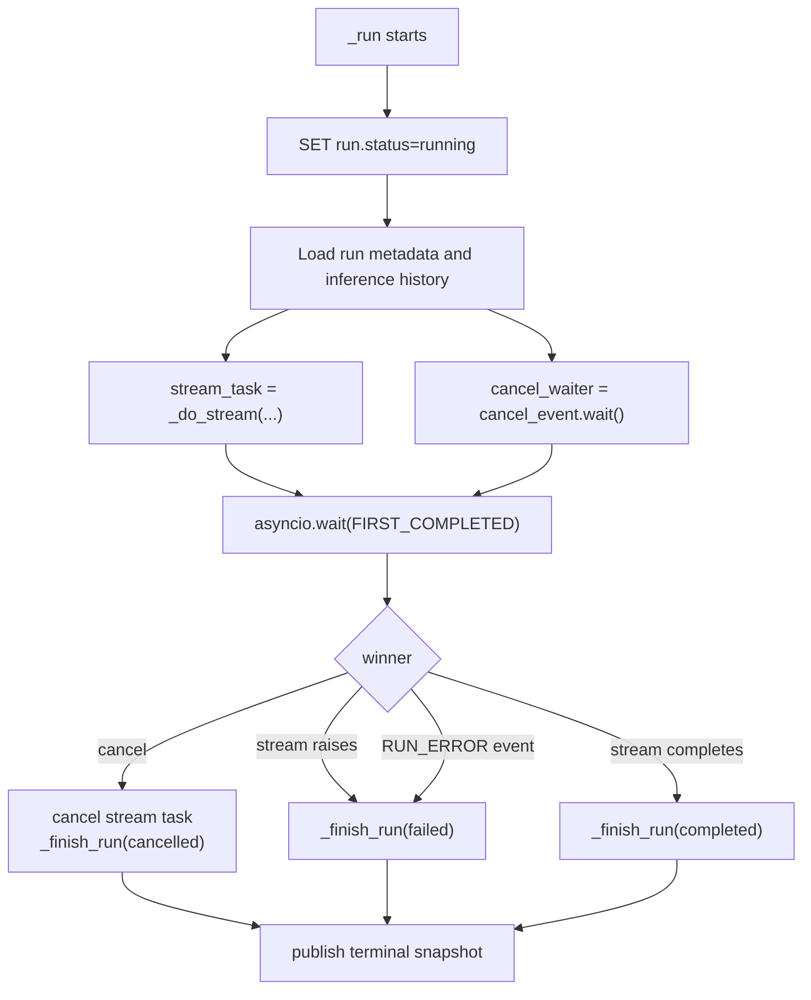
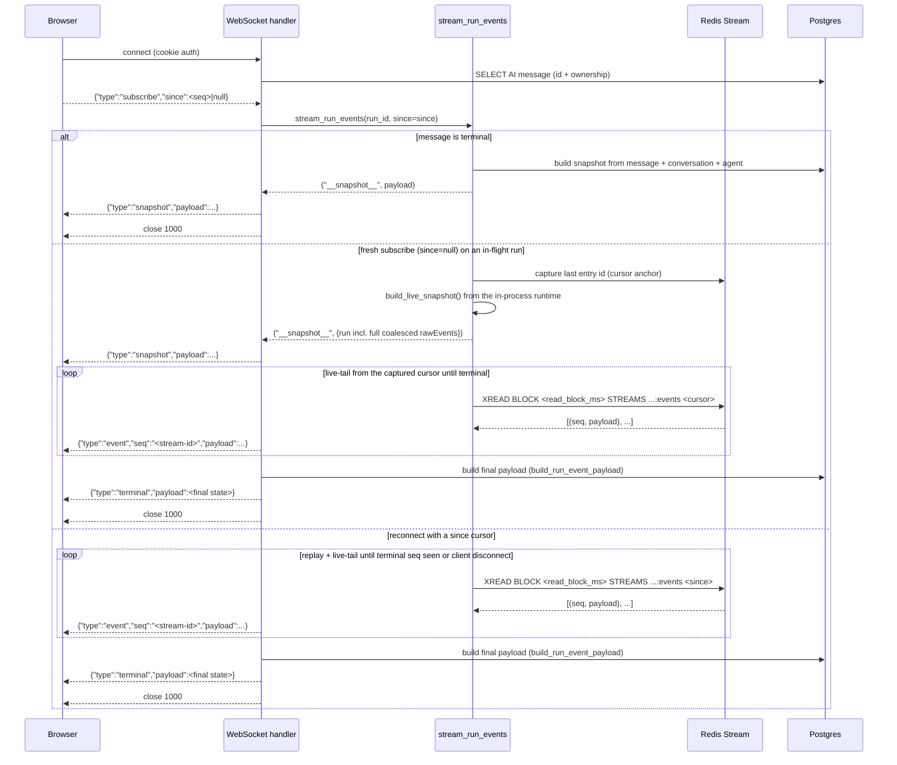
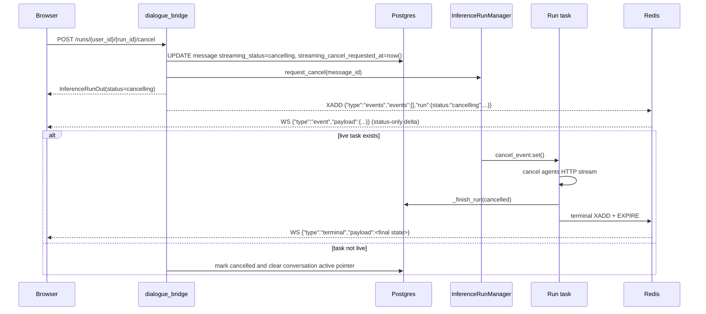
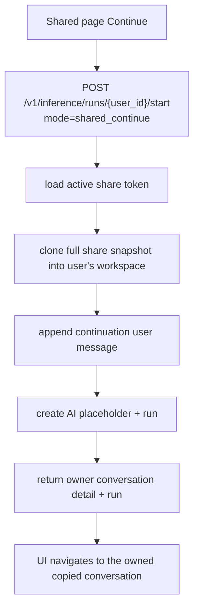

# Inference and Streaming Flow

Inference is backend-owned. The UI sends one start request, and the dialogue bridge persists the user-side action, creates the AI placeholder, creates the run, commits, launches the detached task, and returns the hydrated conversation state. The UI observes what the backend owns; it does not separately create durable user messages, AI placeholders, or runs.

The UI subscribes to events over **WebSocket** at `/v1/inference/runs/{user_id}/{run_id}/ws`. The connection is automatically re-established with a `since=<last-seen-seq>` cursor on transient failures (5-step exponential backoff, 250 ms → 5 s). The wire protocol is **snapshot-then-deltas**: a fresh subscribe receives one snapshot frame (the full coalesced event log so far, synthesized from the in-process runtime for live runs, or the DB-built final state for terminal runs), then per-chunk `events` delta frames. Frames are persisted to a per-run **Redis Stream** (`inference:run:{run_id}:events`) by the detached task; the WebSocket handler reads from that stream, so a brief network blip — or a container restart of `dialogue_bridge` — does not drop chunks. The UI folds the raw AG-UI events into the rendered timeline client-side (`lib/timeline.ts`); the bridge never ships a pre-rendered shape. The legacy SSE endpoint was removed — the WebSocket route is the only observer.

Dictation, read aloud, and realtime voice mode do not use this flow.

---

## Services Involved



The event log is durable across container restarts (Redis is its own service) but ephemeral by design: stream keys get a 1 h `EXPIRE` applied on terminal status so reconnecting clients within that window can still replay missed events. The authoritative record of completed runs lives on the assistant `MessageTable` row — there is no separate `inference_runs` table; the row's `streaming_*` columns carry the lifecycle (`streaming_status`, `streaming_started_at`, `streaming_completed_at`, `streaming_message_path`, `streaming_enabled_tools`, `streaming_cancel_requested_at`) and the standard `content`/`raw_events`/`plan`/`subagents`/`reasoning_steps` columns carry the final accumulated state.

---

## Start Modes

`POST /v1/inference/runs/{user_id}/start` accepts a discriminated `mode` payload:

| Mode | Backend action before run creation | Run parent |
| --- | --- | --- |
| `new` | Create conversation and first user message | New first user message |
| `send` | Append a user message to an existing conversation | New user message |
| `edit` | Create an edited user-message sibling branch | New edited user message |
| `retry` | Create no user message; retry an AI response | Original AI message's parent user message |
| `shared_continue` | Clone a full shared snapshot into the user workspace and append the first continuation message | New continuation user message |

**Per-message agent.** The agent is a per-message property, not a per-conversation one. `start_inference_flow` resolves the agent for each run and `create_inference_run_record(mode=...)` stamps it onto the AI placeholder (`messages.agent_id` + denormalized `agent_name`) while updating `conversations.agent_id` as a last-used pointer. Resolution by mode: `new`/`send` use the client-supplied `agentId` (the currently-selected agent — `send` now requires it); `edit`/`retry` ignore any client `agentId` and inherit the original branch's agent server-side (the AI message being retried, or the original reply to the user message being edited), falling back to the conversation's agent if that agent was deactivated. The detached task then resolves `get_agent_by_id(run.agent_id or conversation.agent_id)` and builds `/agents/{slug}/stream|resume` from it — so one conversation can mix agents.

**Checkpoint thread vs run id.** `create_inference_run_record` also allocates the run's durable LangGraph checkpoint thread (`messages.checkpoint_thread_id`) by mode: `send` inherits the branch leaf's thread, `new` mints one, `edit`/`retry` mint a fresh thread seeded copy-on-fork from the parent branch's checkpoint. The checkpoint `thread_id` is therefore **branch-scoped** (shared by every run on a branch), distinct from `run.id` (the per-run assistant-message id used for the WebSocket path, Redis key, and AG-UI `message_id`). See [Delta-Payload Inference](#delta-payload-inference--durable-checkpoint-resume) below.

The response is always:

```json
{
  "detail": "ConversationDetail",
  "summary": "ConversationSummary",
  "run": "InferenceRunOut (built from the AI message row by build_run_out_from_message)",
  "message": "MessageOut for the AI placeholder"
}
```

The `detail` and `summary` are the source of truth for the UI immediately after start. The `run` shape is a view over the AI message — its `id` is the assistant `message_id`, and `runId` and `message_id` are interchangeable everywhere a run is referenced (URL params, WebSocket path, cancel endpoint, Redis stream key). If the user switches conversations after the request returns, a later conversation detail fetch plus active-run hydration can reconstruct the same state.

---

## Full Sequence

```mermaid
sequenceDiagram
    participant UI as Agentic UI
    participant Bridge as dialogue_bridge
    participant PG as Postgres
    participant Redis as Redis Stream
    participant Task as InferenceRunManager task
    participant Agents as agents service

    UI->>Bridge: POST /v1/inference/runs/{user_id}/start {mode, message, path, tools}
    Bridge->>PG: Validate user ownership and active-run conflicts
    Bridge->>PG: Persist user-side action for mode
    Bridge->>PG: INSERT AI placeholder (streaming_status='queued', streaming_message_path, streaming_enabled_tools)
    Bridge->>PG: SET conversation.active_assistant_message_id
    Bridge->>PG: COMMIT
    Bridge->>PG: Reload conversation detail and placeholder; build InferenceRunOut from message
    Bridge->>Task: launch(message.id)
    Bridge-->>UI: {detail, summary, run, message}

    UI->>UI: Apply returned detail/summary/run/message
    UI->>Bridge: WS /v1/inference/runs/{user_id}/{run_id}/ws
    UI-->>Bridge: {"type":"subscribe","since":null}
    Bridge-->>UI: {"type":"snapshot","payload":{run incl. rawEvents so far}}

    Task->>PG: UPDATE message streaming_status=running
    Task->>PG: Load conversation + message history
    Task->>Agents: POST /agents/{slug}/stream

    loop AG-UI chunks
        Agents-->>Task: AG-UI SSE frame
        Task->>Task: apply_event: seq-stamp + append to coalesced log + aggregates
        Task->>Redis: XADD {"type":"events","run":<meta>,"events":[chunk events]}
        Redis-->>Bridge: XREAD BLOCK ... -> {seq, payload}
        Bridge-->>UI: {"type":"event","seq":"...","payload":...}
        UI->>UI: reduceTimelineEvents(run.timeline, payload.events)
    end

    Task->>PG: Terminal write: AI message + conversation (single transaction)
    Task->>Redis: XADD terminal payload + EXPIRE stream 1h
    Bridge-->>UI: {"type":"terminal","payload":<final state>}
    UI->>UI: Apply payload, clear active run and sidebar streaming state
```

## Database Execution Map

The inference flow is designed so live streaming does not write to Postgres per chunk. Postgres work happens at start, task startup, terminal finalization, hydration, and cancel. Per-chunk durability lives in Redis Streams (`inference:run:{message_id}:events`), not the database.

```mermaid
sequenceDiagram
    participant UI as Agentic UI
    participant Start as start_inference_flow
    participant Runs as create_inference_run_record
    participant Task as InferenceRunManager task
    participant WS as WebSocket handler
    participant Redis as Redis Stream
    participant PG as Postgres

    UI->>Start: POST /runs/{user_id}/start

    rect rgb(35, 35, 35)
        Note over Start,PG: Start request transaction
        Start->>PG: SELECT current user for route ownership dependency
        Start->>PG: SELECT conversation + messages + attachments for ownership/path validation
        alt mode = new
            Start->>PG: INSERT conversation
            Start->>PG: INSERT first user message + attachments/blobs
        else mode = send
            Start->>PG: INSERT user message + attachments/blobs
            Start->>PG: UPDATE conversation preview/timestamps from user message
        else mode = edit
            Start->>PG: INSERT edited user sibling + attachments/blobs
            Start->>PG: UPDATE conversation preview/timestamps from user message
        else mode = retry
            Start->>PG: No user message INSERT
        else mode = shared_continue
            Start->>PG: SELECT active share
            Start->>PG: INSERT copied conversation
            Start->>PG: INSERT copied snapshot messages + attachments/blobs
            Start->>PG: INSERT continuation user message + attachments/blobs
        end
        Runs->>PG: SELECT stale queued AI messages (streaming_status='queued') for conversation
        opt stale queued message without live task
            Runs->>PG: UPDATE stale AI message streaming_status=failed + error fields
            Runs->>PG: CLEAR conversation.active_assistant_message_id if needed
        end
        Runs->>PG: SELECT count(active streaming messages for user)
        Runs->>PG: SELECT active streaming message for conversation
        Runs->>PG: INSERT AI placeholder (streaming_status='queued', streaming_message_path, streaming_enabled_tools, streaming_started_at)
        Runs->>PG: UPDATE conversation.active_assistant_message_id + last_message_at
        Start->>PG: COMMIT
    end

    rect rgb(30, 42, 55)
        Note over Start,PG: Response hydration after commit
        Start->>PG: SELECT conversation detail + messages + attachments
        Start->>PG: SELECT AI placeholder + attachments/blobs (build_run_out_from_message)
    end

    par Observer connects
        UI->>WS: WS /runs/{user_id}/{run_id}/ws
        UI-->>WS: {"type":"subscribe","since":<seq>|null}
        WS->>PG: SELECT AI message (by id + ownership)
        alt streaming_status terminal
            WS->>PG: SELECT conversation + agent for snapshot
            WS-->>UI: {"type":"snapshot","payload":...}
            WS-->>UI: close
        else still streaming
            WS->>Redis: XREAD BLOCK ... STREAMS ...:events <since|0>
        end
    and Task starts
        Task->>PG: SELECT AI message by id
        Task->>PG: UPDATE message streaming_status=running
        Task->>PG: COMMIT
        Task->>PG: SELECT conversation detail + messages + attachments
        Task->>PG: SELECT agent metadata if not already cached
    end

    loop Every AG-UI stream chunk
        Task->>Task: Accumulate content/thinking/rawEvents/plan/subagents in memory
        Task->>Redis: XADD inference:run:{id}:events MAXLEN~20000 payload=<json>
        Redis-->>WS: replay frame to every connected observer
        WS-->>UI: {"type":"event","seq":"<stream-id>","payload":...}
        Note over Task,PG: No Postgres read or write per chunk
    end

    rect rgb(55, 40, 35)
        Note over Task,PG: Terminal finalization
        Task->>PG: SELECT AI message + attachments/blobs
        Task->>PG: UPDATE AI message: content / reasoning_steps / reasoning_time_seconds / raw_events / plan / subagents / error fields / streaming_status / streaming_completed_at
        Task->>PG: SELECT conversation by id
        Task->>PG: CLEAR conversation.active_assistant_message_id (if pointing at this message)
        Task->>PG: UPDATE conversation preview/timestamps
        Task->>PG: COMMIT
    end

    Task->>Redis: XADD terminal payload
    Task->>Redis: EXPIRE inference:run:{id}:events 3600s
    Redis-->>WS: terminal frame
    WS->>PG: build final payload (build_run_event_payload)
    WS-->>UI: {"type":"terminal","payload":<final state>}
    WS-->>UI: close 1000 (normal)
```



| Moment | Database work | Redis work | Why it exists |
| --- | --- | --- | --- |
| Start request | Ownership/path reads, mode-specific writes, active-stream checks, AI placeholder insert with `streaming_*` columns, conversation active pointer update, one commit | — | Makes the whole user action durable before the UI observes it |
| Response hydration | Conversation detail + placeholder reloads, run shape built from the message row | — | Returns canonical backend state to the UI |
| WebSocket connect/reconnect | AI message + conversation summary reads (terminal snapshot path), or message lookup only (live path) | `XREAD BLOCK` from the supplied `since` cursor (or `0` for full backlog) | Lets the UI recover from refresh, navigation, container restart, or transient network blips |
| Task startup | Message `streaming_status` update, conversation/history read, agent metadata read | — | Prepares the request sent to the agents service |
| Stream chunks | No database execution | `XADD` per parsed AG-UI event with `MAXLEN ~ 20000` trim | Keeps token streaming latency independent of DB writes; durable in Redis up to the trim cap |
| Terminal finalization | AI message + conversation update, conversation active pointer clear, one commit | Final terminal `XADD` + `EXPIRE 3600s` on the stream key | Persists the final answer and removes active streaming state |
| Cancel, optional | Message `streaming_status='cancelling'`; if no live task, full cleanup + commit | Cancel event published into the stream | Makes cancellation visible immediately and clears orphaned active state |

---

## Phase 1 - Backend-Owned Start

The router is intentionally thin. `router/inference.py::startInferenceFlow()` validates CSRF/session/rate limit, calls `utils/inference_start.py::start_inference_flow()`, launches the run, and returns the already-built response.

`start_inference_flow()` does the orchestration:

1. Dispatches by `payload.mode`.
2. Validates conversation ownership before any existing-conversation write.
3. Rejects unsupported modes or missing mode-specific fields.
4. Persists the user-side action for `new`, `send`, `edit`, and `shared_continue`.
5. Uses the existing user prompt for `retry`.
6. Calls `create_inference_run_record()` to create the AI placeholder with `streaming_status='queued'` and the run snapshot columns.
7. Commits once.
8. Reloads and returns `ConversationDetail`, `ConversationSummary`, the `InferenceRunOut` shape built from the message row, and the placeholder `MessageOut`.



`create_inference_run_record()` also enforces:

- one active stream per conversation, backed by `uq_messages_one_active_stream_per_conversation` (partial unique index on `streaming_status IN ('queued','running','cancelling')`)
- per-user active-run limits (`SELECT COUNT(*) FROM messages WHERE user_id = ? AND streaming_status IN active`)
- stale queued-message cleanup before creating a new placeholder
- message lineage validation before storing `streaming_message_path`

If `launch()` raises after the DB commit, the router marks the run as failed with `mark_run_launch_failed()` and returns a 500. That prevents a queued run from being left active forever.

---

## Lineage Rules

Inference history is branch-aware. The backend does not blindly trust the client path.

- `messagePath` entries must all belong to the conversation.
- Each entry must be parent-linked to the next entry.
- For `send`, the path must end at the selected parent before the new user message is inserted.
- For `edit`, the target must be a user message; the new user message is a sibling under the original parent.
- For `retry`, the target must be an AI message; the run parent is that AI message's parent user message.
- The stored run `message_path` is rebuilt by the backend and ends in the new AI placeholder.

This matters for branching: editing and retrying should create siblings, not overwrite existing messages or accidentally run against a stale branch.

---

## Delta-Payload Inference & Durable Checkpoint Resume

The agents service keeps a **durable LangGraph checkpoint** per branch (an `AsyncPostgresSaver` over the `agent_runtime` database — see [agent-development.md](../development/agent-development.md)). Because the branch's graph state survives across turns, the bridge no longer re-sends the full reconstructed conversation on every turn. `InferenceRunManager._run` ([`inference_runs.py`](../../src/dialogue_bridge/utils/inference_runs.py)) chooses a payload mode, re-derived from the message tree via `nearest_committed_ai` ([`inference.py`](../../src/dialogue_bridge/utils/inference.py)):

| Payload mode | When | What the bridge sends to `/agents/{slug}/stream` |
| --- | --- | --- |
| `delta_resume` | `send` on a branch whose leaf AI ancestor already committed a checkpoint on the run's `checkpoint_thread_id` | **Only the new user message** + `configurable.thread_id = checkpoint_thread_id`; the agent resumes its durable checkpoint |
| `delta_fork` | `edit`/`retry` where the parent branch has a committed checkpoint | The new message + `fork_from: {thread_id, checkpoint_id}`; `/stream` seeds the fresh thread from the parent's checkpoint (`seed_thread_from_checkpoint`) before running |
| `full_seed` | No committed checkpoint to resume/fork from — new conversation, a pre-migration branch, `shared_continue`, or a never-committed fork target | The **full reconstructed history** (`prepare_inference_history`) as the cold seed; the branch becomes checkpoint-backed once this run commits |

`prepare_inference_history` (full reconstruction) is now used **only** on the `full_seed` path — it is the cold-start fallback, not the every-turn default. The agents `/stream` endpoint no longer wipes the checkpoint at stream start (durable threads must survive a re-issued run).

### Capture-back — `CHECKPOINT_COMMITTED`

So the bridge can record which durable checkpoint a run produced (for the next turn's resume/fork), the agent emits a **terminal AG-UI custom event** `CHECKPOINT_COMMITTED {thread_id, checkpoint_id}` (emitter method `checkpoint_committed`, type `CHECKPOINT_COMMITTED` in [`events.py`](../../src/agents/runtime/agui/events.py)). `InferenceRunRuntime.apply_event` captures it, and `_finish_run` persists `checkpoint_id` (alongside the already-stamped `checkpoint_thread_id`) on the AI message row. A branch's leaf AI message therefore always carries the head its next turn resumes from.

---

## Phase 2 - Detached Task Lifecycle

`InferenceRunManager.launch(run_id)` creates an `asyncio.Task` for `_run(run_id, cancel_event)` and stores the task and cancellation event in memory. The task:

1. Marks the run as `running`.
2. Loads static run metadata and the prepared message history.
3. Starts `_do_stream()` against the agents service.
4. Races the stream task against `cancel_event.wait()`.
5. Finishes as `completed`, `cancelled`, or `failed`.



Terminal status is idempotent and authoritative. A run that has already failed or cancelled cannot later be marked completed by a late stream result.

---

## Phase 3 - AG-UI Event Log Keeping

The bridge streams the agents service response as AG-UI events. Its primary job is **log keeping**: every event is stamped with a monotonic `seq` and appended to `raw_events` — the full per-run event log the UI replays into its timeline, both live and on hydration. Runtime updates do not write to the database; the log is persisted once at terminal.

Appending coalesces consecutive delta events so the stored log stays block-lossless without per-token entries:

- `TEXT_MESSAGE_CHUNK`/`TEXT_MESSAGE_CONTENT` with the same `messageId` + namespace merge into one event with a concatenated `delta`; the merged event keeps the `seq` of the **last** merged wire event and gains `timestampEnd`.
- `TOOL_CALL_ARGS` with the same `toolCallId` merge the same way.
- `SUBAGENT_EVENT` envelopes merge one level down when they share a `task_id` and carry mergeable inner deltas.
- `THINKING_TEXT_MESSAGE_CONTENT` is **deliberately never coalesced** — each thinking event is a discrete thought step emitted by the agent, and merging them would collapse steps on hydration that the live stream rendered separately.
- `TOOL_CALL_RESULT` content (top-level and SUBAGENT_EVENT-wrapped) is truncated at `settings.inference.tool_result_max_chars` (default 16000) with a `"truncated": true` flag; the agent saw the full output, only the stored/streamed copy is cut.

Alongside the log, `apply_event` still maintains flat aggregates — `content`, `thoughts`, `plan`, `subagents` (`tasks`/`interrupts`/`beforeAgent`; the heavyweight `events` key is no longer accumulated), `pending_interrupts` — but these serve previews, search, voice read-aloud, export, and the HITL pause decision only. **They are never the source of the rendered timeline**; that is always a fold over `raw_events`.

After each upstream chunk the task publishes one delta frame to the Redis stream:

```json
{"type": "events", "run": {"<slim run meta>": "...", "pendingInterrupts": 0, "updatedAt": "..."}, "events": ["<the chunk's seq-stamped AG-UI events>"]}
```

Frames are O(chunk), not O(run) — the old cumulative `update` snapshots are gone. `RUN_ERROR` is appended to the log, then the run is marked failed and the terminal snapshot published.

---

## Phase 4 - WebSocket Observation

`WS /v1/inference/runs/{user_id}/{run_id}/ws` opens the observer connection. The handler authenticates the session cookie (`authenticate_websocket_user`), accepts the upgrade, awaits the client's first frame `{"type":"subscribe","since":<seq>|null}`, then drives `stream_run_events(run_id, since=since)`. Close codes are app-defined in the 4xxx range: `4401` unauthenticated, `4403` not yours, `4404` no such run, `4400` malformed handshake.



The live snapshot makes Redis `MAXLEN` trimming irrelevant for late subscribers: instead of replaying the stream from 0, a fresh subscriber gets the full coalesced log in one frame and tails only new deltas. The cursor anchor is captured **before** the snapshot is built, so events published in between appear both in the snapshot and as deltas — harmless, because the client skips any event whose per-event `seq` it has already folded (`timeline.lastSeq`). If the run is active but this process has no live runtime for it (e.g. a different replica owns the task), the generator falls back to a plain replay from the beginning of the stream.

**Terminal delivery is defended at three layers**, so a run can never finish on the backend while the UI stays in streaming state:

1. **Idle guard in the tail loop** — when an `XREAD` poll times out with no events, `read_since` invokes an `on_idle` callback that checks the run's `streaming_status` in Postgres; a terminal status ends the generator. This unblocks consumers whose terminal stream entry was lost (publish raced the subscribe, stream trimmed) — without it the loop would block forever and the socket would never close.
2. **Terminal frame carries the payload** — the closing `{"type":"terminal","payload":<final state>}` frame is built fresh from the DB by the WS handler. The client applies it like a snapshot before resolving, so the run flips to its real status even if the terminal stream entry never reached this socket. A `null` payload (build failure) degrades to the bare close frame.
3. **Clean-resolve safety net in the client** — when the WS resolves cleanly but the run is somehow still active in state, `observeRunId` re-subscribes once after ~1 s; the server answers a finished run with its DB snapshot. The resolve path also clears the run's `AbortController` registration (previously only the error path did, which permanently blocked re-observation of that run).

The client tracks `lastSeenInferenceSeq` per run (the Redis entry id, distinct from the per-event `seq`); on any close that is not user-initiated, it reconnects with exponential backoff (250 ms → 500 → 1 s → 2 s → 5 s) and re-sends `subscribe` with the latest cursor. Missed events are replayed from Redis up to the 1 h post-terminal TTL. The toast surface only fires after 5 sustained failures, or immediately on a permanent close code (`4401`/`4403`/`4404`).

Multiple observers per run are supported natively — Redis Streams fan out reads, so each WebSocket handler is an independent `XREAD` consumer.

---

## Phase 5 - Terminal Write

`_finish_run()` is the only durable Postgres write after start. In one transaction it updates:

- AI `MessageTable` row: `content`, `reasoning_steps`, `reasoning_time_seconds`, `raw_events`, `plan`, `subagents`, `is_error`, `error_message`, `streaming_status`, `streaming_completed_at`, and `checkpoint_id` (the durable checkpoint head captured from the terminal `CHECKPOINT_COMMITTED` event; `checkpoint_thread_id` was already stamped at run creation)
- `ConversationTable`: clears `active_assistant_message_id` (if pointing at this message), updates `last_message_preview` and `last_message_at`

After commit, the task emits one final terminal event to the Redis stream and applies `EXPIRE` with `terminal_ttl_seconds` (default 3600). Connected WebSocket observers receive the terminal frame and close cleanly. Late reconnects within the TTL window can still replay the full backlog from Redis; reconnects after expiry get a one-shot Postgres snapshot from `stream_run_events`. The UI treats terminal `streaming_status` as authoritative and clears `activeRunId`/`isStreaming` even if an older summary still contains active flags.

---

## Phase 6 - Cancel Flow



Cancel interrupts the agents HTTP stream at the next await inside the bridge task; it does not wait for the next agent chunk.

---

## Phase 6.5 - HITL Approval (Resume Flow)

When the underlying LangGraph graph hits `__interrupt__`, the upstream `/stream` HTTP body ends *without* an error frame — the run is alive but paused. The bridge needs to recognise this and wait for an approve/reject signal from the user before re-launching the graph with `Command(resume=...)`.

### Detection

The bridge's `InferenceRunRuntime.apply_event` registers pending interrupt **identities** in `pending_interrupt_ids`, keyed by `interrupt.id`:

- Top-level `CUSTOM HITL_INTERRUPT` → `register_interrupt(value)`
- `CUSTOM SUBAGENT_EVENT` whose inner `event` is a `CUSTOM HITL_INTERRUPT` → `register_interrupt(inner.value)`

A **sub-agent interrupt arrives through both shapes** (same `interrupt.id`), so registration dedupes — the second envelope is a no-op. This must never be a bare counter: counting both envelopes (+2) while each resume resolves one (−1) drifts the count upward across resume legs, and the run then waits for a resume forever after its genuine completion.

When `_do_stream` returns "completed", `_run` inspects the set:

- empty (`pending_interrupts == 0`) → genuine terminal → `_finish_run("completed")`.
- non-empty → keep the task alive and race `cancel_waiter` vs a per-run `resume_event`.

### Resume round-trip

```mermaid
sequenceDiagram
    participant UI as Browser
    participant Bridge as dialogue_bridge
    participant Manager as InferenceRunManager
    participant Task as Run task
    participant Agents as agents service
    participant Redis as Redis Stream

    Note over Task: _do_stream returned; pending_interrupts > 0
    Task->>Task: await resume_event vs cancel_event

    UI->>Bridge: POST /v1/inference/runs/{user}/{run}/resume<br/>{interruptId, threadId, decision, reason?, value?}
    Bridge->>Manager: request_resume(run_id, payload)
    Manager->>Task: store payload + set resume_event
    Bridge-->>UI: 200 InferenceRunOut

    Task->>Task: pop payload, resolve_interrupt(interrupt_id)
    Task->>Redis: XADD events frame with CUSTOM BRIDGE_HITL_RESOLVED<br/>{interrupt_id, decision, reason} — also appended to raw_events
    Task->>Agents: POST /agents/{slug}/resume<br/>AgentResumeRequest{thread_id, interrupt_id, decision, value, reason}
    Agents->>Agents: compile against shared AsyncPostgresSaver; select thread_id
    Agents->>Agents: aget_state → verify pending interrupt id matches request
    Agents->>Agents: build Command(resume={"decisions": [...]})
    Agents->>Agents: graph.astream(command, config)
    Agents-->>Task: AG-UI SSE frames (resumed run)
    Task->>Redis: XADD inference:run:{id}:events
    Redis-->>UI: WS frames via existing observer
    Note over Task: loop again if another interrupt arrives,<br/>otherwise normal terminal flow
```

The agents service compiles every `/stream` and `/resume` request against **one process-wide `AsyncPostgresSaver`** (accessor in `runtime/checkpointer/store.py`: `get_checkpointer()`), opened in the FastAPI lifespan over a durable connection pool. The resume request — which creates a fresh agent instance — just selects the same `thread_id` and `aget_state` returns the paused state from the `agent_runtime` database. If the targeted interrupt is no longer pending (advanced/duplicate click) the resume endpoint returns 409 and the bridge marks the run failed with a user-readable message.

**`thread_id` is the branch-scoped `checkpoint_thread_id`, not `run.id`.** The bridge sets `configurable.thread_id = run.checkpoint_thread_id` ([`inference_runs.py`](../../src/dialogue_bridge/utils/inference_runs.py)) — durable and **shared by every run on a branch**, so a continue resumes the branch's prior state and a HITL resume rehydrates the same paused checkpoint. Edit/retry mint a fresh thread (seeded copy-on-fork from the parent), keeping sibling branches isolated. The per-run identity — AG-UI `message_id`, the `_THREAD_NAMESPACE_BINDINGS` key, the WebSocket/Redis run key — is `run.id`, passed separately as `context.run_id`. (Keying the checkpoint by `conversation_id` was the original "agent sees every branch" bug; keying it by `run.id` then prevented any cross-turn resume, which the branch-scoped thread now restores without leaking across branches.)

**Checkpoint lifecycle — durable, reaped only on conversation delete.** The checkpoint is durable history, not scratch space:

- `/stream` no longer releases anything on entry — a re-issued run must keep its committed checkpoint so it can resume.
- At the end of every `/stream` and `/resume` leg, the agents service probes `compiled.aget_state(run_config).interrupts` via `utils.release_checkpoint_unless_paused`. This now manages **only the in-process namespace-binding cache** (keyed by `run_id`): if an interrupt is parked → keep the bindings so the next `/resume` rehydrates them; otherwise drop them. It **never deletes the Postgres checkpoint**. Threads are removed only by the conversation-delete reap (`adelete_thread`).

### Decision payload shape

LangChain's `HumanInTheLoopMiddleware` expects `Command(resume={"decisions": [...]})` where the decisions list has one entry per pending tool call (the middleware validates the count). The agents-side `/resume` endpoint reads the pending interrupt's `action_requests` length from the checkpoint snapshot and replicates the user's single decision N times. Per-decision shape:

| User intent | Decision dict | Effect inside LangChain middleware |
| --- | --- | --- |
| approve | `{"type": "approve"}` | Tool executes normally. `reason`/`value` from the bridge are dropped — LangChain's `ApproveDecision` has no `message` slot. |
| reject | `{"type": "reject", "message": req.reason or "User rejected this action."}` | Tool does **not** execute. A `ToolMessage` with `content=<message>` is appended in its place and the agent loop continues, so the agent can adapt to the rejection rather than terminating. The default message is mandatory — LangChain raises `KeyError` if `message` is missing. |

### interrupt_id contract

Every `HITL_INTERRUPT` event carries `value.interrupt.id` — the LangGraph interrupt's unique id, captured in [`normalizer.py`](../../src/agents/runtime/agui/normalizer.py). The full chain uses this id, **not** `thread_id`, for dedup and resolution tracking:

- UI: the timeline reducer ([`lib/timeline.ts`](../../src/agentic_ui/src/lib/timeline.ts)) dedupes interrupts on `interrupt.id` and flips their status when the `BRIDGE_HITL_RESOLVED` marker arrives; `useInferenceRuns.resolvedInterrupts` (keyed `${runId}:${interruptId}`) is the instant client-side overlay for the round-trip window between the resume HTTP response and the marker frame.
- Bridge → agents: `ResumeInferenceRunBody.interruptId` (`api.ts`) → `InferenceRunResumeIn.interruptId` → `_do_resume` body field `interrupt_id` → `AgentResumeRequest.interrupt_id`.
- Agents: [`main.py`](../../src/agents/main.py) compares `req.interrupt_id` against `snapshot.interrupts[0].id` and returns 409 if the user's clicked card is no longer pending (e.g., a duplicate click after the run advanced).

Why this matters: every HITL within a single run shares that run's checkpoint `thread_id` (now the branch-scoped `checkpoint_thread_id`). Deduping on `thread_id` would silently drop every interrupt after the first in a multi-interrupt run — exactly the "second HITL never shows" bug.

### Failure modes

- **Cancel during wait** — the `cancel_waiter` wins the race, `_finish_run("cancelled")` runs, terminal Redis event published, WebSocket closes.
- **No paused task on the bridge** (e.g., bridge process restart, run already terminated) — `request_resume` returns False, route returns 409.
- **No pending interrupt on the agents service** — if `aget_state` finds no parked interrupt for the thread (e.g. already drained), `/agents/{slug}/resume` returns 409; `_do_resume` catches it and marks the run failed.
- **Stale interrupt click** — agents `/resume` returns 409 ("targeted interrupt is no longer pending") if `req.interrupt_id` doesn't match `snapshot.interrupts[0].id`.
- **Multiple interrupts in one run** — the loop in `_run` simply runs again. Each resume call decrements the counter and re-enters `_do_resume`. The UI surfaces the next card because dedup is by `interruptId`, not `threadId`.
- **Reject is non-terminal** — after `_do_resume` returns "completed" following a reject, `_run` checks `pending_interrupts`. If the agent emitted another HITL in response to the rejection it loops; otherwise it falls into normal terminal completion.

---

## Phase 7 - UI Hydration and Sidebar State

`useInferenceRuns` is the only AG-UI observer in the frontend.

- `beginRun()` calls `startInference(userId, request)`.
- It applies the returned `detail`, `summary`, `run`, and placeholder `message`.
- It opens a WebSocket observer at `/v1/inference/runs/{user_id}/{run_id}/ws` via `connectInferenceWebSocket(userId, runId, applyRunEvent, controller.signal)`.
- The client tracks the last-seen `seq` per run in `lastSeenInferenceSeq`. Transient closes trigger exponential-backoff reconnects with `since=<seq>`; missed events replay from Redis. The "stream observer lost" toast only surfaces after 5 sustained reconnect failures or a permanent close code (`4401`/`4403`/`4404`).
- On mount, it calls `getActiveInferenceRuns(userId)` and observes every active run.
- When active-run hydration returns, conversations not returned as active are cleared locally.
- Terminal events always clear `runsByConversation`, `activeRunId`, and `isStreaming` for that conversation.

### Re-entering a mid-stream conversation

`MessageTable.content` / `raw_events` / `plan` / `subagents` are written to the DB only inside `_finish_run`. A `getConversationDetail` fetched while a run is mid-stream therefore returns the empty placeholder row. The placeholder is mounted as-is: the streaming assistant message renders from the **live run timeline** (`runsByConversation[conversationId].timeline`), which `useInferenceRuns` folds incrementally from WS frames — and which the fresh-subscribe snapshot frame fully reconstructs the moment the observer attaches, including for a HITL-paused run where no further delta is coming. There is no message-overlay step anymore; the live state never flows through `ConversationDetail`.

One helper still bridges branching:

- **`deriveBranchSelectionsForActiveRun(detail)`** — walks `run.messagePath` and returns a `{parentId → siblingIndex}` map so the visible branch contains the running assistant message. Without this, the conversation can load on a default sibling branch where the streaming message isn't rendered at all (typical when the run is on a retried/edited branch).

Call sites:

- [`handlers/conversations.ts::handleConversationSelect`](../../src/agentic_ui/src/handlers/conversations.ts) — branch-snap runs between `getConversationDetail` and `setCurrentConversation` so the very first render is on the right path.
- [`ChatPage.tsx`](../../src/agentic_ui/src/pages/ChatPage.tsx) session-restore effect — same snap, for users reopening the app on a mid-stream conversation.
- [`ChatPage.tsx`](../../src/agentic_ui/src/pages/ChatPage.tsx) once-per-run effect — guarded by `snappedRunIdRef`, fires when `runsByConversation` populates *after* the conversation is already mounted. Closes the race in the session-restore case where `getConversationDetail` returns before `getActiveInferenceRuns` does. The ref guard ensures the user is free to navigate branches manually after the initial snap; a brand-new run later in the same session gets its own snap.

The IndexedDB UI snapshot intentionally does not persist transient streaming state. Serialized and deserialized conversation summaries force `activeRunId: null` and `isStreaming: false`; after rehydrating a snapshot, the app fetches fresh conversations and active runs from the backend.

---

## Shared Conversation Continuation

Shared continuation uses the same start endpoint and run lifecycle as normal chat.



The original shared conversation is not mutated. The copied conversation belongs to the authenticated user and behaves like any normal conversation after creation.

---

## Sharp Edges and Behavioral Notes

- **Start is atomic; launch is not part of the DB transaction.** The AI placeholder commits before `launch()`. If launch fails, the bridge marks the message `streaming_status='failed'` so the conversation is not left active.
- **The run id is the assistant message id.** There is no separate `inference_runs` table — every reference to `run_id` in URLs, WebSocket frames, Redis stream keys, and runtime caches is the AI `messages.id`. The LangGraph checkpoint key is a **different** id — the branch-scoped `checkpoint_thread_id` — shared across a branch's runs.

- **The bridge sends a delta payload, not the full history, when a branch is checkpoint-backed.** `delta_resume`/`delta_fork` send only the new user message (+ the durable `thread_id` or `fork_from`); the agent resumes/seeds from its `agent_runtime` checkpoint. Full reconstruction (`full_seed`) is the cold-start fallback only — a branch with no committed checkpoint yet (new conversation, pre-migration branch, `shared_continue`, never-committed fork target).
- **One active stream per conversation.** The backend pre-checks, and the partial unique index `uq_messages_one_active_stream_per_conversation` enforces active statuses `queued`, `running`, and `cancelling`.
- **Streaming has no intermediate DB writes.** Per-chunk durability lives in Redis Streams (`MAXLEN ~ 20000` delta frames). A refresh during a live run doesn't even need the backlog: the fresh-subscribe snapshot frame carries the full coalesced log from the in-process runtime, and only new deltas tail after it. Terminal commits the final state to Postgres.
- **Reconnect is transparent up to 1 h after terminal.** The WebSocket client resumes with `since=<lastSeenSeq>`; the Redis stream is kept alive for `terminal_ttl_seconds` (default 3600 s) after `streaming_status` flips terminal.
- **Startup cleanup fails orphaned active streams.** On bridge startup, AI messages stuck in `streaming_status IN ('queued','running','cancelling')` from a previous process are transitioned to `failed` and conversation active pointers are cleared (`cleanup_orphaned_inference_runs`).
- **Stale queued messages are cleaned before creating a new placeholder.** This protects conversations from a queued AI row left behind before task launch.
- **`RUN_ERROR` is terminal failed.** It cannot later become completed.
- **Frontend snapshots must not restore spinners.** Sidebar streaming indicators come from fresh backend summary/detail or active-run hydration, not persisted UI cache.

---

## File Map

| Concept | File | What to look for |
| --- | --- | --- |
| Start endpoint | [src/dialogue_bridge/router/inference.py](../../src/dialogue_bridge/router/inference.py) | `startInferenceFlow()` |
| Backend start orchestration | [src/dialogue_bridge/utils/inference_start.py](../../src/dialogue_bridge/utils/inference_start.py) | `start_inference_flow()` and mode helpers |
| Run creation and lineage | [src/dialogue_bridge/utils/inference_runs.py](../../src/dialogue_bridge/utils/inference_runs.py) | `create_inference_run_record()` |
| Lineage validation | [src/dialogue_bridge/utils/inference.py](../../src/dialogue_bridge/utils/inference.py) | `resolve_inference_message_path()` |
| Task lifecycle | [src/dialogue_bridge/utils/inference_runs.py](../../src/dialogue_bridge/utils/inference_runs.py) | `InferenceRunManager._run()` |
| Stream loop | [src/dialogue_bridge/utils/inference_runs.py](../../src/dialogue_bridge/utils/inference_runs.py) | `InferenceRunManager._do_stream()` |
| Runtime accumulator | [src/dialogue_bridge/utils/inference_runs.py](../../src/dialogue_bridge/utils/inference_runs.py) | `InferenceRunRuntime.apply_event()` |
| Terminal write | [src/dialogue_bridge/utils/inference_runs.py](../../src/dialogue_bridge/utils/inference_runs.py) | `_finish_run()` |
| Observer generator | [src/dialogue_bridge/utils/inference_runs.py](../../src/dialogue_bridge/utils/inference_runs.py) | `stream_run_events()`, `SNAPSHOT_SEQ_SENTINEL`, `InferenceRunManager.build_live_snapshot()` |
| Redis event log | [src/dialogue_bridge/utils/event_log.py](../../src/dialogue_bridge/utils/event_log.py) | `RedisEventLog.append()`, `.read_since()`, `.last_entry_id()`, `.mark_terminal()` |
| WebSocket endpoint | [src/dialogue_bridge/router/inference.py](../../src/dialogue_bridge/router/inference.py) | `inference_run_websocket()` |
| Cancel path | [src/dialogue_bridge/utils/inference_runs.py](../../src/dialogue_bridge/utils/inference_runs.py) | `request_run_cancel()`, `InferenceRunManager.publish_run_status()` |
| HITL resume path | [src/dialogue_bridge/utils/inference_runs.py](../../src/dialogue_bridge/utils/inference_runs.py) | `InferenceRunRuntime.pending_interrupts`, `InferenceRunManager.request_resume()`, `_do_resume()`, `request_run_resume()` |
| Bridge resume route | [src/dialogue_bridge/router/inference.py](../../src/dialogue_bridge/router/inference.py) | `resumeInferenceRun()` route |
| Agents resume endpoint | [src/agents/main.py](../../src/agents/main.py) | `resume_agent()` route |
| Durable checkpointer accessor | [src/agents/runtime/checkpointer/store.py](../../src/agents/runtime/checkpointer/store.py) | `set_checkpointer()`, `get_checkpointer()`, `has_checkpointer_initialized()` — single process-wide `AsyncPostgresSaver` |
| Copy-on-fork seeding | [src/agents/runtime/checkpointer/fork.py](../../src/agents/runtime/checkpointer/fork.py) | `seed_thread_from_checkpoint()` (used by `/stream` on `fork_from`) |
| Namespace-cache release | [src/agents/utils/checkpointer.py](../../src/agents/utils/checkpointer.py) | `release_checkpoint_unless_paused()` — drops the per-`run_id` namespace cache only; never deletes Postgres |
| Payload-mode decision + thread allocation | [src/dialogue_bridge/utils/inference_runs.py](../../src/dialogue_bridge/utils/inference_runs.py) | `_run()` (delta_resume / delta_fork / full_seed), `create_inference_run_record(mode=...)` |
| Committed-ancestor lookup | [src/dialogue_bridge/utils/inference.py](../../src/dialogue_bridge/utils/inference.py) | `nearest_committed_ai()`, `prepare_inference_history()` |
| Conversation reap (checkpoints + filesystem) | [src/agents/main.py](../../src/agents/main.py) | `reap_conversation()` route |
| Run shape builder | [src/dialogue_bridge/utils/inference_runs.py](../../src/dialogue_bridge/utils/inference_runs.py) | `build_run_out_from_message()` |
| Orphaned-run cleanup | [src/dialogue_bridge/utils/inference_runs.py](../../src/dialogue_bridge/utils/inference_runs.py) | `cleanup_orphaned_inference_runs()` |
| Shared clone helper | [src/dialogue_bridge/utils/shared_conv.py](../../src/dialogue_bridge/utils/shared_conv.py) | `create_conversation_from_share_record()` |
| Redis settings | [src/dialogue_bridge/core/settings.py](../../src/dialogue_bridge/core/settings.py) | `RedisSettings` — `url`, `password`, `stream_maxlen`, `terminal_ttl_seconds`, `read_block_ms` |
| WebSocket auth | [src/dialogue_bridge/core/auth/session.py](../../src/dialogue_bridge/core/auth/session.py) | `authenticate_websocket_user()` |
| Frontend inference runtime | [src/agentic_ui/src/runtime/inference.ts](../../src/agentic_ui/src/runtime/inference.ts) | `handleSendMessage()`, edit/retry/shared continue start requests |
| Frontend observer hook | [src/agentic_ui/src/hooks/useInferenceRuns.ts](../../src/agentic_ui/src/hooks/useInferenceRuns.ts) | `beginRun()`, `applyRunEvent()`, `mergeRunEvent()`, `observeRunId()`, `deriveBranchSelectionsForActiveRun()` |
| Timeline reducer | [src/agentic_ui/src/lib/timeline.ts](../../src/agentic_ui/src/lib/timeline.ts) | `reduceTimelineEvents()`, `foldTimeline()`, `finalizeTimeline()`, `pendingTimelineInterrupts()` — one fold for live and hydrated |
| Settled-message timeline | [src/agentic_ui/src/hooks/useRunTimeline.ts](../../src/agentic_ui/src/hooks/useRunTimeline.ts) | memoized replay of `message.rawEvents` |
| Mid-stream branch snap | [src/agentic_ui/src/handlers/conversations.ts](../../src/agentic_ui/src/handlers/conversations.ts) + [src/agentic_ui/src/pages/ChatPage.tsx](../../src/agentic_ui/src/pages/ChatPage.tsx) | `handleConversationSelect` branch snap, session-restore snap, once-per-run snap effect |
| Frontend WebSocket client | [src/agentic_ui/src/lib/api.ts](../../src/agentic_ui/src/lib/api.ts) | `connectInferenceWebSocket()`, `lastSeenInferenceSeq`, `PermanentInferenceWebSocketError` |
| Frontend API calls | [src/agentic_ui/src/lib/api.ts](../../src/agentic_ui/src/lib/api.ts) | `startInference()`, `getActiveInferenceRuns()`, `resumeInferenceRun()` |
| Frontend HITL UI | [src/agentic_ui/src/components/chat/HitlInputTakeover.tsx](../../src/agentic_ui/src/components/chat/HitlInputTakeover.tsx) + [src/agentic_ui/src/components/chat/message_parts/HitlInterruptCard.tsx](../../src/agentic_ui/src/components/chat/message_parts/HitlInterruptCard.tsx) | `<HitlInputTakeover>` composer takeover + `<HitlInterruptCard>` inline timeline card |
| Frontend HITL context | [src/agentic_ui/src/lib/hitl-context.tsx](../../src/agentic_ui/src/lib/hitl-context.tsx) | `<HitlProvider>`, `useHitl()` — shares `resumeRun` + `isInterruptResolved` |
| Agent run timeline | [src/agentic_ui/src/components/chat/AgentRunTimeline.tsx](../../src/agentic_ui/src/components/chat/AgentRunTimeline.tsx) + [message_parts/TimelineBlocks.tsx](../../src/agentic_ui/src/components/chat/message_parts/TimelineBlocks.tsx) | block sequence renderer: Thinking/Content/Subagent blocks, Done sentinel |
| Post-run side panels | [src/agentic_ui/src/components/chat/message_parts/RunSidePanels.tsx](../../src/agentic_ui/src/components/chat/message_parts/RunSidePanels.tsx) | `<PlanSidePanel>`, `<SubagentsSidePanel>` behind the AI action-bar buttons |
| Nginx WebSocket upgrade | [src/agentic_ui/nginx.conf.template](../../src/agentic_ui/nginx.conf.template) | `$connection_upgrade` map + `^~ /api/v1/inference/runs/` location |
| UI snapshot storage | [src/agentic_ui/src/lib/uiStateStorage.ts](../../src/agentic_ui/src/lib/uiStateStorage.ts) | transient run flags are stripped |
