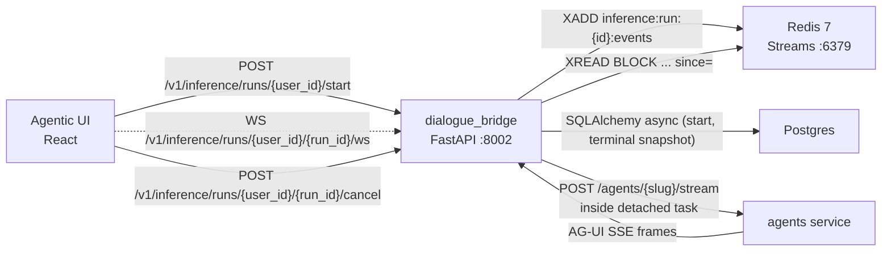
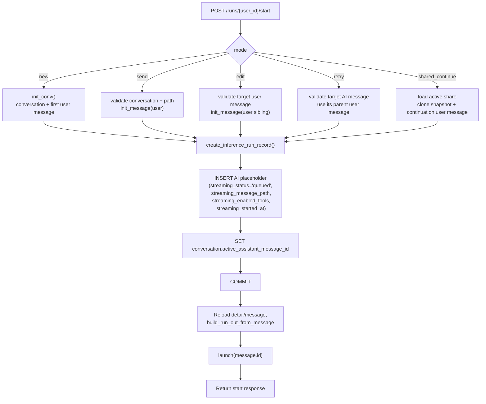
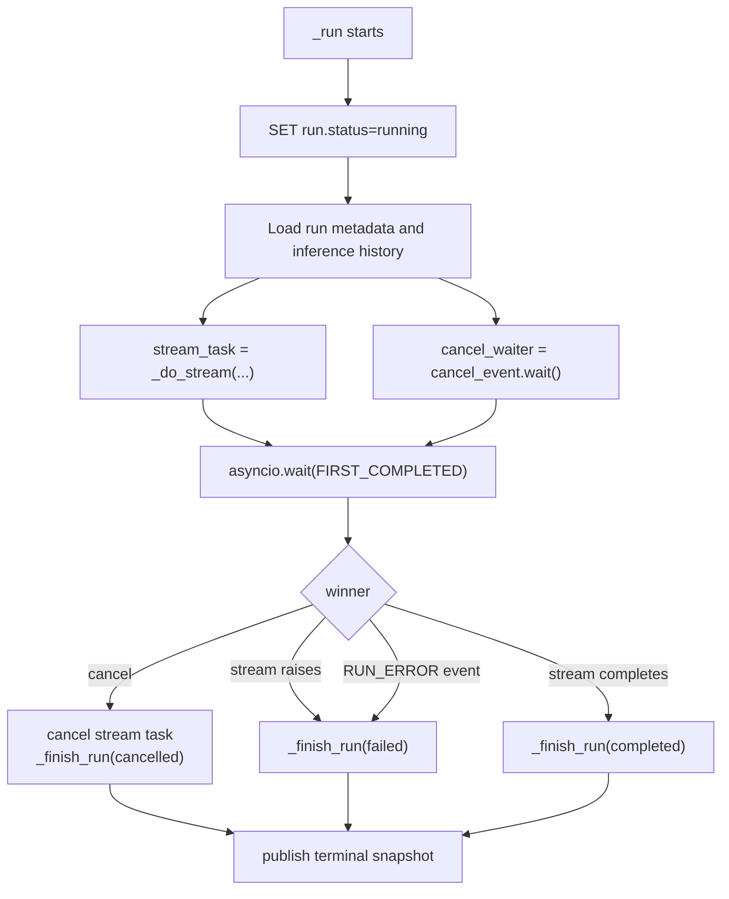
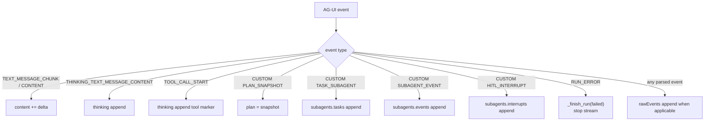
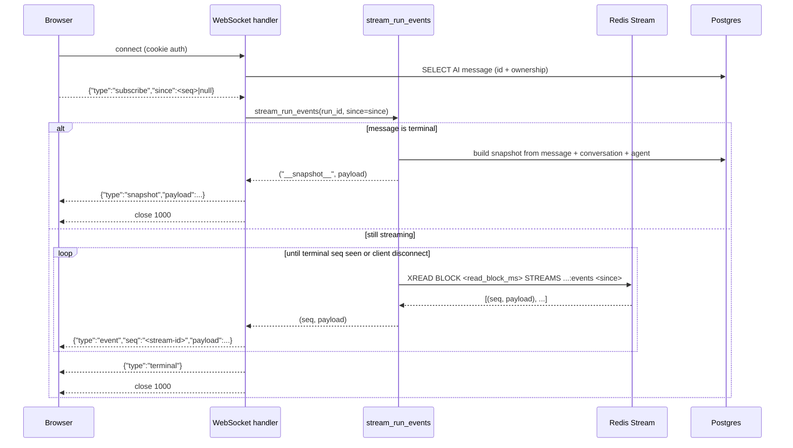
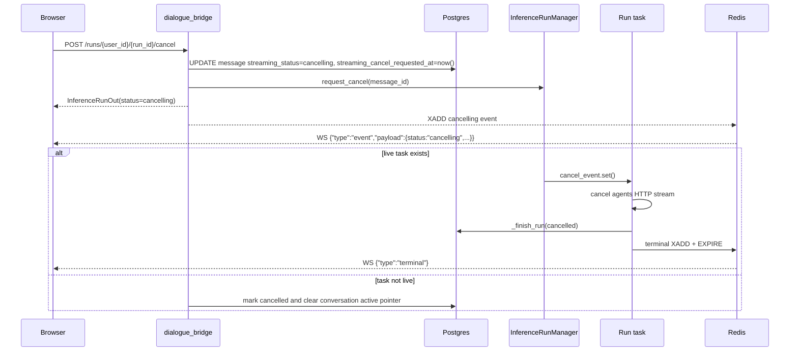
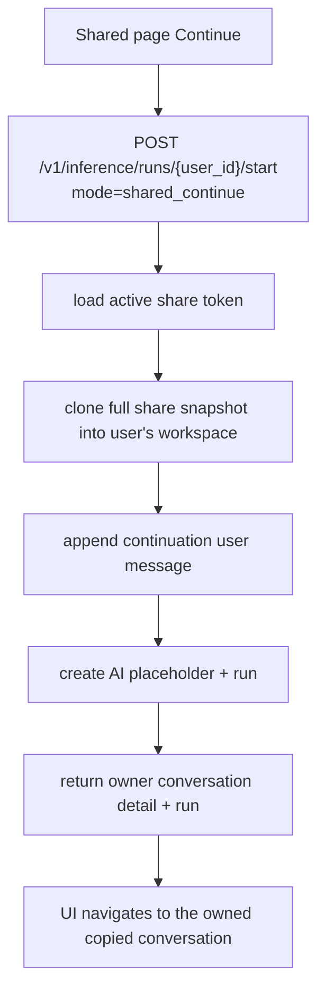

# Inference and Streaming Flow

Inference is backend-owned. The UI sends one start request, and the dialogue bridge persists the user-side action, creates the AI placeholder, creates the run, commits, launches the detached task, and returns the hydrated conversation state. The UI observes what the backend owns; it does not separately create durable user messages, AI placeholders, or runs.

The UI subscribes to events over **WebSocket** at `/v1/inference/runs/{user_id}/{run_id}/ws`. The connection is automatically re-established with a `since=<last-seen-seq>` cursor on transient failures (5-step exponential backoff, 250 ms → 5 s). Events are persisted to a per-run **Redis Stream** (`inference:run:{run_id}:events`) by the detached task; the WebSocket handler reads from that stream, so a brief network blip — or a container restart of `dialogue_bridge` — does not drop chunks. The legacy SSE endpoint at `/v1/inference/runs/{user_id}/{run_id}/stream` is still served for one release cycle but should not be used by new code.

Dictation, read aloud, and realtime voice mode do not use this flow.

---

## Services Involved



The event log is durable across container restarts (Redis is its own service) but ephemeral by design: stream keys get a 1 h `EXPIRE` applied on terminal status so reconnecting clients within that window can still replay missed events. The authoritative record of completed runs lives on the assistant `MessageTable` row — there is no separate `inference_runs` table; the row's `streaming_*` columns carry the lifecycle (`streaming_status`, `streaming_started_at`, `streaming_completed_at`, `streaming_message_path`, `streaming_enabled_tools`, `streaming_cancel_requested_at`) and the standard `content`/`raw_events`/`plan`/`subagents`/`reasoning_steps` columns carry the final accumulated state.

---

## Start Modes

`POST /v1/inference/runs/{user_id}/start` accepts a discriminated `mode` payload:

| Mode | Backend action before run creation | Run parent |
| --- | --- | --- |
| `new` | Create conversation and first user message | New first user message |
| `send` | Append a user message to an existing conversation | New user message |
| `edit` | Create an edited user-message sibling branch | New edited user message |
| `retry` | Create no user message; retry an AI response | Original AI message's parent user message |
| `shared_continue` | Clone a full shared snapshot into the user workspace and append the first continuation message | New continuation user message |

The response is always:

```json
{
  "detail": "ConversationDetail",
  "summary": "ConversationSummary",
  "run": "InferenceRunOut (built from the AI message row by build_run_out_from_message)",
  "message": "MessageOut for the AI placeholder"
}
```

The `detail` and `summary` are the source of truth for the UI immediately after start. The `run` shape is a view over the AI message — its `id` is the assistant `message_id`, and `runId` and `message_id` are interchangeable everywhere a run is referenced (URL params, WebSocket path, cancel endpoint, Redis stream key). If the user switches conversations after the request returns, a later conversation detail fetch plus active-run hydration can reconstruct the same state.

---

## Full Sequence

```mermaid
sequenceDiagram
    participant UI as Agentic UI
    participant Bridge as dialogue_bridge
    participant PG as Postgres
    participant Redis as Redis Stream
    participant Task as InferenceRunManager task
    participant Agents as agents service

    UI->>Bridge: POST /v1/inference/runs/{user_id}/start {mode, message, path, tools}
    Bridge->>PG: Validate user ownership and active-run conflicts
    Bridge->>PG: Persist user-side action for mode
    Bridge->>PG: INSERT AI placeholder (streaming_status='queued', streaming_message_path, streaming_enabled_tools)
    Bridge->>PG: SET conversation.active_assistant_message_id
    Bridge->>PG: COMMIT
    Bridge->>PG: Reload conversation detail and placeholder; build InferenceRunOut from message
    Bridge->>Task: launch(message.id)
    Bridge-->>UI: {detail, summary, run, message}

    UI->>UI: Apply returned detail/summary/run/message
    UI->>Bridge: WS /v1/inference/runs/{user_id}/{run_id}/ws
    UI-->>Bridge: {"type":"subscribe","since":null}

    Task->>PG: UPDATE message streaming_status=running
    Task->>PG: Load conversation + message history
    Task->>Agents: POST /agents/{slug}/stream

    loop AG-UI chunks
        Agents-->>Task: AG-UI SSE frame
        Task->>Task: Accumulate content, thinking, rawEvents, plan, subagents
        Task->>Redis: XADD inference:run:{id}:events <payload>
        Redis-->>Bridge: XREAD BLOCK ... -> {seq, payload}
        Bridge-->>UI: {"type":"event","seq":"...","payload":...}
    end

    Task->>PG: Terminal write: AI message + conversation (single transaction)
    Task->>Redis: XADD terminal payload + EXPIRE stream 1h
    Bridge-->>UI: {"type":"terminal"}
    UI->>UI: Clear active run and sidebar streaming state
```

## Database Execution Map

The inference flow is designed so live streaming does not write to Postgres per chunk. Postgres work happens at start, task startup, terminal finalization, hydration, and cancel. Per-chunk durability lives in Redis Streams (`inference:run:{message_id}:events`), not the database.

```mermaid
sequenceDiagram
    participant UI as Agentic UI
    participant Start as start_inference_flow
    participant Runs as create_inference_run_record
    participant Task as InferenceRunManager task
    participant WS as WebSocket handler
    participant Redis as Redis Stream
    participant PG as Postgres

    UI->>Start: POST /runs/{user_id}/start

    rect rgb(35, 35, 35)
        Note over Start,PG: Start request transaction
        Start->>PG: SELECT current user for route ownership dependency
        Start->>PG: SELECT conversation + messages + attachments for ownership/path validation
        alt mode = new
            Start->>PG: INSERT conversation
            Start->>PG: INSERT first user message + attachments/blobs
        else mode = send
            Start->>PG: INSERT user message + attachments/blobs
            Start->>PG: UPDATE conversation preview/timestamps from user message
        else mode = edit
            Start->>PG: INSERT edited user sibling + attachments/blobs
            Start->>PG: UPDATE conversation preview/timestamps from user message
        else mode = retry
            Start->>PG: No user message INSERT
        else mode = shared_continue
            Start->>PG: SELECT active share
            Start->>PG: INSERT copied conversation
            Start->>PG: INSERT copied snapshot messages + attachments/blobs
            Start->>PG: INSERT continuation user message + attachments/blobs
        end
        Runs->>PG: SELECT stale queued AI messages (streaming_status='queued') for conversation
        opt stale queued message without live task
            Runs->>PG: UPDATE stale AI message streaming_status=failed + error fields
            Runs->>PG: CLEAR conversation.active_assistant_message_id if needed
        end
        Runs->>PG: SELECT count(active streaming messages for user)
        Runs->>PG: SELECT active streaming message for conversation
        Runs->>PG: INSERT AI placeholder (streaming_status='queued', streaming_message_path, streaming_enabled_tools, streaming_started_at)
        Runs->>PG: UPDATE conversation.active_assistant_message_id + last_message_at
        Start->>PG: COMMIT
    end

    rect rgb(30, 42, 55)
        Note over Start,PG: Response hydration after commit
        Start->>PG: SELECT conversation detail + messages + attachments
        Start->>PG: SELECT AI placeholder + attachments/blobs (build_run_out_from_message)
    end

    par Observer connects
        UI->>WS: WS /runs/{user_id}/{run_id}/ws
        UI-->>WS: {"type":"subscribe","since":<seq>|null}
        WS->>PG: SELECT AI message (by id + ownership)
        alt streaming_status terminal
            WS->>PG: SELECT conversation + agent for snapshot
            WS-->>UI: {"type":"snapshot","payload":...}
            WS-->>UI: close
        else still streaming
            WS->>Redis: XREAD BLOCK ... STREAMS ...:events <since|0>
        end
    and Task starts
        Task->>PG: SELECT AI message by id
        Task->>PG: UPDATE message streaming_status=running
        Task->>PG: COMMIT
        Task->>PG: SELECT conversation detail + messages + attachments
        Task->>PG: SELECT agent metadata if not already cached
    end

    loop Every AG-UI stream chunk
        Task->>Task: Accumulate content/thinking/rawEvents/plan/subagents in memory
        Task->>Redis: XADD inference:run:{id}:events MAXLEN~5000 payload=<json>
        Redis-->>WS: replay frame to every connected observer
        WS-->>UI: {"type":"event","seq":"<stream-id>","payload":...}
        Note over Task,PG: No Postgres read or write per chunk
    end

    rect rgb(55, 40, 35)
        Note over Task,PG: Terminal finalization
        Task->>PG: SELECT AI message + attachments/blobs
        Task->>PG: UPDATE AI message: content / reasoning_steps / reasoning_time_seconds / raw_events / plan / subagents / error fields / streaming_status / streaming_completed_at
        Task->>PG: SELECT conversation by id
        Task->>PG: CLEAR conversation.active_assistant_message_id (if pointing at this message)
        Task->>PG: UPDATE conversation preview/timestamps
        Task->>PG: COMMIT
    end

    Task->>Redis: XADD terminal payload
    Task->>Redis: EXPIRE inference:run:{id}:events 3600s
    Redis-->>WS: terminal frame
    WS-->>UI: {"type":"terminal"}
    WS-->>UI: close 1000 (normal)
```



| Moment | Database work | Redis work | Why it exists |
| --- | --- | --- | --- |
| Start request | Ownership/path reads, mode-specific writes, active-stream checks, AI placeholder insert with `streaming_*` columns, conversation active pointer update, one commit | — | Makes the whole user action durable before the UI observes it |
| Response hydration | Conversation detail + placeholder reloads, run shape built from the message row | — | Returns canonical backend state to the UI |
| WebSocket connect/reconnect | AI message + conversation summary reads (terminal snapshot path), or message lookup only (live path) | `XREAD BLOCK` from the supplied `since` cursor (or `0` for full backlog) | Lets the UI recover from refresh, navigation, container restart, or transient network blips |
| Task startup | Message `streaming_status` update, conversation/history read, agent metadata read | — | Prepares the request sent to the agents service |
| Stream chunks | No database execution | `XADD` per parsed AG-UI event with `MAXLEN ~ 5000` trim | Keeps token streaming latency independent of DB writes; durable in Redis up to the trim cap |
| Terminal finalization | AI message + conversation update, conversation active pointer clear, one commit | Final terminal `XADD` + `EXPIRE 3600s` on the stream key | Persists the final answer and removes active streaming state |
| Cancel, optional | Message `streaming_status='cancelling'`; if no live task, full cleanup + commit | Cancel event published into the stream | Makes cancellation visible immediately and clears orphaned active state |

---

## Phase 1 - Backend-Owned Start

The router is intentionally thin. `router/inference.py::startInferenceFlow()` validates CSRF/session/rate limit, calls `utils/inference_start.py::start_inference_flow()`, launches the run, and returns the already-built response.

`start_inference_flow()` does the orchestration:

1. Dispatches by `payload.mode`.
2. Validates conversation ownership before any existing-conversation write.
3. Rejects unsupported modes or missing mode-specific fields.
4. Persists the user-side action for `new`, `send`, `edit`, and `shared_continue`.
5. Uses the existing user prompt for `retry`.
6. Calls `create_inference_run_record()` to create the AI placeholder with `streaming_status='queued'` and the run snapshot columns.
7. Commits once.
8. Reloads and returns `ConversationDetail`, `ConversationSummary`, the `InferenceRunOut` shape built from the message row, and the placeholder `MessageOut`.



`create_inference_run_record()` also enforces:

- one active stream per conversation, backed by `uq_messages_one_active_stream_per_conversation` (partial unique index on `streaming_status IN ('queued','running','cancelling')`)
- per-user active-run limits (`SELECT COUNT(*) FROM messages WHERE user_id = ? AND streaming_status IN active`)
- stale queued-message cleanup before creating a new placeholder
- message lineage validation before storing `streaming_message_path`

If `launch()` raises after the DB commit, the router marks the run as failed with `mark_run_launch_failed()` and returns a 500. That prevents a queued run from being left active forever.

---

## Lineage Rules

Inference history is branch-aware. The backend does not blindly trust the client path.

- `messagePath` entries must all belong to the conversation.
- Each entry must be parent-linked to the next entry.
- For `send`, the path must end at the selected parent before the new user message is inserted.
- For `edit`, the target must be a user message; the new user message is a sibling under the original parent.
- For `retry`, the target must be an AI message; the run parent is that AI message's parent user message.
- The stored run `message_path` is rebuilt by the backend and ends in the new AI placeholder.

This matters for branching: editing and retrying should create siblings, not overwrite existing messages or accidentally run against a stale branch.

---

## Phase 2 - Detached Task Lifecycle

`InferenceRunManager.launch(run_id)` creates an `asyncio.Task` for `_run(run_id, cancel_event)` and stores the task and cancellation event in memory. The task:

1. Marks the run as `running`.
2. Loads static run metadata and the prepared message history.
3. Starts `_do_stream()` against the agents service.
4. Races the stream task against `cancel_event.wait()`.
5. Finishes as `completed`, `cancelled`, or `failed`.



Terminal status is idempotent and authoritative. A run that has already failed or cancelled cannot later be marked completed by a late stream result.

---

## Phase 3 - AG-UI Runtime Accumulation

The bridge streams the agents service response as AG-UI events and accumulates a runtime state in memory. Runtime updates do not write to the database.



Live update payloads include enough state for the UI to render the current response: `content`, `thinking`, `rawEvents`, `plan`, and `subagents`.

---

## Phase 4 - WebSocket Observation

`WS /v1/inference/runs/{user_id}/{run_id}/ws` opens the observer connection. The handler authenticates the session cookie (`authenticate_websocket_user`), accepts the upgrade, awaits the client's first frame `{"type":"subscribe","since":<seq>|null}`, then drives `stream_run_events(run_id, since=since)`. Close codes are app-defined in the 4xxx range: `4401` unauthenticated, `4403` not yours, `4404` no such run, `4400` malformed handshake.



The client tracks `lastSeenInferenceSeq` per run; on any close that is not user-initiated, it reconnects with exponential backoff (250 ms → 500 → 1 s → 2 s → 5 s) and re-sends `subscribe` with the latest cursor. Missed events are replayed from Redis up to the 1 h post-terminal TTL. The toast surface only fires after 5 sustained failures, or immediately on a permanent close code (`4401`/`4403`/`4404`).

Multiple observers per run are supported natively — Redis Streams fan out reads, so each WebSocket handler is an independent `XREAD` consumer.

---

## Phase 5 - Terminal Write

`_finish_run()` is the only durable Postgres write after start. In one transaction it updates:

- AI `MessageTable` row: `content`, `reasoning_steps`, `reasoning_time_seconds`, `raw_events`, `plan`, `subagents`, `is_error`, `error_message`, `streaming_status`, `streaming_completed_at`
- `ConversationTable`: clears `active_assistant_message_id` (if pointing at this message), updates `last_message_preview` and `last_message_at`

After commit, the task emits one final terminal event to the Redis stream and applies `EXPIRE` with `terminal_ttl_seconds` (default 3600). Connected WebSocket observers receive the terminal frame and close cleanly. Late reconnects within the TTL window can still replay the full backlog from Redis; reconnects after expiry get a one-shot Postgres snapshot from `stream_run_events`. The UI treats terminal `streaming_status` as authoritative and clears `activeRunId`/`isStreaming` even if an older summary still contains active flags.

---

## Phase 6 - Cancel Flow



Cancel interrupts the agents HTTP stream at the next await inside the bridge task; it does not wait for the next agent chunk.

---

## Phase 7 - UI Hydration and Sidebar State

`useInferenceRuns` is the only AG-UI observer in the frontend.

- `beginRun()` calls `startInference(userId, request)`.
- It applies the returned `detail`, `summary`, `run`, and placeholder `message`.
- It opens a WebSocket observer at `/v1/inference/runs/{user_id}/{run_id}/ws` via `connectInferenceWebSocket(userId, runId, applyRunEvent, controller.signal)`.
- The client tracks the last-seen `seq` per run in `lastSeenInferenceSeq`. Transient closes trigger exponential-backoff reconnects with `since=<seq>`; missed events replay from Redis. The "stream observer lost" toast only surfaces after 5 sustained reconnect failures or a permanent close code (`4401`/`4403`/`4404`).
- On mount, it calls `getActiveInferenceRuns(userId)` and observes every active run.
- When active-run hydration returns, conversations not returned as active are cleared locally.
- Terminal events always clear `runsByConversation`, `activeRunId`, and `isStreaming` for that conversation.

The IndexedDB UI snapshot intentionally does not persist transient streaming state. Serialized and deserialized conversation summaries force `activeRunId: null` and `isStreaming: false`; after rehydrating a snapshot, the app fetches fresh conversations and active runs from the backend.

---

## Shared Conversation Continuation

Shared continuation uses the same start endpoint and run lifecycle as normal chat.



The original shared conversation is not mutated. The copied conversation belongs to the authenticated user and behaves like any normal conversation after creation.

---

## Sharp Edges and Behavioral Notes

- **Start is atomic; launch is not part of the DB transaction.** The AI placeholder commits before `launch()`. If launch fails, the bridge marks the message `streaming_status='failed'` so the conversation is not left active.
- **The run id is the assistant message id.** There is no separate `inference_runs` table — every reference to `run_id` in URLs, WebSocket frames, Redis stream keys, and runtime caches is the AI `messages.id`.
- **One active stream per conversation.** The backend pre-checks, and the partial unique index `uq_messages_one_active_stream_per_conversation` enforces active statuses `queued`, `running`, and `cancelling`.
- **Streaming has no intermediate DB writes.** Per-chunk durability lives in Redis Streams. Refresh during a live run replays from Redis up to `MAXLEN ~ 5000` events; terminal commits the final state to Postgres.
- **Reconnect is transparent up to 1 h after terminal.** The WebSocket client resumes with `since=<lastSeenSeq>`; the Redis stream is kept alive for `terminal_ttl_seconds` (default 3600 s) after `streaming_status` flips terminal.
- **Startup cleanup fails orphaned active streams.** On bridge startup, AI messages stuck in `streaming_status IN ('queued','running','cancelling')` from a previous process are transitioned to `failed` and conversation active pointers are cleared (`cleanup_orphaned_inference_runs`).
- **Stale queued messages are cleaned before creating a new placeholder.** This protects conversations from a queued AI row left behind before task launch.
- **`RUN_ERROR` is terminal failed.** It cannot later become completed.
- **Frontend snapshots must not restore spinners.** Sidebar streaming indicators come from fresh backend summary/detail or active-run hydration, not persisted UI cache.

---

## File Map

| Concept | File | What to look for |
| --- | --- | --- |
| Start endpoint | [src/dialogue_bridge/router/inference.py](../../src/dialogue_bridge/router/inference.py) | `startInferenceFlow()` |
| Backend start orchestration | [src/dialogue_bridge/utils/inference_start.py](../../src/dialogue_bridge/utils/inference_start.py) | `start_inference_flow()` and mode helpers |
| Run creation and lineage | [src/dialogue_bridge/utils/inference_runs.py](../../src/dialogue_bridge/utils/inference_runs.py) | `create_inference_run_record()` |
| Lineage validation | [src/dialogue_bridge/utils/inference.py](../../src/dialogue_bridge/utils/inference.py) | `resolve_inference_message_path()` |
| Task lifecycle | [src/dialogue_bridge/utils/inference_runs.py](../../src/dialogue_bridge/utils/inference_runs.py) | `InferenceRunManager._run()` |
| Stream loop | [src/dialogue_bridge/utils/inference_runs.py](../../src/dialogue_bridge/utils/inference_runs.py) | `InferenceRunManager._do_stream()` |
| Runtime accumulator | [src/dialogue_bridge/utils/inference_runs.py](../../src/dialogue_bridge/utils/inference_runs.py) | `InferenceRunRuntime.apply_event()` |
| Terminal write | [src/dialogue_bridge/utils/inference_runs.py](../../src/dialogue_bridge/utils/inference_runs.py) | `_finish_run()` |
| Observer generator | [src/dialogue_bridge/utils/inference_runs.py](../../src/dialogue_bridge/utils/inference_runs.py) | `stream_run_events()`, `SNAPSHOT_SEQ_SENTINEL` |
| Redis event log | [src/dialogue_bridge/utils/event_log.py](../../src/dialogue_bridge/utils/event_log.py) | `RedisEventLog.append()`, `.read_since()`, `.mark_terminal()` |
| WebSocket endpoint | [src/dialogue_bridge/router/inference.py](../../src/dialogue_bridge/router/inference.py) | `inference_run_websocket()` |
| Legacy SSE endpoint (deprecated) | [src/dialogue_bridge/router/inference.py](../../src/dialogue_bridge/router/inference.py) | `observeInferenceRun()` — kept one release cycle |
| Cancel path | [src/dialogue_bridge/utils/inference_runs.py](../../src/dialogue_bridge/utils/inference_runs.py) | `request_run_cancel()` |
| Run shape builder | [src/dialogue_bridge/utils/inference_runs.py](../../src/dialogue_bridge/utils/inference_runs.py) | `build_run_out_from_message()` |
| Orphaned-run cleanup | [src/dialogue_bridge/utils/inference_runs.py](../../src/dialogue_bridge/utils/inference_runs.py) | `cleanup_orphaned_inference_runs()` |
| Shared clone helper | [src/dialogue_bridge/utils/shared_conv.py](../../src/dialogue_bridge/utils/shared_conv.py) | `create_conversation_from_share_record()` |
| Redis settings | [src/dialogue_bridge/core/settings.py](../../src/dialogue_bridge/core/settings.py) | `RedisSettings` — `url`, `password`, `stream_maxlen`, `terminal_ttl_seconds`, `read_block_ms` |
| WebSocket auth | [src/dialogue_bridge/core/auth_session.py](../../src/dialogue_bridge/core/auth_session.py) | `authenticate_websocket_user()` |
| Frontend inference runtime | [src/agentic_ui/src/runtime/inference.ts](../../src/agentic_ui/src/runtime/inference.ts) | `handleSendMessage()`, edit/retry/shared continue start requests |
| Frontend observer hook | [src/agentic_ui/src/hooks/useInferenceRuns.ts](../../src/agentic_ui/src/hooks/useInferenceRuns.ts) | `beginRun()`, `applyRunEvent()`, `observeRunId()` |
| Frontend WebSocket client | [src/agentic_ui/src/lib/api.ts](../../src/agentic_ui/src/lib/api.ts) | `connectInferenceWebSocket()`, `lastSeenInferenceSeq`, `PermanentInferenceWebSocketError` |
| Frontend API calls | [src/agentic_ui/src/lib/api.ts](../../src/agentic_ui/src/lib/api.ts) | `startInference()`, `getActiveInferenceRuns()` |
| Nginx WebSocket upgrade | [src/agentic_ui/nginx.conf.template](../../src/agentic_ui/nginx.conf.template) | `$connection_upgrade` map + `^~ /api/v1/inference/runs/` location |
| UI snapshot storage | [src/agentic_ui/src/lib/uiStateStorage.ts](../../src/agentic_ui/src/lib/uiStateStorage.ts) | transient run flags are stripped |
