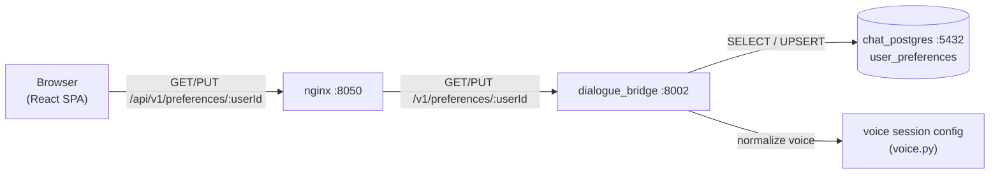
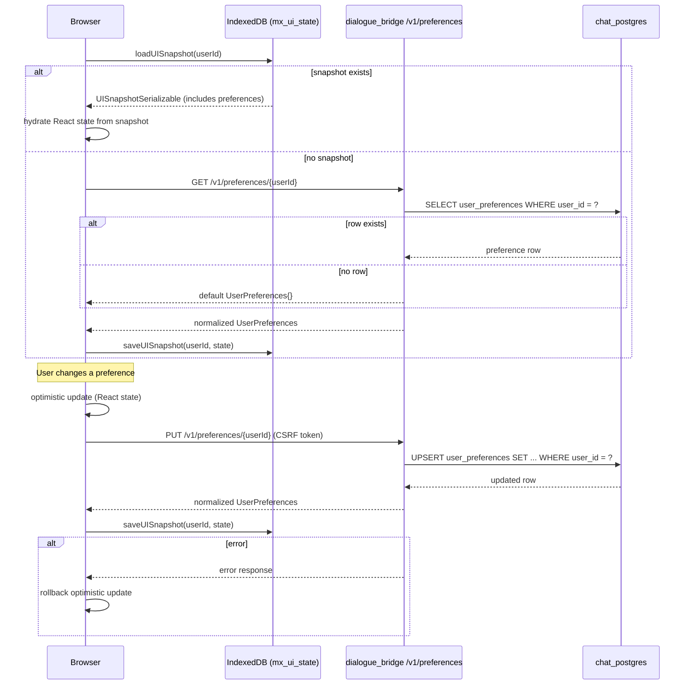
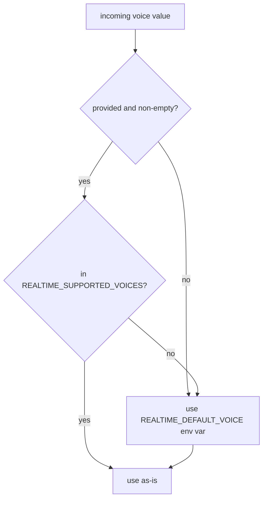

# User Preferences

User preferences capture per-user settings that persist across sessions: whether suggestions are shown, how agents are personalized (personality preset + custom instructions), whether agent memory and cross-conversation recall are active, and which voice and language to use in realtime voice conversations. The source of truth is a single row in the `user_preferences` PostgreSQL table, one per user. The frontend caches preferences in IndexedDB for instant rehydration on page load, applies them optimistically in React state, and writes changes back to the database via a single `PUT` endpoint. The backend reads preferences directly from the database for any server-side decisions (voice session config, voice language, per-run personalization, the memory gates).

**Tool enablement is NOT a user preference.** There is no global "enabled tools" set here anymore. Tools are declared **per agent** (in the agent's `agent.yaml`), and a user disables specific tools **per (user, agent)** in the **Settings → Agents** tab; that disabled set is stored server-side by the agents service, not in `user_preferences`. See [§ Tool control moved to the Agents tab](#tool-control-moved-to-the-agents-tab) below and [catalog.md](catalog.md).

**Where preferences surface in the UI.** The settings modal (`ProfilePanel`, opened from the sidebar profile menu) mirrors ChatGPT's section taxonomy: theme, follow-up suggestions, and per-message token usage live under **General**; the style controls — **Custom instructions** (opened in its own dialog) and the **Personality** preset select — plus the agent-memory (`useMemory`) and reference-chat-history (`searchPastConvs`) toggles under **Personalization**; the realtime voice + spoken language under **Voice**; per-(user, agent) tool disabling under **Agents**; and a **read-only** browse of the MCP catalog under **MCP Servers** (Workspace group) — the MCP Servers tab no longer carries any global tool toggle. Sections mirrored from ChatGPT that aren't built yet render a "Not implemented yet" placeholder. Legacy persisted tab ids (`profile`/`appearance`/`archived`) are remapped to `account`/`personalization`/`data-controls` on load.

---

## Services Involved



---

## Full Sequence — Load and Apply Preferences

The sequence below shows the full lifecycle from app start through a preference change.



---

## Phase 1 — Database Schema

The `user_preferences` table has a one-to-one relationship with `users`. A row is only created on the first `PUT` — before that, `GET` returns default values from the application layer, never from a real row.

| Column | DB Type | Default | Description |
| --- | --- | --- | --- |
| `id` | String (UUID) | `gen_uuid()` | Row PK |
| `user_id` | String (FK) | — | FK to `users.id`; UNIQUE; cascade delete |
| `suggestions_enabled` | Boolean | `true` | Show/hide starter suggestion chips in the chat UI |
| `search_past_convs` | Boolean | `false` | Opt-in: attach the deep-agent `search_past_conversations` memory tool. Migration `0011`. |
| `use_memory` | Boolean | `true` | On by default: gates a deep agent's persistent memory (AGENT.md `/memories/` mount + future memory folder). Threaded into the run config; turn off to run agents without their stored memory. Migration `0012`. |
| `personality` | String | `"default"` | Personality preset id for agent responses (`default` = no injected directive). Fail-closed against the preset registry. Migration `0015`. |
| `custom_instructions` | JSON | `{}` | `{enabled, nickname, occupation, traits, about}` — user-authored instructions injected into deep-agent prompts while `enabled`. Migration `0015`. |
| `voice_mode_voice` | String | `"alloy"` | OpenAI Realtime voice identity |
| `voice_mode_language` | String | `"english"` | Language for realtime voice instructions |
| `updated_at` | DateTime | `func.now()` | Auto-updated on every write |

All boolean columns use explicit `bool()` coercion on insert/update to guard against string values arriving from JSON.

> The old `tools` JSON column (the global `{disabled: [{serverId, toolName}]}` blob) was **dropped** in migration `0016_retire_enabled_tools`. Global tool enablement no longer exists; tool control is per (user, agent) and lives on the agents service (see below).

---

## Phase 2 — API Endpoints

Both endpoints live under `/v1/preferences/{user_id}` in `dialogue_bridge`.

### GET — Fetch Preferences

Returns the current preferences for the user. If no row exists, returns a default `UserPreferences` object with all fields at their application defaults. No row is created by a `GET`.

**Response shape:**

```python
class UserPreferences(BaseModel):
    suggestionsEnabled: bool           # default: True
    searchPastConvs: bool              # default: False
    useMemory: bool                    # default: True
    personality: str                   # default: "default" (fail-closed to preset registry)
    customInstructions: CustomInstructions  # {enabled, nickname, occupation, traits, about}
    voiceModeVoice: str                # default: "alloy"
    voiceModeLanguage: str             # default: "english"
```

Voice and language values are normalized before return — invalid DB values are silently corrected to defaults (see Phase 4).

### PUT — Upsert Preferences

Writes the complete preferences object for the user. If a row exists, all fields are updated. If no row exists, a new row is inserted.

- **Auth required:** valid `user_id` (session-validated) + CSRF token
- **Returns:** the normalized, persisted `UserPreferences` object

The `PUT` is always a full replacement — there is no partial `PATCH`. The frontend always sends the full current state of preferences.

---

## Phase 3 — Preference Categories

### Suggestions

`suggestionsEnabled` is a boolean flag. When `false`, the frontend hides the starter suggestion chips that appear in empty conversations. The backend catalog suggestions endpoint (`GET /v1/catalog/suggestions`) is still called — the frontend simply does not render the result.

### Search Past Conversations

`searchPastConvs` is an opt-in (default `false`) that gates the deep-agent `search_past_conversations` memory tool. Unlike most preferences, it **is** applied server-side: when a run starts, the bridge reads it and threads it into the agents `/stream` request config under `context.search_past_convs`, and the deep agent attaches the tool only when it is true (see [conversation-embeddings](conversation-embeddings.md)). Off by default, so a user gets cross-conversation recall only after enabling it here.

### Agent Memory

`useMemory` is on by default (`true`) and gates a deep agent's **per-(user, agent) persistent memory**: the `/memories/` mount holding `AGENTS.md` (a compact index injected as always-on context) plus `entries/<name>.yml` detail files the agent reads on demand, and the built-in **`remember`** tool that writes them. Like `searchPastConvs`, it is applied server-side and **per run**: the bridge threads it into the agents `/stream` request config under `context.use_memory`, `BaseAgent.__init__` parses it into `self.use_memory`, and the deep-agent build dynamically includes or omits the memory wiring — when false, `load_agent_md()` returns `[]`, `_build_composite_backend()` drops the `/memories/` mount, and `remember` isn't attached. Turning it off lets a user run an agent with no stored memory, no agent code change. Distinct from `searchPastConvs`: this gates the agent's own memory (read + write), that one gates cross-conversation message search.

### Personality & Custom Instructions

The two style preferences (Settings → Personalization) mirror ChatGPT's taxonomy:

- **`personality`** — one preset id from the registry (`default`, `professional`, `friendly`, `candid`, `quirky`, `efficient`, `cynical`, `nerdy`). Each non-default preset maps to a style directive the agents service injects into the system prompt; `default` injects nothing, so the agent keeps its own voice. The id is validated **fail-closed** at every layer (frontend normalizer, bridge schema validator, agents runtime parse) — an unknown id silently collapses to `default`, same stance as voice normalization.
- **`customInstructions`** — the user-authored document `{enabled, nickname, occupation, traits, about}` edited in the dedicated dialog (opened from the Personalization tab; the dialog saves the whole document in one `PUT` and closes only on success). Field lengths are capped identically on both sides (nickname 100, occupation 150, traits/about 1500 — `CUSTOM_INSTRUCTIONS_LIMITS` on the client, `max_length` in the bridge schema, re-capped in the agents runtime); control characters are stripped at the bridge boundary. The `enabled` flag lets the user keep the text saved without applying it.

Both are applied **server-side per run** — see Phase 6. Instruction content is treated as user PII: the bridge logs only the preset id and the enabled flag, never the text.

### Voice Mode Voice

The voice used for OpenAI Realtime API sessions. The set of valid voices is controlled by the `REALTIME_SUPPORTED_VOICES` environment variable (comma-separated), which defaults to:

`alloy`, `ash`, `ballad`, `cedar`, `coral`, `echo`, `marin`, `sage`, `shimmer`, `verse`

The frontend renders each voice with a label, gender, and description sourced from the `REALTIME_VOICES` constant in `shared/lib/consts/voice.ts`. The stored value is always a lowercase string matching the OpenAI voice name.

### Voice Mode Language

The language the realtime voice session **opens** in. It is not a lock: the
instruction built from it tells the model to detect the language the user is
actually speaking and mirror it, switching mid-conversation if they switch, so
this preference only decides the first turn.

The set of valid values is controlled by the `VOICE_MODE_SUPPORTED_LANGUAGES`
environment variable (comma-separated), which defaults to:

`english` (default), `greek`, `spanish`, `french`, `german`, `italian`, `portuguese`, `dutch`, `polish`, `romanian`, `turkish`, `arabic`, `hindi`, `russian`, `ukrainian`, `chinese`, `japanese`, `korean`

Must stay in sync with `VOICE_MODE_LANGUAGES` in `shared/lib/consts/voice.ts` — a
value the picker cannot display is a value the user can never see or correct.

Widening the list costs one entry on each side: the instruction is a single
template with the language interpolated (`"Open this conversation in
{Language}."`), not a hand-written prompt per language. It stays an allow-list
rather than free text because the value is interpolated into the model's system
instruction, so arbitrary client input here would be a prompt-injection surface.

The language controls the text injected by the voice instruction builder, not any transcription model. The Realtime session pins no transcription locale, and Whisper-based dictation uses its own language detection independently.

---

## Tool control moved to the Agents tab

Tool enablement used to be a global user preference: the frontend subtracted a global `tools.disabled` set from the full catalog, computed an `enabledTools` list, and sent it on every inference request. **That model is fully retired.** `user_preferences.tools` no longer exists, the request no longer carries `enabledTools`, and the bridge no longer forwards a `config["tools"]` list to the agents service.

Tools are now owned by the agents service:

- **Declared per agent.** A deep agent declares its tool set (native + MCP) in its `agent.yaml` `tools:` list. A `YamlDeepAgent` resolves those tools from its spec at build time, independently of any request — the client no longer tells the agent which tools to attach.
- **Disabled per (user, agent).** In **Settings → Agents**, a user can disable specific tools for a specific agent. That disabled set is persisted **server-side** by the agents service in a `tool_prefs.json` at the agent's root (`runtime/filesystem/tool_prefs.py`), not in `user_preferences`. The agent's effective tool set is `declared − disabled` (`_apply_tool_disables`).
- **MCP Servers tab is read-only.** The **Settings → MCP Servers** tab is a browse-only view of the MCP catalog; it carries no global toggle. Enable/disable happens only in the per-agent Agents tab.
- **LangGraph agents are unaffected.** `hr_policies` / `orthodox` / `retail` reach RAG through a graph **node** that calls `rag_service` over HTTP — retrieval is never a bound tool — so they have no tool set to disable and an empty request tool list changes nothing for them.

Because none of this is a `user_preferences` field, none of the mutation/normalization/IndexedDB flow below applies to tool control.

---

## Phase 4 — Normalization and Fallback

Both the GET and PUT handlers normalize voice and language values before storing or returning them. This guarantees the API always returns a valid, usable preference regardless of what is in the database.



The same pattern applies to language: if the value is missing or not in `{"english", "greek"}`, it falls back to `"english"`.

**Fallback chain (voice session):**

```
1. Value from request payload (per-request override)
2. Value from user_preferences row in DB
3. REALTIME_DEFAULT_VOICE env var
```

The voice.py utility functions (`preferred_realtime_voice`, `preferred_voice_mode_language`) implement this chain. They are called by the voice router on every session creation request.

---

## Phase 5 — Frontend State and Sync

The frontend manages preferences across three layers: React state (live updates), IndexedDB (fast rehydration), and the database API (durable persistence).

### Hydration Order on Page Load

1. `loadUISnapshot(userId)` reads IndexedDB — if preferences are in the snapshot, they are applied immediately to React state with no API call
2. If no snapshot, `getUserPreferences(userId)` fetches from the backend and then saves to IndexedDB

### Mutation Flow (usePreferencesHandlers)

Every preference mutation follows the same pattern:

```
1. Apply change to React state immediately (optimistic)
2. PUT to /api/v1/preferences/{userId}
3. On success: call persistUIState() to sync IndexedDB
4. On error: rollback React state to previous value + show toast
```

The handlers are:

| Handler | What it changes |
| --- | --- |
| `handleToggleSuggestionsEnabled()` | Flips `suggestionsEnabled` |
| `handleToggleSearchPastConvs()` | Flips `searchPastConvs` (memory-tool gate) |
| `handleToggleUseMemory()` | Flips `useMemory` (agent persistent-memory gate) |
| `handleSelectPersonality(id)` | Sets `personality` (no-op when unchanged) |
| `handleSaveCustomInstructions(doc)` | Replaces the whole `customInstructions` document; returns success so the dialog closes only when persisted |
| `handleSelectVoiceModeVoice(voice)` | Sets `voiceModeVoice` |
| `handleSelectVoiceModeLanguage(language)` | Sets `voiceModeLanguage` |

All handlers build their payload through a shared `snapshotPrefs(overrides)` + `persistPrefs(next, errorTitle)` pair: the snapshot always carries **every** field (the `PUT` is a full replacement, so a handler that omitted a field would silently wipe it), and the persist helper owns the optimistic-update/rollback/toast flow once.

### Cross-Tab Consistency

There is no real-time cross-tab sync. If preferences are changed in a second tab, the first tab will not update until it reloads. The IndexedDB snapshot reflects the state at the time of the last successful write in the current tab.

---

## Phase 6 — Backend Application of Preferences

Preferences are read server-side for voice sessions, for the memory-tool gate (`search_past_convs`), and for the agent-memory gate (`use_memory`). Suggestions gating is managed entirely by the frontend. Tool enablement is not a preference at all — it is resolved by the agents service from the agent's declared set minus the per-(user, agent) disabled set (see [§ Tool control moved to the Agents tab](#tool-control-moved-to-the-agents-tab)).

### Voice Session

When the browser calls `POST /v1/voice/session`, the voice router:

1. Reads `payload.voice` and `payload.language` from the request body (may be `null`)
2. Calls `preferred_realtime_voice(db, user_id, payload.voice)` — resolves to a valid voice string using the fallback chain
3. Calls `preferred_voice_mode_language(db, user_id, payload.language)` — resolves to `"english"` or `"greek"`
4. Passes both to the voice instruction builder, which constructs the OpenAI Realtime session config

This means the browser can override preferences per-session by sending explicit values in the request, but if it sends `null`, the stored preference is used automatically.

### Search-Past-Conversations Gate

`search_past_convs` is the one boolean the bridge applies itself. In `inference_runs._run`, the bridge loads the user's preference row and includes `context.search_past_convs` in the agents `/stream` request config. The deep agent's `_builtin_tools()` attaches the `search_past_conversations` tool only when that flag is true. It is read **per run** (not cached), so toggling it takes effect on the user's next message.

### Agent-Memory Gate

`use_memory` is loaded from the same preference row in `inference_runs._run` and included as `context.use_memory` (default `true` when no row exists). `BaseAgent.__init__` parses it into `self.use_memory`; the deep agent's build reads that flag to include or omit its per-(user, agent) memory wiring — the `/memories/` mount (`AGENTS.md` index + `entries/*.yml`) and the `remember` write tool. Also read **per run**, so turning memory off applies on the next message. No `_WORKSPACE_WRITE_DENY` rule targets `/memories/`, so dropping that mount needs no permission change.

### Personalization (Personality + Custom Instructions)

Loaded from the same preference row in `inference_runs._run` and reduced by `_effective_personalization()` to only *effective* data: the preset id when non-`default`, and the non-empty custom-instruction text fields only while `enabled` is true. When nothing applies, the `context.personalization` key is **omitted entirely**, so a default run's agent prompt is byte-identical to the pre-feature one.

On the agents side the main logic lives in [`runtime/personalization.py`](../../src/agents/runtime/personalization.py): `BaseAgent.__init__` re-parses the payload **fail-closed** (unknown preset → `default`; text stripped of control characters and re-capped — defense in depth across the service boundary), and `DeepAgent.build_deep_agent()` appends the composed `## User Personalization` block to the system prompt — after the agent's static instructions, before the memory block. The block frames the user text as *data* wrapped in `<user_custom_instructions>` fences (the closing fence is filtered out of user text) and states explicitly that it adjusts tone/style only, never tool policy, filesystem permissions, or safety rules. Personalization applies to the **main agent only**, never sub-agents, and only deep agents consume it today (LangGraph agents parse but ignore it). Read **per run**, so changes apply on the next message.

---

## Sharp Edges and Behavioral Notes

- **No row until first PUT.** A new user has no `user_preferences` row. The `GET` endpoint returns a default object, not a DB row. Nothing is persisted until the user (or the UI) explicitly writes a preference. This means a user who never opens the preferences panel has no row.

- **Full replacement on PUT.** The `PUT` endpoint replaces all fields. If the frontend sends an incomplete object, fields not present in the payload are coerced to their Pydantic defaults (e.g., a missing `personality` becomes `"default"`, a missing `customInstructions` becomes `{}`). Always send the full current state.

- **Tool control is not in this row.** `user_preferences` no longer has a `tools` column, and no inference request carries an `enabledTools` list. Tool enablement is resolved entirely by the agents service (declared per agent, disabled per (user, agent)); a preferences `PUT` can neither enable nor disable a tool. See [§ Tool control moved to the Agents tab](#tool-control-moved-to-the-agents-tab).

- **Voice normalization is silent.** If an unsupported voice name is stored in the DB (e.g., from a previous deployment with different supported voices), the GET response returns the fallback default without any error. The user's preference is effectively reset without notification.

- **Personality normalization is silent too — and triple-layered.** The frontend normalizer, the bridge schema validator, and the agents runtime parse all collapse an unknown preset id to `default` independently. Renaming or removing a preset therefore never errors, but silently resets affected users; the three registries (`consts.PERSONALITY_PRESETS`, bridge `PERSONALITY_IDS`, agents `_PERSONALITY_DIRECTIVES`) must be kept in lockstep manually.

- **Custom-instruction content is PII by policy.** No layer logs the text: the bridge logs only `personality` + `custom_instructions_enabled`, the agents service logs only the preset id and a has-instructions boolean.

- **No partial PATCH.** There is no `PATCH` endpoint. Every update is a full write. The frontend always sends all fields, so this is safe in practice — but any external client that sends partial payloads will lose fields not included.

- **`prefersAgenticChat` is gone.** It was always a no-op — stored and returned, but never consumed by inference routing or UI rendering — so it was removed from the API schema, the router, the frontend type, the settings screens and the database (migration `0018_retire_prefers_agentic_chat`).

- **CSRF required on PUT.** The update endpoint requires a valid CSRF token in addition to session authentication. Requests without it receive a 403 even with a valid session cookie.

- **No cross-tab sync.** Preference changes in one browser tab are not propagated to other open tabs. The IndexedDB snapshot is written by whichever tab last saved, and each tab reads its own in-memory copy. A user with multiple tabs open may see stale preferences in inactive tabs until they reload.

- **IndexedDB is a cache, not a source of truth.** On logout, IndexedDB is cleared (`clearUISnapshot()`). If IndexedDB is corrupted or unavailable, the app falls back to the API — preferences are never lost.

---

## File Map

| Concept | File | What to look for |
| --- | --- | --- |
| DB table definition | [src/dialogue_bridge/core/database/models.py](../../src/dialogue_bridge/core/database/models.py) | `UserPreferencesTable` class, column defaults |
| Pydantic schemas | [src/dialogue_bridge/schema/preferences.py](../../src/dialogue_bridge/schema/preferences.py) | `UserPreferences`, `CustomInstructions` (the `ToolsPreferences`/`ToolPreference` schemas were deleted) |
| Preferences router | [src/dialogue_bridge/router/preferences.py](../../src/dialogue_bridge/router/preferences.py) | GET and PUT handlers, upsert logic |
| Voice normalization | [src/dialogue_bridge/utils/voice.py](../../src/dialogue_bridge/utils/voice.py) | `preferred_realtime_voice()`, `preferred_voice_mode_language()`, `normalize_*` functions |
| Voice router (preference lookup) | [src/dialogue_bridge/router/voice.py](../../src/dialogue_bridge/router/voice.py) | Session config construction, preference resolution |
| Backend settings (voice) | [src/dialogue_bridge/core/settings.py](../../src/dialogue_bridge/core/settings.py) | `VoiceSettings`, `REALTIME_SUPPORTED_VOICES`, `REALTIME_DEFAULT_VOICE` |
| TypeScript types | [src/agentic_ui/src/shared/lib/types/](../../src/agentic_ui/src/shared/lib/types/) | `UserPreferences`, `RealtimeVoice`, `VoiceModeLanguage` (the `ToolPreference` type was deleted) |
| Per-(user, agent) tool disabling | [src/agents/runtime/filesystem/tool_prefs.py](../../src/agents/runtime/filesystem/tool_prefs.py) | `tool_prefs.json` load/save, `_apply_tool_disables()` — the replacement for the old global tool preference |
| API calls | [src/agentic_ui/src/shared/lib/api/](../../src/agentic_ui/src/shared/lib/api/) | `getUserPreferences()`, `updateUserPreferences()` |
| Frontend constants | [src/agentic_ui/src/shared/lib/consts/](../../src/agentic_ui/src/shared/lib/consts/) | `REALTIME_VOICES`, `VOICE_MODE_LANGUAGES`, `DEFAULT_REALTIME_VOICE` |
| Preference handlers | [src/agentic_ui/src/features/settings/handlers/preferences.ts](../../src/agentic_ui/src/features/settings/handlers/preferences.ts) | `usePreferencesHandlers()`, `snapshotPrefs`/`persistPrefs`, optimistic update pattern, rollback |
| Personalization UI | [src/agentic_ui/src/features/settings/components/profile_parts/PersonalizationTab.tsx](../../src/agentic_ui/src/features/settings/components/profile_parts/PersonalizationTab.tsx) | Custom-instructions row + personality select; dialog in `CustomInstructionsDialog.tsx` (owned by `ProfilePanel`, rendered as a shell sibling) |
| Personalization runtime (agents) | [src/agents/runtime/personalization.py](../../src/agents/runtime/personalization.py) | Preset registry + directives, `parse_personalization()` (fail-closed), `build_personalization_prompt()` |
| Personalization threading (bridge) | [src/dialogue_bridge/utils/inference_runs.py](../../src/dialogue_bridge/utils/inference_runs.py) | `_effective_personalization()`, `context.personalization` in the run config |
| IndexedDB persistence | [src/agentic_ui/src/shared/lib/uiStateStorage.ts](../../src/agentic_ui/src/shared/lib/uiStateStorage.ts) | `loadUISnapshot()`, `saveUISnapshot()`, `clearUISnapshot()` |
