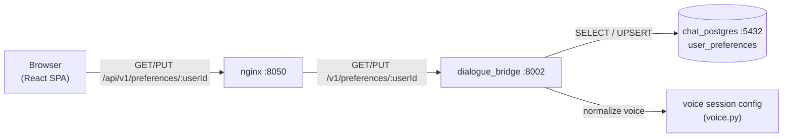
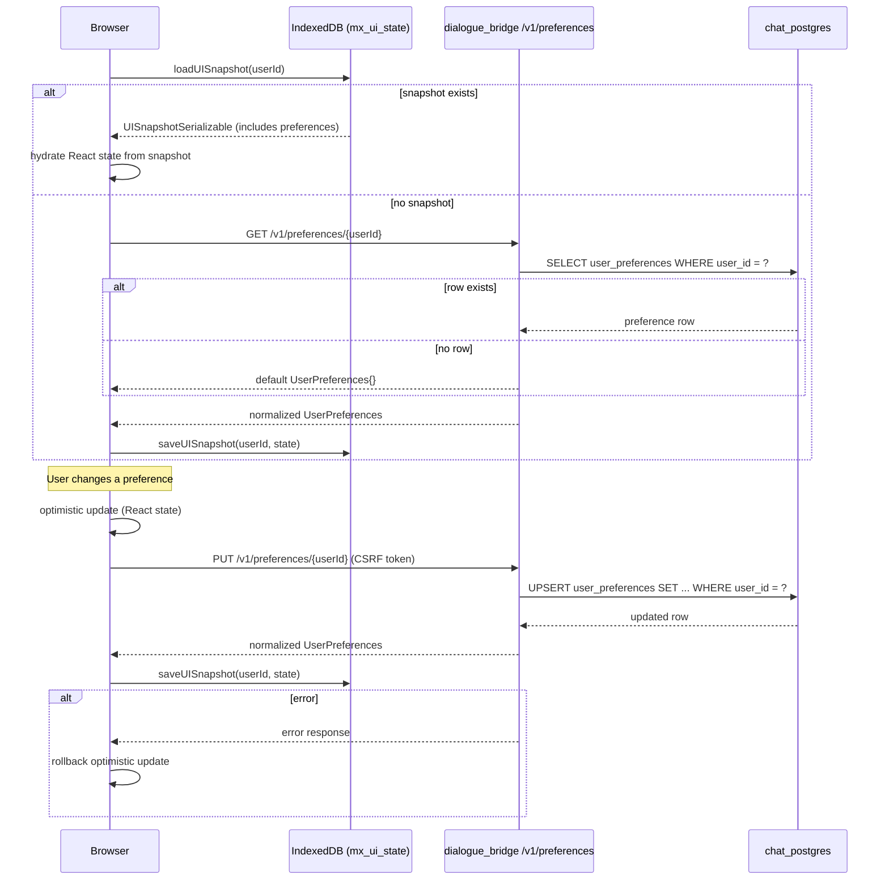
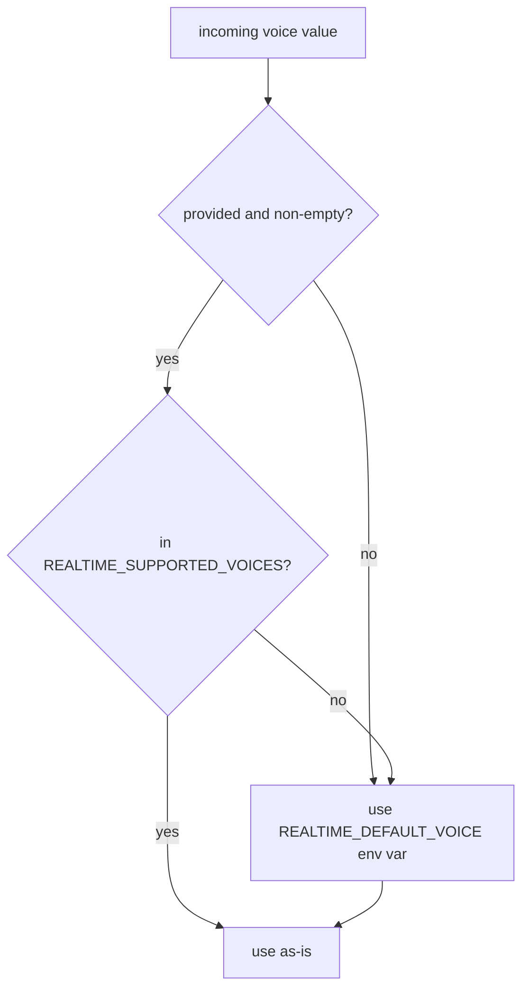

# User Preferences

User preferences capture per-user settings that persist across sessions: which tools are disabled, whether suggestions are shown, and which voice and language to use in realtime voice conversations. The source of truth is a single row in the `user_preferences` PostgreSQL table, one per user. The frontend caches preferences in IndexedDB for instant rehydration on page load, applies them optimistically in React state, and writes changes back to the database via a single `PUT` endpoint. The backend reads preferences directly from the database for any server-side decisions (voice session config, voice language).

---

## Services Involved



---

## Full Sequence — Load and Apply Preferences

The sequence below shows the full lifecycle from app start through a preference change.



---

## Phase 1 — Database Schema

The `user_preferences` table has a one-to-one relationship with `users`. A row is only created on the first `PUT` — before that, `GET` returns default values from the application layer, never from a real row.

| Column | DB Type | Default | Description |
| --- | --- | --- | --- |
| `id` | String (UUID) | `gen_uuid()` | Row PK |
| `user_id` | String (FK) | — | FK to `users.id`; UNIQUE; cascade delete |
| `tools` | JSON | `{}` | `{"disabled": [{server_id, tool_name}, ...]}` |
| `prefers_agentic_chat` | Boolean | `false` | Reserved for future agentic-chat UX toggle |
| `suggestions_enabled` | Boolean | `true` | Show/hide starter suggestion chips in the chat UI |
| `search_past_convs` | Boolean | `false` | Opt-in: attach the deep-agent `search_past_conversations` memory tool. Migration `0011`. |
| `use_memory` | Boolean | `true` | On by default: gates a deep agent's persistent memory (AGENT.md `/memories/` mount + future memory folder). Threaded into the run config; turn off to run agents without their stored memory. Migration `0012`. |
| `voice_mode_voice` | String | `"alloy"` | OpenAI Realtime voice identity |
| `voice_mode_language` | String | `"english"` | Language for realtime voice instructions |
| `updated_at` | DateTime | `func.now()` | Auto-updated on every write |

All boolean columns use explicit `bool()` coercion on insert/update to guard against string values arriving from JSON.

---

## Phase 2 — API Endpoints

Both endpoints live under `/v1/preferences/{user_id}` in `dialogue_bridge`.

### GET — Fetch Preferences

Returns the current preferences for the user. If no row exists, returns a default `UserPreferences` object with all fields at their application defaults. No row is created by a `GET`.

**Response shape:**

```python
class UserPreferences(BaseModel):
    tools: ToolsPreferences            # {"disabled": [...]}
    prefersAgenticChat: bool           # default: False
    suggestionsEnabled: bool           # default: True
    searchPastConvs: bool              # default: False
    useMemory: bool                    # default: True
    voiceModeVoice: str                # default: "alloy"
    voiceModeLanguage: str             # default: "english"
```

Voice and language values are normalized before return — invalid DB values are silently corrected to defaults (see Phase 4).

### PUT — Upsert Preferences

Writes the complete preferences object for the user. If a row exists, all fields are updated. If no row exists, a new row is inserted.

- **Auth required:** valid `user_id` (session-validated) + CSRF token
- **Deduplication:** the `tools.disabled` list is deduped by `"{server_id}::{tool_name}"` key before save
- **Returns:** the normalized, persisted `UserPreferences` object

The `PUT` is always a full replacement — there is no partial `PATCH`. The frontend always sends the full current state of preferences.

---

## Phase 3 — Preference Categories

### Tool Preferences

Controls which MCP/agent tools are disabled for the user. The backend stores the *disabled* list; the frontend computes the enabled subset by taking all available tools and subtracting the disabled ones.

```json
{
  "tools": {
    "disabled": [
      { "server_id": "tavily", "tool_name": "web_search" },
      { "server_id": "arxiv", "tool_name": "search_papers" }
    ]
  }
}
```

Tool preferences are **not** applied server-side automatically. The frontend reads stored preferences, computes `enabledTools`, and sends the list explicitly in every inference run start payload. The agents service receives only the enabled set.

### Suggestions

`suggestionsEnabled` is a boolean flag. When `false`, the frontend hides the starter suggestion chips that appear in empty conversations. The backend catalog suggestions endpoint (`GET /v1/catalog/suggestions`) is still called — the frontend simply does not render the result.

### Search Past Conversations

`searchPastConvs` is an opt-in (default `false`) that gates the deep-agent `search_past_conversations` memory tool. Unlike most preferences, it **is** applied server-side: when a run starts, the bridge reads it and threads it into the agents `/stream` request config under `context.search_past_convs`, and the deep agent attaches the tool only when it is true (see [conversation-embeddings](conversation-embeddings.md)). Off by default, so a user gets cross-conversation recall only after enabling it here.

### Agent Memory

`useMemory` is on by default (`true`) and gates a deep agent's **per-(user, agent) persistent memory**: the `/memories/` mount holding `AGENTS.md` (a compact index injected as always-on context) plus `entries/<name>.yml` detail files the agent reads on demand, and the built-in **`remember`** tool that writes them. Like `searchPastConvs`, it is applied server-side and **per run**: the bridge threads it into the agents `/stream` request config under `context.use_memory`, `BaseAgent.__init__` parses it into `self.use_memory`, and the deep-agent build dynamically includes or omits the memory wiring — when false, `load_agent_md()` returns `[]`, `_build_composite_backend()` drops the `/memories/` mount, and `remember` isn't attached. Turning it off lets a user run an agent with no stored memory, no agent code change. Distinct from `searchPastConvs`: this gates the agent's own memory (read + write), that one gates cross-conversation message search.

### Voice Mode Voice

The voice used for OpenAI Realtime API sessions. The set of valid voices is controlled by the `REALTIME_SUPPORTED_VOICES` environment variable (comma-separated), which defaults to:

`alloy`, `ash`, `ballad`, `coral`, `echo`, `nova`, `sage`, `shimmer`, `verse`, `marin`, `cedar`

The frontend renders each voice with a label, gender, and description sourced from the `REALTIME_VOICES` constant in `consts.ts`. The stored value is always a lowercase string matching the OpenAI voice name.

### Voice Mode Language

The language used when building the system prompt for a realtime voice session. Only two values are supported:

| Value | Effect |
| --- | --- |
| `"english"` | System prompt and instructions sent in English (default) |
| `"greek"` | System prompt and instructions sent in Greek |

The language controls the text injected by the voice instruction builder, not any transcription model. Whisper-based dictation uses its own language detection independently.

### Prefers Agentic Chat

`prefersAgenticChat` is stored but currently not consumed by the inference flow. It is persisted now so that existing user rows are compatible with a future UI toggle for an autonomous agentic chat mode.

---

## Phase 4 — Normalization and Fallback

Both the GET and PUT handlers normalize voice and language values before storing or returning them. This guarantees the API always returns a valid, usable preference regardless of what is in the database.



The same pattern applies to language: if the value is missing or not in `{"english", "greek"}`, it falls back to `"english"`.

**Fallback chain (voice session):**

```
1. Value from request payload (per-request override)
2. Value from user_preferences row in DB
3. REALTIME_DEFAULT_VOICE env var
```

The voice.py utility functions (`preferred_realtime_voice`, `preferred_voice_mode_language`) implement this chain. They are called by the voice router on every session creation request.

---

## Phase 5 — Frontend State and Sync

The frontend manages preferences across three layers: React state (live updates), IndexedDB (fast rehydration), and the database API (durable persistence).

### Hydration Order on Page Load

1. `loadUISnapshot(userId)` reads IndexedDB — if preferences are in the snapshot, they are applied immediately to React state with no API call
2. If no snapshot, `getUserPreferences(userId)` fetches from the backend and then saves to IndexedDB

### Mutation Flow (usePreferencesHandlers)

Every preference mutation follows the same pattern:

```
1. Apply change to React state immediately (optimistic)
2. PUT to /api/v1/preferences/{userId}
3. On success: call persistUIState() to sync IndexedDB
4. On error: rollback React state to previous value + show toast
```

The handlers are:

| Handler | What it changes |
| --- | --- |
| `handleToggleToolPreference(tool)` | Adds or removes a tool from `tools.disabled` |
| `handleToggleSuggestionsEnabled()` | Flips `suggestionsEnabled` |
| `handleToggleSearchPastConvs()` | Flips `searchPastConvs` (memory-tool gate) |
| `handleToggleUseMemory()` | Flips `useMemory` (agent persistent-memory gate) |
| `handleSelectVoiceModeVoice(voice)` | Sets `voiceModeVoice` |
| `handleSelectVoiceModeLanguage(language)` | Sets `voiceModeLanguage` |

### Cross-Tab Consistency

There is no real-time cross-tab sync. If preferences are changed in a second tab, the first tab will not update until it reloads. The IndexedDB snapshot reflects the state at the time of the last successful write in the current tab.

---

## Phase 6 — Backend Application of Preferences

Preferences are read server-side for voice sessions, for the memory-tool gate (`search_past_convs`), and for the agent-memory gate (`use_memory`). Everything else (tools, suggestions) is managed entirely by the frontend.

### Voice Session

When the browser calls `POST /v1/voice/session`, the voice router:

1. Reads `payload.voice` and `payload.language` from the request body (may be `null`)
2. Calls `preferred_realtime_voice(db, user_id, payload.voice)` — resolves to a valid voice string using the fallback chain
3. Calls `preferred_voice_mode_language(db, user_id, payload.language)` — resolves to `"english"` or `"greek"`
4. Passes both to the voice instruction builder, which constructs the OpenAI Realtime session config

This means the browser can override preferences per-session by sending explicit values in the request, but if it sends `null`, the stored preference is used automatically.

### Tool Preferences in Inference

The agents service receives an `enabled_tools` list in every inference request config. The `dialogue_bridge` does not apply tool preferences itself — the frontend is responsible for computing `enabledTools` (all tools minus `tools.disabled`) and sending it in the `InferenceRunStartPayload`.

### Search-Past-Conversations Gate

`search_past_convs` is the one boolean the bridge applies itself. In `inference_runs._run`, the bridge loads the user's preference row and includes `context.search_past_convs` in the agents `/stream` request config. The deep agent's `_builtin_tools()` attaches the `search_past_conversations` tool only when that flag is true. It is read **per run** (not cached), so toggling it takes effect on the user's next message.

### Agent-Memory Gate

`use_memory` is loaded from the same preference row in `inference_runs._run` and included as `context.use_memory` (default `true` when no row exists). `BaseAgent.__init__` parses it into `self.use_memory`; the deep agent's build reads that flag to include or omit its per-(user, agent) memory wiring — the `/memories/` mount (`AGENTS.md` index + `entries/*.yml`) and the `remember` write tool. Also read **per run**, so turning memory off applies on the next message. No `_WORKSPACE_WRITE_DENY` rule targets `/memories/`, so dropping that mount needs no permission change.

---

## Sharp Edges and Behavioral Notes

- **No row until first PUT.** A new user has no `user_preferences` row. The `GET` endpoint returns a default object, not a DB row. Nothing is persisted until the user (or the UI) explicitly writes a preference. This means a user who never opens the preferences panel has no row.

- **Full replacement on PUT.** The `PUT` endpoint replaces all fields. If the frontend sends an incomplete object, fields not present in the payload will be coerced to their Pydantic defaults (e.g., `tools: {}` becomes `{"disabled": []}`). Always send the full current state.

- **Tool preferences are computed client-side.** The backend never auto-filters tools based on `user_preferences.tools`. The frontend must subtract disabled tools from the full catalog and send the resulting `enabledTools` list on every inference request. A bug in that computation lets disabled tools through silently.

- **Voice normalization is silent.** If an unsupported voice name is stored in the DB (e.g., from a previous deployment with different supported voices), the GET response returns the fallback default without any error. The user's preference is effectively reset without notification.

- **No partial PATCH.** There is no `PATCH` endpoint. Every update is a full write. The frontend always sends all fields, so this is safe in practice — but any external client that sends partial payloads will lose fields not included.

- **`prefersAgenticChat` is a no-op.** The field is stored and returned but currently has no effect on inference routing or UI rendering. It exists for forward compatibility.

- **CSRF required on PUT.** The update endpoint requires a valid CSRF token in addition to session authentication. Requests without it receive a 403 even with a valid session cookie.

- **No cross-tab sync.** Preference changes in one browser tab are not propagated to other open tabs. The IndexedDB snapshot is written by whichever tab last saved, and each tab reads its own in-memory copy. A user with multiple tabs open may see stale preferences in inactive tabs until they reload.

- **IndexedDB is a cache, not a source of truth.** On logout, IndexedDB is cleared (`clearUISnapshot()`). If IndexedDB is corrupted or unavailable, the app falls back to the API — preferences are never lost.

---

## File Map

| Concept | File | What to look for |
| --- | --- | --- |
| DB table definition | [src/dialogue_bridge/core/database/models.py](../../src/dialogue_bridge/core/database/models.py) | `UserPreferencesTable` class, column defaults |
| Pydantic schemas | [src/dialogue_bridge/schemas/\_\_init\_\_.py](../../src/dialogue_bridge/schemas/__init__.py) | `UserPreferences`, `ToolsPreferences`, `ToolPreference` |
| Preferences router | [src/dialogue_bridge/router/preferences.py](../../src/dialogue_bridge/router/preferences.py) | GET and PUT handlers, upsert logic |
| Voice normalization | [src/dialogue_bridge/utils/voice.py](../../src/dialogue_bridge/utils/voice.py) | `preferred_realtime_voice()`, `preferred_voice_mode_language()`, `normalize_*` functions |
| Voice router (preference lookup) | [src/dialogue_bridge/router/voice.py](../../src/dialogue_bridge/router/voice.py) | Session config construction, preference resolution |
| Backend settings (voice) | [src/dialogue_bridge/core/settings.py](../../src/dialogue_bridge/core/settings.py) | `VoiceSettings`, `REALTIME_SUPPORTED_VOICES`, `REALTIME_DEFAULT_VOICE` |
| TypeScript types | [src/agentic_ui/src/lib/types.ts](../../src/agentic_ui/src/lib/types.ts) | `UserPreferences`, `ToolPreference`, `RealtimeVoice`, `VoiceModeLanguage` |
| API calls | [src/agentic_ui/src/lib/api.ts](../../src/agentic_ui/src/lib/api.ts) | `getUserPreferences()`, `updateUserPreferences()` |
| Frontend constants | [src/agentic_ui/src/lib/consts.ts](../../src/agentic_ui/src/lib/consts.ts) | `REALTIME_VOICES`, `VOICE_MODE_LANGUAGES`, `DEFAULT_REALTIME_VOICE` |
| Preference handlers | [src/agentic_ui/src/handlers/preferences.ts](../../src/agentic_ui/src/handlers/preferences.ts) | `usePreferencesHandlers()`, optimistic update pattern, rollback |
| IndexedDB persistence | [src/agentic_ui/src/lib/uiStateStorage.ts](../../src/agentic_ui/src/lib/uiStateStorage.ts) | `loadUISnapshot()`, `saveUISnapshot()`, `clearUISnapshot()` |
| Inference tool filtering | [src/dialogue_bridge/router/inference.py](../../src/dialogue_bridge/router/inference.py) | `enabled_tools` in `InferenceRunStartPayload`, config forwarding to agents |
