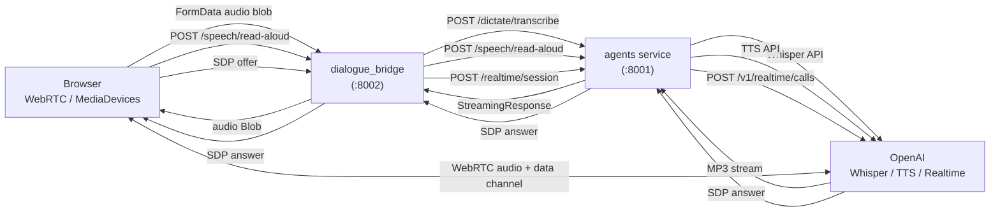
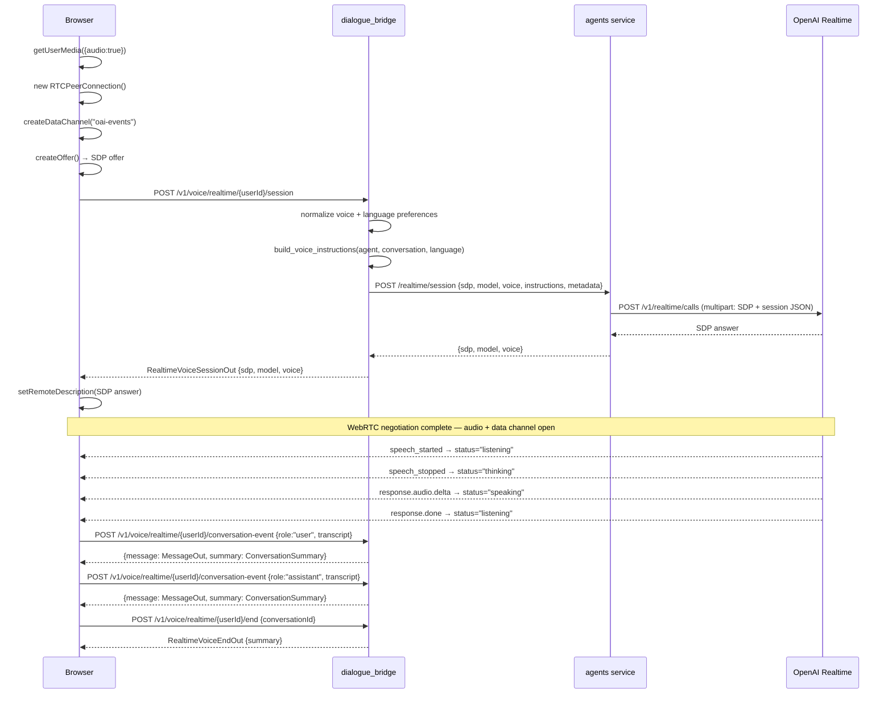
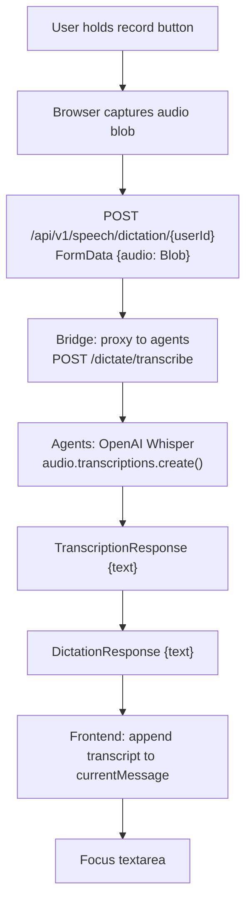
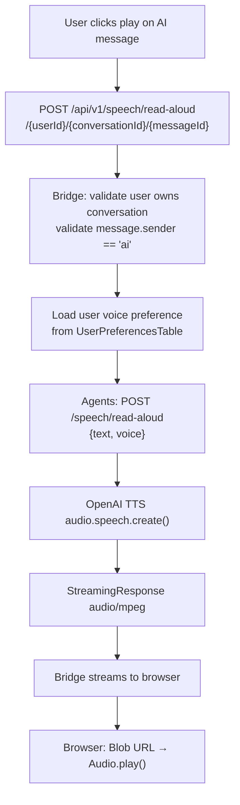
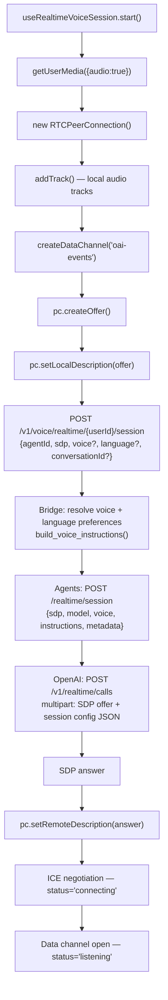
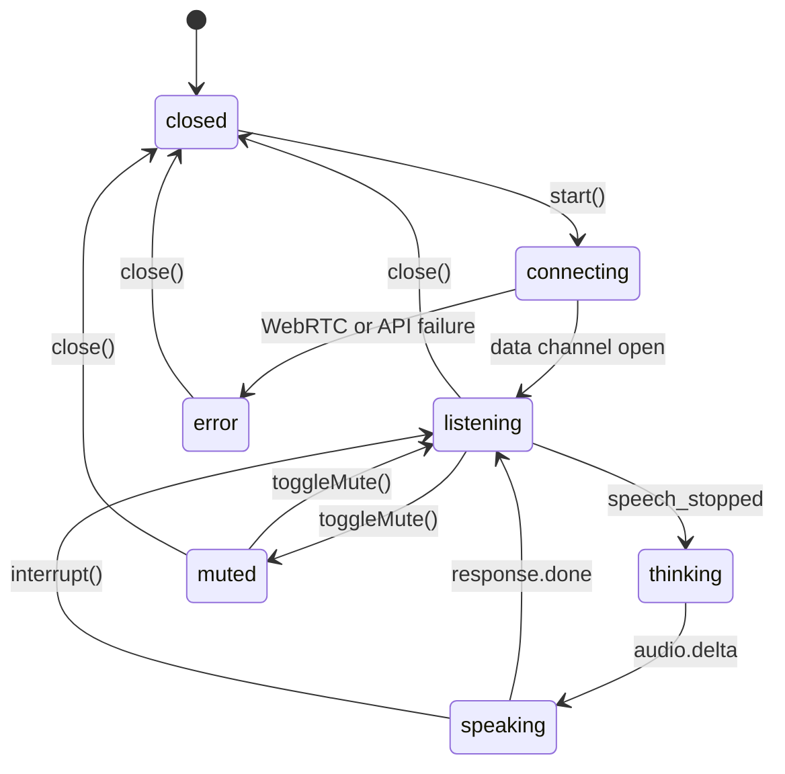

# Voice Mode

The platform has three distinct audio features that share infrastructure but serve different purposes: **dictation** (speech-to-text for composing messages), **read-aloud** (text-to-speech playback of AI responses), and **realtime voice** (a full-duplex WebRTC conversation with the agent using OpenAI's Realtime API). All three funnel through the dialogue bridge and then to the agents service, which holds the OpenAI API key and the actual provider calls.

> **Realtime voice is URL-less.** It is in-component session state (`useChatVoiceMode`) layered over whatever conversation is current — it never has its own route. Any navigation (selecting another conversation, New chat, or opening the `/tasks` page) **force-closes** the session, so the WebRTC mic is always torn down rather than left running behind another view. See the routing model in [conversation-management.md](conversation-management.md).

---

## Services Involved



---

## Full Sequence — Realtime Voice



---

## Phase 1 — Dictation (Speech-to-Text)

Dictation converts a short audio recording into text that is inserted into the message composer. The browser records a blob, sends it to the bridge, and receives a plain text string back.



**Bridge endpoint:** `POST /v1/speech/dictation/{user_id}` — reads multipart audio, proxies with a 120 s read timeout (Whisper can be slow for longer recordings), returns `DictationResponse { text }`.

**Agents endpoint:** `POST /dictate/transcribe` (requires `require_internal_caller()`) — reads the file bytes, calls `OpenAI().audio.transcriptions.create(model=settings.runtime_models.dictation)`, returns `TranscriptionResponse { text }`.

**Frontend:** `handleDictationSubmit(audioBlob)` calls `transcribeDictation(userId, audioBlob, filename)`, trims the transcript, then calls the normal `handleSendMessage()` flow. Dictation is therefore a voice-entry shortcut for the text composer — it does not bypass the inference pipeline.

`DictationStatus` states: `"idle"` → `"submitting"` → `"idle"` (or error toast on failure).

---

## Phase 2 — Read-Aloud (Text-to-Speech)

Read-aloud converts an AI message's text content into streamed MP3 audio. A preview endpoint exists for testing a voice without selecting a real message.



**Bridge endpoint:** `POST /v1/speech/read-aloud/{user_id}/{conversation_id}/{message_id}` — validates that the message exists and `sender == "ai"`, loads `user.preferences.voice_mode_voice`, proxies to agents, streams back with `Content-Disposition: inline; filename="read-aloud.mp3"`.

**Bridge endpoint (preview):** `POST /v1/speech/read-aloud-preview/{user_id}` — accepts `{ voice, text }` (text max 120 chars, default `"Hey! I am your AI speaker."`). Used by the voice selector UI to play a short sample without a real conversation.

**Agents endpoint:** `POST /speech/read-aloud` — strips and normalizes the voice string, calls `OpenAI().audio.speech.create()` with the model from `settings.runtime_models.read_aloud_model`, returns a `StreamingResponse` with audio bytes.

**Frontend:** `generateMessageReadAloudAudio(userId, conversationId, messageId)` returns a `Blob`. `generateReadAloudPreviewAudio(userId, voice, text?)` also returns a `Blob`. Both are played via a temporary `Audio` element created by the UI.

---

## Phase 3 — Realtime Voice Session Setup (WebRTC)

The realtime mode establishes a full-duplex WebRTC connection between the browser and OpenAI's Realtime API. The bridge and agents service act as a one-time signalling relay — once the WebRTC connection is established, all audio and events flow directly between the browser and OpenAI.

### SDP Exchange



The session config POSTed to OpenAI contains:

```json
{
  "type": "realtime",
  "model": "<settings.runtime_models.realtime>",
  "instructions": "<built by build_voice_instructions()>",
  "audio": {
    "input": {
      "turn_detection": { "type": "server_vad" },
      "transcription": { "model": "<settings.runtime_models.dictation>" }
    },
    "output": { "voice": "<normalized voice>" }
  }
}
```

**Server VAD** — OpenAI handles turn detection server-side. The browser streams continuous audio and receives events when speech starts and stops, without needing to implement silence detection itself.

### Voice Instructions

`build_voice_instructions(agent, conversation, language)` constructs the system prompt for the realtime session:

- Agent name and description
- **Opening-language instruction, followed by a mirror-the-speaker instruction.** One template with the language interpolated — not a hand-written sentence per language — so widening the catalog needs no prompt authoring.
- Recent conversation history — last 8 messages, each truncated to 800 characters, formatted as `"User: ..."` / `"Assistant: ..."`

**The language preference sets only the FIRST turn.** The Realtime session pins no transcription locale (`agents/router/voice.py` sends `transcription` with a model and no `language`), so the model hears whatever is actually spoken. The instruction tells it to detect the user's language from their first utterance, reply in that language, and switch whenever the user switches. A mismatched preference therefore self-corrects as soon as the user speaks.

This gives the realtime agent context from the ongoing conversation without the browser needing to transmit the full history over the data channel.

### Voice Preference Resolution

`preferred_realtime_voice(db, user_id, requested_voice)` — returns the requested voice (normalized), else the stored preference from `UserPreferencesTable.voice_mode_voice`, else the settings default.

`normalize_realtime_voice(voice)` — lowercases and validates against `settings.voice.supported_realtime_voices`. Falls back to `settings.voice.default_realtime_voice` on invalid input.

`normalize_voice_mode_language(language)` — lowercases and validates against `settings.voice.supported_voice_mode_languages`, falling back to `settings.voice.default_voice_mode_language`. It is an allow-list rather than free text because the value is interpolated into the model's system instruction, so unvalidated client input would be a prompt-injection surface.

---

## Phase 4 — Realtime Event Loop

Once the WebRTC connection is open, all coordination happens over the `"oai-events"` data channel. The browser parses incoming JSON frames and drives `VoiceModeStatus` state transitions:

| OpenAI data channel event | Status transition |
| --- | --- |
| `input_audio_buffer.speech_started` | → `"listening"` |
| `input_audio_buffer.speech_stopped` | → `"thinking"` |
| `response.created` | → `"thinking"` |
| `response.audio.delta` or `response.output_audio.delta` | → `"speaking"` |
| `response.done` or `response.audio.done` | → `"listening"` (or `"muted"` if muted) |
| `error` | → `"error"`, sets `errorMessage` |

**Status lifecycle:**



**`interrupt()`** — sends `{ type: "response.cancel" }` over the data channel, asking OpenAI to stop the current response mid-speech. Status returns to `"listening"` or `"muted"`.

**`sendText(text)`** — sends a `conversation.item.create` followed by `response.create` over the data channel, setting status to `"thinking"`. Used when the user types a message while in voice mode.

**`toggleMute()`** — disables or enables all local `MediaStreamTrack` objects. OpenAI continues receiving the audio stream, but silence causes server VAD not to fire turn-detection events.

---

## Phase 5 — Transcript Persistence

OpenAI generates server-side transcripts of both the user's speech and the assistant's responses. These arrive over the data channel and the browser persists them to the bridge one turn at a time after each `response.done` event.

**`persistRealtimeVoiceConversationEvent(userId, payload)`** — `POST /v1/voice/realtime/{userId}/conversation-event`:

| Field | Type | Notes |
| --- | --- | --- |
| `conversationId` | `str` | Target conversation |
| `role` | `"user"` or `"assistant"` | Maps to `sender` on `MessageTable` |
| `transcript` | `str` (min 1) | Becomes `content` on the message row |
| `itemId` | `str?` | OpenAI item ID for correlation |
| `responseId` | `str?` | OpenAI response ID for correlation |
| `rawEvent` | `dict?` | Full OpenAI event stored in `raw_events` |

The bridge creates a `MessageTable` row with `type="audio"` and returns `{ message: MessageOut, summary: ConversationSummary }`. The UI updates the conversation sidebar without a separate fetch.

Realtime voice conversations are not subject to the inference run machinery — there is no `streaming_*` lifecycle on the AI message row, no `InferenceRunManager` task, no Redis event stream, and no AG-UI event stream. Voice messages are complete turns written after the fact from OpenAI transcripts.

---

## Phase 6 — Session End

`POST /v1/voice/realtime/{user_id}/end { conversationId }` — the bridge refreshes the conversation from the DB and returns a final `ConversationSummary`. No server-side session is closed; the bridge has no record of the ongoing WebRTC call.

The `close()` call in `useRealtimeVoiceSession` does all cleanup client-side:

1. Close the `"oai-events"` data channel.
2. Close the `RTCPeerConnection`.
3. Stop all local `MediaStreamTrack` objects.
4. Pause and remove the remote `HTMLAudioElement`.
5. Set status → `"closed"`, clear `errorMessage`, reset `muted = false`.

---

## Voice Catalog

### `REALTIME_VOICES` (WebRTC sessions)

| ID | Label | Description | Gender |
| --- | --- | --- | --- |
| `alloy` | Alloy | Balanced | Male |
| `ash` | Ash | Clear | Male |
| `ballad` | Ballad | Warm | Male |
| `cedar` | Cedar | Rich | Male |
| `coral` | Coral | Bright | Female |
| `echo` | Echo | Deep | Male |
| `marin` | Marin | Natural | Female |
| `sage` | Sage | Calm | Female |
| `shimmer` | Shimmer | Light | Female |
| `verse` | Verse | Expressive | Female |

Default: `"alloy"`. Invalid values are silently normalized to the default by both `normalizeRealtimeVoice()` (frontend) and `normalize_realtime_voice()` (backend).

> **There is no separate read-aloud voice catalog.** Read-aloud once had its own
> list and a `readAloudVoice` preference; both were collapsed into `voiceModeVoice`,
> and the bridge resolves the TTS voice server-side through the realtime allow-list
> above (`normalize_realtime_voice`). The single picker in Settings → Voice drives
> live voice mode and read-aloud alike — its per-voice preview button even calls the
> read-aloud endpoint. An earlier revision of this doc described a `READ_ALOUD_VOICES`
> superset containing `fable`/`nova`/`onyx`; that constant had already been orphaned
> when this page was written and has since been deleted.

### Languages

Driven by `settings.voice.supported_voice_mode_languages` (`VOICE_MODE_SUPPORTED_LANGUAGES`), defaulting to 18 languages, with `settings.voice.default_voice_mode_language` as the fallback.

Adding one is a **config + catalog** change, not a code change: add the id to the settings frozenset (or the env var) and a `{ id, label, native }` row to `VOICE_MODE_LANGUAGES` in the frontend. There is no prompt to author — `build_voice_instructions()` interpolates the language into a single template.

The two lists must stay in sync. An id the bridge rejects silently falls back to the default, so the picker would offer a language that never takes effect — the same drift that previously shipped a `nova` voice the picker could not display.

---

## Sharp Edges and Behavioral Notes

- **WebRTC connects directly to OpenAI, not to the bridge.** After the SDP exchange, all audio flows peer-to-peer between the browser and OpenAI. The bridge has no visibility into the audio content or data channel events. If OpenAI's Realtime API becomes unavailable, an already-established session is unaffected — the bridge is out of the loop after negotiation.

- **Transcripts must be persisted manually by the client.** The bridge has no way to intercept what is said during a realtime session. If the browser tab crashes or is closed mid-conversation, un-persisted turns are lost permanently. The UI only calls `persistRealtimeVoiceConversationEvent()` after receiving a `response.done` event with a complete transcript.

- **The realtime session is stateless on the bridge.** There is no server-side session record for an ongoing realtime call. `POST /realtime/{userId}/end` exists only to get a refreshed `ConversationSummary`; it does not close or clean up anything on the server side.

- **`build_voice_instructions()` uses at most the last 8 messages.** Context beyond 8 turns is not sent to the realtime model. A long text conversation will lose early history in voice mode even if it is present in the inference pipeline.

- **Voice preference is resolved once at session start.** If the user changes their preferred voice in settings while a realtime session is active, the change takes effect only on the next `start()` call.

- **`sendText()` in voice mode bypasses the normal inference pipeline.** Text sent over the data channel goes directly to OpenAI Realtime and is never automatically persisted as a user message. The only path from voice to the DB is through `persistRealtimeVoiceConversationEvent()`.

- **Read-aloud is only available for AI messages.** The bridge validates `message.sender == "ai"` before proxying to TTS. Attempting to read a user message returns a `400`.

- **The `voice_mode_voice` preference stored in the DB is not enforced to be a valid voice.** `normalize_realtime_voice()` must be called on any stored value before use. A value written through a path that skips normalization could silently fall back to the default at session time.

---

## File Map

| Concept | File | What to look for |
| --- | --- | --- |
| Realtime session endpoint (bridge) | [src/dialogue_bridge/router/voice.py](../../src/dialogue_bridge/router/voice.py) | `createRealtimeVoiceSession()`, `persistRealtimeVoiceConversationEvent()`, `endRealtimeVoiceSession()` |
| Voice instruction builder | [src/dialogue_bridge/utils/voice.py](../../src/dialogue_bridge/utils/voice.py) | `build_voice_instructions()`, `recent_history_for_voice_instructions()` |
| Voice preference resolution | [src/dialogue_bridge/utils/voice.py](../../src/dialogue_bridge/utils/voice.py) | `preferred_realtime_voice()`, `preferred_voice_mode_language()`, `normalize_realtime_voice()` |
| Read-aloud endpoints (bridge) | [src/dialogue_bridge/router/speech.py](../../src/dialogue_bridge/router/speech.py) | `readMessageAloud()`, `previewReadAloudVoice()` |
| Dictation endpoint (bridge) | [src/dialogue_bridge/router/speech.py](../../src/dialogue_bridge/router/speech.py) | `transcribe_dictation()` |
| Realtime session endpoint (agents) | [src/agents/main.py](../../src/agents/main.py) | `create_realtime_session()` |
| TTS endpoint (agents) | [src/agents/main.py](../../src/agents/main.py) | `generate_read_aloud_speech()` |
| Whisper endpoint (agents) | [src/agents/main.py](../../src/agents/main.py) | `transcribe_audio()` |
| WebRTC session hook | [src/agentic_ui/src/features/voice/hooks/useRealtimeVoiceSession.ts](../../src/agentic_ui/src/features/voice/hooks/useRealtimeVoiceSession.ts) | `start()`, `close()`, `toggleMute()`, `interrupt()`, `handleRealtimeEvent()` |
| Voice mode chat hook | [src/agentic_ui/src/features/voice/hooks/useChatVoiceMode.ts](../../src/agentic_ui/src/features/voice/hooks/useChatVoiceMode.ts) | `handleStartVoiceMode()` |
| Voice mode status type | [src/agentic_ui/src/shared/lib/types/](../../src/agentic_ui/src/shared/lib/types/) | `VoiceModeStatus` |
| Voice catalogs | [src/agentic_ui/src/shared/lib/consts/voice.ts](../../src/agentic_ui/src/shared/lib/consts/voice.ts) | `REALTIME_VOICES`, `VOICE_MODE_LANGUAGES` |
| Voice API calls | [src/agentic_ui/src/shared/lib/api/](../../src/agentic_ui/src/shared/lib/api/) | `createRealtimeVoiceSession()`, `persistRealtimeVoiceConversationEvent()`, `transcribeDictation()`, `generateMessageReadAloudAudio()` |
| Voice normalization (frontend) | [src/agentic_ui/src/shared/lib/api/](../../src/agentic_ui/src/shared/lib/api/) | `normalizeRealtimeVoice()`, `normalizeVoiceModeLanguage()` |
| Voice selector component | [src/agentic_ui/src/shared/ui/ai-elements/voice-selector.tsx](../../src/agentic_ui/src/shared/ui/ai-elements/voice-selector.tsx) | `VoiceSelector`, `VoiceSelectorItem`, `VoiceSelectorPreview` |
