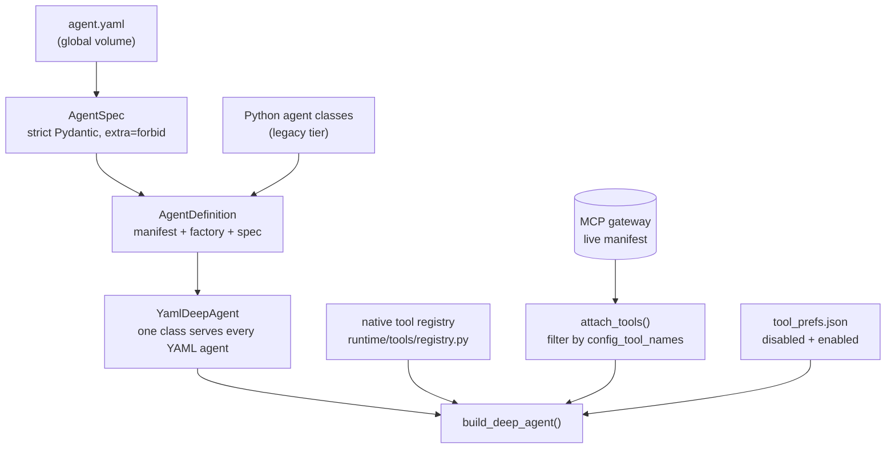

# Platform restructure — declarative agents, workspace roots, per-agent tools

> **Status:** **Done** (Phases 0–2). Phase 3 continues in [01 · Custom agents per user](01-custom-agents-per-user.md); Phase 4 is deferred and folded into [10 · RAG via the MCP gateway](10-rag-via-mcp-gateway.md).
> **TODO source:** **Agents** → "Create a functionality for the user to configure a custom agent with a set of tools and instructions … in yml formats" — the *engine* half of that item.
> **Depends on:** nothing.
> **Blocks:** [01 · Custom agents per user](01-custom-agents-per-user.md), [07 · Tool RAG](07-tool-rag.md).
> **Services touched:** agents · dialogue_bridge · agentic_ui (+ one DB migration)

This is the design record for the restructure that moved mAgenticX from *agents-as-Python-classes with request-selected tools* to *agents-as-declarative-YAML with agent-declared tools*. It is kept as a plan rather than folded away because three later items build directly on its invariants: per-user custom agents inherit its discovery and validation machinery, Tool RAG inherits its "declared tool set is the authoritative superset" rule, and the deferred LangGraph work is the last thing standing between the platform and a fully declarative agent tier.

The restructure had four goals: agents defined by configuration instead of code, a per-user workspace holding everything custom, one global folder for shared assets, and tool control scoped per agent instead of globally per request. The first, third and fourth are delivered. The second exists as a path convention (`/var/magenticx/workspaces`) but the *data* still lives on the legacy volumes — that move is owned by [03 · Projects / Workspaces](03-projects-and-workspaces.md).

---

## 1. Goal & non-goals

**Goal.** Make an agent's whole definition — identity, system prompt, models, sub-agents, skills, tools, HITL gates — declarative data in an `agent.yaml`, discovered from a directory scan rather than a Python import; and make tool enablement a property of the agent (plus a per-user override) rather than a list the browser computes and sends on every request.

**Non-goals (deliberately out of scope).** User-authored *tools* — tools stay platform-owned, reviewed code or gateway-controlled MCP servers; a user may only enable or disable them. User-authored agents — the engine landed here, the authoring surface is plan 01. Declarative LangGraph agents — a graph interpreter is a much larger problem than a deep-agent spec, deferred. Multi-tenancy — ownership beyond `(user, agent)` is plan 02.

---

## 2. What the restructure replaced

Before, `utils/agents.py` discovered agents by importing `langgraph_agents` / `deep_agents` and walking class attributes, so adding an agent meant shipping Python. Tool selection came from the browser: the frontend subtracted a global `user_preferences.tools.disabled` set from the MCP catalog, computed an `enabledTools` list, and sent it on **every** inference request; the bridge forwarded it as `config["tools"]`, and `BaseAgent.__init__` seeded its tool filter from it. Three columns existed only to carry that list (`user_preferences.tools`, `messages.streaming_enabled_tools`, `scheduled_tasks.enabled_tools`).

That model had two structural problems. Tools were a *session-wide* choice, so every agent in a conversation got the same tool set regardless of what it was for; and the authoritative tool list lived in the client, which meant a headless run (a scheduled task) had to freeze its own copy and the backend could never reason about what an agent *should* have.

---

## 3. Delivered design



Four pieces carry the design:

**`AgentSpec`** is a strict Pydantic model (`extra="forbid"`, slug regex, `reference_errors()` validating model ids and native-tool names against allowlists). YAML is treated as configuration that can never become code — an invalid spec is logged and skipped, never fatal, so one bad folder cannot take down discovery.

**`YamlDeepAgent`** is a single generic `DeepAgent` that reads its identity and behaviour from a spec *per instance*, because one class serves every YAML agent. It seeds `config_tool_names` from `spec.tools` so the MCP filter is spec-driven, resolves declared native tools through the registry, and lets the registry manifest be built from the spec by `manifest_from_spec`.

**The native-tool registry** is the single source of truth for platform tools: metadata plus a context-bound builder per tool, so a spec can select one by name, the catalog can list them read-only, and the deep-agent builtins resolve through one place. It deliberately lives in `runtime/tools/` rather than `runtime/abstractions/` — importing it from the declarative package creates a cycle (`deep_agent → declarative → yaml_agent → deep_agent`).

**The refreshable registry.** The global volume is seeded *during* the service lifespan, after import, so `AGENT_REGISTRY` cannot be frozen at import time. `refresh_registry()` re-scans and mutates the dict **in place** so existing `from utils.agents import AGENT_REGISTRY` references stay valid.

### Tool resolution invariant

The rule every later plan must respect:

```text
effective tools = (declared_mcp ∪ user_enabled) − user_disabled
                + native builtins (gated, never user-disable-able)
                + deepagents framework builtins (added last, never filtered)
```

Full mechanics: [tool harness](../development/tool-harness.md).

---

## 4. Data model & migrations

One migration, and it is destructive by design: **`0016_retire_enabled_tools`** (`down_revision` `0015_personalization`, current head) dropped `user_preferences.tools`, `messages.streaming_enabled_tools`, and `scheduled_tasks.enabled_tools`. Nothing in `chat_db` records tool enablement any more.

Per-agent tool overrides live **outside** the database, on the agents service filesystem at `<agent_root>/tool_prefs.json` (`{"version": 2, "disabledTools": [...], "enabledTools": [...]}`, v1 disabled-only files still read). That placement is deliberate: the override is per `(user, agent)` runtime state that the agents service must read at build time without a round-trip to the bridge.

---

## 5. Phases as shipped

| Phase | Scope | Outcome |
| --- | --- | --- |
| **0 · Layout & paths** | `FilesystemSettings.global_root` = `/var/magenticx/global`, `workspaces_root` = `/var/magenticx/workspaces`; dirs created in the image. | **Done.** Path convention only — the legacy data move is [03](03-projects-and-workspaces.md). |
| **1 · Declarative agents** | `runtime/abstractions/` (`agent_spec`, `yaml_agent`, `agent_seed`, `utils`); native-tool registry; directory-scan discovery with YAML-overrides-Python; `AgentDefinition` gains `cls`/`factory`/`spec` + `build()`; image seeds `agents_seed/` → global volume (`cp -rn` semantics, existing folders win); omni ported to YAML. | **Done.** |
| **2 · Per-agent tools** | `tool_prefs.json` two-set store; `_apply_tool_disables`; Agents tab (declared + "available to add" from the gateway catalog); MCP Servers tab made read-only; bridge proxy endpoints; **global `enabledTools` retired** end to end + migration `0016`; native rules fixed (`remember` / `search_past_conversations` follow Personalization prefs, `present_artifact` always on). | **Done.** |
| **3 · Custom agents per user** | Owner-aware agents, CRUD, authoring UI. | **Not started** → [01](01-custom-agents-per-user.md). |
| **4 · Declarative LangGraph** | A graph interpreter so the HR / Orthodox / Retail agents become YAML too. | **Deferred.** Prerequisite work in [10](10-rag-via-mcp-gateway.md). |

---

## 6. Cross-cutting consequences

These are the facts later plans keep tripping over, so they are recorded explicitly:

- **The request no longer carries tools.** `config["tools"]` is neither sent nor read. Anything that wants to influence an agent's tools must go through the spec or the per-agent override — see [07](07-tool-rag.md), which narrows *within* that set and may never widen it.
- **LangGraph agents were unaffected.** Their retrieval is a graph *node* calling `rag_service` over HTTP, not a bound tool, so an empty tool list changed nothing for them. This is precisely why retiring the global list was safe, and it is the thing [10](10-rag-via-mcp-gateway.md) changes.
- **YAML overrides Python on slug collision** during the migration. The seeded omni was later given its own slug (`omni-yaml-v1`) so both tiers are selectable side by side; the override path remains for future ports.
- **The seeder is no-clobber.** An existing agent folder on the volume wins over the image's copy, so an out-of-band edit survives restarts — but a *renamed* built-in leaves the old folder behind and it must be removed deliberately. Plan 01 inherits this behaviour for user agents.
- **`AgentTable.slug` is globally unique** and the bridge's `_AGENT_CACHE` is a process-global dict keyed by agent id. Both assumptions break the moment agents are per-user; resolving that is the first phase of plan 01.
- **The agent cache is lazy.** It refreshes when empty (process restart or first call), so agent additions still require a bridge restart to propagate.

---

## 7. Docs produced

[tool-harness.md](../development/tool-harness.md) was written for this work, and nine existing docs were updated to the declared-per-agent model: [user-preferences](../flows/user-preferences.md), [inference-streaming](../flows/inference-streaming.md), [scheduled-tasks](../flows/scheduled-tasks.md), [catalog](../flows/catalog.md), [conversation-management](../flows/conversation-management.md), [database-schema](../architecture/database-schema.md), [retrieval-and-tools](../development/retrieval-and-tools.md), [dialogue-bridge-reference](../development/dialogue-bridge-reference.md), [agents-service-reference](../development/agents-service-reference.md).

**Known doc gap:** the agent-development and agents-service references still describe the Python `DeepAgent` + `register_agent()` shape as the way to build an agent and do not document `YamlDeepAgent` / `agent.yaml` as the primary path. Plan 01 should close that as part of its docs step.

---

## 8. Risks accepted

- **Destructive migration.** `0016` removed stored user tool preferences and historical per-run tool snapshots. Accepted deliberately: the data had no consumer under the new model, and the alternative was carrying dead columns indefinitely. Downgrade re-creates the columns empty; the values are unrecoverable outside a `pg_dump`.
- **The Python omni is now shadowed-but-present.** `deep_agents/omni_agent/` still exists while `omni-yaml-v1` is the declarative twin. Harmless, but it is dead-ish code that should be retired once the YAML agent has proven itself.
- **Tool discovery depends on a warm manifest cache.** The "available to add" catalog reads the cached MCP manifest map, primed only by the discovery path (`list_mcp_tools()`); the tools endpoint warms it explicitly. A gateway outage degrades to "declared tools only", which is the fail-open behaviour we want but is easy to misread as a bug.

---

## 9. File map

| Concept | File | What to look for |
| --- | --- | --- |
| Spec schema | [runtime/abstractions/agent_spec.py](../../src/agents/runtime/abstractions/agent_spec.py) | `AgentSpec`, `ToolRef`, `SubAgentSpec`, `reference_errors` |
| Generic YAML agent | [runtime/abstractions/yaml_agent.py](../../src/agents/runtime/abstractions/yaml_agent.py) | per-instance identity, `config_tool_names` seed, `_resolve_native_tools` |
| Built-in seeding | [runtime/abstractions/agent_seed.py](../../src/agents/runtime/abstractions/agent_seed.py) | `seed_global_agents` (no-clobber) |
| Discovery / registry | [utils/agents.py](../../src/agents/utils/agents.py) | `_scan_yaml_agents`, `_build_registry`, `refresh_registry` |
| Native tool registry | [runtime/tools/registry.py](../../src/agents/runtime/tools/registry.py) | `NATIVE_TOOLS`, `build_auto_attach_tools`, `native_catalog` |
| Tool assembly + overrides | [runtime/abstractions/deep_agent.py](../../src/agents/runtime/abstractions/deep_agent.py) | `build_deep_agent`, `_builtin_tools`, `_apply_tool_disables` |
| Per-agent overrides store | [runtime/filesystem/tool_prefs.py](../../src/agents/runtime/filesystem/tool_prefs.py) | `read_tool_prefs`, `write_tool_prefs` |
| Agents-tab logic | [utils/agent_tools.py](../../src/agents/utils/agent_tools.py) | `list_agent_tools`, `toggle_agent_tool` |
| Built-in agent example | [agents_seed/omni-yaml-v1/agent.yaml](../../src/agents/agents_seed/omni-yaml-v1/agent.yaml) | the reference spec |
| Retirement migration | [migrations/versions/0016_retire_enabled_tools.py](../../src/dialogue_bridge/migrations/versions/0016_retire_enabled_tools.py) | the three dropped columns |
| Agents tab UI | [profile_parts/AgentsTab.tsx](../../src/agentic_ui/src/features/settings/components/profile_parts/AgentsTab.tsx) | declared vs available groups, optimistic toggle |
