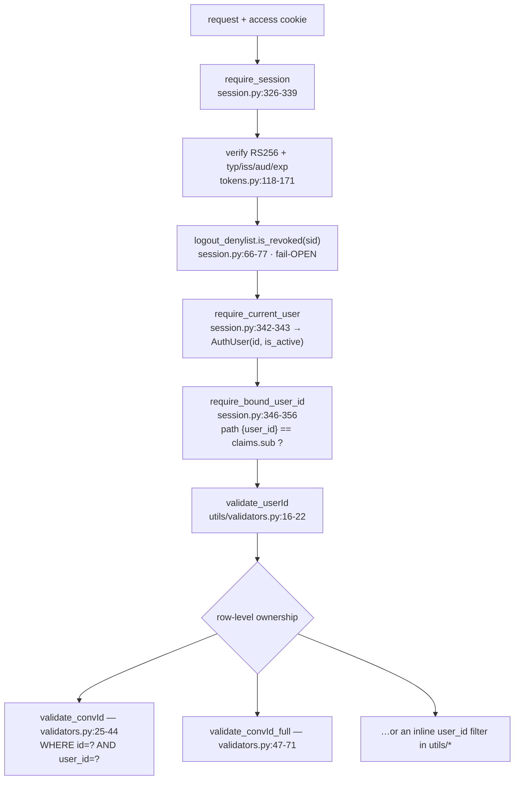
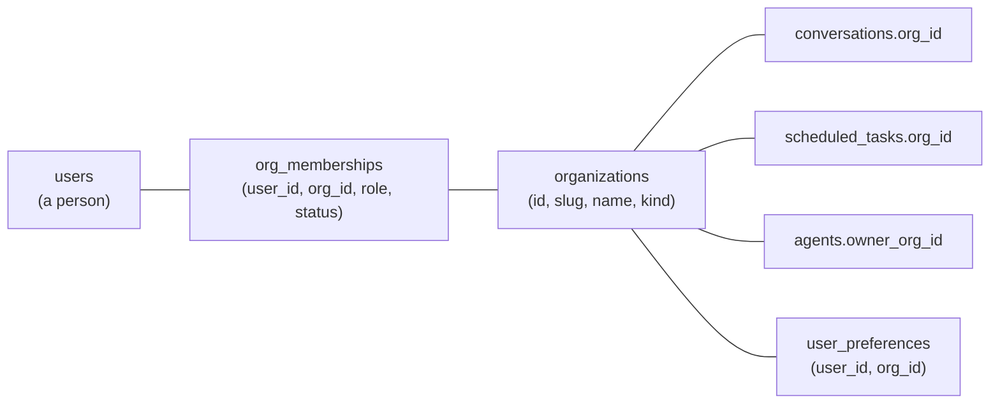
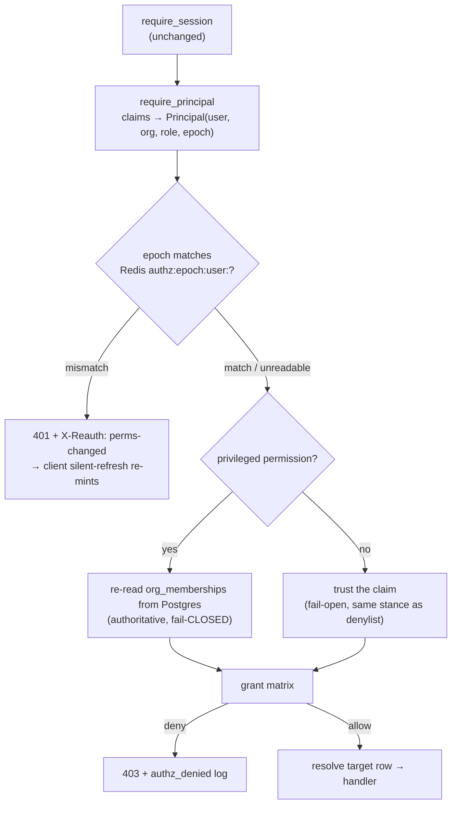

# Org + user permissions (multi-tenancy & RBAC)

> **Status:** Not started
> **TODO source:** General → "Make it a platform with org level and user-level permissions, so that users can have their own workspaces and agents, and orgs can have their own workspaces and agents along with admins."
> **Depends on:** nothing
> **Blocks:** [01 · Custom agents per user](01-custom-agents-per-user.md) · [03 · Projects / Workspaces](03-projects-and-workspaces.md) · [14 · Profile panel completion](14-profile-panel-completion.md)
> **Services touched:** dialogue_bridge · agentic_ui · agents · infra

mAgenticX is single-tenant per user today. Every row of user content hangs off exactly one `users.id`, every agent in the catalog is global and visible to everybody, and the entire authorization surface is one function — `require_bound_user_id` — which asserts that the `{user_id}` in the URL equals the `sub` claim of the caller's JWT. That is a correct and airtight model for "each person sees only their own things", and it is deliberately all that the stateless-auth overhaul built: RBAC, group claims, and any admin surface were explicitly scoped out of that work (see [authentication-and-session](../flows/authentication-and-session.md) — *"there is no admin-disable path wired today"* — and the Vault-side RBAC seam described in [src/vault/README.md](../../src/vault/README.md)). This plan is where that deferral lands.

The deliverable is a **tenancy and authorization layer**: an `organizations` table, an `org_memberships` table carrying a role (`owner` / `admin` / `member`), an `org_id` stamped onto every top-level owned resource, and a single FastAPI dependency that decides *may this principal perform this action on this resource* — replacing the implicit "the URL says it's mine" check with an explicit, testable grant matrix. It also settles the question every downstream plan trips over: **who can see an agent** (global, org-owned, or user-owned) and **who can administer whom**. Because it changes the primary key of "scope" across the whole product, it is the widest-blast-radius item in `src/TODO` and the first one in the [suggested order](README.md#suggested-order).

---

## 1. Goal & non-goals

**Goals.**

1. Introduce **organizations** as a first-class tenant: a named container with members, roles, and its own resources.
2. Introduce a **role model** — `owner`, `admin`, `member` — and a **permission** vocabulary that endpoints are written against, not role names.
3. Move authorization from "the path parameter matches my token" to **one enforcement point**: a dependency factory that resolves the target resource, resolves the principal's grants, and allows or denies. No scattered `if role == "admin"` branches.
4. Give every existing user-scoped table an **`org_id`**, backfilled to a **personal organization** created per user, so today's behaviour is bit-for-bit preserved on day one.
5. Answer **agent visibility**: an agent is `platform`-owned (the curated global catalog), `org`-owned, or `user`-owned, and the catalog query filters by the caller's memberships. This is the column-level foundation [01 · Custom agents per user](01-custom-agents-per-user.md) builds authoring on top of.
6. Ship **admin surfaces**: an Organization + Members settings area (invite, change role, deactivate, transfer ownership) and an audit trail for every membership/role mutation.
7. Keep the auth hot path **stateless**: role changes must take effect in seconds, without adding a Postgres query to every request.

**Non-goals.**

- **No self-service signup or org creation from the login page.** Provisioning stays admin-driven (Vault userpass entity / Entra tenant user), matching the model documented in [authentication-and-session](../flows/authentication-and-session.md). Org creation is a platform-admin action.
- **No cross-org sharing or resource transfer.** A conversation belongs to one org, forever. Sharing stays the existing public-link mechanism ([conversation-sharing](../flows/conversation-sharing.md)).
- **No per-resource ACLs** (per-conversation grants to individuals). Roles are org-wide; resource visibility inside an org is owner-only unless explicitly shared. Fine-grained ACLs are a later, separate item.
- **No billing, seats, or quota enforcement.** `org_id` makes them possible; they are not built here.
- **No IdP group → role sync.** `AuthIdentity.groups` already exists as the seam ([core/auth/providers.py:22](../../src/dialogue_bridge/core/auth/providers.py)); wiring Entra groups onto org roles is a follow-up noted in §12.
- **Workspaces/projects are not this plan.** They are the next scoping tier and live in [03 · Projects / Workspaces](03-projects-and-workspaces.md).

---

## 2. Current state

### 2.1 The data model is single-tenant by construction

[`core/database/models.py`](../../src/dialogue_bridge/core/database/models.py) declares eleven tables. Every one that holds user content roots at `users.id` with `ondelete="CASCADE"`, and none of them carries a tenant column:

| Table | Model | Ownership column |
| --- | --- | --- |
| `agents` | `AgentTable` — models.py:40-62 | **none** — global catalog; `slug` is globally unique (models.py:44) |
| `users` | `UserTable` — models.py:65-105 | — |
| `user_preferences` | models.py:108-137 | `user_id` FK, unique per user (models.py:110, 113) |
| `conversations` | models.py:140-189 | `user_id` (models.py:144) + `agent_id` (models.py:145) |
| `messages` | models.py:195-297 | via `conversation_id` (models.py:216) |
| `conversation_reports` | models.py:300-314 | `user_id` (models.py:306) |
| `conversation_shares` | models.py:317-331 | `owner_user_id` (models.py:323) |
| `attachments` | models.py:334-362 | via `message_id` (models.py:338) |
| `blobs` | models.py:365-373 | via `attachments.blob_id` (models.py:356) |
| `scheduled_tasks` | models.py:376-454 | `user_id` (models.py:399) |
| `message_embeddings` | models.py:457-483 | via `message_id` (models.py:474) |

`AgentTable` is the outlier and the crux of the agent-visibility question: it has no owner column at all, `slug` is `unique=True` (models.py:44), and the bridge treats the catalog as one global list cached in-process (`_AGENT_CACHE` in [`utils/agents.py`](../../src/dialogue_bridge/utils/agents.py), primed by `prime_agent_cache` and refreshed by `sync_agents_with_service` at utils/agents.py:129) — an assumption `ownerless → everyone sees it` that this plan has to break.

`users.role_title` (models.py:86) looks like a role but is **display copy only**: it is populated from IdP metadata by `upsert_user_from_identity` (models.py:575-577) and rendered read-only in `AccountTab.tsx`. Nothing branches on it. Likewise `users.is_active` (models.py:89) is the only authorization-adjacent flag, and it is a binary "may log in at all".

### 2.2 Authorization today is one function

Auth is stateless JWT, minted by the bridge and signed by Vault Transit. The claim set is fixed in [`core/auth/tokens.py`](../../src/dialogue_bridge/core/auth/tokens.py) at tokens.py:81 (`iss`, `aud`, `iat`, `nbf`, `sub`, `sid`) plus `typ`/`act`/`exp`/`jti` for access (tokens.py:83-89) and `lat` for refresh (tokens.py:98-104). **There is no role, org, group, or scope claim.**

The identity the app sees is correspondingly thin — `AuthContext` ([session.py:175-189](../../src/dialogue_bridge/core/auth/session.py)) and `AuthUser` (session.py:191-196) carry `id`/`user_id`/`is_active` and nothing else. The whole authorization chain is:



`validate_userId` (validators.py:16-22) is a pass-through over `require_bound_user_id` whose only extra job is `set_context(user_id=...)` for logging. It is applied on **59 route handlers across 12 routers** (`agent_tools`, `attachments`, `catalog`, `conversations`, `inference`, `memories`, `messages`, `preferences`, `scheduled_tasks`, `search`, `skills`, `speech`, `usage`, `voice`), and the *resource*-level check is either `validate_convId`/`validate_convId_full` or a hand-written `user_id ==` filter inside `utils/`. Those inline filters exist in ten util modules — `attachments.py:99,312`, `conversations.py:285`, `inference_runs.py:63,78,1386`, `scheduled_tasks.py:328`, `search.py:44,77,112`, `shared_conv.py:202`, `suggestions.py:27`, `usage.py:67`, `validators.py:37,64`. **This scattering is the thing the plan replaces**: fifteen independent places that must each remember to add `AND org_id = ?`.

Two other trust mechanisms exist and must not be confused with user authorization:

- **`require_internal_caller`** ([core/security/internal_trust.py:45-61](../../src/dialogue_bridge/core/security/internal_trust.py)) gates service-to-service routes on the shared `TRUSTED_PROXY_SECRET` and is paired with an nginx-edge deny. It authenticates the *caller service*, not a user; `internal_service_headers` (internal_trust.py:64-86) forwards the raw `X-User-Id`/`X-Session-Id` downstream for log correlation only — the agents service does no authorization of its own.
- **Rate limiting** ([core/security/rate_limit.py](../../src/dialogue_bridge/core/security/rate_limit.py)) keys its global budget on `verified_identity` → `user:<sub>` with an IP fallback, and exempts `/health` + `/v1/internal` (rate_limit.py:45-51). An org tier will want an org-level budget too (§7).

### 2.3 The pluggable seams that already exist

The stateless-auth work left three hooks pointing directly at this plan:

1. **`AuthIdentity.groups: tuple[str, ...]`** ([providers.py:22](../../src/dialogue_bridge/core/auth/providers.py)) — declared, documented as the future RBAC input, and never populated: `VaultUserpassProvider.authenticate` (providers.py:57-66) returns `subject`/`username`/`provider`/`email` only.
2. **Vault group policies** — [src/vault/README.md](../../src/vault/README.md) documents policy→group→entity as the intended RBAC pattern and notes that the userpass login response already carries `identity_policies`. The bridge discards it.
3. **The Entra group gate** — [authentication-and-session](../flows/authentication-and-session.md#group-gate) uses `ENTRA_ALLOWED_GROUP_IDS` as a boolean *admission* check at login. It proves group claims are reachable; it does not map them to roles.

### 2.4 Everything else that touches "scope"

- **Alembic head is `0016_retire_enabled_tools`** ([migrations/versions/0016_retire_enabled_tools.py:34-35](../../src/dialogue_bridge/migrations/versions/0016_retire_enabled_tools.py), `down_revision = "0015_personalization"`). Migrations run automatically in the bridge lifespan.
- **Routers are mounted flat under `/v1/*`** ([main.py:159-246](../../src/dialogue_bridge/main.py)); user-scoped paths take `{user_id}` as the first segment (e.g. `GET /v1/conversations/{user_id}`).
- **One endpoint is intentionally unauthenticated** — `GET /v1/shared-conversations/{token}` ([router/shared_conv.py:24](../../src/dialogue_bridge/router/shared_conv.py)). It must stay that way and must not gain an org check that breaks public links.
- **The agents service has no notion of a tenant.** Its filesystem is keyed `(user_id, agent_slug, conversation_id)` throughout [`runtime/filesystem/provisioner.py`](../../src/agents/runtime/filesystem/provisioner.py) (`user_root` at provisioner.py:89-95, `agent_root` at provisioner.py:118-125), and the YAML agent scan is global-only (`_scan_yaml_agents(settings.filesystem.global_root)` — [utils/agents.py:126](../../src/agents/utils/agents.py)).
- **The frontend has zero permission concept.** No role, capability, `isAdmin`, org, tenant, or membership anywhere in `src/agentic_ui/src`. Gating is binary — `authResolved && isLoggedIn && userId` (`pages/ChatPage.tsx:1532,1539`). `UserProfile.roleTitle` (`shared/lib/types.ts:66`) is a free-text HR field rendered in `AccountTab.tsx:22,36`. The settings nav is a flat concatenation of two groups (`profile_parts/ProfileSidebar.tsx:40-61`) with no conditional entries.

---

## 3. Target design

The model is **one principal, N memberships, one active org per request**. A user row is a *person*; an `org_membership` row is that person's *seat* in a tenant, carrying the role. Every request resolves to exactly one active org — taken from the access token, validated against the DB when it matters — and every resource carries a denormalized `org_id` so an authorization decision is a single indexed comparison rather than a join walk up to `users`.



### 3.1 Roles and permissions

Endpoints are written against **permissions**, never role strings — so adding a role later is a table edit, not a code sweep.

| Permission | `member` | `admin` | `owner` | Notes |
| --- | --- | --- | --- | --- |
| `conversation:*` (own) | ✅ | ✅ | ✅ | Own resources only — the existing behaviour |
| `conversation:read:any` | ❌ | ❌ | ❌ | Nobody reads another member's chats. Deliberate: admin ≠ surveillance |
| `task:*` (own) | ✅ | ✅ | ✅ | |
| `agent:use` | ✅ | ✅ | ✅ | Visible agents only (§3.4) |
| `agent:create:user` | ✅ | ✅ | ✅ | Own agents — [plan 01](01-custom-agents-per-user.md) |
| `agent:create:org` | ❌ | ✅ | ✅ | Org-shared agents |
| `member:invite` / `member:remove` | ❌ | ✅ | ✅ | Cannot act on an `owner` |
| `member:set_role` | ❌ | ✅* | ✅ | *admin may set `member`↔`admin`, never `owner` |
| `org:update` (name, settings) | ❌ | ✅ | ✅ | |
| `org:transfer_owner` / `org:delete` | ❌ | ❌ | ✅ | |
| `audit:read` | ❌ | ✅ | ✅ | |
| `platform:*` (global catalog, org create) | — | — | — | `users.is_platform_admin` only |

Two hard invariants: **an org always has at least one `owner`** (the last owner cannot be removed or demoted), and **`conversation:read:any` does not exist** — org admins administer membership and org-owned assets, never members' private content. Anything that would let an admin read a member's conversation is a separate, explicitly-consented feature.

### 3.2 Where authorization is enforced

One module, `core/security/authz.py`, exporting a dependency **factory**:

```python
require = authorize(Permission.MEMBER_INVITE, target=OrgTarget)      # org-level
require = authorize(Permission.CONVERSATION_WRITE, target=ConversationTarget)  # resource-level
```

The factory returns a FastAPI dependency that (1) takes the `AuthContext` from `require_session`, (2) builds a `Principal` (user id, active org, role, platform-admin flag), (3) resolves the *target* to an `(org_id, owner_user_id)` pair via a small resolver registry, (4) evaluates the grant matrix, and (5) raises `403` with a structured log event — or returns the resolved resource so the handler doesn't re-query it. `validate_convId` / `validate_convId_full` become thin wrappers over a `ConversationTarget` resolver, which keeps every existing router signature shape intact.



### 3.3 JWT claims vs. a DB lookup per request

This is the central trade-off. Three options, and why the design picks the third:

| Option | Hot path cost | Demotion latency | Verdict |
| --- | --- | --- | --- |
| **A — claims only** (`org`, `role` in the access token) | zero | up to the access TTL (**8 h**, `JWT_ACCESS_TTL_SECONDS`) | Rejected. An admin demoted for cause keeps admin for 8 hours. |
| **B — DB lookup per request** | +1 Postgres query on *every* request | immediate | Rejected. It destroys the property [authentication-and-session](../flows/authentication-and-session.md#phase-4--per-request-verification-stateless) exists to protect: "no database lookup and no Vault call on this path". |
| **C — claims + Redis permission epoch, with DB re-verify on privileged paths** | +1 Redis `GET`, **pipelined with the denylist `EXISTS` that already runs** | seconds | **Chosen.** |

Option C in full: the access token gains `org` (active org id), `rol` (role in that org), and `pe` (permission epoch at mint time). Any membership or role mutation `INCR`s `authz:epoch:user:<id>` in Redis in the same unit of work as the DB commit. `require_principal` reads that key alongside the existing logout-denylist check — the two become one pipelined round trip, so the hot path gains **no** extra network hop. On mismatch the request gets `401` with an `X-Reauth: perms-changed` hint, which the frontend's existing single-flight 401 → refresh → retry interceptor (`shared/lib/http.ts`, `requestRaw`) already handles: the refresh re-mints with fresh claims and the original request is retried. Net effect — a role change lands **within one request**, and the user never sees a login screen.

The fail stance is asymmetric on purpose, and this is the part that must not be simplified away:

- **Ordinary member-level permissions fail OPEN on a Redis error** — identical to the logout denylist (session.py:66-77) and the refresh guard (session.py:123-143). Redis down must not lock the whole product out.
- **Privileged permissions (`member:*`, `org:*`, `audit:read`, `agent:create:org`, `platform:*`) always re-read `org_memberships` from Postgres and fail CLOSED.** They are rare (admin screens), so the query is free, and a stale claim must never be able to authorize an escalation. A DB error on a privileged path is a `503`, not an allow.

Refresh (`rotate_session`, session.py:293-296) re-reads membership from the DB and re-stamps `org`/`rol`/`pe`, so the claim is authoritative at most one access-TTL old and epoch-checked continuously in between.

### 3.4 Agent visibility — global vs org vs user

`AgentTable` gains an explicit owner tier instead of being implicitly global:

| `owner_kind` | Columns set | Who sees it | Who edits it |
| --- | --- | --- | --- |
| `platform` | both owner FKs `NULL` | every authenticated user | platform admins (today: out-of-band seeding — [agents/runtime/abstractions/agent_seed.py:43](../../src/agents/runtime/abstractions/agent_seed.py)) |
| `org` | `owner_org_id` set | members of that org | org `admin`/`owner` |
| `user` | `owner_user_id` + `owner_org_id` set | that user only | that user |

The catalog query (`GET /v1/catalog/agents`, [router/catalog.py:25](../../src/dialogue_bridge/router/catalog.py)) becomes `owner_kind = 'platform' OR owner_org_id = :active_org AND (owner_user_id IS NULL OR owner_user_id = :me)`. **The globally-unique `slug` constraint (models.py:44) must go** — it is replaced by a partial-unique triple so a user's `research` agent can coexist with the platform's. The resolution/collision rule (does a user agent *override* a platform slug, or get namespaced?) is owned by [plan 01](01-custom-agents-per-user.md); this plan only guarantees the columns and the visibility filter it needs. The in-process `_AGENT_CACHE` (utils/agents.py) must be re-keyed or bypassed for non-platform agents — a per-process global cache cannot serve per-org visibility, and silently returning another org's agent would be a tenancy breach, so **the cache is narrowed to `platform` agents only** and org/user agents are read per request.

### 3.5 Admin surfaces

Two new settings sections, following the exact precedent of the existing nav groups (`profile_parts/ProfileSidebar.tsx:54-61` + the `renderGroupDivider("Workspace")` pattern at ProfileSidebar.tsx:302):

- **Organization** — name, slug, member count, your role; `org:update` gates the editable fields; owner-only danger zone (transfer ownership, delete).
- **Members** — the member table (name, email, role, status, last login), invite by email, change role, deactivate/remove, and the audit log. Rendered read-only for `member`, so the tab is informative rather than hidden — hiding it entirely on role is a fallback if we decide member visibility of the roster is itself sensitive (§12).

### 3.6 Migration path — a personal org per user

Existing rows must not change meaning. The backfill creates, for every `users` row, an `organizations` row with `kind='personal'` and an `org_memberships` row with `role='owner'`, then stamps that `org_id` onto every owned row. A single-user personal org is behaviourally identical to today: the only member is the owner, so every grant already resolves to "yes, it's mine". Real multi-user orgs are created afterwards by a platform admin, and a user is *moved* by adding a membership — never by rewriting their personal org.

---

## 4. Data model & migrations

Three new tables plus additive columns. Alembic slots: **`0017_organizations`**, **`0018_org_backfill`**, **`0019_agent_ownership`** (chained off `0016_retire_enabled_tools`).

### 4.1 `organizations`

| Column | Type | Notes |
| --- | --- | --- |
| `id` | `String` PK | `gen_uuid` default, matching every other table |
| `slug` | `String` unique, indexed | URL-safe handle; personal orgs get `personal-<user-id-prefix>` |
| `name` | `String` not null | |
| `kind` | `String` not null, default `'personal'` | `personal` \| `team`. A personal org can never gain a second member |
| `is_active` | `Boolean` not null, default `true` | Deactivating an org fails every authz check for it (fail-closed) |
| `settings` | `JSON` not null, default `{}` | Org-level defaults (allowed agents, retention) — populated by later plans |
| `created_at` / `updated_at` | `DateTime` | `server_default=func.now()` |

### 4.2 `org_memberships`

| Column | Type | Notes |
| --- | --- | --- |
| `id` | `String` PK | |
| `org_id` | FK `organizations.id` `ON DELETE CASCADE`, indexed | |
| `user_id` | FK `users.id` `ON DELETE CASCADE`, indexed | |
| `role` | `String` not null, default `'member'` | `owner` \| `admin` \| `member` — validated in Pydantic, **plus a DB `CheckConstraint`** so a bad write can't create an unrepresentable role |
| `status` | `String` not null, default `'active'` | `active` \| `invited` \| `suspended` |
| `invited_by_user_id` | FK `users.id` `ON DELETE SET NULL`, nullable | Provenance survives the inviter leaving |
| `joined_at` / `created_at` / `updated_at` | `DateTime` | |

Constraints: `UniqueConstraint("org_id", "user_id")` — one seat per person per org; a **partial unique index** on `(org_id)` `WHERE role = 'owner'` if we decide single-owner (§12 leaves multi-owner open, in which case the last-owner invariant is enforced in the util layer instead); composite index `(user_id, status)` for "list my orgs".

### 4.3 `org_audit_log`

Append-only record of every membership/role/org mutation: `id`, `org_id` (indexed), `actor_user_id`, `action` (`member.invite`, `member.role_change`, `member.remove`, `org.update`, `org.transfer_owner`, `agent.org_create`, …), `target_user_id` nullable, `metadata` JSON (before/after role — **never** secrets or content), `created_at` (indexed for the time-ordered read). No update or delete path.

### 4.4 Additive columns on existing tables

| Table | New column | Nullability path |
| --- | --- | --- |
| `users` | `is_platform_admin Boolean NOT NULL DEFAULT false` | additive, safe |
| `conversations` | `org_id` FK → `organizations.id`, indexed | nullable → backfill → `NOT NULL` |
| `scheduled_tasks` | `org_id` FK, indexed | same |
| `conversation_reports` | `org_id` FK, indexed | same |
| `conversation_shares` | `org_id` FK, indexed | same |
| `user_preferences` | `org_id` FK, indexed | same; the unique key becomes `(user_id, org_id)` so a person in two orgs can hold different preferences |
| `agents` | `owner_kind String NOT NULL DEFAULT 'platform'`, `owner_org_id` FK nullable indexed, `owner_user_id` FK nullable indexed | additive; `slug` unique **dropped** and replaced |

`messages`, `attachments`, `blobs`, and `message_embeddings` deliberately get **no** `org_id` — they are reachable only through a parent that has one, and denormalizing further would create four more places for the two values to diverge. Every query that touches them already joins `conversations` (e.g. `utils/attachments.py:99,312`).

New composite indexes, because these become the hot filters: `conversations(org_id, user_id, last_message_at DESC)`, `scheduled_tasks(org_id, user_id)`, `agents(owner_org_id, owner_kind)`.

### 4.5 The three migrations

**`0017_organizations`** — create the three new tables; add `users.is_platform_admin`; add every `org_id` column as **nullable**; no data movement. Reversible.

**`0018_org_backfill`** — data-only, one transaction, in this order (the backfill must be in the *same* migration as the `NOT NULL` tightening, per the repo rule that a schema change ships atomically with its data):

```python
def upgrade() -> None:
    # 1. one personal org per user (idempotent on re-run: guarded by NOT EXISTS)
    op.execute("""
        INSERT INTO organizations (id, slug, name, kind, is_active, settings, created_at, updated_at)
        SELECT u.id, 'personal-' || left(u.id, 12), coalesce(u.display_name, u.username),
               'personal', true, '{}'::json, now(), now()
        FROM users u
        WHERE NOT EXISTS (SELECT 1 FROM organizations o WHERE o.id = u.id)
    """)
    # 2. owner membership for each
    op.execute("""INSERT INTO org_memberships (...) SELECT ... 'owner', 'active' ... """)
    # 3. stamp every owned row, then tighten
    op.execute("UPDATE conversations SET org_id = user_id WHERE org_id IS NULL")
    op.alter_column("conversations", "org_id", nullable=False)
    # … repeat for scheduled_tasks, conversation_reports, conversation_shares, user_preferences
```

Reusing `users.id` as the personal `organizations.id` makes the backfill a column copy instead of a correlated subquery — a deliberate simplification that keeps the migration fast on a large `conversations` table and makes it trivially re-runnable. It is an implementation detail, never an API contract: nothing may assume `org_id == user_id`.

**`0019_agent_ownership`** — add the three `agents` owner columns; `UPDATE agents SET owner_kind='platform'`; **drop the `slug` unique constraint** and add two partial unique indexes (`WHERE owner_kind='platform'` on `slug`; `(owner_org_id, owner_user_id, slug)` for the rest). Autogenerate ignores `postgresql_where`, so both indexes are **hand-written** — the known blind spot called out in [CLAUDE.md § Schema Changes](../../CLAUDE.md).

Nothing is dropped that holds content, so no destructive-migration confirmation is needed. The `slug` constraint swap is the one risky operation: it must be `DROP CONSTRAINT` + `CREATE UNIQUE INDEX` in the same transaction so there is never a window where duplicate slugs can land.

---

## 5. API surface

### 5.1 New endpoints — `router/orgs.py` (registered in main.py alongside main.py:159-246)

| Method + path | Permission | Notes |
| --- | --- | --- |
| `GET /v1/orgs` | authenticated | The caller's memberships: `[{org, role, isActive}]`. Drives the org switcher |
| `GET /v1/orgs/{org_id}` | `org:read` (any member) | Org detail + member count |
| `PATCH /v1/orgs/{org_id}` | `org:update` | Name/settings. CSRF + rate limited |
| `GET /v1/orgs/{org_id}/members` | `org:read` | **Paginated** — no unbounded list |
| `POST /v1/orgs/{org_id}/members` | `member:invite` | Invite by email; creates a `status='invited'` membership. Resolves to an existing `users` row when the email matches, else pends until first login (mirrors the JIT-provisioning model in [authentication-and-session](../flows/authentication-and-session.md#identity-linking--one-row-per-human)) |
| `PATCH /v1/orgs/{org_id}/members/{user_id}` | `member:set_role` | Role/status change. Rejects self-demotion of the last owner and any write targeting an `owner` by an `admin` |
| `DELETE /v1/orgs/{org_id}/members/{user_id}` | `member:remove` | Membership only — **never** cascades to the member's content |
| `POST /v1/orgs/{org_id}/transfer-owner` | `org:transfer_owner` | Owner-only, confirmation-gated |
| `GET /v1/orgs/{org_id}/audit` | `audit:read` | Paginated, filterable by action |
| `POST /v1/auth/session/active-org` | authenticated + membership | Switch the active org: verifies membership, then `rotate_session` re-mints with the new `org`/`rol`/`pe`. Reuses the refresh path rather than inventing a second minting route |
| `POST /v1/platform/orgs` | `platform:*` | Create a `team` org. Platform-admin only |

Every mutating route carries `require_csrf_protection` (session.py:434-451) and a strict per-route `rate_limit` — membership mutations are privilege changes and deserve a tighter budget than the global per-identity one (rate_limit.py:39-42). The invite endpoint gets the tightest limit of all, since it is the enumeration-prone surface.

### 5.2 Changes to existing endpoints

**No path shapes change.** `{user_id}` stays the first segment on user-scoped routes: it is the ownership assertion, it is what `validate_userId` checks, and rewriting 59 handlers to `/v1/orgs/{org_id}/conversations/{user_id}` would be churn with no security gain (the org comes from the *verified token*, which is strictly more trustworthy than a path segment). What changes is *inside*:

- `validate_userId` → `require_principal_for_user`: same signature and same `403` on mismatch, plus it attaches the resolved `Principal` to `request.state` and asserts the target user shares the active org.
- `validate_convId` / `validate_convId_full` (validators.py:25-71) gain `ConversationTable.org_id == principal.org_id` in the existing `WHERE`. One line each, and it is the single fix that closes the whole conversation/message/attachment family, because every one of those queries already funnels through these two dependencies or joins `conversations`.
- The ten inline `user_id ==` filter sites (§2.2) each gain the org predicate. Where the filter is reachable without a `validate_convId`, it is refactored to take `Principal` instead of a bare `user_id: str`, so the type system stops a future caller from forgetting.
- `GET /v1/catalog/agents` (router/catalog.py:25) applies the visibility filter from §3.4.
- `GET /v1/shared-conversations/{token}` (shared_conv.py:24) stays unauthenticated and gains **no** org predicate. Its authorization is possession of the token; the snapshot is already denormalized into `conversation_shares.snapshot_json` (models.py:326), so no cross-tenant read is possible through it.

### 5.3 Schemas

New Pydantic models in `schemas/__init__.py`: `OrgOut`, `OrgMembershipOut`, `MemberInviteIn`, `MemberUpdateIn`, `OrgUpdateIn`, `AuditEntryOut`, `ActiveOrgIn`. `Role` and `MembershipStatus` are `Literal` types — the only accepted values — so a bad role never reaches SQL. `AuthResponse` gains `activeOrg` + `role` + `memberships`, and `UserProfile` gains `isPlatformAdmin`.

---

## 6. Frontend surface

New feature folder `features/orgs/` (`components/`, `hooks/`, `handlers/`), plus edits to the existing shell.

| Concern | Where | Change |
| --- | --- | --- |
| Permission source of truth | `shared/lib/types.ts` (extend `UserProfile` at types.ts:58-71 and `AuthResponse` at types.ts:73-77) | Add `activeOrg`, `role`, `memberships`, `isPlatformAdmin` |
| Wire mapping | `normalizeAuthResponse` in `shared/lib/utils.ts` (the single auth-payload mapper, imported at `shared/lib/api.ts:61`) | Map the new fields; Zod contract in `shared/lib/schemas.ts` following the `.transform`-for-required-keys pattern documented at schemas.ts:21-23 |
| Capability check | `features/orgs/hooks/usePermissions.ts` | `can(Permission)` derived from `role` + `isPlatformAdmin`. **Client-side gating is UX only** — every check is re-evaluated server-side |
| Store slices | `shared/stores/workspaceStore.ts` (state type at workspaceStore.ts:41-127, init at :134-171) | `activeOrgId`, `memberships`, `orgRole` |
| Org switcher | Sidebar footer account dropdown (`features/chat/components/ChatSidebar.tsx:783-923` — already a Radix `DropdownMenu` with a `ChevronsUpDown` at :814) | Add an org section; switching calls `POST /session/active-org` then refetches the sidebar. **Deliberately not the sidebar header** (ChatSidebar.tsx:419-465) — that slot is reserved for the workspace switcher in [plan 03](03-projects-and-workspaces.md), and stacking two switchers there would be unreadable |
| Settings sections | New `ORG_NAV_ITEMS` next to `profile_parts/ProfileSidebar.tsx:54-59`, appended into `NAV_ITEMS` at :61; a third `renderGroupDivider("Organization")` after :303; `SECTION_META` entries at `ProfilePanel.tsx:43-104`; render branches in the chain at `ProfilePanel.tsx:415-453` | `OrganizationTab.tsx`, `MembersTab.tsx` |
| API calls | `shared/lib/api.ts` | New functions following the established `(userId, …)`-path-param + `schema:` convention (`searchWorkspace` at api.ts:438-451 is the cleanest template) |
| 401 handling | `shared/lib/http.ts` (`requestRaw`) | Already refreshes + retries once on 401. The `X-Reauth: perms-changed` response needs **no new client code** — the existing interceptor is exactly the right behaviour. Verify the retry preserves the method/body |
| Snapshot | `shared/lib/uiStateStorage.ts` | Bump `version` 4 → 5 in **all four** coordinated sites (uiStateStorage.ts:35 type, :87 `z.literal`, :257 writer, and `features/auth/hooks/useSessionEffects.ts:291`). The schema is `.strict()` (uiStateStorage.ts:100) so old snapshots self-invalidate at :270 and repopulate from the backend — no migration branch needed, but the bump is mandatory or a v4 snapshot hydrates without an org and paints another tenant's cached sidebar |

Empty states, skeletons, confirmation dialogs on every destructive membership action, `aria-label` on icon-only role buttons, and 44×44 touch targets are all required per the frontend standards — the Members table is a data-dense surface and is the easy place to violate them.

---

## 7. Cross-cutting impact

This plan changes the meaning of "scope" for nearly every other item in [the index](README.md#index).

| Plan | Impact |
| --- | --- |
| [00 · Platform restructure](00-platform-restructure.md) (done) | Its per-user filesystem tree gains an org tier above it. `owner_kind` on `AgentTable` is the DB counterpart of its global-vs-user YAML resolution. Nothing shipped there is invalidated |
| [01 · Custom agents per user](01-custom-agents-per-user.md) | **Hard dependency.** Consumes `owner_kind`/`owner_org_id`/`owner_user_id` and the replaced `slug` uniqueness. Org-owned agents (`agent:create:org`) are a capability that only exists after this plan |
| [03 · Projects / Workspaces](03-projects-and-workspaces.md) | **Hard dependency.** A workspace is org-scoped: `workspaces.org_id`, and workspace membership is bounded by org membership. The `conversations.org_id` column added here is the parent of the `workspace_id` added there |
| [04 · Notifications + PWA](04-notifications-and-pwa.md) | Channel preferences and quiet hours become per-`(user, org)`. Org admins get a new notification class (invite accepted, role changed) |
| [05 · Artifacts / Canvas](05-artifacts-canvas.md) | Artifacts are org-scoped rows; "share an artifact" is bounded by org membership |
| [06 · Deep Research](06-deep-research-mode.md) | Source allow/denylists and research budgets are natural org-level policy (`organizations.settings`) |
| [07 · Tool RAG](07-tool-rag.md) / [10 · RAG via MCP gateway](10-rag-via-mcp-gateway.md) | Tool *availability* becomes an org policy on top of the per-(user, agent) prefs; the MCP gateway authorization work in 10 should key on org, not user |
| [08 · Workflow builder](08-workflow-automation-builder.md) | Workflows are org resources; who may create one that acts on shared data is an `admin` question |
| [09 · Email integration](09-email-integration.md) | Mailbox credentials are per-user but **must never** be readable by an org admin. This plan's "no `conversation:read:any`" stance is the precedent to hold |
| [11 · Sandbox runner](11-sandbox-runner.md) | Sandbox quotas and the HITL approval chain are per-org budgets |
| [12 · `create_skill` tool](12-create-skill-tool.md) | A created skill lands in the user's pool; org-shared skills need `owner_kind` on the skill registry too |
| [14 · Profile panel completion](14-profile-panel-completion.md) | **Hard dependency.** Its "Log out of all devices" stub needs a revoke-all path — which is the same `sid`-denylist + epoch machinery designed here. Its Security/Data-controls rows land in the same nav structure |
| [16 · Context & usage UI](16-context-usage-ui.md) | Usage aggregation (`utils/usage.py:67`) becomes org-level; "org usage" is a new admin view |

Beyond plans, the ripple touches:

- **Rate limiting** — `verified_identity` (rate_limit.py:54+) should gain an **org-level budget** above the per-user one, or one member can exhaust shared upstream capacity. Not optional once orgs are multi-user.
- **The agents service** — it does no authorization today. It must at minimum receive and log the org id (extend `internal_service_headers`, internal_trust.py:64-86) so its filesystem paths and audit trail are attributable. Whether the agents-side filesystem re-roots under org is a [plan 03](03-projects-and-workspaces.md) decision.
- **Observability** — every log line already carries a hashed `user_id`; `org_id` joins it as a first-class context field ([observability](../development/observability.md)). The `authz_denied` event becomes a monitored signal.
- **Docs** — see §11.

---

## 8. Phased execution

Each phase is independently deployable and leaves the product working.

### Phase 0 — Permission vocabulary and the enforcement seam (no behaviour change)

Add `core/security/authz.py` with the `Permission` enum, `Principal`, `Role`, the grant matrix as data, and the `authorize()` factory. Wire `Principal` construction from existing claims with a **synthetic personal org** (`org_id = user_id`, `role = owner`) so the matrix evaluates identically to today. Refactor `validate_userId` and `validate_convId*` to route through it.

*Acceptance:* the full bridge suite passes unchanged; every currently-allowed request is still allowed and every currently-denied one still `403`s; the grant matrix has unit tests for all role × permission cells.

### Phase 1 — Tables and backfill

Ship `0017` + `0018`. Models, schemas, and the `org_id` columns land; nothing reads them yet except the backfill.

*Acceptance:* `alembic upgrade head` on a copy of production data yields exactly one `personal` org and one `owner` membership per user, every `org_id` populated and `NOT NULL`, `alembic check` clean, and `alembic downgrade` back to `0016` succeeds.

### Phase 2 — Read the org from the DB and enforce it

Replace the synthetic principal with a real membership read at login/refresh; stamp `org`/`rol`/`pe` into the access token (tokens.py:83-89); add the Redis epoch, pipelined with the denylist check in `_resolve` (session.py:299-319); add `org_id` to `validate_convId*` and the ten inline filter sites; add the org predicate to every list query.

*Acceptance:* an integration test with two orgs proves total isolation — every list endpoint, every detail endpoint, search, usage, and scheduled tasks return nothing cross-org, and a hand-forged request with another org's resource id gets `404`, not `403` (no existence disclosure). Latency on the auth hot path is unchanged (one pipelined Redis round trip).

### Phase 3 — Org + membership API and audit log

`router/orgs.py`, `utils/orgs.py`, `0019`-independent. Invites, role changes, transfer, removal, audit writes, epoch `INCR` on every mutation, and the last-owner invariant.

*Acceptance:* role change takes effect on the **next request** (verified end-to-end through the 401→refresh→retry path); the last owner cannot be demoted or removed; every mutation writes exactly one audit row; an `admin` cannot modify an `owner`.

### Phase 4 — Agent ownership

Ship `0019`. Add the visibility filter to the catalog, narrow `_AGENT_CACHE` to `platform` agents, and keep `sync_agents_with_service` (utils/agents.py:129) writing `owner_kind='platform'` for everything it discovers.

*Acceptance:* an org-owned agent is invisible to a non-member; two orgs can hold the same slug; the platform catalog is unchanged for every existing user; the agent cache never serves a non-platform agent.

### Phase 5 — Frontend

Types, Zod contracts, `usePermissions`, store slices, org switcher, Organization + Members tabs, snapshot version bump.

*Acceptance:* a `member` sees the Members tab read-only; an `admin` can invite and change roles; switching org repaints the sidebar with that org's conversations only; a stale v4 UI snapshot is discarded rather than hydrated; keyboard navigation and reduced-motion behaviour verified on the new tabs.

### Phase 6 — Org-level rate limits, agents-service org propagation, docs

Org budget in `rate_limit.py`; `org_id` in `internal_service_headers` and in the agents-service log context; all docs in §11 updated in the same commits as the code.

*Acceptance:* an org budget is observable in the rate-limit headers; agents-service logs carry the org; `docs/flows/authentication-and-session.md` and `docs/architecture/database-schema.md` describe the shipped design.

---

## 9. Security & privacy

**Threat model.** The new adversary this plan introduces is the *authenticated tenant neighbour* — someone with a valid session in org A trying to read org B, and the org `member` trying to act as `admin`. Both are inside the trust boundary that `require_session` establishes, so the JWT alone stops neither.

- **Fail closed on tenancy.** Missing or unresolvable `org_id` on a principal is a `403`, never a fallback to "all orgs". A resource whose `org_id` doesn't match returns **`404`**, not `403`, so probing cannot confirm that an id exists in another tenant.
- **Fail closed on privilege, open on availability.** Privileged permissions always DB-verify and `503` on a DB error (§3.3). Ordinary member permissions fail open on a Redis outage, matching the existing denylist stance — this asymmetry is the design, not an oversight.
- **Escalation paths are enumerated and closed:** an `admin` cannot modify an `owner`; nobody can grant themselves `owner`; the last `owner` is immovable; `is_platform_admin` is settable only by direct DB access (no endpoint), because an endpoint that grants platform admin is the single highest-value target in the system.
- **Role claims are never trusted for privileged decisions.** The token is a fast path for reads; the DB is authority for writes that change access.
- **Invite enumeration.** `POST /members` must return an identical response whether or not the email matches an existing `users` row, and be rate-limited hard — otherwise it is a user-directory oracle. This mirrors the existing `IdentityConflictError` fail-closed stance (models.py:494-498).
- **Audit integrity.** `org_audit_log` is append-only with no update/delete route. It records ids and actions, never content, credentials, or tokens — per the logging rules in [observability](../development/observability.md).
- **Privacy by construction.** Org admins get **no** read access to members' conversations, attachments, memories, or (per [plan 09](09-email-integration.md)) mailboxes. If org-level content visibility is ever wanted, it must be a separate, explicitly-consented, audited feature — not a widened `admin` role.
- **Parameterized SQL everywhere.** The backfill in `0018` is the only raw SQL, it is static, and it interpolates nothing from user input.
- **CSRF + rate limits** on every mutating org route; the global identity budget already covers the rest (rate_limit.py:39-42).

---

## 10. Testing strategy

- **Grant-matrix unit tests** — every (role × permission × target-ownership) cell asserted from the matrix data, so adding a permission without a decision fails the build.
- **Cross-tenant isolation suite** — the highest-value tests. Two orgs, two users, then a parametrized sweep over *every* user-scoped endpoint in main.py:159-246 asserting `404`/`403` on the foreign resource. This must be exhaustive by construction (drive it off the route table) rather than hand-listed, or the next endpoint added will be the leak.
- **Real Postgres, never a mocked DB** — per repo rule. The migration test runs `0016 → head` against a seeded database and asserts the backfill invariants and downgrade.
- **Epoch/revocation timing** — role change → next request re-auths; assert the `X-Reauth` path and that the re-minted token carries the new role.
- **Fail-mode tests** — Redis down: member reads succeed, privileged writes are refused. DB down on a privileged path: `503`, not allow.
- **Frontend** — `usePermissions` unit tests; a v4→v5 snapshot-discard test; an org-switch test asserting the conversation list is refetched, not filtered client-side.
- **Regression** — the existing ~394-test bridge suite must pass at every phase boundary. Run it in-image (host FastAPI is older than the container pin).

---

## 11. Docs to update

| Doc | What changes |
| --- | --- |
| [`docs/flows/authentication-and-session.md`](../flows/authentication-and-session.md) | New claims (`org`/`rol`/`pe`), the epoch check in Phase 4, the active-org switch endpoint, and the RBAC deferral note replaced by the shipped design. **Also fix the stale File Map rows** — it points at `core/auth_client.py`, `core/vault_service.py`, and `core/logout_denylist.py`, which no longer exist (they are now `core/auth/vault.py` and the `LogoutDenylist` inside `core/auth/session.py`) |
| [`docs/architecture/database-schema.md`](../architecture/database-schema.md) | Three new tables, the `org_id` columns, the `agents` owner columns, and the replaced `slug` uniqueness |
| [`docs/architecture/overview.md`](../architecture/overview.md) | Org as the tenancy unit in the service/data model |
| [`docs/architecture/configuration.md`](../architecture/configuration.md) | Any new env (org rate-limit budget, epoch key TTL) |
| [`docs/flows/user-preferences.md`](../flows/user-preferences.md) | Preferences become per-`(user, org)` |
| [`docs/flows/catalog.md`](../flows/catalog.md) | Agent visibility tiers and the narrowed cache |
| [`docs/flows/conversation-management.md`](../flows/conversation-management.md) · [`conversation-sharing.md`](../flows/conversation-sharing.md) · [`scheduled-tasks.md`](../flows/scheduled-tasks.md) | The added org predicate; sharing explicitly unchanged |
| [`docs/development/observability.md`](../development/observability.md) | `org_id` as a log context field; `authz_denied` as a monitored event |
| **New** `docs/flows/organizations-and-permissions.md` | The authoritative flow doc once shipped: membership lifecycle, grant matrix, epoch revocation |
| [`CLAUDE.md`](../../CLAUDE.md) | A row in the Documentation Update Rule table for the new doc; secrets table if any new secret appears |

---

## 12. Risks & open decisions

**Risks.**

- **A missed ownership filter is a tenancy breach.** Fifteen known inline `user_id ==` sites plus every future query. Mitigation: make org scoping structural — resolvers return the row, `Principal` replaces bare `user_id: str` in util signatures, and the isolation suite is generated from the route table rather than written by hand.
- **The `agents.slug` uniqueness swap.** Dropping a unique constraint and adding partial replacements is the one migration step that could admit duplicates if it isn't atomic. Do both in one transaction; verify with a post-migration assertion.
- **`_AGENT_CACHE` is a process-global.** It already has a documented staleness quirk ([CLAUDE.md § Architecture Constraints](../../CLAUDE.md)); making it tenant-aware would turn a staleness bug into a data-leak bug. Narrowing it to `platform` agents is the safe answer, at the cost of a per-request read for org/user agents.
- **Preferences becoming per-`(user, org)`** changes a unique constraint that the frontend assumes is per-user. Missing a call site means a user's preferences silently reset when they switch org.
- **Blast radius on merge.** This plan touches nearly every router. Land it in the phase order above, each phase on its own `feat/` branch, never as one PR.
- **Latency regression.** If the epoch read is not pipelined with the denylist check, every request gains a Redis round trip. Measure before and after; the acceptance criterion in Phase 2 is explicit about this.

**Open decisions.**

1. **Single owner or multiple owners per org?** Multiple is friendlier operationally (no bus factor) but complicates "last owner" enforcement and transfer. Recommendation: **allow multiple**, enforce "at least one" in the util layer, and skip the partial unique index.
2. **Can one user belong to multiple orgs?** The schema allows it and the switcher assumes it. If we constrain to one org per user for v1, the switcher and the `(user_id, org_id)` preference key are dead weight. Recommendation: **allow multi-org** — retrofitting it later means re-keying preferences again.
3. **Is `is_platform_admin` a column or a distinguished org?** A column is simpler; a "platform org" reuses the membership machinery. Recommendation: **column**, with no endpoint to set it.
4. **Does the Members roster need hiding from `member`?** Read-only is friendlier; hidden is more private. Depends on whether orgs are one company (roster is fine) or a shared tenant (it is not).
5. **Should IdP groups drive roles?** `AuthIdentity.groups` (providers.py:22) and `ENTRA_ALLOWED_GROUP_IDS` make it cheap, and it removes a manual admin step. Risk: the IdP becomes the authority for platform roles and a group rename silently demotes people. Recommendation: **manual roles for v1**, group sync as an opt-in later.
6. **Does the personal org survive joining a team org?** Keeping it preserves "my private stuff" cleanly and matches the backfill. Alternative — migrating content into the team org — is a destructive data move and should not be the default.
7. **Where does the org switcher live** if [plan 03](03-projects-and-workspaces.md)'s workspace switcher takes the sidebar header? This plan assumes the footer account dropdown; the two plans must agree before either builds it.
8. **Does the agents service enforce anything?** Today it trusts `require_internal_caller` completely. Passing `org_id` for logging is the minimum; whether it independently validates the `(org, user, agent)` triple against the bridge is a defense-in-depth question worth answering before [plan 11](11-sandbox-runner.md) opens an execution path.

---

## 13. File map

| Concept | File | What to look for |
| --- | --- | --- |
| Every user-scoped table | [src/dialogue_bridge/core/database/models.py](../../src/dialogue_bridge/core/database/models.py) | `AgentTable` 40-62 (global `slug` 44), `UserTable` 65-105 (`role_title` 86, `is_active` 89), `ConversationTable` 140-189 (`user_id` 144), `ScheduledTaskTable` 376-454 (`user_id` 399), `upsert_user_from_identity` 505-582 |
| Migration chain head | [src/dialogue_bridge/migrations/versions/0016_retire_enabled_tools.py](../../src/dialogue_bridge/migrations/versions/0016_retire_enabled_tools.py) | `revision`/`down_revision` 34-35 |
| The only ownership check today | [src/dialogue_bridge/core/auth/session.py](../../src/dialogue_bridge/core/auth/session.py) | `require_bound_user_id` 346-356; `AuthContext`/`AuthUser` 175-196; `_resolve` + denylist 299-319; `rotate_session` 293-296 |
| Row-level ownership dependencies | [src/dialogue_bridge/utils/validators.py](../../src/dialogue_bridge/utils/validators.py) | `validate_userId` 16-22, `validate_convId` 25-44, `validate_convId_full` 47-71 |
| JWT claim set (needs `org`/`rol`/`pe`) | [src/dialogue_bridge/core/auth/tokens.py](../../src/dialogue_bridge/core/auth/tokens.py) | `mint_tokens` 64-115 (base claims 81, access 83-89), `verify` 118-171 |
| Pluggable IdP + the unused `groups` seam | [src/dialogue_bridge/core/auth/providers.py](../../src/dialogue_bridge/core/auth/providers.py) | `AuthIdentity.groups` 22, `VaultUserpassProvider.authenticate` 57-66 |
| Service trust (not user authz) | [src/dialogue_bridge/core/security/internal_trust.py](../../src/dialogue_bridge/core/security/internal_trust.py) | `require_internal_caller` 45-61, `internal_service_headers` 64-86 |
| Rate-limit identity (needs an org budget) | [src/dialogue_bridge/core/security/rate_limit.py](../../src/dialogue_bridge/core/security/rate_limit.py) | `USER_BUDGET_RATE` 39-42, `exempt_from_budget` 48-51, `verified_identity` 54+ |
| Global agent catalog + cache | [src/dialogue_bridge/utils/agents.py](../../src/dialogue_bridge/utils/agents.py) | `prime_agent_cache`, `get_cached_agents`, `sync_agents_with_service` 129 |
| Router registration (new `orgs` router) | [src/dialogue_bridge/main.py](../../src/dialogue_bridge/main.py) | `include_router` block 159-246 |
| Intentionally public endpoint | [src/dialogue_bridge/router/shared_conv.py](../../src/dialogue_bridge/router/shared_conv.py) | `getSharedConversation` 24 — must stay unauthenticated |
| Inline ownership filters to convert | `src/dialogue_bridge/utils/` | `attachments.py:99,312` · `conversations.py:285` · `inference_runs.py:63,78,1386` · `scheduled_tasks.py:328` · `search.py:44,77,112` · `shared_conv.py:202` · `suggestions.py:27` · `usage.py:67` |
| Agent-side tenancy blind spot | [src/agents/utils/agents.py](../../src/agents/utils/agents.py) · [src/agents/runtime/filesystem/provisioner.py](../../src/agents/runtime/filesystem/provisioner.py) | `_scan_yaml_agents` 78-115 (global only, called at 126) · `user_root` 89-95, `agent_root` 118-125 |
| Frontend identity + gating | `src/agentic_ui/src/shared/lib/types.ts` · `shared/lib/utils.ts` | `UserProfile` 58-71, `AuthResponse` 73-77; `normalizeAuthResponse` |
| Frontend store slices | `src/agentic_ui/src/shared/stores/workspaceStore.ts` | state type 41-127, init 134-171 |
| Settings nav (new Organization group) | `src/agentic_ui/src/features/settings/components/profile_parts/ProfileSidebar.tsx` · `ProfilePanel.tsx` | `WORKSPACE_NAV_ITEMS` 54-59, `NAV_ITEMS` 61, group divider 302-303 · `SECTION_META` 43-104, render chain 415-453 |
| Snapshot version (bump 4 → 5) | `src/agentic_ui/src/shared/lib/uiStateStorage.ts` · `features/auth/hooks/useSessionEffects.ts` | type 35, `z.literal` 87, writer 257, `.strict()` 100, discard 270 · memo 291 |
| 401 → refresh → retry interceptor | `src/agentic_ui/src/shared/lib/http.ts` | `requestRaw` — already handles `X-Reauth` re-mint with no change |
