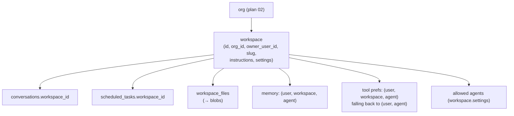
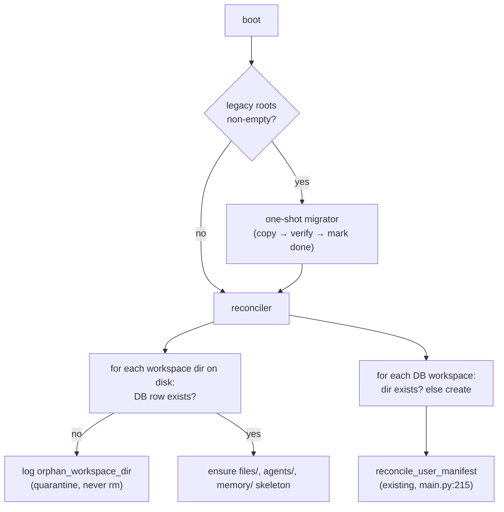

# Projects / Workspaces

> **Status:** Not started
> **TODO source:** New Features → "Projects / Workspaces: group related conversations, files, agents, tools, preferences, and instructions into persistent workspaces for long-running work. Each workspace/project carries **its own memory**, scoped per (user, workspace) — and later per (user, workspace, agent) — so a workspace's context never bleeds into another's."
> **Depends on:** [02 · Org + user permissions](02-org-and-user-permissions.md), [18 · Workspace filesystem consolidation](18-workspace-filesystem-consolidation.md)
>
> **Ownership note (added after 18 was written):** the **physical filesystem layout, the `/var/magenticx` volume, and the copy→verify→mark migrator are owned by [18](18-workspace-filesystem-consolidation.md)**. This plan consumes that layout and owns the workspace *entity* — the tables, membership, the switcher UI, and subdividing `workspaces/users/<user_id>/` into per-workspace subtrees plus the `(user, workspace, agent)` memory tier. Where the two overlap below (§2.3, §3.5), 18 is authoritative on paths and the move; do not migrate the same data twice.
> **Blocks (soft):** [01 · Custom agents per user](done/01-custom-agents-per-user.md) · [05 · Artifacts / Canvas](05-artifacts-canvas.md)
> **Services touched:** dialogue_bridge · agents · agentic_ui · infra

A workspace is a **persistent container for one body of work**: the conversations that belong to it, the files it accumulates, the agents and tools it makes available, the standing instructions every run in it inherits, and — the part that makes it more than a folder — **its own memory**. Today a user has exactly one implicit, unbounded context: every conversation sits in one flat list, and a deep agent's long-term memory is keyed `(user, agent)`, so what it learned while planning a holiday is injected into a run about a quarterly report. Workspaces make that boundary explicit and enforceable.

The memory tier is the load-bearing design decision. The per-`(user, agent)` tier already ships — `AGENTS.md` index plus `entries/*.yml` under `<user_root>/agents/<slug>/memory/`, written by the `remember` tool and inspectable in the Memories tab ([agent-memory](../flows/agent-memory.md)). This plan re-keys it to `(user, workspace, agent)`, which means re-rooting the agents-service filesystem — and that pulls in a migration the platform restructure left pending: user data still lives on the legacy `agents_filesystem` and `skills_registry_users` volumes, while the `/var/magenticx/workspaces` root that [00 · Platform restructure](done/00-platform-restructure.md) introduced sits unused and unmounted. **This plan owns that move**, plus the boot reconciler that keeps disk and database honest afterwards.

---

## 1. Goal & non-goals

**Goals.**

1. A **workspace entity** scoped to an org: name, slug, description, standing instructions, settings, owner.
2. **Conversations, scheduled tasks, and files belong to exactly one workspace.** Existing rows are backfilled into a per-user **Default** workspace, so nothing moves and nothing breaks.
3. **Per-`(user, workspace, agent)` memory** — the workspace tier of [agent-memory](../flows/agent-memory.md). No cross-workspace bleed, by construction (structurally disjoint mounts, not a filter).
4. **Per-workspace instructions** injected into every run in that workspace, composing cleanly with the existing per-user custom instructions.
5. **Per-workspace agent and tool selection** — a workspace narrows the agent picker and can override the per-`(user, agent)` tool prefs.
6. **Workspace files** — a first-class file set for the workspace, mounted read-only into the agent's view, independent of any single conversation.
7. **The storage migration**: `/var/magenticx/workspaces/<user_id>/<workspace_id>/…` becomes the real root, backed by a declared volume, populated by a one-shot migrator and kept consistent by an **idempotent boot reconciler**.
8. **UI**: a workspace switcher, a workspace-scoped sidebar and search, and a workspace settings surface.

**Non-goals.**

- **No multi-user collaborative workspaces in v1.** A workspace has one owner inside an org. The schema and the memory key are shaped so sharing needs no re-key later (§3.2), but no sharing UI, no per-workspace roles, no presence.
- **No cross-workspace move.** Relocating a conversation between workspaces means moving its checkpoint threads, its agent filesystem tree, and its memory provenance. Deferred, deliberately — see §12.
- **No workspace-scoped artifacts/canvas.** [05 · Artifacts / Canvas](05-artifacts-canvas.md) owns the editable surface; this plan only guarantees it a container to live in.
- **No org-owned workspaces.** Every workspace has an owning user. Org-level shared workspaces are the natural next step and depend on [02](02-org-and-user-permissions.md)'s role model being in place first.
- **No retention or quota policy per workspace.** The existing TTL sweep keeps working; per-workspace quotas arrive with billing.

---

## 2. Current state

### 2.1 There is no workspace concept anywhere

The database ([`core/database/models.py`](../../src/dialogue_bridge/core/database/models.py)) has no workspace, project, folder, or grouping table. `ConversationTable` (models.py:140-189) is keyed `(user_id, agent_id)` and ordered by `last_message_at` (models.py:163); the sidebar reads one flat, paginated list. `ScheduledTaskTable` (models.py:376-454) is `user_id`-keyed the same way. `UserPreferencesTable` (models.py:108-137) is one row per user, enforced by `UniqueConstraint("user_id")` (models.py:110), including the `custom_instructions` JSON blob (models.py:132) and the `use_memory` gate (models.py:124).

**Files are not an entity.** `AttachmentTable` (models.py:334-362) hangs off a `message_id` and carries `origin` (`upload` \| `generated`, models.py:350); bytes live in `BlobTable` (models.py:365-373) in Postgres. There is no standalone "file in a workspace" — grouping files therefore means introducing a new table, not adding a column.

Alembic head is `0016_retire_enabled_tools` ([migrations/versions/0016_retire_enabled_tools.py:34-35](../../src/dialogue_bridge/migrations/versions/0016_retire_enabled_tools.py)); [plan 02](02-org-and-user-permissions.md) consumes `0017`–`0019`.

### 2.2 The agents-service filesystem is keyed `(user, agent, conversation)`

[`runtime/filesystem/provisioner.py`](../../src/agents/runtime/filesystem/provisioner.py) is the single owner of every path. The layout it documents (provisioner.py:14-24) and builds:

```text
<user_root>/<user_id>/agents/<agent_slug>/
  memory/  AGENTS.md + entries/*.yml     ← /memories/   (provisioner.py:98-115)
  skills/  <skill_name>/SKILL.md         ← /skills/     (provisioner.py:128-130)
  tool_prefs.json                        ← per-(user, agent) overrides (tool_prefs.py:44-45)
  <conversation_id>/                     ← /conversation/ (provisioner.py:133-140)
    input/   output/                     ← :143-152, seeded/read at :303-350, :187-249
    large_tool_results/ conversation_history/  ← deepagents offload (workspace.py:100-103)
```

The helpers are `user_root` (provisioner.py:89-95), `memory_root` (98-105), `agent_root` (118-125), `skills_root` (128-130), `conversation_root` (133-140), and `ensure_user_agent_filesystem` (252-300). Mounts are assembled by `build_workspace_backend` ([runtime/filesystem/workspace.py:51-157](../../src/agents/runtime/filesystem/workspace.py), routes at workspace.py:128-154) with the write-deny ladder at workspace.py:42-48. The deep agent calls it with exactly three identity values — `user_id`, `agent_slug`, `conversation_id` ([runtime/abstractions/deep_agent.py:258-262](../../src/agents/runtime/abstractions/deep_agent.py)) — and `load_agent_md` (deep_agent.py:501-519) returns `["/memories/AGENTS.md"]` when memory is on.

**The run context is a loose dict**, which is what makes threading a fourth key cheap: `Request.config` is `Dict[str, Any]` ([schemas.py:6-9](../../src/agents/schemas.py)), `self.context = self.config.get("context", {})` ([runtime/abstractions/base_agent.py:73](../../src/agents/runtime/abstractions/base_agent.py)), and `_validate_context_config` (base_agent.py:200-210) requires exactly `user_id` and `conversation_id` to be non-empty strings. Adding `workspace_id` is one entry in that required-key tuple.

Two places hard-code the *shape* of the tree and will break silently if it deepens:

- **`retention.py`** — `_iter_scope_dirs` ([runtime/filesystem/retention.py:70-105](../../src/agents/runtime/filesystem/retention.py)) walks `<root>/<user_id>/agents/<agent_slug>/<conversation_id>/{input,output}` with `scandir`, skipping `_NON_CONVERSATION_DIRS = {"memory", "skills"}` (retention.py:47). One extra path level and the sweep quietly stops finding anything.
- **`user_registry.py`** — the per-user skill pool layout `$SKILLS_REGISTRY_USERS_ROOT/<user_id>/{manifest.json,custom/}` is documented and enforced at [user_registry.py:1-38](../../src/agents/runtime/skill_registry/user_registry.py), with `reconcile_user_manifest` healing drift at boot (called from [main.py:215](../../src/agents/main.py)).

### 2.3 The pending storage migration — the concrete gap

[`core/settings.py`](../../src/agents/core/settings.py) `FilesystemSettings` declares **five** roots, and the two newest are half-wired:

| Setting | Default | Status |
| --- | --- | --- |
| `user_root` (settings.py:426-429, `AGENTS_FILESYSTEM_ROOT`) | `/var/agents/filesystem` | **live** — every provisioner path |
| `skills_registry_global_root` (settings.py:434-437) | `/var/agents/skills_registry/global` | **live** |
| `skills_registry_users_root` (settings.py:442-445) | `/var/agents/skills_registry/users` | **live** |
| `global_root` (settings.py:455-458, `MAGENTICX_GLOBAL_ROOT`) | `/var/magenticx/global` | **partly live** — `_scan_yaml_agents` reads `<global_root>/agents` ([utils/agents.py:126](../../src/agents/utils/agents.py)) and `seed_global_agents` writes it ([runtime/abstractions/agent_seed.py:43](../../src/agents/runtime/abstractions/agent_seed.py)) |
| `workspaces_root` (settings.py:459-462, `MAGENTICX_WORKSPACES_ROOT`) | `/var/magenticx/workspaces` | **dead** — declared and referenced by nothing |

The compose files confirm it. `src/docker-compose.yaml` sets `AGENTS_FILESYSTEM_ROOT` + both `SKILLS_REGISTRY_*` (compose:63-66) and mounts three named volumes (compose:72-75, declared at compose:210-214); `docker-compose-denis.yaml` mirrors it (env at :97-98, mounts at :128-130, declarations at :388-392). **Neither compose sets `MAGENTICX_*` or mounts anything at `/var/magenticx`.** The Dockerfile creates `/var/magenticx/{global,workspaces}` and chowns them to UID 1000 (`Dockerfile:40-42`), so the directories exist — inside the container's ephemeral layer. Consequences today:

- `seed_global_agents` re-seeds built-in YAML agents into a throwaway layer on every boot. Harmless (it is a copy of image content, and `refresh_registry()` runs right after at main.py:219), but the documented "an admin's out-of-band edit to a built-in agent persists across restarts" (agent_seed.py:6-8) is **not true in either environment** — there is no volume behind it.
- `workspaces_root` has no data and no mount, so **all user data is still on the legacy volumes.** The two-plane layout the platform restructure designed ([docs/draft/plans/platform-restructure-change-plan.md](../draft/plans/platform-restructure-change-plan.md), §"Storage") is declared but unrealised.

### 2.4 Memory, tools, and instructions are all one tier too shallow

- **Memory** — `(user, agent)`. Store ops in [runtime/filesystem/memory.py](../../src/agents/runtime/filesystem/memory.py) (`list_memories` :68, `read_memory` :88, `delete_memory` :109, index row format `index_line`/`index_line_pattern` :31-43); cap `MEMORY_MAX_ENTRIES` = 60 (settings.py:481). Proxied to the UI through `router/memories.py` on both services ([agent-memory](../flows/agent-memory.md) has the endpoint table).
- **Tool prefs** — `(user, agent)`, stored at `<agent_root>/tool_prefs.json` (tool_prefs.py:44-45) with the effective set `(declared ∪ user_enabled) − user_disabled` (tool_prefs.py:13-19).
- **Instructions** — one per user: `user_preferences.custom_instructions` (models.py:129-132), parsed into the run via `parse_personalization(self.context)` (base_agent.py:86).
- **Skills** — `(user, agent)` by folder presence under `skills/` (provisioner.py:372-382), sourced from the user's pool.

### 2.5 The frontend has no scoping tier — and "workspace" is already an overloaded word

This is a naming hazard worth stating up front. In `src/agentic_ui/src` the token *workspace* already means **five different things**, none of them a project:

| Existing use | Where |
| --- | --- |
| `workspaceStore` — the shell's cross-view client state for the signed-in user (auth, catalogs, conversation lists, sidebar state) | `shared/stores/workspaceStore.ts` (docblock 19-35, state 41-127, init 134-171) |
| `ChatWorkspace` — the return type of the `useChatWorkspace` god-hook | `pages/ChatPage.tsx:1480` |
| `searchWorkspace()` / `WorkspaceSearchResult` — user-scoped semantic search | `shared/lib/api.ts:438-451` · `shared/lib/schemas.ts:236-252` |
| `WORKSPACE_NAV_ITEMS` — the settings nav group (Agents / Skills / MCP / Memories) | `profile_parts/ProfileSidebar.tsx:54-59`, merged at :61 |
| The literal sidebar brand subtitle `"Workspace"` and the `"Go to workspace"` tooltip | `features/chat/components/ChatSidebar.tsx:454`, :423 |

The surfaces that must become scoped:

- **Sidebar** — `ChatSidebar.tsx` receives a fully-formed `conversations` array (props at :51-91) and renders it at :579 with **no filtering of its own**. Active vs. archived is a *server-side split into two store arrays*, not a client filter (`features/chat/handlers/conversations.ts:334-338`, :362-366). There is no pinned or folder concept: `ConversationSummary` (`shared/lib/types.ts:247-263`) has `isArchived`/`isReported`/`isPrivate` only.
- **Four conversation fetch sites** — `features/auth/handlers/auth.ts:78`, `features/auth/hooks/useSessionEffects.ts:210-214`, `features/chat/handlers/conversations.ts:223` (load-more), `:419` (archived) — over two api functions, `getConversations` (api.ts:529-539) and `getArchivedConversations` (api.ts:543-553).
- **Search** — `useWorkspaceSearch` debounces 250 ms and calls `searchWorkspace(userId, query, 20)` (`features/search/handlers/search.ts:50`); no scope parameter exists. `createSearchResultHandlers` synthesizes a `ConversationSummary` from a hit and hardcodes `isPrivate: false, isArchived: false` (search.ts:123-124) — a `workspaceId` would need synthesizing there too.
- **Snapshot** — `UISnapshotSerializable` is at `version: 4` and the literal appears in **four coordinated places**: `shared/lib/uiStateStorage.ts:35` (type), `:87` (`z.literal`), `:257` (writer), and `features/auth/hooks/useSessionEffects.ts:291`. The schema is `.strict()` (uiStateStorage.ts:100) and `loadUISnapshot` discards the whole snapshot on any mismatch (`:270`) — so a bump self-invalidates v4 with no migration branch, but skipping the bump would hydrate a workspace-less snapshot and paint the wrong conversation list.

---

## 3. Target design

### 3.1 The tiers, top to bottom



Every user has one `is_default` workspace, created on first login (and by the backfill for existing users). The default workspace is **not special-cased in code** — it is an ordinary row that happens to be pre-created and non-deletable, so there is never a "workspace-less" code path to reason about. That is the single most important simplification in this plan: after the backfill, `workspace_id` is `NOT NULL` everywhere and no query needs an `IS NULL` branch.

### 3.2 Memory: `(user, workspace, agent)`

The mount stays `/memories/`; only its physical root deepens. Isolation remains **structural** — a `FilesystemBackend` rooted at one workspace's memory directory cannot resolve into another's, exactly as per-conversation isolation works today (workspace.py:73-78). No filter, no predicate, nothing to forget.

The key is `(user, workspace, agent)` and **not** `(workspace, agent)` even though v1 workspaces are single-owner. The reason is forward-compatibility: the moment a workspace is shared, "what the agent learned about *me*" must not merge with what it learned about a colleague — and re-keying a memory store after the fact means rewriting every path on disk. The TODO already anticipates this ordering ("scoped per (user, workspace) — and later per (user, workspace, agent)"); building the three-part key immediately costs one path segment and removes a future migration.

Existing per-`(user, agent)` memory is **moved** into the default workspace by the migrator (§4.4). There is deliberately **no** user-level "global memory" mount that spans workspaces — it would reintroduce exactly the bleed the feature exists to prevent. §12 keeps it as an open question, since a small set of durable facts ("the user is in Athens") arguably belongs everywhere.

### 3.3 Filesystem layout

```text
/var/magenticx/global/                              ← volume magenticx_global (NEW mount)
  agents/<slug>/agent.yaml                          ← seeded from the image (agent_seed.py:43)
  skills/<category>/<skill>/SKILL.md                ← from skills_registry_global

/var/magenticx/workspaces/<user_id>/                ← volume magenticx_workspaces (NEW mount)
  skills/                                           ← the user's skill pool (manifest.json + custom/)
  agents/<slug>/                                    ← the user's own agent definitions (plan 01)
  <workspace_id>/
    files/                                          ← workspace files → /workspace/files/ (read-only)
    agents/<agent_slug>/
      memory/  AGENTS.md + entries/*.yml            ← /memories/
      skills/  <skill_name>/                        ← /skills/ (enabled for this workspace-agent)
      tool_prefs.json                               ← workspace-tier override
      <conversation_id>/
        input/ output/ large_tool_results/ conversation_history/
```

The user's **skill pool** and **own agent definitions** stay at the *user* level, above the workspace tier: a skill you authored is yours everywhere, and duplicating pools per workspace would multiply storage and confuse the registry reconciler. What is per-workspace is which of them are *enabled* for a given agent — the same folder-presence mechanism as today (provisioner.py:372-382), just one level deeper.

Two new mounts join the CompositeBackend routes (workspace.py:128-154):

| Route | Physical root | Mode |
| --- | --- | --- |
| `/memories/` | `<ws>/agents/<slug>/memory/` | read-write, gated by `use_memory` |
| `/skills/` | `<ws>/agents/<slug>/skills/` | read-only (already write-denied, workspace.py:43) |
| **`/workspace/files/`** | `<ws>/files/` | **read-only — new `WORKSPACE_WRITE_DENY` entry** |
| `/conversation/…` | `<ws>/agents/<slug>/<conv_id>/…` | unchanged semantics |

`/workspace/files/` is read-only for the same reason `/conversation/input/` is (workspace.py:46-47): the bytes are owned by the database, the directory is a cache, and an agent that could write there would create content with no row behind it. Every new deny rule must be added in `WORKSPACE_WRITE_DENY` **in the same edit** as its route — deepagents rejects a permission pointing at an unmounted route, which is precisely why the two live in one file (workspace.py:11-18).

### 3.4 Instructions, tools, and agent selection

**Instructions** compose as three additive layers, most specific last, so a workspace refines rather than replaces:

```text
agent AGENT.md (identity)  →  user custom_instructions  →  workspace.instructions
```

The user layer already flows through `parse_personalization(self.context)` (base_agent.py:86) from `user_preferences.custom_instructions` (models.py:132). The workspace layer is threaded the same way: the bridge puts `workspace_instructions` in the run context, and the deep agent's system-prompt assembly appends it. Length is capped and validated at the API boundary (Pydantic) — an unbounded instruction field is a context-budget hole and a prompt-injection surface.

**Tool prefs** gain a workspace tier with fallback: read `<ws>/agents/<slug>/tool_prefs.json`, and when absent fall back to the user-level file. The effective-set formula is untouched — `(declared ∪ enabled) − disabled` (tool_prefs.py:13-19) — and the agent's declared set stays the authoritative superset, which is the hard constraint [07 · Tool RAG](07-tool-rag.md) also depends on. Fallback (rather than merge) keeps the mental model single-valued: a workspace either overrides the tool set or it doesn't.

**Agent selection** is a `workspaces.settings.allowedAgentSlugs` allowlist. Empty means "every agent visible to me" — never "none" — because a fail-closed default here would make a freshly created workspace unusable. This is a UX narrowing, not a security control: the authorization boundary is [plan 02](02-org-and-user-permissions.md)'s visibility filter, and the bridge still validates the requested agent against it on every inference call.

### 3.5 The storage migration and the boot reconciler



**Copy, verify, then mark — never move.** The migrator copies the legacy tree into the new root, verifies file counts and sizes per user, writes a `.migrated` marker, and leaves the legacy volume **untouched**. The legacy volumes are detached in a *later, separate* deploy once the new layout has run in production; that turns an irreversible data move into a reversible config change, which is the only acceptable posture for a volume holding the only copy of every user's agent memory.

The **reconciler** runs on every boot in the agents-service lifespan (main.py:202+, next to `reconcile_all_user_manifests` at :215 and `seed_global_agents` at :218), and follows the existing reconciler's philosophy — heal drift, never delete user content. A directory with no DB row is **logged and left alone**, not removed: the DB might be mid-migration, and an over-eager reconciler that deletes an unrecognised memory tree is unrecoverable. Cleanup of genuine orphans is a separate, explicitly-invoked admin operation.

Both composes gain the two mounts and the `MAGENTICX_*` env, and `retention.py` (retention.py:47, 70-105) is rewritten for the deeper walk — `<root>/<user>/<workspace>/agents/<slug>/<conv>/{input,output}` — with `_NON_CONVERSATION_DIRS` extended (`memory`, `skills`, plus the workspace-level `files`, `agents`).

### 3.6 UI surface

The switcher goes in the **sidebar header** (`ChatSidebar.tsx:419-465`), which already has the right affordance: a `size="lg"` `SidebarMenuButton` with a two-line label whose subtitle is the literal string `"Workspace"` (:454). It becomes the active workspace name plus a `ChevronsUpDown`, mirroring the footer account dropdown (:783-923, chevron at :814) — where [plan 02](02-org-and-user-permissions.md) puts the **org** switcher. Org in the footer, workspace in the header: the two plans must not both claim the header, and the collapsed-rail `px-1.5` lead documented at ChatSidebar.tsx:427-431 is load-bearing for any new row.

Scoping is a **refetch, not a client filter** — the sidebar is server-paginated (`handleScroll` at ChatSidebar.tsx:230-240 → `onLoadMore`), so filtering client-side would silently paginate over the wrong set. Switching workspace resets pagination and refetches through the same four call sites listed in §2.5.

---

## 4. Data model & migrations

Alembic slots **`0020_workspaces`**, **`0021_workspace_backfill`**, **`0022_workspace_files`**, chained after [plan 02](02-org-and-user-permissions.md)'s `0019_agent_ownership`.

### 4.1 `workspaces`

| Column | Type | Notes |
| --- | --- | --- |
| `id` | `String` PK | `gen_uuid` |
| `org_id` | FK `organizations.id` `ON DELETE CASCADE`, indexed | From [plan 02](02-org-and-user-permissions.md) |
| `owner_user_id` | FK `users.id` `ON DELETE CASCADE`, indexed | v1: the only member |
| `slug` | `String` not null | Unique per owner: `UniqueConstraint("owner_user_id", "slug")`. Also the path-safe segment — must satisfy the agents service's `_safe_segment` (provisioner.py:70-86) |
| `name` | `String` not null | |
| `description` | `String` nullable | |
| `instructions` | `Text` nullable | Standing instructions; length-capped at the API boundary |
| `icon` / `color` | `String` nullable | Sidebar affordance; semantic tokens only, never hex in components |
| `is_default` | `Boolean` not null default `false` | Exactly one true per user (partial unique index `WHERE is_default`); non-deletable |
| `is_archived` | `Boolean` not null default `false` | Archive, not delete — deleting a workspace would cascade real content |
| `settings` | `JSON` not null default `{}` | `{allowedAgentSlugs: [...], defaultAgentSlug: "..."}` |
| `created_at` / `updated_at` | `DateTime` | |

Indexes: `(owner_user_id, is_archived, updated_at DESC)` for the switcher list; `(org_id)`.

### 4.2 `workspace_members` — created now, unused in v1

`id`, `workspace_id` FK CASCADE, `user_id` FK CASCADE, `role` (`owner` \| `editor` \| `viewer`, `CheckConstraint`-guarded), `created_at`; `UniqueConstraint("workspace_id", "user_id")`. The backfill writes exactly one `owner` row per workspace and no endpoint reads the table in v1. It exists now for one reason: it forces every authorization query to be written as "is there a membership row?" rather than `owner_user_id == me`, so enabling sharing later is a UI change instead of an authorization rewrite. **If we would rather not carry an unread table, the alternative is to defer it — but then §3.2's memory key must still be `(user, workspace, agent)` or sharing becomes a data migration** (§12).

### 4.3 `workspace_files`

| Column | Type | Notes |
| --- | --- | --- |
| `id` | `String` PK | |
| `workspace_id` | FK CASCADE, indexed | |
| `uploaded_by_user_id` | FK `users.id` `ON DELETE SET NULL` | Provenance survives a departure |
| `file_name` / `mime_type` / `size_bytes` | as `AttachmentTable` (models.py:341-343) | |
| `origin` | `String` default `'upload'` | `upload` \| `generated` — mirrors models.py:350 so the frontend renders both families identically |
| `blob_id` | FK `blobs.id` `ON DELETE CASCADE`, indexed | **Reuses `BlobTable`** (models.py:365-373). Blob data stays in Postgres, per the hard constraint in [CLAUDE.md](../../CLAUDE.md) — no new storage backend |
| `created_at` / `updated_at` | `DateTime` | |

Index `(workspace_id, created_at DESC)`. Never `SELECT` the blob on a list endpoint — the existing column-exclusion pattern for attachments applies verbatim.

### 4.4 Additive columns and the backfill

| Table | Column | Path |
| --- | --- | --- |
| `conversations` | `workspace_id` FK, indexed | nullable → backfill → `NOT NULL` |
| `scheduled_tasks` | `workspace_id` FK, indexed | same |
| `agents` | `workspace_id` FK, **nullable permanently** | For user-owned agents scoped to one workspace; `NULL` = user-wide or platform ([plan 01](done/01-custom-agents-per-user.md) owns the semantics) |

New composite indexes replacing the user-only ones on the hot paths: `conversations(workspace_id, user_id, last_message_at DESC)`, `scheduled_tasks(workspace_id, user_id)`, and `workspace_files(workspace_id, created_at DESC)`.

**`0021_workspace_backfill`** — data plus the `NOT NULL` tightening in one transaction:

```python
def upgrade() -> None:
    # 1. one Default workspace per user, in that user's personal org (plan 02's 0018)
    op.execute("""
        INSERT INTO workspaces (id, org_id, owner_user_id, slug, name, is_default,
                                is_archived, settings, created_at, updated_at)
        SELECT u.id, m.org_id, u.id, 'default', 'Default', true, false, '{}'::json, now(), now()
        FROM users u
        JOIN org_memberships m ON m.user_id = u.id AND m.role = 'owner'
        WHERE NOT EXISTS (SELECT 1 FROM workspaces w
                          WHERE w.owner_user_id = u.id AND w.is_default)
    """)
    op.execute("""INSERT INTO workspace_members (...) SELECT ..., 'owner' ...""")
    op.execute("UPDATE conversations   SET workspace_id = user_id WHERE workspace_id IS NULL")
    op.execute("UPDATE scheduled_tasks SET workspace_id = user_id WHERE workspace_id IS NULL")
    op.alter_column("conversations",   "workspace_id", nullable=False)
    op.alter_column("scheduled_tasks", "workspace_id", nullable=False)
```

As in `0018`, reusing `users.id` as the default workspace's id makes the stamping a column copy rather than a correlated subquery — fast on a large `conversations` table, trivially re-runnable, and **never** an API contract. Nothing may assume `workspace_id == user_id`; the filesystem migrator reads the real id from the DB.

The partial unique index on `is_default` and the one on `(owner_user_id, slug)` are **hand-written** — autogenerate silently drops `postgresql_where` ([CLAUDE.md § Schema Changes](../../CLAUDE.md)).

### 4.5 The filesystem migrator

A separate one-shot module in the agents service (`runtime/filesystem/migrate_layout.py`), invoked from the lifespan before the reconciler, driven by the DB's default-workspace ids (fetched from the bridge over the internal-trust hop, or read from a bridge-provided map — it must not guess). Per user:

```text
<legacy user_root>/<uid>/agents/<slug>/memory/     → <workspaces_root>/<uid>/<default_ws>/agents/<slug>/memory/
<legacy user_root>/<uid>/agents/<slug>/skills/     → …/<default_ws>/agents/<slug>/skills/
<legacy user_root>/<uid>/agents/<slug>/tool_prefs.json → …/<default_ws>/agents/<slug>/tool_prefs.json
<legacy user_root>/<uid>/agents/<slug>/<conv>/     → …/<default_ws>/agents/<slug>/<conv>/
<legacy skills_users>/<uid>/{manifest.json,custom/} → <workspaces_root>/<uid>/skills/
```

Copy → verify (per-user file count + byte total) → write `<workspaces_root>/<uid>/.migrated` → log a structured summary. Idempotent: a present marker skips the user. Legacy volumes stay mounted and read-only-in-practice until a later deploy detaches them.

---

## 5. API surface

### 5.1 New endpoints — `router/workspaces.py`, `utils/workspaces.py`

| Method + path | Authorization | Notes |
| --- | --- | --- |
| `GET /v1/workspaces/{user_id}` | `validate_userId` + org scope | The switcher list. **Paginated**, archived excluded by default |
| `POST /v1/workspaces/{user_id}` | + CSRF | Create; slug validated against the same charset the agents service's `_safe_segment` accepts (provisioner.py:70-86) so a name can never become a hostile path segment |
| `GET /v1/workspaces/{user_id}/{workspace_id}` | + `validate_workspaceId` | Detail incl. instructions + settings |
| `PATCH …/{workspace_id}` | + CSRF | Name, description, instructions, settings, icon |
| `POST …/{workspace_id}/archive` · `/unarchive` | + CSRF | |
| `DELETE …/{workspace_id}` | + CSRF, **confirmation-gated** | Refused on the default workspace; refused while it holds conversations unless the caller passes an explicit cascade flag. This is a destructive-content path and needs the same care as a destructive migration |
| `GET …/{workspace_id}/files` | | Paginated, **blob column excluded** |
| `POST …/{workspace_id}/files` | + CSRF | MIME + size validated **before** `base64.b64decode(..., validate=True)` — the documented footgun |
| `GET …/{workspace_id}/files/{file_id}` | | `StreamingResponse`, chunked; never buffer the blob |
| `DELETE …/{workspace_id}/files/{file_id}` | + CSRF | Cascades the blob |

A new `validate_workspaceId` dependency joins `validate_convId`/`validate_convId_full` in [utils/validators.py](../../src/dialogue_bridge/utils/validators.py) — same shape (scope the lookup by both ids, `404` on miss), and `validate_convId*` additionally gain `ConversationTable.workspace_id == workspace_id` when the route carries one.

### 5.2 Changes to existing endpoints

- `GET /v1/conversations/{user_id}` and the archived variant take an optional `workspace_id` query param; when present it is an additional `WHERE`, when absent the default workspace is used. **Absent must never mean "all workspaces"** — that silently reintroduces the flat list and would leak one workspace's titles into another's sidebar.
- `POST /v1/inference/...` carries `workspace_id`; the bridge validates ownership, then threads it into the agents run context.
- `GET /v1/search/{user_id}` takes `workspace_id`; the three `ConversationTable.user_id ==` filters in [utils/search.py:44,77,112](../../src/dialogue_bridge/utils/search.py) each gain the workspace predicate. Cross-workspace search stays possible only as an explicit opt-in flag, off by default.
- Scheduled tasks (`utils/scheduled_tasks.py:328`) and suggestions (`utils/suggestions.py:27`) gain the same predicate. The scheduler's due-poll (`ix_scheduled_tasks_due`, models.py:387-395) is workspace-agnostic by design — it fires whatever is due; the workspace only scopes *listing* and the run context.
- Memories endpoints ([agent-memory](../flows/agent-memory.md)'s table) gain a `workspace_id` segment on both hops, bridge and agents.
- Agents-service internal endpoints (`/agents/{slug}/users/{user_id}/…` for memories, skills, tool prefs, input seeding, conversation reaping) all gain the workspace segment.
- **`_validate_context_config` (base_agent.py:200-210) adds `workspace_id` to its required-key tuple** — fail-closed: a run without a workspace is a `400`, never a fallback to a default resolved inside the agents service. The agents service must not invent scope.

---

## 6. Frontend surface

New feature folder `features/workspaces/` (`components/`, `hooks/`, `handlers/`).

| Concern | Where | Change |
| --- | --- | --- |
| Types + contracts | `shared/lib/types.ts` · `shared/lib/schemas.ts` | `Workspace`, `WorkspaceFile`; `ConversationSummary` (types.ts:247-263) gains `workspaceId`; Zod `.transform` style so keys are required (the pattern documented at schemas.ts:21-23) |
| API | `shared/lib/api.ts` | `listWorkspaces`, `createWorkspace`, `updateWorkspace`, `archiveWorkspace`, `deleteWorkspace`, file CRUD; **`getConversations` (api.ts:529) / `getArchivedConversations` (:543) / `searchWorkspace` (:438) each gain a scope argument** |
| Store | `shared/stores/workspaceStore.ts` (state 41-127, init 134-171) | `workspaces`, `activeWorkspaceId`, `workspacesLoading`. Naming: prefix new slices unambiguously (`projectList`, `activeProjectId`) if §12's rename lands |
| Switcher | `features/chat/components/ChatSidebar.tsx:419-465` (props at :51-91; call site `pages/ChatPage.tsx:1565-1593`) | Replace the static `"Workspace"` subtitle (:454) with the active name + `ChevronsUpDown`; dropdown lists workspaces, "New workspace", "Manage". Copy the `px-1.5` collapsed-rail lead (:427-431) |
| Refetch on switch | `features/chat/handlers/conversations.ts:223`, `:419` · `features/auth/handlers/auth.ts:78` · `features/auth/hooks/useSessionEffects.ts:210-214` | Reset pagination and refetch; never filter client-side (the list is server-paginated via ChatSidebar.tsx:230-240) |
| Search scoping | `features/search/handlers/search.ts:50` (+ synthesized summary at :123-124) | Pass the active workspace; add `workspaceId` to the synthesized `ConversationSummary` |
| Workspace settings | New tab in the settings nav (`profile_parts/ProfileSidebar.tsx:54-61`, `SECTION_META` at `ProfilePanel.tsx:43-104`, render chain at `:415-453`) | Instructions editor, allowed agents, files, danger zone |
| Snapshot | `shared/lib/uiStateStorage.ts` + `features/auth/hooks/useSessionEffects.ts:291` | Bump `version` (4 → 5, or → 6 if [plan 02](02-org-and-user-permissions.md) lands first) in **all four** sites: uiStateStorage.ts:35, :87, :257, useSessionEffects.ts:291. Persist `activeWorkspaceId`. **Coordinate with plan 02** — two independent bumps to the same literal is a guaranteed merge conflict; land one bump per deploy |

UX obligations: a skeleton for the switcher (workspaces load with the bootstrap), an empty state on a fresh workspace that offers "start a chat" rather than a bare void, confirmation on archive **and** delete, optimistic switch with rollback + toast on failure, and `useReducedMotion()` around any switcher animation. Never animate `width`/`height` on the dropdown — `transform`/`opacity` only.

---

## 7. Cross-cutting impact

Together with [plan 02](02-org-and-user-permissions.md) this reshapes scoping for nearly every other plan. Where 02 adds the *tenant* key, this adds the *context* key.

| Plan | Impact |
| --- | --- |
| [02 · Org + permissions](02-org-and-user-permissions.md) | **Hard dependency.** `workspaces.org_id` is its column; `workspace_members` mirrors its membership pattern; the org switcher (footer) and workspace switcher (sidebar header) must be designed as one navigation story, not two |
| [00 · Platform restructure](done/00-platform-restructure.md) (done) | This plan **completes** it: the `workspaces_root` it declared (settings.py:459-462) and the two-plane volume layout finally become real, and `MAGENTICX_GLOBAL_ROOT` gets a persistent volume so `seed_global_agents`' documented "admin edits persist" promise becomes true |
| [01 · Custom agents per user](done/01-custom-agents-per-user.md) | **Soft.** A user agent lands at `<workspaces_root>/<user>/agents/<slug>/`; `agents.workspace_id` lets one be workspace-scoped. Its slug-collision rule now resolves across three tiers (platform → user → workspace) |
| [05 · Artifacts / Canvas](05-artifacts-canvas.md) | **Soft but strong.** `workspace_files` + `/workspace/files/` is the container artifacts persist into; without it every artifact is stranded on one conversation |
| [06 · Deep Research](06-deep-research-mode.md) | A research run is the canonical long-running workspace job: budgets, source policy, and exported reports all belong to a workspace |
| [04 · Notifications + PWA](04-notifications-and-pwa.md) | Notifications need a workspace label to be actionable ("your report in *Q3 Planning* finished"); quiet hours arguably per workspace |
| [07 · Tool RAG](07-tool-rag.md) | Retrieval narrows within the declared set; the workspace tier adds a **third** subtraction layer. The invariant "declared set is the authoritative superset" must survive it |
| [08 · Workflow builder](08-workflow-automation-builder.md) | The TODO's own example — "run agent X over the new files in workspace Y" — is unbuildable without `workspace_files` |
| [09 · Email integration](09-email-integration.md) | Triage rules are plausibly per workspace; mailbox credentials stay strictly per user |
| [11 · Sandbox runner](11-sandbox-runner.md) | The sandbox mounts `input/`/`output/` by path — every path in its bind-mount plan moves one level deeper. **Coordinate before 11 hard-codes the layout** |
| [12 · `create_skill` tool](done/12-create-skill-tool.md) | A created skill goes to the *user* pool (`<workspaces_root>/<user>/skills/`) and is *enabled* per workspace-agent — the plan must target the user tier, not the workspace tier |
| [16 · Context & usage UI](16-context-usage-ui.md) | Usage rolls up per workspace (`utils/usage.py:67`) — arguably the most useful cut of that data |

Beyond plans:

- **Retention** — `retention.py:47,70-105` walks a fixed depth and will silently sweep nothing after the re-root. This is the single easiest thing to miss and the failure mode is invisible (no error, just unbounded growth). Its test (`tests/agents/test_workspace_retention.py`) must be updated in the same commit.
- **Conversation delete** — `delete_conversation_files` (provisioner.py:353-369) runs in lockstep with reaping checkpoint threads; both need the workspace key.
- **Durable checkpointer** — `checkpoint_thread_id` (models.py:254) is per branch and workspace-agnostic. Nothing to change, but the copy-on-fork behaviour must not leak a thread across workspaces if cross-workspace move is ever added.
- **Embeddings / semantic search** — `MessageEmbeddingTable` (models.py:457-483) has no scope column; scoping comes from the `conversations` join, so the workspace predicate in `utils/search.py` is the only change ([conversation-embeddings](../flows/conversation-embeddings.md)).
- **Observability** — `workspace_id` joins `user_id`/`org_id` as a log context field.
- **Deploy** — adding volumes to `docker-compose-denis.yaml` is a stack update in Portainer; the migrator runs inside the agents lifespan on the first boot after it. Because it copies rather than moves, a rollback is a tag revert with no data loss.

---

## 8. Phased execution

### Phase 0 — Naming decision and the volume mounts (no behaviour change)

Settle §12's naming question. Declare `magenticx_global` + `magenticx_workspaces` volumes and set `MAGENTICX_GLOBAL_ROOT` / `MAGENTICX_WORKSPACES_ROOT` in both composes, mounting them at the paths the Dockerfile already creates (Dockerfile:40-42). Nothing reads `workspaces_root` yet; `global_root` immediately gains persistence.

*Acceptance:* the stack boots; `seed_global_agents` writes to a volume and an out-of-band edit to a seeded `agent.yaml` **survives a restart** (the behaviour agent_seed.py:6-8 documents but does not currently deliver); `refresh_registry()` still discovers every built-in.

### Phase 1 — Tables and backfill

`0020` + `0021`. Models, schemas, `validate_workspaceId`, and a read-only `GET /v1/workspaces/{user_id}`. Nothing else reads `workspace_id` yet.

*Acceptance:* one non-deletable `Default` workspace per user in that user's personal org; every conversation and scheduled task stamped and `NOT NULL`; `alembic check` clean; downgrade to `0019` succeeds; the partial unique indexes exist (verified by SQL assertion, not by autogenerate).

### Phase 2 — Filesystem re-root, migrator, reconciler

Re-root every provisioner helper (provisioner.py:89-152) on `(user_id, workspace_id, agent_slug, conversation_id)`; add `workspace_id` to `build_workspace_backend` (workspace.py:51-157) and to `_validate_context_config`'s required keys (base_agent.py:205); write `migrate_layout.py`; rewrite `_iter_scope_dirs` (retention.py:70-105) and extend `_NON_CONVERSATION_DIRS` (retention.py:47); add the reconciler to the lifespan next to main.py:215-219.

*Acceptance:* a pre-migration stack's memory, skills, tool prefs, and conversation dirs are all present under `<workspaces_root>/<user>/<default_ws>/…` after one boot, byte-identical; the legacy volume is untouched; re-running the boot is a no-op (marker respected); the retention sweep finds and erases an over-TTL `input/` at the new depth; an orphan directory is logged, not deleted.

### Phase 3 — Workspace memory, instructions, tools, agent selection

Memory ops (memory.py:68-119) take the workspace key; `/workspace/files/` route + its `WORKSPACE_WRITE_DENY` entry; workspace instructions in the run context and the system prompt; the tool-prefs workspace tier with user-level fallback; `allowedAgentSlugs` narrowing the picker.

*Acceptance:* two workspaces, same user, same agent — a `remember` in one is absent from the other's `AGENTS.md` **and** unreadable via `read_file` (structural isolation, verified from inside a run); workspace instructions appear in the assembled prompt and disappear when cleared; a workspace-level `tool_prefs.json` overrides the user-level one and its absence falls back; the agent cannot write to `/workspace/files/`.

### Phase 4 — Bridge API and scoping

`router/workspaces.py`, `utils/workspaces.py`, file CRUD, and the `workspace_id` predicate on conversations, search, tasks, suggestions, memories, and inference.

*Acceptance:* conversations, search, and tasks return only the active workspace's rows; omitting `workspace_id` resolves to the default rather than to "all"; a foreign `workspace_id` is `404`; file upload enforces MIME/size **before** decode and rejects malformed base64; a 30 MB file download streams without a memory spike.

### Phase 5 — Frontend

Types, contracts, api functions, store slices, the sidebar switcher, refetch-on-switch, the workspace settings tab, and the snapshot bump.

*Acceptance:* switching repaints the sidebar with a refetch (verified in the network panel, not by a client filter); a stale snapshot is discarded and repopulated; search results are workspace-scoped; the switcher is keyboard-navigable with visible focus; reduced-motion is honoured.

### Phase 6 — `workspace_files` mounting, docs, legacy detach

`0022` if it was deferred; seed `<ws>/files/` from `workspace_files` before a run (the same pattern as `seed_input_files`, provisioner.py:303-350); update every doc in §11; **in a separate deploy**, detach the legacy volumes.

*Acceptance:* an agent lists and reads workspace files with no per-conversation upload; the legacy detach is a config-only change with a verified backup taken first; docs match the shipped design.

---

## 9. Security & privacy

**Threat model.** Three new adversaries: (a) a workspace name crafted to escape its directory, (b) an agent run trying to read a *different* workspace of the same user, (c) a caller passing someone else's `workspace_id`.

- **Path safety is enforced twice.** `slug` is validated at the API boundary against the exact charset the agents service accepts, and every segment still passes through `_safe_segment` (provisioner.py:70-86) before becoming a path component. Defence in depth is the point: the boundary check gives a good error, the path check is the guarantee.
- **Isolation is structural, never a filter.** Each workspace's mounts are rooted at disjoint subtrees with `virtual_mode=True`, so no `FilesystemBackend` can resolve out — the same property the per-conversation mount relies on (workspace.py:73-78). A filter can be forgotten; a root cannot.
- **Fail closed on missing scope.** No `workspace_id` in the run context is a `400` at `_validate_context_config`, not a silently-chosen default. The agents service never invents scope — that is the bridge's job, and only after an ownership check.
- **`404`, not `403`, on a foreign workspace** — no existence disclosure, consistent with [plan 02](02-org-and-user-permissions.md).
- **Delete is guarded.** Deleting a workspace can destroy conversations and files. Confirmation-gated, refused on the default, refused non-empty without an explicit cascade flag, and the destructive-migration rule applies: **confirm with the user before any migration or endpoint that drops content**.
- **Instructions are untrusted input.** `workspaces.instructions` goes straight into a system prompt. Length-capped, validated, and it must never be allowed to override platform-level guardrails or the write-deny ladder — the instruction layer composes *after* the agent's identity, and prompt text carries no filesystem authority.
- **Upload path** — MIME and size checked before decode; `base64.b64decode(..., validate=True)`; blob rows cascade on delete so there are no orphaned bytes; list endpoints exclude the blob column.
- **The migrator never deletes.** Copy-verify-mark, legacy volume detached later as a separate reversible step. The reconciler quarantines orphans and logs; it does not `rmtree` user memory.
- **Logging** — `workspace_id` is a low-cardinality id, safe to log; workspace *names* and instructions are user content and must not be logged.

---

## 10. Testing strategy

- **Structural isolation** (the headline test): two workspaces, one user, one agent. Assert cross-workspace `read_file` fails **from inside a run**, not merely that a list endpoint filters. Repeat for `/memories/`, `/skills/`, `/conversation/`, `/workspace/files/`.
- **Path traversal** — workspace slugs containing `..`, `/`, `\`, a leading `.`, unicode lookalikes, and an over-long name; assert rejection at the API and at `_safe_segment`.
- **Migrator** — build a legacy tree fixture (memory + entries + skills + tool_prefs + two conversation dirs with input/output), run the migrator, assert byte-identical placement, marker written, re-run is a no-op, and legacy tree untouched.
- **Reconciler** — an orphan directory is logged and preserved; a DB workspace with no directory gets one; `reconcile_user_manifest` (main.py:215) still heals the pool at its new location.
- **Retention at the new depth** — extend `tests/agents/test_workspace_retention.py`; assert an over-TTL `input/` is erased and that `memory/`, `skills/`, and the workspace-level `files/`/`agents/` are **never** swept.
- **Migration test on real Postgres** — `0019 → head`, assert one default workspace per user, every FK stamped, partial indexes present, downgrade clean. No mocked DB.
- **API scoping sweep** — parametrized over conversations, search, tasks, suggestions, memories, and inference: foreign `workspace_id` → `404`; omitted → default; present → exactly that scope.
- **Frontend** — switch-refetches-not-filters; snapshot version discard; search passes the scope; switcher keyboard + reduced-motion.
- **Regression** — the bridge suite and `tests/agents/` must pass at every phase boundary. Run the agents tests in-image (the host has an older `deepagents` than the container pin, so they fail at import locally).

---

## 11. Docs to update

| Doc | What changes |
| --- | --- |
| [`docs/flows/agent-memory.md`](../flows/agent-memory.md) | The workspace memory tier: on-disk layout, the `(user, workspace, agent)` key, endpoint segments, and the sharp edge *"the workspace-scoped tier is future work"* replaced by the shipped design |
| [`docs/architecture/database-schema.md`](../architecture/database-schema.md) | `workspaces`, `workspace_members`, `workspace_files`; the new FKs and indexes |
| [`docs/architecture/overview.md`](../architecture/overview.md) | The workspace tier; the two new volumes |
| [`docs/architecture/configuration.md`](../architecture/configuration.md) | `MAGENTICX_GLOBAL_ROOT` / `MAGENTICX_WORKSPACES_ROOT` promoted from dead settings to live config |
| [`docs/architecture/service-startup.md`](../architecture/service-startup.md) | The migrator + reconciler as boot gates for the agents service |
| [`docs/flows/conversation-management.md`](../flows/conversation-management.md) | Conversations belong to a workspace; the scoped list/search |
| [`docs/flows/scheduled-tasks.md`](../flows/scheduled-tasks.md) | Tasks are workspace-scoped; the due-poll deliberately is not |
| [`docs/flows/attachments.md`](../flows/attachments.md) | `workspace_files` as a sibling of message attachments, sharing `BlobTable` |
| [`docs/flows/user-preferences.md`](../flows/user-preferences.md) | Instruction layering: user custom instructions + workspace instructions |
| [`docs/development/agent-development.md`](../development/agent-development.md) | The four-key run context and the new mount routes |
| [`docs/development/tool-harness.md`](../development/tool-harness.md) | The workspace tool-prefs tier and its fallback |
| [`docs/development/agents-service-reference.md`](../development/agents-service-reference.md) | Re-rooted filesystem, migrator, reconciler, retention walk |
| **New** `docs/flows/workspaces.md` | The authoritative flow doc: lifecycle, scoping, memory tier, files |
| [`CLAUDE.md`](../../CLAUDE.md) | Documentation Update Rule row for the new doc; the filesystem-layout line in Cross-cutting concerns; volume table |

---

## 12. Risks & open decisions

**Risks.**

- **The re-root is a silent-failure minefield.** `retention.py` finding nothing, the migrator missing a subtree, `delete_conversation_files` (provisioner.py:353-369) deleting the wrong path — none of these raise. Mitigation: every path helper goes through the provisioner (never an ad-hoc `Path` join), and Phase 2's acceptance criteria are all *observable* assertions rather than "it boots".
- **Losing agent memory is unrecoverable.** It is user content with no other copy. Copy-verify-mark, keep the legacy volume, detach in a separate deploy, and take a snapshot of the bind-mounted directory first — the repo has no automated backup for these volumes.
- **Two plans bumping the snapshot version.** [Plan 02](02-org-and-user-permissions.md) and this one both bump `UISnapshotSerializable.version` across four sites. Uncoordinated, it is a merge conflict and, worse, a half-bumped set that hydrates a mismatched snapshot. Land one bump per deploy.
- **Both plans want the same sidebar real estate.** Org switcher and workspace switcher. Agreed split: org in the footer account dropdown, workspace in the sidebar header. Decide before either builds.
- **The naming collision is a real refactor hazard** (§2.5) — five existing meanings of "workspace" in the frontend, plus `workspaces_root` meaning the *user* tier in the agents service, plus `WORKSPACE_WRITE_DENY` meaning the *agent's* filesystem workspace.
- **`_AGENT_CACHE` and workspace-scoped agents.** [Plan 02](02-org-and-user-permissions.md) already narrows the cache to platform agents; workspace-scoped agents must not be cached process-globally either.
- **Migration ordering.** `0021` reads `org_memberships`, so [plan 02](02-org-and-user-permissions.md)'s `0018` must have run. If 02 slips, this plan's backfill has no org to point at — do not attempt to interleave.

**Open decisions.**

1. **The noun.** Options: (a) DB/API `workspace` (matches the TODO and the `/var/magenticx/workspaces/…` path) and accept the frontend collision; (b) DB/API `project`, keeping "workspace" for the shell and the filesystem plane; (c) `workspace` for the entity plus rename the agents-service root to `MAGENTICX_USERS_ROOT` (`/var/magenticx/users/<user>/<workspace>/`), which is the only genuinely unambiguous layout. **Recommendation: (c)** — one rename of a dead setting now, versus permanent ambiguity in every future conversation about "the workspace root". If (c) is rejected, take (b) for the frontend at minimum.
2. **Ship `workspace_members` unread, or defer it?** Carrying an unused table is mild dead weight; deferring it means the sharing feature rewrites every workspace authorization query. **Recommendation: ship it**, and write authorization against it from day one.
3. **Is there a user-level memory tier spanning workspaces?** Some facts ("the user is in Athens (EET)" — the literal example in [agent-memory](../flows/agent-memory.md)) belong everywhere; re-teaching them per workspace is bad UX. But a second always-on mount is exactly the bleed this feature prevents. Possible middle ground: a small, user-curated `pinned` memory set, read-only to the agent. Needs a product decision.
4. **Can a conversation move between workspaces?** Users will ask. It means moving the agent filesystem tree, re-pointing `checkpoint_thread_id` lineage (models.py:254), and deciding what happens to memory learned in the old workspace. Deferred here; do not promise it in the UI.
5. **Does `use_memory` (models.py:124) stay per user, or become per workspace?** Per workspace is more useful (memory on for work, off for scratch) but splits a preference the frontend treats as global.
6. **Should the default workspace be visible in the switcher?** Hiding it makes a single-workspace user's UI identical to today (zero learning cost); showing it makes the model explicit. Leaning: **hide the switcher entirely until a second workspace exists.**
7. **Are workspaces ever org-owned?** The schema has `org_id`, so a shared team workspace is a small step — but it needs [plan 02](02-org-and-user-permissions.md)'s roles wired into `workspace_members` first, and it changes the memory story (per-user memory inside a shared workspace).
8. **Per-workspace `input`/`output` TTLs?** A long-running research workspace plausibly wants longer retention than the 72 h/168 h defaults (settings.py:502-503). Cheap to add to `workspaces.settings`; skipped in v1.

---

## 13. File map

| Concept | File | What to look for |
| --- | --- | --- |
| Tables that need `workspace_id` | [src/dialogue_bridge/core/database/models.py](../../src/dialogue_bridge/core/database/models.py) | `ConversationTable` 140-189 (`last_message_at` 163), `ScheduledTaskTable` 376-454 (due index 387-395), `UserPreferencesTable` 108-137 (`custom_instructions` 132, `use_memory` 124), `AttachmentTable` 334-362 (`origin` 350), `BlobTable` 365-373 |
| Migration chain head | [src/dialogue_bridge/migrations/versions/0016_retire_enabled_tools.py](../../src/dialogue_bridge/migrations/versions/0016_retire_enabled_tools.py) | `revision`/`down_revision` 34-35 (this plan starts at `0020`, after plan 02's `0019`) |
| Row-ownership dependencies | [src/dialogue_bridge/utils/validators.py](../../src/dialogue_bridge/utils/validators.py) | `validate_convId` 25-44, `validate_convId_full` 47-71 — the model for `validate_workspaceId` |
| Scoped query sites | `src/dialogue_bridge/utils/` | `search.py:44,77,112` · `conversations.py:285` · `scheduled_tasks.py:328` · `suggestions.py:27` · `usage.py:67` · `attachments.py:99,312` |
| **Every filesystem path** | [src/agents/runtime/filesystem/provisioner.py](../../src/agents/runtime/filesystem/provisioner.py) | Layout docblock 14-24; `_safe_segment` 70-86, `user_root` 89-95, `memory_root` 98-115, `agent_root` 118-125, `skills_root` 128-130, `conversation_root` 133-152, `ensure_user_agent_filesystem` 252-300, `seed_input_files` 303-350, `delete_conversation_files` 353-369, `list_enabled_skills` 372-382 |
| Mount assembly + write-deny | [src/agents/runtime/filesystem/workspace.py](../../src/agents/runtime/filesystem/workspace.py) | `WORKSPACE_WRITE_DENY` 42-48, `build_workspace_backend` 51-157, routes 128-154 |
| Memory store ops | [src/agents/runtime/filesystem/memory.py](../../src/agents/runtime/filesystem/memory.py) | `index_line`/`index_line_pattern` 31-43, `list_memories` 68, `read_memory` 88, `delete_memory` 109 |
| Retention walk (breaks on re-root) | [src/agents/runtime/filesystem/retention.py](../../src/agents/runtime/filesystem/retention.py) | `_NON_CONVERSATION_DIRS` 47, `_iter_scope_dirs` 70-105, `sweep_workspace_retention_once` 187 |
| Per-(user, agent) tool prefs | [src/agents/runtime/filesystem/tool_prefs.py](../../src/agents/runtime/filesystem/tool_prefs.py) | `_tool_prefs_path` 44-45, effective-set formula 13-19, `read_tool_prefs` 55-77 |
| Filesystem roots (incl. the dead one) | [src/agents/core/settings.py](../../src/agents/core/settings.py) | `user_root` 426-429, `skills_registry_*` 434-445, `global_root` 455-458, **`workspaces_root` 459-462 (unused)**, TTLs 502-506, `memory_max_entries` 481 |
| Run context (needs `workspace_id`) | [src/agents/runtime/abstractions/base_agent.py](../../src/agents/runtime/abstractions/base_agent.py) · [src/agents/schemas.py](../../src/agents/schemas.py) | `self.context` 73, `use_memory` 79, `personalization` 86, `_validate_context_config` 200-210 (required keys 205) · `Request` 6-9 |
| Deep-agent wiring | [src/agents/runtime/abstractions/deep_agent.py](../../src/agents/runtime/abstractions/deep_agent.py) | `_build_composite_backend` 245-262, `load_agent_md` 501-519, permissions applied 465 |
| Boot sequence (migrator + reconciler slot) | [src/agents/main.py](../../src/agents/main.py) | `_lifespan` 202+, `reconcile_all_user_manifests` 215, `seed_global_agents` 218, `refresh_registry` 219 |
| Global YAML agent seed + scan | [src/agents/runtime/abstractions/agent_seed.py](../../src/agents/runtime/abstractions/agent_seed.py) · [src/agents/utils/agents.py](../../src/agents/utils/agents.py) | `seed_global_agents` 35+ (target 43) · `_scan_yaml_agents` 78-115, called at 126 |
| Per-user skill pool | [src/agents/runtime/skill_registry/user_registry.py](../../src/agents/runtime/skill_registry/user_registry.py) | Layout + reconciliation rules 1-38 |
| Volumes / roots to add | [src/docker-compose.yaml](../../src/docker-compose.yaml) · [src/docker-compose-denis.yaml](../../src/docker-compose-denis.yaml) · [src/agents/Dockerfile](../../src/agents/Dockerfile) | env 63-66 / 97-98, mounts 72-75 / 128-130, declarations 200-214 / 388-392 · `mkdir`+`chown` 40-42 (dirs exist, no volume behind them) |
| Sidebar + switcher slot | `src/agentic_ui/src/features/chat/components/ChatSidebar.tsx` | props 51-91, header row 419-465 (`"Workspace"` subtitle 454, rail lead 427-431), list render 579, scroll 230-240, footer dropdown 783-923 |
| Conversation fetch sites | `src/agentic_ui/src/features/chat/handlers/conversations.ts` · `features/auth/handlers/auth.ts` · `features/auth/hooks/useSessionEffects.ts` | load-more 223, archived 419, sort 109-112, archive/unarchive 334-338/362-366 · 78 · 210-214 |
| Search scoping | `src/agentic_ui/src/features/search/handlers/search.ts` · `shared/lib/api.ts` | `searchWorkspace` call 50, synthesized summary 123-124 · `searchWorkspace` 438-451, `getConversations` 529-539, `getArchivedConversations` 543-553 |
| Shell store + snapshot | `src/agentic_ui/src/shared/stores/workspaceStore.ts` · `shared/lib/uiStateStorage.ts` · `features/auth/hooks/useSessionEffects.ts` | state 41-127, init 134-171, docblock 19-35 · `version` 35/87/257, `.strict()` 100, discard 270 · memo 291 |
| Settings nav (workspace tab) | `src/agentic_ui/src/features/settings/components/profile_parts/ProfileSidebar.tsx` · `ProfilePanel.tsx` | `WORKSPACE_NAV_ITEMS` 54-59, `NAV_ITEMS` 61 · `SECTION_META` 43-104, render chain 415-453 |
| Prior design context | [docs/draft/plans/platform-restructure-change-plan.md](../draft/plans/platform-restructure-change-plan.md) | §"Storage" two-plane layout, the volume-migration sketch, and the open questions this plan inherits (draft — not authoritative) |
