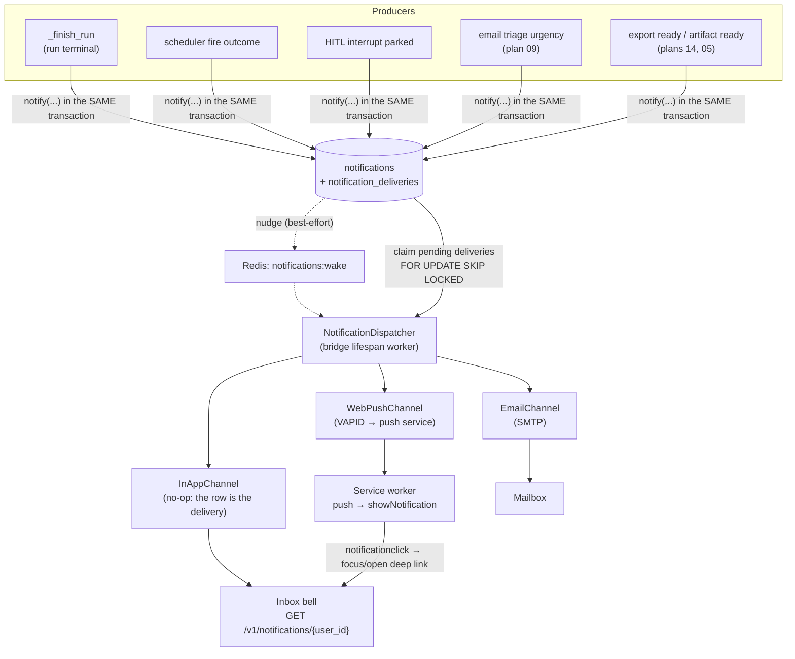
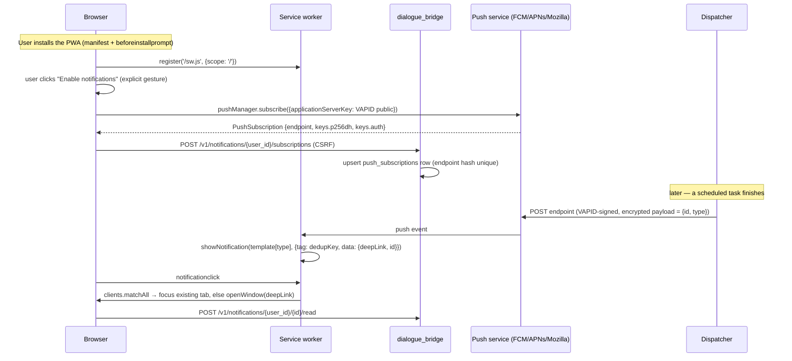

# Notification system + PWA

> **Status:** Not started
> **TODO source:** New Features → "Notification system + PWA: a unified notification service in the bridge with multiple channels — web push (installable PWA via manifest + service worker), email, and an in-app notification inbox — covering run-complete, scheduled-task results, HITL approval requests, and email-triage urgency alerts. Per-user channel preferences and quiet hours. **Scheduled Tasks (v1, shipped) surfaces results via in-app polling only today** — push/email delivery so a task can "complete while the user is offline and notify them" is the remaining gap and lands here; likewise the HITL confirmation gate is only usable async if the approval request can reach the user wherever they are."
> **Depends on:** nothing
> **Blocks:** [14 · Profile panel completion](14-profile-panel-completion.md), [09 · Email integration](09-email-integration.md); soft-blocks [06 · Deep Research mode](06-deep-research-mode.md), [08 · Workflow / automation builder](08-workflow-automation-builder.md)
> **Services touched:** dialogue_bridge · agentic_ui · infra (Swarm secrets, nginx)

Every piece of long-running work in mAgenticX today is only visible to a browser that is already looking at it. A scheduled task fires headlessly at 06:00, streams into Postgres, and finishes — and the user learns about it whenever they next open the app and a poll happens to run. A HITL approval gate parks a run mid-flight and waits for a resume signal that, by construction, can only come from a live client; a headless fire that hits one is killed by a watchdog rather than answered. This plan closes that hole by adding the one subsystem the platform has never had: a **notification service** that owns "something happened that a specific human should know about", decoupled from whether that human currently has a socket open.

The mental model is a **transactional outbox with pluggable channels**. Producers never talk to a push service or an SMTP server; they insert a `notifications` row inside the *same database transaction* that made the underlying fact durable, so a notification cannot exist for work that was rolled back and cannot be lost for work that committed. A background dispatcher in the bridge lifespan — a sibling of the existing scheduler and embedding sweeper — fans each row out to the channels that user has enabled, recording one `notification_deliveries` row per attempt. The in-app inbox is the degenerate channel (the row *is* the delivery). Web push and email are the channels that reach a closed tab, and web push is why the second half of this plan turns the SPA into an installable PWA: without a service worker there is no push receiver, and without a manifest the browser will not install the app that owns the receiver.

---

## 1. Goal & non-goals

**Goals.**

- A single bridge subsystem — table, producer helper, dispatcher, channel abstraction — that any future feature calls with one function to reach a user.
- An **in-app inbox**: a bell in the workspace shell, an unread count, a list, mark-read/mark-all-read, deep links to the thing that happened.
- **Web push** delivery via VAPID to an installable PWA, so a closed tab still surfaces a finished scheduled task.
- **Email** delivery as the fallback channel for users who never installed the PWA or denied the permission prompt.
- An **event taxonomy** with per-type defaults: run complete, scheduled-task result, HITL approval request, email-triage urgency (produced by [09](09-email-integration.md)), and a generic system/announcement type.
- **Per-user channel preferences and quiet hours**, honouring the existing full-replacement preferences contract.
- **Idempotent production**: a retried run, a re-finalized run after a restart, or a duplicated dispatcher tick must never produce two notifications for one fact.
- The PWA half: manifest, icon set, service worker, install prompt, subscription storage.

**Non-goals.**

- SMS, Slack, Teams, or webhook channels. The channel abstraction must make them cheap to add later; none ships here.
- Offline-first caching of conversations. The service worker caches the app **shell** and receives push; it does not attempt to make chat usable offline. Streaming inference is fundamentally online.
- Admin/org-wide broadcast notifications — that needs the tenancy model from [02](02-org-and-user-permissions.md).
- Notification-triggered *actions* beyond navigation (no "approve from the push notification" in v1 — the click opens the app at the interrupt card; see §12).
- Replacing the scheduled-task poll. The poll stays as the live-status mechanism while the tasks page is open; notifications are the *offline* path, not a substitute.
- A digest/summary email product. Quiet hours defer and coalesce; they do not compose an editorial digest.

---

## 2. Current state

### There is no notification anything

`core/database/models.py` declares exactly eleven tables — `agents` (L40), `users` (L65), `user_preferences` (L108), `conversations` (L140), `messages` (L195), `conversation_reports` (L300), `conversation_shares` (L317), `attachments` (L334), `blobs` (L365), `scheduled_tasks` (L376), `message_embeddings` (L457) — and none of them is a notification, inbox, delivery, or push-subscription table. There is no notification router (the seventeen routers registered in [`main.py`](../../src/dialogue_bridge/main.py) L159–246 cover auth, inference, speech, voice, catalog, agent tools, preferences, conversations, messages, attachments, shared conversations, search, skills, memories, scheduled tasks, usage, and internal memory), no notification util, and no notification schema. The bridge's `requirements.txt` contains neither an SMTP client nor a web-push library — both are net-new dependencies.

`users.email` is **nullable** ([`models.py`](../../src/dialogue_bridge/core/database/models.py) L81) and is the cross-provider account-link key, not a guaranteed contact address. A Vault-only user whose identity entity carries no `email` metadata has `NULL` here (see [authentication-and-session.md](../flows/authentication-and-session.md) § Identity linking). The email channel therefore cannot assume an address exists.

`user_preferences` ([`models.py`](../../src/dialogue_bridge/core/database/models.py) L108–137) holds eleven columns and has **no `created_at`** and no channel/quiet-hours fields. Its global `tools` JSON column was dropped by migration `0016_retire_enabled_tools` (`op.drop_column("user_preferences", "tools")`, [`0016_retire_enabled_tools.py`](../../src/dialogue_bridge/migrations/versions/0016_retire_enabled_tools.py) L43) — the lesson being that this row now models *scalar, typed, per-user settings as real columns*, so new notification preferences are new columns, not a revived JSON blob.

### Scheduled tasks: the honest gap

The scheduler is a single in-process loop. `Scheduler._loop` ([`utils/scheduled_tasks.py`](../../src/dialogue_bridge/utils/scheduled_tasks.py) L498) ticks every `SCHEDULER_POLL_INTERVAL_SECONDS` (default 30, [`core/settings.py`](../../src/dialogue_bridge/core/settings.py) L581); `_tick` (L509) reaps timed-out fires, claims due rows with `FOR UPDATE SKIP LOCKED` (`claim_due_tasks` L288, lock at L302, commit-before-fire at L318), and calls `fire_scheduled_task` (L333) per claimed id. That function builds an `InferenceStartPayload`, calls `start_inference_flow(..., scheduled_task_id=task.id)` (L409), stamps `last_run_message_id` / `last_run_status="running"` (L428–429), commits (L431), and hands off to `inference_run_manager.launch(run_id)` (L434).

**Nothing ever tells the scheduler the fire finished.** `last_run_status` stays `"running"` on the task row forever unless the watchdog fails it. The only truth is the AI message's `streaming_status`, and the UI derives task state by joining to it: `hydrate_live_status` (L254) batch-loads each task's `last_run_message_id` → that message's `streaming_status` + `conversation_id`, and `build_scheduled_task_out` (L276) injects `liveStatus` / `lastRunConversationId` onto the response of `GET /v1/scheduled-tasks/{user_id}` ([`router/scheduled_tasks.py`](../../src/dialogue_bridge/router/scheduled_tasks.py) L30, hydrate call L39).

On the client, discovery is purely a poll: [`useScheduledTasks.ts`](../../src/agentic_ui/src/features/tasks/hooks/useScheduledTasks.ts) defines `ACTIVE_POLL_MS = 8000` (L25) and `BACKGROUND_POLL_MS = 60000` (L26) and switches between them in one `setInterval` (L101). Its own comment says discovery is by poll. This is exactly what [scheduled-tasks.md § Limitations](../flows/scheduled-tasks.md) records as "**In-app poll only.** No web push / email — that is the separate Notification system TODO."

### The run terminal funnel — where a producer belongs

`_finish_run` ([`utils/inference_runs.py`](../../src/dialogue_bridge/utils/inference_runs.py) L1133) is the single durable write after start and the single place terminal state is recorded. It guards against double-finalize (L1138–1139), normalizes `cancelling → cancelled` (L1142–1146), writes the message row's `streaming_status` (L1152), content, tokens, `raw_events`, error fields and `checkpoint_id`, clears `conversation.active_assistant_message_id` (L1173–1174), and commits **once** at L1188. The four thin wrappers — `_mark_run_completed` (L1191), `_mark_run_cancelled` (L1195), `_mark_run_failed` (L1199), `mark_run_launch_failed` (L1203) — all delegate to it, and `_publish_snapshot(run_id, "terminal")` (L1019) is called immediately after each, which in turn calls `event_log.mark_terminal` (L1029).

Two paths write terminal status **without** going through `_finish_run` and are therefore blind spots a producer must handle explicitly: `cleanup_orphaned_inference_runs` (L1495, the startup sweep that bulk-`UPDATE`s stuck runs to `failed`, L1501–1511) and `_fail_stale_queued_runs_for_conversation` (L1322).

The run→task link a scheduled-task notification needs already exists: `messages.scheduled_task_id`, surfaced as `InferenceRunOut.scheduledTaskId` ([`schemas/__init__.py`](../../src/dialogue_bridge/schemas/__init__.py) L774, populated at [`inference_runs.py`](../../src/dialogue_bridge/utils/inference_runs.py) L1223).

### Redis: conventions to mirror, not a store to reuse

The per-run event log is a Redis Stream. `_stream_key` ([`utils/event_log.py`](../../src/dialogue_bridge/utils/event_log.py) L28) is `f"inference:run:{run_id}:events"`; `append` (L50) `XADD`s with `MAXLEN ~ settings.redis.stream_maxlen` (default 20000); `read_since` (L65) `XREAD BLOCK`s; `mark_terminal` (L142) applies `EXPIRE settings.redis.terminal_ttl_seconds` (default 3600, [`core/settings.py`](../../src/dialogue_bridge/core/settings.py) L511). The log is **deliberately ephemeral** — one hour after terminal it is gone — so it is a wakeup/fanout medium, never a notification store.

> **Correction to a stale reference:** `CLAUDE.md` lists the shared Redis factory as `core/redis.py`. That file does not exist. The factory is `create_redis_client()` in [`core/cache/client.py`](../../src/dialogue_bridge/core/cache/client.py) L24, re-exported from [`core/cache/__init__.py`](../../src/dialogue_bridge/core/cache/__init__.py) L16. It returns a **new pool per call** (L41) — each consumer holds its own long-lived client — with `decode_responses=True` (L28) and TLS wired only when the URL is `rediss://` (L35–40). A separate SDK-owned pool is installed by `install_redis_sdk(app)` ([`main.py`](../../src/dialogue_bridge/main.py) L145).

### HITL has no durable "waiting on a human" state

This is the sharpest constraint in the plan. When a graph parks on `__interrupt__`, the bridge recognises it entirely **in process**: `InferenceRunRuntime.pending_interrupt_ids` ([`utils/inference_runs.py`](../../src/dialogue_bridge/utils/inference_runs.py) L271, registered via `register_interrupt` L304 from the top-level `HITL_INTERRUPT` event L424–425 and its sub-agent-wrapped duplicate L420–421), plus `InferenceRunManager._resume_events` / `_resume_payloads` (L476–477, created in `launch` L484). All three are dropped by the task's done-callback (L487–494) and lost on process restart.

While parked, `messages.streaming_status` stays `"running"` — the wait branch (L818–848, logging `inference_run_awaiting_resume` at L827) never re-flips it. There is **no DB column and no Redis key** meaning "this run is waiting for a human". Consequences:

- `InferenceRunManager.request_resume` (L503) returns `False` unless `has_live_task` (L511), so `POST /v1/inference/runs/{user_id}/{run_id}/resume` ([`router/inference.py`](../../src/dialogue_bridge/router/inference.py) L225, handler L226) 409s after a bridge restart (`request_run_resume` L1482 → route 409 at L256–260).
- The observer WebSocket refuses a terminal run and closes `4404` ([`router/inference.py`](../../src/dialogue_bridge/router/inference.py) L134), so a client that was offline at completion learns nothing from the socket.
- `reap_timed_out_fires` ([`utils/scheduled_tasks.py`](../../src/dialogue_bridge/utils/scheduled_tasks.py) L437, cutoff `SCHEDULER_RUN_TIMEOUT_SECONDS` default 600 at [`settings.py`](../../src/dialogue_bridge/core/settings.py) L587) exists *purely* because a headless fire that hits an approval gate can never be answered; its docstring (L439–440) says the resume signal only ever comes from a live client. [scheduled-tasks.md § Safety properties](../flows/scheduled-tasks.md) states the guidance bluntly: "Schedule HITL-free tool sets, or expect a timeout."

So "notify me when an agent needs my approval" is not a producer hook away — it requires new durable state. See Phase 3.

### The frontend is not a PWA, at all

This is a greenfield surface, verified by absence:

| Artefact | State today |
| --- | --- |
| [`vite.config.ts`](../../src/agentic_ui/vite.config.ts) | 19 lines. `plugins: [react()]` (L11–13) — only `@vitejs/plugin-react-swc`. One alias `@ → ./src` (L14–18). No `build` block, no `proxy`. **No PWA plugin.** |
| [`index.html`](../../src/agentic_ui/index.html) | 21 lines. `charset`, `viewport`, `title`, SVG favicon (L7), PNG alternate icon (L8), description, author, three `og:` tags. **No manifest link, no `theme-color`, no `apple-touch-icon`, no `apple-mobile-web-app-*`.** |
| [`public/`](../../src/agentic_ui/public) | 17 files, all logos/screenshots plus `magenticx-favicon.svg`, `placeholder.svg`, `robots.txt`. **No manifest, no `sw.js`, no 192/512 or maskable icon set.** |
| `src/agentic_ui/src/**` | A grep for `serviceWorker`, `navigator.serviceWorker`, `PushManager`, `webmanifest`, `beforeinstallprompt`, `showNotification` returns **zero matches.** |
| [`package.json`](../../src/agentic_ui/package.json) | No `vite-plugin-pwa`, no `workbox-*`, no `web-push`, no `idb`. Vite `^6.4.2` (L110) — pins the PWA plugin to a Vite-6-compatible major. |

The nginx layer is *permissive enough* but needs two additions. [`nginx.conf.template`](../../src/agentic_ui/nginx.conf.template) serves statics from one location — `location / { try_files $uri $uri/ /index.html; }` (L212–214) over `root /usr/share/nginx/html` (L66–67) — and the Dockerfile copies Vite's `dist/` there, so **a `dist/sw.js` is servable at origin root and can legitimately claim scope `/`**. There are **no `expires` or `Cache-Control` directives anywhere in the file**, which means the service worker script itself would be served with only validator caching; a stale-SW footgun that needs an explicit block. The CSP at L45 is `default-src 'self'; script-src 'self'; style-src 'self' 'unsafe-inline'; img-src 'self' data: blob:; media-src 'self' blob: data:; font-src 'self' data:; connect-src 'self'; frame-src 'self' blob: https://view.officeapps.live.com; frame-ancestors 'none';` — it declares neither `worker-src` nor `manifest-src`, so both fall back to `script-src 'self'` / `default-src 'self'` and a same-origin SW plus a same-origin manifest are already allowed. `Permissions-Policy` (L49) gates geolocation/camera/microphone but **not** notifications or push, so no header change is needed for the permission itself. The generic API proxy is `location /api/` (L174–201) stripping the prefix to `$bff` and injecting `X-Internal-Proxy-Secret`; `/api/v1/internal/` is hard-404'd at the edge (L170–172); the inference WebSocket has its own long-timeout block (L140–162).

### Patterns the new subsystem must follow

- **Routers are bare.** Every router is `APIRouter()` with no `prefix` and no `tags`; both are supplied at `include_router` in [`main.py`](../../src/dialogue_bridge/main.py) (L159–246). Multi-word prefixes are kebab-case (`/v1/shared-conversations`, `/v1/scheduled-tasks`), so this subsystem is `/v1/notifications`. `{user_id}` is the first path segment, validated by `Depends(validate_userId)`; mutations add `Depends(require_csrf_protection)`.
- **Rate limits are named dependencies.** [`core/security/rate_limit.py`](../../src/dialogue_bridge/core/security/rate_limit.py) declares one `rate_limit(...)` per abusable route family (L88–162) with the numbers in `core/settings.py`, plus a global per-identity budget and a WebSocket connect guard (`allow_ws_connect` L165). Everything fails **open** on a Redis outage.
- **Background workers live in the lifespan.** `scheduler.start()` at [`main.py`](../../src/dialogue_bridge/main.py) L104 and `run_embedding_sweeper` at L108 (stop-event + `asyncio.wait_for` teardown at L110–115) are the two precedents a dispatcher should copy.
- **Preferences are a full-replacement `PUT`.** The client's `snapshotPrefs` ([`features/settings/handlers/preferences.ts`](../../src/agentic_ui/src/features/settings/handlers/preferences.ts) L81–92) enumerates every field explicitly and `persistPrefs` (L97–122) does optimistic-apply → PUT → adopt canonical → rollback+toast. `mapUserPreferences` ([`shared/lib/api.ts`](../../src/agentic_ui/src/shared/lib/api.ts) L457–484) **drops unknown keys**, so a new preference that is not added there is silently discarded on both read and write.

---

## 3. Target design

### Shape of the subsystem



**Why an outbox and not a fire-and-forget call.** A producer that `await`ed a push service inside `_finish_run` would put third-party network latency on the run-terminal transaction and would lose the notification entirely if the process died between the commit and the send. Writing the row inside the producer's existing transaction makes "the run finished" and "the user will be told" a single atomic fact, and every delivery attempt afterwards is retryable from durable state. The Redis nudge exists only to collapse dispatcher latency from "next poll" to "immediately"; correctness never depends on it, exactly as the scheduler's correctness never depends on Redis.

**Why deliveries are their own rows.** A notification has one *meaning* and N *fates*: in-app succeeded, push failed with a `410 Gone` (subscription expired, must be pruned), email deferred until quiet hours end. Collapsing that into status columns on `notifications` would make retry/backoff per channel impossible and would lose the audit trail. One row per `(notification_id, channel)` with `attempt_count`, `next_attempt_at`, `last_error_code` gives the dispatcher a claimable work queue and gives support a straight answer to "why didn't I get the email".

### Event taxonomy

Each type is a stable string, an owner, a default channel set, and a deep link. Defaults are what a user gets before they touch the settings tab; every row is overridable per channel by preference.

| Type | Produced when | Default channels | Deep link | Payload (structured, no content) |
| --- | --- | --- | --- | --- |
| `run.completed` | A user-initiated run reaches `completed` **and** the user was not present for it | in-app | `/c/{conversationId}` | `{runId, conversationId, agentName}` |
| `run.failed` | A run reaches `failed` (incl. `RUN_ERROR`) | in-app, push | `/c/{conversationId}` | `{runId, conversationId, agentName, errorKind}` |
| `task.result` | A scheduled fire's run reaches a terminal status | in-app, push, email | `/c/{conversationId}` (falls back to `/tasks`) | `{taskId, taskTitle, runId, conversationId, outcome}` |
| `task.failed` | A fire produced no message (agent gone, watchdog timeout, busy-skip) | in-app, push, email | `/tasks` | `{taskId, taskTitle, reason}` |
| `hitl.approval_requested` | A run parks on an interrupt and no observer resolves it within `HITL_NOTIFY_AFTER_SECONDS` | in-app, push, email | `/c/{conversationId}` | `{runId, conversationId, interruptId, toolName}` |
| `email.urgent` | [09](09-email-integration.md)'s triage marks a message urgent | in-app, push | plan-09-defined | `{messageRef, senderDomain, ruleId}` |
| `export.ready` | [14](14-profile-panel-completion.md)'s data-export job finishes | in-app, email | download link | `{exportId, expiresAt}` |
| `system.announcement` | Operator-authored (no UI in v1; insert-only) | in-app | optional | `{}` |

Two rules make the taxonomy safe to extend. First, **the type registry is server-side and fail-closed**: an unknown `type` is refused at insert, and the dispatcher refuses to deliver a row whose type it does not recognise (logged, marked `unsupported`, never retried) — the same stance as the personality-preset registry. Second, **payloads carry references, never content**: no message text, no email subject, no agent output. The push payload and the email body are assembled from the payload's identifiers plus a generic per-type template, so conversation content never leaves the platform through a third-party push service (see §9).

### Presence suppression — "don't buzz me about the thing I'm watching"

A run completing in the conversation the user is staring at must not fire a phone notification. Presence is tracked with one short-lived Redis key, `presence:user:{user_id}` (a `SETEX` refreshed by the inference WebSocket handshake, by inbox polls, and by an explicit heartbeat on tab focus), plus an optional `presence:user:{user_id}:conv` naming the conversation currently open.

```mermaid
flowchart TD
    A["notify(type, user, payload)"] --> B{"type suppressible<br/>by presence?"}
    B -->|no<br/>(task.*, hitl.*)| E["schedule all default channels now"]
    B -->|yes<br/>(run.completed)| C{"presence key live<br/>AND same conversation?"}
    C -->|yes| D["in-app row only<br/>(push/email skipped, reason=present)"]
    C -->|no| F["in-app now;<br/>push/email deferred by<br/>NOTIFY_GRACE_SECONDS"]
    F --> G{"read in-app<br/>before grace elapses?"}
    G -->|yes| H["cancel pending deliveries<br/>(status=superseded)"]
    G -->|no| E
```

The grace window (default 45 s) is what makes the behaviour feel correct rather than merely correct: a user who tabs back in and reads the result never gets a redundant push, and one who has genuinely walked away does. `task.*` and `hitl.*` are deliberately **not** presence-suppressed — a scheduled result and an approval request are the whole point of the feature, and a user with the app open in a background tab still wants them.

### Quiet hours

Quiet hours are stored as a local-time window plus an IANA timezone and apply to **push and email only** — the in-app row is always written immediately, because suppressing it would mean the inbox lies about what happened. A delivery whose computed send time falls inside the window gets `next_attempt_at` set to the window's end; multiple deferred deliveries for the same user coalesce into a single "N things happened while you were away" push at wake-up, with the individual rows still delivered by email if email is enabled. `users` has no timezone column today (only `scheduled_tasks.timezone` exists), so the timezone lives with the preference — see §4 and §12.

### The PWA half



Three deliberate choices. **`injectManifest`, not `generateSW`** — the service worker must contain our own `push` and `notificationclick` handlers, so Workbox precaching is injected into a hand-written `src/sw.ts` rather than a generated file we cannot extend. **The push payload contains only `{id, type}`** — the SW renders a generic per-type title/body from a local template map and, when the app is already open, lets the in-app inbox render the real thing; nothing user-specific is entrusted to the push service. **`prompt: false` on the permission request** — the browser permission prompt is only ever raised from an explicit click in the Notifications settings section, never on load, because a denied permission is sticky and unrecoverable without the user digging into browser settings.

---

## 4. Data model & migrations

New alembic revision **`0017_notifications`**, `down_revision = "0016_retire_enabled_tools"` (the current single head — the chain is linear and nothing revises `0016`). Purely additive: three new tables plus five new `user_preferences` columns. No destructive operation, so no user-confirmation gate is required.

### `notifications`

One row per user-visible fact. Insert-only apart from the read flags.

| Column | Type | Null | Default | Notes |
| --- | --- | --- | --- | --- |
| `id` | `String` | No | `gen_uuid()` | PK |
| `user_id` | `String` | No | — | FK → `users.id` **CASCADE**, INDEXED — notifications die with the user |
| `type` | `String` | No | — | Registry key (§3). Validated fail-closed at insert |
| `severity` | `String` | No | `'info'` | `info` \| `success` \| `warning` \| `error` — drives the inbox icon, never the channel choice |
| `title_key` | `String` | No | — | Template key, **not** rendered prose — localisation lands with [14](14-profile-panel-completion.md)'s UI-language work |
| `payload` | `JSON` | No | `{}` | Structured references only (ids, names, counts). **Never message content** |
| `deep_link` | `String` | Yes | `NULL` | Client-relative path (`/c/{id}`, `/tasks`). Validated as relative-only |
| `conversation_id` | `String` | Yes | `NULL` | FK → `conversations.id` **SET NULL**, INDEXED — so deleting a conversation orphans rather than deletes the notification |
| `scheduled_task_id` | `String` | Yes | `NULL` | FK → `scheduled_tasks.id` **SET NULL**, INDEXED — mirrors `messages.scheduled_task_id`'s SET NULL rationale |
| `run_id` | `String` | Yes | `NULL` | The assistant `messages.id`. **Plain String, not an FK** — same cycle-avoidance reasoning as `scheduled_tasks.last_run_message_id` |
| `dedup_key` | `String` | No | — | **UNIQUE per user** (`uq_notifications_user_dedup`) — the idempotency spine, §8 Phase 0 |
| `read_at` | `DateTime` | Yes | `NULL` | INDEXED (partial, `read_at IS NULL`) — the unread-count query |
| `created_at` | `DateTime` | No | `func.now()` | INDEXED (composite with `user_id`, DESC) — inbox ordering |

**Indexes.** `ix_notifications_user_created` on `(user_id, created_at DESC)` for the paginated inbox; a **partial** index `ix_notifications_unread` on `(user_id)` `WHERE read_at IS NULL` for the badge count. Autogenerate silently ignores `postgresql_where`, so the partial index must be hand-written in the migration.

### `notification_deliveries`

| Column | Type | Null | Default | Notes |
| --- | --- | --- | --- | --- |
| `id` | `String` | No | `gen_uuid()` | PK |
| `notification_id` | `String` | No | — | FK → `notifications.id` **CASCADE**, INDEXED |
| `channel` | `String` | No | — | `in_app` \| `web_push` \| `email` |
| `status` | `String` | No | `'pending'` | `pending` \| `sent` \| `failed` \| `skipped` \| `superseded` \| `unsupported` |
| `skip_reason` | `String` | Yes | `NULL` | `present` \| `channel_disabled` \| `no_address` \| `no_subscription` \| `quiet_hours_coalesced` |
| `next_attempt_at` | `DateTime` | Yes | `func.now()` | INDEXED (partial, `status='pending'`) — the dispatcher's claim target |
| `attempt_count` | `Integer` | No | `0` | Backoff exponent |
| `last_error_code` | `String` | Yes | `NULL` | Coarse, non-PII (`http_410`, `smtp_550`, `timeout`) |
| `sent_at` | `DateTime` | Yes | `NULL` | — |
| `created_at` / `updated_at` | `DateTime` | No | `func.now()` | `onupdate` on the latter |

**Unique constraint** `uq_notification_deliveries_channel` on `(notification_id, channel)` — one delivery record per channel per notification, so a dispatcher retry can never fan out twice.

### `push_subscriptions`

| Column | Type | Null | Default | Notes |
| --- | --- | --- | --- | --- |
| `id` | `String` | No | `gen_uuid()` | PK |
| `user_id` | `String` | No | — | FK → `users.id` **CASCADE**, INDEXED |
| `endpoint_hash` | `String` | No | — | SHA-256 of the endpoint URL. **UNIQUE** (`uq_push_subscriptions_endpoint_hash`) — the upsert key, so re-subscribing the same device never duplicates |
| `endpoint` | `Text` | No | — | The push-service URL. Device-identifying → PII by policy, never logged |
| `p256dh` | `String` | No | — | Client public key (payload encryption) |
| `auth` | `String` | No | — | Client auth secret |
| `user_agent` | `String` | Yes | `NULL` | Truncated, for the "your devices" list in settings |
| `session_id` | `String` | Yes | `NULL` | The JWT `sid` that registered it — lets per-device logout prune exactly this row (§7, [14](14-profile-panel-completion.md)) |
| `failure_count` | `Integer` | No | `0` | Pruned at `PUSH_MAX_CONSECUTIVE_FAILURES`, or immediately on `404`/`410` |
| `last_success_at` | `DateTime` | Yes | `NULL` | — |
| `created_at` / `updated_at` | `DateTime` | No | `func.now()` | — |

### New `user_preferences` columns

Five real columns, following the `0011`–`0015` precedent (scalar typed columns with server defaults, not a JSON blob):

| Column | Type | Default | Notes |
| --- | --- | --- | --- |
| `notify_in_app` | `Boolean` | `true` | Master switch for the inbox. `false` still writes rows (audit) but hides the bell — the dispatcher marks in-app `skipped/channel_disabled` |
| `notify_web_push` | `Boolean` | `false` | **Off by default** — enabling it is the same click that raises the browser permission prompt |
| `notify_email` | `Boolean` | `false` | Off by default; also gated on a non-`NULL` `users.email` |
| `notify_quiet_hours` | `JSON` | `{}` | `{enabled: bool, start: "22:00", end: "07:00", timezone: "Europe/Athens"}`. JSON is right here (a compound value with one meaning), unlike the retired `tools` blob (a list of independent flags) |
| `notify_type_overrides` | `JSON` | `{}` | Sparse `{[type]: {in_app, web_push, email}}` — absent key means "use the type default". Validated against the server-side registry, unknown types dropped |

Both JSON columns are validated by Pydantic at the boundary and re-validated in the dispatcher, so a hand-edited row can never widen delivery beyond the registry.

---

## 5. API surface

New router `router/notifications.py` (bare `APIRouter()`), registered in `main.py` with `prefix="/v1/notifications"`, `tags=["Notifications"]`. Every route takes `{user_id}` as its first segment with `Depends(validate_userId)`; every mutation adds `Depends(require_csrf_protection)`.

| Method | Path | Body / query | Returns | Auth + limits |
| --- | --- | --- | --- | --- |
| `GET` | `/{user_id}` | `?cursor&limit&unreadOnly` | `Page[NotificationOut]` | session + bound user; `notifications_read_rate_limit` |
| `GET` | `/{user_id}/unread-count` | — | `{count: int}` | session + bound user; cheap partial-index query, covered by the global budget |
| `POST` | `/{user_id}/{notification_id}/read` | — | `NotificationOut` | + CSRF |
| `POST` | `/{user_id}/read-all` | — | `{updated: int}` | + CSRF |
| `DELETE` | `/{user_id}/{notification_id}` | — | `204` | + CSRF |
| `GET` | `/{user_id}/push/public-key` | — | `{publicKey: str \| null}` | session; `null` when push is unconfigured so the UI hides the control |
| `POST` | `/{user_id}/subscriptions` | `PushSubscriptionIn` | `PushSubscriptionOut` | + CSRF; `push_subscribe_rate_limit` |
| `DELETE` | `/{user_id}/subscriptions/{subscription_id}` | — | `204` | + CSRF |
| `GET` | `/{user_id}/subscriptions` | — | `PushSubscriptionOut[]` (never returns `endpoint`/keys) | session + bound user |

Channel preferences ride the **existing** `PUT /v1/preferences/{user_id}` full-replacement contract rather than a parallel endpoint — that keeps one write path, one optimistic-rollback helper, and one IndexedDB snapshot. `POST /{user_id}/test` (send-myself-a-test) is deliberately omitted from v1; it is a spam vector and the settings UI can prove the path with the real subscription round-trip.

**Schemas** (all in [`schemas/__init__.py`](../../src/dialogue_bridge/schemas/__init__.py)):

```python
class NotificationOut(BaseModel):
    id: str
    type: str                # registry-validated
    severity: Literal["info", "success", "warning", "error"]
    titleKey: str
    payload: dict[str, Any]  # references only
    deepLink: str | None     # relative path, validated
    conversationId: str | None
    scheduledTaskId: str | None
    runId: str | None
    readAt: datetime | None
    createdAt: datetime

class PushSubscriptionIn(BaseModel):
    endpoint: HttpUrl        # https only; host allow-list checked server-side
    keys: PushKeysIn         # {p256dh, auth} — base64url, length-bounded
    userAgent: str | None = Field(None, max_length=200)
```

`deepLink` is validated as **relative-only** on both write and read (`must start with "/" and contain no "//" or scheme`) so a notification can never be turned into an open-redirect. `endpoint` is validated as `https` with a host against `PUSH_ALLOWED_ENDPOINT_HOSTS` (default: the real push-service domains) so the bridge cannot be coerced into an SSRF probe of the internal network by a forged subscription.

**Rate limits** added to [`core/security/rate_limit.py`](../../src/dialogue_bridge/core/security/rate_limit.py) in the established shape (numbers in `core/settings.py`): `notifications_read_rate_limit` (per user, generous — the inbox polls), `push_subscribe_rate_limit` (per user, tight — storage growth), and a dispatcher-side per-user **daily notification cap** enforced at insert (`NOTIFY_MAX_PER_USER_PER_DAY`) so a runaway producer degrades to dropped-and-logged rather than a mail-bomb.

**Internal producer surface.** Producers call a util, not HTTP: `utils/notifications/produce.py::notify(db, *, user_id, type, payload, dedup_key, ...)` takes the caller's `AsyncSession` and only *stages* the rows — the caller's existing `commit()` makes them durable. No new `/v1/internal` route is needed; nothing outside the bridge produces notifications in v1 (when [09](09-email-integration.md) needs it from the agents service, it goes through `/v1/internal/*`, which nginx already 404s at the edge).

---

## 6. Frontend surface

A new feature folder, because notifications are a user-facing capability with their own components, hooks and handlers:

```text
src/agentic_ui/src/
  features/notifications/
    components/
      NotificationBell.tsx        ← shell trigger: icon + unread badge
      NotificationInbox.tsx       ← popover/sheet list, grouped by day
      notification_parts/
        NotificationRow.tsx       ← icon + title + relative time + read dot
        NotificationEmptyState.tsx
    hooks/
      useNotifications.ts         ← list + unread count, cadence-switching poll
      usePushSubscription.ts      ← permission state machine + subscribe/unsubscribe
      useInstallPrompt.ts         ← beforeinstallprompt capture + install CTA
    handlers/
      notifications.ts            ← markRead / markAllRead / dismiss (optimistic)
  shared/lib/
    api.ts                        ← listNotifications, getUnreadCount, markNotificationRead,
                                    markAllNotificationsRead, dismissNotification,
                                    getPushPublicKey, registerPushSubscription,
                                    deletePushSubscription, listPushSubscriptions
    schemas.ts                    ← NotificationSchema, PushSubscriptionSchema (Zod)
    types.ts                      ← Notification, PushSubscriptionSummary,
                                    NotificationChannelPrefs, QuietHours
    consts.ts                     ← NOTIFICATION_TYPE_META (icon + title template per type)
  sw.ts                           ← the service worker (push, notificationclick, precache)
```

**Contract layer.** Unlike preferences (which is hand-rolled through `mapUserPreferences`), notifications are new and get **Zod schemas in `shared/lib/schemas.ts`** consumed via `http.ts`'s `schema:` option — matching the newer `getUsageSummary` pattern rather than the older hand-coercion one. Types are inferred from the schemas in `shared/lib/types.ts`.

**Preference plumbing — the four places that must change together.** A new preference silently vanishes unless all four are edited in the same commit: `defaultPreferences` ([`preferences.ts`](../../src/agentic_ui/src/features/settings/handlers/preferences.ts) L54–68), `snapshotPrefs` (L81–92, the full-replacement enumeration), `mapUserPreferences` ([`api.ts`](../../src/agentic_ui/src/shared/lib/api.ts) L457–484, which drops unknown keys), and the `UserPreferences` type ([`types.ts`](../../src/agentic_ui/src/shared/lib/types.ts) L196–206). New handlers — `handleToggleNotifyChannel`, `handleSaveQuietHours`, `handleSetTypeOverride` — go through the same `persistPrefs` optimistic/rollback helper (L97–122).

**Shell integration.** The bell lives in the sidebar header next to the existing **Tasks** entry (which already carries a running badge), rendered from [`pages/ChatPage.tsx`](../../src/agentic_ui/src/pages/ChatPage.tsx). Polling mirrors `useScheduledTasks`' cadence-switching precedent: fast while the inbox is open, slow otherwise, and **paused entirely while `document.hidden`** (a refinement on the existing hook, which polls regardless of visibility). Once push works for an installed PWA, the poll is a fallback rather than the primary path.

**Snapshot policy.** Notifications are **not** persisted into the IndexedDB `UISnapshotSerializable` — same decision as scheduled tasks, and for the same reason: stale unread badges are worse than a 100 ms empty state, and it avoids a snapshot `version` bump entirely.

**PWA wiring.**

- `vite-plugin-pwa` in **`injectManifest`** mode, `srcDir: 'src'`, `filename: 'sw.ts'`, `registerType: 'prompt'` — an update shows an "a new version is available, reload" toast (sonner is already mounted in [`App.tsx`](../../src/agentic_ui/src/App.tsx)) rather than swapping the app under a live inference stream.
- `public/manifest.webmanifest`: `name`, `short_name: "mAgenticX"`, `start_url: "/"`, `scope: "/"`, `display: "standalone"`, `background_color`/`theme_color` from the theme tokens, and an icon set that does not exist yet — **192×192, 512×512, and a `maskable` 512×512 must be produced** (today `public/` has only logos and a 304-byte SVG favicon).
- `index.html`: manifest link, `theme-color` (with a `prefers-color-scheme` pair so the installed title bar matches light/dark), `apple-touch-icon`, `apple-mobile-web-app-capable`, `apple-mobile-web-app-status-bar-style`.
- `nginx.conf.template`: a new `location = /sw.js` block adding `Cache-Control: no-cache` and `Service-Worker-Allowed: /`, plus `location = /manifest.webmanifest` with a short `max-age`. This is a required change, not a nicety — the file has **no cache headers at all** today, and a proxy-cached service worker pins users to a dead build.
- No CSP change is required (§2 verified `worker-src`/`manifest-src` fall back to `'self'`), but the CSP comment block gains a line saying so, so the next reader does not have to re-derive it.

---

## 7. Cross-cutting impact

This is the plan with the widest downstream surface, because it introduces a *capability other plans consume* rather than a feature that stands alone.

| Consumer | What it takes from here | What it must not assume |
| --- | --- | --- |
| [14 · Profile panel completion](14-profile-panel-completion.md) | The whole **Notifications** settings section — the `STUB_SECTIONS.notifications` entry ([`ProfilePanel.tsx`](../../src/agentic_ui/src/features/settings/components/ProfilePanel.tsx) L111–117) is deleted and a real `NotificationsTab` takes its place, driven by the five new preference columns. Also `export.ready` for the Export-data row, and per-device push-subscription pruning for "log out of all devices". | That the tab can be built before the preference columns land. Phase 1 here is 14's hard gate. |
| [09 · Email integration](09-email-integration.md) | The `email.urgent` event type, and the **SMTP credential + sender identity** this plan establishes. 09's confidence-gated send confirmation is a HITL gate, so it also consumes `hitl.approval_requested`. | That its OAuth mailbox tokens and this plan's outbound SMTP are the same credential. They are separate: this sends *platform* mail, 09 sends *as the user*. |
| [06 · Deep Research mode](06-deep-research-mode.md) | A long research run is the archetypal "finishes while you are away" workload; `run.completed` covers it, and its plan-first HITL checkpoint needs `hitl.approval_requested` to be answerable asynchronously. | That budget/steering controls are notification-driven. Soft dependency — 06 works without this, just worse. |
| [08 · Workflow / automation builder](08-workflow-automation-builder.md) | "…and notify me with the summary" is literally a node in the TODO's example chain. The `notify()` util is the action implementation. | That n8n should deliver the notification itself. Routing user-facing notifications through the in-platform subsystem keeps preferences and quiet hours in one place. |
| [02 · Org + user permissions](02-org-and-user-permissions.md) | Nothing today; later, org-scoped and admin-broadcast notifications. | That `notifications.user_id` is the final scoping tier. When orgs land, an `org_id` column and an authorization check on the inbox are additive but mandatory. |
| [03 · Projects / Workspaces](03-projects-and-workspaces.md) | Workspace-scoped filtering of the inbox. | That `conversation_id` is enough context. A `workspace_id` column is the natural additive follow-up. |
| [05 · Artifacts / Canvas](05-artifacts-canvas.md) | An `artifact.ready` type for long generations. | — |
| [16 · Context & usage UI](16-context-usage-ui.md) | Nothing. Listed only because a "budget exceeded" notification is an obvious later addition. | — |

**Cross-cutting concerns from the [index](README.md#cross-cutting-concerns):**

- **Ownership & scoping.** Every row is keyed by `user_id` with `CASCADE`, and every read endpoint is bound with `require_bound_user_id`. The subsystem adds no new ownership tier, but it is the first table whose *rows are generated by the system rather than the user*, which makes the authorization check on read the only thing standing between users' work notifications — so it is enforced in the util, not just the router.
- **DB migrations.** One additive revision, `0017_notifications`, on top of head `0016_retire_enabled_tools`. Two partial indexes must be hand-written (autogenerate ignores `postgresql_where`).
- **Agent tool surface.** Untouched. Agents do not produce notifications directly in v1; a future `notify_user` tool would have to go through the native registry *and* an authorization check that it can only notify the run's owner.
- **AG-UI event protocol.** Untouched — notifications are out-of-band and deliberately not a new AG-UI event. The HITL work in Phase 3 reads existing `HITL_INTERRUPT` events; it adds no new event type.
- **Filesystem layout.** Untouched.
- **Secrets.** Two new Swarm secrets: `magenticx_vapid_private_key` (`/run/secrets/vapid_private_key` → `VAPID_PRIVATE_KEY_FILE`) and `magenticx_smtp_password` (`/run/secrets/smtp_password` → `SMTP_PASSWORD_FILE`), both resolved through the existing `_resolve_file_backed_secret` helper in `core/settings.py` with env fallback for local dev. The VAPID **public** key is not a secret and is served to the client. [`docs/architecture/secrets.md`](../architecture/secrets.md) and the `CLAUDE.md` secrets table both gain rows.
- **Trust boundary.** No new service, no new network. The one new outbound egress is to public push services and an SMTP relay — the bridge currently egresses only to OpenAI, Vault, the agents service and (optionally) Microsoft. This must be reflected in the Dennis egress notes.
- **Docs.** A new `docs/flows/notifications.md` (the authoritative flow doc once this ships), plus edits to [scheduled-tasks.md](../flows/scheduled-tasks.md) (delete "In-app poll only" from Limitations), [inference-streaming.md](../flows/inference-streaming.md) (the producer hook in `_finish_run`; durable HITL state), [user-preferences.md](../flows/user-preferences.md) (five new columns), [database-schema.md](../architecture/database-schema.md) (three tables), [configuration.md](../architecture/configuration.md) and [secrets.md](../architecture/secrets.md), and the `CLAUDE.md` documentation-update table.

---

## 8. Phased execution

Each phase is independently deployable and leaves the product in a coherent state. Phases 0–2 are the ones other plans wait on.

### Phase 0 — Schema, contracts, and the type registry (no behaviour)

Add the three tables to `core/database/models.py`, author `0017_notifications` (hand-writing both partial indexes), add the five `user_preferences` columns, add `NotificationSettings` to `core/settings.py` (dispatcher interval, grace window, per-user daily cap, retention days — all feature-flagged **off**), create `utils/notifications/` with `registry.py` (the type table as data), `produce.py::notify()` (stages rows only), and the Pydantic schemas. Nothing calls `notify()` yet.

**Acceptance:** `alembic upgrade head` applies cleanly on a populated local DB and `alembic check` is clean; `notify()` unit-tested for dedup-key collision behaviour (second insert with the same `(user_id, dedup_key)` is a silent no-op, not an error); an unknown `type` raises at insert; a `deep_link` with a scheme or `//` is rejected.

### Phase 1 — In-app inbox end-to-end + the Notifications settings section

Ship `router/notifications.py` (read/mark/dismiss + preference plumbing), the `NotificationDispatcher` lifespan worker handling **only** the `in_app` channel (claim `pending` deliveries with `FOR UPDATE SKIP LOCKED`, mirroring `claim_due_tasks`), and the frontend: bell + inbox + `useNotifications` + handlers + Zod contracts. Replace `STUB_SECTIONS.notifications` with a real `NotificationsTab` exposing the in-app master switch, per-type overrides, and the quiet-hours editor (the push/email switches render disabled with "not configured yet" until Phases 5–6). Seed the inbox with `system.announcement` only, so the surface is testable without any producer.

**Acceptance:** an operator-inserted announcement appears in the bell within one dispatcher tick; unread count matches; mark-all-read is one `UPDATE`; the settings section persists through the full-replacement `PUT` and rolls back on a forced failure; keyboard navigation and `aria-label`s pass a Tab-key pass; the bell has a visible focus ring and the badge is not colour-only.

### Phase 2 — Run-complete and scheduled-task producers (closes the stated gap)

Call `notify()` from inside `_finish_run` before its single `commit()` at [`inference_runs.py`](../../src/dialogue_bridge/utils/inference_runs.py) L1188 — one insertion point covers all four `_mark_run_*` wrappers. Branch on `run.scheduled_task_id`: present → `task.result`, absent → `run.completed`/`run.failed`. Add the presence key (`SETEX` from the WS handshake and inbox polls) and the grace-window/supersede logic. Handle the two funnel bypasses explicitly: `cleanup_orphaned_inference_runs` (L1495) emits `task.failed`/`run.failed` for the runs it sweeps, and `_fail_stale_queued_runs_for_conversation` (L1322) deliberately emits nothing (a never-launched placeholder is not a user-visible event). Also produce `task.failed` from `_mark_fire_error` ([`scheduled_tasks.py`](../../src/dialogue_bridge/utils/scheduled_tasks.py) L461) and the watchdog (L437) so a fire that produces no message still notifies.

**Acceptance:** a scheduled fire completing with no browser open leaves exactly one `task.result` row and one `in_app` delivery; restarting the bridge mid-run produces exactly one `run.failed` (not zero, not two); a run completing in the conversation the user is watching produces an in-app row with push/email `skipped/present`; killing the process between the run commit and the dispatcher tick still delivers on restart.

### Phase 3 — Durable HITL state + approval-request notifications

The hard phase, and the reason the TODO calls the confirmation gate "only usable async" today. Persist the parked-interrupt identity so it survives the process: add `messages.pending_interrupt` (JSON, nullable) written when `register_interrupt` fires and cleared on resolution, and flip `streaming_status` to a new `awaiting_approval` value while parked. That single change has three consequences that must land together:

1. `awaiting_approval` must be added to `ACTIVE_RUN_STATUSES` ([`inference_runs.py`](../../src/dialogue_bridge/utils/inference_runs.py) L48) so the one-active-stream partial unique index and the busy-skip guard keep behaving.
2. The observer WebSocket must stop treating a parked run as unsubscribable ([`router/inference.py`](../../src/dialogue_bridge/router/inference.py) L134) — a user arriving from a notification an hour later needs to see the interrupt card, which today is impossible once the Redis stream has expired.
3. `request_resume`'s `has_live_task` requirement (L511) must gain a **cold-resume** path: with the interrupt durable in Postgres and the checkpoint durable in the agents service's `AsyncPostgresSaver`, a resume can relaunch the run task and call `/agents/{slug}/resume` without the original in-process task. Without this, the notification is a link to a 409.

Then produce `hitl.approval_requested` after `HITL_NOTIFY_AFTER_SECONDS` of no resolution, and relax `reap_timed_out_fires` for scheduled fires parked on an interrupt (a much longer approval timeout, since the whole point is that a human can now answer).

**Acceptance:** a run parked on an interrupt, followed by a bridge restart, followed by a click on the notification, resumes successfully; the interrupt card renders from durable state with no Redis stream present; a scheduled fire that parks is no longer killed at 600 s; a duplicate approval click still 409s on `interrupt_id` mismatch as today.

### Phase 4 — PWA installability (no push yet)

Add `vite-plugin-pwa` in `injectManifest` mode with a `src/sw.ts` that precaches the shell and does nothing else; produce the 192/512/maskable icon set; add the manifest, the `index.html` head tags, the `location = /sw.js` and `location = /manifest.webmanifest` nginx blocks; add `useInstallPrompt` and a discreet install CTA in the Notifications settings section. Ship a `registerType: 'prompt'` update toast.

**Acceptance:** Lighthouse installability passes; the app installs on Chrome/Edge desktop and Android and on iOS via Add-to-Home-Screen; a hard-refresh after a rebuild picks up the new build (proving the `no-cache` header); an update mid-inference shows the toast and does **not** reload; the CSP is unchanged and no console CSP violation appears.

### Phase 5 — Web push channel

Add `pywebpush` (or an equivalent VAPID sender), the two VAPID Swarm secrets, `push_subscriptions` write/read endpoints, `usePushSubscription`'s permission state machine (explicit-gesture only), and the `WebPushChannel` in the dispatcher with exponential backoff, `404`/`410` immediate pruning, and payload minimisation (`{id, type}` only). Wire `notificationclick` to focus an existing client or open the deep link.

**Acceptance:** a scheduled task completing with the browser closed raises an OS notification on an installed PWA; clicking it focuses an existing tab rather than opening a duplicate; revoking the browser permission causes the next send to prune the subscription rather than retry forever; the push payload provably contains no conversation content; per-device logout removes that device's subscription.

### Phase 6 — Email channel + quiet hours

Add an async SMTP client and the `magenticx_smtp_password` secret; implement `EmailChannel` with a plain-text-first template per type that carries **a link, not content**; enforce the `users.email IS NULL → skipped/no_address` path; implement quiet-hours deferral and the wake-up coalescing push. Make `notify_email` unavailable in the UI when the account has no email.

**Acceptance:** a `task.result` for a user with email enabled arrives with no conversation content in the body; a notification produced inside quiet hours is delivered at the window's end, and three of them coalesce into one push plus three emails; SMTP unavailable → `failed` with a coarse `last_error_code`, retried with backoff, never a crash; an email-less account never produces an email delivery attempt.

### Phase 7 — Hardening, retention, and observability

Per-user daily cap enforcement; a retention reaper deleting read notifications older than `NOTIFY_RETENTION_DAYS` and unread ones older than a longer ceiling (this table grows monotonically otherwise); structured log events for every dispatcher decision with hashed user ids per the existing redaction contract; metrics for produced/delivered/failed/skipped per channel; documentation.

**Acceptance:** a synthetic 10 000-notification user still loads the inbox in one page; the reaper is idempotent and bounded per tick; no log line contains an endpoint URL, an email address, or notification content; `docs/flows/notifications.md` exists and every doc listed in §11 is updated.

---

## 9. Security & privacy

**Threat model.** The new attack surface is (a) an inbox that leaks one user's work to another, (b) a push/email pipeline that exfiltrates conversation content to third parties, (c) a subscription endpoint that turns the bridge into an SSRF probe or a spam relay, and (d) a service worker that becomes a persistent XSS foothold.

| Risk | Control |
| --- | --- |
| Cross-user inbox read | `require_bound_user_id` on every route **and** a `user_id` filter inside every util query — authorization is not delegated to the router alone. Ownership is re-checked on mark-read/dismiss by id. |
| Content exfiltration via push | Push payloads carry `{id, type}` only; titles/bodies are rendered from local templates in the service worker. `notifications.payload` is contractually references-only, enforced by the type registry's payload schema. |
| Content exfiltration via email | Same rule: templates plus a deep link. Email bodies never include message text, agent output, or attachment names. Documented as a hard invariant, not a default. |
| SSRF via a forged subscription | `endpoint` must be `https` with a host in `PUSH_ALLOWED_ENDPOINT_HOSTS`; private/loopback/link-local addresses rejected. The dispatcher's sender has an explicit timeout and no redirect following. |
| Spam / mail-bomb | Per-user daily cap at insert; per-route rate limits on subscribe and read; `dedup_key` uniqueness; exponential backoff with a hard attempt ceiling. |
| Subscription-store abuse (storage growth) | `endpoint_hash` uniqueness makes re-subscription an upsert; a per-user subscription cap; automatic pruning on `404`/`410` and on `PUSH_MAX_CONSECUTIVE_FAILURES`. |
| PII in logs | `endpoint`, `p256dh`, `auth`, `users.email`, and all notification payloads are never logged. Log `notification_id`, `type`, `channel`, `status`, coarse error code, and the **hashed** user id via the existing `LOG_REDACTION_SECRET`-keyed redaction so it correlates across services. |
| Open redirect via `deep_link` | Relative-only validation on write **and** on read, plus client-side routing through the router rather than `window.location.assign`. |
| Service worker as an XSS foothold | Same-origin only, no `eval`, no remote script import, no user-controlled string reaching `showNotification` (templates only). `Service-Worker-Allowed: /` is set explicitly rather than relying on default scope inference. `Cache-Control: no-cache` on `/sw.js` bounds how long a compromised or broken SW can persist. |
| CSRF | Every mutation depends on `require_csrf_protection`, unchanged from the rest of the API. |
| Secret handling | VAPID private key and SMTP password are file-backed `SecretStr` from Swarm secrets; never in compose env, never logged, and the channel **refuses to initialise** (fail-closed, `unsupported`) rather than attempting an unauthenticated send when the secret is absent. |

**Fail-closed defaults, stated explicitly.** Push and email default **off** per user. Both channels default off *globally* until their secret is present. An unknown notification type is refused at insert and never delivered. Quiet hours, when malformed, are treated as *enabled with a conservative window* rather than ignored. The one deliberate fail-**open** is the presence key: if Redis is down, presence lookups fail to "not present", which means the user gets a notification they might not have needed — the safe direction.

---

## 10. Testing strategy

- **Producer idempotency (unit + integration, real DB).** Insert the same `(user_id, dedup_key)` twice; assert one row. Force a `_finish_run` retry path and assert one notification. Kill the process between commit and dispatch and assert delivery after restart. Never mock the database — a `dedup_key` unique constraint only proves itself against real Postgres.
- **Dispatcher claim safety.** Two concurrent dispatcher instances against one DB must never double-send: assert `FOR UPDATE SKIP LOCKED` semantics the same way the scheduler's single-fire test does.
- **Channel contract tests.** A fake channel that records calls proves ordering, backoff, and status transitions without network. The real `WebPushChannel` is tested against a local HTTP stub asserting a VAPID `Authorization` header, an encrypted body, and correct `410` pruning.
- **Payload-minimisation assertion.** A test that walks every registry type, produces a notification with a content-bearing payload attempt, and asserts the rendered push/email body contains none of it. This is the invariant most likely to erode silently.
- **Presence/grace behaviour.** Table-driven: present-same-conversation, present-other-conversation, absent, read-within-grace, read-after-grace.
- **HITL cold resume (Phase 3).** Park a run, restart the app object, resume via the endpoint, assert the agents service receives `/resume` with the right `thread_id` and `interrupt_id` and the run reaches terminal. This is the phase's whole risk.
- **Quiet hours.** DST-boundary and cross-midnight windows, plus an invalid timezone falling back conservatively.
- **Frontend.** `useNotifications` cadence/visibility behaviour; optimistic mark-read rollback on a forced 500; `usePushSubscription` state machine across granted/denied/unsupported; the settings section round-tripping through the full-replacement `PUT` without wiping an unrelated preference (the exact `snapshotPrefs` regression class).
- **Service worker.** A build-output assertion that `dist/sw.js` exists at root and contains the push handler; a manual matrix (Chrome desktop, Edge, Android Chrome, installed iOS PWA, Firefox) recorded in the flow doc, since SW/push behaviour cannot be meaningfully unit-tested.
- **Host-vs-container caveat.** The bridge test suite runs against the container's pinned dependency set; run it in-image rather than on the host.

---

## 11. Docs to update

| Doc | Change |
| --- | --- |
| `docs/flows/notifications.md` | **New** — the authoritative flow doc (taxonomy, outbox, dispatcher, channels, presence, quiet hours, PWA/SW, sharp edges, file map). Add it to the tree and table in [README.md](README.md) and to `CLAUDE.md`'s documentation-update table. |
| [docs/flows/scheduled-tasks.md](../flows/scheduled-tasks.md) | Delete "**In-app poll only.** No web push / email" from § Limitations; document the `task.result`/`task.failed` producers and the relaxed HITL watchdog. |
| [docs/flows/inference-streaming.md](../flows/inference-streaming.md) | The `_finish_run` producer hook; the new `awaiting_approval` status and `messages.pending_interrupt`; the cold-resume path; the WS route's changed treatment of parked runs. |
| [docs/flows/user-preferences.md](../flows/user-preferences.md) | Five new columns, their defaults, and the fact that channel prefs ride the existing full-replacement `PUT`. |
| [docs/architecture/database-schema.md](../architecture/database-schema.md) | Three new tables with full column/index/cascade reference; the two partial indexes; the new `user_preferences` rows. |
| [docs/architecture/configuration.md](../architecture/configuration.md) | Every new `NOTIFY_*`, `PUSH_*`, `SMTP_*`, `VAPID_*` env var. |
| [docs/architecture/secrets.md](../architecture/secrets.md) | `magenticx_vapid_private_key`, `magenticx_smtp_password` — in-container paths and consumers. Mirror into `CLAUDE.md`'s Swarm-secrets table. |
| [docs/architecture/overview.md](../architecture/overview.md) | New outbound egress (push services, SMTP relay); the nginx `/sw.js` and manifest locations. |
| [docs/development/observability.md](../development/observability.md) | Dispatcher log events and metrics; the PII-never-logged list gains push endpoints and email addresses. |
| [docs/development/frontend-architecture.md](../development/frontend-architecture.md) | The new `features/notifications/` folder and the `src/sw.ts` exception to the `features/`-only rule. |

---

## 12. Risks & open decisions

**Open decisions.**

1. **Where durable HITL state lives.** A JSON column on `messages` (`pending_interrupt`) keeps the run's whole state on one row and matches how `streaming_*` already works; a separate `run_interrupts` table models multi-interrupt runs more honestly and is queryable ("show me everything awaiting my approval"). The column is proposed because Phase 3 needs the smallest change that unblocks cold resume, but the table is the better long-term shape and the choice should be made deliberately before Phase 3 starts.
2. **Adding `awaiting_approval` to the status vocabulary.** It is the correct model, but `streaming_status` is read in many places (the partial unique index, the busy-skip guard, `hydrate_live_status`, the client's terminal detection). The alternative — leave the status `running` and infer "parked" from `pending_interrupt IS NOT NULL` — is less invasive but leaves the status column lying. Decide before Phase 3.
3. **Quiet-hours timezone source.** There is no `users.timezone` column; `scheduled_tasks.timezone` is the only precedent. Storing the tz inside `notify_quiet_hours` (proposed) is self-contained but duplicates a value that a future `users.timezone` would own, and [17](done/17-voice-language-dynamic.md)-style per-conversation settings suggest the platform is drifting toward finer-grained locale state. A `users.timezone` column may be the better home.
4. **SMTP direct vs a transactional-email provider.** Direct SMTP keeps the credential model simple and adds no vendor, but deliverability (SPF/DKIM/DMARC on `magenticx.com`, bounce handling) is real work that a provider does for us. This also interacts with [09](09-email-integration.md) and with [15](15-dennis-open-source-services.md) if a self-hosted relay lands on Dennis.
5. **"Improve the model" / data-sharing interaction.** [14](14-profile-panel-completion.md) proposes a data-sharing opt-in. Notification payloads are references-only, so they are not affected, but the decision on what that toggle actually gates should be made once, in 14, not twice.
6. **Approve-from-notification.** Action buttons in a push notification would make the HITL gate genuinely mobile, but they require either an authenticated `fetch` from the service worker (the session cookie is `HttpOnly` and same-origin, so this is technically feasible) or a signed one-time approval token. Deferred, deliberately: approving a tool call from a notification with no view of the agent's reasoning is a bad default.

**Risks.**

- **The dispatcher inherits the single-replica assumption.** The scheduler and `InferenceRunManager` already assume one bridge replica ([scheduled-tasks.md § Limitations](../flows/scheduled-tasks.md)). The `SKIP LOCKED` claim makes the dispatcher multi-replica-*safe*, but it is only exercised single-replica; the ~30 s overlap of a `start-first` deploy is the real test, and it is the same window the scheduler already survives.
- **The notifications table grows forever** unless Phase 7's reaper actually ships. Deferring retention is how this becomes the biggest table in the database.
- **iOS is the weakest link.** Web push on iOS requires an installed (Add-to-Home-Screen) PWA and a user gesture, and Safari's implementation has historically been the one that breaks. Email exists partly as the honest fallback for that population.
- **A broken service worker is stickier than a broken bundle.** The `no-cache` header and `registerType: 'prompt'` bound the damage, but an SW bug can persist across reloads in a way no previous frontend change could. Phase 4's acceptance criteria must include an explicit "recover from a bad SW" drill.
- **Presence heuristics will be wrong sometimes.** A user with the app open on a second monitor, a phone in a pocket with a stale presence key — both produce a notification that feels slightly off. The grace window and the "in-app is never suppressed" rule keep the failure mode mild (a redundant buzz, never a missed result).
- **`users.email` being nullable means the email channel silently does nothing** for some accounts. Surfacing that in the settings UI ("add an email to your identity to enable this") is required, or it reads as a bug.
- **Notification fatigue is a product risk, not a technical one.** Defaults matter more than mechanism: `run.completed` presence-suppressed and `run.failed` push-enabled is a deliberate opinion, and it should be revisited with real usage rather than treated as settled.

---

## 13. File map

| Concept | File | What to look for |
| --- | --- | --- |
| Tables | [src/dialogue_bridge/core/database/models.py](../../src/dialogue_bridge/core/database/models.py) | New `NotificationTable`, `NotificationDeliveryTable`, `PushSubscriptionTable`; five new columns on `UserPreferencesTable` (L108) |
| Migration | `src/dialogue_bridge/migrations/versions/0017_notifications.py` | `down_revision = "0016_retire_enabled_tools"`; hand-written partial indexes |
| Type registry | `src/dialogue_bridge/utils/notifications/registry.py` | Type → default channels, severity, payload schema, deep-link builder |
| Producer helper | `src/dialogue_bridge/utils/notifications/produce.py` | `notify()` — stages rows in the caller's session, dedup-key no-op |
| Dispatcher | `src/dialogue_bridge/utils/notifications/dispatcher.py` | Claim loop (`FOR UPDATE SKIP LOCKED`), backoff, presence/grace, quiet hours |
| Channels | `src/dialogue_bridge/utils/notifications/channels/{in_app,web_push,email}.py` | `NotificationChannel` ABC; fail-closed init when a secret is absent |
| Endpoints | `src/dialogue_bridge/router/notifications.py` | Inbox, mark-read, subscriptions, VAPID public key |
| Router registration | [src/dialogue_bridge/main.py](../../src/dialogue_bridge/main.py) | `include_router(..., prefix="/v1/notifications", tags=["Notifications"])` near L246; dispatcher start/stop in the lifespan beside `scheduler.start()` (L104) |
| Schemas | [src/dialogue_bridge/schemas/\_\_init\_\_.py](../../src/dialogue_bridge/schemas/__init__.py) | `NotificationOut`, `PushSubscriptionIn/Out`, `QuietHours`, extended `UserPreferences` |
| Settings | [src/dialogue_bridge/core/settings.py](../../src/dialogue_bridge/core/settings.py) | `NotificationSettings`, `PushSettings`, `SmtpSettings`; file-backed secrets beside the existing `_resolve_file_backed_secret` users |
| Rate limits | [src/dialogue_bridge/core/security/rate_limit.py](../../src/dialogue_bridge/core/security/rate_limit.py) | New `notifications_read_rate_limit`, `push_subscribe_rate_limit` beside L88–162 |
| Run-terminal producer | [src/dialogue_bridge/utils/inference_runs.py](../../src/dialogue_bridge/utils/inference_runs.py) | `_finish_run()` L1133 — `notify()` before the single `commit()` at L1188; bypasses at L1322 and L1495 |
| Durable HITL state | [src/dialogue_bridge/utils/inference_runs.py](../../src/dialogue_bridge/utils/inference_runs.py) | `pending_interrupt_ids` L271, `register_interrupt` L304, wait branch L818–848, `request_resume` L503 (`has_live_task` L511) |
| Cold-resume route | [src/dialogue_bridge/router/inference.py](../../src/dialogue_bridge/router/inference.py) | resume route L225; the terminal-run refusal at L134 that must change |
| Scheduled-task producers | [src/dialogue_bridge/utils/scheduled_tasks.py](../../src/dialogue_bridge/utils/scheduled_tasks.py) | `fire_scheduled_task` L333, `reap_timed_out_fires` L437, `_mark_fire_error` L461, `hydrate_live_status` L254 |
| Redis client factory | [src/dialogue_bridge/core/cache/client.py](../../src/dialogue_bridge/core/cache/client.py) | `create_redis_client()` L24 — the presence key and the wake nudge use this, **not** a `core/redis.py` |
| Redis conventions | [src/dialogue_bridge/utils/event_log.py](../../src/dialogue_bridge/utils/event_log.py) | `_stream_key` L28, `append` L50, `mark_terminal` L142 — the key-naming and TTL pattern to mirror |
| Inbox UI | `src/agentic_ui/src/features/notifications/components/NotificationBell.tsx`, `NotificationInbox.tsx` | Badge, day grouping, empty state, focus management |
| Inbox hooks | `src/agentic_ui/src/features/notifications/hooks/useNotifications.ts` | Cadence-switching + visibility-paused poll (cf. [useScheduledTasks.ts](../../src/agentic_ui/src/features/tasks/hooks/useScheduledTasks.ts) L25–26, L101) |
| Push subscription hook | `src/agentic_ui/src/features/notifications/hooks/usePushSubscription.ts` | Permission state machine; explicit-gesture-only `subscribe()` |
| Service worker | `src/agentic_ui/src/sw.ts` | `push` → template render → `showNotification`; `notificationclick` → `clients.matchAll` focus-or-open |
| PWA build config | [src/agentic_ui/vite.config.ts](../../src/agentic_ui/vite.config.ts) | Add `VitePWA({ strategies: 'injectManifest', srcDir: 'src', filename: 'sw.ts', registerType: 'prompt' })` to the 19-line config |
| Manifest + head tags | `src/agentic_ui/public/manifest.webmanifest`, [src/agentic_ui/index.html](../../src/agentic_ui/index.html) | Icon set (192/512/maskable — none exist today), `theme-color`, `apple-touch-icon` |
| nginx SW/manifest serving | [src/agentic_ui/nginx.conf.template](../../src/agentic_ui/nginx.conf.template) | New `location = /sw.js` (`Cache-Control: no-cache`, `Service-Worker-Allowed: /`); CSP at L45 needs no change; sole static location L212–214 |
| API + contracts | [src/agentic_ui/src/shared/lib/api.ts](../../src/agentic_ui/src/shared/lib/api.ts), [schemas.ts](../../src/agentic_ui/src/shared/lib/schemas.ts), [types.ts](../../src/agentic_ui/src/shared/lib/types.ts) | New calls with `schema:`; `mapUserPreferences` L457–484 must learn the new preference keys or they are dropped |
| Preference plumbing | [src/agentic_ui/src/features/settings/handlers/preferences.ts](../../src/agentic_ui/src/features/settings/handlers/preferences.ts) | `defaultPreferences` L54–68, `snapshotPrefs` L81–92, `persistPrefs` L97–122 |
| Settings section (hand-off to plan 14) | [src/agentic_ui/src/features/settings/components/ProfilePanel.tsx](../../src/agentic_ui/src/features/settings/components/ProfilePanel.tsx) | `STUB_SECTIONS.notifications` L111–117 and the `ComingSoon` render at L455–462 — both deleted in Phase 1 |
