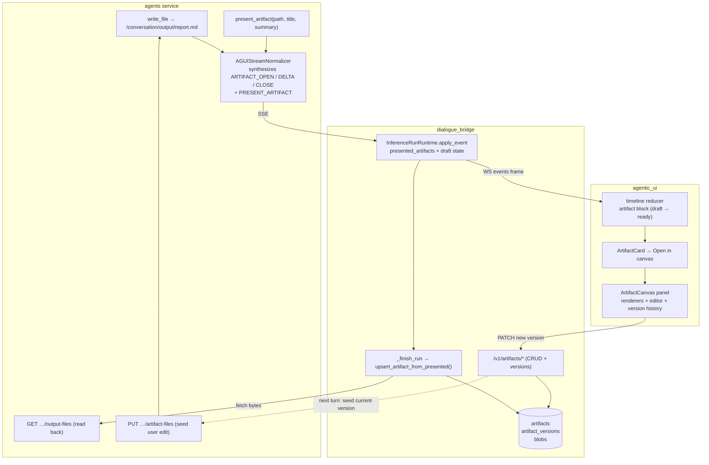

# Artifacts / Canvas

> **Status:** Not started
> **TODO source:** New Features → "Artifacts / Canvas: add an editable side workspace for generated reports, markdown docs, code, tables, diagrams, JSON configs, and other reusable outputs."
> **Depends on:** [03-projects-and-workspaces.md](03-projects-and-workspaces.md) *(soft — artifacts work conversation-scoped without it; workspaces give them a durable home)*
> **Blocks:** [06-deep-research-mode.md](06-deep-research-mode.md) *(soft — the research report is an artifact)*
> **Services touched:** agents · dialogue_bridge · agentic_ui

Today a deep-agent deliverable is a **one-way handoff**. The agent writes a file into `/conversation/output/`, calls `present_artifact` to designate it as finished, and the bridge reads the bytes back at run finalize and freezes them into an `attachments(origin='generated')` row — a download link and nothing more. The user can look at it, but the moment they want to change a heading, fix a number, or hand the corrected version back to the agent, the only route is to describe the change in prose and hope the agent regenerates the whole document. Everything the platform knows about that file dies at the byte boundary of a blob.

This plan promotes that frozen deliverable into a **first-class, versioned, editable artifact** with a side-panel canvas next to the conversation. The mental model is a two-writer document with an append-only history: the agent writes versions through its filesystem, the user writes versions through the canvas editor, every write is a new row (never an overwrite — the same discipline the message tree already follows), and the current version is seeded back into the agent's `output/` mount before the next turn so the agent's `read_file` sees the user's edits rather than its own stale draft. `present_artifact` stays exactly what it is — the agent's single intentional act of promotion — but instead of terminating in a blob it now *creates or advances* an artifact row, and the artifact card in the timeline becomes the door into the canvas.

---

## 1. Goal & non-goals

**Goals.** Give every agent-produced document a durable identity that survives the run that made it: a versioned artifact row scoped to its conversation (and, once [03](03-projects-and-workspaces.md) lands, promotable to a workspace). Ship a resizable right-hand canvas that renders markdown, code, JSON, tabular data, and mermaid diagrams with a real editor behind them. Define editing semantics precisely enough that a user edit and an agent edit can never silently clobber each other — optimistic concurrency with an explicit conflict surface, not last-write-wins. Close the loop so a user edit reaches the agent's filesystem, and open the artifact earlier in the run so the user watches the document fill in rather than waiting for finalize. Keep export/download working through the existing attachment pipeline so nothing regresses.

**Non-goals.** Real-time multi-user co-editing (no CRDT, no OT, no presence cursors) — the only concurrent writers in v1 are the agent and one user, possibly in two browser tabs, which optimistic concurrency handles. Rich-text WYSIWYG — the canvas edits *source* (markdown, code, JSON) and previews the rendered form; a Google-Docs-style contenteditable surface is a separate project. Artifact-to-artifact linking, comments, or suggestion mode. Replacing `AttachmentTable(origin='generated')` — that row stays as the message-anchored record of "this run produced this deliverable" and gains a pointer to the artifact. Object storage — blobs stay in PostgreSQL per the standing architecture constraint; this plan does not introduce S3/MinIO.

---

## 2. Current state

### The agent side: one tool, one designation, no identity

`present_artifact` is a native tool built per run and bound to a single conversation. Its whole job is validation and confirmation: [`build_present_artifact_tool()`](../../src/agents/runtime/tools/present_artifact.py) (`present_artifact.py:50`) closes over `user_id` / `agent_slug` / `conversation_id`, resolves the caller-supplied virtual path through `resolve_output_file()` (`present_artifact.py:63-70`), checks `resolved.is_file()`, logs `artifact_presented`, and returns a sentence telling the model not to paste the document into chat (`present_artifact.py:79-89`). It emits nothing and it stores nothing — there is no artifact identity anywhere in the system at this point, only a path string.

It is registered in the native-tool registry with `auto_attach=True` and a gate of "a conversation exists" — [`registry.py:117-132`](../../src/agents/runtime/tools/registry.py). Per [tool-harness.md § Phase 4](../development/tool-harness.md), `present_artifact` is deliberately **always on and never user-disable-able**: `toggle_agent_tool` ignores native keys and `_apply_tool_disables` subtracts them, so even a legacy disable entry is neutralised. Attach order is `remember → search_past_conversations → present_artifact` (registry insertion order, `registry.py:84-132`).

The AG-UI event is **synthesized by the normalizer, not emitted by the tool**. In [`normalizer.py:386-418`](../../src/agents/runtime/agui/normalizer.py) the updates-mode tool-call switch matches `tc_name == "present_artifact"`, and only when `namespace is None` — a sub-agent's present call is dropped on the floor, because the orchestrator is expected to re-present the final document. It reads `path` / `title` / `summary` out of the tool-call **args**, derives `filename` by splitting the path, guesses `mime` with `mimetypes.guess_type`, and calls `emitter.present_artifact(...)` (`emitter.py:340`). The `tool_call_id` then goes into `_ignored_tool_call_ids`, so the raw `ToolMessage` never reaches the wire — the card *is* the UI. The payload model is [`PresentArtifactEvent`](../../src/agents/runtime/agui/events.py) (`events.py:112-129`): `artifact_id` (which is just the tool-call id), `path`, `filename`, `title`, `summary`, `mime`, and a `status` literal frozen at `"ready"`.

Files live under the per-(user, agent, conversation) tree documented in [`provisioner.py:1-56`](../../src/agents/runtime/filesystem/provisioner.py) — `<filesystem_root>/<user_id>/agents/<agent_slug>/<conversation_id>/`, mounted as `/conversation/` with `input/` and `output/` inside. The read-back endpoint is `GET /agents/{slug}/users/{user_id}/conversations/{conversation_id}/output-files` ([`router/inference.py:372-403`](../../src/agents/router/inference.py)), internal-only, path-guarded, returning `{files, missing}` so a partially-reaped run still captures what it can. Size and count ceilings come from settings: `output_max_file_bytes` 26 214 400 (25 MiB) and `output_max_files` 20 (`core/settings.py:475-476`).

**`output/` is a TTL cache, not storage.** [`retention.py`](../../src/agents/runtime/filesystem/retention.py) sweeps `input/` at 72 h and `output/` at 168 h (`core/settings.py:502-503`), explicitly because "both directories hold *copies* of DB-owned data" (`retention.py:1-9`). The sweeper is symlink-refusing, containment-checked, budget-bounded, and skips any conversation with writes inside `_ACTIVITY_GRACE_SECONDS` (30 min) so a live run is never reaped mid-write.

### The bridge side: capture, then freeze into a blob

`InferenceRunRuntime` keeps a `presented_artifacts` list (`utils/inference_runs.py:287`), fed by `_register_presented_artifact()` (`:312-332`) which dedupes **by path, last write wins**, storing only `{artifact_id, path, title, summary}`. The dispatch is one branch in `apply_event` (`:428-432`) and it deliberately lets the event flow on into `raw_events` so the card survives reconnection — unlike `CHECKPOINT_COMMITTED`, which returns `None` and is suppressed from the log (`:435-446`).

At finalize, `_finish_run` calls `_capture_generated_artifacts()` **only when `status_value == "completed"`** (`:1185-1186`). That helper (`:1062-1130`) fetches every presented path in one internal call, `base64.b64decode(..., validate=True)`s each payload, and adds an `AttachmentTable(origin="generated", title=…, summary=…, blob=BlobTable(data=raw))` per file to the same transaction as the finalize write. It is **fail-open by contract** (`:1075-1078`): a fetch error is logged and skipped rather than failing an otherwise-successful run.

The schema is [`AttachmentTable`](../../src/dialogue_bridge/core/database/models.py) (`models.py:334-362`) with `origin` defaulting to `"upload"` (`:350`) plus nullable `title`/`summary` populated for generated files only, and a 1:1 `BlobTable` holding `LargeBinary` (`:365-373`). There is **no artifact table, no version column, and no write path from the browser back to any of it.** Alembic head is `0016_retire_enabled_tools`.

### The UI side: a card, and only a card

The event is Zod-validated by `PresentArtifactPayloadSchema` (`features/inference/agui.ts:134-148`) and folded by `pushArtifactBlock()` (`features/inference/timeline.ts:209-246`), dispatched from the CUSTOM switch at `timeline.ts:705-710`. The fold interleaves the card at its log position with the same discipline as a sub-agent panel: `closeThinking()` then `fold.openContentIndex = null`, so later orchestrator text starts a fresh content block *below* the card and the sequence reads "text → file → text" (`timeline.ts:227-233`). A malformed event with no derivable filename is skipped (`:226`).

`ArtifactBlock` is a member of the `TimelineBlock` union (`shared/lib/types.ts:559-570`) carrying display metadata only, and `BLOCK_REGISTRY` maps `artifact` to `<ArtifactCard>` (`message_parts/block-registry.tsx:45-52`). Because the registry is `Record<TimelineBlock["kind"], …>`, adding a block kind is a compile error until it is handled — the property this plan leans on later.

[`ArtifactCard.tsx:21-46`](../../src/agentic_ui/src/features/chat/components/message_parts/ArtifactCard.tsx) reconciles the block to the message's generated attachment **by filename** (`a.origin === "generated" && a.name === block.filename`), shows a `Preparing…` spinner until `attachment.blobId` exists, and otherwise exposes exactly two actions: preview and download. `origin` / `title` / `summary` survive the client transform only because they are explicitly whitelisted in `transformAttachment` (`shared/lib/consts.ts:202-216`) — the comment there records that omitting them made the card double-render and hang on "Preparing".

Rendering primitives that already exist and should be reused rather than rebuilt: `Response` wraps **Streamdown** with a configured `mermaidConfig`, so markdown *and* mermaid already render in chat (`shared/ui/ai-elements/response.tsx:1-52`); `shared/ui/ai-elements/code-block.tsx` handles code; `papaparse` and `exceljs` are dependencies (`package.json`) used by the attachment previewers; `docx-preview` handles Word. `react-resizable-panels@2.1.3` is a dependency but is **currently imported nowhere** — there is no `shared/ui/resizable.tsx`. Post-run side surfaces today are `Sheet`-based: `PlanSidePanel` / `SubagentsSidePanel` in [`RunSidePanels.tsx`](../../src/agentic_ui/src/features/chat/components/message_parts/RunSidePanels.tsx), opened from two action-bar buttons (`ActionBars.tsx:445,477`). The workspace shell is `pages/ChatPage.tsx` (1765 lines — a tracked transitional item per [frontend-architecture.md](../development/frontend-architecture.md)) with `pages/ChatView.tsx` as the presentation surface. The IndexedDB UI snapshot is at `version: 4` (`shared/lib/uiStateStorage.ts:35,86,257`).

**What is therefore missing:** identity, versions, a write path, an editor, a renderer set, a route back into the agent's filesystem, and any notion of an artifact outliving its conversation.

---

## 3. Target design

An artifact is a **named, versioned document owned by a user**, anchored to the conversation that created it and (later) promotable to a workspace. `present_artifact` stops being terminal: when the bridge captures a `PRESENT_ARTIFACT` event at finalize it now performs an **upsert keyed by `(conversation_id, filename)`** — first sighting creates the artifact and version 1; a re-present of the same filename appends version *n+1* authored by `agent`. The `AttachmentTable(origin='generated')` row is still written (nothing regresses, share snapshots and the existing download path keep working) but it gains an `artifact_id` FK so the timeline card can open the canvas.

Text-shaped artifacts (markdown, code, JSON, CSV, mermaid, plain text) store their content in a `Text` column on the version row — they are diffable, editable, and small. Binary artifacts (docx, xlsx, pdf, images) keep a `BlobTable` pointer and are **read-only in the canvas**: the panel previews them via the existing previewers and the editor is disabled, because round-tripping a Word document through a textarea destroys it. The `kind` discriminator is derived server-side from MIME + extension, never trusted from the agent.



### Editing semantics — the core of the plan

Versions are **append-only and single-parent**. Every version row records `version` (monotonic int per artifact), `author` (`agent` | `user`), `base_version` (what the writer had loaded), and `content_hash`. A write is accepted only when `base_version == artifact.current_version`; otherwise the bridge returns **409 with the newer version's metadata** and the canvas surfaces a conflict banner offering "keep mine" (retry against the new base, producing a new version on top) or "take theirs" (discard the local buffer). There is no merge and no last-write-wins: an unconditional overwrite is exactly the failure mode that loses a user's paragraph to an agent's regeneration.

The two writers are asymmetric in an important way. A **user edit** is a direct `PATCH` — CSRF-protected, ownership-checked, rate-limited. An **agent edit** is a side effect of a run: the agent rewrites `output/report.md` and re-presents it, and the upsert runs at finalize with `base_version` set to whatever version was seeded into its `output/` at run start. If the user edited the artifact *while the run was streaming*, the agent's base is stale and the finalize upsert hits the same 409 rule — but a run cannot be asked to retry, so the agent's version is committed as a **fork-marked version** (`base_version < current_version`) and the canvas shows a two-way "your edit / the agent's edit" chooser rather than silently dropping either. This is the one case where the system genuinely cannot decide, so it asks.

`base_version` is what makes the loop closed. Before each run, for every artifact attached to the conversation, the bridge writes the current version's bytes into `/conversation/output/<filename>` via a new internal `PUT …/artifact-files` endpoint — the exact mirror of the existing `seed_input_files` mechanism the attachments flow already uses. `output/` is agent-**writable** (only `/conversation/input/` is write-denied by `WORKSPACE_WRITE_DENY`), so this is a legal write and the agent's `read_file('/conversation/output/report.md')` returns the user's text. A short system note is appended to the turn's context ("the user edited *Q3 Report* since your last turn; the file on disk is their version"), because a file changing under an agent without explanation is a reliable way to make a model re-generate from scratch.

### Streaming an artifact as it is written

The honest constraint: the normalizer emits tool-call **args from the `updates` channel only** (`normalizer.py:420-429`), where LangGraph hands over the whole argument dict at once. Token-level argument streaming would require plumbing `tool_call_chunks` from the `messages` channel, which `_handle_messages_payload` does not do today. So "streaming" here means **reveal-on-write, not reveal-on-token**: when the normalizer sees a `write_file` / `edit_file` call whose path resolves under `/conversation/output/`, it emits `ARTIFACT_OPEN` (path, filename, derived kind) followed by `ARTIFACT_DELTA` carrying that write's content, and `ARTIFACT_CLOSE` on the tool result. A multi-step document (write, then three `edit_file` passes) therefore fills in visibly across the run instead of appearing whole at finalize. The timeline's artifact block gains a `draft` status; `PRESENT_ARTIFACT` flips it to `ready` and is still the only thing that creates a persisted artifact row. Files the agent writes but never presents stay scratch and never leave the timeline — the existing invariant is preserved.

### Scoping: conversation now, workspace later

v1 artifacts are conversation-scoped, with a nullable `workspace_id` column present from the first migration so [03](03-projects-and-workspaces.md) does not need a second schema change. The behavioural difference matters: a conversation-scoped artifact is deleted with its conversation (FK cascade) and its `output/` copy is reaped by the existing sweeper; a workspace-scoped artifact outlives every conversation in the workspace and needs the workspace's own retention story. Keeping the column nullable and unused in v1 means the cascade is unambiguous today and the promotion path is one `UPDATE` later.

---

## 4. Data model & migrations

Alembic slot: **`0017_artifacts`**, `down_revision = "0016_retire_enabled_tools"`. Two new tables plus one nullable FK on `attachments`. Models go in [`core/database/models.py`](../../src/dialogue_bridge/core/database/models.py).

### `artifacts`

| Column | Type | Notes |
| --- | --- | --- |
| `id` | String PK | `gen_uuid` |
| `user_id` | String FK → `users.id` ON DELETE CASCADE | indexed; the ownership anchor every authz check reads |
| `conversation_id` | String FK → `conversations.id` ON DELETE CASCADE | indexed; nullable only for the future workspace-promoted case |
| `workspace_id` | String, nullable | **reserved slot** for [03](03-projects-and-workspaces.md); no FK yet, no reads in v1 |
| `origin_message_id` | String FK → `messages.id` ON DELETE SET NULL | the run that first presented it; SET NULL so message pruning never deletes an artifact |
| `agent_id` | String FK → `agents.id` ON DELETE SET NULL | provenance; mirrors `messages.agent_id` |
| `filename` | String | the `output/` basename — the upsert key and the seed-back target |
| `title` | String | agent-supplied, capped at 120 (same ceiling as `_MAX_TITLE`) |
| `summary` | String, nullable | agent-supplied, capped at 300 |
| `kind` | String | server-derived: `markdown` `code` `json` `csv` `mermaid` `text` `binary` |
| `mime` | String | |
| `language` | String, nullable | for `kind='code'` — syntax highlighting hint |
| `current_version` | Integer, not null, default 1 | denormalised head pointer; the optimistic-concurrency comparand |
| `is_deleted` | Boolean, not null, default false | soft delete so a version history is never orphaned mid-flight |
| `created_at` / `updated_at` | DateTime | |

Indexes: `(user_id, conversation_id)` for the panel's list query, `(conversation_id, filename)` **unique where `is_deleted = false`** (a partial index — remember [README § migration blind spots](README.md): autogenerate silently drops `postgresql_where`, so this one is hand-written), and `(user_id, updated_at DESC)` for a future "recent artifacts" view.

### `artifact_versions`

| Column | Type | Notes |
| --- | --- | --- |
| `id` | String PK | |
| `artifact_id` | String FK → `artifacts.id` ON DELETE CASCADE | indexed |
| `version` | Integer, not null | monotonic per artifact |
| `author` | String, not null | `agent` \| `user` |
| `base_version` | Integer, nullable | what the writer had loaded; `< current_version` marks a fork |
| `content_text` | Text, nullable | populated for every non-binary `kind` |
| `blob_id` | String FK → `blobs.id` ON DELETE SET NULL | populated for `kind='binary'` only |
| `size_bytes` | Integer | |
| `content_hash` | String | sha256 of the stored bytes — makes a no-op save cheap to reject |
| `created_by_message_id` | String FK → `messages.id` ON DELETE SET NULL | which run wrote it; NULL for user edits |
| `created_at` | DateTime | |

Unique index `(artifact_id, version)`. Index `(artifact_id, created_at DESC)` for the history list.

### `attachments.artifact_id`

One nullable `String FK → artifacts.id ON DELETE SET NULL`, indexed. Populated for `origin='generated'` rows so the timeline card can jump straight to the canvas without a filename round-trip. SET NULL (not CASCADE) because deleting an artifact must never delete the historical message attachment — the message tree is append-only and its attachments are part of the record.

**Data backfill.** Existing `attachments(origin='generated')` rows predate artifacts. The migration backfills them into artifacts in the same transaction (per the README's atomic-per-deploy rule): one artifact + one `artifact_versions` row at `version=1, author='agent'` per generated attachment, `content_text` populated when the MIME is text-shaped and `blob_id` reused otherwise, then `UPDATE attachments SET artifact_id = …`. Blobs are **not copied** — the version row points at the existing blob. Nothing is dropped, so this migration is non-destructive and needs no user confirmation.

**Quota.** Text versions live in a `Text` column and each user edit appends a row, so an artifact edited 200 times holds 200 copies. A `MAX_VERSIONS_PER_ARTIFACT` ceiling (default 100) prunes the **oldest non-agent-authored** versions beyond it, never version 1 and never the current head, and a per-user total-artifact-bytes cap feeds the Storage tab stub tracked in [14-profile-panel-completion.md](14-profile-panel-completion.md).

---

## 5. API surface

New router: `src/dialogue_bridge/router/artifacts.py`, registered in `main.py`. Business logic and every query in `src/dialogue_bridge/utils/artifacts.py`; request/response models in `schemas/__init__.py`. Every route takes the `validate_userId` dependency (the ownership pattern the attachments router already uses), every mutation takes CSRF, and all of them are paginated or single-row — no unbounded selects.

| Method | Path | Purpose | Notes |
| --- | --- | --- | --- |
| `GET` | `/v1/artifacts/{userId}` | List the user's artifacts | paginated; `conversationId` / `kind` filters; **never** returns `content_text` |
| `GET` | `/v1/artifacts/{userId}/{artifactId}` | Artifact metadata + current version content | text kinds inline; `kind='binary'` returns metadata + `blobId` only |
| `GET` | `/v1/artifacts/{userId}/{artifactId}/versions` | Version history | paginated metadata only — no bodies |
| `GET` | `/v1/artifacts/{userId}/{artifactId}/versions/{version}` | One version's content | for the history viewer / diff |
| `PATCH` | `/v1/artifacts/{userId}/{artifactId}` | **User edit → new version** | body `{content, baseVersion, title?, summary?}`; CSRF; `409` on stale `baseVersion`; `304`-equivalent no-op when `content_hash` is unchanged |
| `POST` | `/v1/artifacts/{userId}/{artifactId}/restore` | Restore an old version as a new head | body `{version, baseVersion}`; CSRF — a restore is a forward write, never a history rewrite |
| `GET` | `/v1/artifacts/{userId}/{artifactId}/download` | Export the current (or `?version=`) content | `StreamingResponse`, chunked, `Content-Disposition: attachment`; reuses the attachment streaming helper |
| `DELETE` | `/v1/artifacts/{userId}/{artifactId}` | Soft delete | CSRF; sets `is_deleted`, leaves the generated attachment intact |

Schemas: `ArtifactOut`, `ArtifactVersionOut`, `ArtifactListOut`, `ArtifactUpdateIn`, `ArtifactRestoreIn`, `ArtifactConflictOut` (the 409 body — carries `currentVersion`, `author`, `updatedAt` so the canvas can describe the conflict without a second fetch). `ArtifactUpdateIn.content` is length-capped at the same 25 MiB ceiling as `output_max_file_bytes`, with a much lower practical default for text (1 MiB) since a 25 MiB markdown file is a bug, not a document.

Rate limits follow [`core/security/rate_limit.py`](../../src/dialogue_bridge/core/security/rate_limit.py): the global per-identity budget covers reads; `PATCH` / `restore` / `DELETE` get a strict per-user route limit (an editor autosaving on every keystroke is the obvious accidental-DoS path, so the client debounces *and* the server caps).

**Agents service.** One new internal endpoint mirroring the existing input-files seeder, in `router/inference.py` with `Depends(require_internal_caller)`:

`PUT /agents/{agent_slug}/users/{user_id}/conversations/{conversation_id}/artifact-files` — body `{files: [{path, base64}]}`, writing under `conversation_output_root()` through a new `seed_output_files()` in `provisioner.py` that reuses `resolve_output_file()`'s path guard verbatim and enforces `output_max_files` / `output_max_file_bytes`. The bridge calls it from `_run` before streaming, exactly where `seed_input_files` is called today (see [attachments.md § the seed step](../flows/attachments.md)).

---

## 6. Frontend surface

New feature folder `src/agentic_ui/src/features/artifacts/`, per the feature-first rule ([frontend-architecture.md](../development/frontend-architecture.md)) — nothing here is shared until a second feature consumes it.

```text
features/artifacts/
  components/
    ArtifactCanvas.tsx            ← the panel shell: header, actions, tab strip
    ArtifactEditor.tsx            ← source editing surface + dirty/saving state
    ArtifactVersionHistory.tsx    ← version list + restore + conflict chooser
    canvas_parts/
      MarkdownView.tsx            ← <Response> (Streamdown) — reuses chat rendering
      CodeView.tsx                ← shared/ui/ai-elements/code-block.tsx
      JsonView.tsx                ← parse → collapsible tree; invalid JSON falls back to CodeView
      TableView.tsx               ← papaparse for CSV/TSV, exceljs for xlsx (both existing deps)
      MermaidView.tsx             ← <Response> fenced ```mermaid — Streamdown renders it natively
      BinaryView.tsx              ← delegates to the existing attachment previewers (read-only)
  hooks/
    useArtifact.ts                ← fetch + local buffer + debounced save + 409 handling
    useArtifactCanvas.ts          ← open/close/active-artifact panel state
  index.ts                        ← barrel
```

**Panel mechanics.** The canvas is a **resizable right-hand region of the workspace shell**, not a `Sheet` — the user edits while reading the conversation, so a modal overlay is the wrong affordance (this is the one place the plan diverges from the existing `PlanSidePanel` / `SubagentsSidePanel` pattern, which are read-only replays). `react-resizable-panels@2.1.3` is already a dependency and currently unused, so Phase 1 adds `shared/ui/resizable.tsx` via `npx shadcn@latest add resizable` (it lands in `shared/ui/` — `components.json` aliases are already repointed) and `ChatPage.tsx` wraps its body region in a `PanelGroup`. On mobile (`useIsMobile`) the canvas becomes a full-screen `Sheet` instead, because a 40 % split pane on a phone is unusable.

**Entry points.** `ArtifactCard` gains a third action, "Open in canvas", and the whole card becomes the canvas trigger when the artifact is text-shaped (download stays as the explicit secondary action). The message action bar gains an artifacts button beside the existing plan / sub-agents buttons (`ActionBars.tsx:445,477`) when the run produced any artifact. A conversation-level list lives in the canvas header's artifact switcher.

**Types and API.** `Artifact`, `ArtifactVersion`, `ArtifactKind`, and `ArtifactBlock`'s new `status: "draft" | "ready"` go in `shared/lib/types.ts`; wire contracts in `shared/lib/schemas.ts` (transform-style, so required keys stay required — the documented `.catch` pitfall). Calls go in `shared/lib/api.ts` over `requestJson` / `requestVoid` / `requestBlob`; no component fetches.

**Motion and a11y**, per the repo's Frontend Engineering Standards: the panel enters with a `transform: translateX` + `opacity` Framer Motion transition at 250–300 ms `ease-out`, exits at ~65 % of that, and is fully skipped under `useReducedMotion()` — the panel width is driven by the panel-group's flex basis, never an animated `width`. Semantic tokens only. Every icon-only button (`Open in canvas`, `Save`, `Restore`, `Close`) carries an `aria-label`; the editor has a visible `<label>`; `Escape` closes the panel and returns focus to the trigger; the dirty-buffer close path asks for confirmation because closing with unsaved text is destructive.

**Snapshot version.** If which artifact is open is persisted to IndexedDB, `UISnapshotSerializable.version` must go `4 → 5` with a discard branch for v4 (`shared/lib/uiStateStorage.ts:35,86,257`). The safer default — and the recommendation — is to **not** persist canvas state at all, so no bump is needed.

---

## 7. Cross-cutting impact

**AG-UI protocol → normalizer → timeline reducer → persistence.** Three new custom events (`ARTIFACT_OPEN`, `ARTIFACT_DELTA`, `ARTIFACT_CLOSE`) plus a `status` field on the existing `PRESENT_ARTIFACT` payload. Each one needs, in lockstep: a constant + Pydantic model in `runtime/agui/events.py`, an emitter method in `emitter.py`, a synthesis site in `normalizer.py`'s updates-mode tool-call switch (a `write_file`/`edit_file` path-prefix check, alongside the existing `write_todos` / `task` / `present_artifact` special cases), a Zod schema in `features/inference/agui.ts` added to `CustomAguiEventSchema`, and a reducer branch in `timeline.ts`'s CUSTOM dispatch. Per the run-timeline decision record, **bridge and UI frame-protocol changes ship together** — an event the reducer doesn't know is silently ignored, which fails soft, but a `status` field the reducer expects and the agent doesn't send renders a permanently-draft card.

**Bridge log keeping.** `apply_event` (`utils/inference_runs.py:390-459`) appends every event to `raw_events` by default (`_append_raw` at `:459` runs unconditionally except for the explicit `CHECKPOINT_COMMITTED` `return None`), so the three new events persist with no bridge branch at all. Two things *do* need attention: `ARTIFACT_DELTA` must be added to the coalescing rules in `_coalesce_key` (consecutive deltas for the same path should merge like text deltas, or a 40-write document balloons the log), and the deltas must be **excluded from share snapshots** if the shared render doesn't mount the canvas — otherwise a share link ships document drafts it never displays. Only `PRESENT_ARTIFACT` gains real logic: `_capture_generated_artifacts` becomes `_capture_and_upsert_artifacts`, which still writes the generated attachment and additionally upserts the artifact + version.

**Filesystem layout.** The new `PUT …/artifact-files` writes into `conversation_output_root()`, which the retention sweeper reaps at 168 h. That is correct and intentional — after this plan `output/` remains a cache and the DB is the source of truth, exactly the invariant `retention.py:1-9` documents. But the seed-before-run step is now **load-bearing**, not an optimisation: an artifact whose `output/` copy was reaped and which is *not* re-seeded would make the agent's `read_file` fail mid-turn. Seeding must therefore run for every conversation artifact on every run, not only when the file is missing.

**Other plans.** [03-projects-and-workspaces.md](03-projects-and-workspaces.md) fills the reserved `workspace_id` and owns workspace-scoped retention. [06-deep-research-mode.md](06-deep-research-mode.md) consumes this as its report surface — its output templates become artifact kinds, and its budget/HITL knobs are orthogonal. [13-charts-and-agui-widgets.md](done/13-charts-and-agui-widgets.md) overlaps deliberately: a chart spec is a JSON artifact, so a `kind='chart'` artifact whose canvas renderer is the chart component is the natural convergence, and both plans must agree on who owns the JSON schema. [02-org-and-user-permissions.md](02-org-and-user-permissions.md) will need artifact-level authorization once artifacts can be shared beyond their owner. [14-profile-panel-completion.md](14-profile-panel-completion.md)'s Storage tab reads the per-user artifact byte total this plan introduces.

**Docs.** A new `docs/flows/artifacts-canvas.md` (house style per [`_template.md`](../_template.md)) plus updates to `docs/development/agui-protocol.md` (three events + the reducer branch), `docs/flows/attachments.md` (the `artifact_id` link and the new seed endpoint), `docs/architecture/database-schema.md` (two tables), `docs/development/tool-harness.md` (`present_artifact` now creates a row), and the doc table in `CLAUDE.md`.

---

## 8. Phased execution

### Phase 0 — Artifact rows behind the existing card

Add the two tables, the `attachments.artifact_id` FK, the `0017_artifacts` migration with its backfill, `utils/artifacts.py`, and the upsert inside the finalize path. No UI change and no new events: the card renders exactly as it does today, but every presented deliverable now has an artifact identity and a version 1.

*Acceptance:* a run that presents a file creates one `artifacts` row and one `artifact_versions` row; re-presenting the same filename in a later turn creates version 2 with `author='agent'` and leaves version 1 intact; the migration backfills every pre-existing generated attachment with no blob duplication; `alembic upgrade head` then `alembic check` is clean; existing download and preview behaviour is byte-identical.

### Phase 1 — Read-only canvas

`shared/ui/resizable.tsx`, the `PanelGroup` in the shell, the `features/artifacts/` folder, the `GET` endpoints, and the six renderers. "Open in canvas" on the card and the action bar. No editing.

*Acceptance:* every artifact kind renders correctly in both light and dark mode; the panel resizes, closes on `Escape`, and returns focus to its trigger; a mobile viewport gets the full-screen sheet; a binary artifact shows its previewer with the editor absent (not disabled-looking); an artifact whose blob is missing shows a helpful empty state, not a crash; the panel is inside an error boundary so a bad renderer cannot take down the chat.

### Phase 2 — Editing, versioning, conflict

`ArtifactEditor`, `PATCH` / `restore` / `DELETE`, `useArtifact`'s debounced save, the 409 conflict banner and chooser, and `ArtifactVersionHistory`.

*Acceptance:* an edit creates version *n+1* with `author='user'` and `base_version=n`; a `PATCH` with a stale `baseVersion` returns 409 with the current metadata and the UI offers keep-mine / take-theirs without losing the local buffer; an identical-content save is rejected as a no-op rather than creating a duplicate version; restore creates a new head instead of rewriting history; closing with unsaved changes prompts; the version ceiling prunes the oldest user versions and never version 1 or the head; a `PATCH` for another user's artifact returns 404 (not 403 — do not confirm existence).

### Phase 3 — The loop back to the agent

`seed_output_files()` + `PUT …/artifact-files` on the agents service, the bridge's pre-stream seeding of every conversation artifact, the "user edited X" context note, and the fork-marked-version path for a user edit that races a live run.

*Acceptance:* after a user edit, the next run's `read_file` on that path returns the user's text; the agent's finalize upsert against a stale base commits a fork-marked version and the canvas shows the two-way chooser instead of dropping either side; a reaped `output/` directory is fully re-seeded before the run streams; the seed enforces the path guard, file count, and size ceilings, and a rejected seed logs a security event rather than failing the run open.

### Phase 4 — Streaming drafts

`ARTIFACT_OPEN` / `DELTA` / `CLOSE` end to end: events, emitter, normalizer synthesis from `write_file`/`edit_file` under `output/`, Zod schemas, the reducer's `draft` status, delta coalescing in `_coalesce_key`, and the canvas's live-fill mode.

*Acceptance:* a document written across multiple tool calls fills in visibly during the run and flips from `draft` to `ready` on `PRESENT_ARTIFACT`; a file written but never presented leaves a draft block that resolves to nothing persisted; a page reload mid-run rebuilds the identical draft state from `raw_events` (live and hydrated folds cannot drift — they are the same reducer); consecutive deltas coalesce so a 40-write document does not bloat the log; a sub-agent's `output/` writes do not surface as top-level drafts (mirroring the orchestrator-only `PRESENT_ARTIFACT` rule).

### Phase 5 — Export, quotas, workspace hook

The `/download` streaming endpoint, per-user byte accounting for the Storage tab, and the `workspace_id` promotion path left dormant behind a feature check until [03](03-projects-and-workspaces.md) lands.

*Acceptance:* download streams chunked with correct `Content-Disposition` and never buffers the whole payload; a per-user quota breach is rejected with an actionable message before any bytes are written; the byte total matches what the Storage tab reports; promoting an artifact to a workspace is a single `UPDATE` with no data movement.

---

## 9. Security & privacy

**Ownership is checked on every route, and existence is never confirmed.** Artifacts are keyed by `user_id`; every handler resolves through `validate_userId` and a query that joins on the owner, and a miss returns 404 rather than 403. The `conversation_id` FK is checked too, so an artifact id guessed from another conversation cannot be read by supplying your own user id.

**Agent-supplied content is untrusted input at render time.** Everything in an artifact — the body, the title, the summary, the filename — originates from a model that read the open web. The threat model has four concrete edges:

- *Markdown / HTML injection.* The canvas renders through the same `Response` → **Streamdown** path chat already uses (`shared/ui/ai-elements/response.tsx`), which sanitizes rather than passing raw HTML through; `harden-react-markdown` is already a dependency for the same reason. No canvas renderer may use `dangerouslySetInnerHTML`, and the legacy `MarkdownRenderer` (`shared/ui/markdownRenderer.tsx`) must **not** be used here — it wires `rehypeHighlight` with no sanitizer in the chain.
- *Mermaid injection.* Mermaid is a code interpreter for diagrams: click bindings and `securityLevel: 'loose'` allow script execution from diagram source. Mermaid must be pinned to `securityLevel: 'strict'` with interaction directives disabled, and diagram source must be size- and node-count-capped so a pathological graph cannot hang the render thread.
- *JSON.* Parse with `JSON.parse` inside a try/catch, never `eval` or `new Function`; render as a tree of text nodes. An invalid document degrades to the code view rather than throwing.
- *Filename and title.* Both are display strings *and* path components. The filename is re-derived and re-validated server-side against `resolve_output_file()`'s guard before it is ever used in a seed write, `Content-Disposition` is filename-sanitized, and title/summary are length-capped at the tool's own `_MAX_TITLE` / `_MAX_SUMMARY` ceilings.

**User-supplied content is untrusted on the way in.** `ArtifactUpdateIn` validates type, length, and (for JSON/CSV kinds) parseability via Pydantic before anything is written; `kind` and `mime` are **never** accepted from the request — they are derived server-side from the stored artifact. All writes are parameterized SQLAlchemy; no raw SQL touches this path.

**The write-back path is the highest-risk new surface**, because it takes DB content and writes it into an agent's filesystem. It is internal-only (`require_internal_caller` + mTLS), it reuses `resolve_output_file()`'s traversal guard verbatim rather than reimplementing it, it enforces `output_max_files` / `output_max_file_bytes`, and it refuses (loudly, as a security event) any path that does not resolve under `conversation_output_root()`. It writes only into `output/` — never `input/` (write-denied by `WORKSPACE_WRITE_DENY`), never `memory/`, never `skills/` — so a compromised artifact body cannot become an agent instruction or a skill.

**Fail-closed defaults.** A conflict is a 409, never a merge. A quota breach is a rejection, never a truncation. An unparseable `kind` renders as inert text, never as its claimed type. The one deliberate fail-*open* is inherited: `_capture_generated_artifacts` already swallows capture errors so a successful run is not failed by a storage hiccup (`utils/inference_runs.py:1075-1078`), and the artifact upsert keeps that stance — a lost artifact is recoverable from the run's `output/` for 168 h; a failed run is not recoverable at all.

**Logging** carries artifact ids, version numbers, byte counts, and kinds — never content, never filenames at INFO, never titles (they can contain user data). This matches the `retention.py` posture and [observability.md](../development/observability.md).

**Privacy.** Deleting a conversation cascades its artifacts and their versions; the `output/` copies are reaped by the existing sweeper, so a deletion is genuinely complete within the TTL window. Because blobs live in PostgreSQL, artifact erasure needs no object-store reconciliation. A private-mode conversation must not create artifact rows at all — its whole premise is leaving no durable trace.

---

## 10. Testing strategy

**Bridge (pytest, run in-image — the host's FastAPI is older than the container pin).** Migration tests: upgrade from `0016` against a seeded DB with generated attachments and assert the backfill produces exactly one artifact + version per row with no blob duplication, then downgrade cleanly. Upsert tests over a real session (never a mocked DB, per the repo rule): first present creates v1; re-present appends v2; a present with a stale base commits a fork-marked version. Concurrency: two `PATCH`es with the same `baseVersion` — one 200, one 409 with correct metadata. Authorization: cross-user and cross-conversation reads return 404; every mutation without CSRF is rejected. Quota: the version ceiling prunes correctly and never removes v1 or the head. Content validation: oversized bodies, non-UTF-8 payloads, and a `kind` supplied in the request body are all rejected.

**Agents service.** `seed_output_files()` path-guard tests: `..` segments, absolute paths, symlink targets, paths outside `output/`, over-count and over-size batches — each must raise and log, none may write. Note the standing constraint: the host has `deepagents 0.4.11` while the image pins `0.6.10`, so agent tests are validated via `py_compile` locally and the real suite runs in Docker.

**Frontend.** Reducer unit tests are the cheapest high-value coverage: fold a synthetic event log through `reduceTimelineEvents` and `foldTimeline` and assert the artifact block's `draft → ready` transition, delta accumulation, and — critically — that batch and incremental folds produce identical output (the invariant that live and hydrated views cannot drift). Renderer tests with hostile fixtures: markdown containing `<script>` and `javascript:` hrefs, mermaid with a click directive, malformed JSON, a CSV with 100 k rows. Editor tests for dirty state, debounce, and the 409 chooser. Type checking runs `tsc` in-image (the host TypeScript is older than the tsconfig target).

**Manual, in the Docker stack at `:8050`** (the only way the app is viewed here): a full round trip — agent presents a report, user opens the canvas, edits, saves, asks the agent to revise, confirms the agent saw the edit; a mid-run edit to force the fork path; a reload mid-stream to confirm draft rehydration; light/dark and a mobile viewport; a keyboard-only pass through open → edit → save → close.

---

## 11. Docs to update

| Doc | Change |
| --- | --- |
| `docs/flows/artifacts-canvas.md` | **New** — the authoritative flow: promotion, versioning, conflict, write-back, streaming, export. House style per [`_template.md`](../_template.md). |
| [`docs/development/agui-protocol.md`](../development/agui-protocol.md) | `ARTIFACT_OPEN` / `DELTA` / `CLOSE` in the custom-event table; the `status` field on `PRESENT_ARTIFACT`; the new reducer branch in Phase 8; the coalescing rule for artifact deltas. |
| [`docs/flows/attachments.md`](../flows/attachments.md) | `attachments.artifact_id`; the `PUT …/artifact-files` seed endpoint next to the existing input-files seed; artifacts are the editable layer above generated attachments. |
| [`docs/architecture/database-schema.md`](../architecture/database-schema.md) | `artifacts`, `artifact_versions`, the new FK, all indexes incl. the partial unique. |
| [`docs/development/tool-harness.md`](../development/tool-harness.md) | `present_artifact` now creates/advances an artifact row; still always-on, still non-disable-able. |
| [`docs/architecture/configuration.md`](../architecture/configuration.md) | New env vars: version ceiling, per-user artifact byte cap, text-content size cap. |
| [`docs/flows/conversation-sharing.md`](../flows/conversation-sharing.md) | Whether a share snapshot includes artifacts, and whether artifact deltas are stripped from it. |
| `CLAUDE.md` | A row in the documentation-update table and the new file in the `docs/` tree map. |
| `src/TODO` | Patch in place while phases land; delete the bullet only on explicit user confirmation ([TODO Completion Protocol](../../CLAUDE.md)). |

---

## 12. Risks & open decisions

**Open decisions.**

1. **Editor surface.** v1 as planned uses a plain `Textarea` + preview toggle, which adds zero dependencies and is honest about editing *source*. A real code editor (CodeMirror 6) gives line numbers, folding, and syntax awareness at the cost of a substantial new dependency and a bundle hit. Recommendation: ship the textarea in Phase 2, revisit after real use.
2. **Where a workspace artifact's bytes live.** Once [03](03-projects-and-workspaces.md) lands, a workspace artifact needs a filesystem home that is not a conversation directory — probably a `workspaces/<workspace_id>/artifacts/` mount with its own retention. Deferred deliberately; the `workspace_id` column is the only commitment made here.
3. **Diff rendering.** A version chooser is much more useful with a real diff. No diff library is currently a dependency. A line-level diff is ~100 lines of hand-written code; a word-level one is not. Undecided.
4. **Chart artifacts.** [13](done/13-charts-and-agui-widgets.md) introduces a chart spec that is naturally a `kind='chart'` JSON artifact. Whether the chart JSON schema is owned by the chart plan (and imported here) or by this plan (and imported there) should be settled before either ships its Pydantic model, or the two will diverge.
5. **Whether shared conversations expose artifacts.** Read-only artifact rendering in a public share is attractive and also a new public-content surface. Defaulting to *excluded* is the fail-closed choice; enabling it should be an explicit per-share opt-in.

**Risks.**

- **Text versions in PostgreSQL grow without bound.** Every save is a row and every row holds the full document — there is no delta storage. The version ceiling and per-user cap are mitigations, not solutions. If artifacts become heavily used, delta-compressed versions (or moving bodies to blobs) is the follow-up.
- **The reveal-on-write "streaming" may underwhelm.** Because args arrive whole from the `updates` channel, a single-`write_file` document appears in one jump, not smoothly. Real token streaming needs `tool_call_chunks` plumbed through `_handle_messages_payload` — a normalizer change with its own dedup consequences. Set expectations, or scope that change in explicitly.
- **The fork case will confuse users.** "You and the agent both edited this" is genuinely ambiguous and no UI makes it pleasant. Mitigation: make it *rare* by disabling the editor while a run that has the artifact seeded is streaming, so the race needs two tabs to happen at all.
- **`ChatPage.tsx` is already 1765 lines** and adding a panel group makes it worse. This plan should not be the thing that finally makes the shell unmaintainable; splitting `app/WorkspaceShell` (the tracked transitional item) is a reasonable prerequisite for Phase 1.
- **Lockstep deploy.** Phase 4 changes the frame protocol on both sides. Per the standing decision, `agents` and `agentic_ui` images ship together; a partial deploy leaves permanently-draft cards. Patch-bump both tags and update the published-image table in `CLAUDE.md` in the same commit.

---

## 13. File map

| Concept | File | What to look for |
| --- | --- | --- |
| `present_artifact` tool (existing) | [src/agents/runtime/tools/present_artifact.py](../../src/agents/runtime/tools/present_artifact.py) | `build_present_artifact_tool`, `resolve_output_file` guard, `_MAX_TITLE` / `_MAX_SUMMARY` |
| Native registry (existing) | [src/agents/runtime/tools/registry.py](../../src/agents/runtime/tools/registry.py) | `present_artifact` registration at `:117-132`, `auto_attach=True`, `build_auto_attach_tools` |
| AG-UI event models | [src/agents/runtime/agui/events.py](../../src/agents/runtime/agui/events.py) | `PresentArtifactEvent` (`:112-129`); add `ARTIFACT_OPEN/DELTA/CLOSE` types + models |
| Emitter | [src/agents/runtime/agui/emitter.py](../../src/agents/runtime/agui/emitter.py) | `present_artifact()` (`:340`); add the three artifact-draft methods |
| Normalizer synthesis | [src/agents/runtime/agui/normalizer.py](../../src/agents/runtime/agui/normalizer.py) | `if tc_name == "present_artifact"` (`:386-418`); add the `write_file`/`edit_file`-under-`output/` branch |
| Filesystem mounts + guards | [src/agents/runtime/filesystem/provisioner.py](../../src/agents/runtime/filesystem/provisioner.py) | layout docstring (`:1-56`), `conversation_output_root`, `resolve_output_file`, `read_output_files` (`:187`); add `seed_output_files` |
| `output/` TTL sweeper | [src/agents/runtime/filesystem/retention.py](../../src/agents/runtime/filesystem/retention.py) | "copies of DB-owned data" rationale (`:1-9`), `_ACTIVITY_GRACE_SECONDS` |
| Filesystem ceilings | [src/agents/core/settings.py](../../src/agents/core/settings.py) | `output_max_file_bytes` / `output_max_files` (`:475-476`), TTLs (`:502-503`) |
| Output-files endpoint | [src/agents/router/inference.py](../../src/agents/router/inference.py) | `read_conversation_output_files` (`:372-403`); add `PUT …/artifact-files` |
| Run-time artifact capture | [src/dialogue_bridge/utils/inference_runs.py](../../src/dialogue_bridge/utils/inference_runs.py) | `presented_artifacts` (`:287`), `_register_presented_artifact` (`:312`), `apply_event` branch (`:428`), `_capture_generated_artifacts` (`:1062`), `_finish_run` call (`:1186`), `_append_raw` (`:459`) |
| Attachment + blob tables | [src/dialogue_bridge/core/database/models.py](../../src/dialogue_bridge/core/database/models.py) | `AttachmentTable` (`:334`), `origin` (`:350`), `BlobTable` (`:365`); add `artifacts`, `artifact_versions`, `artifact_id` FK |
| Migration chain head | [src/dialogue_bridge/migrations/versions/](../../src/dialogue_bridge/migrations/versions/) | `0016_retire_enabled_tools`; new `0017_artifacts` |
| Artifact business logic | `src/dialogue_bridge/utils/artifacts.py` | **new** — upsert, version append, conflict detection, quota pruning |
| Artifact router | `src/dialogue_bridge/router/artifacts.py` | **new** — CRUD + versions + download; register in `main.py` |
| Client AG-UI schemas | [src/agentic_ui/src/features/inference/agui.ts](../../src/agentic_ui/src/features/inference/agui.ts) | `PresentArtifactPayloadSchema` (`:134-148`), `CustomAguiEventSchema` union (`:155-163`) |
| Timeline reducer | [src/agentic_ui/src/features/inference/timeline.ts](../../src/agentic_ui/src/features/inference/timeline.ts) | `pushArtifactBlock` (`:209-246`), CUSTOM dispatch (`:705-710`), `createTimeline` fold state (`:56-77`) |
| Timeline block types | [src/agentic_ui/src/shared/lib/types.ts](../../src/agentic_ui/src/shared/lib/types.ts) | `ArtifactBlock` (`:559-568`), `TimelineBlock` union (`:570`), `TimelineFoldIndexes` (`:580`) |
| Block registry | [src/agentic_ui/src/features/chat/components/message_parts/block-registry.tsx](../../src/agentic_ui/src/features/chat/components/message_parts/block-registry.tsx) | `BLOCK_REGISTRY` (`:40-67`) — exhaustive over `TimelineBlock["kind"]` |
| Existing artifact card | [src/agentic_ui/src/features/chat/components/message_parts/ArtifactCard.tsx](../../src/agentic_ui/src/features/chat/components/message_parts/ArtifactCard.tsx) | filename reconciliation (`:24-28`), `Preparing…` state, download/preview actions |
| Attachment field whitelist | [src/agentic_ui/src/shared/lib/consts.ts](../../src/agentic_ui/src/shared/lib/consts.ts) | `transformAttachment` (`:202-216`) — a new field is dropped unless added here |
| Markdown / mermaid renderer | [src/agentic_ui/src/shared/ui/ai-elements/response.tsx](../../src/agentic_ui/src/shared/ui/ai-elements/response.tsx) | `Streamdown` + `mermaidConfig` — reuse; do **not** use `shared/ui/markdownRenderer.tsx` |
| Existing side panels | [src/agentic_ui/src/features/chat/components/message_parts/RunSidePanels.tsx](../../src/agentic_ui/src/features/chat/components/message_parts/RunSidePanels.tsx) | `PlanSidePanel` / `SubagentsSidePanel` — the read-only pattern the canvas deliberately diverges from |
| Workspace shell | [src/agentic_ui/src/pages/ChatPage.tsx](../../src/agentic_ui/src/pages/ChatPage.tsx) · [ChatView.tsx](../../src/agentic_ui/src/pages/ChatView.tsx) | where the `PanelGroup` and the canvas mount |
| UI snapshot version | [src/agentic_ui/src/shared/lib/uiStateStorage.ts](../../src/agentic_ui/src/shared/lib/uiStateStorage.ts) | `version: 4` (`:35`, `:86`, `:257`) — bump to 5 only if canvas state is persisted |
| Transport + contracts | [src/agentic_ui/src/shared/lib/http.ts](../../src/agentic_ui/src/shared/lib/http.ts) · [schemas.ts](../../src/agentic_ui/src/shared/lib/schemas.ts) · [api.ts](../../src/agentic_ui/src/shared/lib/api.ts) | `requestJson`/`requestVoid`/`requestBlob`, transform-style Zod schemas, the single API layer |
| Rate limiting | [src/dialogue_bridge/core/security/rate_limit.py](../../src/dialogue_bridge/core/security/rate_limit.py) | global identity budget + strict per-route limits for the mutation endpoints |
</content>
</invoke>
