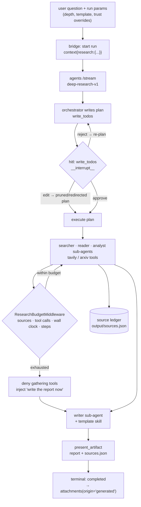
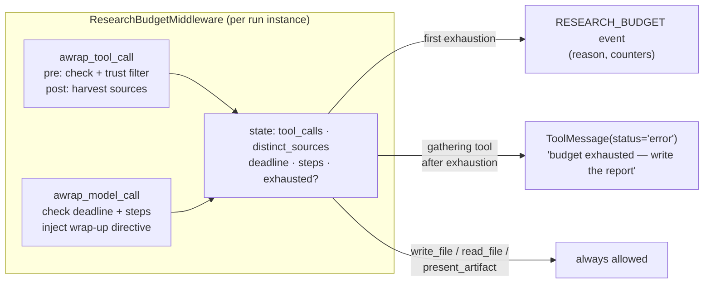
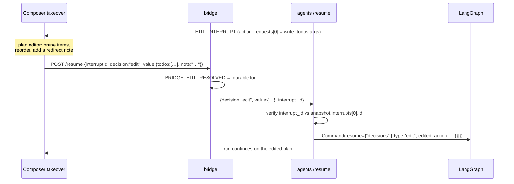

# Deep Research Mode

> **Status:** Not started
> **TODO source:** New Features → "Deep Research mode: run longer multi-step research workflows with source citations, confidence notes, step traces, and exportable reports. Make it budgeted and steerable from day one: explicit knobs for max sources / max tool calls / wall-clock budget, a plan-first HITL checkpoint (reusing the run takeover interrupt) where the user can prune or redirect branches before execution, per-source trust weighting (domain allow/denylist, prefer-primary-sources toggle), and selectable output templates (executive summary, annotated bibliography, comparison matrix, decision memo)."
> **Depends on:** [00-platform-restructure.md](00-platform-restructure.md) (**Done** — declarative agents + per-agent tools). Soft: [04-notifications-and-pwa.md](04-notifications-and-pwa.md) (a ten-minute run finishes while the user is elsewhere, and a plan-approval request has to reach them), [05-artifacts-canvas.md](05-artifacts-canvas.md) (the report wants an editable canvas, not just a download), [07-tool-rag.md](07-tool-rag.md) (a research agent is the first with a genuinely wide tool surface).
> **Blocks:** nothing.
> **Services touched:** agents · dialogue_bridge · agentic_ui · infra (MCP gateway servers)

Deep Research is the platform's first genuinely *long* unit of work: a single user question that fans out into dozens of searches, extractions, and paper reads over several minutes and comes back as a cited, exportable report. Everything about the existing inference path assumes a turn measured in seconds — no wall-clock ceiling, no step budget, an HTTP read-gap timeout of 180 seconds, an event log trimmed at 20 000 entries, and artifact capture that fires only on a clean `completed`. Deep Research is therefore as much a hardening exercise on the run pipeline as it is a new agent.

The mental model to hold is that **the budget is what makes the feature shippable, not what constrains it.** An unbudgeted research agent is not a better research agent; it is an agent that costs an unbounded amount of money, holds one of the user's five active-run slots indefinitely, and eventually dies on a recursion limit with an opaque error and nothing to show. So the design's centre of gravity is the *exhaustion path*: when a ceiling is reached, the run must not fail — it must stop gathering, write the best report it can from what it has, mark what it could not resolve, present the artifact, and terminate as `completed`. Every other piece here (the plan gate, trust weighting, templates, the progress UI) is arranged around that spine.

---

## 1. Goal & non-goals

**Goals.** A declarative `deep-research` agent that plans, searches, reads, cross-checks, and writes — with a plan-first human checkpoint before it spends anything, hard ceilings on sources / tool calls / wall-clock, per-source trust weighting that is *enforced* rather than merely suggested, a traceable source ledger so every claim in the report resolves to something the agent actually read, four selectable output templates, and a progress surface that makes a ten-minute run legible instead of frightening. Plus the platform hardening the above requires: a deliberate step ceiling, sub-agent MCP tools, artifact capture on a non-clean terminal, and a long-run-safe streaming path.

**Non-goals.** Not a new service and not a new runtime — this is a declarative agent plus one middleware plus a run-parameter block. Not an autonomous background researcher (that is [08-workflow-automation-builder.md](08-workflow-automation-builder.md) triggering this agent). Not a replacement for the existing document-RAG path — Deep Research reads the open web and arXiv through MCP tools; internal-corpus retrieval stays where it is until [10-rag-via-mcp-gateway.md](10-rag-via-mcp-gateway.md) makes it a tool. Not a cost-accounting or billing system: the budget ceilings are per-run safety limits, not a quota ledger. Not an editable report surface — the report is an attachment until [05-artifacts-canvas.md](05-artifacts-canvas.md) lands.

---

## 2. Current state

### An agent is already fully expressible in YAML — with one gap that matters here

A folder with an `agent.yaml` and an `AGENT.md` is a registered, runnable deep agent. `AgentSpec` is strict Pydantic with `extra="forbid"` ([agent_spec.py:124](../../src/agents/runtime/abstractions/agent_spec.py)), so every field this plan wants is a deliberate schema decision:

| Spec field | Runtime effect | Ref |
| --- | --- | --- |
| `prompt` | `instructions` → `system_prompt` | [yaml_agent.py:58](../../src/agents/runtime/abstractions/yaml_agent.py) |
| `model.main` / `model.subagents{}` | main + per-sub-agent model | [agent_spec.py:93-100](../../src/agents/runtime/abstractions/agent_spec.py), [yaml_agent.py:144-146](../../src/agents/runtime/abstractions/yaml_agent.py) |
| `tools[]` (`{server_id, tool_name}` \| `{native}`) | seeds `config_tool_names` (MCP) / resolved at build (native) | [agent_spec.py:37-72](../../src/agents/runtime/abstractions/agent_spec.py), [yaml_agent.py:67-83, 153](../../src/agents/runtime/abstractions/yaml_agent.py) |
| `skills[]` | default-enabled skills | [agent_spec.py:142](../../src/agents/runtime/abstractions/agent_spec.py) |
| `subagents[]` | `deepagents.SubAgent` list | [yaml_agent.py:119-142](../../src/agents/runtime/abstractions/yaml_agent.py) |
| `hitl{tool: bool}` | `create_deep_agent(interrupt_on=...)` | [yaml_agent.py:158](../../src/agents/runtime/abstractions/yaml_agent.py) → [deep_agent.py:393, 453-460](../../src/agents/runtime/abstractions/deep_agent.py) |
| `memory` | default for `use_memory` | [yaml_agent.py:87-88](../../src/agents/runtime/abstractions/yaml_agent.py) |

The concrete example is `omni-yaml-v1`: `tools: []`, two sub-agents (`researcher`, `writer`) with `tools: []`, and `hitl: {write_file, edit_file, execute, task}` ([agents_seed/omni-yaml-v1/agent.yaml](../../src/agents/agents_seed/omni-yaml-v1/agent.yaml)). Agents are seeded from the image into `<global_root>/agents/` with existing-folders-win semantics ([agent_seed.py:34-84](../../src/agents/runtime/abstractions/agent_seed.py)), then discovered by a directory scan that validates each spec and skips invalid ones without taking discovery down ([utils/agents.py:78-118](../../src/agents/utils/agents.py)); `refresh_registry()` runs in the lifespan after the seed ([main.py:218-219](../../src/agents/main.py)).

**The gap: a YAML sub-agent cannot have MCP tools.** `register_subagents` explicitly drops them with a warning:

```python
# src/agents/runtime/abstractions/yaml_agent.py:122-132
mcp_refs = [t for t in sa.tools if not t.is_native]
if mcp_refs:
    logger.warning("yaml_subagent_mcp_tools_ignored",
                   "Sub-agent MCP tools are not yet wired for YAML agents; ignoring", ...)
```

Only `_resolve_native_tools(sa.tools)` reaches the `SubAgent` ([yaml_agent.py:139](../../src/agents/runtime/abstractions/yaml_agent.py)). A research agent whose whole point is a `searcher` sub-agent holding `tavily-search` is therefore not expressible today. This is a Phase 0 prerequisite, not a nice-to-have.

### The tools a research agent can actually get

The request carries no tool list; on every `/stream` and `/resume` the router pulls the **entire** live gateway manifest and the agent keeps what it declared ([router/inference.py:91-96, 316-318](../../src/agents/router/inference.py) → [base_agent.py:117-159](../../src/agents/runtime/abstractions/base_agent.py)). The gateway runs two servers, `--servers=tavily,arxiv-mcp-server` ([docker-compose-mcp.yaml](../../src/docker-compose-mcp.yaml)), and the server-inference table names the eight tools: `tavily-search`, `tavily-extract`, `tavily-crawl`, `tavily-map`, `search_papers`, `download_paper`, `read_paper`, `list_papers` ([mcp_tools.py:19-30](../../src/agents/utils/mcp_tools.py)). Full detail in [tool-harness.md](../development/tool-harness.md). On top of that: three always-on natives (`remember`, `search_past_conversations`, `present_artifact` — [tools/registry.py:84-132](../../src/agents/runtime/tools/registry.py)) and the framework builtins added downstream of every filter (`write_todos`, `ls`, `read_file`, `write_file`, `edit_file`, `glob`, `grep`, `task`, `execute` — [deep_agent.py:37-58, 453-469](../../src/agents/runtime/abstractions/deep_agent.py)).

A user can also *enable* any other gateway tool per (user, agent) and *disable* a declared one ([tool_prefs.py](../../src/agents/runtime/filesystem/tool_prefs.py), [agent_tools.py:103-149](../../src/agents/utils/agent_tools.py)) — which means the research agent's tool surface is user-mutable and the budget must not assume a fixed roster.

### HITL is per-tool gating, and only approve/reject

`interrupt_on` is a flat `{tool_name: bool}` map. There is no "interrupt at an arbitrary point" primitive — **the only way to pause a run is to gate a tool call**, which is exactly why gating `write_todos` is the natural plan-first checkpoint (§ 3). The full round trip today:

| Step | Where |
| --- | --- |
| Graph hits `__interrupt__`; normalizer emits `HITL_INTERRUPT` **and returns immediately** (nothing else from that chunk) | [normalizer.py:232-257](../../src/agents/runtime/agui/normalizer.py) |
| Bridge registers the interrupt **by `interrupt.id`** (a sub-agent interrupt arrives twice — top-level and `SUBAGENT_EVENT` — so registration dedupes) | [inference_runs.py:304-309](../../src/dialogue_bridge/utils/inference_runs.py) |
| `_do_stream` returns with `pending_interrupts > 0`; `_run` parks on `asyncio.wait({resume_waiter, cancel_waiter})` — **no timeout** | [inference_runs.py:813-816, 834-844](../../src/dialogue_bridge/utils/inference_runs.py) |
| Client posts `POST /runs/{user}/{run}/resume` (CSRF; no route-level rate limit) | [router/inference.py:225-268](../../src/dialogue_bridge/router/inference.py) |
| Bridge synthesizes `BRIDGE_HITL_RESOLVED` into the durable log so resolution survives reload, then `_do_resume` POSTs to agents `/resume` | [inference_runs.py:852-880, 936-993](../../src/dialogue_bridge/utils/inference_runs.py) |
| Agents `/resume` reads the checkpoint, verifies `interrupt_id` (409 on stale), sizes the decisions list from `action_requests`, issues `Command(resume={"decisions": [...]})` | [router/inference.py:219-300](../../src/agents/router/inference.py) |
| UI renders the pause as a **composer takeover** and answers it | [ChatPage.tsx:1282-1289](../../src/agentic_ui/src/pages/ChatPage.tsx) → [ChatView.tsx:206-229](../../src/agentic_ui/src/pages/ChatView.tsx) → [HitlInputTakeover.tsx](../../src/agentic_ui/src/features/chat/components/HitlInputTakeover.tsx); parse at [hitl.ts:23-40](../../src/agentic_ui/src/features/inference/hitl.ts) |

Two facts are decisive for the plan gate. **The decision vocabulary is two-valued**: `decision: Literal["approve", "reject"]` in the client schema ([schemas/__init__.py:800-835](../../src/dialogue_bridge/schemas/__init__.py)) and `_to_lc_decision` produces only `{"type": "approve"}` or `{"type": "reject", "message": ...}` ([router/inference.py:269-279](../../src/agents/router/inference.py)). And **`value` is already plumbed but unused**: the client may send it, the bridge forwards it into the resume payload ([inference_runs.py:248-254](../../src/dialogue_bridge/utils/inference_runs.py)) and into the agents request body ([inference_runs.py:953-961](../../src/dialogue_bridge/utils/inference_runs.py)), and the agents endpoint accepts it — and then ignores it. There is a wire already run to the place an "edit the plan" decision needs to land.

Reject is non-terminal: the rejection becomes a `ToolMessage` and the loop continues, so the agent can re-plan ([router/inference.py:271-279](../../src/agents/router/inference.py), [inference-streaming.md § Failure modes](../flows/inference-streaming.md)).

### There is no budget of any kind. This is the largest gap.

| Ceiling | Status |
| --- | --- |
| Max steps / `recursion_limit` | **Absent.** `recursion_limit` appears nowhere in `src/`. `run_config` is `{'configurable': {'thread_id': …}}` ([base_agent.py:58-59](../../src/agents/runtime/abstractions/base_agent.py)) and the bridge sets only `configurable.thread_id` ([inference_runs.py:730-733](../../src/dialogue_bridge/utils/inference_runs.py)). LangGraph's **default of 25 super-steps therefore applies silently** and surfaces as an opaque `RUN_ERROR`. A twenty-source research run hits it long before it finishes. |
| Max tool calls | Absent. |
| Token / cost ceiling | Absent. `TOKEN_USAGE` is **collect-only**: accumulated per run deduped by `message_id` ([inference_runs.py:289-298](../../src/dialogue_bridge/utils/inference_runs.py)), persisted to `messages.input_tokens/output_tokens` at finalize ([inference_runs.py:1160-1161](../../src/dialogue_bridge/utils/inference_runs.py)), surfaced in the Usage tab — and the timeline reducer branch for it is an **explicit no-op** ([timeline.ts:698-703](../../src/agentic_ui/src/features/inference/timeline.ts)). Nothing compares it to a limit. |
| Wall clock, interactive run | Absent. No `asyncio.timeout`, no deadline in `_run` ([inference_runs.py:575-904](../../src/dialogue_bridge/utils/inference_runs.py)). |
| Wall clock, scheduled run | **The only one that exists** — `reap_timed_out_fires()` cancels a fire past `SCHEDULER_RUN_TIMEOUT_SECONDS` (default 600) via `inference_run_manager.request_cancel(...)` ([scheduled_tasks.py:437-458](../../src/dialogue_bridge/utils/scheduled_tasks.py), [settings.py:587](../../src/dialogue_bridge/core/settings.py)). Its docstring names the HITL-hang case. Interactive runs have no equivalent. |
| Concurrency | `MAX_ACTIVE_RUNS_PER_USER = 5` ([inference_runs.py:50](../../src/dialogue_bridge/utils/inference_runs.py), [settings.py:572](../../src/dialogue_bridge/core/settings.py)); one active run per conversation, DB-enforced ([inference_runs.py:1396-1403](../../src/dialogue_bridge/utils/inference_runs.py)). Run-start rate limit 10/60s ([settings.py:533-534](../../src/dialogue_bridge/core/settings.py)). |

Combine two of those rows and you get a shipped footgun that the plan-first checkpoint makes much more likely: an un-timed-out HITL park holds a run **and** one of the five active-run slots until the user answers, cancels, or the bridge restarts (`cleanup_orphaned_inference_runs` fails all active runs on boot — [inference_runs.py:1495-1517](../../src/dialogue_bridge/utils/inference_runs.py)).

### Long runs stress the streaming path in three specific places

| Constraint | Value | Consequence for a many-minute run |
| --- | --- | --- |
| bridge→agents httpx timeouts | connect 30 / **read 180** / write 180 / pool 30 ([settings.py:398-401, 444-451](../../src/dialogue_bridge/core/settings.py)), applied at [inference_runs.py:914, 962](../../src/dialogue_bridge/utils/inference_runs.py) | `read` is a **gap** timeout, not a total. A run streaming steadily for 20 minutes is fine; a single silent tool call longer than 180 s (a `tavily-crawl` over a large site) kills the leg. |
| Redis stream trim | `XADD … MAXLEN ~ 20000` ([event_log.py:50-63](../../src/dialogue_bridge/utils/event_log.py), [settings.py:510](../../src/dialogue_bridge/core/settings.py)) | A research run can plausibly exceed 20 000 events. A *fresh* subscriber is fine — `stream_run_events` anchors on `last_entry_id` and synthesizes a full snapshot from the in-process runtime ([inference_runs.py:1286-1292, 521-543](../../src/dialogue_bridge/utils/inference_runs.py)). A **reconnect with a trimmed `since` cursor** silently loses the head of the log. |
| Terminal TTL | `EXPIRE 3600` ([event_log.py:142-148](../../src/dialogue_bridge/utils/event_log.py)) | Fine — after terminal the DB `raw_events` is authoritative. |

The event log itself is a per-run monotonic `seq` sequence with delta coalescing (`TEXT_MESSAGE_*` and `TOOL_CALL_ARGS` merge; `THINKING_TEXT_MESSAGE_CONTENT` deliberately never does; `TOOL_CALL_RESULT` truncated at 16 000 chars with a `truncated` flag) — [inference-streaming.md § Phase 3](../flows/inference-streaming.md), [inference_runs.py:217-250, 378-460](../../src/dialogue_bridge/utils/inference_runs.py).

### Artifact capture fires only on a clean `completed` — the load-bearing detail

`present_artifact` is the one explicit act that promotes a file to a user-facing deliverable. The tool itself emits nothing; the **normalizer synthesizes** the `PRESENT_ARTIFACT` custom event from the tool call by name, orchestrator-only ([present_artifact.py:10-15](../../src/agents/runtime/tools/present_artifact.py), [normalizer.py:386-418](../../src/agents/runtime/agui/normalizer.py)). The bridge registers it into `runtime.presented_artifacts` ([inference_runs.py:311-332, 428-432](../../src/dialogue_bridge/utils/inference_runs.py)) and then:

```python
# src/dialogue_bridge/utils/inference_runs.py:1185-1186 (inside _finish_run)
if status_value == "completed":
    await self._capture_generated_artifacts(...)
```

`_capture_generated_artifacts` reads the files back from the agents service and persists them as `attachments(origin='generated')` + blobs ([inference_runs.py:1062-1130](../../src/dialogue_bridge/utils/inference_runs.py)). **A `cancelled` or `failed` run therefore discards its report**, even if the file was written and presented. Since a budget-exhausted or watchdog-cancelled research run is precisely the case where a partial report is most valuable, this is a prerequisite, and it is also why the exhaustion path must terminate `completed` rather than lean on cancellation.

The output mount has a 168-hour TTL and the input mount 72 hours ([settings.py:502-504](../../src/agents/core/settings.py)), blob-backed so erasure is safe; the durable checkpoint has **no** TTL and is reaped only on conversation delete ([router/inference.py:406-434](../../src/agents/router/inference.py)).

### The UI already renders most of a run trace

The timeline is a fold over the full event log, not an aggregate: `applyEvent` is the switch, with the custom-event branches at [timeline.ts:688-793](../../src/agentic_ui/src/features/inference/timeline.ts) (`PLAN_SNAPSHOT`, `TOKEN_USAGE` no-op, `PRESENT_ARTIFACT`, `TASK_SUBAGENT`, `SUBAGENT_EVENT`, `HITL_INTERRUPT`, `BRIDGE_HITL_RESOLVED`) and a **second** switch for sub-agent-wrapped inner events at [timeline.ts:608-679](../../src/agentic_ui/src/features/inference/timeline.ts). Unknown event types fall through silently. `write_todos` already renders as a plan via `PLAN_SNAPSHOT` ([normalizer.py:351](../../src/agents/runtime/agui/normalizer.py), [agui.ts:46-66](../../src/agentic_ui/src/features/inference/agui.ts)), and `task` renders as a sub-agent card. Reconnect/replay is solved: `observeRunId` with a `since` cursor and backoff ([useInferenceRuns.ts:233-272](../../src/agentic_ui/src/features/inference/useInferenceRuns.ts), [api.ts:1278-1287](../../src/agentic_ui/src/shared/lib/api.ts)).

**Deep agents stream only `["messages", "updates"]`** ([normalizer.py:25-37](../../src/agents/runtime/agui/normalizer.py)); `handle_chunk` returns `[]` for any other mode ([normalizer.py:80-81](../../src/agents/runtime/agui/normalizer.py)). There is no `"custom"` channel, which is exactly why `PRESENT_ARTIFACT` is synthesized from a tool call rather than written by the tool. Any new event this plan wants must either be synthesized in the normalizer or arrive by adding `"custom"` to the stream modes — a platform change with its own risk.

### Where per-user settings live

One row per user, scalars plus one JSON column: `user_preferences` with `search_past_convs`, `use_memory`, `personality`, and `custom_instructions` as `JSON` ([models.py:108-137](../../src/dialogue_bridge/core/database/models.py)). Preferences are threaded into the run as `config["context"]` ([inference_runs.py:730-750](../../src/dialogue_bridge/utils/inference_runs.py)) and re-validated fail-closed on the agents side ([base_agent.py:79-86](../../src/agents/runtime/abstractions/base_agent.py)). Alembic head is `0016_retire_enabled_tools`.

---

## 3. Target design

### Deep Research is a declarative agent + one middleware + a run-parameter block

Three questions, three different answers, and keeping them separate is the design:

| Question | Answer | Why |
| --- | --- | --- |
| Is it a distinct agent, a mode flag, or a middleware? | **A distinct declarative agent** — `agents_seed/deep-research-v1/` | A "deep research mode" flag on an existing agent means one agent whose prompt, sub-agent roster, and tool set change at runtime — a second, hidden declarative system inside the one plan 00 just built. A separate `agent.yaml` gets the prompt, models, sub-agents, tools, skills, and HITL gates for free, is user-selectable in the picker, inherits per-agent tool overrides and per-(user, agent) memory, and can be edited on the volume without a rebuild. |
| Where do the ceilings live? | **A `ResearchBudgetMiddleware`** in `runtime/middlewares/` | A ceiling must be enforced at the tool-call and model-call boundaries, must be able to *change the run's behaviour* rather than abort it, and should be reusable by any future long-running agent. `ToolErrorMiddleware` already proves the pattern: intercept at `awrap_tool_call`, return a `ToolMessage` instead of raising ([tool_error.py:25-43](../../src/agents/runtime/middlewares/tool_error.py)). |
| Where do the knobs live? | **Run parameters in `config["context"]`, with per-agent defaults in `agent.yaml`** | Identical to how `use_memory` / `search_past_convs` / `personalization` already reach the agent ([inference_runs.py:730-750](../../src/dialogue_bridge/utils/inference_runs.py) → [base_agent.py:79-86](../../src/agents/runtime/abstractions/base_agent.py)). Per-run because a user tunes depth per question; per-agent defaults because a spec should be self-describing. |



### The agent shape

```yaml
# agents_seed/deep-research-v1/agent.yaml  (illustrative)
slug: deep-research-v1
type: deep_agent
prompt: ./AGENT.md
model:
  main: openai:gpt-5
  subagents: { searcher: openai:gpt-4o, reader: openai:gpt-4o, analyst: openai:gpt-5, writer: openai:gpt-4o }
tools:
  - { server_id: tavily, tool_name: tavily-search }
  - { server_id: tavily, tool_name: tavily-extract }
  - { server_id: arxiv,  tool_name: search_papers }
skills: [ executive-summary, annotated-bibliography, comparison-matrix, decision-memo ]
subagents:
  - name: searcher   # NEEDS Phase 0: sub-agent MCP tools
    tools: [ { server_id: tavily, tool_name: tavily-search }, { server_id: tavily, tool_name: tavily-map } ]
  - name: reader
    tools: [ { server_id: tavily, tool_name: tavily-extract }, { server_id: arxiv, tool_name: read_paper } ]
  - name: analyst
  - name: writer
hitl:
  write_todos: true        # ← the plan-first checkpoint
  write_file: false
```

`tavily-crawl` is deliberately **not** declared: it is the tool most likely to exceed the 180-second read gap and the one whose cost is least predictable. A user who wants it can enable it per-agent through the Agents tab, which is the correct place for that decision.

The `hitl: {write_todos: true}` line is the entire plan-first checkpoint mechanism. That is the payoff of gating being per-tool: the plan *is* the todo list, `write_todos` *is* the plan write, and the existing `HITL_INTERRUPT` → composer-takeover path already renders and answers it.

### Budget enforcement: four ceilings, three hooks, one exhaustion path



| Ceiling | Counted where | On exhaustion |
| --- | --- | --- |
| `max_tool_calls` | incremented in `awrap_tool_call` before dispatch, counting only *gathering* tools (MCP + `search_past_conversations`) | flip `exhausted`, deny further gathering |
| `max_sources` | harvested in `awrap_tool_call` **after** dispatch, counting **distinct normalized URLs/DOIs** in the result | same |
| `wall_clock_seconds` | a monotonic deadline stamped at build; checked in both hooks | same |
| `max_steps` | an explicit `recursion_limit` on `run_config`, plus a soft counter in `awrap_model_call` that trips at ~80 % of it | soft trip flips `exhausted` **before** LangGraph's hard limit can throw |

The `max_steps` row is the subtle one. LangGraph's recursion limit is a hard exception, not a graceful stop — so the middleware keeps its own soft counter and exhausts *first*, leaving enough head-room for the write-and-present tail. Setting `recursion_limit` explicitly is a prerequisite in its own right (§ 8 Phase 0): today the silent default of 25 caps every deep-agent run in the platform.

**The exhaustion path is the feature.** On the first ceiling breach the middleware, in order: emits one `RESEARCH_BUDGET` event carrying the reason and the counters; from then on returns an explanatory `ToolMessage(status="error")` for every gathering tool while leaving `read_file`, `write_file`, `edit_file`, `write_todos`, and `present_artifact` open; and injects a directive into the next model call — *"Your research budget is exhausted (reason, counters). Write the report now from what you already have. Mark every unresolved question explicitly under 'Open questions'. Then call `present_artifact`."* The run then reaches its natural end and terminates `completed`, which is the only status under which the report is captured ([inference_runs.py:1185-1186](../../src/dialogue_bridge/utils/inference_runs.py)). Denying a tool rather than raising is exactly the `ToolErrorMiddleware` shape, so the denial already renders as a failed tool step in the timeline with no UI work.

A **bridge-side watchdog** is the last-resort backstop only, modelled on `reap_timed_out_fires` ([scheduled_tasks.py:437-458](../../src/dialogue_bridge/utils/scheduled_tasks.py)): a research run past `wall_clock + grace` gets `request_cancel`. It must be a *rare* path, because cancellation is precisely the status that loses the artifact — which is why extending capture to non-clean terminals is a Phase 0 prerequisite rather than a Phase 5 nicety.

### The plan-first checkpoint, and the `edit` decision

Approve and reject work today with zero changes: approve runs the plan, reject is non-terminal and the agent re-plans. **Pruning and redirecting need a third decision type**, and the wire for it is already run — `value` reaches the agents service and is discarded ([router/inference.py:269-279](../../src/agents/router/inference.py)).



The chain to change, end to end: `ResumeActionDecisionIn.decision` and `InferenceRunResumeIn.decision` gain `"edit"` ([schemas/__init__.py:800-835](../../src/dialogue_bridge/schemas/__init__.py)); the bridge validates the `value` shape rather than passing an opaque blob (it is user input crossing a service boundary — § 9); `_to_lc_decision` learns the third branch ([router/inference.py:269-279](../../src/agents/router/inference.py)); the client `ResumeInferenceRunBody` and `resumeRun` learn it ([api.ts:1230-1271](../../src/agentic_ui/src/shared/lib/api.ts), [useInferenceRuns.ts:381-399](../../src/agentic_ui/src/features/inference/useInferenceRuns.ts)); and `HitlInputTakeover` gets a plan-editor variant, keyed on the gated tool being `write_todos`, instead of the generic approve/reject bar ([HitlInputTakeover.tsx:398-433](../../src/agentic_ui/src/features/chat/components/HitlInputTakeover.tsx)).

Two guardrails. The edited plan must be **validated against the original**, not accepted wholesale: items may be removed, reordered, or annotated, but injecting arbitrary new tool arguments through a resume payload turns an approval gate into a code path for user-authored tool calls. And the plan gate must be **skippable** — a run parameter `plan_gate: false` for the user who wants depth without friction, because a gate everyone reflexively approves is pure latency (§ 12).

### Source trust weighting: per-user default, per-run override, enforced at the boundary

Storage: a `research` JSON column on `user_preferences`, mirroring the `custom_instructions` precedent ([models.py:132](../../src/dialogue_bridge/core/database/models.py)) — `{allowDomains: [], denyDomains: [], preferPrimarySources: bool, defaultBudget: {...}, defaultTemplate: str}`. A JSON column rather than a child table because the shape is a small document read as a whole and never queried by element; a child table would be the right call only if we later need cross-user analytics on domain policy.

Enforcement has to happen in **two** places, and this is the non-obvious part:

| Tool shape | Where the policy applies | Mechanism |
| --- | --- | --- |
| Tools that take a URL — `tavily-extract`, `tavily-crawl`, `tavily-map`, `download_paper` | **on the arguments, pre-dispatch** | `awrap_tool_call` inspects the URL, and a denied domain never gets fetched: return a `ToolMessage` explaining the policy |
| Tools that take a query — `tavily-search`, `search_papers` | **on the results, post-dispatch** | the search itself names no domain, so the middleware **rewrites the tool result**, dropping denied-domain hits before the model ever sees them |

Result rewriting is a real design commitment: the middleware becomes a filter on tool output, not just a counter. It is the only way a denylist means anything — a prompt-level instruction is advisory and a model under pressure will ignore it. `preferPrimarySources`, by contrast, genuinely *is* advisory: it becomes a prompt directive plus a ranking hint in the source ledger's trust tier, because "primary" is a judgment no regex can make. Say so in the UI rather than implying enforcement.

Precedence: per-run override > per-user preference > agent default. Fail-closed on a malformed policy — an unparseable `research` document collapses to "no allowlist, no denylist, prefer-primary off", never to "allow everything the user meant to deny", which means the deny half must be treated as absent only if the whole document is absent.

### Citations: a source ledger, written as a file, captured as an artifact

Every accepted source the agent actually reads gets a ledger row: `{id, url, domain, title, tool, fetchedAt, trustTier, contentHash}`. The ledger lives at `/conversation/output/sources.json`, written by the middleware as sources are harvested (the middleware already sees every tool result), and is presented alongside the report so both ride the existing `present_artifact` → `attachments(origin='generated')` pipeline ([inference_runs.py:1062-1130](../../src/dialogue_bridge/utils/inference_runs.py)) with **no new plumbing and no migration**. The report's `[n]` markers resolve into ledger ids, and the template skills instruct the writer to cite only ledger ids — so a claim with no ledger entry is a detectable defect rather than an invisible hallucination.

Why a file and not a table, for v1: the report itself is already a file artifact, the file inherits the output mount's 168-hour TTL and its blob-backed erasure guarantees, and a bridge `research_sources` table only earns its keep once we want cross-run source dedupe or a "sources" browsing surface. That is a deliberate v2, called out in § 12.

### Output templates are skills

Four skill folders under the agent — `executive-summary`, `annotated-bibliography`, `comparison-matrix`, `decision-memo` — each a standard `skills/<name>/SKILL.md`. This is the right mechanism rather than four prompt blocks because skills are already progressively disclosed by the deepagents `SkillsMiddleware` (loaded on demand, not resident in context), are already enabled per (user, agent) through the Skills tab, are already mounted at `/skills/` per (user, agent) ([deep_agent.py:476-488](../../src/agents/runtime/abstractions/deep_agent.py)), and are already user-extensible — so "add our house report format" is a skill upload, not a code change. The run parameter `output_template` names one, validated against the agent's enabled skills, and the orchestrator is instructed to read that skill before the writer runs.

### Progress over a many-minute run

The timeline already renders the plan, sub-agent cards, tool steps, and thinking. What a ten-minute run needs on top is a **persistent progress header**: elapsed vs wall-clock budget, sources and tool calls against their ceilings, current phase, and — when it happens — the exhaustion reason. That needs one new custom event, `RESEARCH_PROGRESS`, and it must be **throttled to roughly one per few seconds**, never per tool call: a per-event progress frame on a thousands-of-events run would materially eat the 20 000-entry `MAXLEN` budget and, on reconnect, push real content out of replay range.

Everything else is presentation: collapse the timeline by default past N steps, group tool steps by phase, and keep the artifact card and the sources list pinned. Leaving and coming back already works ([useInferenceRuns.ts:233-272](../../src/agentic_ui/src/features/inference/useInferenceRuns.ts)); leaving and being *told* it finished is [04-notifications-and-pwa.md](04-notifications-and-pwa.md).

Because deep agents stream only `["messages", "updates"]` ([normalizer.py:25-37, 80-81](../../src/agents/runtime/agui/normalizer.py)), both new events must be **synthesized in the normalizer** — the same route `PRESENT_ARTIFACT` takes. The alternative, adding `"custom"` to `stream_mode` so a middleware can write events directly via the stream writer, is a broader platform change: it would also unlock a heartbeat *during* a long-running tool call (the one real fix for the 180-second read gap, § 12), which is why it is worth evaluating properly rather than dismissing.

---

## 4. Data model & migrations

Deliberately small. The run *is* an assistant `MessageTable` row with `streaming_*` columns ([inference_runs.py:1042-1049](../../src/dialogue_bridge/utils/inference_runs.py)); the trace is `raw_events`; the report and ledger are `attachments(origin='generated')`. So:

| Change | Where | Notes |
| --- | --- | --- |
| `user_preferences.research` — `JSON NOT NULL DEFAULT '{}'` | [models.py:108-137](../../src/dialogue_bridge/core/database/models.py) + migration `0017_research_preferences` | Mirrors `custom_instructions` ([models.py:132](../../src/dialogue_bridge/core/database/models.py)). Additive, no backfill needed — `{}` means "defaults". |
| `messages.research_summary` — `JSON NULL` | same model + same migration | The run's terminal budget counters, exhaustion reason, source count, template used. Needed so the Runs list and a re-opened conversation can say *why* a report is partial without re-folding 20 000 events. Written in `_finish_run` alongside the token totals ([inference_runs.py:1152-1169](../../src/dialogue_bridge/utils/inference_runs.py)). |

Chain: `0016_retire_enabled_tools` → `0017_research_preferences`. One migration, both columns, no destructive operation, no data backfill.

Explicitly **not** in v1: a `research_runs` table (the message row already is one), a `research_sources` table (the ledger is a file — § 3, § 12), and any cost/quota ledger (§ 1 non-goals).

Agents-side spec additions to `AgentSpec` — and because of `extra="forbid"` ([agent_spec.py:124](../../src/agents/runtime/abstractions/agent_spec.py)) these are one-shot decisions:

```yaml
research:                    # optional block; absent = not a research agent
  budget: { max_sources: 25, max_tool_calls: 60, wall_clock_seconds: 900, max_steps: 120 }
  plan_gate: true
  default_template: executive-summary
```

---

## 5. API surface

| Method | Path | Change | Auth / limits |
| --- | --- | --- | --- |
| `POST` | `/v1/inference/runs/{user_id}/start` | `InferenceStartPayload` gains an optional `research` block (budget overrides, `outputTemplate`, `planGate`, trust overrides), validated and clamped against per-agent maxima | unchanged: `inference_rate_limit`, `validate_userId`, `require_csrf_protection` ([router/inference.py:47-58](../../src/dialogue_bridge/router/inference.py)) |
| `POST` | `/v1/inference/runs/{user_id}/{run_id}/resume` | `decision` gains `"edit"`; `value` gains a **typed** schema (`ResumePlanEditIn`) instead of `Optional[Any]` | CSRF + ownership as today. **Add a route-level rate limit** — it currently has none ([router/inference.py:225-233](../../src/dialogue_bridge/router/inference.py)) and an edit decision now carries a payload |
| `GET`/`PUT` | `/v1/preferences/{user_id}` (existing) | expose the `research` document | existing prefs auth |
| `POST` | agents `/agents/{slug}/resume` | `AgentResumeRequest.decision` gains `"edit"`; `value` typed; `_to_lc_decision` gains the branch | `require_internal_caller` |

Run parameters are threaded into `config["context"]["research"]` exactly like the existing preference flags ([inference_runs.py:730-750](../../src/dialogue_bridge/utils/inference_runs.py)) and re-validated fail-closed in the agents service next to `parse_personalization` ([base_agent.py:79-86](../../src/agents/runtime/abstractions/base_agent.py)) — validate on both sides, because the bridge is not the only possible caller of `/stream`.

Two new settings blocks. Agents: `ResearchSettings` with the platform-wide **maxima** that a per-run override can never exceed (`RESEARCH_MAX_SOURCES_CEILING`, `RESEARCH_MAX_TOOL_CALLS_CEILING`, `RESEARCH_MAX_WALL_CLOCK_CEILING`, `RESEARCH_DEFAULT_RECURSION_LIMIT`). Bridge: `RESEARCH_RUN_GRACE_SECONDS` for the watchdog, plus a raise of `HTTP_INFERENCE_READ_SECONDS` (§ 8 Phase 0).

---

## 6. Frontend surface

A new `features/research/` feature, plus targeted changes in `features/inference/` and `features/chat/`:

| Piece | Location | Notes |
| --- | --- | --- |
| Depth/budget/template picker | `features/research/components/ResearchLaunchPanel.tsx` | Opens from the composer when the selected agent declares a `research` block. Three presets (Quick / Standard / Exhaustive) mapping to budget triples, plus an advanced disclosure. Presets, not raw numbers, because "max tool calls" is not a user concept. |
| Plan editor takeover | `features/chat/components/HitlInputTakeover.tsx` variant | Selected when the gated tool is `write_todos`. Checkbox prune + drag reorder + a free-text redirect note; **`prefers-reduced-motion` guard on the reorder animation**, `transform`-only, 44 px touch targets, visible focus rings, a real `<label>` on the note field. |
| Progress header | `features/research/components/ResearchProgressBar.tsx` | Elapsed vs budget, sources/tool-calls meters, phase, exhaustion banner. Skeleton (not spinner) before the first `RESEARCH_PROGRESS` frame. |
| Sources panel | `features/research/components/SourceLedger.tsx` | Reads the presented `sources.json` attachment; groups by trust tier; every row links out with an explicit external-link affordance. |
| Trust settings | `features/settings/.../profile_parts/` new Research section | Allow/deny domain lists with per-row delete confirmation, `preferPrimarySources` toggle, default template + budget. Must state plainly that prefer-primary is a *hint* and the denylist is *enforced*. |
| Event contracts | `features/inference/agui.ts` | `ResearchProgressPayloadSchema` + `ResearchBudgetPayloadSchema`, joined into `CustomAguiEventSchema` ([agui.ts:155-163](../../src/agentic_ui/src/features/inference/agui.ts)); `.nullish()` not `.optional()`, per the note at [agui.ts:19-22](../../src/agentic_ui/src/features/inference/agui.ts) |
| Reducer branches | `features/inference/timeline.ts` | New branches in the `CUSTOM` block ([timeline.ts:688-793](../../src/agentic_ui/src/features/inference/timeline.ts)); decide explicitly whether either event can occur inside a sub-agent and therefore also needs a branch in `applySubagentInnerEvent` ([timeline.ts:608-679](../../src/agentic_ui/src/features/inference/timeline.ts)) — `PRESENT_ARTIFACT` is deliberately orchestrator-only, and progress should be too |
| API + types | `shared/lib/api.ts`, `schemas.ts`, `types.ts` | `research` on the start body, `"edit"` + typed `value` on the resume body. Note the field-whitelisted message/attachment transforms in `shared/lib/consts.ts`: a new response field is silently dropped client-side until it is added there *and* to the Zod contract. |

Timeline collapsing for long runs is a `features/chat` change (`AgentRunTimeline.tsx` / `TimelineSequence.tsx`): collapse past N steps with a "show all" affordance, and keep the artifact card, sources panel, and any HITL card always expanded.

---

## 7. Cross-cutting impact

**agents runtime.** `AgentSpec` gains a `research` block (an `extra="forbid"` schema decision made once). `YamlDeepAgent.register_subagents` must actually wire sub-agent MCP tools instead of warning ([yaml_agent.py:122-132](../../src/agents/runtime/abstractions/yaml_agent.py)) — which means `_filter_live_tools` runs per sub-agent, sub-agent tool keys join the per-(user, agent) override model, and the Agents tab's notion of "declared" must decide whether sub-agent tools are listed. `default_middleware` gains a conditional third entry, so any agent overriding `default_middleware` opts out (the same trap as [07-tool-rag.md](07-tool-rag.md) § 7 — resolve both the same way). `run_config` gains an explicit `recursion_limit`, which changes the ceiling for **every** deep agent in the platform, not just this one. The normalizer gains two synthesis branches. The retention loop and the output mount are unchanged but now carry bigger files.

**dialogue_bridge.** The start payload and the resume payload both grow; the resume path gains a decision type and its first real payload validation. `_finish_run` writes `research_summary` and — the prerequisite — `_capture_generated_artifacts` must run on non-clean terminals ([inference_runs.py:1185-1186](../../src/dialogue_bridge/utils/inference_runs.py)). A new watchdog loop joins the lifespan next to the scheduler and the embedding sweeper. `HTTP_INFERENCE_READ_SECONDS` is raised, which loosens a timeout for *all* inference, not just research — so the corresponding tightening must be that a research run has its own explicit deadline, or the platform trades a bounded failure for an unbounded hang. Token totals per run jump by an order of magnitude, which shows up in the Usage tab and in whatever alerting reads it.

**AG-UI / timeline.** Two new custom events, each needing the full six-step ritual: payload model in [events.py](../../src/agents/runtime/agui/events.py) (constants at :7-14), emitter method in [emitter.py](../../src/agents/runtime/agui/emitter.py), normalizer synthesis, Zod schema + union entry in [agui.ts](../../src/agentic_ui/src/features/inference/agui.ts), a branch in [timeline.ts](../../src/agentic_ui/src/features/inference/timeline.ts) `applyEvent` (and a decision about `applySubagentInnerEvent`), and a renderer. Also a judgment call on `FULL_LOG_TYPES` ([timeline.ts:46-52](../../src/agentic_ui/src/features/inference/timeline.ts)), which drives the legacy-vs-event-log hydration detection.

**Other plans.** [04-notifications-and-pwa.md](04-notifications-and-pwa.md) is the one this most wants: both "your report is ready" and "your plan needs approval" are useless if the user has to be watching. [05-artifacts-canvas.md](05-artifacts-canvas.md) turns the report from a download into something editable, and the source ledger is a natural canvas side-panel. [07-tool-rag.md](07-tool-rag.md) matters once the research surface widens past a handful of MCP tools — and its § 12 open question about whether `find_tools` counts against a budget is *this* plan's ceiling to answer. [10-rag-via-mcp-gateway.md](10-rag-via-mcp-gateway.md) makes internal corpora researchable through the same tool surface. [03-projects-and-workspaces.md](03-projects-and-workspaces.md) is where a report should eventually live rather than in one conversation. [11-sandbox-runner.md](11-sandbox-runner.md) is unrelated but note `execute` stays fail-closed (`SANDBOX_EXECUTION_ENABLED=false`), so the research agent must not assume it can compute in a shell.

**Docs.** New `docs/flows/deep-research.md`, plus updates to [inference-streaming.md](../flows/inference-streaming.md) (budget, watchdog, non-clean artifact capture, the read-timeout change), [agui-protocol.md](../development/agui-protocol.md) (two event types), [agent-development.md](../development/agent-development.md) (the `research` spec block, sub-agent MCP tools, `recursion_limit`), [tool-harness.md](../development/tool-harness.md) (sub-agent tools, result rewriting by middleware), [database-schema.md](../architecture/database-schema.md), [configuration.md](../architecture/configuration.md), [user-preferences.md](../flows/user-preferences.md).

---

## 8. Phased execution

### Phase 0 — Platform prerequisites (nothing user-visible; all four are blockers)

1. **Explicit `recursion_limit`.** Set it on `run_config` from settings, with a research-run value well above the current silent default of 25. *Acceptance:* a deep-agent run exceeding 25 super-steps completes instead of erroring; the effective limit appears in a startup log; the previous behaviour is reproducible by setting the env var back to 25.
2. **Sub-agent MCP tools for YAML agents.** Replace the `yaml_subagent_mcp_tools_ignored` warning with real resolution. *Acceptance:* a spec whose sub-agent declares `tavily-search` gets a callable tool inside the sub-agent; a sub-agent tool the user disabled is absent; the warning log no longer fires for a valid spec; existing `omni-yaml-v1` behaviour is unchanged.
3. **Artifact capture on non-clean terminals.** Run `_capture_generated_artifacts` for `cancelled` (and consider `failed`), not only `completed`. *Acceptance:* a run cancelled after `present_artifact` still yields an `attachments(origin='generated')` row; a run cancelled before it presents anything yields none and logs nothing alarming; capture failure remains fail-open and never flips the terminal status.
4. **Long-run streaming safety.** Raise `HTTP_INFERENCE_READ_SECONDS` to cover the slowest declared tool, and record the MAXLEN arithmetic for a long run. *Acceptance:* a synthetic tool sleeping longer than the old 180 s does not kill the leg; a documented note in [inference-streaming.md](../flows/inference-streaming.md) states the reconnect-replay limit at 20 000 events and what a user sees when it is exceeded.

### Phase 1 — The agent, end to end, unbudgeted and ungated

`agents_seed/deep-research-v1/` with `AGENT.md`, four sub-agents, the tool declarations, the four template skills, and the source-ledger convention as a *prompt* obligation (not yet enforced). No `research` spec block, no middleware, `hitl: {}`.

*Acceptance:* a real question produces a report artifact plus a `sources.json` whose every entry corresponds to a tool call in the run's event log; each of the four templates produces a visibly different document; the run appears in the picker and honours per-agent tool overrides; nothing about other agents changes.

### Phase 2 — Budget middleware and graceful degradation

`ResearchBudgetMiddleware`, the `research` spec block, run-parameter threading with clamping against the platform ceilings, the `RESEARCH_BUDGET` event end to end, the ledger written by the middleware rather than by prompt obligation, and the bridge watchdog.

*Acceptance:* each of the four ceilings independently triggers degradation; in every case the run terminates **`completed`** with a captured report that contains an "Open questions" section; the `RESEARCH_BUDGET` event renders; a per-run override above the platform ceiling is clamped, not honoured; the watchdog fires only when in-agent degradation fails, and when it does the artifact is still captured (Phase 0 item 3); a run with no `research` block behaves exactly as in Phase 1.

### Phase 3 — Plan-first checkpoint with prune and redirect

`hitl: {write_todos: true}`; the `"edit"` decision through schemas, bridge, agents, client, and the plan-editor takeover; validation that an edited plan only removes/reorders/annotates; `plan_gate: false` as an opt-out.

*Acceptance:* approve runs the plan unchanged; reject makes the agent re-plan (non-terminal, as documented); edit runs the pruned plan and the removed branches are demonstrably not executed; an edit payload that adds an unrelated tool call is rejected with a 422; a stale interrupt id still 409s ([router/inference.py:242-258](../../src/agents/router/inference.py)); the gate is skippable; the takeover passes keyboard-only operation and a `prefers-reduced-motion` check.

### Phase 4 — Source trust weighting

The `research` preferences column and migration `0017`, the settings UI, argument-level denial for URL tools, **result rewriting** for query tools, trust tiers in the ledger, and `preferPrimarySources` as a prompt directive.

*Acceptance:* a denied domain is never fetched by a URL tool and never appears in a rewritten search result; an allowlist restricts to exactly those domains; a malformed `research` document fails closed to neutral defaults; the UI states which controls are enforced and which are hints; policy decisions are logged as counts and domains only — never full URLs with query strings, which can carry user content.

### Phase 5 — Progress and long-run UX

Throttled `RESEARCH_PROGRESS`, the progress header, the sources panel, timeline collapsing.

*Acceptance:* a ten-minute run shows continuously advancing progress; the total event count for a full-budget run stays comfortably inside `MAXLEN`; leaving and returning mid-run rehydrates without gaps; the collapsed timeline still shows the artifact, the sources, and any HITL card.

### Phase 6 — Notification handoff

Wire run-complete and plan-approval-needed into [04-notifications-and-pwa.md](04-notifications-and-pwa.md) once it exists. Until then, the honest position is that Deep Research is a foreground feature and the plan gate should default off for runs launched from a context the user cannot watch.

---

## 9. Security & privacy

**The budget *is* a security control**, not just a UX one. Without it, one request can drive unbounded outbound HTTP through the MCP gateway and unbounded model spend — an amplification primitive available to any authenticated user. Ceilings are therefore clamped server-side against platform maxima in `core/settings.py`, and a per-run override can only ever *lower* them. The clamp lives in the agents service as well as the bridge, because `/stream` trusts `require_internal_caller`, not the bridge specifically.

**The plan-editor payload is the sharpest new surface.** A resume `value` that the agents service feeds into `Command(resume=…)` reaches the middleware's tool-argument path. Today `value` is `Optional[Any]` ([schemas/__init__.py:834](../../src/dialogue_bridge/schemas/__init__.py)) and simply ignored; the moment it is honoured it must become a typed, length-capped, control-character-stripped schema validated on **both** sides, and an edited plan must be diffed against the original so the user can remove and annotate but never inject new tool calls. Treating an approval gate as an arbitrary-tool-call channel would be a genuine privilege escalation inside the run.

**The denylist must be enforced, and the enforcement point is the tool boundary.** A prompt instruction is advisory. Argument inspection for URL tools plus result rewriting for query tools is what makes "never fetch from this domain" true. Normalize before matching (punycode/IDN, case, trailing dot, credentials in the authority, redirect targets) — a denylist that a `xn--` hostname walks straight through is worse than none, because it is believed.

**Fetched web content is untrusted input reaching a tool-using agent.** That is the classic prompt-injection path: a crawled page instructing the agent to exfiltrate the conversation or call a tool. Existing structure limits the blast radius — the tool superset is agent-declared and user-narrowed ([tool-harness.md](../development/tool-harness.md)), the filesystem is permission-laddered with a read-only `input/` ([deep_agent.py:465](../../src/agents/runtime/abstractions/deep_agent.py) `WORKSPACE_WRITE_DENY`), `execute` is fail-closed, and `present_artifact` is orchestrator-only. Add to that: cap extracted content per source, keep fetched text clearly delimited as data in the prompt, and consider gating any *writing* tool behind HITL for research runs that read the open web. Say plainly in the docs that a research report can contain content the agent was manipulated into writing.

**Logging.** Log domains and counts, never full URLs with query strings (they carry user content), never fetched page bodies, never the report text. `user_id` / `conversation_id` stay hashed per the shared redaction key ([observability.md](../development/observability.md)).

**Resource fairness.** An un-timed-out HITL park already holds one of five active-run slots indefinitely ([inference_runs.py:834-844](../../src/dialogue_bridge/utils/inference_runs.py), [:50](../../src/dialogue_bridge/utils/inference_runs.py)). A plan gate makes abandonment routine, so the plan interrupt needs its own expiry — auto-cancel (or auto-approve-as-written, if that is ever the product decision) after a bounded wait — otherwise four forgotten research plans lock a user out of chatting entirely. The resume route also needs the rate limit it currently lacks.

**Privacy.** Research queries leave the platform to Tavily and arXiv through the gateway. Users must be told, the way the memory-search opt-in already is. The `agents → mcp_gateway` hop is still plaintext and un-authenticated ([CLAUDE.md § Internal mTLS](../../CLAUDE.md)) — Deep Research materially increases the traffic on the one internal hop that is neither encrypted nor mutually authenticated, which strengthens the case for [10-rag-via-mcp-gateway.md](10-rag-via-mcp-gateway.md)'s auth work.

---

## 10. Testing strategy

| Layer | Test | Notes |
| --- | --- | --- |
| Budget counting | each ceiling trips exactly once; gathering vs writing tool classification; distinct-source dedupe across differing URL forms | pure unit tests on the middleware state, no model calls |
| Degradation | after exhaustion, gathering tools are denied and writing tools are open; the wrap-up directive is injected once; the run reaches `completed` | `tests/agents/test_research_budget.py` with a fake tool set |
| Soft-vs-hard step limit | the soft counter trips with head-room before LangGraph's `recursion_limit` throws | the regression that would otherwise turn every long run into an opaque `RUN_ERROR` |
| Trust policy | punycode/IDN, case, trailing dot, credentials-in-authority, redirect target; result rewriting drops denied hits; malformed policy fails closed | a table-driven test; every case that ever slipped through gets a permanent row |
| Plan edit | removal/reorder/annotate accepted; added tool call rejected 422; stale interrupt 409; count mismatch 422 ([router/inference.py:286-293](../../src/agents/router/inference.py)) | spans bridge + agents; assert on both validators independently |
| Artifact capture on cancel | cancelled-after-present yields an attachment; cancelled-before yields none; capture failure does not change terminal status | `tests/dialogue_bridge/` against the real schema — never a mocked DB |
| Long-run replay | a synthetic run exceeding `MAXLEN` reconnecting with a trimmed cursor degrades predictably and documentedly | reuses the WS observer tests |
| Reducer | new events fold correctly; are ignored when malformed (`try/catch` swallow at [timeline.ts:855-859](../../src/agentic_ui/src/features/inference/timeline.ts) must not hide a contract break) | Zod-level test plus a reducer test |
| End-to-end, manual | a real question at each of the three depth presets and each of the four templates; a deliberately budget-starved run | model calls cost money — an explicit target, never a CI gate |

The agents suite needs `deepagents 0.6.10`, which the host lacks — validate with `py_compile` plus in-container runs; the bridge suite runs locally.

---

## 11. Docs to update

| Doc | Change |
| --- | --- |
| **New** `docs/flows/deep-research.md` | The whole flow: plan gate, budget, degradation, ledger, templates, progress. Add a row to the table in `CLAUDE.md` § Documentation Update Rule and to the tree in `docs/plans/README.md`'s sibling map |
| [docs/flows/inference-streaming.md](../flows/inference-streaming.md) | Budget + watchdog; artifact capture on non-clean terminals; the `recursion_limit`; the raised read timeout; the MAXLEN reconnect note; the `"edit"` decision in the resume round-trip |
| [docs/development/agui-protocol.md](../development/agui-protocol.md) | `RESEARCH_PROGRESS` + `RESEARCH_BUDGET` in the custom-event table, with payloads and the orchestrator-only rule |
| [docs/development/agent-development.md](../development/agent-development.md) | The `research` spec block; sub-agent MCP tools now wired; the explicit `recursion_limit` |
| [docs/development/tool-harness.md](../development/tool-harness.md) | Sub-agent tool resolution; a middleware may now *rewrite* tool results |
| [docs/architecture/database-schema.md](../architecture/database-schema.md) | `user_preferences.research`, `messages.research_summary`, migration `0017` |
| [docs/architecture/configuration.md](../architecture/configuration.md) | `RESEARCH_*` ceilings, the watchdog grace, the read-timeout change |
| [docs/flows/user-preferences.md](../flows/user-preferences.md) | The research preferences document and what is enforced vs advisory |
| [docs/development/observability.md](../development/observability.md) | New log events; the step change in per-run token totals |
| [docs/plans/README.md](README.md) · `CLAUDE.md` | Status transitions; image-tag rows on each push |

---

## 12. Risks & open decisions

**Research quality is not an engineering problem, and this plan cannot fix it.** Everything designed here is scaffolding: budgets, gates, ledgers, templates. Whether the report is *good* depends on the model's judgment about which sources to trust, which contradictions matter, and what the user actually wanted. A perfectly budgeted, fully cited, beautifully templated report that is shallow and confidently wrong is the most likely bad outcome, and it will look like a success to every test in § 10. The only real mitigations are honest confidence notes, an "Open questions" section that is mandatory rather than optional, and a source ledger that makes the report auditable — none of which make the research better, only its weaknesses visible.

**Cost per run is real and there is no cost ceiling anywhere in the platform.** A 25-source run with extraction plus a large main model is a meaningfully expensive single click, repeatable at 10 runs/60 s per user ([settings.py:533-534](../../src/dialogue_bridge/core/settings.py)) across 5 concurrent runs. Tool-call and wall-clock ceilings bound it *indirectly*; nothing bounds spend directly, because `TOKEN_USAGE` is collect-only. A token ceiling in the same middleware is the obvious next control and is deliberately not in scope — which means the honest position is that Deep Research should not be enabled for untrusted users before it exists.

**Raising `recursion_limit` removes a safety net that is currently doing real work.** The silent default of 25 is the only thing stopping a runaway loop in *any* deep agent today. Raising it platform-wide before the budget middleware exists would convert "fails at step 25" into "loops until the read timeout". Phase 0 item 1 and Phase 2 must therefore land close together, and the raise should be scoped as narrowly as the config allows.

**The read-timeout change trades a bounded failure for a looser one.** Raising `HTTP_INFERENCE_READ_SECONDS` loosens a timeout for *all* inference, not just research. If the compensating per-run deadline is missed or misconfigured, a hung upstream now hangs much longer. The alternative — a heartbeat during a long tool call — needs `"custom"` added to `stream_mode` and normalizer support for it ([normalizer.py:25-37, 80-81](../../src/agents/runtime/agui/normalizer.py)), which is a bigger, better change that also unlocks middleware-emitted events generally. Open decision, and the more ambitious answer is probably the right one.

**The plan gate may be pure friction.** Users will approve without reading. If the approve-without-edit rate is high, the gate is added latency plus a held run slot for no benefit. Measure it explicitly (the `BRIDGE_HITL_RESOLVED` marker and the edit payload make this trivially measurable) and be prepared to default it off, or to show the plan without blocking and let the user interrupt only if they disagree — a materially different and possibly better design.

**Abandoned plan gates are a shipped footgun this feature makes routine.** Five active-run slots, no HITL timeout, and no notification channel until [04](04-notifications-and-pwa.md). Four forgotten research plans and the user cannot start a normal chat. The plan interrupt needs an expiry, and choosing between auto-cancel and auto-proceed is a product decision with no safe default — auto-cancel wastes the planning tokens, auto-proceed spends the whole budget on a plan nobody read.

**Result rewriting by middleware is powerful and slightly dangerous.** Once a middleware edits tool output, the model no longer sees what the tool returned, and a bug there is invisible — the model just quietly reasons over less. It must log what it dropped (counts and domains) and must never rewrite anything but the specific tool families it understands; an unrecognized result shape passes through untouched rather than being "cleaned".

**Distinct-source counting is fuzzy by nature.** The same article under a tracking URL, an AMP variant, a syndicated copy, and a DOI resolver are one source or four depending on how hard you normalize. `max_sources` will therefore be approximate, and the ledger's dedupe quality is what users will perceive as correctness. Content hashing helps and is not free.

**Open decisions.**

1. **Source ledger: file (v1) or table (v2)?** The file needs no migration and rides existing plumbing. A `research_sources` table earns its keep only with cross-run dedupe or a browsing surface. Committing to the file now means a migration later if we change our minds — acceptable, but decide before the ledger's JSON shape is treated as stable.
2. **Does the plan gate reuse `write_todos`, or get its own gated no-op tool?** Reusing it is free and the plan already renders. A dedicated `propose_plan` tool would carry richer structure (branch rationale, per-branch cost estimates) and would not gate *every* re-plan mid-run — which reusing `write_todos` does, and which may be exactly wrong for a run that legitimately re-plans four times.
3. **Are `RESEARCH_PROGRESS` / `RESEARCH_BUDGET` orchestrator-only?** `PRESENT_ARTIFACT` is, deliberately. Sub-agent-attributed progress is richer and doubles the event volume. Leaning orchestrator-only for the same reason.
4. **Does the report become a canvas artifact or stay a file?** [05](05-artifacts-canvas.md) changes the answer. Building the writer to emit clean markdown keeps both doors open; committing to `.docx` now closes one.
5. **Do sub-agent tools appear in the Agents tab?** Once Phase 0 item 2 lands, a sub-agent's declared tools are part of the agent's authorized surface but not part of `spec.tools`. `_declared_mcp_rows` reads `spec.tools` only ([agent_tools.py:50-68](../../src/agents/utils/agent_tools.py)), so today they would be invisible and un-disableable — a silent authorization gap in the user-facing tool model, and the correct answer is probably to list them with their sub-agent named.
6. **Does `find_tools` count against `max_tool_calls`?** [07-tool-rag.md](07-tool-rag.md) § 12 defers this here. Meta-tools arguably should be exempt; exempting them creates a small unbounded hole. Decide when 07 lands, not by accident.

---

## 13. File map

| Concept | File | What to look for |
| --- | --- | --- |
| Declarative spec (gains `research`) | [src/agents/runtime/abstractions/agent_spec.py](../../src/agents/runtime/abstractions/agent_spec.py) | `AgentSpec`:103-190, `hitl`:145, `tools`:140, `extra="forbid"`:124, `reference_errors`:172-190 |
| Spec → runtime, and the sub-agent gap | [src/agents/runtime/abstractions/yaml_agent.py](../../src/agents/runtime/abstractions/yaml_agent.py) | `config_tool_names` seed :67-83, **`register_subagents`:119-142 (MCP refs dropped :122-132)**, `register_agent`:149-159 (`interrupt_on=self._spec.hitl`:158) |
| Concrete spec example | [src/agents/agents_seed/omni-yaml-v1/agent.yaml](../../src/agents/agents_seed/omni-yaml-v1/agent.yaml) | `tools: []`, sub-agents, `hitl:` block |
| Seed + discovery | [agent_seed.py](../../src/agents/runtime/abstractions/agent_seed.py) · [utils/agents.py](../../src/agents/utils/agents.py) | `seed_global_agents`:34-84; `_scan_yaml_agents`:78-118, `refresh_registry`:158-168 |
| Build lifecycle, HITL wiring, permissions | [src/agents/runtime/abstractions/deep_agent.py](../../src/agents/runtime/abstractions/deep_agent.py) | `build_deep_agent`:387-469 (`interrupt_on`:393, `permissions=WORKSPACE_WRITE_DENY`:465), `default_middleware`:266-277, `_builtin_tools`:280-317, `_apply_tool_disables`:320-348, `load_skills`:476-488, `ensure_built`:558-590 |
| Middleware pattern to copy | [src/agents/runtime/middlewares/tool_error.py](../../src/agents/runtime/middlewares/tool_error.py) | `AgentMiddleware`, `wrap_tool_call`/`awrap_tool_call`:25-43, `_error_message`:45-60 |
| Context compaction (long runs) | [src/agents/runtime/middlewares/summarization.py](../../src/agents/runtime/middlewares/summarization.py) | `build_summarization_middleware`:39-75, `exclude_stock_summarization`:78-101 |
| `run_config` (no `recursion_limit`) | [src/agents/runtime/abstractions/base_agent.py](../../src/agents/runtime/abstractions/base_agent.py) | `default_run_config`:58-59, `_validate_run_config`:187-196, context flags :79-86 |
| Agents `/stream` + `/resume` | [src/agents/router/inference.py](../../src/agents/router/inference.py) | `/stream`:34-125 (tools :91-96), `/resume`:131-340 (`aget_state`:219-221, 409s :233-258, `_to_lc_decision`:269-279, `Command(resume=…)`:300), `output-files`:372-403, `reap`:406-434 |
| Interrupt detection / artifact synthesis | [src/agents/runtime/agui/normalizer.py](../../src/agents/runtime/agui/normalizer.py) | stream-mode contract :25-37 and :80-81, `__interrupt__`:232-257, `write_todos`:351, `task`:363, `present_artifact`:386-418, sub-agent wrapping :625-658 |
| Event constants + payloads | [src/agents/runtime/agui/events.py](../../src/agents/runtime/agui/events.py) · [emitter.py](../../src/agents/runtime/agui/emitter.py) | constants :7-14, `PresentArtifactEvent`:112-129, `TokenUsageEvent`:80-91; emitter `present_artifact`:340, `_emit`:73-85 |
| `present_artifact` tool | [src/agents/runtime/tools/present_artifact.py](../../src/agents/runtime/tools/present_artifact.py) | "does NOT emit the event" :10-15, `resolve_output_file` guard :63-77 |
| Native registry (new tools land here) | [src/agents/runtime/tools/registry.py](../../src/agents/runtime/tools/registry.py) | `NativeToolDef`:44-61, `register_native_tool`:70-75, `build_auto_attach_tools`:149-159 |
| Workspace TTLs + sandbox flag | [src/agents/core/settings.py](../../src/agents/core/settings.py) | `output_max_file_bytes`/`output_max_files`:475-476, TTLs :502-504, `sandbox_execution_enabled`:493, summarization :525-540 |
| Run lifecycle, budget gaps, artifact capture | [src/dialogue_bridge/utils/inference_runs.py](../../src/dialogue_bridge/utils/inference_runs.py) | `MAX_ACTIVE_RUNS_PER_USER`:50, statuses :48-49, `_run`:575-904 (HITL park :834-844, resume synth :852-880), `_do_stream`:905-934, `_do_resume`:936-993, usage :289-298, `_finish_run`:1133-1188 (**capture gate :1185-1186**), `_capture_generated_artifacts`:1062-1130, `stream_run_events`:1260-1311, `create_inference_run_record`:1356-1458 |
| Redis event log | [src/dialogue_bridge/utils/event_log.py](../../src/dialogue_bridge/utils/event_log.py) | `_stream_key`:28-29, `append` + MAXLEN :50-63, `read_since`:65-131, `mark_terminal`:142-148 |
| Bridge inference routes | [src/dialogue_bridge/router/inference.py](../../src/dialogue_bridge/router/inference.py) | `/start`:47-71, WS :92-206, `/cancel`:209-222, **`/resume`:225-268 (no route rate limit)** |
| Resume schemas (gain `"edit"`) | [src/dialogue_bridge/schemas/__init__.py](../../src/dialogue_bridge/schemas/__init__.py) | `ResumeActionDecisionIn`:800-805, `InferenceRunResumeIn`:808-835 (`value: Optional[Any]`:834), `UserPreferences`:305+, `CustomInstructions`:279-302 |
| Preferences model + JSON precedent | [src/dialogue_bridge/core/database/models.py](../../src/dialogue_bridge/core/database/models.py) | `UserPreferencesTable`:108-137, `custom_instructions` JSON :132 |
| Timeout + limit settings | [src/dialogue_bridge/core/settings.py](../../src/dialogue_bridge/core/settings.py) | `inference_*` timeouts :398-401 + :444-451, `tool_result_max_chars`:304, Redis stream :510-512, rate limits :533-534/:567-572, scheduler timeout :587 |
| The only existing wall-clock watchdog | [src/dialogue_bridge/utils/scheduled_tasks.py](../../src/dialogue_bridge/utils/scheduled_tasks.py) | `reap_timed_out_fires`:437-458 |
| Timeline reducer (branch points) | [src/agentic_ui/src/features/inference/timeline.ts](../../src/agentic_ui/src/features/inference/timeline.ts) | `applyEvent` CUSTOM block :688-793, `applySubagentInnerEvent`:608-679, `FULL_LOG_TYPES`:46-52, `pushArtifactBlock`:209-246, `pushInterrupt`:355-375, `bindInterruptToTool`:385-413, `resolveInterrupt`:415-493 |
| Event contracts (UI) | [src/agentic_ui/src/features/inference/agui.ts](../../src/agentic_ui/src/features/inference/agui.ts) | `.nullish()` rule :19-22, `PresentArtifactPayloadSchema`:134-148, `CustomAguiEventSchema`:155-163 |
| HITL client path | [hitl.ts](../../src/agentic_ui/src/features/inference/hitl.ts) · [hitl-context.tsx](../../src/agentic_ui/src/features/inference/hitl-context.tsx) · [useInferenceRuns.ts](../../src/agentic_ui/src/features/inference/useInferenceRuns.ts) | `parseHitlInterrupt`:23-40; `useHitl`:20-22; `resumeRun`:381-399, `observeRunId`:233-272 |
| HITL UI (gains the plan editor) | [HitlInputTakeover.tsx](../../src/agentic_ui/src/features/chat/components/HitlInputTakeover.tsx) · [ChatView.tsx](../../src/agentic_ui/src/pages/ChatView.tsx) | takeover props/submit :11-17, :64-73, single-action bar :398-433; wiring + `onResolve` :206-229 |
| Artifact card + run timeline | [message_parts/ArtifactCard.tsx](../../src/agentic_ui/src/features/chat/components/message_parts/ArtifactCard.tsx) · [AgentRunTimeline.tsx](../../src/agentic_ui/src/features/chat/components/AgentRunTimeline.tsx) | where the report and the collapsed trace render |
| MCP servers available | [src/docker-compose-mcp.yaml](../../src/docker-compose-mcp.yaml) · [src/agents/utils/mcp_tools.py](../../src/agents/utils/mcp_tools.py) | `--servers=tavily,arxiv-mcp-server`; `_TOOL_SERVER_OVERRIDES`:19-30 names the eight tools |
