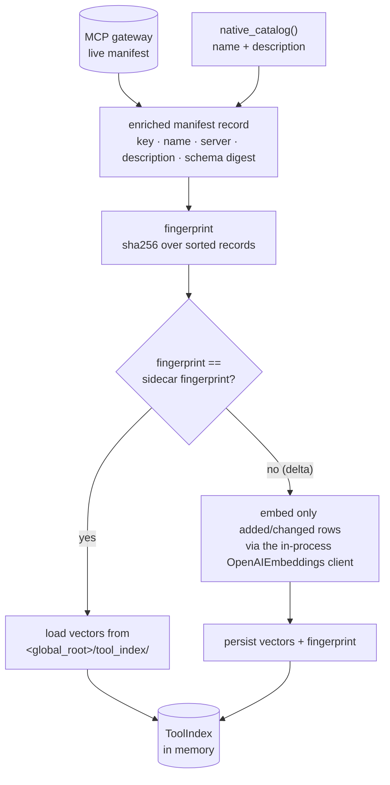
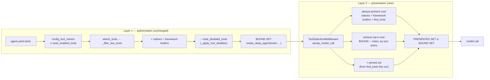

# Tool RAG (dynamic tool selection)

> **Status:** Not started
> **TODO source:** New Features → "Tool RAG (dynamic tool selection): stop sending every tool schema into context as the MCP catalog grows. Embed the MCP manifests and native tool descriptions, retrieve only the top-k tools relevant to the current turn, and lazily expand when the agent asks for more. Hard constraint: the agent's declared tool set (its `agent.yaml` `tools:` minus the per-(user, agent) disabled set) stays the authoritative superset — retrieval narrows within it, never widens it."
> **Depends on:** [00-platform-restructure.md](00-platform-restructure.md) (**Done** — it established the declared-tool superset). Soft: [10-rag-via-mcp-gateway.md](10-rag-via-mcp-gateway.md) (more tools arriving through the gateway is what makes this urgent).
> **Blocks:** nothing hard. Soft-blocks [06-deep-research-mode.md](06-deep-research-mode.md) (a research agent with a wide crawl/search/extract surface is the first agent that actually feels the schema tax).
> **Services touched:** agents · dialogue_bridge (thin) · agentic_ui (thin) · rag_service (explicitly **not**)

Every tool an agent can call is sent to the model as a JSON schema on **every single model call**. That cost is invisible while an agent has eight tools and becomes the dominant fixed cost of a turn once the MCP gateway exposes a few hundred. Tool RAG makes the presented tool set a function of the turn: embed each tool's description and input schema once, retrieve the top-k relevant to what the user just asked, present only those, and give the model an explicit escape hatch — a `find_tools` meta-tool — for the case where the right tool wasn't in the top-k.

The mental model that matters most here is a two-layer separation the platform does not have today. Layer one is **authorization**: which tools this (user, agent) pair may use at all — `(declared ∪ user-enabled) − user-disabled`, resolved exactly as it is now and *bound to the compiled graph unchanged*. Layer two is **presentation**: which of those authorized tools the model is shown on a given model call. Tool RAG lives entirely in layer two. It is structurally incapable of widening layer one, because it only ever filters a list it receives — and that is the whole reason the hard constraint in the TODO is safe to guarantee rather than merely intend.

---

## 1. Goal & non-goals

**Goals.** Cut the per-model-call tool-schema payload from O(all authorized tools) to O(k) without measurably degrading tool choice. Keep the authorization superset byte-for-byte identical to today's resolution. Give the model a first-class way to ask for more tools mid-run and have them appear on the next model call, without recompiling the graph. Ship with an eval harness that can prove both halves of the claim — that context went down *and* that tool selection did not get worse — because a silent quality regression here is the failure mode that would be discovered in production, by a user, months later.

**Non-goals.** Not a change to what a user can turn on or off (the Agents tab contract in [tool-harness.md](../development/tool-harness.md) § Phase 4 is untouched). Not a way to grant an agent a tool it was never authorized for. Not applicable to LangGraph agents — their retrieval is a graph node calling `rag_service` over HTTP, not a bound tool, so they have no tool schemas to trim. Not a general-purpose vector service: no new Chroma collection, no rag_service change, no bridge migration. Not sub-agent-aware in v1 — sub-agent tool lists are today resolved from native refs only ([yaml_agent.py:119-142](../../src/agents/runtime/declarative/yaml_agent.py)), so there is nothing to narrow there yet.

---

## 2. Current state

### The authorization resolution, exactly as it runs today

The one assembly line is in `DeepAgent.build_deep_agent`, and the ordering is load-bearing:

```python
# src/agents/runtime/deep_agent.py:456
tools=self._apply_tool_disables(self.tools + self._builtin_tools()),
```

`self.tools` is populated in two steps. First, the router opens an MCP session and hands the agent the **entire** live gateway manifest — the request carries no tool list at all:

| Step | Where | Detail |
| --- | --- | --- |
| MCP session opened per stream | [router/inference.py:91-96](../../src/agents/router/inference.py) | `mcp_session_context()` → `load_mcp_tools(session)` → `agent.attach_tools(live_tools)` |
| Same on the HITL resume leg | [router/inference.py:316-318](../../src/agents/router/inference.py) | resume re-loads and re-attaches; the tool set is recomputed identically |
| Filter against declared keys | [base_agent.py:117-119](../../src/agents/runtime/base_agent.py) → [`_filter_live_tools`:132-159](../../src/agents/runtime/base_agent.py) | keeps only tools whose canonical cache key ∈ `config_tool_names`; logs `agent_tools_missing` for declared-but-absent keys |
| Empty selector = nothing | [base_agent.py:133-134](../../src/agents/runtime/base_agent.py) | `if not self.config_tool_names: return []` — a Python deep agent with no spec gets zero MCP tools |
| Base seeds selectors empty | [base_agent.py:61-66](../../src/agents/runtime/base_agent.py) | `config_tools` / `config_tool_names` are `[]`; nothing tool-related is read from `config["tools"]` (retired in migration `0016`) |

Second, `YamlDeepAgent.__init__` is the only thing that populates those selectors, and it does so from **two** sources — the spec, then the user's per-agent *enabled* set:

```python
# src/agents/runtime/declarative/yaml_agent.py:67-82
mcp_refs = [t for t in spec.tools if not t.is_native]
self.config_tools = [{"server_id": ..., "tool_name": ...} for t in mcp_refs]
self.config_tool_names = [self._build_tool_key_from_config(e) for e in self.config_tools]
user_id = (self.context or {}).get("user_id")
if user_id:
    for key in read_enabled_tools(user_id, self.name):
        if key not in self.config_tool_names:
            self.config_tool_names.append(key)
```

Native refs are resolved separately at build time ([yaml_agent.py:105-116, 153](../../src/agents/runtime/declarative/yaml_agent.py)), and the always-on builtins are appended by `_builtin_tools()` ([deep_agent.py:280-317](../../src/agents/runtime/deep_agent.py)) — `remember`, `search_past_conversations`, `present_artifact`, each behind its own gate in the native registry ([tools/registry.py:84-132](../../src/agents/runtime/tools/registry.py)).

Then subtraction, which is where the *disabled* half applies:

```python
# src/agents/runtime/deep_agent.py:336-339
disabled = read_disabled_tools(user_id, self.name) - set(NATIVE_TOOLS)
kept = [tool for tool in tools if get_tool_cache_key(tool) not in disabled]
```

Two exemptions are already structural and must stay so. **Native builtins can never be disabled** — native keys are subtracted from the disabled set at [deep_agent.py:336](../../src/agents/runtime/deep_agent.py) and rejected at the toggle endpoint ([agent_tools.py:127-134](../../src/agents/utils/agent_tools.py)), so `present_artifact` is always on. **Framework builtins can never be disabled either**, because `create_deep_agent` adds `write_todos` / `ls` / `read_file` / `write_file` / `edit_file` / `glob` / `grep` / `execute` / `task` *after* the filter runs; the reserved-name set at [deep_agent.py:37-58](../../src/agents/runtime/deep_agent.py) also drops any MCP tool that tries to shadow one ([`_apply_live_tools`:644-669](../../src/agents/runtime/deep_agent.py)).

The invariant, stated once so section 3 can hold it: **`effective = (declared_mcp ∪ user_enabled) − user_disabled`, plus gated natives, plus framework builtins added downstream of every filter.** Persisted in `<agent_root>/tool_prefs.json` v2, read fail-open ([tool_prefs.py:55-77](../../src/agents/runtime/filesystem/tool_prefs.py)), written atomically ([tool_prefs.py:93-112](../../src/agents/runtime/filesystem/tool_prefs.py)).

### What the manifest cache actually holds

This is the single biggest gap for Tool RAG. The in-process manifest cache is a plain module-level dict:

| Fact | Where |
| --- | --- |
| `_MCP_TOOL_MANIFEST_CACHE: Dict[str, ToolManifest]` | [mcp_tools.py:18](../../src/agents/utils/mcp_tools.py) |
| Record shape | `ToolManifest{server_id, tool_name, description, parameter_count}` — [schemas.py:165-169](../../src/agents/schemas.py) |
| **No input schema is retained** | `_build_manifest` reads `tool.inputSchema` only to *count* properties ([mcp_tools.py:88-96](../../src/agents/utils/mcp_tools.py)) and then discards it |
| Canonical key | `_make_cache_key(server, name)` → `"<server>/<name>"`, bare name when server-less ([mcp_tools.py:74-80](../../src/agents/utils/mcp_tools.py)) |
| `server_id` is *inferred*, not reported | the gateway does not prefix names, so a hardcoded override table maps name → server ([mcp_tools.py:19-30](../../src/agents/utils/mcp_tools.py)) |
| Cache is primed only by `list_mcp_tools()` | [mcp_tools.py:177-191](../../src/agents/utils/mcp_tools.py); `_prime_manifest_cache` rebuilds the whole dict ([mcp_tools.py:110-127](../../src/agents/utils/mcp_tools.py)) |
| **No TTL, no invalidation signal, and nothing ever forces a refresh** | once warm and `MCP_MANIFEST_CACHE_ENABLED=true` ([settings.py:119-123](../../src/agents/core/settings.py)), `list_mcp_tools()` logs `mcp_tools_cache_hit` and **returns `[]`** ([mcp_tools.py:182-184](../../src/agents/utils/mcp_tools.py)). `force_refresh=True` exists but **no call site in `src/` passes it** — both warmers call it bare ([router/catalog.py:44](../../src/agents/router/catalog.py), [router/agent_tools.py:35](../../src/agents/router/agent_tools.py)). In practice the first successful fetch wins for the process lifetime; a gateway that gains or loses a tool is only picked up on restart. |
| Replacement is wholesale, not a merge | `_prime_manifest_cache` rebinds the whole dict in one statement ([mcp_tools.py:127](../../src/agents/utils/mcp_tools.py)) — readers see the old or the new map, never a torn one |
| The per-stream loader does **not** warm it | `load_mcp_tools(session)` (langchain-mcp-adapters) is a different code path; only `list_mcp_tools()` primes the manifest cache — which is why the Agents-tab *available* list is empty on a cold cache ([tool-harness.md § Sharp Edges](../development/tool-harness.md)), and why nothing MCP-related runs in the lifespan at all |
| Disabling the cache breaks the catalog | with `MCP_MANIFEST_CACHE_ENABLED=false`, `list_mcp_tools()` hits the gateway every call and **never populates** the cache ([mcp_tools.py:187](../../src/agents/utils/mcp_tools.py)), so the Agents-tab *available* list silently goes empty |

The override table also tells us the live catalog today: `tavily-search`, `tavily-extract`, `tavily-crawl`, `tavily-map`, `search_papers`, `download_paper`, `read_paper`, `list_papers` — eight tools across two servers (`--servers=tavily,arxiv-mcp-server` in [docker-compose-mcp.yaml](../../src/docker-compose-mcp.yaml)). That number is the honest starting point for this plan and section 12 returns to it.

### Embedding capability that already exists

The agents service already owns an OpenAI embedding client and exposes it internally — it was built so the bridge (which has no OpenAI key) could embed conversation messages:

| Fact | Where |
| --- | --- |
| `POST /embed`, batch, `require_internal_caller` | [router/embeddings.py:42-79](../../src/agents/router/embeddings.py) |
| Client built once, `lru_cache(maxsize=1)` | [router/embeddings.py:25-39](../../src/agents/router/embeddings.py) |
| Model / dims | `text-embedding-3-small`, 1536 — [settings.py:294-298](../../src/agents/core/settings.py) |
| Registered in the app | [main.py:33, 257](../../src/agents/main.py) |

So the embedding half needs **no new dependency, no new hop, and no new secret** — the code that would build a tool index lives in the same process as the client that embeds it and the cache that holds the manifests.

The bridge's pgvector store is the *other* precedent, and it is deliberately not the model to copy: `message_embeddings` is `vector(1536)` with an HNSW `vector_cosine_ops` index created by migration `0010`, written by a background sweeper and read by an internal endpoint the agents service calls back into ([conversation-embeddings.md](../flows/conversation-embeddings.md)). It exists because the corpus is unbounded and user-scoped. A tool catalog is neither.

### What rag_service can and cannot do

`rag_service` exposes exactly three endpoints, all `require_internal_caller`: `POST /retrieve/{collection_name}` ([main.py:94-134](../../src/rag_service/main.py)), `GET /excel/{table}/schema` ([main.py:140](../../src/rag_service/main.py)), `POST /excel/{table}/query/sql` ([main.py:155](../../src/rag_service/main.py)). Retrieval opens a Chroma HTTP client per call and reads a **pre-populated** collection. Its own README says so twice — "It does not: ingest documents into Chroma" ([README.md:18-23](../../src/rag_service/README.md)) — and the only request models in the service are `Query{query, k}` and `ExcelSQLQuery{sql}` ([schemas.py:3-10](../../src/rag_service/schemas.py)). Population happens in a notebook, out of band. It is also contractually agent-agnostic. It cannot host this index without inventing an ingest API and breaking that contract.

One more reason to keep this out of rag_service: **it embeds with a different model at a different dimension.** `embeddings_model` is a module-level `OpenAIEmbeddings(model="text-embedding-3-large")` with no `dimensions=` argument and no env var ([core/chroma.py:7-10](../../src/rag_service/core/chroma.py)) — 3072 dims, against the agents/bridge path's `text-embedding-3-small` at 1536. Two incompatible embedding configurations already coexist in this platform. Building the tool index in the agents service, on the `/embed` client, picks the 1536 side deliberately rather than inheriting a third variant.

### The agents service has no local vector capability

There is no `chromadb`, `faiss`, or similarity-search code anywhere under `src/agents/` outside the skills registry's unrelated scripts; `numpy` is not a direct dependency (it arrives transitively via `pytrends` → `pandas` in [requirements.txt](../../src/agents/requirements.txt)). The lifespan hook where an index could be built already does four things in order — seed skills, rebuild the global skill manifest, reconcile per-user manifests, seed declarative agents + `refresh_registry()` — then opens the durable checkpointer and starts the retention loop ([main.py:201-243](../../src/agents/main.py)). It is the natural home for a fifth step and has an established "best-effort background loop that never takes the service down" pattern (`run_workspace_retention_loop`, [main.py:227-229](../../src/agents/main.py)).

### The middleware seam

Middleware is per-implementation and composed on the instance: `default_middleware(model, backend)` returns `[ToolErrorMiddleware(), build_summarization_middleware(model, backend)]` ([deep_agent.py:266-277](../../src/agents/runtime/deep_agent.py)), an agent may override it, and `build_deep_agent` force-guarantees `ToolErrorMiddleware` on the agent and every dict-shaped sub-agent ([deep_agent.py:351-361, 444-451](../../src/agents/runtime/deep_agent.py)). The one middleware we wrote uses the `AgentMiddleware` `wrap_tool_call` / `awrap_tool_call` hooks from `langchain.agents.middleware.types` ([tool_error.py:12-43](../../src/agents/runtime/middlewares/tool_error.py)), against `langchain==1.3.9` / `deepagents==0.6.10`.

---

## 3. Target design

### Where the index lives: in-process in the agents service, persisted to the global volume

The decision follows from three facts already on the table. The manifest cache is in the agents process. The embedding client is in the agents process. The corpus is O(10²–10³) rows of a few hundred tokens each. At that size an exact cosine scan over a dense matrix is *faster* than any approximate index and needs no index at all — a 1000 × 1536 float32 matmul against one query vector is well under a millisecond. Adding a network hop (to the bridge's pgvector or to a new Chroma collection) to answer a sub-millisecond question on the hot path of every model call would be strictly worse on latency, availability, and blast radius.

So: a `runtime/tool_index/` package holding an in-memory `ToolIndex` (keys, texts, a stacked vector matrix) plus a JSON+`.npy` sidecar under `<global_root>/tool_index/` so a container restart re-embeds nothing. Never per-user: the *index* is the union of everything the gateway exposes plus the native catalog, and **user scoping happens at query time by intersecting with the caller's authorized set**, never by holding a per-user index.



**Refresh ownership is the fingerprint, not a TTL.** The index owner asks for the enriched manifest, hashes it, and compares. Same hash → reuse. Different hash → embed only the rows whose text changed and keep the rest. This means the index is correct by construction after a gateway restart, a new MCP server, or a tool whose description was reworded — and it costs one hash of a few hundred short strings to check. A refresh runs (a) once in the lifespan after `refresh_registry()`, (b) on the same background cadence as the existing retention loop, and (c) on demand from the internal refresh endpoint in § 5. The existing manifest cache must gain a real refresh path for this to work at all: today `list_mcp_tools()` short-circuits forever once warm ([mcp_tools.py:182-184](../../src/agents/utils/mcp_tools.py)), so the index owner calls it with `force_refresh=True` on its own schedule.

**The embedded text per tool** is the thing quality lives or dies on. One line of `description` is a weak signal; `parameter_count` is useless. Each record embeds a small composed document: the tool name (split on `-`/`_` so `tavily-crawl` contributes the tokens "tavily crawl"), the server id, the full description, and the *parameter names + their descriptions* from `inputSchema`. That last part requires retaining `inputSchema` in the manifest record — an additive change to `ToolManifest` and `_build_manifest` ([mcp_tools.py:83-107](../../src/agents/utils/mcp_tools.py)) that the Agents tab ignores.

### Where retrieval sits in the request lifecycle: strictly downstream of authorization

The superset stays bound to the compiled graph, unchanged. Narrowing happens in a new middleware on the model-call hook, which receives the bound tool list and returns a subset of it.



Why the model-call hook rather than build time. Build time would work for a single-shot narrowing, but it has two defects that matter: the query would have to be the run's opening user message even on turn 40 of a long agentic loop, and re-widening after `find_tools` would require recompiling the graph mid-run. The model-call hook narrows per call, so the retrieval query can be the *recent* conversation tail rather than the opening line, and lazy expansion is a set mutation instead of a rebuild.

**Why the invariant is structural, not aspirational.** The middleware's only input is the tool list already bound to the graph, and its only operation is a filter. It has no access to the manifest cache's untrimmed contents at that point, no access to `read_enabled_tools`, and no path back into `config_tool_names`. To widen the authorized set, someone would have to change layer one — which is exactly where the existing tests and the Agents-tab contract already live. This is worth codifying as a test that asserts `presented ⊆ bound` over randomized inputs, and as a comment at the middleware's single filter site.

**A deliberate consequence: presented ⊂ bound means an un-presented tool is still executable.** If the model calls a tool it saw two turns ago but that is not in this call's presented set, LangChain still dispatches it — because it is bound. This is correct and desirable: authorization did not change, and the alternative (erroring) would turn a narrowing heuristic into a functional regression. It must be documented so nobody "fixes" it.

### What is always presented

Retrieval never decides these:

| Class | Always presented | Why |
| --- | --- | --- |
| Framework builtins (`write_todos`, `ls`, `read_file`, `write_file`, `edit_file`, `glob`, `grep`, `task`, `execute`) | yes | They are the agent's ability to plan, read, write, and delegate. Hiding `write_todos` for a turn breaks the plan snapshot the UI renders; hiding `task` breaks sub-agents. They also enter *after* every filter ([deep_agent.py:453-469](../../src/agents/runtime/deep_agent.py)), so they are not the middleware's to remove in the first place — the middleware must recognize and pass them through by reserved name ([deep_agent.py:37-58](../../src/agents/runtime/deep_agent.py)). |
| Native builtins (`remember`, `search_past_conversations`, `present_artifact`) | yes | Three tools, already gated by preference. `present_artifact` in particular must be callable at the *end* of a long run, when the turn text is about the topic and not about presenting — precisely the case retrieval would get wrong. |
| `find_tools` | yes | The escape hatch is worthless if it can itself be retrieved away. |
| MCP tools | retrieved | The only class that scales, and the only class this plan narrows. |

The always-present floor is therefore ~13 schemas. Below roughly twice that in total authorized tools, Tool RAG cannot save anything — see § 12.

### The lazy-expand mechanic: `find_tools` as a native tool

`find_tools(query: str, limit: int = 5)` is registered in the native registry ([tools/registry.py:70-75](../../src/agents/runtime/tools/registry.py)) with `auto_attach=True`, gated on Tool RAG being enabled for the run. Its builder closes over the run's **authorized key set** and a mutable per-run pin set. Calling it:

1. Embeds `query`, scans the index, intersects with the authorized set, and returns the top matches as `name — description` lines plus a note that they are now available.
2. Adds those keys to the run's pin set.
3. Returns text only. The next model call's `awrap_model_call` unions the pin set into the presented set, so the tool the model asked for is there when it looks.

This is a *one-hop* expansion, not a re-plan: the model asks, gets told, and calls the tool on its next turn. The alternative designs and why they lose:

| Alternative | Why not |
| --- | --- |
| Re-plan hop (interrupt the loop, re-retrieve, restart the model call) | Costs an extra model round-trip and needs graph surgery; `find_tools` gets the same outcome using the loop the agent already runs. |
| Return the tool's full JSON schema from `find_tools` and let the model construct the call inline | Puts a schema into a `ToolMessage` where the model can only imitate it, not be validated against it. Malformed args become a tool error instead of a schema violation. |
| Expose the whole catalog as a searchable resource with no pinning | The model would re-search every turn; pinning is what makes the second use of a tool free. |

Pins are per-run and live on the middleware instance (one agent instance per request — [conversation-embeddings.md § Sharp Edges](../flows/conversation-embeddings.md) documents that invariant and its fragility). They deliberately do **not** persist across turns: a conversation that needed `tavily-crawl` on turn 3 should re-earn it on turn 40 through retrieval, not carry an ever-growing pin set that defeats the point. They *do* need to survive a HITL resume within the same run, because the resume leg rebuilds the agent ([router/inference.py:313-320](../../src/agents/router/inference.py)) — so the pin set is seeded from the run's own event log or, more simply, re-derived by retrieval on the resume leg, accepting one turn of re-search.

### Cache-key discipline

Every set in this design is keyed by the same canonical cache key that `tool_prefs.json`, `_apply_tool_disables`, `config_tool_names`, and the Agents tab already use: `get_tool_cache_key(tool)` / `build_tool_cache_key(server, name)` → `"<server>/<name>"`, bare name for server-less and native tools ([mcp_tools.py:74-80, 140-148](../../src/agents/utils/mcp_tools.py)). Index rows, pin sets, presented sets, and eval fixtures all use it. Two consequences to respect:

- **`server_id` is inferred from a hardcoded table** ([mcp_tools.py:19-30](../../src/agents/utils/mcp_tools.py)). A new MCP server whose tools are not in that table gets a *bare-name* key. That is already true today for the disable/enable sets; the index inherits it. The index fingerprint must therefore include the server id it resolved, so that adding a tool to the override table invalidates and re-embeds the affected rows rather than leaving a stale key.
- **The embedding-model identity is part of the sidecar key.** `(EMBEDDING_MODEL, EMBEDDING_DIMENSIONS, index_schema_version, manifest_fingerprint)` — changing the model must invalidate everything, exactly as the bridge's fixed-dimension DDL forces a full re-embed ([conversation-embeddings.md § Sharp Edges](../flows/conversation-embeddings.md)).

---

## 4. Data model & migrations

**No Alembic migration. No new table. No new column.** This is a deliberate and slightly unusual answer, so it is stated explicitly: the tool index is derived state over an external manifest, it is cheap to rebuild from scratch, and it belongs to the service that owns the manifest. Putting it in the bridge's Postgres would (a) require the bridge to learn about MCP tools, which it deliberately does not, and (b) put a network hop on the hot path. The current alembic head stays `0016_retire_enabled_tools`.

On-disk layout on the agents global volume (same volume the skills registry and declarative agents are seeded into — [agent_seed.py:34-84](../../src/agents/runtime/declarative/agent_seed.py)):

```text
<global_root>/tool_index/
  meta.json      # {version, embedding_model, dimensions, fingerprint, built_at, row_count}
  rows.json      # ordered [{key, name, server_id, source: "mcp"|"native", text, text_sha}]
  vectors.npy    # float32 (row_count, dimensions), row order == rows.json
```

Written atomically (temp file + `os.replace`, the pattern `write_tool_prefs` already uses — [tool_prefs.py:96-105](../../src/agents/runtime/filesystem/tool_prefs.py)). Read fail-open: a missing, truncated, or version-mismatched sidecar means "rebuild", never "crash" and never "silently run with a stale index". If the rebuild itself fails — gateway down, OpenAI down — the run proceeds with `TOOL_RAG` **disabled for that run**, presenting the full authorized set. Fail-*open on presentation* is the right stance here precisely because presentation is not a security boundary; the security boundary is layer one and it is unaffected.

The one additive schema change is in-memory only: `ToolManifest` ([schemas.py:165-169](../../src/agents/schemas.py)) gains `input_schema: dict = {}`, populated in `_build_manifest` ([mcp_tools.py:83-107](../../src/agents/utils/mcp_tools.py)). `AgentToolRow` and the Agents-tab response are untouched.

---

## 5. API surface

Almost nothing new is user-facing. Three internal endpoints, all `require_internal_caller` (and therefore also 404'd at the nginx edge, like `/v1/internal/` on the bridge — [conversation-embeddings.md § Sharp Edges](../flows/conversation-embeddings.md)):

| Method | Path (agents) | Purpose | Notes |
| --- | --- | --- | --- |
| `POST` | `/tools/index/refresh` | Force a manifest re-fetch + delta re-embed; returns `{fingerprint, rowCount, embedded, reused}` | Operational lever for "we added an MCP server and don't want to restart". Idempotent. Rate-limited by a process lock so two concurrent calls don't double-embed. |
| `GET` | `/tools/index` | Index health: `{version, model, dimensions, fingerprint, rowCount, builtAt, stale}` | Feeds the health check and the eval harness. Metadata only — never vectors. |
| `POST` | `/tools/retrieve` | Debug/eval: `{query, authorizedKeys[], limit}` → ranked `{key, score}` | **Requires an explicit `authorizedKeys` list** rather than a `(user, agent)` pair, so the endpoint physically cannot be used to discover what a user may call. Eval-harness only. |

New router file `src/agents/router/tool_index.py`, registered with `include_router` in [main.py:256-259](../../src/agents/main.py); business logic in `src/agents/utils/tool_index.py` per the service layering rule.

Bridge side: no new endpoint is required for v1. If the Agents tab later shows retrieval state, the existing proxy `GET /v1/agents/{user}/{slug}/tools` ([dialogue_bridge/router/agent_tools.py](../../src/dialogue_bridge/router/agent_tools.py)) grows optional fields on `AgentToolRow` — additive, and note that the frontend's field-whitelisted `transformMessage`-style mappers mean a new field is dropped client-side until it is added to the transform *and* the Zod contract.

New settings in [`src/agents/core/settings.py`](../../src/agents/core/settings.py) (a `ToolRagSettings` block, mirroring `SummarizationSettings`):

| Env var | Default | Meaning |
| --- | --- | --- |
| `TOOL_RAG_ENABLED` | `false` | Master switch. **Off by default until the eval harness says otherwise** (§ 8 Phase 4). |
| `TOOL_RAG_TOP_K` | `8` | MCP tools presented per model call, before pins. |
| `TOOL_RAG_MIN_SCORE` | `0.20` | Cosine floor; below it a candidate is dropped even if it is in the top-k. |
| `TOOL_RAG_MIN_CATALOG_SIZE` | `40` | Below this many authorized MCP tools, narrowing is a no-op — the floor of always-present schemas makes savings negative. |
| `TOOL_RAG_QUERY_TAIL_MESSAGES` | `4` | How much of the conversation tail forms the retrieval query. |
| `TOOL_RAG_MAX_DESCRIPTION_CHARS` | `2000` | Cap per tool description entering the embedded text (anti-stuffing, § 9). |
| `TOOL_RAG_REFRESH_INTERVAL_MINUTES` | `30` | Background fingerprint check cadence. |

---

## 6. Frontend surface

Nothing is required. Tool RAG is invisible when it works, and `find_tools` renders as an ordinary tool step through the existing pipeline — the normalizer emits the full `TOOL_CALL_START`/`ARGS`/`RESULT`/`END` lifecycle for any tool that is not one of the specially-handled ones ([normalizer.py:25-37](../../src/agents/runtime/agui/normalizer.py)), the bridge logs it into `raw_events`, and the timeline reducer folds it into a tool card.

Two optional, clearly-scoped surfaces if we want them later:

- **A distinct `find_tools` affordance.** A "searched for tools" card instead of a generic tool step needs the full new-event ritual: a payload model in [agui/events.py](../../src/agents/runtime/agui/events.py), an emitter method in [agui/emitter.py](../../src/agents/runtime/agui/emitter.py), synthesis in the normalizer (deep agents stream only `["messages", "updates"]` — there is no custom channel, which is why `PRESENT_ARTIFACT` is *synthesized from the tool call by name*, [present_artifact.py:10-15](../../src/agents/runtime/tools/present_artifact.py) and [normalizer.py:386-410](../../src/agents/runtime/agui/normalizer.py)), a Zod schema joined into `CustomAguiEventSchema` ([features/inference/agui.ts:155](../../src/agentic_ui/src/features/inference/agui.ts)), a reducer branch alongside the existing `TOKEN_USAGE` / `PRESENT_ARTIFACT` / `HITL_INTERRUPT` branches ([features/inference/timeline.ts:698-761](../../src/agentic_ui/src/features/inference/timeline.ts)), and a card under `features/chat/components/message_parts/`. Not worth it for v1.
- **An Agents-tab hint.** The existing tab lists declared and available MCP tools with an optimistic toggle ([AgentsTab.tsx](../../src/agentic_ui/src/features/settings/components/profile_parts/AgentsTab.tsx)). A single line — "N tools authorized; the agent is shown the most relevant ~k each turn" — would prevent the support question "I enabled the tool and it didn't use it". Cheap, and worth doing at the same time as flipping the default on.

---

## 7. Cross-cutting impact

**agents runtime — the real blast radius.** `build_deep_agent` gains one middleware in `default_middleware`, which means every deep agent that *overrides* `default_middleware` silently opts out of Tool RAG. That is either a feature or a trap; it must be made explicit the same way `ToolErrorMiddleware` is force-guaranteed at [deep_agent.py:415](../../src/agents/runtime/deep_agent.py) — either guarantee it too, or document that overriding opts out. Sub-agents get their middleware guaranteed separately ([deep_agent.py:444-451](../../src/agents/runtime/deep_agent.py)) and are out of scope in v1 because their MCP tools are not wired at all yet ([yaml_agent.py:124-132](../../src/agents/runtime/declarative/yaml_agent.py) logs `yaml_subagent_mcp_tools_ignored`). `_build_manifest` and `ToolManifest` gain a field. `list_mcp_tools` gains a real refresh caller. The lifespan gains a fifth bootstrap step and a second background loop. `native_catalog()` gains a row, which flows into the bridge's catalog surface — and `_native_keys()` in [agent_tools.py:40-43](../../src/agents/utils/agent_tools.py) automatically protects `find_tools` from ever entering a user override set, which is the correct outcome for free.

**dialogue_bridge.** Nothing on the inference hot path: the bridge sends no tool list ([tool-harness.md § Phase 2](../development/tool-harness.md)) and does not need to know this happened. Two second-order effects. Token accounting gets *quieter*: `TOKEN_USAGE` input counts drop, which is a real change to the numbers on `messages.input_tokens` and therefore to the Usage tab — a step change in a metric with no explanation in the data is exactly the kind of thing that gets mis-diagnosed later, so the rollout should be dated in [observability.md](../development/observability.md). And the Agents-tab proxy is the only place a new DTO field would ride.

**AG-UI / timeline.** Zero required changes; one optional new event type with the six-step ritual above. The `find_tools` result is a `ToolMessage` and is therefore subject to the bridge's `tool_result_max_chars` truncation (16000 default, [settings.py:302-304](../../src/dialogue_bridge/core/settings.py)) — a long tool listing would be truncated in the *stored/streamed* copy only; the model still saw it all. Keep `find_tools` output compact regardless.

**Other plans.** [10-rag-via-mcp-gateway.md](10-rag-via-mcp-gateway.md) is the reason this plan matters: moving Chroma retrieval behind the gateway multiplies the MCP catalog, and its tools' descriptions become index rows automatically. [06-deep-research-mode.md](06-deep-research-mode.md) is the first consumer with a genuinely wide tool surface. [12-create-skill-tool.md](12-create-skill-tool.md) is adjacent but distinct — skills are already progressively disclosed by the deepagents `SkillsMiddleware`, which is the same idea one layer up and a useful precedent for "the model asks for detail on demand". [01-custom-agents-per-user.md](01-custom-agents-per-user.md) multiplies the number of distinct authorized sets, which is fine here because the index is global and only the query-time intersection is per-(user, agent).

**Docs.** [tool-harness.md](../development/tool-harness.md) gains a presentation-layer phase and a sharp edge about presented ⊂ bound. [configuration.md](../architecture/configuration.md) gains the `TOOL_RAG_*` block. [observability.md](../development/observability.md) gains the new log events and the token-accounting step change.

---

## 8. Phased execution

### Phase 0 — Measure, and build the eval set

Nothing ships. Add a single INFO log at the model-call boundary recording `authorized_tool_count`, `presented_tool_count`, and the serialized schema byte size, so the *current* cost is on the record. Then hand-build an eval fixture: 60–100 `(conversation tail, expected tool key)` cases drawn from real run logs plus deliberately adversarial ones (a tool implied only by an earlier turn; a request that needs two tools from different servers; a request that needs no tool at all). Synthesize a catalog of a few hundred plausible tool records so the harness can measure at the size this feature is *for*, not the eight tools we have.

*Acceptance:* the baseline schema-byte number per model call is logged and recorded in the plan; the fixture is committed under `tests/agents/` with a documented provenance for each case.

### Phase 1 — The index, built but never consulted

`runtime/tool_index/` with the record enrichment (`ToolManifest.input_schema`), the composed embedded text, the fingerprint, the delta embed, the atomic sidecar, and the lifespan + background refresh. `list_mcp_tools(force_refresh=True)` wired to the index owner. `GET /tools/index` and `POST /tools/index/refresh`.

*Acceptance:* cold boot builds the index and logs row count + embed count; a second boot reuses the sidecar and embeds zero; adding a tool to the seeded catalog re-embeds exactly one row; a corrupt sidecar triggers a clean rebuild; `GET /tools/index` reports a fingerprint that matches a re-computed one. **Zero behavioural change to any run** — provable because no run-path file is touched in this phase except the additive manifest field.

### Phase 2 — Narrowing, default off

`ToolSelectionMiddleware` with `awrap_model_call`, the always-present floor by reserved/native name, the `TOOL_RAG_MIN_CATALOG_SIZE` no-op guard, and the `presented ⊆ bound` assertion. Added to `default_middleware`. Fail-open on any index or embedding error.

*Acceptance:* with `TOOL_RAG_ENABLED=false` the presented set is byte-identical to the bound set on every model call (property test). With it on and a synthesized 300-tool catalog, presented count is ≤ floor + k, the property test still holds over randomized authorized sets, and a forced index failure degrades to the full set with one warning and no run failure. A run with a *disabled* tool never sees it in either layer.

### Phase 3 — `find_tools` and pinning

The native tool, its registry entry gated on `TOOL_RAG_ENABLED`, the per-run pin set, and the union into the presented set on the next model call.

*Acceptance:* a scripted run whose needed tool is deliberately outside the top-k completes successfully via one `find_tools` hop; the pinned tool is present on the following model call and stays present for the rest of the run; `find_tools` cannot return a key outside the authorized set (test with an authorized set of one against a catalog of many); a user-disabled tool is never returned; `find_tools` cannot be entered into `tool_prefs.json` by the toggle endpoint.

### Phase 4 — Eval, tune, then flip the default

Run the harness across `k ∈ {4, 6, 8, 12}` and `min_score ∈ {0.1, 0.2, 0.3}`, on both the real eight-tool catalog and the synthesized large one. Report recall@k for the expected tool, the false-expansion rate (`find_tools` called when the tool *was* in the top-k), the end-to-end task success rate on a smaller behavioural subset, and the schema-byte savings. Flip `TOOL_RAG_ENABLED=true` only if savings are material **and** recall@k plus task success are within noise of the baseline.

*Acceptance:* a committed report table with those four numbers per configuration; a documented chosen configuration; the default flipped in the same commit as the report, or the plan honestly marked "measured, not worth it yet".

### Phase 5 — Surface and hygiene (optional)

The Agents-tab explanatory line, the optional distinct `find_tools` event, and a per-run summary log of `presented_avg / authorized / find_tools_calls` for ongoing monitoring.

---

## 9. Security & privacy

The load-bearing security claim is that **Tool RAG cannot change what an agent is authorized to call**, and the design makes that checkable rather than argued: layer one is untouched, layer two receives an already-authorized list and only filters, and a property test asserts `presented ⊆ bound` over randomized inputs. `find_tools` closes over the authorized key set and intersects before returning, so it cannot even *name* an unauthorized tool — which matters because naming one would be an information leak about the deployment's catalog, not just a dead end.

**Untrusted text enters a new place.** MCP tool descriptions come from external servers behind the gateway. Today they reach the model as tool schemas; with this plan they additionally (a) become embedded index rows and (b) can be echoed back to the model inside a `find_tools` `ToolMessage`. Two mitigations. Cap the description at `TOOL_RAG_MAX_DESCRIPTION_CHARS` before it enters either the embedded text or a `find_tools` result, so a server cannot stuff a 200 KB "description" into every turn. And frame the `find_tools` result as clearly delimited untrusted listing data — the same discipline any retrieved content needs, and the reason the superset gate is the real defense: a description that says "you may also call `delete_everything`" is inert, because that tool is not bound.

**Retrieval-ranking denial of service** is the subtler version: a hostile or merely verbose server could write descriptions that win the top-k on every query and crowd out legitimate tools. This degrades quality, not authorization, and `find_tools` gives the model a way out. The structural answer is that the gateway's server list is operator-controlled (`--servers=…` in the compose), so this is an insider-grade concern; the practical answer is the per-run log of presented keys, which makes crowding visible.

**No user data in the index.** Rows are tool metadata only — no user ids, no conversation content, nothing per-user on disk. The index is world-readable *within* the agents container by design, which is safe because it contains only what the gateway already advertises. The query text, by contrast, *is* user content: it is a conversation tail sent to OpenAI's embedding endpoint. That is not a new data flow (message embeddings already do exactly this, and the same `EMBEDDINGS_ENABLED`-style respect for private conversations must apply), but it is a new *frequency* — once per model call rather than once per message. It must be logged as an event count, never with content, per the redaction rules in [observability.md](../development/observability.md).

**Endpoints.** All three new endpoints are `require_internal_caller` and must be covered by the nginx `/api/v1/internal/`-style edge deny if they are ever proxied. `POST /tools/retrieve` deliberately takes an explicit `authorizedKeys` array instead of `(user_id, agent_slug)` so that even an internal caller cannot use it to enumerate a user's authorized set. `POST /tools/index/refresh` is a cheap-to-call, expensive-to-serve endpoint and therefore needs a process-level lock plus a minimum interval, so a loop of calls cannot become an OpenAI spend amplifier.

**Fail-closed vs fail-open, stated deliberately.** Authorization fails closed (unchanged: a corrupt `tool_prefs.json` yields the declared baseline, [tool_prefs.py:55-61](../../src/agents/runtime/filesystem/tool_prefs.py)). Presentation fails *open* — index missing, embedding provider down, fingerprint stale — because the failure mode of failing closed would be an agent that mysteriously has no tools. Presentation is not a security boundary, and pretending it is would trade a real outage for no security gain.

---

## 10. Testing strategy

The property test is the centrepiece: for randomized (bound set, authorized set, query, pin set) inputs, `presented ⊆ bound`, the always-present floor is always in `presented`, and no user-disabled key is ever in `presented`. Everything else supports it.

| Layer | Test | Notes |
| --- | --- | --- |
| Index build | fingerprint stability, delta embed count, atomic write, corrupt/truncated/version-mismatch sidecar → rebuild | `tests/agents/test_tool_index.py`, with the embedding client faked (never a live OpenAI call in CI) |
| Embedded text | composition is deterministic and includes name tokens, server, description, param names; over-long description is capped | pure function, trivially unit-testable |
| Middleware | the property test; the `MIN_CATALOG_SIZE` no-op; fail-open on index error; `TOOL_RAG_ENABLED=false` is byte-identical to today | `tests/agents/test_tool_selection_middleware.py` |
| `find_tools` | never returns an unauthorized or disabled key; pins land in the next presented set; ignored by `toggle_agent_tool` | reuses the `_native_keys()` protection at [agent_tools.py:127-134](../../src/agents/utils/agent_tools.py) |
| Eval harness | recall@k, false-expansion rate, task success, schema bytes — over both the real and synthesized catalogs | `tests/agents/eval/tool_rag/`; runnable on demand, not in CI (it costs model calls) |
| Regression | the existing Agents-tab list/toggle tests must pass untouched — the user-facing contract did not change | proof that layer one was not disturbed |

Two environment realities to respect. The agents test suite needs `deepagents 0.6.10`, which the host does not have — validate with `py_compile` plus in-container runs. And the eval harness makes real model calls, so it is an explicit `make`-style target with a documented cost, never a CI gate.

---

## 11. Docs to update

| Doc | Change |
| --- | --- |
| [docs/development/tool-harness.md](../development/tool-harness.md) | A new phase for the presentation layer between build-time assembly and the user-override phase; the four-classes table gains an "always presented" column; sharp edges for presented ⊂ bound (an un-presented tool is still executable) and for `find_tools` being un-disable-able |
| [docs/architecture/configuration.md](../architecture/configuration.md) | The `TOOL_RAG_*` block, with the "off by default until measured" note |
| [docs/development/observability.md](../development/observability.md) | New log events (`tool_index_built`, `tool_index_reused`, `tool_selection_narrowed`, `tool_rag_degraded`, `find_tools_called`); the dated step change in `TOKEN_USAGE` input counts |
| [docs/architecture/overview.md](../architecture/overview.md) | The `tool_index/` directory on the agents global volume; the new internal endpoints |
| [docs/development/retrieval-and-tools.md](../development/retrieval-and-tools.md) | A pointer that tool *selection* retrieval is distinct from document retrieval and lives in the agents service |
| [docs/plans/README.md](README.md) | Status transition when phases land |
| `CLAUDE.md` | Image-tag table row for `agents` on each push |

---

## 12. Risks & open decisions

**The honest headline: today this saves nothing.** The live catalog is eight MCP tools across two servers. Against an always-present floor of roughly thirteen framework + native + `find_tools` schemas, narrowing eight tools to eight tools is a rounding error, and adding `find_tools` makes the payload marginally *larger*. That is why `TOOL_RAG_MIN_CATALOG_SIZE` exists and defaults to a value the current deployment does not reach: the feature is inert until it is needed. The risk this creates is real — a complex mechanism, on the hot path, whose benefit cannot be observed in production until [10-rag-via-mcp-gateway.md](10-rag-via-mcp-gateway.md) lands. Building it against a *synthesized* large catalog in the eval harness is the mitigation, and accepting "measured, not worth it yet" as a legitimate Phase 4 outcome is the discipline.

**Retrieval on the wrong signal.** Turn text is a proxy for tool need, and sometimes a bad one. "Now send that to the team" needs an email tool that the words barely imply; a multi-step plan formed on turn 1 may need a tool whose trigger appears on turn 9; and the *first* model call of a conversation has the least context and the most consequence, because that is where the plan is written. `find_tools` covers the miss only if the model reliably reaches for it — and a model that has been shown a plausible-but-wrong tool will often use it instead of asking for a better one. This is the single most likely way the approach fails, it will not show up in a unit test, and the only real detector is the behavioural half of the eval plus the false-expansion rate.

**A one-line description is a thin embedding.** MCP descriptions vary wildly in quality; some are a sentence fragment. Embedding name + server + description + parameter names helps, but the ceiling is set by what the server author wrote. If recall@8 is poor at Phase 4, the fix is probably not a bigger k — it is a generated description (an LLM-written summary per tool, cached in the index and re-generated on fingerprint change), which is a whole extra mechanism and a whole extra failure mode.

**Latency and cost on the hot path.** One embedding call per model call. Sub-100 ms typically, but it is a new external dependency in the tightest loop the platform has, and a deep agent makes many model calls per run. Mitigations: cache the query embedding when the conversation tail has not changed since the last model call (common in tool-heavy loops, where consecutive calls differ only by a `ToolMessage`); skip retrieval entirely when the presented set from the previous call is still a superset of what retrieval would return. Whether the caching is enough is genuinely open until measured.

**Middleware-override opt-out.** An agent that overrides `default_middleware` loses Tool RAG silently. Open decision: force-guarantee it like `ToolErrorMiddleware`, or treat opting out as legitimate. Leaning toward force-guaranteeing with an explicit `tool_rag: false` in `agent.yaml` as the intentional opt-out, because "silently" is the problem, not "out".

**Manifest-refresh races.** `_prime_manifest_cache` replaces the whole dict ([mcp_tools.py:110-127](../../src/agents/utils/mcp_tools.py)), and the index owner will now call `list_mcp_tools(force_refresh=True)` on a timer while streams are running. The replacement is a single rebind so a reader sees either the old or the new dict, never a torn one — but the *index* and the *cache* can disagree for a moment, which means a just-added tool might be authorized-but-unindexed. It must then be treated as always-present rather than silently unpresentable. Getting this backwards is a quiet correctness bug.

**Open decisions.**

1. **Query construction.** Last user message only, last N messages, or an LLM-rewritten retrieval query? The last is best for quality and worst for latency and cost. Default to the tail-of-N and revisit with Phase 4 numbers.
2. **Do pins survive a HITL resume?** Re-deriving by retrieval on the resume leg is simpler and costs one turn of possible re-search; reading them back from the run's event log is exact but couples the middleware to the log. Leaning simple.
3. **Should the index include *skills*?** Skills are already progressively disclosed by the deepagents `SkillsMiddleware`, so probably not — but if the skills pool grows to hundreds, the same machinery applies and building two indexes would be a mistake. Worth deciding before the row schema is frozen.
4. **Per-agent `k`.** A research agent may want a wider view than a narrow one. `agent.yaml` could carry `tool_rag: {top_k: 12}`, which means an `AgentSpec` field and therefore a schema decision made once, since `extra="forbid"` ([agent_spec.py:124](../../src/agents/runtime/declarative/agent_spec.py)) makes adding it later a hard change for any hand-written YAML.
5. **Does `find_tools` count against a run budget?** It will once [06-deep-research-mode.md](06-deep-research-mode.md) introduces a max-tool-calls ceiling. Meta-tools arguably should be exempt; that is 06's decision to make, but it should be made knowingly.

---

## 13. File map

| Concept | File | What to look for |
| --- | --- | --- |
| The one assembly line (bound set) | [src/agents/runtime/deep_agent.py](../../src/agents/runtime/deep_agent.py) | `build_deep_agent`:387-469, the `tools=` argument at :456, `_builtin_tools`:280-317, `_apply_tool_disables`:320-348 |
| Reserved framework names | [src/agents/runtime/deep_agent.py](../../src/agents/runtime/deep_agent.py) | `RESERVED_DEEPAGENT_TOOL_NAMES`:37-58, `_apply_live_tools`:644-669 |
| Middleware stack composition | [src/agents/runtime/deep_agent.py](../../src/agents/runtime/deep_agent.py) | `default_middleware`:266-277, `_ensure_tool_error_middleware`:351-361, sub-agent guarantee :444-451 |
| Live-manifest filter + cache keys | [src/agents/runtime/base_agent.py](../../src/agents/runtime/base_agent.py) | `attach_tools`:117, `_build_tool_key_from_config`:122-129, `_filter_live_tools`:132-159 |
| Declared ∪ enabled seeding | [src/agents/runtime/declarative/yaml_agent.py](../../src/agents/runtime/declarative/yaml_agent.py) | `config_tool_names` seed :67-82, `_resolve_native_tools`:105-116, `register_agent`:149-159 |
| Spec tool refs | [src/agents/runtime/declarative/agent_spec.py](../../src/agents/runtime/declarative/agent_spec.py) | `ToolRef`:37-72, `AgentSpec.tools`:140, `extra="forbid"`:124 |
| Two-set override store | [src/agents/runtime/filesystem/tool_prefs.py](../../src/agents/runtime/filesystem/tool_prefs.py) | `read_tool_prefs`:55-77, `read_enabled_tools`:86-90, `write_tool_prefs`:93-112 |
| Manifest cache + canonical key | [src/agents/utils/mcp_tools.py](../../src/agents/utils/mcp_tools.py) | `_MCP_TOOL_MANIFEST_CACHE`:18, `_TOOL_SERVER_OVERRIDES`:19-30, `_make_cache_key`:74-80, `_build_manifest`:83-107, `_prime_manifest_cache`:110-127, `list_mcp_tools`:177-191 |
| Manifest record shape | [src/agents/schemas.py](../../src/agents/schemas.py) | `ToolManifest`:165-169 (gains `input_schema`), `AgentToolRow`:318-330 |
| Native registry (where `find_tools` lands) | [src/agents/runtime/tools/registry.py](../../src/agents/runtime/tools/registry.py) | `NativeToolDef`:44-61, `register_native_tool`:70-75, `build_auto_attach_tools`:149-159, `native_catalog`:162-177 |
| Agents-tab logic (unchanged contract) | [src/agents/utils/agent_tools.py](../../src/agents/utils/agent_tools.py) | `_native_keys`:40-43, `list_agent_tools`:71-100, `toggle_agent_tool`:103-149 |
| Per-stream tool load + resume leg | [src/agents/router/inference.py](../../src/agents/router/inference.py) | `load_mcp_tools` + `attach_tools` :91-96 and :316-318 |
| Existing embedding client | [src/agents/router/embeddings.py](../../src/agents/router/embeddings.py) | `_get_embeddings`:25-39, `POST /embed`:42-79 |
| Embedding model + dims | [src/agents/core/settings.py](../../src/agents/core/settings.py) | `RuntimeModelsSettings.embedding`:297-298, `McpSettings`:119-123 |
| Lifespan bootstrap + background loop pattern | [src/agents/main.py](../../src/agents/main.py) | `_lifespan`:201-243, retention task :227-229, `include_router`:256-259 |
| Middleware API in use | [src/agents/runtime/middlewares/tool_error.py](../../src/agents/runtime/middlewares/tool_error.py) | `AgentMiddleware`, `wrap_tool_call` / `awrap_tool_call`:25-43 |
| Custom-event ritual (if a `find_tools` card is added) | [src/agents/runtime/agui/events.py](../../src/agents/runtime/agui/events.py) · [emitter.py](../../src/agents/runtime/agui/emitter.py) · [normalizer.py](../../src/agents/runtime/agui/normalizer.py) | event-name constants :7-14, `present_artifact` emitter :340, normalizer synthesis :386-410, stream modes :25-37 |
| UI event contract + reducer | [src/agentic_ui/src/features/inference/agui.ts](../../src/agentic_ui/src/features/inference/agui.ts) · [timeline.ts](../../src/agentic_ui/src/features/inference/timeline.ts) | `CustomAguiEventSchema`:155, custom-name branches :698-761 |
| Agents tab (optional hint) | [src/agentic_ui/src/features/settings/components/profile_parts/AgentsTab.tsx](../../src/agentic_ui/src/features/settings/components/profile_parts/AgentsTab.tsx) | optimistic toggle, `getAgentTools` |
| rag_service surface (why not here) | [src/rag_service/main.py](../../src/rag_service/main.py) | `POST /retrieve/{collection_name}`:94 — retrieve only, no ingest |
| pgvector precedent (why not there) | [docs/flows/conversation-embeddings.md](../flows/conversation-embeddings.md) | storage model, sweeper, internal search endpoint |
