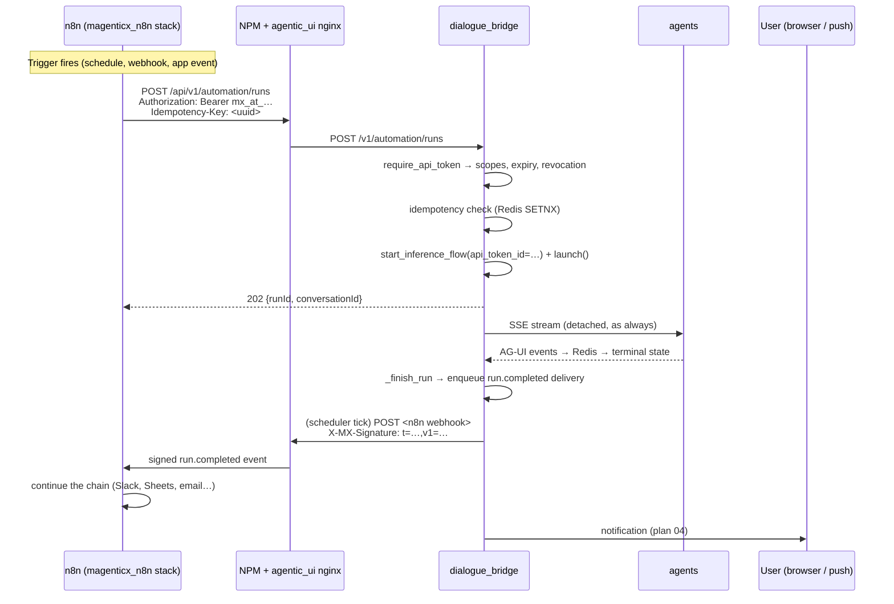

# Workflow / automation builder

> **Status:** Not started
> **TODO source:** New Features → "Workflow / automation builder: composable trigger → agent run → action chains ("every morning, run agent X over the new files in workspace Y and notify me with the summary"). Builds directly on Scheduled Tasks; instead of writing a visual editor from scratch, evaluate wiring n8n (already on the General list for Dennis) as the engine, with mAgenticX inference exposed to it as webhook nodes."
> **Depends on:** [15 · Open-source services on Dennis](15-dennis-open-source-services.md) (n8n must exist and be reachable) · soft: [04 · Notifications + PWA](04-notifications-and-pwa.md) (the "notify me with the summary" half)
> **Blocks:** nothing
> **Services touched:** dialogue_bridge · agentic_ui · agents · infra

Scheduled Tasks already answers "run agent X every morning". What it cannot do is the rest of the sentence: *over the new files in workspace Y*, and *notify me with the summary*. A scheduled task has exactly one trigger kind (a clock), exactly one action (an agent run), and no way to chain anything before or after it. This plan closes that gap — not by building a node editor, but by **splitting the problem at the seam that already exists in the codebase**: mAgenticX owns the *run* (creating it, authorising it, persisting it, attributing it to a user), and an external engine owns the *graph* (the triggers, the branches, the third-party integrations, the retries).

The mental model to hold: today a run can only be started by a human with a browser session, or by the bridge's own scheduler firing internally with no HTTP at all. There is **no third way** — no credential a machine can hold, no endpoint a machine can call. That absence is the entire technical content of this plan. Everything else (which engine, which trigger kinds, which UI) follows from designing that credential well: a **scoped, revocable, expiring, auditable API token** that can start a run on behalf of exactly one user and do nothing else. It is the first genuinely public, non-browser entry point into mAgenticX, which makes it the highest-risk single change in this plan set — and the reason § 9 is the section to read first.

---

## 1. Goal & non-goals

**Goals**

1. Deliver a **recommendation on build vs. wire n8n**, argued against real criteria, and then design the chosen path in depth (§ 3).
2. Define the **trigger taxonomy** — schedule, inbound webhook, file-arrival, email-arrival, run-completion — and say for each whether mAgenticX or the engine owns it, and why.
3. Design the **machine credential**: a scoped API token type, distinct from the session JWT, fail-closed, per-token scopes, mandatory expiry, rotation, revocation, and an audit trail.
4. Design the **narrow machine API surface** it unlocks (`/v1/automation/*`) — deliberately a handful of endpoints, not token auth retrofitted across the whole user API.
5. Design the **outbound direction**: mAgenticX signing and delivering events (run-completion, file-arrival) to the engine's webhooks, with retry, backoff and a circuit breaker.
6. Make automation runs **attributable and visible**: a run started by a workflow is owned by a real user, tagged, and shows up in the UI as an automation run — not as a mystery conversation.
7. **Idempotency and rate discipline** so a flapping trigger, an engine retry storm, or a loop cannot spam runs or burn tokens.

**Non-goals**

- **No visual node editor in mAgenticX.** That is the explicit instruction in the TODO and the conclusion of § 3's evaluation.
- **No re-implementation of scheduling.** `scheduled_tasks` stays the owner of clock triggers; this plan does not migrate it into the engine.
- **No new agent capabilities.** Whether an agent can *do* a thing (write a file, call Penpot) is plan [15](15-dennis-open-source-services.md) and the tool harness; this plan only starts runs and delivers events.
- **No workspace model.** "Over the new files in workspace Y" needs [03 · Projects / Workspaces](03-projects-and-workspaces.md); the file-arrival trigger is designed here but lands after 03.
- **No general-purpose public API.** The token grants a closed set of automation scopes. It is not the beginning of a customer-facing REST API and must not be documented as one.
- **No RBAC / org-level automations.** A token belongs to one user; org-shared automations wait for [02](02-org-and-user-permissions.md).

---

## 2. Current state

### Scheduled Tasks — the foundation, and its exact shape

The whole feature lives in [`utils/scheduled_tasks.py`](../../src/dialogue_bridge/utils/scheduled_tasks.py) (531 lines) plus a thin router. It is genuinely reusable, and the reasons are worth stating precisely.

**The loop.** `Scheduler` ([:473-530](../../src/dialogue_bridge/utils/scheduled_tasks.py)) is a single `asyncio` task started from the FastAPI lifespan ([`main.py:104`](../../src/dialogue_bridge/main.py), after migrations and `cleanup_orphaned_inference_runs`). `_tick` ([:509-527](../../src/dialogue_bridge/utils/scheduled_tasks.py)) does three things every `SCHEDULER_POLL_INTERVAL_SECONDS` (default 30): reap timed-out fires, claim due tasks, fire each claimed id. Every step is wrapped so one failure never kills the loop.

**The claim is the concurrency guard.** `claim_due_tasks` ([:288-319](../../src/dialogue_bridge/utils/scheduled_tasks.py)) selects due active rows `.with_for_update(skip_locked=True)`, advances `next_run_at` (or flips `status='completed'` for a spent one-off / `max_runs` / `expires_at`), and **commits before returning the ids**. `replicas: 1` is not the guard — this is, because `order: start-first` overlaps two bridge containers for ~30s on every deploy. The row lock is released before the minutes-long agent call, so the pool never starves.

**The fire is a normal run.** `fire_scheduled_task` ([:333-434](../../src/dialogue_bridge/utils/scheduled_tasks.py)) skips if a prior fire is still streaming ([:343-354](../../src/dialogue_bridge/utils/scheduled_tasks.py)), resolves the agent, builds an `InferenceStartPayload`, and calls `start_inference_flow(db=…, user=…, payload=…, scheduled_task_id=task.id)` then `inference_run_manager.launch(run_id)` ([:433-434](../../src/dialogue_bridge/utils/scheduled_tasks.py)). **No HTTP, no CSRF, no auth dependency** — it constructs the domain payload directly. That is the single most important fact for this plan: `start_inference_flow` ([`utils/inference_start.py:66-117`](../../src/dialogue_bridge/utils/inference_start.py)) is already a clean programmatic entry point with a caller-supplied provenance tag, and a second caller can reuse it verbatim.

**Cadence kinds.** `compute_next_run_at` ([:82-108](../../src/dialogue_bridge/utils/scheduled_tasks.py)) handles `one_off` (`{"run_at": iso}`), `interval` (`{"interval_seconds": n}`) and `cron` (`{"cron_expr": …}` via `_next_cron` at [:57-79](../../src/dialogue_bridge/utils/scheduled_tasks.py), evaluated in the task's IANA timezone then stored naive-UTC). Recurring kinds advance from the *actual* fire time, so a long downtime produces one catch-up fire and then resyncs — missed ticks are skipped, never backfilled.

**Target modes.** `fresh` → `mode="new"` mints a conversation per fire; `bound` → first fire mints and stores `conversation_id`, later fires use `mode="send"` against that conversation's leaf ([:371-401](../../src/dialogue_bridge/utils/scheduled_tasks.py)), which gives cross-fire memory for free via the durable checkpointer.

**Limits and lifecycle.** `max_runs` / `expires_at` / `run_count` are enforced inside the claim ([:310-316](../../src/dialogue_bridge/utils/scheduled_tasks.py)); `reap_timed_out_fires` ([:437-458](../../src/dialogue_bridge/utils/scheduled_tasks.py)) is the HITL watchdog — a headless run that hits an approval gate would hang forever because the resume signal only ever comes from a live client, so anything streaming past `SCHEDULER_RUN_TIMEOUT_SECONDS` (default 600) is cancelled and marked failed.

**The model.** `ScheduledTaskTable` ([`core/database/models.py:376-454`](../../src/dialogue_bridge/core/database/models.py)) with the partial index `ix_scheduled_tasks_due` on `next_run_at WHERE status='active'` ([:390-395](../../src/dialogue_bridge/core/database/models.py)). `last_run_message_id` is a **plain String, not an FK** ([:441-444](../../src/dialogue_bridge/core/database/models.py)) — an FK would close a `messages → scheduled_tasks → conversations → messages` cycle. The reverse tag is `messages.scheduled_task_id`, `FK … ON DELETE SET NULL`, indexed ([:285](../../src/dialogue_bridge/core/database/models.py)) — deleting a task never deletes the runs it produced. **`enabled_tools` was dropped in migration `0016_retire_enabled_tools`**: a task carries no tool list, and every fire resolves the agent's declared tools minus the owner's per-(user, agent) disables, exactly as an interactive run does ([`docs/flows/scheduled-tasks.md:55`](../flows/scheduled-tasks.md), `:145`). Chain head is `0016`.

**The API.** [`router/scheduled_tasks.py`](../../src/dialogue_bridge/router/scheduled_tasks.py) — four endpoints, all `Depends(validate_userId)`, all mutations `Depends(require_csrf_protection)` ([:53](../../src/dialogue_bridge/router/scheduled_tasks.py), [:78](../../src/dialogue_bridge/router/scheduled_tasks.py), [:101](../../src/dialogue_bridge/router/scheduled_tasks.py)). Routers stay thin; all logic is in utils.

**Its stated gaps** ([`scheduled-tasks.md:140-146`](../flows/scheduled-tasks.md)): in-app polling only (no push), single replica, one trigger kind, no chaining.

### How a run is started, and what already throttles it

`create_inference_run_record` ([`utils/inference_runs.py:1356`](../../src/dialogue_bridge/utils/inference_runs.py)) enforces two ceilings that this plan inherits rather than re-invents:

- **Per-user active runs** → `429`, `MAX_ACTIVE_RUNS_PER_USER = settings.rate_limit.inference_max_active_runs` ([:50](../../src/dialogue_bridge/utils/inference_runs.py), default 5 via `INFERENCE_MAX_ACTIVE_RUNS_PER_USER` at [`core/settings.py:572`](../../src/dialogue_bridge/core/settings.py)); check at [:1387-1392](../../src/dialogue_bridge/utils/inference_runs.py).
- **One active run per conversation** → `409` ([:1399-1403](../../src/dialogue_bridge/utils/inference_runs.py), plus the `IntegrityError` catch at [:1444](../../src/dialogue_bridge/utils/inference_runs.py)).

`fire_scheduled_task` already translates both into a `skipped` outcome rather than a failure ([:412-420](../../src/dialogue_bridge/utils/scheduled_tasks.py)). Terminal state is written by `_finish_run` ([:1133](../../src/dialogue_bridge/utils/inference_runs.py)) via `_mark_run_completed` / `_cancelled` / `_failed` ([:1191-1201](../../src/dialogue_bridge/utils/inference_runs.py)) — that is the natural emit point for a run-completion trigger.

The HTTP start endpoint is `POST /v1/inference/runs/{user_id}/start` ([`router/inference.py:47-58`](../../src/dialogue_bridge/router/inference.py)) with three dependencies: `inference_rate_limit`, `validate_userId`, `require_csrf_protection`.

### The auth model — and precisely why a machine cannot use it

Auth is stateless RS256 JWTs signed via Vault Transit, delivered as HttpOnly cookies, with a Redis `sid` denylist for instant logout ([`core/auth/session.py`](../../src/dialogue_bridge/core/auth/session.py)).

Four details decide this plan's design:

1. **A bearer token is accepted, but only as a session JWT.** `_get_access_token_from_request` ([:275-280](../../src/dialogue_bridge/core/auth/session.py)) prefers `Authorization: Bearer` over the cookie, and `_parse_bearer_token` ([:262-272](../../src/dialogue_bridge/core/auth/session.py)) feeds it straight into `verify_token`. An opaque non-JWT string therefore raises `TokenError` → `401`. **Good news:** a new opaque token format cannot accidentally satisfy `require_session`. This must stay true — it is the property that keeps a leaked automation token out of the ~40 user endpoints.
2. **CSRF is skipped for bearer-only callers** ([:438-442](../../src/dialogue_bridge/core/auth/session.py)) — correct (a non-browser client isn't CSRF-exposed), and it means the machine path needs no CSRF token. But it also means *any* new bearer credential accepted by a shared dependency silently inherits the exemption, so the machine credential must live in its **own** dependency with its own explicit reasoning.
3. **`require_internal_caller` is useless as a public-API guard.** It only checks the shared proxy secret ([`core/security/internal_trust.py:45-61`](../../src/dialogue_bridge/core/security/internal_trust.py)) — and **nginx injects that same secret on every browser request** ([`nginx.conf.template:183`](../../src/agentic_ui/nginx.conf.template)), which is exactly why `/api/v1/internal/` is hard-404'd at the edge ([:170-172](../../src/agentic_ui/nginx.conf.template)). An automation endpoint that must be reachable from outside therefore **cannot** be protected by `require_internal_caller`; it needs real per-caller authentication.
4. **Authorisation is per-user by path binding.** `validate_userId` ([`utils/validators.py:16-22`](../../src/dialogue_bridge/utils/validators.py)) → `require_bound_user_id` ([:346-356](../../src/dialogue_bridge/core/auth/session.py)) rejects a session reaching another user's scope. Any token-authenticated route must enforce the equivalent, from the token's own `user_id`.

Rate limiting is a Redis-counted global per-identity budget plus named per-route dependencies ([`core/security/rate_limit.py:88-162`](../../src/dialogue_bridge/core/security/rate_limit.py)), keyed by `verified_identity` ([:53-70](../../src/dialogue_bridge/core/security/rate_limit.py)), `ip_identity` ([:73-75](../../src/dialogue_bridge/core/security/rate_limit.py)) or `user_path_identity` ([:78-81](../../src/dialogue_bridge/core/security/rate_limit.py)). Everything fails **open** on a Redis outage — availability-first, and a fact the token design must account for (a limiter cannot be the only brake).

### What does not exist

No API-token or service-account concept anywhere. No outbound webhook mechanism (the bridge never initiates an HTTP call to a user-supplied URL). No workflow/automation table. No trigger other than the clock. No engine on the VM — n8n is plan 15's phase 1.

---

## 3. Target design

### The decision: build vs. wire n8n

| Criterion | Build in mAgenticX | Wire n8n as the engine |
| --- | --- | --- |
| **Editor UI** | A node-graph editor (canvas, zoom, ports, validation, undo) is months of work and permanently ours to maintain. | Exists, mature, familiar to users. Zero UI cost. |
| **Integration breadth** | Every "and then post to Slack" is a bespoke connector. | Hundreds of nodes on day one; the long tail is the whole point. |
| **Third-party credential vault** | We'd have to build encrypted per-user credential storage for arbitrary SaaS. Large, sensitive, easy to get wrong. | n8n's credential store, already encrypted (see § 9 for its key). |
| **Retry / backoff / queue semantics** | Solved problems we'd re-solve. | Built in, per node. |
| **Execution history / debugging** | New UI + storage. | Built in. |
| **Ops burden** | None beyond our stack. | A new stateful stack, a new public hostname, upstream CVEs, upgrades. |
| **Availability coupling** | Automations are as available as the bridge. | An engine outage stops engine-owned triggers. Must not stop *clock* triggers. |
| **Multi-user identity** | Native — everything is already per-user. | n8n has its own user directory and no notion of our users (see plan 15 § identity). |
| **Licence** | N/A. | **n8n is fair-code (Sustainable Use License), not OSI open source.** Internal use is fine; embedding it as part of a commercial offering may need an embed licence. A real open decision, not a footnote. |
| **Time to first value** | Long. | Short. |

**Recommendation: wire n8n as the engine. Do not build an editor.** But wire it at a specific seam, because "n8n owns everything" is also wrong: n8n has no concept of our users, and making a core product loop depend on a neighbouring stack would mean a tool outage breaks scheduled agent runs.

The seam:

- **mAgenticX owns the run and the identity.** Clock triggers stay in `scheduled_tasks` (already shipped, already deploy-safe, no external dependency). A run is always created by the bridge, always owned by a real user, always subject to the existing 429/409 ceilings.
- **mAgenticX owns the two event sources only it can see** — run-completion and file-arrival — and *pushes* them out as signed webhooks.
- **n8n owns the graph**: the branching, the third-party actions, the "and then post to Slack", plus any trigger kind we don't natively have. It calls back into mAgenticX through one narrow, token-authenticated API.
- **The UI links out for authoring, and shows a read-only mirror in-app**: which automations exist, whether they're healthy, and the run history — because run history is *our* data (tagged messages), and users should not need an n8n login to see that their automation produced something.

This is deliberately *less* than "n8n as the engine for everything" and *more* than "n8n as an optional integration". The test it satisfies: **unplug n8n and Scheduled Tasks still works.**

### Flow

### Trigger taxonomy

| Trigger | Owner | Mechanism | Lands in |
| --- | --- | --- | --- |
| **Schedule (clock)** | **mAgenticX** | `scheduled_tasks` — `one_off` / `interval` / `cron` with IANA timezone. Unchanged. | Shipped |
| **Schedule (as part of a chain)** | n8n | n8n Schedule Trigger → `POST /v1/automation/runs`. Use when the clock is the *start of a chain*, not the whole job. | Phase 2 |
| **Inbound webhook** | **n8n, exclusively** | n8n Webhook node. mAgenticX never exposes an arbitrary user-defined inbound webhook — that would mean unauthenticated public endpoints minted per user, the worst possible addition to the trust boundary. | Phase 2 |
| **Run completion** | **mAgenticX** | `_finish_run` ([`inference_runs.py:1133`](../../src/dialogue_bridge/utils/inference_runs.py)) enqueues a `run.completed` delivery. Enables chaining (run → transform → notify) and "agent A finishes, agent B starts". | Phase 3 |
| **File arrival** | **mAgenticX** | Needs [03 · Workspaces](03-projects-and-workspaces.md) for "new files in workspace Y". Interim: an attachment-upload event scoped to a conversation. Emits `file.created`. | Phase 5 (after 03) |
| **Email arrival** | [09 · Email integration](09-email-integration.md) | The mailbox connection lives there; it emits `email.received` into the same delivery mechanism. | Plan 09 |
| **Manual "run now"** | mAgenticX | A button in the automations UI that posts the same payload as the engine would, using the session (not a token). Essential for testing a chain without waiting for a clock. | Phase 4 |

### Action taxonomy

| Action | Mechanism |
| --- | --- |
| **Notify the user** | [04 · Notifications](04-notifications-and-pwa.md) — web push / email / in-app inbox. Until 04 lands, the automation's result is only visible by opening the conversation, which materially weakens the flagship use case. This is why 04 is a soft dependency. |
| **Write a file / artifact** | The agent's own output files (`present_artifact`, the agent filesystem), surfaced by [05 · Artifacts](05-artifacts-canvas.md). |
| **Call an external app** | Either an n8n node (preferred — that is what n8n is for) or the `external_app` native tool family from [15 § agent access](15-dennis-open-source-services.md) when the *agent* should decide to call it mid-reasoning. |
| **Reply into an ongoing conversation** | `target_mode: bound` semantics — the run appends to a dedicated conversation, giving the automation a durable thread with memory across fires. |
| **Start another agent run** | `run.completed` → n8n → `POST /v1/automation/runs`. Chaining without any new primitive. Needs a loop guard (§ idempotency). |

### The machine credential

A new credential type, `mx_at_<prefix>_<secret>`:

- **Format.** `mx_at_` marker + a 12-char lookup `prefix` + a 32-byte URL-safe random `secret`. The prefix is indexed and unique, so verification is one indexed lookup, not a table scan of hashes.
- **Storage.** Only `sha256(secret)` is stored. Plain SHA-256 (not Argon2/bcrypt) is the right choice **because the secret is 256 bits of CSPRNG entropy** — there is no dictionary to attack, so a slow KDF buys nothing and costs latency on every automation call. Comparison uses `secrets.compare_digest`. The plaintext is shown once, at creation, and never again.
- **Scopes, fail-closed.** A JSON array of explicit scopes; an empty or missing scope array denies everything. No wildcard scope exists — not `*`, not `admin`. Initial set: `runs:start`, `runs:read`, `conversations:read`, `tasks:read`. Each endpoint declares the single scope it requires.
- **Mandatory expiry.** `expires_at` is `NOT NULL`, defaulted to 90 days and capped at 365. A non-expiring machine credential on a public endpoint is how these become permanent liabilities.
- **Revocation is immediate and authoritative.** A revoked or expired token fails on the DB row, not on a cache — so unlike the session denylist (which fails *open* on a Redis outage, [`session.py:66-77`](../../src/dialogue_bridge/core/auth/session.py)), token revocation **fails closed**. A machine credential is not worth the availability trade a human session is.
- **Rotation.** `POST …/rotate` mints a new secret for the same token row within a short overlap window (both accepted, the old one flagged), so an n8n credential can be swapped without a broken execution.
- **Audit.** Every token *use* logs `token_id`, scope, endpoint, outcome, and the hashed client IP — never the secret, never the prefix+secret pair. Every token *lifecycle* event (create / rotate / revoke) logs the same way. `last_used_at` + `last_used_ip_hash` on the row make staleness visible in the UI so a forgotten token can be spotted and killed.
- **Isolation.** `require_api_token` is a **separate dependency**. An API token must never satisfy `require_session`, and a session cookie must never satisfy `require_api_token`. Both directions are asserted in tests, because a single accidental fallback would either widen the token's reach to the whole user API or let a CSRF-less browser request hit the automation API.

### Idempotency, retry, and the anti-spam design

Four independent brakes, because any one of them can fail:

1. **Idempotency key (required).** `POST /v1/automation/runs` requires an `Idempotency-Key` header. `SETNX automation:idem:<token_id>:<key>` in Redis (TTL 24 h) stores the resulting `run_id`; a replay returns `200` with the *same* run instead of starting a second one. Missing header → `400`. This makes an n8n retry safe by construction, which matters because n8n *will* retry.
2. **Minimum interval per (token, automation).** A Redis-counted floor mirroring `SCHEDULER_MIN_INTERVAL_SECONDS` (default 300). A trigger flapping every second collapses into one run per window.
3. **The existing ceilings.** The per-user 5-active-run `429` and the per-conversation `409` already bound concurrency ([`inference_runs.py:1387-1403`](../../src/dialogue_bridge/utils/inference_runs.py)). The automation endpoint **must reuse them**, not bypass them, and must translate them into a `Retry-After` response so the engine backs off intelligently instead of hammering.
4. **A circuit breaker per automation.** N consecutive failed or skipped starts inside a window → the automation is auto-disabled with a `disabled_reason`, and the user is notified (plan 04). Loop protection uses the same counter: a `run.completed` delivery that causes a new run whose completion causes another delivery is detectable as a chain depth, so deliveries carry a `chain_depth` that the bridge refuses to extend past a small limit.

**Outbound delivery is durable, not fire-and-forget.** `_finish_run` must not block the run's terminal transaction on someone's webhook endpoint, and an in-process `asyncio.create_task` would silently lose deliveries on restart or `order: start-first` handover. So `_finish_run` **enqueues a row** and the existing scheduler `_tick` ([`scheduled_tasks.py:509-527`](../../src/dialogue_bridge/utils/scheduled_tasks.py)) gains a `dispatch_pending_webhooks()` step that claims pending deliveries with the same `FOR UPDATE SKIP LOCKED` pattern, attempts them with an `httpx` timeout, and applies bounded exponential backoff with jitter (max ~5 attempts over ~15 min) before marking them dead. Reusing the existing loop rather than adding a second background task keeps the single-replica assumption intact and inherits its deploy-overlap safety for free.

**Every outbound delivery is signed.** `X-MX-Signature: t=<unix>,v1=<hex hmac_sha256(key, "<t>.<raw body>")>`, with a 300-second receive window so a captured delivery cannot be replayed later. The per-automation key is **derived, not stored**: `key = HMAC(session_token_secret, automation_id)` — using the bridge's existing general-purpose HMAC secret (`magenticx_session_token_secret`, already used for e.g. DOCX-preview tokens). No signing secret is ever written to Postgres, and rotating the Swarm secret rotates every automation key at once. The trade-off is exactly that coupling, and it is recorded in § 12.

---

## 4. Data model & migrations

Three changes. Migration slot **`0017_api_tokens_and_automations`** (chain head is `0016_retire_enabled_tools`) — note plan [15](15-dennis-open-source-services.md) also targets `0017`; whichever lands first takes it, the other rebases its `down_revision`, and parallel merges are resolved with `alembic merge`.

**`api_tokens`** — the machine credential.

| Column | Type | Notes |
| --- | --- | --- |
| `id` | `String` PK, `gen_uuid` | |
| `user_id` | `String` FK → `users.id` `ON DELETE CASCADE`, indexed | Deleting a user kills their tokens. CASCADE (not SET NULL) because an ownerless machine credential must not exist. |
| `name` | `String` not null | User-facing label ("n8n morning digest") |
| `token_prefix` | `String` not null, **unique + indexed** | The lookup key; one indexed hit per request |
| `token_hash` | `String` not null | `sha256(secret)` hex. Never the secret. |
| `scopes` | `JSON` not null, default `[]` | Fail-closed: empty ⇒ no authority |
| `expires_at` | `DateTime` **not null** | Default +90d, cap 365d |
| `revoked_at` | `DateTime` nullable, indexed | Non-null ⇒ dead, checked on every request |
| `rotated_from_prefix` | `String` nullable | Rotation overlap bookkeeping |
| `last_used_at` | `DateTime` nullable | Staleness surfacing in the UI |
| `last_used_ip_hash` | `String` nullable | Hashed with `LOG_REDACTION_SECRET` — never a raw IP |
| `created_at` / `updated_at` | `DateTime` | Standard |

Index: partial on `(user_id)` where `revoked_at IS NULL` for the list view, mirroring `ix_scheduled_tasks_due`'s style.

**`automations`** — the in-app mirror of an engine workflow, so the UI can list and health-check without an n8n login.

| Column | Type | Notes |
| --- | --- | --- |
| `id` | `String` PK | |
| `user_id` | `String` FK → `users.id` CASCADE, indexed | |
| `name` | `String` not null | |
| `engine` | `String` not null, default `'n8n'` | Room for a second engine without a migration |
| `external_workflow_id` | `String` nullable | Deep-link target in the engine's UI |
| `trigger_kind` | `String` not null | From the taxonomy table |
| `outbound_webhook_url` | `String` nullable | Where mAgenticX pushes events. **Validated on write**: https-only, no private/link-local/loopback address, no redirect following (SSRF — see § 9) |
| `api_token_id` | `String` FK → `api_tokens.id` `ON DELETE SET NULL`, indexed | Which credential the engine uses inbound |
| `enabled` | `Boolean` not null default true | |
| `failure_count` / `disabled_reason` | `Integer` / `Text` | Circuit breaker state |
| `last_fired_at` / `last_delivery_at` | `DateTime` | |
| `created_at` / `updated_at` | `DateTime` | |

**`webhook_deliveries`** — the durable outbound queue.

| Column | Type | Notes |
| --- | --- | --- |
| `id` | `String` PK | |
| `automation_id` | `String` FK → `automations.id` CASCADE, indexed | |
| `event_type` | `String` not null | `run.completed`, `file.created`, … |
| `payload` | `JSON` not null | Signed body. **IDs and metadata only — never message content** (§ 9) |
| `chain_depth` | `Integer` not null default 0 | Loop guard |
| `status` | `String` not null default `'pending'` | `pending` / `delivered` / `failed` / `dead` |
| `attempts` | `Integer` not null default 0 | |
| `next_attempt_at` | `DateTime` nullable | Partial index `WHERE status='pending'`, mirroring `ix_scheduled_tasks_due` |
| `last_error` | `Text` nullable | |
| `created_at` / `updated_at` | `DateTime` | |

**Attribution columns on `messages`** — mirroring the `scheduled_task_id` pattern exactly ([`models.py:280-285`](../../src/dialogue_bridge/core/database/models.py)):

- `api_token_id` — `String` FK → `api_tokens.id` `ON DELETE SET NULL`, indexed. Revoking a token must never delete the runs it produced.
- `automation_id` — `String` FK → `automations.id` `ON DELETE SET NULL`, indexed. What the UI groups run history by.
- `automation_ref` — `String` nullable. The engine's own execution id, for cross-system tracing.

Both new FK columns must **not** close a cycle the way `last_run_message_id` would have; `automations` does not reference `messages`, so they are safe as real FKs.

Retention: `webhook_deliveries` is operational data and grows fast. Add a sweep (in the same scheduler tick) deleting `delivered` rows older than 7 days and `dead` rows older than 30.

---

## 5. API surface

### Inbound — the machine API

All under `/v1/automation`, all `Depends(require_api_token(scope=…))`, **none** using `require_internal_caller` (§ 2 explains why that would be a hole), **none** requiring CSRF (bearer-only callers are not CSRF-exposed, matching [`session.py:438-442`](../../src/dialogue_bridge/core/auth/session.py)). Router `router/automation.py`, logic `utils/automation.py` + `utils/api_tokens.py`, schemas in `schemas/__init__.py`, registered in [`main.py`](../../src/dialogue_bridge/main.py) alongside the rest.

| Method | Path | Scope | Body / params | Returns |
| --- | --- | --- | --- | --- |
| `POST` | `/v1/automation/runs` | `runs:start` | `AutomationRunStart` (`agentSlug` \| `agentId`, `prompt`, `targetMode`, optional `conversationId`, optional `automationId`, optional `variables`) + **required** `Idempotency-Key` header | `202` `AutomationRunOut` (`runId`, `conversationId`, `status`) |
| `GET` | `/v1/automation/runs/{run_id}` | `runs:read` | — | `AutomationRunOut` with terminal status + token usage. Lets a *polling* engine work without webhooks. |
| `GET` | `/v1/automation/runs/{run_id}/result` | `runs:read` | — | Final assistant text + generated-artifact metadata. **Content-bearing — needs its own scope decision** (§ 12). |
| `GET` | `/v1/automation/agents` | `runs:start` | — | The agents this token's user may run (slug + name only) so a workflow author can pick one without hardcoding an id. |

Every route resolves the user **from the token row**, never from a path param or body field — there is no `{user_id}` in these paths, deliberately, so there is nothing to mismatch. Each gets its own rate-limit scope (`automation-run-start`, `automation-read`) keyed by `token_id`, on top of the global budget. Since limiters fail open, they are a *smoothing* mechanism; the hard brakes are the idempotency key and the existing 429/409.

`POST /v1/automation/runs` internally does exactly what `fire_scheduled_task` does — build an `InferenceStartPayload`, call `start_inference_flow(...)` with the new provenance ids, then `inference_run_manager.launch(run_id)`. No parallel execution path.

### Token management — session-authenticated, never token-authenticated

A token can never mint or read another token. These are ordinary user endpoints under `/v1/api-tokens/{user_id}`: `validate_userId` + `require_csrf_protection` + a dedicated `api_token_write` rate-limit scope.

| Method | Path | Returns |
| --- | --- | --- |
| `GET` | `/v1/api-tokens/{user_id}` | `ApiTokenOut[]` — metadata only: name, prefix, scopes, expiry, `lastUsedAt`. **Never** the secret or the hash. |
| `POST` | `/v1/api-tokens/{user_id}` | `ApiTokenCreatedOut` — the **only** response that ever contains the plaintext token |
| `POST` | `/v1/api-tokens/{user_id}/{token_id}/rotate` | `ApiTokenCreatedOut` |
| `DELETE` | `/v1/api-tokens/{user_id}/{token_id}` | `204` (sets `revoked_at`; the row survives for audit) |

### Automations CRUD — session-authenticated

`/v1/automations/{user_id}` with the same dependency set: list / create / patch (enable, disable, rename, change webhook URL) / delete, plus `POST …/{id}/run` for the manual "run now", and `GET …/{id}/runs` returning the tagged message rows as run history.

### Edge and network path

n8n is **not** on `backend` and never will be, so it calls in **the long way round**: `https://<app-host>/api/v1/automation/...` → NPM → `agentic_ui` nginx → bridge. That is intentional. It inherits public TLS, the edge's header normalisation, the client-IP rewrite ([`nginx.conf.template:179-184`](../../src/agentic_ui/nginx.conf.template)) and the same request-id correlation as every other client, and it needs **no new nginx location** — the generic `location /api/` already covers it. The alternative (n8n on a shared overlay calling the bridge directly) would require n8n to present an internal client certificate, which its HTTP client cannot reasonably do, and would put a third-party app one hop from Postgres.

The consequence is stated plainly: **`/v1/automation/*` is publicly reachable.** Its only protection is the token. Optional hardening for a single-VM deployment: an NPM access-list on those paths restricted to the VM's own egress IP, scoped to the app host only (NPM is shared — see plan 15).

---

## 6. Frontend surface

New feature folder `src/agentic_ui/src/features/automations/`, following the feature-first rules (`pages → features → shared`, one-way).

- **Where it lives in the UI.** The `/tasks` route already renders a tabbed page ([`features/tasks/components/ScheduledTasksPage.tsx`](../../src/agentic_ui/src/features/tasks/components/ScheduledTasksPage.tsx), "My Tasks" / "Templates"). Add a third tab, **Automations**, rather than a new route — schedules and automations are the same mental category, and users should see both in one place. The tab renders `features/automations/components/AutomationsPanel.tsx`.
- **Components.** `AutomationsPanel.tsx` (list with health state: enabled, last fired, failure count, `disabled_reason` prominently when the circuit breaker tripped), `AutomationRunHistory.tsx` (the tagged runs, each opening its conversation via the existing "open result" navigation), `AutomationForm.tsx` (name, trigger kind, agent, prompt, target mode, webhook URL) and an explicit **"Author in n8n"** deep link — honest about where the graph lives instead of pretending it's in-app.
- **Token manager.** Lives in Settings → Security ([`features/settings/components/profile_parts/SecurityTab.tsx`](../../src/agentic_ui/src/features/settings/components/profile_parts/SecurityTab.tsx)), next to plan [14](14-profile-panel-completion.md)'s MFA / log-out-all-devices stubs. Creating a token shows the plaintext **once**, in a copy-to-clipboard field with an unmissable "you will not see this again" warning; the list shows prefix + last-used + expiry, with a confirmation step on revoke (destructive action rule).
- **Hooks.** `hooks/useAutomations.ts` (load, optimistic enable/disable with rollback + toast, cadence-switching poll while the tab is active — copying `useScheduledTasks.ts`'s pattern) and `hooks/useApiTokens.ts`.
- **Contracts.** `Automation`, `ApiToken`, `AutomationRun` in `shared/lib/types.ts`, inferred from Zod schemas in `shared/lib/schemas.ts`, called through `shared/lib/api.ts` → `http.ts`. No component calls `fetch`.
- **The transform-whitelist gotcha.** `transformMessage` ([`shared/lib/consts.ts:220`](../../src/agentic_ui/src/shared/lib/consts.ts)) and the run transform ([:308](../../src/agentic_ui/src/shared/lib/consts.ts), which already handles `scheduledTaskId`) copy only *named* keys — a new `apiTokenId` / `automationId` on `MessageOut` or `InferenceRunOut` is **silently dropped client-side** unless it is added there. This is a separate layer from the Zod contracts and has bitten this repo before. Any run-badge work must touch both.
- **Motion/a11y.** Framer Motion with a `useReducedMotion()` guard, `transform`/`opacity` only, 150-200 ms for the tab cross-fade; skeletons over spinners; `aria-label` on every icon-only control; semantic Tailwind tokens only.
- **No snapshot bump** — automations and tokens are fetched fresh, never written into `UISnapshotSerializable` ([`shared/lib/uiStateStorage.ts`](../../src/agentic_ui/src/shared/lib/uiStateStorage.ts)), exactly as Scheduled Tasks chose.

---

## 7. Cross-cutting impact

**Deployment ripple**

| Ripple | Detail |
| --- | --- |
| **New stack** | `magenticx_n8n`, delivered by plan [15](15-dennis-open-source-services.md) phase 1 as its own Portainer Stack. This plan adds no service to the `magenticx` stack. |
| **Networks** | **None new.** The inbound path is public (NPM → nginx → bridge) and the outbound path is the bridge making an ordinary egress HTTPS call. Note the bridge is on `backend` (`internal: true`) + `hashicorp_vault` ([`docker-compose-denis.yaml:277-279`](../../src/docker-compose-denis.yaml)) — **it has no route to the internet or to the n8n overlay today**, so outbound delivery needs the bridge to reach n8n. Cleanest fix: deliver to n8n's *public* webhook URL via the VM's normal egress, which requires the bridge to have an egress-capable network. That is a real, easily-missed prerequisite and is called out as a phase-3 blocker in § 8. |
| **Secrets** | No new Swarm secret for signing (the key is derived from the existing `magenticx_session_token_secret`). The n8n-side credential holding the mAgenticX API token is stored inside n8n's own encrypted credential store — which is why `magenticx_n8n_encryption_key` (plan 15) is now also protecting *our* automation tokens, raising its blast radius. |
| **NPM** | No new proxy host for this plan (n8n's own host comes from plan 15). Optional: an access-list scoped to `/api/v1/automation/` on the app host only. Never a global NPM rule — it is shared with unrelated stacks. |
| **Image tags** | `dialogue_bridge` and `agentic_ui` both change ⇒ two `docker buildx --platform linux/arm64 … --push` builds, two **patch** bumps (last digit only — never minor/major on our own judgment), and two rows updated in `CLAUDE.md`'s published-image-tags table with the tag, source commit, and date. That table is the only record of what is actually live. |
| **Migrations** | `0017` runs automatically on container start via the lifespan's `alembic upgrade head` ([`main.py:82-91`](../../src/dialogue_bridge/main.py)). No manual step. |
| **Scheduler loop** | Gains a `dispatch_pending_webhooks()` step and a delivery-retention sweep. It must stay single-replica-safe: use the same `FOR UPDATE SKIP LOCKED` claim as `claim_due_tasks`, or a deploy overlap will double-deliver. |

**Plan ripple**

- **[15](15-dennis-open-source-services.md)** is a hard prerequisite (n8n must exist). This plan does **not** use plan 15's `agents_apps` overlay — the directions are different and deliberately unmixed.
- **[04 · Notifications](04-notifications-and-pwa.md)** is soft but load-bearing: without it, "notify me with the summary" degrades to "the summary is in a conversation you have to remember to open", and a tripped circuit breaker is invisible.
- **[03 · Workspaces](03-projects-and-workspaces.md)** gates the file-arrival trigger — "the new files in workspace Y" has no referent until workspaces exist.
- **[09 · Email](09-email-integration.md)** emits `email.received` into the same delivery mechanism this plan builds, so its trigger side becomes almost free. Worth coordinating the event envelope now.
- **[02 · Permissions](02-org-and-user-permissions.md)** will want org-scoped tokens and org-shared automations; the schema is user-scoped deliberately, and a future org tier is an added column, not a rewrite.
- **[14 · Profile panel](14-profile-panel-completion.md)** shares the Security tab with the token manager, and its "log out of all devices" work is the natural place to also offer "revoke all API tokens".

**Docs ripple:** [`docs/flows/scheduled-tasks.md`](../flows/scheduled-tasks.md) (its limitations list shrinks; cross-link the automation path), a **new** `docs/flows/workflow-automation.md` (the authoritative flow once shipped), [`docs/flows/authentication-and-session.md`](../flows/authentication-and-session.md) (a new phase for the API-token credential — it is the first non-JWT credential in the system), [`docs/architecture/database-schema.md`](../architecture/database-schema.md) (three tables + three message columns), [`docs/architecture/overview.md`](../architecture/overview.md) (the router table + a note that `/v1/automation/*` is a public non-browser entry point), [`docs/architecture/configuration.md`](../architecture/configuration.md) (the new env knobs), [`docs/development/dialogue-bridge-reference.md`](../development/dialogue-bridge-reference.md) (the second programmatic run-start caller), and `CLAUDE.md`'s doc-mapping table.

---

## 8. Phased execution

### Phase 1 — The credential (no automation yet)

`api_tokens` + migration `0017`; `utils/api_tokens.py` (mint, verify, rotate, revoke, scope check); `require_api_token` as its own dependency; `/v1/api-tokens/{user_id}` CRUD; the Security-tab UI. No automation endpoint exists yet, so the token grants nothing — which is exactly the right order: ship and review the credential before it has any authority.

**Acceptance:** a token can be created, is shown once, appears in the list as metadata only, and can be rotated and revoked; **an API token returns 401 on every existing user endpoint** (asserted per-endpoint-family, not spot-checked); a session cookie cannot satisfy `require_api_token`; an expired or revoked token fails **closed** even with Redis down; no log line anywhere contains the secret; the token list endpoint's response is inspected byte-for-byte for hash/secret leakage.

### Phase 2 — Inbound: n8n can start a run

`POST /v1/automation/runs` + `GET …/runs/{id}` with `runs:start` / `runs:read`; the `Idempotency-Key` requirement; per-token rate scopes; reuse of `start_inference_flow` with the new provenance ids; the `messages.api_token_id` / `automation_id` / `automation_ref` columns; badge plumbing through the Zod contracts **and** the `consts.ts` transforms.

**Acceptance:** an n8n Schedule Trigger → HTTP Request node starts a real run that completes and persists with no browser connected; replaying the same `Idempotency-Key` returns the same `runId` and starts nothing; a missing key is `400`; a token without `runs:start` is `403`; exceeding the per-user active-run cap returns `429` **with `Retry-After`**; the run is owned by the token's user and cannot name another user; the run appears in the UI badged as an automation run.

### Phase 3 — Outbound: run-completion events

`automations` + `webhook_deliveries`; `_finish_run` enqueues; `dispatch_pending_webhooks()` in the scheduler tick with `SKIP LOCKED` claiming, `httpx` timeouts, bounded exponential backoff + jitter, and dead-lettering; HMAC signing with the derived per-automation key; SSRF validation on `outbound_webhook_url`; `chain_depth` loop guard; the delivery-retention sweep.

**Blocker to resolve first:** the bridge currently has no egress path (`backend` is `internal: true`). Confirm — by inspection, not assumption — how the bridge can reach n8n's webhook URL, and if it cannot, add the minimum network capability and record it as a topology change in `overview.md`. Do not skip this: everything else in the phase is unreachable without it.

**Acceptance:** a run's completion reaches an n8n Webhook node with a valid signature; a tampered body and a >300 s-old timestamp are both rejected by the receiving side; killing the bridge mid-delivery does not lose the event (it is retried from the table after restart); a permanently failing URL dead-letters after the attempt budget instead of retrying forever; a private/loopback/link-local webhook URL is rejected at write time; a chain that tries to exceed the depth limit is refused with a logged reason.

### Phase 4 — In-app automations surface

`/v1/automations/{user_id}` CRUD + `POST …/{id}/run` (manual, session-auth) + `GET …/{id}/runs`; the Automations tab, run history, health display, circuit-breaker state, and the "Author in n8n" deep link.

**Acceptance:** a user sees their automations and each one's run history **without logging into n8n**; disabling one stops it (verified by triggering it); a tripped breaker shows its reason and can be reset; "run now" produces a run indistinguishable from an engine-triggered one except in provenance; every list endpoint is paginated.

### Phase 5 — File-arrival trigger (after plan 03)

Emit `file.created` into `webhook_deliveries` when a file lands in a workspace, closing the TODO's literal example: *every morning, run agent X over the new files in workspace Y and notify me with the summary*.

**Acceptance:** the full sentence works end to end with a notification arriving through plan 04's channel; a file added twice does not fire twice; a burst of uploads coalesces rather than firing per file.

### Phase 6 — Hardening and documentation

Token-expiry reminders (notify N days before expiry so an automation doesn't die silently); a stale-token report in the UI; an operator runbook for "an automation is spamming runs — how do I stop it in under a minute"; `docs/flows/workflow-automation.md` promoted to authoritative and the `src/TODO` item removed **only after the user confirms it works** (per the TODO protocol — a completed item is deleted, never rewritten into a summary).

**Acceptance:** the kill-switch path is documented and rehearsed; expiry warnings fire; the docs table in `CLAUDE.md` points at the new flow doc.

---

## 9. Security & privacy

**This plan opens the first non-browser, publicly reachable, authenticated entry point into mAgenticX.** Until now every path in was either a browser session (cookies + CSRF + CORS + the edge's headers) or an internal service hop (proxy secret + mTLS). `/v1/automation/*` is neither: it is a long-lived credential presented by a machine over the public internet, and it can spend money (LLM calls) and read user data. Treat it with the same seriousness as the login endpoint.

| Threat | Control |
| --- | --- |
| **Token leaked (n8n compromise, log, screenshot, backup)** | Least privilege by scope; mandatory expiry (90 d default / 365 cap); instant, **fail-closed** revocation on the DB row; `last_used_at` + hashed-IP so anomalous use is visible; rotation without downtime; the token grants **only** `/v1/automation/*` — never the ~40 user endpoints, asserted by test. Worth stating plainly: a leaked token means an attacker can run that user's agents and read the results, so the reachable scope set is the whole security budget. |
| **Token confusion / privilege escalation between credential types** | `require_api_token` and `require_session` are separate dependencies with no shared fallback. An opaque `mx_at_…` string cannot pass JWT verification ([`session.py:299-319`](../../src/dialogue_bridge/core/auth/session.py)); a session cookie is not consulted by the token dependency. Both directions are explicit tests, because the CSRF bearer-exemption ([:438-442](../../src/dialogue_bridge/core/auth/session.py)) makes an accidental merge of the two paths quietly dangerous. |
| **Using `require_internal_caller` as the guard** | Explicitly forbidden here. nginx injects the proxy secret on all browser traffic, so that dependency alone would let any logged-out browser call the automation API. This is the same trap the `/api/v1/internal/` edge-deny exists for ([`nginx.conf.template:170-172`](../../src/agentic_ui/nginx.conf.template)). |
| **Cross-user access** | The acting user comes **only** from the token row. There is no `{user_id}` path param on the automation routes and no user field in the body — nothing to spoof. Conversation/agent references are validated against that user, reusing the existing ownership checks. |
| **SSRF via `outbound_webhook_url`** | The bridge making an HTTP call to a user-supplied URL is a classic SSRF. Controls: https-only; DNS resolution checked against private/loopback/link-local/metadata ranges **at request time, not only at write time** (DNS rebinding); no redirect following; short timeouts; no response body used beyond a status code; the delivery worker never forwards response content anywhere. |
| **Webhook replay / forgery** | HMAC-SHA256 over `"<timestamp>.<raw body>"` with a 300 s window; the receiver must verify both. Deliveries carry IDs, not content, so a forged delivery leaks nothing even if a receiver skips verification. |
| **Content leaving the platform** | `webhook_deliveries.payload` carries **IDs and metadata only** — never message text, never attachment bytes. Anything wanting content must call back in with `runs:read` and be authorised for it. `GET …/runs/{id}/result` *is* content-bearing and therefore needs its own scope decision (§ 12) rather than riding on `runs:read`. |
| **Run spam / cost blowout** | Four independent brakes (§ 3): required idempotency key, per-automation minimum interval, the pre-existing 429/409 ceilings, and a circuit breaker. Notably every rate limiter **fails open** on a Redis outage by design (module docstring, [`rate_limit.py:21-22`](../../src/dialogue_bridge/core/security/rate_limit.py); the WebSocket guard's explicit fallback at [:184-190](../../src/dialogue_bridge/core/security/rate_limit.py) is the same stance), which is precisely why the idempotency key and the DB-enforced active-run cap must carry the load — a limiter alone is not a control. |
| **Infinite chains** | `chain_depth` on every delivery, refused past a small limit, with the refusal logged and surfaced. Run-completion → new run → completion is otherwise a trivially constructible loop. |
| **Audit gaps** | Every token use and lifecycle event is a structured log line with `token_id`, scope, endpoint, outcome and hashed IP — never the secret. Combined with `messages.api_token_id`, every automation-produced artefact is traceable to the credential that caused it. |
| **Erasure** | Deleting a user cascades `api_tokens` and `automations`; message rows survive with `SET NULL` (history is never destroyed by revocation). Note the honest limit: events already delivered to n8n are outside our deletion reach. |
| **n8n as the weak link** | Our token lives in n8n's credential store, so n8n's encryption key now protects our credential too. Consequences: n8n must not be shared with untrusted users; its owner account must be strong; `magenticx_n8n_encryption_key` moves up plan 15's blast-radius ordering; and short expiry + easy rotation are the compensating controls for the day n8n is breached. |

Fail-closed defaults, stated as rules: empty scopes ⇒ deny; missing `Idempotency-Key` ⇒ `400`; unknown/expired/revoked token ⇒ `401` even if Redis is down; unvalidated webhook URL ⇒ refuse to save; a delivery that cannot be signed ⇒ not sent.

---

## 10. Testing strategy

Run the bridge suite **in-image** — host FastAPI/pytest pins are older than the container's and the suite fails locally for unrelated reasons.

**Token unit/integration (real DB, never mocked).** Mint→verify round trip; `secrets.compare_digest` on the hash; unknown prefix, wrong secret, expired, revoked, and scope-missing each produce the right status; revocation is honoured with the Redis client down (fail-closed); rotation keeps the old secret valid only inside the overlap window; the create response is the *only* one containing plaintext; a captured `caplog` assertion that no secret substring is ever emitted.

**Cross-credential isolation (the highest-value tests here).** Parameterise over every existing router prefix and assert an API token gets `401`; assert a session cookie gets `401` on `/v1/automation/*`; assert CSRF is *not* required with a bearer token and *is* required on the session-authenticated token-management routes.

**Automation endpoint.** Idempotency: two identical posts ⇒ one run, same id returned; different keys ⇒ two runs; missing key ⇒ `400`. Ceilings: sixth concurrent run ⇒ `429` with `Retry-After`; busy conversation ⇒ `409`. Ownership: a conversation id belonging to another user ⇒ `404`/`403`, never a leak. Provenance: the created message row carries `api_token_id` and `automation_id`.

**Outbound delivery.** Mocked transport asserts the signature matches an independently computed HMAC; a >300 s timestamp is rejected by the verifier; backoff schedule is bounded and jittered; the attempt budget dead-letters; a delivery pending across a simulated restart is still delivered (proving durability, which an `asyncio.create_task` design would fail); SSRF cases (`127.0.0.1`, `10.x`, `169.254.169.254`, a hostname resolving to a private IP, an http:// URL, a redirect to a private IP) are each rejected; `chain_depth` overflow is refused.

**Scheduler interaction.** `dispatch_pending_webhooks` uses `SKIP LOCKED` so two concurrent ticks (the deploy-overlap case) never double-deliver — the same property `claim_due_tasks` is tested for.

**Frontend.** `tsc` in-image; the token dialog shows plaintext exactly once and never re-renders it from state after dismissal; revoke has a confirmation step; the automation badge renders — which requires asserting the `consts.ts` transform actually copies the new keys, since that layer silently drops unknown fields.

**End-to-end on Dennis (staging-by-rehearsal).** A real n8n workflow → run → completion webhook → n8n continuation, verified with `docker service logs`. Then the kill-switch rehearsal: revoke the token and confirm the workflow's next execution fails cleanly rather than partially succeeding.

---

## 11. Docs to update

| Doc | Change |
| --- | --- |
| **new** `docs/flows/workflow-automation.md` | The authoritative flow: trigger taxonomy, the token credential, inbound/outbound sequences, idempotency, the circuit breaker, sharp edges. Follows [`docs/_template.md`](../_template.md). |
| [`docs/flows/scheduled-tasks.md`](../flows/scheduled-tasks.md) | Shrink the limitations list; cross-link automations; document the scheduler tick's new delivery-dispatch step. |
| [`docs/flows/authentication-and-session.md`](../flows/authentication-and-session.md) | A new phase for the API-token credential — the first non-JWT credential — and an explicit statement that it cannot satisfy `require_session`. |
| [`docs/architecture/database-schema.md`](../architecture/database-schema.md) | `api_tokens`, `automations`, `webhook_deliveries`, and the three new `messages` columns with their indexes. |
| [`docs/architecture/overview.md`](../architecture/overview.md) | Router table row; a prominent note that `/v1/automation/*` is a public non-browser entry point; the bridge's egress requirement. |
| [`docs/architecture/configuration.md`](../architecture/configuration.md) | Token TTL defaults/caps, delivery attempt budget and backoff, min-interval, chain-depth limit, retention windows. |
| [`docs/architecture/secrets.md`](../architecture/secrets.md) | The derived signing key and its coupling to `magenticx_session_token_secret`; the raised blast radius of n8n's encryption key. |
| [`docs/development/dialogue-bridge-reference.md`](../development/dialogue-bridge-reference.md) | The second programmatic run-start caller and the delivery worker. |
| `CLAUDE.md` | Doc-mapping table row for the new flow; image-tag table rows for both rebuilt services. |
| [`src/TODO`](../../src/TODO) | Delete the item **only after the user confirms it works** — partially-done means patched in place, never rewritten into a summary. |
| [`docs/plans/README.md`](README.md) | Status transitions as phases land. |

---

## 12. Risks & open decisions

**Risks**

| Risk | Severity | Mitigation |
| --- | --- | --- |
| **A public, long-lived credential is the biggest new attack surface in the plan set** | **Highest** | Phase 1 ships and reviews the credential *before* it has authority; narrow scopes; mandatory expiry; fail-closed revocation; token confined to `/v1/automation/*`; per-endpoint isolation tests; optional NPM IP allowlist. |
| **SSRF via user-supplied webhook URLs** | High | Write-time *and* request-time IP validation, https-only, no redirects, no response-body use. |
| **Cost blowout from a runaway trigger** | High | Idempotency key + min-interval + the DB-enforced active-run cap + circuit breaker. Never rely on a fail-open limiter as the sole brake. |
| **Bridge has no egress path today** | High (blocks phase 3) | Resolved as an explicit phase-3 prerequisite, by inspection, before any delivery code is written. |
| **Losing n8n's encryption key loses our token too** | Medium-High | Short expiry + one-click rotation; offline key storage (plan 15); revoke-all path. |
| **n8n's fair-code licence** | Medium-High | See open decision 1 — must be settled before this becomes a marketed feature, not after. |
| **Split-brain UX** ("is my automation in mAgenticX or in n8n?") | Medium | One tab, honest labelling, health state and run history mirrored in-app, explicit "Author in n8n" deep link rather than a pretend-native editor. |
| **The engine becomes a hidden hard dependency** | Medium | Architectural invariant, tested: unplug n8n and Scheduled Tasks still fires. Clock triggers never move into the engine. |
| **Delivery worker breaks single-replica assumptions** | Medium | `SKIP LOCKED` claim in the existing tick; no second background task; deploy-overlap test. |
| **Feature is half-useful without notifications** | Medium | Plan 04 soft dependency stated up front; until then the UI must not imply push delivery exists. |
| **`webhook_deliveries` table growth** | Low-Medium | Retention sweep in the same tick; partial index on pending rows only. |

**Open decisions**

1. **n8n's licence for this use.** Internal-tool use is clearly fine; shipping mAgenticX to customers with n8n as the automation engine may require an embed licence. **This must be answered before phase 2**, because the answer could change the engine (Windmill, Temporal, or a minimal in-house chain runner are the alternatives) — and switching later means re-doing the UI surface, though notably *not* the credential or the API, which is another argument for the seam chosen in § 3.
2. **Should `GET …/runs/{id}/result` exist at all, and under which scope?** It is the only content-bearing endpoint, and content in a workflow means content in a third-party system. Options: drop it (the engine chains on IDs and the user reads results in-app), gate it behind a distinct `runs:read:content` scope that is off by default, or allow it with a per-token opt-in. **Leaning:** a separate scope, default off, with the UI warning that enabling it lets an external system read agent output.
3. **Derived vs. per-automation stored signing key.** Deriving from `magenticx_session_token_secret` means zero secret storage but rotates every automation's key at once. **Leaning:** derived for v1 (the coupling is acceptable and rotation is rare), revisit if automations become numerous.
4. **Where does the trigger definition live for in-house triggers?** `automations.trigger_kind` + a JSON spec, or reuse `scheduled_tasks` for the clock and let `automations` reference it? **Leaning:** reference — do not duplicate cadence logic that already works and is deploy-safe.
5. **Token scope granularity per agent.** Should a token be limited to specific agents, not just `runs:start`? Useful (a digest automation shouldn't be able to run an expensive research agent) but adds a join. **Leaning:** add an optional `allowed_agent_ids` on the token in phase 2 — cheap now, awkward to retrofit.
6. **Org-level automations.** Deferred to plan 02. The schema stays user-scoped; an org tier is an added column.
7. **Should `/v1/automation/*` be IP-restricted at NPM?** Strong control while n8n and the bridge share one VM; brittle the moment an external caller is wanted. **Leaning:** apply it, scoped to the app host only, and document how to lift it.

---

## 13. File map

| Concept | File | What to look for |
| --- | --- | --- |
| Scheduler loop, claim, fire, watchdog | [src/dialogue_bridge/utils/scheduled_tasks.py](../../src/dialogue_bridge/utils/scheduled_tasks.py) | `Scheduler` :473-530, `_tick` :509-527, `claim_due_tasks` :288-319, `fire_scheduled_task` :333-434, `reap_timed_out_fires` :437-458, `compute_next_run_at` :82-108 |
| Scheduled-task endpoints (dependency pattern to copy) | [src/dialogue_bridge/router/scheduled_tasks.py](../../src/dialogue_bridge/router/scheduled_tasks.py) | `validate_userId` + `require_csrf_protection` on every mutation :53, :78, :101 |
| Programmatic run start | [src/dialogue_bridge/utils/inference_start.py](../../src/dialogue_bridge/utils/inference_start.py) | `start_inference_flow` :66-117, the `scheduled_task_id` provenance param :71, the five start modes :75-86 |
| Run ceilings + terminal transition | [src/dialogue_bridge/utils/inference_runs.py](../../src/dialogue_bridge/utils/inference_runs.py) | `MAX_ACTIVE_RUNS_PER_USER` :50, 429 :1387-1392, 409 :1399-1403, `launch` :479, `_finish_run` :1133 |
| Models to mirror | [src/dialogue_bridge/core/database/models.py](../../src/dialogue_bridge/core/database/models.py) | `messages.scheduled_task_id` :285, `ScheduledTaskTable` :376-454, partial index :390-395, the no-FK cycle note :441-444 |
| Session auth, CSRF, bearer parsing | [src/dialogue_bridge/core/auth/session.py](../../src/dialogue_bridge/core/auth/session.py) | `_parse_bearer_token` :262-272, `_get_access_token_from_request` :275-280, `require_session` :326-339, `require_bound_user_id` :346-356, `require_csrf_protection` :434-451 |
| Why `require_internal_caller` can't guard a public route | [src/dialogue_bridge/core/security/internal_trust.py](../../src/dialogue_bridge/core/security/internal_trust.py) | `require_internal_caller` :45-61 and its nginx caveat docstring |
| Edge routing + internal deny | [src/agentic_ui/nginx.conf.template](../../src/agentic_ui/nginx.conf.template) | `location ^~ /api/v1/internal/` :170-172, generic `location /api/` :174-201, proxy-secret injection :183 |
| Rate-limit dependency factory | [src/dialogue_bridge/core/security/rate_limit.py](../../src/dialogue_bridge/core/security/rate_limit.py) | named `rate_limit(...)` deps :88-162, identity resolvers :53-81, fail-open stance :184-190 |
| Router registration + lifespan | [src/dialogue_bridge/main.py](../../src/dialogue_bridge/main.py) | `include_router` block :159-246, alembic-then-scheduler lifespan :79-116 |
| Bound-user dependency | [src/dialogue_bridge/utils/validators.py](../../src/dialogue_bridge/utils/validators.py) | `validate_userId` :16-22 |
| Migration chain head | [src/dialogue_bridge/migrations/versions/](../../src/dialogue_bridge/migrations/versions/) | `0016_retire_enabled_tools` is head; new revision is `0017_*` |
| Tasks UI to extend with a tab | [src/agentic_ui/src/features/tasks/components/ScheduledTasksPage.tsx](../../src/agentic_ui/src/features/tasks/components/ScheduledTasksPage.tsx) | tab structure; `useScheduledTasks.ts` poll-cadence pattern |
| Token manager home | [src/agentic_ui/src/features/settings/components/profile_parts/SecurityTab.tsx](../../src/agentic_ui/src/features/settings/components/profile_parts/SecurityTab.tsx) | the existing stub rows plan 14 owns |
| Field-whitelist gotcha | [src/agentic_ui/src/shared/lib/consts.ts](../../src/agentic_ui/src/shared/lib/consts.ts) | `transformMessage` :220 and the run transform's `scheduledTaskId` :308 — new fields must be added or they vanish |
| Contract layer | [src/agentic_ui/src/shared/lib/](../../src/agentic_ui/src/shared/lib/) | `schemas.ts` (Zod), `types.ts`, `api.ts`, `http.ts` |
| Existing flow doc to extend | [docs/flows/scheduled-tasks.md](../flows/scheduled-tasks.md) | limitations list :140-146; the tool-resolution note :145 |
