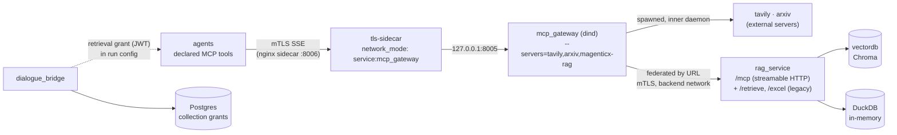

# RAG via the MCP gateway

> **Status:** Not started
> **TODO source:** Agents → "Update the retrieval process and the whole RAG pipelines so that it will be like an mcp tool calling. Migrate the chromadb also in the mcp gateway service and add auth and authorization to it. The agents will be able to call the mcp gateway and then the mcp gateway will call the vectordb service and return the results to the agents. Also try to enhance the authorization with the mcp gateway service."
> **Depends on:** nothing hard
> **Blocks:** soft-blocks [07 · Tool RAG](07-tool-rag.md) — tool retrieval only pays off once retrieval itself is a tool with a manifest to embed
> **Services touched:** agents · rag_service · dialogue_bridge · agentic_ui · infra

Retrieval is the one capability on this platform that is *not* a tool. The three production LangGraph agents — HR Policies, Orthodox, Retail — reach the vector store and the DuckDB workbooks by making raw `httpx` calls from inside a graph **node**, against URLs baked at module import. The model never sees a tool schema, never chooses to retrieve, and cannot be told not to. That is precisely why retiring the global `enabledTools` list in migration `0016` was safe for them: their tool list is empty and always has been. It is also why they cannot be expressed declaratively, why per-(user, agent) tool control does not apply to them, and why there is no authorization story for retrieval beyond "any caller holding `TRUSTED_PROXY_SECRET` may read every collection".

This plan converts retrieval into MCP tool calling. `rag_service` keeps its DuckDB engine lock and its read-only SQL validator — those move **with** the code, not away from it — and gains an MCP transport surface that the gateway federates to. The `agents → mcp_gateway` hop, today plaintext HTTP with no client authentication at all, becomes mTLS-terminated. And retrieval gains what it has never had: a per-collection authorization decision, made by the bridge from the caller's session and carried to the retrieval backend as a short-lived signed grant, so an agent can only query the collections the user behind the run is allowed to see. The end state is that the HR, Orthodox, and Retail graphs stop being special: their retrieval is a declared tool, which is the last thing standing between them and an `agent.yaml`.

---

## 1. Goal & non-goals

**Goals.**

Make every retrieval path — vector search over Chroma, schema introspection over DuckDB, read-only SQL over DuckDB — an MCP tool exposed through the existing gateway, so retrieval flows through the same declare-per-agent, disable-per-(user, agent), filter-at-stream-time harness as every other tool ([tool harness](../development/tool-harness.md)). Give the gateway hop real transport security (mTLS, not a shared header over plaintext). Introduce per-collection and per-table authorization, evaluated against the user behind the run and enforced fail-closed at the retrieval backend. Migrate the three LangGraph agents off node-retrieval, and once they hold no bespoke Python, convert them to declarative `agent.yaml` agents. Preserve the read-only SQL posture exactly — the validator and the DuckDB engine lock are non-negotiable and must not be re-implemented during the move.

**Non-goals.**

Not moving ChromaDB's storage or process into the `dind` gateway container (§3 explains why that reading of the TODO is rejected). Not adding write paths to retrieval — no ingestion tool, no collection creation from an agent. Not building the retrieval-tool *selection* layer; narrowing which tools reach the context is [07 · Tool RAG](07-tool-rag.md) and depends on this plan landing first. Not changing the embedding model or re-embedding any collection. Not introducing an org tier for collection grants — that arrives with [02 · Org + user permissions](02-org-and-user-permissions.md); this plan ships per-user grants with a shape that an org tier can extend.

---

## 2. Current state

**`rag_service` is a single-module FastAPI app with three endpoints and no `router/`or `utils/` split.** Everything lives in [`src/rag_service/main.py`](../../src/rag_service/main.py): `POST /retrieve/{collection_name}` at `main.py:94`, `GET /excel/{table}/schema` at `main.py:140`, `POST /excel/{table}/query/sql` at `main.py:155`. All three carry `dependencies=[Depends(require_internal_caller)]` and nothing else — no per-collection check, no identity, no rate limit. Request bodies are two two-field models: `Query` (`query`, `k=10`) at [`schemas.py:3`](../../src/rag_service/schemas.py) and `ExcelSQLQuery` (`sql`) at `schemas.py:8`.

The vector path builds a **fresh `chromadb.HttpClient` per request** (`main.py:98`) wrapped in `langchain_chroma.Chroma` (`main.py:103`), takes `k` straight from the request into `as_retriever` (`main.py:109`), and returns `404 No documents found` when the result set is empty (`main.py:126`) — an empty result is modelled as an error, which a tool-shaped contract will have to change. Embeddings are computed **inside `rag_service`** with `text-embedding-3-large` ([`core/chroma.py:7`](../../src/rag_service/core/chroma.py)); `chroma_settings` at `core/chroma.py:12` points at `vectordb:8000` from [`core/settings.py:58-62`](../../src/rag_service/core/settings.py).

**The read-only SQL posture is two independent layers, and the load-bearing one is the engine.** `_validate_read_only_sql` (`main.py:44`) strips a trailing `;`, rejects SQL comments outright (`main.py:55` — comment-splitting like `read/**/_csv` is the documented denylist evasion), rejects any remaining `;`, requires a first token of `select`/`with`, and applies the `_FORBIDDEN_SQL_TOKENS` denylist compiled at `main.py:36`. `_validate_sql_references_table` (`main.py:68`) forces the query to mention the path's table. Underneath, the DuckDB connection is locked at import in [`core/duck_db.py:12-24`](../../src/rag_service/core/duck_db.py): `enable_external_access=false`, `allow_unsigned_extensions=false`, then `SET disabled_filesystems='LocalFileSystem'` and `SET lock_configuration=true` — after which no `SET` can relax the posture. The comment at `duck_db.py:19-24` states the intent explicitly: the engine lock is the control, the denylist is defence in depth.

**DuckDB is in-memory and populated at import, not in the lifespan.** The loop at `duck_db.py:30-45` scans `data/` for `.xlsx/.xls/.xlsm`, reads sheet 0 with pandas, derives the table name by `re.sub(r"\W+", "_", stem)` lowercased, and `db.register(...)`s the DataFrame. A workbook that fails to read is skipped with a warning (`duck_db.py:36-38`); zero loadable workbooks is a hard `RuntimeError` at `duck_db.py:47`. Exactly one workbook ships today: `src/rag_service/data/Financial Sample.xlsx` → table `financial_sample`. `TABLES` (`duck_db.py:25`) is the allowlist both Excel endpoints check.

**Trust on the `agents → rag_service` hop is a shared header plus mTLS.** `require_internal_caller` ([`core/proxy.py:16`](../../src/rag_service/core/proxy.py)) compares the `X-Internal-Proxy-Secret` header with `secrets.compare_digest` (`core/proxy.py:13`); `Settings._require_proxy_secret` (`core/settings.py:102`) refuses to boot without the secret. On Dennis the hop is additionally mutually authenticated — `rag_service` runs under the bind-mounted TLS entrypoint with `RAG_BASE_URL=https://rag_service:8001` on the agents side ([`docker-compose-denis.yaml:28-60`, `:89`](../../src/docker-compose-denis.yaml)), and the agents client presents its cert through the shared `SSLContext` built in [`src/agents/core/tls.py:29-50`](../../src/agents/core/tls.py). There is **no** notion of *which user* the retrieval is for; any holder of the secret reads any collection.

**The three LangGraph agents call `rag_service` from graph nodes, over URLs frozen at import.** The agents-side URL builders are `RagSettings.retrieve_url` / `excel_schema_url` / `excel_query_url` at [`src/agents/core/settings.py:109-116`](../../src/agents/core/settings.py), default base `https://rag_service:8001`.

| Agent | Where retrieval happens | Endpoint constant | Notes |
| --- | --- | --- | --- |
| HR Policies | `retrieval` node, [`hr_policies_agent_v1/nodes.py:188`](../../src/agents/langgraph_agents/hr_policies_agent_v1/nodes.py) | `ENDPOINT` at `nodes.py:24` (`retrieve_url(settings.workflows.hr.collection_name)`) | `fetch_single` at `nodes.py:195` fans out one `httpx.AsyncClient` **per query** inside `asyncio.gather` (`nodes.py:209`); `k` fixed by `HR_RETRIEVE_TOP_K` (`settings.py:356`, default 2) |
| Orthodox | `retrieval` node, [`orthodox_agent_v1/nodes.py:156`](../../src/agents/langgraph_agents/orthodox_agent_v1/nodes.py) | `ENDPOINT` at `nodes.py:24` | same shape; `ORTHODOX_RETRIEVE_TOP_K` default 10 (`settings.py:371`) |
| Retail | schema fetch inside the `analysis` node ([`retail_agent_v1/nodes.py:84-102`](../../src/agents/langgraph_agents/retail_agent_v1/nodes.py)) + `query_execution` node at `nodes.py:192` | `SCHEMA_ENDPOINT` / `QUERY_ENDPOINT` at `nodes.py:24-25` | model-generated SQL, with an error-aware retry loop capped at 2 cycles (`check_sql_results`, `nodes.py:245`) |

All three **fake the tool-call telemetry**: the node emits `agui.tool_call_start(...)` / `tool_call_result(...)` with hand-written names — `vector_db.search` (`hr .../nodes.py:207`), `schema_backend.fetch` (`retail .../nodes.py:87`), `sql_backend.query` (`retail .../nodes.py:201`) — so the UI *looks* like a tool ran when no tool exists. Identity never reaches `rag_service`: the only headers are `internal_service_headers(request_id)` (`hr .../nodes.py:197`).

**Tool attachment happens for these agents but keeps nothing.** [`src/agents/router/inference.py:91-96`](../../src/agents/router/inference.py) opens an MCP session, loads the *entire* live manifest, and calls `agent.attach_tools(live_tools)` unconditionally — for LangGraph agents too. Because `BaseAgent` leaves `config_tool_names` empty (see [tool harness](../development/tool-harness.md) Phase 2), the filter keeps zero tools. HR even threads `self.tools` into its chain builders (`build_hr_agents(tools=self.tools)`, [`hr_policies_agent_v1/__init__.py`](../../src/agents/langgraph_agents/hr_policies_agent_v1/__init__.py)) — the wiring for tool-based retrieval is already there and is fed an empty list.

**The gateway hop has no authentication and no transport security.** `MCP_GATEWAY_URL` defaults to `http://mcp_gateway:8005/sse` ([`src/agents/core/settings.py:122`](../../src/agents/core/settings.py)) and is plaintext in **both** composes ([`docker-compose.yaml:62`](../../src/docker-compose.yaml), [`docker-compose-denis.yaml:91`](../../src/docker-compose-denis.yaml)). The SSE client in [`src/agents/utils/mcp_tools.py:151-174`](../../src/agents/utils/mcp_tools.py) (`_fetch_tools_from_gateway`) and `mcp_session_context` at `mcp_tools.py:194` send **no** `X-Internal-Proxy-Secret`, no bearer token, and no client cert. `src/mcp_gateway/README.md` states this as an accepted residual: the `dind` image cannot terminate TLS. Server identity for a tool is inferred client-side from a hardcoded name map, `_TOOL_SERVER_OVERRIDES` at `mcp_tools.py:19-30` (`tavily-*` → `tavily`, `download_paper`/`search_papers`/`read_paper`/`list_papers` → `arxiv`), and the canonical cache key is `"{server_id}/{tool_name}"` (`_make_cache_key`, `mcp_tools.py:74`).

**Gateway deployment is deliberately outside Swarm.** Local: [`docker-compose-mcp.yaml`](../../src/docker-compose-mcp.yaml) runs `docker/mcp-gateway:dind-v0.42.1` `privileged: true` with `--servers=tavily,arxiv-mcp-server`, publishing `8005:8005` on the host. Dennis: [`docker-compose-denis-mcp.yaml`](../../src/docker-compose-denis-mcp.yaml) is the same image with **no published ports**, attached to the external `mcp_gateway` overlay, run as plain `docker compose` because Swarm strips the mount-namespace capabilities the inner `dockerd` needs. Active server images are digest-pinned in `mcp_catalog.yaml`; `mcp_config.yaml` carries only `arxiv-mcp-server.storage_path`.

**`vectordb` is reachable only from the `backend` network.** [`docker-compose.yaml:5-16`](../../src/docker-compose.yaml) and [`docker-compose-denis.yaml:2-25`](../../src/docker-compose-denis.yaml) put `chromadb/chroma:0.6.3` on `backend` alone, with the store bind-mounted from `./vectorstores/chroma_db_openai` (local) or `/opt/magenticx/vectorstores/chroma_db_openai` (prod). The gateway is **not** on `backend`, so nothing behind the gateway can reach Chroma today.

**Two documentation facts worth knowing before editing.** [`docs/development/retrieval-and-tools.md:21-22`](../development/retrieval-and-tools.md) draws `MCP → rag_service` and its sequence diagram at `:57-61` shows the gateway calling `/retrieve/...`. That has never been true — the gateway has no route to `rag_service`. The doc's own Phase 2 note at `:147` states the accurate version (LangGraph retrieval is a node, not a tool). The diagram is aspirational and describes exactly what this plan builds; correcting it is part of the work, not a separate cleanup.

---

## 3. Target design

The shape is a **federated first-party MCP server**. `rag_service` stays the single implementation of retrieval — same process, same DuckDB connection, same validator — and grows an MCP transport surface alongside its HTTP one. The gateway does not *host* that server as a spawned container; it **federates** to it by URL. Agents then see `magenticx-rag/rag_search`, `magenticx-rag/excel_query_sql`, and friends in the same live manifest as `tavily-search`, declare them in `agent.yaml`, and call them through the same session that `router/inference.py` already opens per run.

Two candidate topologies were considered and one is rejected outright.

**Rejected: ship the RAG server as a catalog image the gateway spawns.** The `dind` gateway boots an inner `dockerd` and runs each MCP server as a container on *that* daemon's networks. A container inside the inner daemon has no route to `vectordb` on the outer `backend` network, and no way to be given one without punching a hole through the isolation boundary that `dind` exists to provide. It would also mean a second copy of the DuckDB loader and the SQL validator — the highest-risk possible outcome for a control the repo has already hardened twice.

**Rejected: move ChromaDB into the gateway service.** The TODO's "migrate the chromadb also in the mcp gateway service" reads naturally as "put Chroma behind the gateway", and that is what this plan does — *reachability*, not *relocation*. Physically moving a stateful store with a bind-mounted volume into a `privileged: true` `dind` container would place the persistent vector store inside the one container on the estate that runs a nested Docker daemon with elevated capabilities, and would make Chroma's lifetime a function of the gateway's. Chroma stays its own service on `backend`; what changes is that the **only** path to it becomes a gateway-federated, grant-checked tool call.



### 3.1 The tool surface

Five tools, one server id `magenticx-rag`, canonical keys `magenticx-rag/<tool_name>`:

| Tool | Arguments | Replaces | Notes |
| --- | --- | --- | --- |
| `rag_search` | `collection: str`, `query: str`, `k: int = 5` | `POST /retrieve/{collection}` | `k` clamped server-side to `[1, RAG_MAX_TOP_K]`; **empty result is a successful empty list**, not the current 404 (`main.py:126`) — a tool that errors on "nothing found" teaches the model to retry pointlessly |
| `rag_list_collections` | — | *(new)* | Returns only collections the grant permits, so the model discovers its own scope instead of guessing names |
| `excel_list_tables` | — | *(new)* | `TABLES` keys, grant-filtered |
| `excel_describe_table` | `table: str` | `GET /excel/{table}/schema` | |
| `excel_query_sql` | `table: str`, `sql: str` | `POST /excel/{table}/query/sql` | Calls `_validate_read_only_sql` and `_validate_sql_references_table` **unchanged**; row count and payload bytes capped before serialization |

Tool descriptions are written for the model, and the collection names are *not* hardcoded into prompts — `rag_list_collections` plus the grant is how an agent learns what it may read. Structurally this is a lift, not a rewrite: the MCP tool bodies call the same functions the HTTP handlers call, which is why the SQL validator and the DuckDB engine lock survive the move by construction. The refactor that makes this clean is the one the repo's own conventions already ask for — `rag_service` gains `router/` and `utils/` (retrieval, sql, duckdb) so the shared logic has a home both transports can call. That refactor is Phase 1 and lands with no behaviour change.

### 3.2 Authorization — a bridge-minted, collection-scoped grant

The authorization gap today is total: `require_internal_caller` proves *a service* is calling, never *for whom*. The fix threads the same identity the rest of the platform already has.

```mermaid
sequenceDiagram
    participant UI as agentic_ui
    participant BR as dialogue_bridge
    participant AG as agents
    participant GW as mcp_gateway
    participant RAG as rag_service

    UI->>BR: POST /v1/inference/runs/{user}/start
    BR->>BR: resolve grants for user → {collections, tables}
    BR->>BR: mint retrieval grant (Vault Transit, aud=magenticx-rag, ttl=run)
    BR->>AG: POST /agents/{slug}/stream {config.context.retrieval_grant}
    AG->>GW: call_tool rag_search {collection, query, k}
    Note over AG,GW: grant travels as an MCP request header,<br/>never as a model-visible argument
    GW->>RAG: forwarded call + grant header
    RAG->>RAG: verify signature, aud, exp; collection ∈ claims?
    RAG-->>GW: documents (or 403, fail-closed)
    GW-->>AG: tool result
```

The grant is a short-lived JWT signed by **Vault Transit** — the exact machinery the bridge already owns for session tokens ([`core/auth/tokens.py`](../../src/dialogue_bridge/core/auth/tokens.py), [`core/auth/vault.py`](../../src/dialogue_bridge/core/auth/vault.py)) — with `aud: "magenticx-rag"`, a subject that is the hashed user id, `collections: [...]`, `tables: [...]`, and a TTL bounded by the run. `rag_service` verifies it against the Transit public key it fetches at boot and caches. A missing, expired, wrong-audience, or unverifiable grant is a **403**, never a fallback to "allow" — `REQUIRE_RETRIEVAL_GRANT` defaults to `true`, matching the `REQUIRE_TLS` / `REQUIRE_MTLS` stance the estate already uses.

This layers *on top of* `require_internal_caller` and mTLS rather than replacing either: transport proves the caller is the gateway, the header proves it is an internal service, the grant proves which user's scope this call is inside. Three independent controls, and the one that is new is the only one that carries user identity.

The grant must reach `rag_service` as a **header, not a tool argument**. An argument is model-visible and model-editable; a header is neither. Whether `docker/mcp-gateway` will forward a caller-supplied header to a federated remote server is the plan's largest unknown and is tracked in §12 with a concrete fallback.

### 3.3 Transport security on the gateway hop

`mcp_gateway` runs as plain `docker compose` (not Swarm) — which is exactly what makes the fix easy. Add an **nginx TLS-terminating sidecar** in the same compose file with `network_mode: "service:mcp_gateway"`, so it shares the gateway's network namespace: it listens on `8006` with the internal cert, requires a CA-signed client cert (`ssl_verify_client on`), and proxies to `127.0.0.1:8005`, which never leaves the namespace. Agents move to `MCP_GATEWAY_URL=https://mcp_gateway:8006/sse` and present their existing client cert through the `SSLContext` from [`core/tls.py:29-50`](../../src/agents/core/tls.py) — no new certificate material, no new CA. The SSE client in `utils/mcp_tools.py` additionally starts sending `internal_service_headers(...)`, so the gateway hop finally matches every other internal hop. The `dind` container's inability to terminate TLS stops being a residual because it no longer has to.

### 3.4 What happens to the three LangGraph agents

Two steps, deliberately separate so the risky one is small.

**Step one — same graph, tool-shaped node.** Each retrieval node stops constructing `httpx` calls and instead invokes the bound tool from `self.tools`. The graph topology, the reflection loop, the SQL retry cycle, and the state shape are untouched. The fake `agui.tool_call_*` telemetry is deleted: the real tool call produces real events through the normalizer, so the UI shows a genuine tool card instead of a hand-rolled imitation. This is gated per agent by `RAG_VIA_MCP_ENABLED` so a bad turn is one env flip away from the old path.

**Step two — declarative.** Once retrieval is the only thing in these agents that needed Python, what remains is a prompt chain plus a graph. HR and Orthodox are structurally the same agent (analyse → generate queries → retrieve → rank → reflect → summarize → answer) and both become `agent.yaml` deep agents that declare `magenticx-rag/rag_search` and are steered by their `AGENT.md`, inheriting per-(user, agent) tool control, skills, memory, and HITL for free. Retail is the interesting one: a deep agent declaring `excel_describe_table` + `excel_query_sql` replaces the hand-written retry loop with the model's own tool-error recovery (`ToolErrorMiddleware` already feeds tool failures back). Whether the deep-agent form matches the graph's answer quality is an empirical question, not a design one — §8 makes it a measured gate, not an assumption. See [00 · Platform restructure](00-platform-restructure.md) for the declarative engine and [tool harness](../development/tool-harness.md) for how a declared MCP tool resolves.

---

## 4. Data model & migrations

Retrieval authorization needs persisted scope. Two new tables in the bridge, plus one Alembic revision on top of the current head `0016_retire_enabled_tools`.

| Table | Column | Type | Notes |
| --- | --- | --- | --- |
| `retrieval_resources` | `id` | `uuid` PK | one row per queryable resource |
| | `kind` | `text` | `"collection"` \| `"table"` |
| | `name` | `text` | Chroma collection name or DuckDB table name |
| | `label` | `text` | UI display name |
| | `description` | `text` | shown in the admin surface |
| | `is_active` | `bool` | inactive resources are never granted |
| | | | `UNIQUE (kind, name)`; index on `(kind, is_active)` |
| `retrieval_grants` | `id` | `uuid` PK | |
| | `user_id` | `text` FK → `users.id` | per-user tier now; an org tier is additive later |
| | `resource_id` | `uuid` FK → `retrieval_resources.id` `ON DELETE CASCADE` | |
| | `granted_at` | `timestamptz` | |
| | `granted_by` | `text` | audit trail |
| | | | `UNIQUE (user_id, resource_id)`; index on `user_id` for the run-start lookup |

`0017_retrieval_grants` creates both tables and **backfills the current de-facto reality**: seed `retrieval_resources` with the collections the three agents use (`HR_COLLECTION_NAME`, `ORTHODOX_COLLECTION_NAME` — `src/agents/core/settings.py:355`, `:370`) and the `financial_sample` table, then grant all three to every existing user. Without that backfill the first deploy of a fail-closed grant check silently breaks all three production agents, which is the same class of mistake as a non-nullable column with no `UPDATE` (see [§ Schema Changes](../../CLAUDE.md)). Backfill and DDL go in one migration, one transaction.

No migration is needed on the `agents` side — resource names stay configuration (`core/settings.py`), and the grant is a claim in a token, never a row the agents service reads.

---

## 5. API surface

**`rag_service` — new MCP transport, existing HTTP retained during migration.**

| Surface | Path | Auth | Notes |
| --- | --- | --- | --- |
| MCP (streamable HTTP) | `POST /mcp` | `require_internal_caller` + mTLS + retrieval grant | The five tools of §3.1 |
| Legacy vector | `POST /retrieve/{collection}` | unchanged + grant when `REQUIRE_RETRIEVAL_GRANT` | Deleted in Phase 6 |
| Legacy Excel | `GET /excel/{table}/schema`, `POST /excel/{table}/query/sql` | same | Deleted in Phase 6 |

New settings on `rag_service`: `RETRIEVAL_GRANT_PUBLIC_KEY_URL` (or a Vault address to fetch the Transit verification key), `REQUIRE_RETRIEVAL_GRANT` (default `true`), `RAG_MAX_TOP_K` (default 20), `RAG_MAX_RESULT_BYTES`, `EXCEL_MAX_ROWS`. Every one is a `core/settings.py` field — no literals in handlers.

**`dialogue_bridge` — grants CRUD plus grant minting.**

| Method | Path | Auth deps | Rate limit | Schema |
| --- | --- | --- | --- | --- |
| `GET` | `/v1/retrieval/resources` | `require_current_user` | read-tier | `List[RetrievalResourceOut]` — active resources with a `granted` flag for this user |
| `GET` | `/v1/retrieval/users/{user_id}/grants` | `validate_userId` | read-tier | `List[RetrievalGrantOut]` |
| `PUT` | `/v1/retrieval/users/{user_id}/grants/{resource_id}` | `validate_userId` + `require_csrf_protection` | mutation-tier | 204 |
| `DELETE` | `/v1/retrieval/users/{user_id}/grants/{resource_id}` | `validate_userId` + `require_csrf_protection` | mutation-tier | 204 |

Handlers live in a new `router/retrieval.py` registered in `main.py`; every query and the grant-minting logic live in `utils/retrieval.py`. Schemas go in `schemas/__init__.py`. Grant minting hooks the existing run-start path in `utils/inference.py`, adding `config.context.retrieval_grant` to the payload — additive, so an agent that ignores it is unaffected.

Self-service grant *granting* is intentionally not exposed: until [02 · Org + user permissions](02-org-and-user-permissions.md) lands there is no admin role to gate it, so `PUT`/`DELETE` are wired but restricted to the bound user's own row for **revocation** only, and expansion is operator-driven. A user being able to grant themselves a collection would make the whole model decorative.

---

## 6. Frontend surface

Small and read-mostly. A **Knowledge** section in the profile panel (`src/agentic_ui/src/features/settings/`) lists the retrieval resources this user can query, with each row showing kind (collection / table), label, description, and grant state. Revocation is a confirm-gated destructive action per the frontend standards; granting shows a disabled control with a "request access" explanation until an admin tier exists. New API functions go in `shared/lib/api.ts` (`getRetrievalResources`, `getRetrievalGrants`, `revokeRetrievalGrant`), Zod contracts in `shared/lib/schemas.ts`, types re-exported from `shared/lib/types.ts` — never inline.

The larger visible change is one nobody has to build: because retrieval becomes a real tool call, the tool cards in the timeline start coming from the normalizer instead of the hand-written `agui.tool_call_start("vector_db.search", ...)` at `hr_policies_agent_v1/nodes.py:207`. Names in the UI change from the invented `vector_db.search` / `sql_backend.query` to the canonical `magenticx-rag/rag_search` / `magenticx-rag/excel_query_sql`. Worth a deliberate look at the tool-card label rendering so the qualified name displays well.

---

## 7. Cross-cutting impact

| Area | Impact |
| --- | --- |
| **`rag_service`** | Gains `router/` + `utils/` per the repo layout, an MCP transport, grant verification, result caps. The DuckDB engine lock and `_validate_read_only_sql` move verbatim into `utils/sql.py` — no re-implementation, and the existing behaviour is pinned by tests before the move. |
| **`agents`** | `MCP_GATEWAY_URL` becomes HTTPS; `utils/mcp_tools.py` starts sending internal headers and presenting a client cert; `_TOOL_SERVER_OVERRIDES` (`mcp_tools.py:19`) gains no entries because our server declares its own id — worth confirming, since a missing server id silently collapses the cache key to a bare tool name (`_make_cache_key`, `mcp_tools.py:74`). The three LangGraph node bodies change, then the agents become YAML. `RagSettings.retrieve_url` / `excel_*_url` (`core/settings.py:109-116`) are deleted in Phase 6. |
| **`dialogue_bridge`** | New router + utils + schemas + two tables + one migration; run-start payload gains `retrieval_grant`; Vault Transit signing is reused, not rebuilt. |
| **`agentic_ui`** | Knowledge section, three api.ts functions, Zod contracts; tool-card labels shift to qualified names. |
| **infra** | nginx TLS sidecar in both MCP composes; `magenticx-rag` added to `--servers` and to the catalog as a federated remote; `rag_service` reachable from the gateway (a shared network, added narrowly — the gateway must **not** be granted `backend` wholesale). New `konstantinosmpouros/rag_service` image tag, and the published-tags table in `CLAUDE.md` updated per push. |
| **Agent tool surface** | Retrieval enters the tool harness: declared in `agent.yaml`, disable-able per (user, agent) via `tool_prefs.json`, filtered at stream time. A user disabling `rag_search` on an HR agent makes it non-retrieving — a genuinely new failure mode the prompt must handle gracefully. |
| **Plan 07 (Tool RAG)** | Retrieval tools become part of the manifest that plan 07 embeds and narrows. The hard constraint there — declared set is the authoritative superset — applies unchanged. |
| **Plan 00 (Platform restructure)** | Step two of §3.4 is the completion of that plan's declarative goal for the last three Python agents. |
| **Plan 02 (Org + user permissions)** | `retrieval_grants` is per-user by design so an org tier is an additive `org_id` column plus a union at resolve time. |
| **Observability** | Grant denials, `k` clamps, and SQL rejections are security events and must be logged as such (hashed user id only, never the query text or SQL body). |
| **Docs** | [retrieval-and-tools.md](../development/retrieval-and-tools.md) is rewritten (its `MCP → rag_service` diagram finally becomes true); [tool-harness.md](../development/tool-harness.md) gains the retrieval tools and loses the "LangGraph agents are unaffected" sharp edge; [architecture/overview.md](../architecture/overview.md), [configuration.md](../architecture/configuration.md), [secrets.md](../architecture/secrets.md), [database-schema.md](../architecture/database-schema.md), [service-startup.md](../architecture/service-startup.md) all move. |

---

## 8. Phased execution

**Phase 0 — Pin current behaviour.** Before touching anything, add tests that lock the SQL validator's full rejection matrix (comments, multi-statement, non-`SELECT` first token, every `_FORBIDDEN_SQL_TOKENS` entry, missing table reference), the DuckDB engine lock (a `SET` after `lock_configuration` must fail), the workbook-name derivation, and the current `/retrieve` response shape including the 404-on-empty.
*Acceptance:* the suite passes against unmodified `rag_service`; a deliberately loosened validator makes it fail.

**Phase 1 — `rag_service` layering, no behaviour change.** Split `main.py` into `router/retrieval.py`, `router/excel.py`, `utils/retrieval.py`, `utils/sql.py`, `utils/duckdb_tables.py`; move the workbook load out of import-time into the lifespan so a boot failure is diagnosable. Endpoints, payloads, status codes byte-identical.
*Acceptance:* Phase 0 suite green with zero edits; all three agents work unchanged against the rebuilt image.

**Phase 2 — MCP transport on `rag_service`.** Add `POST /mcp` exposing the five tools, each delegating to the same `utils/` functions the HTTP handlers use. Result caps (`RAG_MAX_TOP_K`, `RAG_MAX_RESULT_BYTES`, `EXCEL_MAX_ROWS`) applied in `utils/`, so both transports inherit them. Empty vector results return an empty list on the MCP path.
*Acceptance:* an MCP client inside the compose network lists five tools and round-trips each; the SQL validator rejects the same inputs through the tool as through HTTP; `k=10_000` is clamped, not honoured.

**Phase 3 — Gateway federation + mTLS on the gateway hop.** Add the nginx sidecar (`network_mode: "service:mcp_gateway"`, `ssl_verify_client on`, proxy to `127.0.0.1:8005`); register `magenticx-rag` as a federated remote in the catalog and add it to `--servers`; give the gateway a narrow route to `rag_service`; point agents at `https://mcp_gateway:8006/sse` and start sending `internal_service_headers`. Order matters exactly as it does for [§ Internal mTLS](../../CLAUDE.md): the sidecar must accept certless clients until the agents image that presents one is live, then enforce.
*Acceptance:* `list_tools` from the agents container returns tavily + arxiv + the five `magenticx-rag/*` keys; a client without a cert is refused at the sidecar; a `tcpdump` on the overlay shows no plaintext MCP; existing tavily/arxiv tool calls still work.

**Phase 4 — Authorization, shipped lenient then enforced.** Land `0017_retrieval_grants` with its backfill; mint the grant at run start; verify it in `rag_service` with `REQUIRE_RETRIEVAL_GRANT=false` first so a missing grant only logs. Confirm every real run carries a verifiable grant, then flip the flag (its secure default) and delete the override.
*Acceptance:* with the flag off, logs show 100% grant presence and zero verification failures across a day of real traffic; with it on, a forged/expired/wrong-audience grant yields 403, an un-granted collection yields 403, and the granted path is unchanged. Denials log hashed identity only.

**Phase 5 — Migrate the three agents to tool retrieval, behind a flag.** Per agent, replace the node's `httpx` body with a tool invocation, delete the fake `agui.tool_call_*` emissions, and keep the old path selectable via `RAG_VIA_MCP_ENABLED`. Order: Orthodox (simplest), HR (adds the reflection loop), Retail (model-generated SQL, highest blast radius).
*Acceptance:* per agent, a fixed question set produces answers judged equivalent to the pre-change baseline; the timeline shows real tool cards; flipping the flag back restores the node path within one restart.

**Phase 6 — Declarative conversion, then retire the legacy surface.** Convert Orthodox and HR to `agent.yaml` deep agents declaring `magenticx-rag/rag_search`; evaluate Retail as a deep agent against its graph. **Gate:** conversion ships only where quality holds — a converted agent that answers worse stays a LangGraph agent, and that is an acceptable outcome, not a failure of the plan. Once no caller remains, delete `POST /retrieve/{collection}` and both `/excel/...` endpoints, and delete `RagSettings.retrieve_url` / `excel_schema_url` / `excel_query_url` from `src/agents/core/settings.py`.
*Acceptance:* `grep -r "retrieve_url\|excel_query_url" src/agents` returns nothing; the legacy endpoints are gone; docs updated in the same commit.

---

## 9. Security & privacy

**The trust boundary, stated precisely.** Only `agentic_ui`'s nginx on `:8050` is public. `agents → mcp_gateway` is today the estate's one unauthenticated, unencrypted internal hop — no client cert, no `X-Internal-Proxy-Secret`, plaintext SSE ([`core/settings.py:122`](../../src/agents/core/settings.py), `src/mcp_gateway/README.md`). Phase 3 closes it with the sidecar so all four HTTP hops are mutually authenticated. `gateway → rag_service` is mTLS on a narrow shared network, and `rag_service → vectordb` stays inside `backend`, which is `internal: true` and therefore unreachable from outside. The gateway must be given a route to `rag_service` **only** — attaching the `dind` gateway to `backend` wholesale would hand a privileged container with a nested Docker daemon a route to Postgres and Redis, which is a strictly worse posture than the one this plan fixes.

**Three independent controls on every retrieval call, each answering a different question.** mTLS answers *is this the gateway*. `require_internal_caller` (`src/rag_service/core/proxy.py:16`, `compare_digest` at `:13`) answers *is this an internal service*. The retrieval grant answers *whose scope is this call inside* — the question nothing can answer today. All three fail closed: `Settings._require_proxy_secret` (`core/settings.py:102`) refuses to boot without the secret, `REQUIRE_TLS`/`REQUIRE_MTLS` default `true`, and `REQUIRE_RETRIEVAL_GRANT` joins them at `true`.

**The grant is not a bearer token the model can touch.** It travels as a transport header, minted per run by the bridge with a run-bounded TTL and `aud: "magenticx-rag"`, signed by Vault Transit. It is never a tool argument (model-visible, model-editable), never logged, never returned in a tool result. `rag_service` verifies signature, audience, and expiry before consulting claims, and treats an unverifiable grant identically to a missing one. Audience binding matters: without it a session token would be replayable as a retrieval grant.

**Confused-deputy risk is the reason authorization lives at the backend, not the agent.** The agent is a deputy acting for a user, and the agent's *prompt* is influenced by retrieved content. If the collection allowlist lived in the agent process, a prompt injection inside a retrieved document could plausibly talk the agent into widening it. Because the check is in `rag_service` against a signed claim set the agent cannot mint, injected instructions to "search the HR collection" from a user without that grant produce a 403 regardless of how convincing the injection is.

**SQL stays read-only by construction.** `_validate_read_only_sql` and the DuckDB engine lock are moved, not rewritten, and Phase 0 pins their behaviour before the move so a regression is a red test rather than a discovery. New surfaces bring new caps: `k` is clamped, result bytes and row counts bounded, so a tool call cannot be used as a memory-exhaustion or context-flooding lever. The MCP transport adds no write tool — no ingestion, no collection creation, no `ATTACH`.

**Logging.** Queries and SQL bodies are user content and never logged at INFO; the existing per-service redaction layer (`observability/redaction.py`) already hashes `user_id`/`session_id` with the shared `magenticx_log_redaction_secret`. Grant denials, `k` clamps, and validator rejections log the event, the resource name, the hashed subject, and the reason — never the text. Grant tokens are logged never, not even truncated.

**Rate limiting.** The bridge's grant endpoints use the existing slowapi tiers. `rag_service` has no rate limiting today; the natural place for a per-(user, resource) retrieval budget is the grant claim itself (an embedded ceiling) rather than a new stateful limiter in a service with no Redis — noted as an open decision rather than hand-waved.

---

## 10. Testing strategy

The Phase 0 characterization suite is the backbone: it exists before any refactor and must stay green through Phases 1–3, which is what makes "the validator moved without changing" a verified claim rather than a hope.

**`rag_service` unit** — the full validator rejection matrix (comments, `;`, non-`SELECT`/`WITH` first token, every denylist token, table-reference enforcement) exercised through *both* transports so neither path can drift; engine-lock assertion that a post-`lock_configuration` `SET` raises; `k` clamping; result-byte and row caps; grant verification (valid, expired, wrong `aud`, bad signature, missing → all 403 under the flag); grant-filtered `rag_list_collections` / `excel_list_tables`.

**`agents`** — MCP client integration against a fake `magenticx-rag` server asserting the five tool schemas and canonical cache keys (`magenticx-rag/rag_search`, per `_make_cache_key`); the migrated node bodies invoking the tool rather than `httpx`; per-agent flag behaviour. Note the host constraint recorded in memory: `tests/agents/` needs deepagents 0.6.10, so these run in-image.

**`dialogue_bridge`** — real-DB tests (never a mocked DB) for grant resolution, the `0017` backfill applied to a pre-migration snapshot, grant minting and claim shape, and authorization on the grants endpoints (a user cannot read or revoke another user's grants; CSRF required on mutations).

**Frontend** — Zod contract tests for the three new responses; the Knowledge section's empty state and confirm-gated revocation.

**Manual, before Phase 4's flag flip** — a run as a user with no grants must fail cleanly with a model-legible message, not a stack trace; `tcpdump` on the overlay confirming no plaintext MCP; a certless SSE client refused at the sidecar.

---

## 11. Docs to update

| Doc | Change |
| --- | --- |
| [docs/development/retrieval-and-tools.md](../development/retrieval-and-tools.md) | Substantial rewrite. Its `MCP → rag_service` topology (`:21-22`, `:57-61`) becomes accurate for the first time; add the MCP tool surface, the grant sequence, and the sidecar; drop the "LangGraph retrieval is a node" note at `:147` once Phase 5 lands. |
| [docs/development/tool-harness.md](../development/tool-harness.md) | Add `magenticx-rag/*` to the MCP class table; remove the "LangGraph agents are unaffected by all of this" sharp edge (`:137`); note that disabling `rag_search` is now a supported, meaningful user action. |
| [docs/architecture/overview.md](../architecture/overview.md) | Gateway sidecar, the new gateway↔`rag_service` route, ports. |
| [docs/architecture/configuration.md](../architecture/configuration.md) | `REQUIRE_RETRIEVAL_GRANT`, `RAG_MAX_TOP_K`, `RAG_MAX_RESULT_BYTES`, `EXCEL_MAX_ROWS`, `RAG_VIA_MCP_ENABLED`, new `MCP_GATEWAY_URL`. |
| [docs/architecture/database-schema.md](../architecture/database-schema.md) | `retrieval_resources`, `retrieval_grants`, indexes, constraints. |
| [docs/architecture/secrets.md](../architecture/secrets.md) | Transit key usage for retrieval grants; the sidecar's cert material. |
| [docs/architecture/service-startup.md](../architecture/service-startup.md) | `rag_service` now needs the Transit verification key at boot; the workbook load moves into the lifespan. |
| [docs/development/observability.md](../development/observability.md) | Grant-denial and validator-rejection events. |
| `src/mcp_gateway/README.md` | The plaintext residual is resolved; document the federated `magenticx-rag` entry and the sidecar. |
| `CLAUDE.md` | Published-tags table rows for every pushed image; the MCP-gateway section gains the sidecar. |

---

## 12. Risks & open decisions

**Open — can the gateway forward a caller-supplied header to a federated remote server?** The whole grant design assumes it can. If `docker/mcp-gateway` strips or ignores request headers on the federation hop, the fallbacks in preference order are: (a) terminate the grant at a thin authorizing reverse proxy in front of `rag_service` that the gateway is configured to call, with the grant carried on the agents→sidecar hop and re-attached there; (b) let the agents service call `rag_service`'s `/mcp` **directly** as a second MCP endpoint, keeping tool-shaped retrieval and full authorization while giving up the single-gateway story the TODO asks for; (c) accept the grant as a tool argument, which is rejected — a model-editable authorization token is not an authorization token. This must be resolved by a spike before Phase 3, not discovered during it.

**Open — retrieval quality after declarative conversion.** HR and Orthodox encode real engineering in their graphs (query fan-out, per-document relevance flags, a reflection cycle capped at one extra round). A deep agent with a `rag_search` tool may match it or may retrieve less deliberately. Phase 6 is written as a gate for this reason: agents that answer worse stay LangGraph agents. Retail is the sharper case — `check_sql_results` (`retail_agent_v1/nodes.py:245`) is a deterministic 2-cycle retry, whereas a deep agent's recovery is the model's judgement.

**Open — where a per-user retrieval budget lives.** `rag_service` has no Redis and no rate limiter. Embedding a call ceiling in the grant claim is stateless and appealing but cannot survive a process restart mid-run; a shared limiter means giving `rag_service` a Redis dependency it does not have. Undecided; not a blocker for Phases 1–5.

**Risk — three production agents depend on this path.** Mitigated by keeping `rag_service`'s HTTP endpoints alive through Phase 5, gating each migration on `RAG_VIA_MCP_ENABLED`, and migrating one agent at a time in ascending risk order. **Rollback:** flip the flag (node retrieval returns, no image change); or revert the agents image tag in `docker-compose-denis.yaml` and redeploy from Portainer, since the legacy endpoints are still serving. Phase 4's authorization rollback is the same shape: set `REQUIRE_RETRIEVAL_GRANT=false`, which is exactly why the flag ships before it is needed.

**Risk — Phase 3 has a handshake-failure window if sequenced wrong.** The sidecar and the agents image change independently, exactly like [§ Internal mTLS](../../CLAUDE.md). Sidecar first in lenient mode, then the cert-presenting agents image, then enforce.

**Risk — the MCP session is per-run and single-point.** `mcp_session_context` (`utils/mcp_tools.py:194`) opens one SSE connection per inference request with no pooling; a gateway outage already fails the run. Routing retrieval through it makes the gateway a dependency of the *core* capability of three agents, so a gateway restart that was previously "tavily is briefly unavailable" becomes "HR cannot answer". Locally this is the known `dind` failure mode where a plain `docker restart` does not recover the gateway. The mitigation is operational (healthcheck + `--force-recreate` runbook) plus the flag-based rollback; a client-side retry around session establishment is worth considering and is deliberately not designed here.

**Risk — silent `server_id` collapse.** `_make_cache_key` (`utils/mcp_tools.py:74`) returns a bare tool name when `server_id` is empty, and `_TOOL_SERVER_OVERRIDES` is a hardcoded map. If the federated server does not surface `magenticx-rag` as its id, declared keys in `agent.yaml` will not match the live manifest and `attach_tools` will silently drop retrieval — logged at WARNING and easy to miss. Phase 3's acceptance criterion asserts the qualified keys precisely to catch this.

**Decision taken — Chroma is not relocated into the gateway.** Restated here because the TODO's wording invites the other reading: putting a stateful bind-mounted store inside a `privileged: true` `dind` container, whose lifetime then governs the vector store's, is a security and operability regression. "Behind the gateway" is delivered as reachability, and the gateway becomes the only route in.

---

## 13. File map

| Concept | File | What to look for |
| --- | --- | --- |
| Vector retrieval endpoint (today) | [src/rag_service/main.py](../../src/rag_service/main.py) | `retrieve` at `:94`, fresh `HttpClient` `:98`, 404-on-empty `:126` |
| Read-only SQL validator | [src/rag_service/main.py](../../src/rag_service/main.py) | `_FORBIDDEN_SQL_TOKENS` `:36`, `_validate_read_only_sql` `:44`, `_validate_sql_references_table` `:68` |
| DuckDB engine lock + workbook load | [src/rag_service/core/duck_db.py](../../src/rag_service/core/duck_db.py) | `:12-24` config + `lock_configuration`, scan loop `:30-45`, `TABLES` `:25` |
| Chroma client config | [src/rag_service/core/chroma.py](../../src/rag_service/core/chroma.py) | `embeddings_model` `:7`, `chroma_settings` `:12` |
| Internal-caller gate | [src/rag_service/core/proxy.py](../../src/rag_service/core/proxy.py) | `is_trusted_proxy_request` `:10`, `require_internal_caller` `:16` |
| RAG settings + boot gate | [src/rag_service/core/settings.py](../../src/rag_service/core/settings.py) | `RagSettings` `:58`, `_require_proxy_secret` `:102` |
| Request schemas | [src/rag_service/schemas.py](../../src/rag_service/schemas.py) | `Query` `:3`, `ExcelSQLQuery` `:8` |
| Agents-side RAG URLs | [src/agents/core/settings.py](../../src/agents/core/settings.py) | `RagSettings` `:102-116`, `McpSettings` `:119-123` |
| HR node retrieval | [src/agents/langgraph_agents/hr_policies_agent_v1/nodes.py](../../src/agents/langgraph_agents/hr_policies_agent_v1/nodes.py) | `ENDPOINT` `:24`, `retrieval` `:188`, `fetch_single` `:195`, fake tool events `:207-214` |
| Orthodox node retrieval | [src/agents/langgraph_agents/orthodox_agent_v1/nodes.py](../../src/agents/langgraph_agents/orthodox_agent_v1/nodes.py) | `ENDPOINT` `:24`, `retrieval` `:156` |
| Retail schema + SQL nodes | [src/agents/langgraph_agents/retail_agent_v1/nodes.py](../../src/agents/langgraph_agents/retail_agent_v1/nodes.py) | endpoints `:23-25`, schema fetch `:84-102`, `query_execution` `:192`, retry gate `:245` |
| MCP client + manifest cache | [src/agents/utils/mcp_tools.py](../../src/agents/utils/mcp_tools.py) | `_TOOL_SERVER_OVERRIDES` `:19`, `_make_cache_key` `:74`, `_fetch_tools_from_gateway` `:151`, `mcp_session_context` `:194` |
| Per-run tool attachment | [src/agents/router/inference.py](../../src/agents/router/inference.py) | `:91-96` session → `load_mcp_tools` → `attach_tools` |
| Internal TLS client context | [src/agents/core/tls.py](../../src/agents/core/tls.py) | `_internal_ssl_context` `:29`, `get_httpx_verify` `:53` |
| Declarative agent spec (target form) | [src/agents/runtime/abstractions/agent_spec.py](../../src/agents/runtime/abstractions/agent_spec.py) | `tools`, `hitl` `:145` |
| Gateway compose (local / prod) | [src/docker-compose-mcp.yaml](../../src/docker-compose-mcp.yaml) · [src/docker-compose-denis-mcp.yaml](../../src/docker-compose-denis-mcp.yaml) | `--servers`, `privileged: true`, published port (local only) |
| Gateway trust notes | [src/mcp_gateway/README.md](../../src/mcp_gateway/README.md) | digest pins, `--servers` allowlist, plaintext residual |
| Service topology | [src/docker-compose.yaml](../../src/docker-compose.yaml) · [src/docker-compose-denis.yaml](../../src/docker-compose-denis.yaml) | `vectordb` on `backend` only; `agents` networks; `rag_service` TLS entrypoint |
| Grant signing machinery to reuse | [src/dialogue_bridge/core/auth/tokens.py](../../src/dialogue_bridge/core/auth/tokens.py) · [core/auth/vault.py](../../src/dialogue_bridge/core/auth/vault.py) | Transit sign/verify, key fetch |
| Migration chain head | [src/dialogue_bridge/migrations/versions/](../../src/dialogue_bridge/migrations/versions/) | `0016_retire_enabled_tools` → new `0017_retrieval_grants` |
