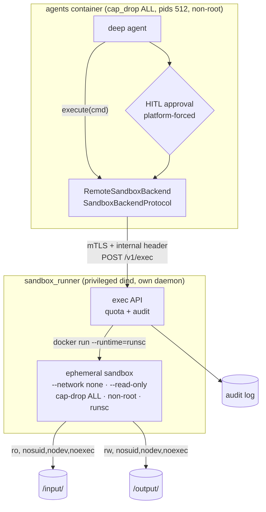

# Sandboxed execution — the sandbox runner

> **Status:** Partially done — Phase 1 (the workspace lockdown + fail-closed kill switch) is shipped; this plan covers Phase 2, the runner itself
> **TODO source:** Agents → "Lock down the per-(user, agent, conversation) workspace so the running agent can never alter its own permissions or mount layout, and ship sandboxed execution safely. … **Remaining (Phase 2 — before ever flipping `SANDBOX_EXECUTION_ENABLED`):** the sandbox runner itself — dedicated `sandbox_runner` service (MCP-gateway-style dind + gVisor `runsc`, since Dennis A1 VMs have no /dev/kvm → Firecracker/Kata out), ephemeral sandbox per execute with `input/` bind-mounted read-only + `output/` read-write (`nosuid,nodev,noexec`), no network, dropped caps, non-root, hard CPU/mem/pids/wall-clock/output quotas, clean env, HITL approval per call, audit log; plus the escape-test checklist (net, host fs, /proc, fork bomb, disk fill, symlink-out) before prod enablement."
> **Depends on:** nothing hard. Soft: [04 · Notifications + PWA](04-notifications-and-pwa.md) — per-call HITL approval is only usable asynchronously once an approval request can reach a user who has walked away
> **Blocks:** nothing. [12 · `create_skill` tool](12-create-skill-tool.md) is scoped to markdown-only skills specifically because execution does not exist yet; this plan is what would let an agent-authored skill ever carry a script
> **Services touched:** agents · infra · dialogue_bridge · agentic_ui

A deep agent on this platform cannot run code, and that is currently guaranteed by two things: `StateBackend` — the composite default backend — does not implement `SandboxBackendProtocol`, which is the exact condition under which deepagents surfaces its built-in `execute` tool; and a fail-closed guard in the workspace factory that *refuses to mint* a sandbox-capable default while `SANDBOX_EXECUTION_ENABLED` is false. The first fact is an accident of library defaults. The second turns it into an invariant a dependency bump cannot quietly undo. That work is done and in production.

What remains is the part that makes `execute` safe enough to exist: a dedicated `sandbox_runner` service that owns a nested Docker daemon and a gVisor runtime, mints one throwaway container per `execute` call with the conversation's `input/` bind-mounted read-only and `output/` read-write under `nosuid,nodev,noexec`, no network, no capabilities, a non-root user, a clean environment, and hard ceilings on CPU, memory, processes, wall clock, and output bytes. Every call is gated by human approval and written to an audit trail. The mental model to hold: the agents service never executes anything and never gains the ability to; it *asks* a separate, minimally-trusted service to run a command in a box it can throw away, and that service is designed on the assumption that the code inside the box is hostile.

---

## 1. Goal & non-goals

**Goals.** Ship a `sandbox_runner` service that executes a single command per invocation inside an ephemeral gVisor-isolated container, with the quotas and mount posture the TODO enumerates. Wire a `SandboxBackendProtocol` implementation in the agents service that talks to it, so `execute` appears in a deep agent's tool set **only** when `SANDBOX_EXECUTION_ENABLED` is true — and make that flag's meaning "the runner is present and verified", not "code execution is allowed in principle". Force human approval on every `execute` call at the platform level, not per `agent.yaml`. Emit an audit record for every invocation, approved or refused. Prove containment with an explicit escape-test checklist that is a **go/no-go gate**, not a test suite that runs after the flag flips.

**Non-goals.** Not a general compute platform: one command per call, one container per command, no persistent sandboxes, no long-running services, no user-supplied images. No network egress in v1 — not even an allowlist proxy, because an allowlist is a policy engine and a policy engine is a new attack surface. No package installation, no `pip install` at runtime; the sandbox image ships a fixed interpreter set. Not extending execution to LangGraph agents, which have no filesystem workspace. Not enabling `SANDBOX_EXECUTION_ENABLED` on Dennis as part of this plan's default path — flipping it is a separate, evidence-gated decision (Phase 6).

---

## 2. Current state

### 2.1 What is shipped (Phase 1 — verified in code)

**The write-deny permission ladder exists and is applied to every deep agent.** `WORKSPACE_WRITE_DENY` is declared at [`src/agents/runtime/filesystem/workspace.py:42-48`](../../src/agents/runtime/filesystem/workspace.py) as four `FilesystemPermission(operations=["write"], mode="deny")` rules over `/skills{,/**}`, `/large_tool_results{,/**}`, `/conversation_history{,/**}`, and — the one the TODO calls out — `/conversation/input{,/**}` at `workspace.py:47`, so user uploads are readable but not writable and the agent must write artifacts to `/conversation/output/`. It is passed to the framework at [`src/agents/runtime/deep_agent.py:465`](../../src/agents/runtime/deep_agent.py) (`permissions=list(WORKSPACE_WRITE_DENY)`) from inside `build_deep_agent` (`deep_agent.py:387`), so no agent can opt out. The module docstring at `workspace.py:1-19` records *why* the permissions live next to the route strings: deepagents rejects a permission that points at an unmounted route, so routes and rules must move together. There is deliberately **no** catch-all deny, because one would block reading those same paths.

**Confinement is structural before it is permission-based.** `build_workspace_backend` (`workspace.py:51`) mounts `FilesystemBackend(..., virtual_mode=True)` at six structurally disjoint routes (`workspace.py:128-154`) under a `CompositeBackend`, with the per-conversation root at `<user_root>/agents/<slug>/<conv_id>/` — so files from one chat are not visible from the next — and `/memories/` dropped entirely when `use_memory` is false (`workspace.py:129-132`). The central skills registry is intentionally never mounted; only the per-(user, agent) enabled copy is (`workspace.py:134-136`, and `DeepAgent.load_skills` at `deep_agent.py:476-488`).

**The `SANDBOX_EXECUTION_ENABLED` kill switch is genuinely fail-closed, and the guard has teeth.** The flag is defined at [`src/agents/core/settings.py:493`](../../src/agents/core/settings.py) defaulting to `False`, with a comment (`:483-492`) stating the reasoning: deepagents exposes `execute` exactly when the composite **default** backend implements `SandboxBackendProtocol`, today's default is `StateBackend` which does not, and the flag converts that accident into a verified invariant. The enforcement is inside the per-tool-call factory at `workspace.py:111-127`: it constructs the default backend, and if the flag is false while that backend `isinstance(..., SandboxBackendProtocol)`, it raises `RuntimeError`, failing the tool call and the run rather than degrading open.

**`execute` is a reserved tool name.** `RESERVED_DEEPAGENT_TOOL_NAMES` at [`src/agents/runtime/deep_agent.py:37-58`](../../src/agents/runtime/deep_agent.py) includes `"execute"` at `:48`, so a live MCP tool named `execute` is dropped rather than smuggled in under the framework's name.

**The invariants are pinned by tests.** [`tests/agents/test_execute_lockdown.py`](../../tests/agents/test_execute_lockdown.py) contains: `test_local_shell_backend_is_never_imported`, which regex-scans every `.py` under `src/agents` for a `LocalShellBackend` import and fails on any hit (that backend runs commands in the host process, so its import is banned service-wide, not discouraged); `test_workspace_factory_refuses_sandbox_default_when_disabled`, which registers a `StateBackend` subclass as a virtual `SandboxBackendProtocol`, monkeypatches it in, and asserts the factory raises — i.e. it tests the guard, not just the happy path; `test_workspace_factory_builds_with_sandbox_execution_disabled`; `test_execute_stays_a_reserved_tool_name`; and `test_write_deny_ladder_regressions`.

**TTL retention for the two cache directories is shipped and written defensively.** [`src/agents/runtime/filesystem/retention.py`](../../src/agents/runtime/filesystem/retention.py) sweeps only `input/` and `output/`, both of which are copies of DB-owned blobs (docstring `:1-31`), leaving `memory/`, `skills/`, the offload dirs, and loose `/conversation/` files alone. Defaults are 72h input / 168h output with a 60-minute jittered sweep (`core/settings.py:502-506`, bounds validated at `:508-522`; `0` disables a scope and is logged loudly at `retention.py:242-254`). The sweeper resolves every scope dir and refuses anything not `is_relative_to` the root, logging a security event (`retention.py:213-225`); it never follows symlinks and deletes any it finds *as links* with a warning, on the reasoning that agent tools cannot create symlinks so one appearing is itself a signal (`retention.py:157-166`); it is bounded at 10 000 deletes or 30 seconds per pass (`:49-50`, checked at `:146-148`); and it skips any conversation with file activity in the last 30 minutes so a live run is never reaped mid-write (`:52`, `_tree_has_recent_activity` at `:107`). It runs in a worker thread (`asyncio.to_thread`, `:264`) and logs counts and bytes only. Covered by [`tests/agents/test_workspace_retention.py`](../../tests/agents/test_workspace_retention.py) — expiry selectivity, per-scope disable, activity skip, and symlink handling.

**The agents container is hardened.** Local: [`src/docker-compose.yaml:47-55`](../../src/docker-compose.yaml) — `user: "1000:1000"`, `no-new-privileges:true`, `cap_drop: [ALL]`, `pids_limit: 512`, with the comment explaining the process cap exists so a runaway agent loop cannot fork-storm the host. Prod: [`src/docker-compose-denis.yaml:82-86`](../../src/docker-compose-denis.yaml) plus `deploy.resources.limits.pids: 512` at `:120-122` (Swarm expresses the pids cap under `deploy`, not as `pids_limit`).

### 2.2 What is not there

There is **no** `sandbox_runner` service, no `SandboxBackendProtocol` implementation anywhere in `src/agents`, no execution audit record, and no `runsc` on any host. `SANDBOX_EXECUTION_ENABLED` has never been true in any environment. The `WORKSPACE_WRITE_DENY` docstring's closing line — "Revisit when execute lands" (`workspace.py:41`) — is an accurate description of the outstanding work: the current ladder pins read-only surfaces and relies on structural confinement, which is right for tool-mediated file IO and insufficient once a shell can walk the mounted tree directly.

### 2.3 The HITL machinery that already exists

Approval is not a greenfield build. deepagents' `interrupt_on` is already wired both ways: declaratively, via the `agent.yaml` `hitl:` map ([`src/agents/runtime/declarative/agent_spec.py:145`](../../src/agents/runtime/declarative/agent_spec.py), passed at [`yaml_agent.py:158`](../../src/agents/runtime/declarative/yaml_agent.py)), and in Python via `HITL_GATED_TOOLS` at [`src/agents/deep_agents/omni_agent/__init__.py:14-23`](../../src/agents/deep_agents/omni_agent/__init__.py), passed as `interrupt_on=HITL_GATED_TOOLS` at `:91`. **Both already list `execute: true`** — the seeded YAML agent at [`src/agents/agents_seed/omni-yaml-v1/agent.yaml:37-41`](../../src/agents/agents_seed/omni-yaml-v1/agent.yaml) and Omni's Python map, whose comment reads "Code execution — arbitrary shell / python is always user-approved". The interrupt reaches the UI as `HITL_INTERRUPT` and the decision comes back through `POST /v1/inference/runs/{user_id}/{run_id}/resume` ([`src/dialogue_bridge/router/inference.py:225`](../../src/dialogue_bridge/router/inference.py)) → `request_run_resume` ([`utils/inference_runs.py:1482`](../../src/dialogue_bridge/utils/inference_runs.py)) → `POST /agents/{slug}/resume` ([`src/agents/router/inference.py:131`](../../src/agents/router/inference.py)), which feeds `Command(resume=...)` into the saved LangGraph checkpoint.

The gap is that this is currently **advisory**: `interrupt_on` is per-agent configuration, so an agent whose YAML omits `execute` (or lists it `false`) would run commands unapproved. For a code-execution tool that is the wrong default location for the decision.

---

## 3. Target design

Three pieces: a service that runs commands, a backend that asks it to, and a gate that decides whether the ask is allowed.



### 3.1 `sandbox_runner` — the service

Modelled on the MCP gateway's deployment shape and for the same reason: it needs `privileged: true` to boot an inner `dockerd`, and Docker Swarm strips the mount-namespace capabilities that requires. So, exactly like the gateway, `sandbox_runner` runs as **plain `docker compose`** on Dennis, not as a Portainer Swarm stack, attached to a dedicated overlay that only the `agents` service joins. The inner daemon is configured with gVisor as an additional runtime (`runsc`), and every sandbox is started with `--runtime=runsc`.

gVisor rather than Firecracker or Kata because Dennis is an Oracle Cloud Ampere A1 instance with no `/dev/kvm` — a hardware-virtualization sandbox is not available on the target host. `runsc` intercepts syscalls in userspace and needs no KVM; on ARM64 without KVM it runs on the `systrap`/`ptrace` platform, which costs syscall throughput. That is an acceptable trade for a tool whose expected workload is "run a short script over a file the user uploaded", and it is a trade to state plainly rather than discover: a syscall-heavy job in the sandbox will be materially slower than the same job on the host.

The API is a single internal endpoint, `POST /v1/exec`, behind `require_internal_caller` **and** mTLS with a service certificate from the internal CA — the same two-control pattern every other internal hop uses. It accepts the run identity (`user_id`, `agent_slug`, `conversation_id`), the command, and an optional timeout bounded by the server's own ceiling. It returns exit code, truncated stdout/stderr, duration, whether the output was truncated, and the reason if the run was killed. The runner is stateless between calls; nothing survives an invocation except files the sandbox wrote into `output/` and the audit record.

Critically, **the runner resolves the workspace paths itself** from `(user_id, agent_slug, conversation_id)` using the same layout the provisioner owns, and refuses any request whose resolved paths do not `realpath` under the filesystem root — the containment discipline `retention.py:213-225` already uses. The caller never supplies a path. An API that accepted a host path from the agents service would make a path-traversal bug in the agents service into a host filesystem compromise.

### 3.2 The sandbox container

One container per `execute` call, created and removed within the call. Every flag below is a deliberate control, not a default:

| Control | Setting | Why |
| --- | --- | --- |
| Runtime | `--runtime=runsc` | userspace syscall interception; the primary isolation boundary |
| Network | `--network none` | no egress, no lateral movement, no exfiltration path; also removes DNS as an attack surface |
| Root filesystem | `--read-only` | the image is immutable at runtime; nothing persists outside the mounts |
| Scratch | `--tmpfs /tmp:rw,nosuid,nodev,noexec,size=64m` | bounded writable scratch; `noexec` so a dropped binary cannot be run |
| `input/` mount | bind, `ro,nosuid,nodev,noexec` | the user's uploads are readable, never modifiable — mirroring the `/conversation/input/` write-deny at `workspace.py:47` |
| `output/` mount | bind, `rw,nosuid,nodev,noexec` | the only durable write target; `noexec` so the agent cannot write a binary and execute it |
| Capabilities | `--cap-drop ALL`, `--security-opt no-new-privileges` | matches the agents container's posture (`docker-compose.yaml:48-55`) |
| User | non-root, fixed uid, `--user 65534:65534` | no root inside the sandbox even if `runsc` were bypassed |
| CPU | `--cpus` ceiling | one sandbox cannot starve the host |
| Memory | `--memory` + `--memory-swap` equal (swap off) | OOM-kills the sandbox, not the host |
| Processes | `--pids-limit` | fork bombs terminate as a failed call |
| Files | `--ulimit nofile`, `--ulimit fsize` | fd exhaustion and single-file disk-fill bounded |
| Wall clock | server-side kill after `SANDBOX_MAX_WALL_SECONDS` | a hung command is a failed call, not a stuck run |
| Output | truncated at `SANDBOX_MAX_OUTPUT_BYTES` | a chatty command cannot flood the model's context or the event log |
| Environment | explicit allowlist (`PATH`, `HOME`, `LANG`) | no inherited secrets. The runner holds no API keys, and the sandbox sees none |

Every one of these is a `core/settings.py` field with a conservative default, not a literal in the call site.

The `output/` disk-fill case needs a control the flags above do not give: `--ulimit fsize` bounds one file, not the total. The sandbox writes into a shared volume, so the runner enforces a per-call byte budget by measuring the tree before and after and refusing to return success if the budget is exceeded — with the tighter option (a per-conversation quota checked at admission) noted in §12 as the stronger design.

### 3.3 `RemoteSandboxBackend` in the agents service

A new `runtime/filesystem/sandbox_backend.py` implements `SandboxBackendProtocol` by calling the runner over mTLS, bound per run to `(user_id, agent_slug, conversation_id)` the same way `build_remember_tool` closes over identity ([`runtime/tools/remember.py:90`](../../src/agents/runtime/tools/remember.py)) so it cannot address another conversation's workspace.

The wiring change in `build_workspace_backend` (`workspace.py:111-127`) is deliberately minimal and keeps the guard's polarity intact:

```text
default_backend = RemoteSandboxBackend(...) if sandbox_execution_enabled else StateBackend()
if not sandbox_execution_enabled and isinstance(default_backend, SandboxBackendProtocol):
    raise RuntimeError(...)          # unchanged — still the fail-closed assertion
```

The existing guard is not weakened: with the flag off, the default is still `StateBackend` and the assertion still fires if a refactor swaps it. With the flag on, a sandbox-capable default is intentional, and `test_workspace_factory_refuses_sandbox_default_when_disabled` continues to pin the off case. A second test must pin the *on* case: flag on **but runner unreachable** must fail the call, never silently fall back to a non-sandbox default — a fallback would turn an outage into a lockdown bypass.

The agents service still executes nothing. It has `cap_drop: ALL` and no Docker socket, and none of that changes.

### 3.4 Approval is platform-forced

Per-agent `interrupt_on` (§2.3) is the wrong home for a code-execution gate, because forgetting a key in a YAML file is a silent authorization decision. Instead `build_deep_agent` (`deep_agent.py:387`) unions `{"execute": True}` into whatever `interrupt_on` the agent passed, whenever `SANDBOX_EXECUTION_ENABLED` is true — the same way `WORKSPACE_WRITE_DENY` is injected from the base rather than trusted to each agent. An `agent.yaml` may not set `execute: false`; the spec loader rejects it with a validation error, so the refusal is visible at load time rather than at run time.

The approval prompt must show the user what they are approving: the full command, the resolved conversation, and the mounts it will see. An approval UI that shows a truncated command is an approval UI that trains users to click through.

Because approval blocks the run, an `execute` request that arrives while the user is away stalls until they return. That is the correct behaviour and it is also why [04 · Notifications + PWA](04-notifications-and-pwa.md) is the soft dependency: without a push channel, "approve this command" only works while the tab is open.

### 3.5 Audit log

Every invocation produces one structured record: hashed `user_id` (via the shared redaction key, so it correlates across services), `agent_slug`, `conversation_id`, run id, a SHA-256 of the command plus a length-capped prefix, exit code, duration, bytes written, truncation and kill flags, and the approval decision with its timestamp. Refusals are recorded too — a denied or timed-out approval is exactly the event a reviewer wants. Records are emitted as structured log events from the runner, which puts them on the same path as the rest of the estate's logging ([observability](../development/observability.md)). Whether they also need a queryable bridge table for a user-facing history view is deferred to §12; the log is the source of truth on day one.

---

## 4. Data model & migrations

**No Alembic migration is required for the runner itself.** Execution state is ephemeral by design, the workspace is filesystem-backed, approval reuses the existing HITL interrupt/resume path with no new columns, and the audit trail is structured logs.

Two shapes would need migrations and are explicitly out of scope for this plan: a user-facing execution-history table (`sandbox_executions`), and a per-conversation disk quota ledger. Both are §12 open items. If either lands it takes a revision on top of the current head `0016_retire_enabled_tools`, model plus migration in one commit.

The one durable-state change worth naming is a **filesystem-layout** one: `output/` becomes writable by a second process (the sandbox) with a different uid. The runner's sandbox uid must be able to write into a tree the agents container owns as `1000:1000`, which means agreeing the uid/gid up front rather than discovering it as a permission error. Making the sandbox write as `1000` is the simplest answer and is safe because that uid has no privilege inside the sandbox's own namespace; group-writable with a shared gid is the alternative.

---

## 5. API surface

**`sandbox_runner` (internal only, never routed through nginx, no published host port):**

| Method | Path | Auth | Notes |
| --- | --- | --- | --- |
| `POST` | `/v1/exec` | `require_internal_caller` + mTLS client cert | Request: `user_id`, `agent_slug`, `conversation_id`, `command`, `timeout_seconds?`, `workdir?` (enum: `input` \| `output`, **never a path**). Response: `exit_code`, `stdout`, `stderr`, `truncated`, `duration_ms`, `killed_reason?` |
| `GET` | `/health` | none | Must verify the **inner daemon and `runsc`** are usable, not just that the API is listening — a runner whose `runsc` is broken must report unhealthy, because "healthy but silently running under `runc`" is the worst possible failure |

Request and response are Pydantic models in `schemas.py`; the command is a length-capped string, `timeout_seconds` is bounded by a server ceiling, and every field is validated before anything is spawned. Output validation matters as much as input: stdout/stderr are attacker-controlled bytes, so they are decoded with explicit error handling, length-capped, and stripped of control characters before being returned into a model's context.

**`agents`** gains no new HTTP surface — `execute` reaches the runner through the backend, and approval flows over the existing `/agents/{slug}/resume` (`router/inference.py:131`). New settings: `SANDBOX_RUNNER_URL`, `SANDBOX_RUNNER_TIMEOUT_SECONDS`, and the client mTLS material it already has.

**`dialogue_bridge`** gains no new endpoints in the minimum shape. The HITL approval payload grows a richer body (command, mounts, quotas) so the UI can render a meaningful prompt; that is a schema change in the interrupt payload, not a new route.

---

## 6. Frontend surface

The approval card is the whole surface, and it lives with the existing HITL rendering in `src/agentic_ui/src/features/inference/` (the `hitl` module). An `execute` interrupt must render distinctly from a `write_file` interrupt: the full command in a monospace, horizontally-scrollable block that never truncates, the mounts it will receive (`input/` read-only, `output/` read-write), the quotas that apply, and two clearly-distinguished actions where the destructive-shaped one (Approve) is not the default focus target. Colour is not the only signal — icon plus label, per the frontend standards. Approving is an irreversible external effect, so it gets the same confirmation treatment as a delete.

Types go in `shared/lib/types.ts` inferred from the Zod contract in `shared/lib/schemas.ts`; any new call goes through `shared/lib/api.ts`. No component fetches directly.

An execution-history view (which commands ran in this conversation, with outcomes) is genuinely useful and deliberately deferred — it needs the queryable store from §12, and shipping the approval card without it is coherent.

---

## 7. Cross-cutting impact

| Area | Impact |
| --- | --- |
| **`agents`** | New `runtime/filesystem/sandbox_backend.py`; a three-line polarity-preserving change in `build_workspace_backend` (`workspace.py:111-127`); `build_deep_agent` (`deep_agent.py:387`) unions the forced `execute` HITL gate; `AgentSpec` rejects `hitl.execute: false`; new settings. `RESERVED_DEEPAGENT_TOOL_NAMES` already covers `execute` (`deep_agent.py:48`) — no change. |
| **New service** | `sandbox_runner` joins the estate: its own image, its own internal TLS cert (`/opt/magenticx/sandbox_runner/tls/`), its own entry in the TLS-permissions fix-up loop in `CLAUDE.md`, and — like the MCP gateway — a plain-`docker compose` deployment outside the Swarm stack, which means it does **not** appear in Portainer's Stacks tab and needs its own runbook. |
| **infra / Dennis** | gVisor installed on the host or baked into the runner image's inner daemon; a dedicated overlay joined only by `agents`; no published ports; a new Docker Hub repo and a new row in the published-tags table in `CLAUDE.md`. Local dev gets a `docker-compose-sandbox.yaml` overlay so the runner is opt-in, exactly like the MCP overlay. |
| **`dialogue_bridge`** | Richer HITL interrupt payload for `execute`; no new tables in the minimum shape. |
| **`agentic_ui`** | Distinct `execute` approval card in the inference feature's HITL surface. |
| **Filesystem layout** | `output/` gains a second writer with a different uid — uid/gid must be agreed, not discovered. Retention already sweeps `output/` on a 168h TTL (`core/settings.py:503`) and skips trees with recent activity (`retention.py:52`), so sandbox-written files are covered without change; a sandbox that writes files with future mtimes would evade the sweeper, which is worth a test. |
| **Trust boundary** | A new service inside the internal trust model: mTLS both ways, `require_internal_caller`, no host port, fail-closed. It is also the **only** service that will hold `privileged: true` besides the MCP gateway, so it is the highest-value target on the estate and must be treated as such. |
| **Observability** | Execution audit events, quota kills, and approval refusals are new security-relevant event types. |
| **Plan 12** | [12 · `create_skill` tool](12-create-skill-tool.md) restricts agent-authored skills to markdown precisely because `execute` does not exist. If this plan ships, that restriction becomes a *decision* to revisit rather than a consequence — and the combination (an agent authoring a script and then running it) is a materially larger privilege step than either alone. |
| **Plan 04** | Async approval needs push. |
| **Docs** | New flow doc for sandboxed execution; updates to [agent-development.md](../development/agent-development.md), [tool-harness.md](../development/tool-harness.md), [architecture/overview.md](../architecture/overview.md), [configuration.md](../architecture/configuration.md), [secrets.md](../architecture/secrets.md), [service-startup.md](../architecture/service-startup.md), [observability.md](../development/observability.md), and the deployment section of `CLAUDE.md`. |

---

## 8. Phased execution

**Phase 1 — Runner skeleton, no agent integration.** Stand up `sandbox_runner` with `/health` and `/v1/exec`, the inner `dockerd`, `runsc` registered as a runtime, and the full flag set from §3.2. `/health` verifies `runsc` actually runs a container. Path resolution and containment (`realpath` under root, no caller-supplied paths) implemented and tested. No agents-side changes at all.
*Acceptance:* `docker run --runtime=runsc` succeeds inside the runner on ARM64 without `/dev/kvm`; `/health` fails when `runsc` is removed; a request naming a `conversation_id` that resolves outside the root is refused and logged as a security event; a request with no client cert is refused.

**Phase 2 — Quotas and kills, proven individually.** Wall-clock kill, memory OOM, pids cap, output truncation, fd and fsize ulimits, clean-env allowlist, and the per-call `output/` byte budget. Each has a dedicated test that *triggers* it.
*Acceptance:* `sleep 999` is killed at the ceiling with `killed_reason="timeout"`; a memory hog is OOM-killed without affecting the runner; `:(){ :|:& };:` terminates as a failed call; a megabyte of stdout comes back truncated with the flag set; `env` inside the sandbox shows only the allowlist; the runner survives all of the above with no restart.

**Phase 3 — Backend wiring behind the existing flag.** Add `RemoteSandboxBackend`; make it the composite default only when `SANDBOX_EXECUTION_ENABLED` is true, preserving the guard's polarity. Extend `tests/agents/test_execute_lockdown.py` rather than replacing it.
*Acceptance:* flag off → no `execute` tool, `StateBackend` default, all existing lockdown tests green; flag on with the runner up → `execute` appears and round-trips; flag on with the runner **down** → the tool call fails loudly, and specifically does not fall back to a non-sandbox default (this is its own test).

**Phase 4 — Forced approval.** Union `{"execute": True}` into `interrupt_on` in `build_deep_agent`; reject `hitl.execute: false` in `AgentSpec`; ship the approval card with the full command and mount/quota disclosure.
*Acceptance:* an agent whose YAML omits `execute` still interrupts before running one; an `agent.yaml` with `execute: false` fails to load with a clear error; denying the approval ends the tool call cleanly and the run continues; the card shows the untruncated command; every path — approved, denied, timed out — produces an audit record.

**Phase 5 — Audit trail and operational readiness.** Structured audit events with hashed identity; the runbook (how to recreate the runner, how to confirm `runsc` is live, how to disable execution instantly); local `docker-compose-sandbox.yaml` overlay; docs written.
*Acceptance:* an audit record exists for every invocation including refusals; no record contains a secret, a token, or raw command output; `SANDBOX_EXECUTION_ENABLED=false` + restart demonstrably removes `execute` within one restart; the runbook has been followed by someone who did not write it.

**Phase 6 — Escape-test gate (go / no-go). This phase gates production enablement and nothing else.** `SANDBOX_EXECUTION_ENABLED` is not flipped on Dennis until every item below passes, is recorded with its evidence, and is re-run against the exact image that will be deployed. A single failure is a stop: the correct outcome of this phase can be "we do not ship execution", and that outcome is acceptable.

| # | Escape test | Pass criterion |
| --- | --- | --- |
| 1 | **Network** — outbound TCP/UDP/DNS/ICMP to the internet, to `vectordb`, `chat_postgres`, `redis`, `dialogue_bridge`, `agents`, the runner's own API, and the inner daemon's socket | every attempt fails; no interface but loopback exists |
| 2 | **Host filesystem** — read `/etc/shadow`, `/proc/1/environ`, the Docker socket, the host's `/opt/magenticx`, the runner's TLS key; attempt to mount anything | all refused; no path outside the mounts and tmpfs is reachable |
| 3 | **`/proc` and kernel surface** — `/proc/sys` writes, `/proc/sysrq-trigger`, `/proc/kcore`, `/sys/fs/cgroup` writes, `unshare`, `mount`, `ptrace` of a PID outside the sandbox, loading a kernel module | all refused; the gVisor `/proc` exposes no host detail |
| 4 | **Fork bomb** — unbounded `fork()` and unbounded thread creation | the sandbox dies at the pids cap; the runner and the host stay responsive; the call returns a clean failure |
| 5 | **Disk fill** — write until failure in `output/` and in `/tmp` | `/tmp` bounded by its tmpfs size; `output/` bounded by the per-call budget; the host volume never fills; the call fails cleanly |
| 6 | **Symlink-out** — create symlinks and hardlinks in `output/` pointing at `/`, at another conversation's dir, and at another user's tree, then read and write through them; retry with `..` traversal and with an absolute path | no read or write resolves outside the mounts; the retention sweeper deletes the symlink as a link rather than following it (`retention.py:157-166`) |
| 7 | **Cross-tenant** — from user A's sandbox, reach user B's `input/`, `output/`, `memory/`, or `skills/`; forge a `conversation_id`; replay a captured runner request | every attempt refused; identity comes from the run, never from the sandbox |
| 8 | **Privilege** — `sudo`, setuid binaries on the mounts, `no-new-privileges` bypass, writing then executing a binary in `output/` or `/tmp` | non-root throughout; `nosuid`/`noexec` hold; nothing written can be executed |
| 9 | **Persistence** — leave a background process, a cron entry, or any state that survives the call | the container is gone at return; nothing survives but files in `output/` |
| 10 | **Runtime confirmation** — assert from inside the sandbox that the kernel is gVisor, not the host | if this test can be made to fail while the others pass, containment is illusory and the gate fails |

*Acceptance:* all ten recorded as passing against the deploy image, on the ARM64 host, with `runsc` on the platform that host will actually use. Then, and only then, is the flag flipped — one environment at a time, agents-first, with the rollback (`SANDBOX_EXECUTION_ENABLED=false` + restart) rehearsed beforehand.

---

## 9. Security & privacy

**The threat model, stated bluntly.** The code inside the sandbox is assumed hostile and assumed to be *not the user's*: the likeliest path to a malicious `execute` is not a malicious user but a prompt injection inside a retrieved document, an uploaded file, or a skill, convincing the agent to run something. That framing drives three design choices. Approval is forced by the platform rather than declared per agent, because an injection that can influence an agent's behaviour should not be one YAML key away from unsupervised code execution. The sandbox has no network, because the highest-value outcome of a successful injection is exfiltration and no network is a stronger control than any allowlist. And the sandbox holds no credentials — the environment is an explicit allowlist, so `OPENAI_API_KEY` and `TRUSTED_PROXY_SECRET`, both present in the agents container's environment ([`docker-compose.yaml:57-63`](../../src/docker-compose.yaml)), are not present in the sandbox's.

**Where this sits in the trust boundary.** Only `agentic_ui`'s nginx on `:8050` is public. `sandbox_runner` publishes no host port, sits on an overlay joined only by `agents`, requires a CA-signed client certificate, and validates `X-Internal-Proxy-Secret` with `secrets.compare_digest` through `require_internal_caller` — the same two-control pattern as `rag_service` ([`src/rag_service/core/proxy.py:16`](../../src/rag_service/core/proxy.py)) and the agents service ([`src/agents/core/proxy.py:45`](../../src/agents/core/proxy.py)). It refuses to boot without its secret and without TLS material, matching the `REQUIRE_TLS` / `REQUIRE_MTLS` fail-closed defaults the estate already uses.

**Fail-closed at four points.** `SANDBOX_EXECUTION_ENABLED` defaults false and, when false, the workspace factory *raises* rather than degrading (`workspace.py:121-127`). A runner that is unreachable fails the tool call rather than falling back to a non-sandbox default — Phase 3 tests this explicitly, because a fallback is a lockdown bypass wearing an availability costume. A `/health` that cannot prove `runsc` works reports unhealthy, so "silently running under `runc`" cannot pass for healthy. And a request whose paths do not resolve under the filesystem root is refused and logged as a security event, never best-effort'd.

**Authorization is identity-from-the-run, never identity-from-the-sandbox.** The backend is bound per run to `(user_id, agent_slug, conversation_id)` at build time — the same containment pattern as `build_remember_tool` (`runtime/tools/remember.py:90`) — and the runner resolves paths from those values, so nothing the sandbox says can widen its own scope. Cross-tenant reach is escape-test 7 rather than an assumption.

**The privileged-container concession, named.** `sandbox_runner` needs `privileged: true` for its inner daemon, exactly as the MCP gateway does, and for the same documented reason (`src/mcp_gateway/README.md`). That makes it the most valuable target on the host. It is bounded the same way: no published ports, a single-peer overlay, no route to Postgres or Redis, no secrets beyond its own TLS material, and a container that holds no user data at rest. Whether rootless `dind` can carry this workload is worth revisiting and is not assumed here.

**Privacy.** The audit record carries a command hash plus a length-capped prefix, never full output and never file contents; identity is hashed with the shared `magenticx_log_redaction_secret` so records correlate across services without being re-identifiable from logs. stdout and stderr returning into the model's context are attacker-controlled bytes and are treated as such: decoded with explicit error handling, control characters stripped, length-capped. Files the sandbox writes into `output/` are already covered by the 168h retention TTL (`core/settings.py:503`), so execution creates no new class of un-erased user data.

---

## 10. Testing strategy

The escape checklist in Phase 6 is the security test suite and is not duplicated here. What follows is the engineering suite that must exist for the gate to be meaningful.

**Existing tests are extended, never replaced.** [`tests/agents/test_execute_lockdown.py`](../../tests/agents/test_execute_lockdown.py) keeps the `LocalShellBackend` import ban and the flag-off guard test verbatim; new cases cover flag-on-with-runner, flag-on-with-runner-down (must fail, must not fall back), the forced HITL union, and the `AgentSpec` rejection of `hitl.execute: false`. [`tests/agents/test_workspace_retention.py`](../../tests/agents/test_workspace_retention.py) gains a case for sandbox-written files, including one with a future mtime.

**Runner unit and integration tests** cover request validation (over-long commands, out-of-range timeouts, non-enum `workdir`, malformed identity), path resolution and containment refusal, each quota independently *triggering*, output decoding of invalid UTF-8 and control characters, and idempotent cleanup — a container must not be left behind when the call fails, times out, or the runner is killed mid-call.

**Agents integration** runs a real deep agent with the flag on against a real runner in compose, asserting the tool appears, interrupts, runs on approve, is skipped on deny, and that `output/` files land where `present_artifact` can find them. Per the recorded host constraint, `tests/agents/` needs deepagents 0.6.10 and runs in-image.

**Load and abuse** — concurrent `execute` calls across several conversations, to confirm one sandbox's quota exhaustion does not affect its neighbours, and that the runner's own memory and fd usage stay flat over hundreds of invocations. A runner that leaks a container or an fd per call fails the gate.

---

## 11. Docs to update

| Doc | Change |
| --- | --- |
| `docs/flows/sandboxed-execution.md` *(new)* | The flow: `execute` → forced HITL → runner → ephemeral sandbox → `output/`. Mounts, quotas, kill reasons, audit record, and the escape-test checklist as the enablement gate. Add to the map in `CLAUDE.md` and the tree in [docs/plans/README.md](README.md)'s sibling section. |
| [docs/development/agent-development.md](../development/agent-development.md) | `execute` becomes a real capability; the forced HITL union; why `hitl.execute: false` is rejected. |
| [docs/development/tool-harness.md](../development/tool-harness.md) | `execute` moves from "reserved name, never present" to a framework builtin gated by the flag and always HITL'd. |
| [docs/architecture/overview.md](../architecture/overview.md) | `sandbox_runner` service, its overlay, why it is outside Swarm. |
| [docs/architecture/configuration.md](../architecture/configuration.md) | `SANDBOX_RUNNER_URL`, every quota knob, `SANDBOX_EXECUTION_ENABLED` semantics ("runner present and verified"). |
| [docs/architecture/secrets.md](../architecture/secrets.md) | Runner TLS material; the explicit statement that the sandbox environment carries no secrets. |
| [docs/architecture/service-startup.md](../architecture/service-startup.md) | Runner boot requirements: inner daemon up, `runsc` verified, TLS material readable. |
| [docs/development/observability.md](../development/observability.md) | Audit events, quota kills, approval refusals, containment refusals. |
| `CLAUDE.md` | Deployment section: the runner as a second plain-compose service outside Swarm; the TLS-permissions loop gains `sandbox_runner`; a new published-tags row. |
| `src/TODO` | The Agents bullet is updated in place per the completion protocol — never rewritten into a summary of what shipped, and only deleted once the user confirms. |

---

## 12. Risks & open decisions

**What would make me not ship this.** Three outcomes, any one of which is a stop rather than a workaround.

*Escape-test 10 fails or cannot be run.* If a sandbox cannot demonstrate from the inside that it is running on gVisor rather than the host kernel, then every other passing test is unverified — they would be measuring `runc` with good flags, which is a meaningfully weaker boundary than the one this design is premised on. `runsc` on ARM64 without KVM is the exact configuration most likely to be quietly unavailable or to fall back silently.

*The performance cost makes the feature useless.* `systrap`/`ptrace` syscall interception on ARM64 without hardware virtualization is slow, and the workloads people will actually try — parsing a spreadsheet, converting a document — are IO- and syscall-heavy. If the median useful command exceeds the wall-clock ceiling, raising the ceiling to compensate makes a hung sandbox a long-lived one. Shipping a code-execution feature that times out on real work is worse than not shipping it, because it adds attack surface for no capability.

*Forced approval turns out to be unworkable in practice.* If a realistic task needs a dozen `execute` calls, forced per-call approval produces click-fatigue, and click-fatigue is how approval gates stop being controls. The mitigations — batching a proposed script into one call, or a scoped session approval — both weaken the gate. I would rather ship no execution than execution behind an approval users have learned to click through.

**Open — one runner, or one per tenant?** A single shared runner is simpler and is what this plan describes; isolation between concurrent sandboxes then rests entirely on `runsc` plus per-container quotas. A runner per user is far stronger and far more expensive on a single A1 instance. Undecided; the shared design must at least survive escape-test 7 and the concurrency load test.

**Open — where the `output/` quota is enforced.** A per-call byte budget (measure before, measure after) is what §3.2 specifies and it is racy under concurrency and after-the-fact. A per-conversation quota checked at admission is stronger and needs a ledger — and a ledger needs the migration §4 defers. Worth revisiting before enablement.

**Open — does the audit trail need a queryable store?** Structured logs are the source of truth on day one, which makes "show me every command this agent ran for me" a log query rather than a product feature. A `sandbox_executions` table in the bridge would make it a UI, at the cost of a migration and a reverse hop from the agents service — the reverse hop already exists (`DIALOGUE_BRIDGE_URL`, used by the memory-search tool), so this is a scope decision, not a feasibility one.

**Open — rootless `dind`.** The MCP gateway README already flags rootless `dind` as a thing to explore. If it works, the runner's `privileged: true` concession shrinks considerably. Not assumed, not blocking.

**Risk — a second privileged container.** The estate goes from one `privileged: true` service to two. Bounded as in §9, but it doubles the count of containers whose escape means host compromise, and that is a real increase in blast radius that should be stated when the flag is proposed for enablement rather than buried in a phase.

**Risk — the flag becomes a lie.** `SANDBOX_EXECUTION_ENABLED=true` will mean "there is a verified sandbox". If the runner is degraded — inner daemon dead, `runsc` missing, a `runc` fallback — the flag must not still read as safe. That is why `/health` verifies `runsc` end-to-end and why unreachability fails the call. The failure mode to fear is not "execution breaks"; it is "execution silently keeps working with weaker isolation".

**Risk — `WORKSPACE_WRITE_DENY` was written for tool-mediated IO.** Its own comment says so (`workspace.py:41`: "Revisit when execute lands"). A shell inside the sandbox does not go through the deepagents filesystem tools, so those permissions do not constrain it at all — the mount flags do. The ladder must be re-read with that in mind rather than assumed to carry over, and the `/conversation/input/` read-only guarantee must be re-established at the mount layer (`ro`), which §3.2 does.

**Rollback.** `SANDBOX_EXECUTION_ENABLED=false` on the `agents` service plus a restart removes `execute` entirely — no image change, no migration, nothing to undo, because the flag's off-path is the code that has been running in production all along. Stopping the runner is the second lever: with it down, `execute` calls fail loudly and no run can execute anything. That both levers are cheap and rehearsed is the reason a staged enablement is credible.

---

## 13. File map

| Concept | File | What to look for |
| --- | --- | --- |
| Write-deny ladder + mount routes | [src/agents/runtime/filesystem/workspace.py](../../src/agents/runtime/filesystem/workspace.py) | `WORKSPACE_WRITE_DENY` `:42-48` (input deny `:47`), `build_workspace_backend` `:51`, routes `:128-154` |
| The fail-closed sandbox guard | [src/agents/runtime/filesystem/workspace.py](../../src/agents/runtime/filesystem/workspace.py) | `factory` `:111-127` — `RuntimeError` when a sandbox-capable default meets a false flag |
| Kill-switch setting | [src/agents/core/settings.py](../../src/agents/core/settings.py) | `sandbox_execution_enabled` `:493` and the rationale comment `:483-492` |
| Permissions applied to every deep agent | [src/agents/runtime/deep_agent.py](../../src/agents/runtime/deep_agent.py) | `build_deep_agent` `:387`, `permissions=list(WORKSPACE_WRITE_DENY)` `:465` |
| `execute` as a reserved name | [src/agents/runtime/deep_agent.py](../../src/agents/runtime/deep_agent.py) | `RESERVED_DEEPAGENT_TOOL_NAMES` `:37-58`, `"execute"` `:48` |
| Lockdown invariant tests | [tests/agents/test_execute_lockdown.py](../../tests/agents/test_execute_lockdown.py) | `test_local_shell_backend_is_never_imported`, `test_workspace_factory_refuses_sandbox_default_when_disabled` |
| Retention sweeper | [src/agents/runtime/filesystem/retention.py](../../src/agents/runtime/filesystem/retention.py) | budgets `:49-50`, activity grace `:52`, symlink removal `:157-166`, containment refusal `:213-225`, loop `:234` |
| Retention TTLs + bounds | [src/agents/core/settings.py](../../src/agents/core/settings.py) | `input_ttl_hours` `:502`, `output_ttl_hours` `:503`, interval `:504`, validators `:508-522` |
| Retention tests | [tests/agents/test_workspace_retention.py](../../tests/agents/test_workspace_retention.py) | expiry, per-scope disable, activity skip, symlink handling |
| Agents container hardening | [src/docker-compose.yaml](../../src/docker-compose.yaml) · [src/docker-compose-denis.yaml](../../src/docker-compose-denis.yaml) | `:47-55` (`cap_drop`, `pids_limit`) · `:82-86` + `deploy.resources.limits.pids` `:120-122` |
| HITL gate, Python agent | [src/agents/deep_agents/omni_agent/__init__.py](../../src/agents/deep_agents/omni_agent/__init__.py) | `HITL_GATED_TOOLS` `:14-23` (`execute: True` `:19`), `interrupt_on=` `:91` |
| HITL gate, declarative | [src/agents/agents_seed/omni-yaml-v1/agent.yaml](../../src/agents/agents_seed/omni-yaml-v1/agent.yaml) · [runtime/declarative/agent_spec.py](../../src/agents/runtime/declarative/agent_spec.py) | `hitl:` `:37-41` · `hitl` field `:145`, wired at [yaml_agent.py:158](../../src/agents/runtime/declarative/yaml_agent.py) |
| Approval resume path | [src/dialogue_bridge/router/inference.py](../../src/dialogue_bridge/router/inference.py) · [utils/inference_runs.py](../../src/dialogue_bridge/utils/inference_runs.py) · [src/agents/router/inference.py](../../src/agents/router/inference.py) | resume route `:225` · `request_run_resume` `:1482` · `resume_agent` `:131` |
| Per-run identity binding pattern | [src/agents/runtime/tools/remember.py](../../src/agents/runtime/tools/remember.py) | `build_remember_tool` `:90` — closure over `(user_id, agent_slug, conversation_id)` |
| Internal-caller gate to copy | [src/agents/core/proxy.py](../../src/agents/core/proxy.py) | `require_internal_caller` `:45` |
| Client mTLS context | [src/agents/core/tls.py](../../src/agents/core/tls.py) | `_internal_ssl_context` `:29`, `get_httpx_verify` `:53` |
| Privileged-dind precedent + reasoning | [src/mcp_gateway/README.md](../../src/mcp_gateway/README.md) · [src/docker-compose-denis-mcp.yaml](../../src/docker-compose-denis-mcp.yaml) | why Swarm cannot host it; overlay, no published ports |
