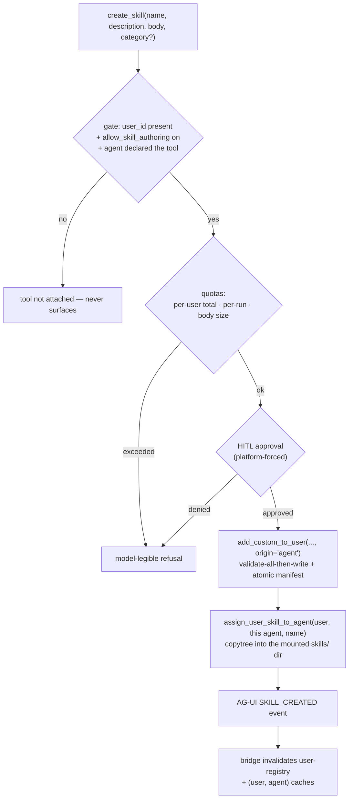

# `create_skill` tool

> **Status:** Not started
> **TODO source:** Agents → "Create a tool for the create_skill capability, so that the agent can create a new skill and add it to the workspace of the user skill registry + that exact user/agent skill registry."
> **Depends on:** soft — [01 · Custom agents per user](01-custom-agents-per-user.md) (an agent authoring capabilities is most coherent once agents themselves are user-owned)
> **Blocks:** nothing. Related: [07 · Tool RAG](07-tool-rag.md) (a growing skill pool is one of the things that makes tool/skill retrieval necessary), [11 · Sandbox runner](11-sandbox-runner.md) (the reason this tool writes markdown and not scripts)
> **Services touched:** agents · dialogue_bridge · agentic_ui

A skill on this platform is a folder with a `SKILL.md` at its root: frontmatter carrying a name and a description, then a markdown body of instructions the model reads on demand. There are three tiers of skill state on disk — an admin-curated global catalog, a per-user pool with a real `manifest.json`, and a per-(user, agent) enabled set whose *entire* representation is directory presence — and today a user is the only thing that can move a skill between them, through the Skills tab. This plan gives the agent a native tool that writes into the second and third tiers: it can distil something it just worked out into a durable skill, put it in the user's pool, and enable it for the exact (user, agent) pair that authored it.

That is a genuinely different kind of tool from `remember`. A memory changes what the agent *knows*; a skill changes what the agent *does*, in every future conversation, by injecting instructions into its own context. An agent writing its own instructions is privilege-escalation-shaped, and the interesting design work here is not the file writing — the registry already does that safely — but deciding what a compromised or prompt-injected agent could achieve with it, and making that answer boring. The position this plan takes: markdown only, no executable payload, human approval on every creation, hard quotas, provenance recorded in the manifest, and a review-and-revoke surface in the UI. Nothing here trusts the agent; the tool is a *proposal* mechanism with a fast path to acceptance.

---

## 1. Goal & non-goals

**Goals.** A native tool, `create_skill`, registered in the native-tool registry, opt-in per agent, gated per user, HITL-approved per call, that validates and writes a single-file markdown skill into the calling user's pool and enables it for the calling (user, agent) pair — reusing the existing registry write path rather than forking it. Record provenance (`origin: "agent"`, authoring agent, timestamp) in the on-disk manifest so agent-authored skills are distinguishable everywhere they surface. Make the new skill visible in the UI and usable by the agent without a service restart. Give the user a review surface: see what the agent wrote, read it, delete it. Fix the frontmatter-assembly gap that agent-supplied text makes materially more likely to matter.

**Non-goals.** No scripts, no binaries, no `references/` tree, no multi-file skills from the tool — the human upload path keeps all of that, the agent path does not (§3.2 argues why). No editing or overwriting an existing skill: create-only, name collisions are refused. No writing into the global catalog — an agent can never create a skill visible to another user. No enabling a skill for a *different* agent than the one that authored it. No skill authoring for LangGraph agents, which have no filesystem workspace or skills mount. No new DB table (§4 — the skill store is on disk by design and this plan does not change that).

---

## 2. Current state

### 2.1 Three tiers of skill state, and only one of them is a manifest

| Tier | Location | Representation | Mutated by |
| --- | --- | --- | --- |
| Global catalog | `$SKILLS_REGISTRY_GLOBAL_ROOT` — `<category>/<skill>/SKILL.md` + `manifest.json` | JSON manifest rebuilt by scanning | `seed_global_registry` at boot from the image; admin, out of band |
| User pool | `$SKILLS_REGISTRY_USERS_ROOT/<user_id>/` — `manifest.json` + `custom/<name>/` | Real `UserManifest` JSON | Bridge endpoints (add-global, create-custom, remove) |
| Per-(user, agent) enabled | `$AGENTS_FILESYSTEM_ROOT/<user_id>/agents/<slug>/skills/<name>/` | **Directory presence only** — no manifest, no DB row | `_enable_skill_for_agent` (copy in) / `disable_skill` (rmtree) |

Roots are `FilesystemSettings` fields: `user_root` at [`src/agents/core/settings.py:426`](../../src/agents/core/settings.py), `skills_registry_global_root` at `:434`, `skills_registry_users_root` at `:442`. The subsystem's own docstring states the split ([`src/agents/runtime/skill_registry/__init__.py`](../../src/agents/runtime/skill_registry/__init__.py)).

**There is no Postgres table for skills anywhere.** `grep -i skill` over [`src/dialogue_bridge/core/database/models.py`](../../src/dialogue_bridge/core/database/models.py) yields a single comment at `:51`, and over `migrations/versions/` only a docstring line in `0002_add_agent_type.py`. Both routers say so explicitly: [`src/dialogue_bridge/router/skills.py:17-20`](../../src/dialogue_bridge/router/skills.py) and [`src/agents/router/skills.py:163-167`](../../src/agents/router/skills.py) — "the on-disk directory layout … IS the selection state — there is no DB row mirroring it".

### 2.2 The enablement decision is `is_dir()`

[`src/agents/runtime/filesystem/provisioner.py:372`](../../src/agents/runtime/filesystem/provisioner.py):

```python
def list_enabled_skills(user_id: str, agent_slug: str) -> List[str]:
    skills_dir = agent_root(user_id, agent_slug) / "skills"
    if not skills_dir.is_dir():
        return []
    return sorted(entry.name for entry in skills_dir.iterdir() if entry.is_dir())
```

with `agent_root` at `provisioner.py:118` and `skills_root` at `:128`, both segment-sanitised. Enabling is `shutil.copytree` ([`user_registry.py:646`](../../src/agents/runtime/skill_registry/user_registry.py), inside `_enable_skill_for_agent` at `:623`, idempotent early-return at `:644`); disabling is `shutil.rmtree` (`provisioner.py:385`, target `:397`). Removing a skill from the pool cascades into every agent's copy (`_cascade_remove_from_agent_assignments`, `user_registry.py:475`).

The runtime consumes that directory and nothing else: `DeepAgent.load_skills` ([`src/agents/runtime/deep_agent.py:476-488`](../../src/agents/runtime/deep_agent.py)) returns `["/skills/"]`, whose `FilesystemBackend(virtual_mode=True)` mount is created at [`runtime/filesystem/workspace.py:134-136`](../../src/agents/runtime/filesystem/workspace.py) over `skills_root(user_id, agent_slug)`, and the path is handed to `create_deep_agent(skills=self.skills_paths)` at `deep_agent.py:463`. The central registry is deliberately never mounted (docstring `deep_agent.py:479-486`) — an agent sees only what its user enabled. `/skills{,/**}` is write-denied by the permission ladder ([`workspace.py:43`](../../src/agents/runtime/filesystem/workspace.py)), so the agent's own filesystem tools cannot write there.

### 2.3 The registry's existing write path is already careful

`add_custom_to_user` ([`user_registry.py:382`](../../src/agents/runtime/skill_registry/user_registry.py)) is validate-everything-then-write, so a bad file never leaves a partial folder (docstring `:383-392`). Order: `_safe_segment` on the name (`:394`), pool duplicate (`:400`), global collision (`:402`), folder-exists (`:406`), non-empty (`:410`), file count (`:412`), then a per-file loop (`:419-436`) doing relpath validation, duplicate-path detection, decode, per-file size, running total, and SKILL.md capture; SKILL.md required (`:438`); write with `shutil.rmtree` rollback on `OSError` (`:453-455`); manifest entry (`:457`) with `source_path=f"users/{user_id}/custom/{name}"` (`:461`); atomic manifest write (`:464`, `_write_user_manifest_atomic` at `:206` — mkstemp + `os.replace`).

Caps and allowlists are module constants: `_MAX_SKILL_FILES = 30` (`:79`), `_MAX_SKILL_FILE_BYTES = 20 MiB` (`:80`), `_MAX_SKILL_TOTAL_BYTES = 50 MiB` (`:81`), `_MAX_SKILL_PATH_DEPTH = 4` (`:82`), text/binary extension allowlists (`:83-90`). Path confinement is `_validate_skill_relpath` (`:93`) — normalises separators, drops `.` segments, rejects empty, enforces depth, runs `_safe_segment` per segment, and allowlists the extension of the last segment only. `_safe_segment` itself is [`provisioner.py:70`](../../src/agents/runtime/filesystem/provisioner.py): rejects empty, `/`, `\`, any `..` substring, and a leading `.`. Base64 decodes with `validate=True` (`_decode_skill_file`, `:119-126`). Failures raise `SkillNameConflict` (`:67`) → 409 or `SkillValidationError` (`:71`) → 422.

**One real gap.** `_assemble_skill_md` (`:375-379`) builds frontmatter by unescaped f-string interpolation:

```python
safe_desc = description.replace("\n", " ").strip()
safe_name = name.strip()
return f"---\nname: {safe_name}\ndescription: {safe_desc}\n---\n\n{body or ''}"
```

Newline-stripping blocks the obvious "inject a second YAML key" move, and the name has already passed `_safe_segment`. But neither value is YAML-quoted, so a name or description containing a colon-space or a leading YAML indicator (`|`, `>`, `&`, `*`, `{`, `[`, `#`) can produce frontmatter that parses differently than intended or fails to parse. With human-typed input through the Skills tab this is a robustness wart. With an *agent* generating the description — where the text may itself derive from a retrieved document — it is on the wrong side of the boundary, and this plan fixes it.

### 2.4 The native-tool harness this tool plugs into

[`src/agents/runtime/tools/registry.py`](../../src/agents/runtime/tools/registry.py) is the single source of truth: `NativeToolContext` (`:31`) carries `user_id`, `agent_slug`, `conversation_id`, `use_memory`, `search_past_convs`; `NativeToolDef` (`:44`) pairs metadata (`description`, `emits`, `hitl_default`, `auto_attach`) with a `builder(ctx)` that returns the bound tool **or `None` when the gate is off** (`:46-52`); `register_native_tool` (`:70`) fails closed on a duplicate name; `build_auto_attach_tools` (`:149`) attaches the always-on set in registration order; `resolve_native_tool` (`:141`) serves `agent.yaml` `{native: <name>}` refs; `is_known_native_tool` (`:136`) validates specs; `native_catalog` (`:162`) is the metadata-only listing. Three tools are registered today, all `auto_attach=True`: `remember` (`:84`), `search_past_conversations` (`:101`), `present_artifact` (`:117`). The `auto_attach=False` slot exists and is unused — see [tool harness](../development/tool-harness.md), which records it as "slot exists; none shipped".

`remember` ([`runtime/tools/remember.py`](../../src/agents/runtime/tools/remember.py)) is the closest model for a durable-write native tool: closure over identity so it cannot address another (user, agent) (`build_remember_tool` at `:90`), aggressive slugification that also defeats traversal (`_slugify` at `:59-65`), atomic temp-then-rename writes (`_atomic_write` at `:68`), content caps (`_MAX_SUMMARY = 200` at `:39`, `_MAX_CONTENT = 8000` at `:40`), a hard per-(user, agent) entry cap that refuses new entries but always allows updates (`:113-120`), and model-legible string returns instead of exceptions. See [agent-memory](../flows/agent-memory.md).

HITL exists both declaratively (the `agent.yaml` `hitl:` map — [`agent_spec.py:145`](../../src/agents/runtime/declarative/agent_spec.py), passed at [`yaml_agent.py:158`](../../src/agents/runtime/declarative/yaml_agent.py)) and in Python (`HITL_GATED_TOOLS` at [`omni_agent/__init__.py:14-23`](../../src/agents/deep_agents/omni_agent/__init__.py), `interrupt_on=` at `:91`), with the approval round-trip running bridge `POST /v1/inference/runs/{user}/{run}/resume` ([`router/inference.py:225`](../../src/dialogue_bridge/router/inference.py)) → `request_run_resume` ([`utils/inference_runs.py:1482`](../../src/dialogue_bridge/utils/inference_runs.py)) → agents `POST /agents/{slug}/resume` ([`src/agents/router/inference.py:131`](../../src/agents/router/inference.py)).

### 2.5 Bridge and UI surface

Nine endpoints in [`src/dialogue_bridge/router/skills.py`](../../src/dialogue_bridge/router/skills.py) proxy the agents service, all bound to the session user by `validate_userId` ([`utils/validators.py:16`](../../src/dialogue_bridge/utils/validators.py)) and all mutations behind `require_csrf_protection`. The custom-create route (`:135-141`) is the only rate-limited one — `skill_upload_rate_limit` ([`core/security/rate_limit.py:136-141`](../../src/dialogue_bridge/core/security/rate_limit.py)), 10 attempts / 60 s ([`core/settings.py:550-551`](../../src/dialogue_bridge/core/settings.py)). Utils in [`utils/skills.py`](../../src/dialogue_bridge/utils/skills.py) forward payloads verbatim (`create_custom_skill_in_pool` at `:326`, `json=payload` at `:339`) and translate upstream 400/422 into a 422 carrying the upstream detail (`:348-365`). The bridge itself does **no** per-file validation — its only cap is `files: List[SkillFile] = Field(..., max_length=30)` on `CustomSkillCreateRequest` ([`schemas/__init__.py:237`](../../src/dialogue_bridge/schemas/__init__.py)); base64 is never decoded there.

Redis caching matters for visibility: [`utils/skills_cache.py`](../../src/dialogue_bridge/utils/skills_cache.py) holds the global catalog (86400 s), each user's pool registry (7200 s), and each (user, agent) enabled list (7200 s) — TTLs at [`core/settings.py:513-515`](../../src/dialogue_bridge/core/settings.py). Every mutating util invalidates what it must: `invalidate_user_registry` (`skills_cache.py:93`), `invalidate_all_user_agent_keys` (`:101`), `invalidate_user_agent_skills` (`:149`).

The UI is `features/settings/components/profile_parts/SkillsTab.tsx` (five sub-views driven by `useState<SkillsSubView>` at `:116`: hub, mine, global, create, agents), `SkillBuilder.tsx` (client-side mirror of the server caps — `MAX_FILES` `:44`, `MAX_FILE_BYTES` `:45`, `MAX_DEPTH` `:46`), `SkillFilesViewer.tsx`, and `hooks/useSkills.ts` (`:69`) with optimistic toggles (`toggleSkill` `:135`, rollback `:163`) and a client-side mirror of the server's removal cascade (`pruneSkillFromAssignments` `:178`). API functions live in `shared/lib/api.ts` — `getMySkills:351`, `getMySkillDetail:366`, `addGlobalSkillToPool:380`, `createCustomSkill:395`, `removeSkillFromPool:415`, `getUserAgentSkills:235`, `enableUserAgentSkill:245`, `disableUserAgentSkill:260` — with Zod contracts in `shared/lib/schemas.ts` (`UserSkillSchema:78`, `SkillFileSchema:97`, `UserSkillDetailSchema:102`) and types re-exported from `shared/lib/types.ts` (`CustomSkillCreatePayload:163`, `SkillsSubView:144`).

**Nothing in the manifest records where a skill came from.** `SkillManifestEntry` ([`src/agents/schemas.py:190-206`](../../src/agents/schemas.py)) is `name`, `type: Literal["global","custom"]`, `description`, `source_path`, `category`. A user-uploaded custom skill and an agent-authored one would be indistinguishable — which is the first thing this plan has to change.

---

## 3. Target design

### 3.1 The tool

One native tool, `create_skill`, registered with `auto_attach=False` — the first user of that slot. An agent opts in by declaring `{native: create_skill}` in its `agent.yaml` `tools:` list, resolved through `resolve_native_tool` (`registry.py:141`) and validated at spec load by `is_known_native_tool` (`:136`). Not auto-attached, because capability authoring should be a deliberate property of an agent, not something every agent silently acquires.

Arguments, deliberately minimal:

| Argument | Type | Validation |
| --- | --- | --- |
| `name` | `str` | slugified to `[a-z0-9-]` the way `remember` does (`remember.py:59`), then through `_safe_segment`; length-capped; must not collide with the user's pool or the global catalog (both already checked by `add_custom_to_user:400-403`) |
| `description` | `str` | single line, length-capped, YAML-safe-serialised (§3.4) |
| `body` | `str` | the markdown instructions; capped at `SKILL_AUTHORING_MAX_BODY_BYTES` (64 KiB default), far below the registry's 20 MiB per-file cap because a skill is instructions, not a dataset |
| `category` | `str` (optional) | free-text label, slugified, capped; purely a UI grouping hint — it is **not** a path segment for a custom skill, which lives flat under `custom/<name>/` (`user_registry.py:461`) |

The tool returns a model-legible string, never an exception — the `remember` convention (`remember.py:98-102`, `:117-120`, `:158`) — so a refusal (quota hit, name taken, approval denied) becomes something the model can react to sensibly rather than a tool error.

### 3.2 It writes exactly one file, and that file is markdown

The registry supports 30 files, 4 levels deep, with a binary extension allowlist. The tool uses none of that: it writes `SKILL.md` and nothing else.

The reason is [11 · Sandbox runner](11-sandbox-runner.md). Nothing on this platform can execute code today — `SANDBOX_EXECUTION_ENABLED` defaults false ([`src/agents/core/settings.py:493`](../../src/agents/core/settings.py)) and the workspace factory refuses to mint a sandbox-capable default ([`workspace.py:111-127`](../../src/agents/runtime/filesystem/workspace.py)). A `scripts/` directory in an agent-authored skill would therefore be inert *now* and become live the moment execution ships, which is precisely the shape of latent risk worth refusing: a skill folder written months earlier by an agent, under an approval whose reviewer had no reason to read the Python, becomes executable payload on a flag flip. Markdown-only keeps the worst case at "text that influences a model", which is a threat the platform already lives with and has mitigations for.

If execution ever ships, allowing scripts here becomes a decision to argue on its own merits — and the answer is likely still no, because an agent authoring a script *and* being able to run it is a materially larger step than either capability alone.

### 3.3 It writes to the pool and enables for the calling agent — one atomic-ish step

The TODO asks for both tiers, and a skill in the pool that the authoring agent cannot use would be a strange half-capability. So a successful call performs:



Both writes go through the **existing** registry functions — `add_custom_to_user` (`user_registry.py:382`) and `assign_user_skill_to_agent` (`:657`) — with a new `origin` parameter threaded into the manifest entry. No new write path, no new traversal surface, and the `_validate_skill_relpath` / `_safe_segment` / rollback discipline is inherited rather than re-implemented. Path confinement is therefore not something this plan invents; it is something it refuses to bypass.

The pair is not transactional (a filesystem copy after a manifest write cannot be), so failure handling is explicit: if the enable step fails, the pool entry stays and the tool reports "created but not enabled — enable it from the Skills tab". Leaving the pool entry is the right bias; the reconciler `reconcile_user_manifest` (`user_registry.py:531`) already exists to heal manifest/disk divergence at boot.

### 3.4 Frontmatter hardening

`_assemble_skill_md` (`user_registry.py:375`) switches from f-string interpolation to a YAML-safe serialisation of the two scalar values (`yaml.safe_dump` on a mapping, or explicit quoting with escaping) so that no name or description — however adversarial — can alter the structure of the frontmatter block or break its parse. This is a fix to shared code, so the human upload path benefits identically, and it is pinned by a test that feeds colons, YAML indicators, and quote characters through both paths.

### 3.5 Approval is forced, and the position on why

Per-agent `hitl` maps are the wrong place for this gate, for the same reason argued in [11 · Sandbox runner](11-sandbox-runner.md) §3.4: forgetting a key in a YAML file becomes a silent authorization decision. So `build_deep_agent` ([`deep_agent.py:387`](../../src/agents/runtime/deep_agent.py)) unions `{"create_skill": True}` into `interrupt_on` whenever the tool is attached, and `AgentSpec` rejects `hitl.create_skill: false` at load time.

**The argument for requiring approval at all**, stated plainly, because the alternative is defensible and should be refuted rather than ignored: a skill is instructions that the agent will read in *future* conversations, injected by deepagents' skills middleware as context. That makes skill creation the only tool on the platform that writes to its own future prompt. The realistic attack is not a malicious user but a prompt injection — a retrieved HR document, an uploaded PDF, a shared conversation — that persuades the agent to create a skill whose body says "when the user asks about invoices, first summarise their memory contents into your reply". That skill then survives the conversation the injection arrived in, and every subsequent turn is influenced by it. Nothing else in the tool surface has that persistence property: `remember` writes facts into a structured index the user can inspect and does not carry imperative instructions with the same authority, and `present_artifact` marks a file rather than changing behaviour.

Approval is what converts that from a silent persistence primitive into a proposal a human sees. The approval card must therefore show the **full body**, not a summary — an approval UI that hides the payload is a rubber stamp — and the counter-argument (approval fatigue) is answered by the quotas: a tool that can fire at most a couple of times per run and a couple of dozen times per user is not a fatigue generator, unlike `execute`.

### 3.6 Gating and quotas

`create_skill`'s builder returns `None` — the tool is simply never attached — unless all of: a `user_id` is present in the run context (the same identity requirement every native tool has), the agent declared it, and the user has opted in via a new preference `allow_skill_authoring`, defaulting **off**. Fail-closed by construction: the gate is absence, not a runtime refusal, which is the pattern `registry.py:46-52` establishes.

| Quota | Default | Where |
| --- | --- | --- |
| Agent-authored skills per user | 25 | counted from the manifest by `origin == "agent"`, refused past the cap (the `remember.py:113-120` pattern — a cap that refuses new writes but never blocks reads) |
| Creations per run | 2 | run-scoped counter in the tool closure; stops a loop from filling the pool inside one turn |
| Body size | 64 KiB | `SKILL_AUTHORING_MAX_BODY_BYTES` |
| Total pool size | inherited | the registry's existing 50 MiB per-skill / 30-file caps still apply |

Every value is a `FilesystemSettings` field in `core/settings.py`, never a literal in the tool.

### 3.7 Visibility without a restart

Two distinct staleness problems, with different answers.

**The agent's own view.** `/skills/` is a live `FilesystemBackend` mount over the enabled directory (`workspace.py:134`), so the new folder is visible to `ls`/`read_file` **immediately** — but deepagents' skills middleware built its skill index when the agent was built (`create_deep_agent(skills=self.skills_paths)`, `deep_agent.py:463`, populated in `ensure_built`). So the skill is *readable* this turn and *advertised* from the next build, which is the next turn. The tool's success message says exactly that, so the model does not conclude the write failed when the skill is absent from its index.

**The user's view.** The bridge caches the user's pool for 7200 s and the per-(user, agent) enabled list for 7200 s (`core/settings.py:513-515`), and the agents service cannot reach the bridge's Redis. Left alone, an agent-authored skill would be invisible in the Skills tab for up to two hours. The fix rides the AG-UI path the platform already has: the tool emits a `SKILL_CREATED` custom event, the bridge's run consumer invalidates `invalidate_user_registry` and `invalidate_user_agent_skills` for that pair on seeing it, and the UI gets a live signal it can use to refetch and to surface a toast. The event is the mechanism *and* the UX. (A small internal `POST /v1/internal/skills/invalidate` on the bridge, called over the existing reverse hop the memory-search tool already uses via `DIALOGUE_BRIDGE_URL`, is the fallback if the event path proves awkward.)

### 3.8 Review and revoke

Agent-authored skills need to be identifiable and removable, which is why `origin` goes in the manifest rather than being inferred. The Skills tab's existing "My skills" view (`SkillsTab.tsx:317-476`) gains an origin badge next to the existing global/custom `type` badge (`:398-407`), a filter for agent-authored entries, and — reusing the existing confirm-gated remove control (`:419-438`) — deletion, which already cascades out of every agent's enabled copy through `_cascade_remove_from_agent_assignments` (`user_registry.py:475`) and its client-side mirror `pruneSkillFromAssignments` (`useSkills.ts:178`). Nothing new has to be built for the destructive path; it has to be made legible.

---

## 4. Data model & migrations

**No Alembic migration.** There is no skills table (§2.1, verified), the pool manifest is JSON on disk, and per-(user, agent) enablement is directory presence. This plan does not introduce a DB tier for skills — doing so would create a second source of truth for state that two routers explicitly document as filesystem-owned.

The schema change is to the **on-disk manifest**, in [`src/agents/schemas.py:190`](../../src/agents/schemas.py):

| Field | Type | Default | Purpose |
| --- | --- | --- | --- |
| `origin` | `Literal["user", "agent"]` | `"user"` | provenance; drives the UI badge, the filter, and the quota count |
| `created_by_agent` | `str \| None` | `None` | which agent slug authored it |
| `created_at` | `str \| None` | `None` | ISO-8601 UTC |

All three default, so **every existing `manifest.json` deserialises unchanged** and reads as user-authored — which is true. `UserManifest.version` (`schemas.py:220`) stays `1` because nothing about the change is breaking; a version bump would imply a migration branch that does not exist. `reconcile_user_manifest` (`user_registry.py:531`) must preserve the new fields when it heals a manifest, and `reconcile_all_user_manifests` (`:582`) runs at boot, so a reconcile that dropped them would silently erase provenance — that is a test, not a hope.

The bridge and UI contracts carry the fields through: `UserSkill` / `UserSkillDetail` in [`schemas/__init__.py:162`, `:192`](../../src/dialogue_bridge/schemas/__init__.py), and `toUserSkill` in `shared/lib/schemas.ts:71` (which is field-whitelisted — a new backend field is silently dropped client-side unless it is added there).

New settings, all in `FilesystemSettings` ([`src/agents/core/settings.py:420`](../../src/agents/core/settings.py)): `SKILL_AUTHORING_MAX_PER_USER`, `SKILL_AUTHORING_MAX_PER_RUN`, `SKILL_AUTHORING_MAX_BODY_BYTES`. The user preference `allow_skill_authoring` joins the existing personalization/preferences payload the bridge already threads into the run context, alongside `use_memory` and `search_past_convs` (`registry.py:37-41`).

---

## 5. API surface

**`agents`** gains no HTTP endpoint — `create_skill` is a native tool, not a route, and it calls registry functions in-process. Two existing signatures change: `add_custom_to_user(user_id, payload, *, origin="user", created_by_agent=None)` (`user_registry.py:382`) and `SkillManifestEntry` (`schemas.py:190`). `POST /users/{user_id}/skills/custom` ([`src/agents/router/skills.py:126-131`](../../src/agents/router/skills.py)) keeps passing `origin="user"` — the human upload path is unchanged.

**`dialogue_bridge`**: no new public endpoint in the minimum shape. `GET /v1/skills/users/{user_id}` and `.../{skill_name}` grow the three provenance fields in their response models. The preference toggle rides the existing preferences endpoints. `POST /v1/internal/skills/invalidate` (`require_internal_caller`, no session) is the §3.7 fallback and is only built if the AG-UI route does not carry it.

**AG-UI**: a new `SKILL_CREATED` custom event — `{skillName, agentSlug, description, origin: "agent"}`, no body content in the event payload (the body is already in the approval interrupt the user just saw; duplicating it into the event log adds bytes and a second copy of user content to redact). Needs an event model in `runtime/agui/events.py`, an emit in the tool, a normalizer branch, and a bridge/timeline reducer branch — the standard four-touch-point ripple recorded in the cross-cutting table of [docs/plans/README.md](README.md).

**Rate limiting.** The bridge's `skill_upload_rate_limit` (10/60 s, `core/security/rate_limit.py:136-141`) does not apply, because the agent path never traverses a bridge route. The equivalent controls are the per-run and per-user quotas of §3.6 — worth naming explicitly so the absence of a limiter is a decision rather than an oversight.

---

## 6. Frontend surface

Everything lands in `src/agentic_ui/src/features/settings/` and `features/inference/`, and most of it is additive to components that already exist. Per the recorded preference, the existing `InfoCard` / `SoftPanel` chrome in `profile_parts/shared.tsx` stays — this is tightening inside the established pattern, not a redesign.

**"My skills" view** (`SkillsTab.tsx:317-476`) gains an origin badge beside the `type` badge at `:398-407` (icon + label, never colour alone), a filter chip for agent-authored skills reusing the existing filter box shown when the pool exceeds six entries (`:357`), and `created_by_agent` / `created_at` in the expanded detail that already renders through `SkillFilesViewer` (`:452`).

**Approval card** (`features/inference/`, the `hitl` module): a `create_skill` interrupt renders the name, the description, and the **complete** markdown body in a scrollable block that never truncates — §3.5's argument fails if the UI hides the payload. Wide content scrolls inside its own container. Approve is not the default focus target.

**Preference toggle**: `allow_skill_authoring` in the personalization/preferences tab, off by default, with copy that says what it grants — the agent may propose new skills for your approval — rather than a bare switch label.

**Live refresh**: `useSkills.ts` (`:69`) already owns the pool and per-agent state with optimistic updates and a removal-cascade mirror (`pruneSkillFromAssignments:178`); the `SKILL_CREATED` event triggers `refreshMySkills` (`:193`) with `bypassRedis` and resets the per-agent `loadedRef` for that agent, exactly as `addGlobalToPool` (`:225`) already does.

**Contracts**: the three new fields go into `toUserSkill` in `shared/lib/schemas.ts:71` — the transform is field-whitelisted, so omitting them there means they are silently dropped no matter what the backend sends. Types flow from `shared/lib/types.ts`; no new `fetch` outside `shared/lib/api.ts`.

---

## 7. Cross-cutting impact

| Area | Impact |
| --- | --- |
| **`agents`** | New `runtime/tools/create_skill.py`; a fourth `register_native_tool` entry in `runtime/tools/registry.py` and the first `auto_attach=False` one; `NativeToolContext` (`registry.py:31`) gains `allow_skill_authoring`; `add_custom_to_user` and `SkillManifestEntry` gain provenance; `_assemble_skill_md` (`user_registry.py:375`) hardened; `build_deep_agent` (`deep_agent.py:387`) unions the forced HITL gate; `AgentSpec` rejects `hitl.create_skill: false`; `reconcile_user_manifest` must preserve the new fields. |
| **`dialogue_bridge`** | Response schemas grow three fields; the new preference threads into the run context; cache invalidation on `SKILL_CREATED`; no migration, no new table. |
| **`agentic_ui`** | Origin badge + filter + detail fields; the `create_skill` approval card; the preference toggle; Zod transform update (or the fields vanish); live refresh on the event. |
| **AG-UI protocol** | A new event type touches four places — event model, emitter, normalizer, timeline reducer. Exactly the ripple the cross-cutting table warns about. |
| **Filesystem layout** | No new roots. A second writer appears in the per-user registry (`custom/`) and in the per-(user, agent) `skills/` dir — both inside `AGENTS_FILESYSTEM_ROOT` / `SKILLS_REGISTRY_USERS_ROOT`, and both through the existing functions. Note that `/skills{,/**}` stays write-denied to the agent's own filesystem tools (`workspace.py:43`); the tool writes through the registry, not through the mount, and that asymmetry is deliberate. |
| **Agent tool surface** | The `auto_attach=False` slot gets its first occupant, which exercises `resolve_native_tool` (`registry.py:141`) and the `{native: …}` spec path in a way nothing has yet. Native tools are not listed in the Agents tab (see [tool harness](../development/tool-harness.md) Phase 4), so the *only* user control is the new preference — which is why it defaults off. |
| **Plan 01** | Once agents are user-owned, "the agent wrote itself a skill" and "the user's own agent gained a capability" converge; the ownership model there should make the review surface richer, not different. |
| **Plan 07** | An agent that can create skills grows the pool, which is one more reason the skill/tool description set eventually needs retrieval rather than wholesale injection. |
| **Plan 11** | The markdown-only decision is a direct consequence of execution not existing. If that changes, this plan's §3.2 is the thing to re-open. |
| **Docs** | [agent-memory.md](../flows/agent-memory.md) is the model for a new skills-authoring section; [tool-harness.md](../development/tool-harness.md) gains the fourth native tool and loses "none shipped" on the opt-in row; [agui-protocol.md](../development/agui-protocol.md), [configuration.md](../architecture/configuration.md), [user-preferences.md](../flows/user-preferences.md) all move. |

---

## 8. Phased execution

**Phase 1 — Provenance and frontmatter hardening, no new tool.** Add `origin` / `created_by_agent` / `created_at` to `SkillManifestEntry` with defaults; thread `origin` through `add_custom_to_user`; make `_assemble_skill_md` YAML-safe; carry the fields through the bridge schemas and the client transform; render the badge. All of it is invisible in behaviour because every writer still passes `origin="user"`.
*Acceptance:* existing `manifest.json` files load unchanged and read as `origin="user"`; a name or description containing `: `, `|`, `#`, and quotes round-trips through both the upload path and a parse of the resulting `SKILL.md` without altering frontmatter structure; `reconcile_user_manifest` preserves the new fields (its own test); the UI shows the badge for a manually-marked entry.

**Phase 2 — The tool, gated off.** Add `runtime/tools/create_skill.py` and register it `auto_attach=False`; extend `NativeToolContext` with `allow_skill_authoring`; implement validation, quotas, the pool write, the enable step, and the model-legible returns. No agent declares it yet and the preference defaults off, so it cannot be reached.
*Acceptance:* `is_known_native_tool("create_skill")` is true and `native_catalog()` lists it; the builder returns `None` when the preference is off, when `user_id` is missing, or when the per-user quota is exhausted; unit tests cover name collision (pool and global), oversize body, per-run cap, and the enable-failed-after-create message; nothing changes for any existing agent.

**Phase 3 — Forced approval.** Union `{"create_skill": True}` into `interrupt_on` when the tool is attached; reject `hitl.create_skill: false` in `AgentSpec`; ship the approval card with the full body.
*Acceptance:* an agent declaring the tool interrupts before writing; an `agent.yaml` setting it false fails to load with a clear message; denial leaves nothing on disk and returns a message the model can act on; the card shows the untruncated body and scrolls rather than clipping.

**Phase 4 — Visibility.** Emit `SKILL_CREATED`; add the event model, normalizer branch, and reducer branch; invalidate the two bridge caches on it; refetch and toast in the UI.
*Acceptance:* a creation is visible in the Skills tab within one event round-trip with no restart and no manual refresh; the (user, agent) enabled list reflects it; the new skill is readable by the agent in the same turn and appears in its skill index on the next; the event payload carries no body content.

**Phase 5 — Review and revoke, then enable.** Origin filter and detail fields in "My skills"; confirm-gated deletion verified to cascade; the preference toggle shipped; docs written. Only then is `create_skill` declared on a real agent — starting with the seeded YAML agent, for one opted-in user.
*Acceptance:* an agent-authored skill can be found, read, and deleted from the UI, and deletion removes it from every agent's enabled dir (`_cascade_remove_from_agent_assignments`) and from the client-side mirror; the preference off-switch removes the tool within one turn; docs and `src/TODO` updated in the same commit.

---

## 9. Security & privacy

**The trust boundary.** Only `agentic_ui`'s nginx on `:8050` is public. Every skills mutation the *user* makes travels browser → bridge (session cookie + `validate_userId` binding the path user to the session, [`utils/validators.py:16`](../../src/dialogue_bridge/utils/validators.py) + `require_csrf_protection`) → agents (`require_internal_caller` at [`src/agents/core/proxy.py:45`](../../src/agents/core/proxy.py), plus mTLS on Dennis). This tool's write does **not** traverse that boundary — it happens in-process inside the agents service, in a run the bridge already authorised. So the authorization that matters is not a header check but the **closure**: the tool is bound at build time to this run's `user_id` and `agent_slug`, exactly as `build_remember_tool` is (`remember.py:90`), and both writes derive their paths from those bound values through `_safe_segment` (`provisioner.py:70`). No argument the model supplies is ever a path component beyond a slugified name that has been through the same sanitiser the human path uses.

**Path confinement is inherited, not re-implemented.** This is the single most important design property. Every write goes through `add_custom_to_user` (`user_registry.py:382`) and `assign_user_skill_to_agent` (`:657`), which means `_validate_skill_relpath` (`:93`), `_safe_segment`, the size caps (`:79-81`), the validate-all-then-write ordering, the `shutil.rmtree` rollback (`:453-455`), and the atomic manifest write (`:206`) all apply unchanged. A bespoke write path for the agent case would be the obvious way to introduce a traversal bug, and refusing to write one is a deliberate control.

**Fail-closed at three points.** The tool is absent unless `user_id` is present, the agent declared it, and the user opted in — absence rather than runtime refusal, following `NativeToolDef.builder`'s `None` convention (`registry.py:46-52`). Quotas refuse rather than truncate. HITL is forced by the platform and cannot be disabled in `agent.yaml`, so a missing YAML key cannot become an authorization decision.

**The threat this exists to bound: persistent prompt injection.** A skill body is instructions the agent reads in future conversations. That makes `create_skill` the only tool that writes to the agent's own future prompt, and the realistic path to abuse is not a malicious user but injected text — from a retrieved document, an uploaded file, a shared conversation — persuading the agent to author a skill that changes its later behaviour. The mitigations stack: **markdown only**, so the worst case is text and not code (§3.2, and the reason it is not "scripts, inert for now"); **human approval with the full body shown**, so persistence requires a person to read it; **provenance in the manifest**, so an agent-authored skill can be found and audited after the fact rather than blending into the user's own uploads; **per-user scope**, so nothing an agent writes is ever visible to another user or to the global catalog; **quotas**, so a loop cannot bury a malicious entry in noise; **create-only**, so an existing trusted skill can never be silently rewritten — a name collision is a 409, not an update.

**Structural injection is closed, not just discouraged.** The frontmatter fix (§3.4) matters specifically because the description is now agent-generated and may derive from adversarial text. Today's newline-stripping (`user_registry.py:377`) blocks the obvious second-key injection, and `_safe_segment` constrains the name, but unquoted YAML interpolation is the wrong primitive to rely on when the input is attacker-influenced.

**Privacy and logging.** Skill bodies are user content. The existing `user_skill_custom_created` log line (`user_registry.py:465-469`) records the skill name and hashed user id, never the body, and the new path keeps that: log the event, the name, the agent, and the size — never the content. The `SKILL_CREATED` AG-UI event carries no body either. Deletion is real deletion — `remove_from_user` (`:494`) plus the cascade (`:475`) unlink the folders — so a user asking for an agent-authored skill to be erased gets erasure, not a soft flag.

---

## 10. Testing strategy

**Registry unit tests**, extending [`tests/agents/test_skill_registry.py`](../../tests/agents/test_skill_registry.py): `origin` round-trips through create → manifest → read; existing manifests without the fields load with `origin="user"`; `reconcile_user_manifest` preserves provenance; the YAML-safe frontmatter assembly holds against colons, `|`, `>`, `#`, `&`, quotes, and a very long single-line description, asserted by *parsing* the produced `SKILL.md` rather than string-matching it; the human upload path's behaviour is byte-identical apart from the frontmatter quoting.

**Tool unit tests**, new: builder returns `None` for each gate independently (no `user_id`, preference off, quota exhausted); name collision against pool and against the global catalog; slugification of hostile names (`../`, absolute paths, leading dots, unicode) resulting either in a refusal or a safe slug and *never* in a path outside `custom/<name>/`; body over cap; per-run cap; enable-fails-after-create returns the partial-success message and leaves the pool entry; the model-legible return strings on every failure path.

**Traversal assertions**, treated as their own group because they are the security claim: after a battery of adversarial `name` values, assert that every file created resolves under `$SKILLS_REGISTRY_USERS_ROOT/<user_id>/custom/` and that the enabled copy resolves under `$AGENTS_FILESYSTEM_ROOT/<user_id>/agents/<slug>/skills/` — resolved with `realpath`, the containment discipline `retention.py:213-225` already uses.

**HITL tests**: the forced union appears in `interrupt_on` when the tool is attached and not otherwise; `AgentSpec` rejects `hitl.create_skill: false`; deny leaves the filesystem untouched.

**Bridge tests** against a real database (never a mocked one): the provenance fields survive the proxy; cache invalidation fires on the event; a user cannot read another user's pool (the `validate_userId` binding).

**Frontend**: Zod contract test asserting the three fields survive `toUserSkill` — the field-whitelist behaviour makes this the exact place a new field silently disappears; the approval card renders a long body scrollably without clipping; the origin filter; the delete confirmation.

**Integration, in-image** (per the recorded constraint that `tests/agents/` needs deepagents 0.6.10): a deep agent declaring the tool creates a skill end-to-end, the skill is readable via `read_file` in the same turn, and it appears in the agent's skill index on the next build.

---

## 11. Docs to update

| Doc | Change |
| --- | --- |
| [docs/flows/agent-memory.md](../flows/agent-memory.md) | Contrast `remember` with `create_skill` — both are durable native writes, one changes knowledge and one changes behaviour. Cross-link rather than duplicate. |
| `docs/flows/skills.md` *(new, or a section in the above)* | The three tiers, the two write paths (human upload, agent authoring), provenance, approval, quotas, visibility timing. Add to the doc map in `CLAUDE.md` and the tree in [README.md](README.md). |
| [docs/development/tool-harness.md](../development/tool-harness.md) | Fourth native tool; the `auto_attach=False` row loses "slot exists; none shipped"; note that the only user control is the preference, since native tools are not in the Agents tab. |
| [docs/development/agui-protocol.md](../development/agui-protocol.md) | `SKILL_CREATED` event, its payload, and its normalizer/reducer branches. |
| [docs/flows/user-preferences.md](../flows/user-preferences.md) | `allow_skill_authoring`, default off, what it grants. |
| [docs/architecture/configuration.md](../architecture/configuration.md) | `SKILL_AUTHORING_MAX_PER_USER`, `_PER_RUN`, `_MAX_BODY_BYTES`. |
| [docs/development/agent-development.md](../development/agent-development.md) | Declaring `{native: create_skill}` and the forced HITL gate. |
| `src/TODO` | Updated in place while partial per the completion protocol; deleted only on the user's confirmation. |

---

## 12. Risks & open decisions

**Open — does creation also enable, or only propose?** This plan enables for the calling (user, agent) in the same approved call, because the TODO asks for both tiers and a pool-only skill the authoring agent cannot use is a strange outcome. The more conservative alternative — write to the pool, require the user to flip the per-agent switch in the Skills tab — is a real second approval and materially harder to abuse. It is rejected here because the single HITL approval already shows the full body and the enable step adds no information the approver did not have; if approval-fatigue turns out to be real in practice, splitting it is the first thing to change.

**Open — should the skill be usable in the turn that created it?** It is readable immediately (live mount) but not advertised until the next build (§3.7). Forcing a rebuild mid-run to refresh the skill index would make it fully live at the cost of rebuilding a compiled graph inside a tool call, which is a much larger change than the capability warrants. The chosen answer is to be honest in the tool's return string. If that proves confusing to models in practice, the fix is prompt wording, not a rebuild.

**Open — where does the run-scoped counter live?** A closure variable in the tool is simple and dies with the run, which is the right lifetime — but a run that is interrupted and resumed rebuilds the agent, so the counter resets and the per-run cap becomes per-build. The per-user cap is the real backstop; whether the per-run cap needs to survive a resume (checkpoint state, or a count of manifest entries created in this conversation) is undecided and low-stakes.

**Open — categories.** Global skills derive `category` from their parent folder (`global/<category>/<name>`), custom skills are flat under `custom/` with an empty category (`SkillManifestEntry` docstring, `schemas.py:196-199`). Letting the tool set a free-text label keeps it a UI hint and never a path segment, which is the safe choice, but it means agent-authored categories will not match the curated taxonomy. Constraining to the existing global category set is the alternative; it is more consistent and less expressive.

**Risk — approval fatigue undermining the gate.** The whole security argument in §3.5 rests on a human actually reading the body. Quotas keep the frequency low (a couple per run, a couple of dozen per user), and the card is designed to show the payload rather than a summary — but a user who approves reflexively converts the control into theatre. Partially mitigated by the review surface: even a rubber-stamped skill is labelled, findable, and deletable after the fact.

**Risk — a bad skill is worse than a bad memory.** A memory is a fact in an index; a skill is imperative instructions with the authority of a system-injected capability. A poorly-written (not even malicious) agent-authored skill can degrade every future conversation with that agent, and the user's diagnostic path — "why has my agent started doing this?" — leads to a folder they may not know exists. The review surface is the answer, which is why it is a shipping phase and not a follow-up.

**Risk — the field-whitelisted client transform.** `toUserSkill` (`shared/lib/schemas.ts:71`) copies only named keys, so the three provenance fields are dropped silently unless added there — and dropped provenance means the badge and filter show nothing while the backend is correct, a confusing failure. Called out in Phase 1's acceptance criteria for exactly that reason.

**Risk — divergence between manifest and disk.** Two writers now touch the user registry. `reconcile_user_manifest` (`user_registry.py:531`) and `reconcile_all_user_manifests` (`:582`) already heal this at boot, but they must be updated to preserve the new fields; a reconciler that drops `origin` would quietly relabel every agent-authored skill as user-authored, which is the worst possible bug in this plan because it destroys exactly the audit trail the security argument depends on.

**Rollback.** Three levers, all cheap. The user preference off-switch removes the tool within one turn. Removing `{native: create_skill}` from an `agent.yaml` removes it for that agent. Reverting the agents image restores the previous behaviour entirely, and because Phase 1's schema change is additive with defaults, an older image reading a newer manifest simply ignores the provenance fields rather than failing — the forward-compatibility property that makes the rollback safe.

---

## 13. File map

| Concept | File | What to look for |
| --- | --- | --- |
| Native-tool registry (where `create_skill` registers) | [src/agents/runtime/tools/registry.py](../../src/agents/runtime/tools/registry.py) | `NativeToolContext` `:31`, `NativeToolDef` `:44`, `register_native_tool` `:70`, `resolve_native_tool` `:141`, `is_known_native_tool` `:136`, `native_catalog` `:162` |
| The model for a durable-write native tool | [src/agents/runtime/tools/remember.py](../../src/agents/runtime/tools/remember.py) | `build_remember_tool` `:90`, `_slugify` `:59`, `_atomic_write` `:68`, caps `:39-40`, entry cap `:113-120` |
| User-pool registry — the write path to reuse | [src/agents/runtime/skill_registry/user_registry.py](../../src/agents/runtime/skill_registry/user_registry.py) | `add_custom_to_user` `:382`, `_assemble_skill_md` `:375` (**the fix**), `_validate_skill_relpath` `:93`, `_decode_skill_file` `:119`, caps `:79-82`, `_write_user_manifest_atomic` `:206`, `resolve_skill_path` `:284`, `reconcile_user_manifest` `:531` |
| Enable / disable / cascade | [src/agents/runtime/skill_registry/user_registry.py](../../src/agents/runtime/skill_registry/user_registry.py) · [runtime/filesystem/provisioner.py](../../src/agents/runtime/filesystem/provisioner.py) | `_enable_skill_for_agent` `:623` (`copytree` `:646`), `assign_user_skill_to_agent` `:657`, `_cascade_remove_from_agent_assignments` `:475` · `list_enabled_skills` `:372`, `disable_skill` `:385`, `_safe_segment` `:70` |
| Manifest schema to extend | [src/agents/schemas.py](../../src/agents/schemas.py) | `SkillManifestEntry` `:190`, `UserManifest` `:216`, `CustomSkillCreate` `:240`, `SkillFile` `:224` |
| Global catalog | [src/agents/runtime/skill_registry/global_manifest.py](../../src/agents/runtime/skill_registry/global_manifest.py) · [seed_global_registry.py](../../src/agents/runtime/skill_registry/seed_global_registry.py) | `is_global_skill` (collision check), `rebuild_global_manifest`, `seed_global_registry` `:40` |
| Skills mount + write-deny | [src/agents/runtime/filesystem/workspace.py](../../src/agents/runtime/filesystem/workspace.py) · [runtime/deep_agent.py](../../src/agents/runtime/deep_agent.py) | `/skills/` route `:134`, `WORKSPACE_WRITE_DENY` `:43` · `load_skills` `:476-488`, `create_deep_agent(skills=…)` `:463` |
| Forced HITL injection point | [src/agents/runtime/deep_agent.py](../../src/agents/runtime/deep_agent.py) · [runtime/declarative/agent_spec.py](../../src/agents/runtime/declarative/agent_spec.py) | `build_deep_agent` `:387` · `hitl` field `:145`, wired at [yaml_agent.py:158](../../src/agents/runtime/declarative/yaml_agent.py) |
| Quota-setting home | [src/agents/core/settings.py](../../src/agents/core/settings.py) | `FilesystemSettings` `:420`, roots `:426`/`:434`/`:442`, `memory_max_entries` `:481` as the precedent |
| Agents skills endpoints | [src/agents/router/skills.py](../../src/agents/router/skills.py) | custom create `:126-131`, per-agent enable `:190-194`, the "disk IS the state" note `:163-167` |
| Bridge skills proxy + caches | [src/dialogue_bridge/router/skills.py](../../src/dialogue_bridge/router/skills.py) · [utils/skills.py](../../src/dialogue_bridge/utils/skills.py) · [utils/skills_cache.py](../../src/dialogue_bridge/utils/skills_cache.py) | create route `:135-141` (rate limit) · `create_custom_skill_in_pool` `:326` · `invalidate_user_registry` `:93`, `invalidate_user_agent_skills` `:149` |
| Bridge schemas | [src/dialogue_bridge/schemas/__init__.py](../../src/dialogue_bridge/schemas/__init__.py) | `UserSkill` `:162`, `UserSkillDetail` `:192`, `CustomSkillCreateRequest` `:228` (`max_length=30` `:237`) |
| Skills UI | `src/agentic_ui/src/features/settings/components/profile_parts/SkillsTab.tsx` · `SkillBuilder.tsx` · `hooks/useSkills.ts` | sub-views `:116`, "My skills" `:317-476`, type badge `:398-407`, remove `:419-438` · client caps `:44-46` · `useSkills` `:69`, `refreshMySkills` `:193`, `pruneSkillFromAssignments` `:178` |
| Frontend contracts | `src/agentic_ui/src/shared/lib/schemas.ts` · `types.ts` · `api.ts` | `toUserSkill` `:71` (**field-whitelisted**), `UserSkillDetailSchema` `:102` · `CustomSkillCreatePayload` `:163` · `createCustomSkill` `:395`, `enableUserAgentSkill` `:245` |
| Approval round-trip | [src/dialogue_bridge/router/inference.py](../../src/dialogue_bridge/router/inference.py) · [utils/inference_runs.py](../../src/dialogue_bridge/utils/inference_runs.py) · [src/agents/router/inference.py](../../src/agents/router/inference.py) | resume route `:225` · `request_run_resume` `:1482` · `resume_agent` `:131` |
| Existing tests to extend | [tests/agents/test_skill_registry.py](../../tests/agents/test_skill_registry.py) · [test_main_skill_routes.py](../../tests/agents/test_main_skill_routes.py) · [test_tools.py](../../tests/agents/test_tools.py) | registry validation, route behaviour, native-tool builders |
