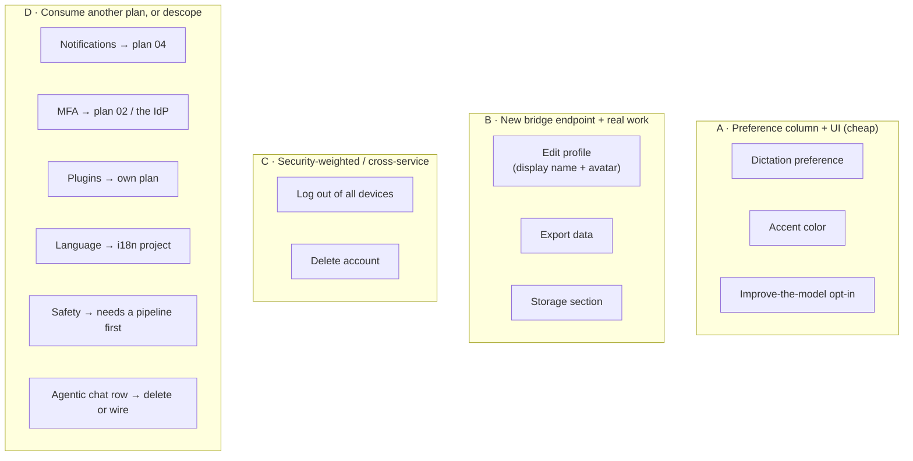
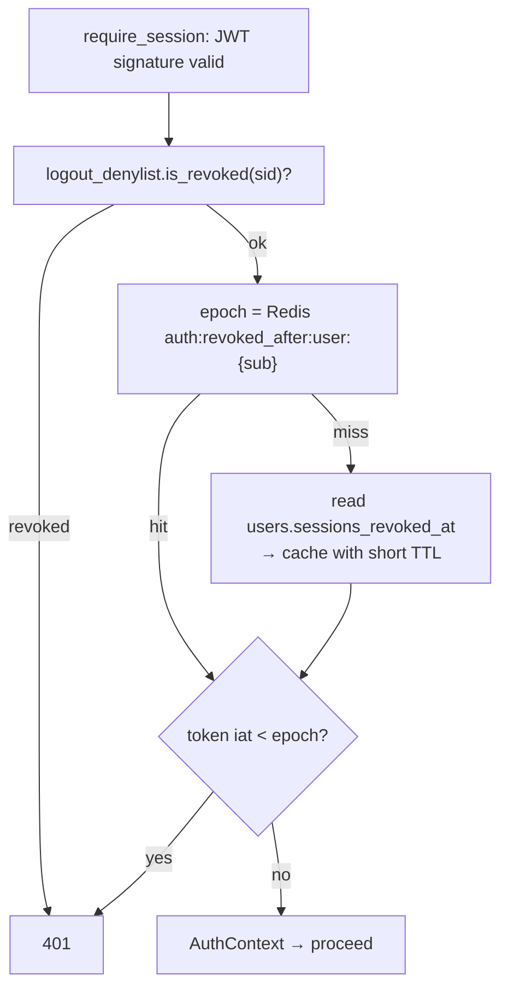
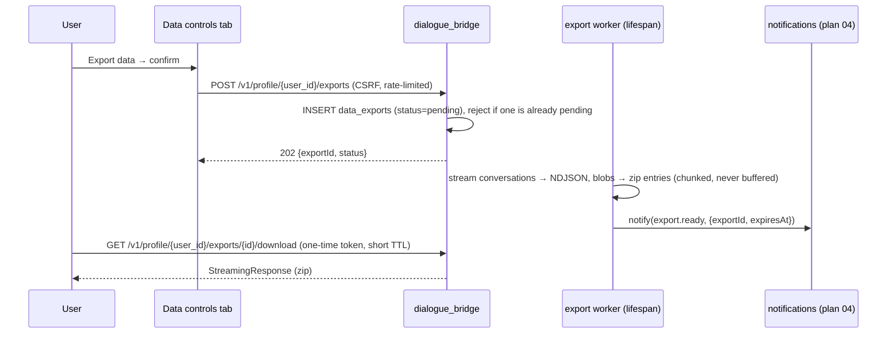
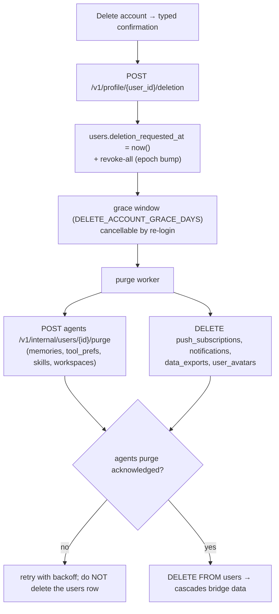

# Profile panel completion

> **Status:** Not started
> **TODO source:** Agentic UI → "Profile panel — implement the 'coming soon / not implemented' placeholders left by the ChatGPT-taxonomy refactor: **Stub sections** (full ComingSoon pages): Notifications (lands with the Notification system + PWA item above), Plugins (OAuth app connectors — distinct from MCP Servers), Storage (attachment/artifact quotas + cleanup), Safety (content-safety / moderation preferences). **Stub rows** inside real tabs: General → Accent color, UI language, dictation on/off preference; Data controls → improve-the-model opt-in, Export data, Delete account; Security → Multi-factor authentication, Log out of all devices (needs a revoke-all path in the stateless-JWT auth). **Edit profile dialog** is read-only (fields come from the IdP) — avatar upload + display-name editing need a bridge profile-update endpoint."
> **Depends on:** [04 · Notifications + PWA](04-notifications-and-pwa.md) (the Notifications section), [02 · Org + user permissions](02-org-and-user-permissions.md) (Security → MFA, and the tenancy rules behind account deletion)
> **Soft depends on:** [05 · Artifacts / Canvas](05-artifacts-canvas.md) (the Storage section's artifact half)
> **Services touched:** dialogue_bridge · agentic_ui · agents (delete-account purge, storage accounting)

The ChatGPT-taxonomy refactor gave the settings panel a *complete structure* and an *incomplete implementation*. Every section a user would expect exists in the nav, so the shape reads as finished — but four sections render a centred "Not implemented yet" page, nine individual rows render a greyed-out "Soon" pill, and the Edit-profile dialog shows five read-only fields, a decorative camera badge, and a permanently disabled Save button. That was the right call at the time: a complete taxonomy with honest placeholders beats a truncated nav. It is now the single largest concentration of visible unfinished work in the product.

This plan is deliberately **not** one feature. It is a triage of thirteen distinct items that happen to share a container, and its main job is to say clearly which of them are a preference column and an afternoon, which are a real backend subsystem, and which should be cut rather than built. Two of the thirteen are genuinely hard and carry security weight — "log out of all devices", which needs a revocation path the stateless-JWT design does not currently have, and "Delete account", which must reach across a service boundary into per-(user, agent) agent state that no database cascade covers. Two more (Plugins, UI language) are large enough that shipping them here would be scope creep, and the plan says so out loud instead of pretending otherwise.

---

## 1. Goal & non-goals

**Goals.**

- Delete every `ComingSoon` full-page stub and every `ComingSoonRow` from the settings panel, either by implementing the item or by removing the row with a recorded reason.
- Make the Edit-profile dialog actually edit: display name and avatar, persisted through a new bridge profile endpoint, without a later IdP login silently reverting the change.
- Give the stateless-JWT auth a **revoke-all-sessions** path that is correct, bounded, and does not reintroduce a per-request database lookup.
- Ship the destructive paths — **Export data** and **Delete account** — with the confirmation, streaming, and cross-service completeness they need to be trustworthy rather than merely present.
- Add the preference columns the panel implies, once, in one migration, wired through all four frontend layers that must agree.
- Render the **Notifications** section over [04](04-notifications-and-pwa.md)'s preference contract.

**Non-goals.**

- Building the OAuth-connector framework behind **Plugins**. It is a subsystem (token storage in Vault, per-provider consent, refresh scheduling) that overlaps heavily with [09](09-email-integration.md)'s mailbox OAuth. This plan scopes and defers it; see §12.
- A full i18n layer for the **Language** row. Translating the product is a project, not a settings row.
- Building a content-moderation pipeline. The **Safety** section is a preference surface over a pipeline that does not exist; either a minimal pipeline lands first or the section is removed.
- Enforcing storage quotas. The **Storage** section ships as accurate accounting plus cleanup actions; hard per-user ceilings are a policy decision that belongs with [02](02-org-and-user-permissions.md) and [05](05-artifacts-canvas.md).
- Re-designing the panel's chrome. `InfoCard` / `SoftPanel` / `PrefToggleRow` are the established primitives; new rows compose them.
- Touching the read-only-by-design **MCP Servers** tab, which is not a stub.

---

## 2. Current state

### The panel's structure

[`ProfilePanel.tsx`](../../src/agentic_ui/src/features/settings/components/ProfilePanel.tsx) (478 lines) is a controlled modal with no URL routing: it takes `activeTab` / `setActiveTab` props (L138–140), remaps three pre-refactor ids through `LEGACY_TAB_MAP` (L34–38: `profile→account`, `appearance→personalization`, `archived→data-controls`), then validates the result against the nav registry and falls back to `general` (L275–276). `SECTION_META` (L43–104) supplies a title + one-line description for fifteen section ids. Tab bodies are a flat chain of `normalizedActiveTab === "<id>" ? <XTab/> : null` guards inside one `AnimatePresence mode="wait"` (L339–464). Panel state is owned by [`ChatPage.tsx`](../../src/agentic_ui/src/pages/ChatPage.tsx) (`openProfilePanel(tab)` L509–516, render L1616–1620) and the active tab id is persisted in the IndexedDB UI snapshot — which is why `LEGACY_TAB_MAP` exists at all.

The nav lives in [`ProfileSidebar.tsx`](../../src/agentic_ui/src/features/settings/components/profile_parts/ProfileSidebar.tsx): `SETTINGS_NAV_ITEMS` (L40–52, eleven mirrored sections) + `WORKSPACE_NAV_ITEMS` (L54–59, four sections that are ours: Agents, Skills, MCP Servers, Memory), concatenated into `NAV_ITEMS` (L61). Every nav slot exists whether or not its section is built.

### Stub inventory — exactly as it exists in code

**Four full-page stubs.** `STUB_SECTIONS` ([`ProfilePanel.tsx`](../../src/agentic_ui/src/features/settings/components/ProfilePanel.tsx) L106–134) has exactly four keys; `stub = STUB_SECTIONS[normalizedActiveTab]` (L289) and the render at L455–462 passes them to `ComingSoon`. There is **no `NotificationsTab.tsx`, `PluginsTab.tsx`, `StorageTab.tsx`, or `SafetyTab.tsx` file** — the sections are entirely the stub entry.

| Key | Line | Icon | Description in code | `notes` |
| --- | --- | --- | --- | --- |
| `notifications` | L111–117 | `Bell` | "Web push, email, and an in-app inbox for run completions, scheduled-task results, and approval requests." | "Scheduled-task results currently surface inside the app while it is open." |
| `plugins` | L118–123 | `Puzzle` | "Connect third-party plugins and OAuth-based app connectors to your workspace." | "MCP-powered tools are already available under Workspace → MCP Servers." |
| `storage` | L124–128 | `HardDrive` | "Quotas and cleanup for attachments, generated artifacts, and agent files." | — |
| `safety` | L129–133 | `Shield` | "Content safety controls and moderation preferences for agent responses." | — |

[`ComingSoon.tsx`](../../src/agentic_ui/src/features/settings/components/profile_parts/ComingSoon.tsx) holds both variants: the default export (L15–74) is the centred page with an `Hourglass` badge reading **"Not implemented yet"** (L57); `ComingSoonRow` (L77–95) is the row variant with a trailing **"Soon"** pill (L91) and `opacity-75` (L85).

**Nine stub rows**, all `ComingSoonRow`, all inside an `InfoCard` whose eyebrow is `"Planned"` and whose description is "Mirrored from the target settings layout — these land here once implemented":

| Tab | File:line | Title (verbatim) | Description (verbatim) |
| --- | --- | --- | --- |
| General | [`GeneralTab.tsx`](../../src/agentic_ui/src/features/settings/components/profile_parts/GeneralTab.tsx) L153 | Accent color | "Pick the accent color used across buttons and highlights." |
| General | `GeneralTab.tsx` L157 | **Language** | "Override the interface language instead of auto-detecting it." |
| General | `GeneralTab.tsx` L161 | Dictation preference | "Enable or disable the microphone dictation button in the composer." |
| Security | [`SecurityTab.tsx`](../../src/agentic_ui/src/features/settings/components/profile_parts/SecurityTab.tsx) L66 | Multi-factor authentication | "Require a second factor when signing in with username and password." |
| Security | `SecurityTab.tsx` L70 | Log out of all devices | "Revoke every active session for this account across all browsers and devices." |
| Data controls | [`DataControlsTab.tsx`](../../src/agentic_ui/src/features/settings/components/profile_parts/DataControlsTab.tsx) L365 | Improve the model for everyone | "Choose whether your conversations may be used to improve future models." |
| Data controls | `DataControlsTab.tsx` L369 | Export data | "Download a copy of your conversations and account data." |
| Data controls | `DataControlsTab.tsx` L373 | Delete account | "Permanently remove this account and all of its data." |

> The TODO says "UI language"; the row's actual label in code is **"Language"**. The plan uses the code's label.

**Three stubs that are not `ComingSoonRow`** and would be missed by a grep:

- [`GeneralTab.tsx`](../../src/agentic_ui/src/features/settings/components/profile_parts/GeneralTab.tsx) L131–143 — an **"Agentic chat"** row that is display-only: it renders `fmtBoolean(prefersAgentic)` in a pill (L140) with no toggle. `prefersAgenticChat` is documented as a no-op ([user-preferences.md](../flows/user-preferences.md) § Sharp Edges: "The field is stored and returned but currently has no effect").
- [`EditProfileDialog.tsx`](../../src/agentic_ui/src/features/settings/components/EditProfileDialog.tsx) — see below.
- [`HelpTab.tsx`](../../src/agentic_ui/src/features/settings/components/profile_parts/HelpTab.tsx) — its "Support" card has no `href`, so it renders as a non-interactive div. Out of this plan's scope (`HelpTab` is rendered by `HelpPanel`, not `ProfilePanel`) but recorded so it is not lost.

### What is already real

Worth stating precisely, so the plan does not "implement" something that exists. **General**: the two-card theme picker (L56–109) via `next-themes` — note its own copy says the theme "persists on this device" (L59), i.e. localStorage, *not* a server preference — plus real `PrefToggleRow`s for "Follow-up suggestions" (L118) and "Per-message token usage" (L125). **Personalization** (237 lines): custom-instructions dialog trigger, personality picker, `useMemory` and `searchPastConvs` toggles, and a deep link into the Memory section — no stubs. **Voice**: voice picker with audio preview and the language row — no stubs. **Security**: a static session-lifetime explainer (L31, copy at L33–35) and a real per-device "Log out" button (L47–54). **Data controls**: real archived-conversations and shared-conversations lists with unarchive/copy/revoke. **Account** ([`AccountTab.tsx`](../../src/agentic_ui/src/features/settings/components/profile_parts/AccountTab.tsx), 158 lines): entirely read-only by design — a hero card plus three `InfoRowsCard`s (identity L27–32, workspace L34–43, activity L45–50) — with no editing affordance at all. **Agents**, **Skills**, **Memory**, **Usage**, **MCP Servers**: all real; MCP Servers is read-only by deliberate design (its doc comment says enable/disable moved to the per-agent Agents tab), not a stub.

### Edit profile is a display, not a form

[`EditProfileDialog.tsx`](../../src/agentic_ui/src/features/settings/components/EditProfileDialog.tsx) (113 lines) is opened from the sidebar profile menu, rendered at [`ChatPage.tsx`](../../src/agentic_ui/src/pages/ChatPage.tsx) L1669 — it is **not** part of ProfilePanel's tab tree. Its doc comment (L9–15) states the position verbatim: "Identity fields come from the identity provider (Vault / Entra) and are not editable in-app yet, so the inputs render read-only with a 'coming soon' save affordance rather than a fake mutable form."

Concretely: props are `{open, onClose, user: UserProfile | null}` (L16–20) with no fetch and no form state; the five fields — Display name (L80, computed `displayName ?? fullName ?? username` at L35–40), Username (L81), Email (L82), Department (L84), Role (L85) — all render through a `Field` helper (L25–30) that emits a `<p>`, **not an `<input>`**; the avatar's camera badge (L70–75) is a `<span>` with `title="Avatar upload coming soon"`, so there is no upload path at all; the Save button is `disabled` (L103) with `cursor-not-allowed` (L105); and the helper text (L89–91) reads "Profile details come from your sign-in identity. In-app editing is coming soon."

### The backend side of the same gap

**There is no profile-mutation endpoint.** [`router/auth.py`](../../src/dialogue_bridge/router/auth.py) exposes `POST /login` (L42), `GET /session` (L137), `POST /session/refresh` (L151), `POST /logout` (L197), `GET /config` (L213), `GET /oidc/login` (L233), `GET /oidc/callback` (L253) — and nothing that writes a user row. `UserProfile` is defined at [`schemas/__init__.py`](../../src/dialogue_bridge/schemas/__init__.py) L35.

**And a login would clobber a local edit.** `upsert_user_from_identity` ([`core/database/models.py`](../../src/dialogue_bridge/core/database/models.py) L505) is careful about `username` and `email` — it sets them only when missing, precisely to avoid clobbering the other provider's value — but it then unconditionally overwrites the mutable profile fields whenever the provider supplied them:

```python
# models.py L573–577
# Refresh mutable profile fields when the provider supplied them (email is
# handled above — never overwritten here, to avoid a unique-constraint clash).
for field in ("display_name", "avatar_url", "full_name", "department", "role_title"):
    if metadata.get(field) is not None:
        setattr(user, field, metadata[field])
```

So a user-edited `display_name` would silently revert at their next Vault/Entra login. Any profile-edit design must handle this explicitly — it is the single most likely "it worked, then it didn't" bug in this plan.

### The auth facts behind "log out of all devices"

Sessions are stateless RS256 JWTs signed by Vault Transit, with **no session row and no per-request database or Vault call** ([authentication-and-session.md](../flows/authentication-and-session.md) Phase 4). The only shared state is a Redis denylist keyed **per login session**: `_LOGOUT_KEY_PREFIX = "auth:logout:sid:"` ([`core/auth/session.py`](../../src/dialogue_bridge/core/auth/session.py) L27), `LogoutDenylist` at L30 with `revoke(sid, ttl)` L54 and `is_revoked(sid)` L66, checked in the auth dependency at L307. `revoke_current_session` (L372) reads the *caller's own* token, extracts its `sid`, and denylists it for `refresh_absolute_ttl_seconds` (L392). A sibling `RefreshTokenGuard` (L87) tracks the current refresh `jti` per `sid` for reuse detection.

Both structures **fail open** on a Redis error — deliberately, and documented as availability-first. And critically: **the set of a user's active `sid`s is not tracked anywhere.** There is no table, no Redis set, no index. "Revoke every session for this user" therefore cannot be expressed as "denylist each sid"; it needs a different primitive. That is the design question in §3.

### Frontend preference plumbing — the four-place rule

Every new preference must be added in four places or it is silently dropped:

1. `defaultPreferences` — [`features/settings/handlers/preferences.ts`](../../src/agentic_ui/src/features/settings/handlers/preferences.ts) L54–68.
2. `snapshotPrefs` — L81–92. The comment above it (L78–80) is the whole contract: *"The PUT endpoint is a FULL replacement: every save must carry every field. All handlers build their payload through this snapshot + overrides, so a newly added preference can never be silently wiped by an unrelated toggle."*
3. `mapUserPreferences` — [`shared/lib/api.ts`](../../src/agentic_ui/src/shared/lib/api.ts) L457–484, which **drops unknown keys** on both read and write.
4. The `UserPreferences` type — [`shared/lib/types.ts`](../../src/agentic_ui/src/shared/lib/types.ts) L196–206 (all nine current fields optional).

`persistPrefs` (L97–122) is the shared optimistic flow: snapshot previous → apply optimistically (L103) → `PUT` → adopt the canonical response (L108) → `persistUIState()` (L109); on failure roll back (L112) and destructive-toast, returning a boolean callers can gate UI on (the custom-instructions dialog closes only on success, L161). There is **no Zod schema for preferences** — validation is the hand-rolled per-field coercion in `mapUserPreferences`; the IndexedDB snapshot stores them as an unvalidated `looseObject` ([`uiStateStorage.ts`](../../src/agentic_ui/src/shared/lib/uiStateStorage.ts) L97).

On the backend, `user_preferences` ([`core/database/models.py`](../../src/dialogue_bridge/core/database/models.py) L108–137) has eleven columns and no `created_at`; migration head is `0016_retire_enabled_tools`, which dropped the old global `tools` JSON blob (L43). The `PUT` is a full replacement with CSRF required ([user-preferences.md](../flows/user-preferences.md) Phase 2).

### Storage and deletion facts

Attachment bytes live in Postgres: `attachments` → `blobs.data` (`LargeBinary`), and `blobs` is bound to exactly one attachment via `single_parent=True` ([database-schema.md § blobs](../architecture/database-schema.md)). There is no object store. `users` cascades to `user_preferences` and `conversations`, and `conversations` cascades to `messages` → `attachments` → `blobs` — so a `DELETE FROM users` does clear the bridge's data. What it does **not** clear is everything the agents service owns per user: the per-(user, agent) memory mount (`AGENTS.md` + `entries/*.yml`), `tool_prefs.json`, the user's skill pool, and the per-(user, agent, conversation) workspace `input`/`output` caches. None of that is in Postgres and none of it is reachable by a cascade.

---

## 3. Target design

### Triage first

The value of this plan is the honest classification. Thirteen items, four buckets:



| Item | Frontend | Bridge | Migration | Other service | Verdict |
| --- | --- | --- | --- | --- | --- |
| Dictation preference | yes | schema only | column | — | **Build** (Phase 1) |
| Accent color | yes (theme tokens) | schema only | column | — | **Build** (Phase 1) |
| Notifications section | yes | — (04 owns it) | — (04 owns it) | — | **Build on 04** (Phase 2) |
| Edit profile | yes | **new router** | `profile_locked` flags + avatar storage | — | **Build** (Phase 3) |
| Log out of all devices | yes | **auth change** | `sessions_revoked_at` | — | **Build** (Phase 4) |
| Improve-the-model opt-in | yes | gate consumer | column | — | **Build, needs a product decision** (Phase 5) |
| Export data | yes | **new job + stream** | export-job table | — | **Build** (Phase 5) |
| Delete account | yes | **purge orchestration** | — | **agents purge endpoint** | **Build last** (Phase 6) |
| Storage section | yes | **accounting queries** | — | agents usage endpoint | **Build** (Phase 7) |
| MFA | row copy only | — | — | Vault TOTP / Entra | **Descope to 02** (Phase 8) |
| Plugins | — | — | — | — | **Descope to its own plan** (Phase 8) |
| Language | large | — | column | — | **Descope** (Phase 8) |
| Safety | — | — | — | — | **Descope or minimal** (Phase 8) |
| "Agentic chat" row | delete | — | — | — | **Delete the row** (Phase 1) |

### Log out of all devices — the design that matters

The requirement is "invalidate every token issued to this user before now", against a design whose whole point is that verification touches no shared state. Three candidate mechanisms:

| Option | How | Why not / why |
| --- | --- | --- |
| Track every `sid` per user | Redis set `auth:sids:user:{id}`, denylist each on revoke-all | Unbounded per-user growth, needs TTL bookkeeping per member, and a lost set silently means "revoked nothing". Rejected. |
| Bump a token-version claim | Add `ver` to the JWT, compare against `users.token_version` | Correct, but requires a DB read per request — it destroys the "no database lookup on the auth path" property that makes the bridge horizontally scalable. Rejected as designed; acceptable only with the same cache the next option uses, at which point the next option is simpler. |
| **Revocation epoch** | `users.sessions_revoked_at` (Postgres, source of truth) + `auth:revoked_after:user:{id}` (Redis, hot path); a token is invalid when its `iat` (access) or `lat` (refresh) predates the epoch | **Chosen.** O(1) hot-path check next to the existing `sid` denylist, one row per user, durable, and it reuses claims that already exist. |



Three properties make this defensible rather than merely functional. **The hot path stays Redis-only** — a cache hit costs one `GET` alongside the `EXISTS` already being paid; only a cold cache reads Postgres, and the cache is negative-cached too (the overwhelmingly common "never revoked" case is a cached sentinel, not a repeated query). **The epoch is durable** — unlike the `sid` denylist, which lives only in Redis and vanishes on a flush, a revoke-all survives a Redis wipe because Postgres holds it; the cache repopulates. **The failure mode is chosen deliberately, not inherited.** The existing denylist fails open. A revoke-all that also failed open would mean "I revoked my stolen sessions" quietly doing nothing during a Redis outage — which is precisely the moment it matters most. So the epoch check fails **closed on a Redis error only when Postgres is also unreachable**; a Redis error falls through to the Postgres read (slower, still correct), and only a double outage rejects. That is a deliberate divergence from the surrounding fail-open stance, and §9 records why.

Two side effects are mandatory, not optional. The revoke-all response must **rotate the caller's own session** (or the user is logged out of the tab they clicked from, which is defensible but should be a deliberate choice surfaced in the confirmation copy — the design here signs the caller out too, matching every other product's behaviour and the row's own copy "every active session"). And it must **delete that user's push subscriptions** from [04](04-notifications-and-pwa.md)'s `push_subscriptions` table, because a revoked device that keeps receiving notifications is a leak; per-device logout prunes only the row matching that `sid`, which is why 04's table carries `session_id`.

### Edit profile — local overrides that survive login

The clobber at [`models.py`](../../src/dialogue_bridge/core/database/models.py) L575 is the whole problem. Options were a parallel column pair (`display_name` vs `display_name_local`) or a per-field lock. The lock is chosen: add `profile_overrides` (JSON, `{}`) to `users` recording which fields the user has set locally, and change the refresh loop to skip any field present in it.

```python
# models.py L575, after
overridden = set((user.profile_overrides or {}).keys())
for field in ("display_name", "avatar_url", "full_name", "department", "role_title"):
    if field in overridden:
        continue  # the user owns this field now; the IdP no longer refreshes it
    if metadata.get(field) is not None:
        setattr(user, field, metadata[field])
```

This keeps one canonical value per field (so every existing reader — `AccountTab`, the panel header, `UserProfile` — needs no change), makes the override explicit and auditable, and gives the UI a natural "reset to my organisation's value" affordance (delete the key, next login re-syncs).

**Avatar storage.** `blobs` cannot be reused: `single_parent=True` binds a blob to exactly one attachment, and an avatar is not an attachment. A new `user_avatars` table (`user_id` PK/FK CASCADE, `data` LargeBinary, `mime_type`, `byte_size`, `etag`, `updated_at`) is the smallest correct addition, served by `GET /v1/profile/{user_id}/avatar` as a `StreamingResponse` with a strong `ETag` and a short `max-age`, and `users.avatar_url` set to that route so every existing renderer keeps working unchanged. Upload validates MIME against an image allow-list **and** magic bytes, caps size well below the attachment ceiling, re-encodes server-side to a fixed square PNG/WebP (which strips EXIF, including GPS, and neutralises polyglot/SVG-script payloads), and is rate-limited as a storage-growth path.

### Export data and delete account — the two paths that must not be casual

Both are asynchronous, both are confirmation-gated, both notify through [04](04-notifications-and-pwa.md).



The export must never buffer: blobs are `LargeBinary` in Postgres, and a user with a few hundred megabytes of attachments would otherwise OOM the bridge. It streams row-by-row into a zip generator, one pending export per user, with the artefact expiring on a timer and a reaper deleting it.

Deletion is the more dangerous one because completeness spans services:



The ordering is the load-bearing part: **the `users` row is deleted last**, because it is the only handle by which the agents-side data can be found. Deleting it first would strand every per-(user, agent) directory permanently. The grace window exists so an accidental or coerced deletion is recoverable, and it doubles as the window in which the revoke-all has already locked the account.

### Storage section

Accounting is two sums plus one remote call: bridge-side bytes from `SUM(attachments.size_bytes)` grouped by `origin` (`upload` vs `generated`, the column added in `0013`) scoped to the user's conversations, and agents-side bytes from a new internal endpoint reporting the user's workspace/memory/skill footprint. Cleanup actions are the honest ones the platform can actually perform: purge generated artifacts older than N days, purge the `input`/`output` workspace caches (which already have TTL retention on the agents side), and delete attachments from archived conversations. Quotas are displayed as usage against a soft advisory ceiling; enforcement is out of scope (§1).

---

## 4. Data model & migrations

One additive revision per phase group, each on the then-current head. Assuming [04](04-notifications-and-pwa.md)'s `0017_notifications` lands first:

**`0018_profile_panel_prefs`** — the preference columns, added together so one migration covers Phases 1–5:

| Table | Column | Type | Default | Purpose |
| --- | --- | --- | --- | --- |
| `user_preferences` | `dictation_enabled` | `Boolean` | `true` | Show/hide the composer mic button |
| `user_preferences` | `accent_color` | `String` | `'default'` | Accent token id, fail-closed against a server-side registry (same stance as `personality`) |
| `user_preferences` | `data_sharing_opt_in` | `Boolean` | `false` | **Off by default** — the "improve the model" toggle; fail-closed means absent = not shared |
| `users` | `profile_overrides` | `JSON` | `{}` | Which profile fields the user owns locally (§3) |
| `users` | `sessions_revoked_at` | `DateTime` | `NULL` | Revocation epoch for revoke-all |
| `users` | `deletion_requested_at` | `DateTime` | `NULL` | Grace-window marker; INDEXED (partial, `IS NOT NULL`) for the purge worker |

**`0019_profile_assets`** — the two new tables:

- **`user_avatars`** — `user_id` (String, **PK**, FK → `users.id` CASCADE), `data` (`LargeBinary`, not null), `mime_type` (String), `byte_size` (Integer), `etag` (String), `created_at`, `updated_at`. PK-on-FK enforces one avatar per user without a separate unique constraint.
- **`data_exports`** — `id`, `user_id` (FK CASCADE, INDEXED), `status` (`pending`|`running`|`ready`|`failed`|`expired`), `blob` (`LargeBinary`, nullable — populated on completion), `byte_size`, `error_code`, `expires_at` (INDEXED for the reaper), `created_at`, `updated_at`. A **partial unique index** on `(user_id)` `WHERE status IN ('pending','running')` enforces one in-flight export per user at the database level rather than in application code; autogenerate ignores `postgresql_where`, so it is hand-written.

**Migration cautions.** Every column here is additive with a server default — no backfill needed, no destructive operation, so no user-confirmation gate. The partial indexes and the `profile_overrides`-aware change to `upsert_user_from_identity` are code changes that must land in the *same commit* as `0018`, or a login between deploy steps will clobber an override the schema now claims to protect. Nothing in this plan drops a column; if the descope decisions in Phase 8 remove the Language row, no `ui_language` column is ever created in the first place (which is why it is absent from `0018`).

---

## 5. API surface

A new router `router/profile.py` (bare `APIRouter()`, registered in [`main.py`](../../src/dialogue_bridge/main.py) with `prefix="/v1/profile"`, `tags=["Profile"]`) owns everything that mutates the user's own account. Deliberately **not** added to `router/auth.py`: that router is the token/session surface, and mixing account mutation into it muddies a security-critical file.

| Method | Path | Body | Returns | Auth + limits |
| --- | --- | --- | --- | --- |
| `PATCH` | `/{user_id}` | `ProfileUpdateIn {displayName?}` | `UserProfile` | session + bound user + CSRF |
| `POST` | `/{user_id}/avatar` | `multipart/form-data` (image) | `UserProfile` | + CSRF; `avatar_upload_rate_limit` |
| `DELETE` | `/{user_id}/avatar` | — | `UserProfile` | + CSRF |
| `GET` | `/{user_id}/avatar` | — | image stream (`ETag`, short `max-age`) | session + bound user |
| `DELETE` | `/{user_id}/profile-overrides/{field}` | — | `UserProfile` | + CSRF — "reset to my organisation's value" |
| `POST` | `/{user_id}/exports` | — | `202 DataExportOut` | + CSRF; `export_create_rate_limit` |
| `GET` | `/{user_id}/exports` | — | `DataExportOut[]` | session + bound user |
| `GET` | `/{user_id}/exports/{id}/download` | `?token=` | zip stream | one-time short-TTL token (see below) |
| `POST` | `/{user_id}/deletion` | `AccountDeletionIn {confirmation}` | `202 {scheduledFor}` | + CSRF; **step-up re-auth** |
| `DELETE` | `/{user_id}/deletion` | — | `204` (cancel within grace) | + CSRF |
| `GET` | `/{user_id}/storage` | — | `StorageSummaryOut` | session + bound user |
| `POST` | `/{user_id}/storage/cleanup` | `StorageCleanupIn {scope}` | `{reclaimedBytes}` | + CSRF |

One route joins the auth router, because it is a session operation:

| Method | Path | Body | Returns | Notes |
| --- | --- | --- | --- | --- |
| `POST` | `/v1/auth/logout-all` | — | `204` + cleared cookies | Bumps `users.sessions_revoked_at`, warms the Redis epoch key, deletes the user's push subscriptions, clears the caller's cookies. CSRF-protected. Rate-limited per user (it is cheap but it is also a self-inflicted DoS if scripted). |

**Download-token design.** The export artefact cannot be a plain authenticated `GET` if the notification email is to contain a working link, and it must not be a guessable URL. It uses the same primitive already in the codebase for DOCX previews: a short-lived HMAC token keyed by `SESSION_TOKEN_SECRET` (which, post-JWT-migration, is exactly the "general-purpose HMAC key" role `CLAUDE.md` describes for it), bound to `(export_id, user_id, exp)`, single-use, and still requiring a valid session — the token narrows scope, it does not replace authentication.

**Step-up re-auth on deletion.** `POST /deletion` requires the user to re-enter their password (Vault path) or complete a fresh OIDC round-trip (Entra path) within a short window before the request is accepted. A stolen access token must not be able to delete an account. This is the one place in the product where a valid session is deliberately insufficient.

**Schemas** in [`schemas/__init__.py`](../../src/dialogue_bridge/schemas/__init__.py): `ProfileUpdateIn` (display name: length-capped, control characters stripped, no leading/trailing whitespace, non-empty), `DataExportOut`, `AccountDeletionIn` (`confirmation` must equal the account's username — a typed confirmation, not a checkbox), `StorageSummaryOut`, `StorageCleanupIn` (scope as a `Literal`, never a free-form path). The extended `UserPreferences` gains `dictationEnabled`, `accentColor` (validated fail-closed against the accent registry), `dataSharingOptIn`.

**Agents-service addition.** `POST /v1/internal/users/{user_id}/purge` on the agents side, behind `require_internal_caller` — the trust-gated internal namespace that nginx already 404s at the edge. It must be **idempotent** (a retried purge on an already-clean user returns success) because the deletion worker retries until it is acknowledged.

---

## 6. Frontend surface

No new feature folder — this is `features/settings/` growing into the space it already reserved. New files, all under [`components/profile_parts/`](../../src/agentic_ui/src/features/settings/components/profile_parts):

```text
features/settings/
  components/
    EditProfileDialog.tsx          ← rewritten: read-only display → real form
    profile_parts/
      NotificationsTab.tsx         ← new (Phase 2, over plan 04's prefs)
      StorageTab.tsx               ← new (Phase 7)
      profile_dialog_parts/
        AvatarUploadField.tsx      ← new: drag/drop + crop-to-square + preview
      data_controls_parts/
        ExportDataCard.tsx         ← new: request, poll status, download
        DeleteAccountCard.tsx      ← new: typed confirmation + step-up + grace notice
      security_parts/
        LogoutAllDevicesCard.tsx   ← new: confirmation + consequence copy
  handlers/
    profile.ts                     ← new: display name, avatar, override reset, delete/export
    preferences.ts                 ← extended: 3 new prefs through snapshotPrefs
  hooks/
    useDataExport.ts               ← new: request + poll + download
    useStorageSummary.ts           ← new (mirrors useUsageSummary's lazy+TTL pattern)
```

**Rules this must respect.** `*_parts/` folders hold **only components** — hooks go to `hooks/`, handlers to `handlers/`, constants to `shared/lib/consts.ts`, types to `shared/lib/types.ts`. New rows compose the existing `InfoCard` / `SoftPanel` / `PrefToggleRow` primitives from [`shared.tsx`](../../src/agentic_ui/src/features/settings/components/profile_parts/shared.tsx) (L9–41, L43–53, L150–174) — the panel's chrome is established and is not to be redesigned. Destructive actions get a confirmation step and a `destructive`-token treatment, matching the existing per-device Log-out button. Every icon-only control gets an `aria-label`; every new input gets a visible `<label>`.

**Accent color** is the one item with a real design constraint: no raw hex in components. The implementation adds a small set of accent tokens to `tailwind.config` as CSS-variable references, and the selected accent writes the variable set on `:root`. Because it is a *server* preference while the theme is a *device* preference, the two must be visually reconciled in the same card — with copy that says which is which, or the inconsistency reads as a bug.

**Contracts.** New endpoints get **Zod schemas** in [`shared/lib/schemas.ts`](../../src/agentic_ui/src/shared/lib/schemas.ts) consumed through `http.ts`'s `schema:` option (the newer, stricter pattern), even though preferences themselves stay on the hand-rolled `mapUserPreferences` path — this plan does not migrate preferences to Zod, but it does not extend the un-validated pattern to new surfaces either.

**Snapshot policy.** Export status, storage summary, and avatar bytes are **not** persisted into the IndexedDB `UISnapshotSerializable` — fetched fresh, exactly as scheduled tasks and the usage summary are — so no snapshot `version` bump is needed. The three new preferences *do* ride the snapshot (they live inside `userPreferences`), but the snapshot stores that field as an unvalidated `looseObject` ([`uiStateStorage.ts`](../../src/agentic_ui/src/shared/lib/uiStateStorage.ts) L97), so adding fields to it is shape-compatible and still needs no bump. If any phase adds a *new top-level* snapshot key, the bump becomes mandatory.

**Stub deletions**, tracked as acceptance criteria rather than prose: `STUB_SECTIONS.notifications` (L111–117) in Phase 2; `GeneralTab` L153/L157/L161 in Phases 1 and 8; `SecurityTab` L66/L70 in Phases 4 and 8; `DataControlsTab` L365/L369/L373 in Phase 5 and 6; `STUB_SECTIONS.storage` in Phase 7; `STUB_SECTIONS.plugins` and `.safety` in Phase 8. When a section's stub entry is removed, its `SECTION_META` row stays (it is the real header) and its `NAV_ITEMS` entry stays; when an item is *descoped*, the `ComingSoonRow` is **deleted** and the reason recorded in this plan — a permanently-"Soon" row is worse than no row. If all four `STUB_SECTIONS` keys eventually disappear, `ComingSoon`'s page variant and the `stub` branch at L289/L455–462 are dead code and go too.

---

## 7. Cross-cutting impact

This plan is the mirror image of [04](04-notifications-and-pwa.md): where 04 is a subsystem many plans consume, **14 is the surface where many plans' settings appear.** That makes it a coordination point, and it means several items here are better *received* than *built*.

| Plan | Relationship | What must be agreed |
| --- | --- | --- |
| [04 · Notifications + PWA](04-notifications-and-pwa.md) | **Hard dependency, both directions.** 04 Phase 1 ships the Notifications section itself (it needs a settings surface for its own preferences); this plan's Phase 2 owns whatever remains — per-type overrides, the device list, the install CTA. 14 also *produces for* 04: `export.ready` is an 04 event type, and revoke-all must delete 04's `push_subscriptions`. | Who owns `NotificationsTab.tsx`. Proposal: 04 creates it minimally in its Phase 1 (so its feature is usable), 14 Phase 2 completes it. Duplicating it in both plans is the failure mode. |
| [02 · Org + user permissions](02-org-and-user-permissions.md) | **Hard dependency for MFA**, and it changes the meaning of two items. MFA is an IdP capability, not a bridge one: Entra users already get MFA at the IdP (the OIDC flow's "sign in (+MFA)" step), so the honest v1 is *surfacing* that state, while Vault-userpass MFA needs Vault's TOTP engine plus an enrolment flow. Deletion and export also change: in a tenanted world, whether a *user* may delete their own account is an org policy. | Whether self-service deletion survives tenancy, or becomes an admin action. Build the endpoint either way; gate it on the policy when 02 lands. |
| [05 · Artifacts / Canvas](05-artifacts-canvas.md) | **Soft.** The Storage section's "artifacts" half is only meaningful once artifacts are a first-class object. Today the closest thing is `attachments.origin='generated'` (migration `0013`). | Storage accounting should be written against an interface, not a hard-coded table list, so 05's artifact store slots in. |
| [09 · Email integration](09-email-integration.md) | **Overlaps Plugins.** 09 needs per-user OAuth token storage for Gmail/Outlook — which is 80% of what a Plugins connector framework is. Building Plugins here would duplicate it. | Plugins should be *derived from* 09's OAuth-connection model, which is the concrete reason to descope it (§12). |
| [03 · Projects / Workspaces](03-projects-and-workspaces.md) | **Soft.** Workspaces add another storage tier to account for and another thing an account deletion must purge. | The agents purge endpoint should take a user id and clean *everything* under it, not enumerate known directories. |
| [11 · Sandbox runner](11-sandbox-runner.md) | Storage: the workspace `input`/`output` caches it already gave TTL retention are the same bytes the Storage section reports. | Reuse `runtime/filesystem/retention.py`'s accounting rather than re-walking the tree. |
| [17 · Dynamic voice language](17-voice-language-dynamic.md) | Adjacent to the Language row: 17 makes *spoken* language dynamic and per-conversation. The UI language is a different axis, but the two will be confused by users if labelled carelessly. | Copy discipline: "Interface language" vs "Spoken language". |

**Cross-cutting concerns from the [index](README.md#cross-cutting-concerns):**

- **Ownership & scoping.** Every route is `require_bound_user_id` and every query filters `user_id` in the util. Two routes carry more weight than the rest: revoke-all mutates security state, and deletion destroys data — both re-verify ownership and neither accepts an id from anywhere but the validated path parameter.
- **DB migrations.** Two additive revisions (`0018`, `0019`) chained after 04's `0017`. Two hand-written partial indexes. The `upsert_user_from_identity` change ships in the same commit as `0018`.
- **Agent tool surface.** Untouched, except that a purged user's `tool_prefs.json` must go with them.
- **AG-UI event protocol.** Untouched.
- **Filesystem layout.** The agents-side purge is the first operation that deletes across the whole per-user tree; it must go through `FilesystemBackend`, never raw paths.
- **Secrets.** No new secrets. `SESSION_TOKEN_SECRET` gains a second HMAC consumer (export download tokens) alongside the existing DOCX-preview tokens.
- **Trust boundary.** One new internal endpoint on the agents service behind `require_internal_caller`, in the `/v1/internal/*` namespace nginx already blocks at the edge.
- **Docs.** Six existing docs plus one new one (§11).

---

## 8. Phased execution

Phases are ordered by dependency and by blast radius: cheap and reversible first, destructive last, descope decisions explicitly last so they are made with the rest of the panel already finished.

### Phase 0 — Preference foundation

`0018_profile_panel_prefs`, the three new `user_preferences` columns, the `users` columns, the accent registry (server-side, fail-closed), the `profile_overrides` change to `upsert_user_from_identity` (same commit), the extended `UserPreferences` schema, and all four frontend plumbing points (`defaultPreferences`, `snapshotPrefs`, `mapUserPreferences`, the TS type). No UI change.

**Acceptance:** `alembic upgrade head` clean on a populated DB, `alembic check` clean; a login no longer overwrites a field listed in `profile_overrides` (integration test against a real DB); an unknown `accentColor` collapses to `default` at the bridge boundary; toggling an unrelated existing preference does not wipe any new field (the `snapshotPrefs` regression class).

### Phase 1 — General tab: dictation preference + accent color, and delete the dead row

Real `PrefToggleRow` for dictation (composer mic button reads it); accent picker writing CSS-variable tokens defined in `tailwind.config`; delete the "Agentic chat" display-only row (L131–143) — `prefersAgenticChat` is documented as a no-op and a settings row that reports a field with no effect is worse than no row. Delete `GeneralTab` stub rows L153 and L161.

**Acceptance:** dictation off hides the mic button and survives reload and a second device; accent applies without reload and is correct in both light and dark at ≥4.5:1 on body text and ≥3:1 on UI elements; the "Planned" card now holds only the Language row; no raw hex appears in any component diff; `prefers-reduced-motion` respected on the accent transition.

### Phase 2 — Notifications section

Complete `NotificationsTab.tsx` over [04](04-notifications-and-pwa.md)'s contract: per-type channel overrides, quiet-hours editor, the registered-devices list with per-device removal, and the PWA install CTA. Delete `STUB_SECTIONS.notifications` (L111–117).

**Acceptance:** every 04 preference round-trips through the full-replacement `PUT` with rollback on failure; push/email controls render disabled with an explanatory reason when the channel is unconfigured or the account has no email — never silently absent; removing a device revokes exactly that subscription.

### Phase 3 — Edit profile becomes a form

New `router/profile.py` with `PATCH /{user_id}`, avatar upload/serve/delete, and override reset; `user_avatars` in `0019_profile_assets`; `EditProfileDialog` rewritten with real inputs, an `AvatarUploadField` (drag/drop, crop-to-square, preview), validation mirrored on both sides, and per-field "reset to organisation value".

**Acceptance:** a changed display name appears immediately in the panel header, the sidebar, and `AccountTab`; it **survives a logout and a fresh Vault/Entra login** (the clobber regression, tested explicitly); an uploaded avatar renders everywhere `avatarUrl` is used and is stripped of EXIF; a non-image with an image extension is rejected on magic bytes; an oversized upload is rejected before decode; the disabled Save button and the `title="Avatar upload coming soon"` span are gone; the dialog is keyboard-navigable with focus trapped and returned.

### Phase 4 — Log out of all devices

The revocation epoch: `users.sessions_revoked_at`, the Redis `auth:revoked_after:user:{id}` cache with negative caching, the `iat`/`lat` comparison in the auth and refresh dependencies, `POST /v1/auth/logout-all`, deletion of the user's push subscriptions, and `LogoutAllDevicesCard` with confirmation copy that states the caller will also be signed out. Delete `SecurityTab` stub row L70.

**Acceptance:** two browsers signed in as the same user; revoke-all from one signs both out on their next request **and** breaks both refresh tokens (not just the access tokens); a token minted *after* the epoch is unaffected; the hot path adds at most one Redis `GET` for a never-revoked user (measured, not assumed); a Redis outage degrades to a Postgres read rather than failing open; a Redis `FLUSHALL` after a revoke-all does **not** resurrect the sessions; push subscriptions for that user are gone.

### Phase 5 — Data controls: export + data-sharing opt-in

`data_exports` in `0019`, the streaming export worker in the lifespan (sibling of the scheduler and embedding sweeper), the one-time HMAC download token, the expiry reaper, `export.ready` production through 04, and `ExportDataCard`. The `data_sharing_opt_in` toggle ships **with a real consumer**: it gates inclusion in any evaluation/annotation corpus and is referenced from the privacy policy — a toggle that gates nothing is a lie, and shipping it that way is worse than leaving the row stubbed. Delete `DataControlsTab` stub rows L365 and L369.

**Acceptance:** an export of an account with ≥100 MB of attachments completes without the bridge's RSS tracking the payload size (proving streaming); a second concurrent request is rejected by the partial unique index, not by application race-prone code; the download link works from the notification email, is single-use, and 404s after expiry; the export contains the user's conversations, messages, attachments and preferences and **no other user's data** (asserted with a two-user fixture); the opt-in's gate is exercised by a test.

### Phase 6 — Data controls: delete account

`users.deletion_requested_at`, step-up re-auth, typed confirmation, the grace window with cancel-by-re-login, the purge worker, the idempotent agents-side `POST /v1/internal/users/{user_id}/purge`, and the strict ordering that deletes the `users` row last. Delete `DataControlsTab` stub row L373.

**Acceptance:** deletion requires re-authentication — a valid session alone is refused; the confirmation must match the username; the account is immediately locked (revoke-all) but recoverable within the grace window; after purge, no row in any bridge table references the user id (asserted table-by-table) **and** the agents service reports no per-user directory; an agents purge failure retries and leaves the `users` row intact rather than stranding data; a second purge of the same user succeeds.

### Phase 7 — Storage section

`GET /{user_id}/storage` (bridge accounting by `attachments.origin` + an agents-side footprint call), `StorageTab` with a breakdown and cleanup actions, `POST /{user_id}/storage/cleanup` with `Literal` scopes. Delete `STUB_SECTIONS.storage`.

**Acceptance:** reported bytes match a direct SQL sum within rounding; each cleanup scope reclaims what it claims and nothing else (verified by before/after sums); cleanup is confirmation-gated; the accounting query is indexed and does not table-scan `blobs`; a user with zero attachments sees a helpful empty state, not "0 B".

### Phase 8 — Descope decisions, made explicitly

The remaining four items get a decision, not a deferral-by-silence. **MFA** — surface the IdP's state (Entra users: "managed by your organisation"; Vault users: "not available") and delete the stub row; real Vault TOTP enrolment moves to [02](02-org-and-user-permissions.md). **Plugins** — remove the nav entry and the stub, and open a new plan derived from [09](09-email-integration.md)'s OAuth-connection model. **Language** — either commit to an i18n phase (react-i18next, an extraction pass over every string in the panel, a `ui_language` column) or delete the row; the plan's recommendation is to delete it and open a separate plan, because a half-translated product is worse than an English one. **Safety** — delete the section unless a minimal moderation pre-check ships first; a preference over a non-existent pipeline is a placebo control, which is the one thing worse than a "Soon" pill.

**Acceptance:** zero `ComingSoon` or `ComingSoonRow` usages remain in `features/settings/`; if none remain at all, both variants and the `stub` branch at L289 / L455–462 are deleted as dead code; `README.md`'s index and this plan's status reflect what shipped versus what was cut, with the reason recorded here.

---

## 9. Security & privacy

**Threat model.** The panel is where a user's account controls live, so the new surface is: account takeover persistence (a stolen token that survives a "log out everywhere"), account destruction by a stolen token, data exfiltration through the export path, and stored-XSS/SSRF through the avatar.

| Risk | Control |
| --- | --- |
| Stolen token survives revoke-all | The epoch compares `iat`/`lat`, so **every** token minted before the revoke — access and refresh alike — is dead. Checking only the access token would leave the refresh token able to mint a fresh valid pair, which would make the feature cosmetic. |
| Revoke-all silently no-ops during an outage | The epoch's source of truth is **Postgres**, not Redis, so it survives a cache flush; a Redis error falls through to a Postgres read. Only a double outage rejects requests. This deliberately diverges from the fail-open stance of the `sid` denylist, because a security control that quietly disables itself under load is not a control. |
| Account deletion by a stolen session | **Step-up re-authentication** plus a typed username confirmation plus a cancellable grace window. Three independent barriers, because the action is irreversible. |
| Export as an exfiltration channel | One in-flight export per user (DB-enforced), rate-limited creation, single-use short-TTL download token bound to `(export_id, user_id)`, session still required, artefact expires and is reaped. The export contains only rows the user owns — asserted by test with a two-user fixture, because a `WHERE user_id` omission here leaks everything. |
| Stored XSS / polyglot via avatar | MIME allow-list **and** magic-byte sniffing, hard size cap checked before decode, mandatory server-side re-encode to a fixed raster format (which neutralises SVG-with-script and image polyglots and strips EXIF including GPS), and the avatar is served from our own origin with a fixed `Content-Type` and `X-Content-Type-Options: nosniff` (already set globally in nginx). |
| SSRF via avatar-by-URL | Not offered. Avatars are uploaded bytes only; there is no fetch-a-remote-image path. |
| Storage-growth DoS | Avatar and export creation are rate-limited as storage-growth paths, matching the existing policy comment in [`rate_limit.py`](../../src/dialogue_bridge/core/security/rate_limit.py) (L109–113) that anything growing storage unboundedly gets its own per-user window. |
| Cleanup as a destructive footgun | Scopes are a closed `Literal`, never a path or a filter expression; every scope is confirmation-gated; the operation reports what it removed. |
| Privilege confusion in a future org world | Deletion and export are self-service *today* because there is one tenant per user. Both are written so [02](02-org-and-user-permissions.md) can gate them on org policy without reshaping the endpoint. |
| PII in logs | Display names, avatar bytes, export contents, and email addresses are never logged. Log the user id **hashed** with the shared `LOG_REDACTION_SECRET` (so it correlates across services), the action, and a coarse outcome. |
| CSRF | Every mutation depends on `require_csrf_protection`, unchanged. |
| Fail-closed defaults | `data_sharing_opt_in` defaults **false**; an unknown accent id collapses to `default`; a malformed `profile_overrides` is treated as empty (the IdP keeps ownership) rather than as "everything is overridden"; the agents purge is retried rather than assumed successful. |

---

## 10. Testing strategy

- **The clobber regression (Phase 3), first-class.** Set a local display name, run a full login through `upsert_user_from_identity` with provider metadata that supplies a different `display_name`, assert the local value survived. Then delete the override and assert the IdP value is re-adopted. Against a real database — this behaviour is entirely about SQLAlchemy state and a mocked DB proves nothing.
- **Revoke-all completeness (Phase 4).** Two token pairs; revoke; assert both access tokens 401 **and** both refresh tokens fail at `/session/refresh`; assert a post-epoch token still works; assert a `FLUSHALL` does not resurrect anything; measure the added hot-path cost for a never-revoked user.
- **Export isolation (Phase 5).** Two-user fixture with overlapping conversation shapes; assert user A's archive contains zero references to user B. Plus a memory-profile assertion on a large-attachment account to prove streaming.
- **Deletion completeness (Phase 6).** Enumerate every table with a `user_id` (or a transitive path to one) and assert zero rows post-purge — written as a schema-driven test so a *future* table is caught automatically rather than silently missed. Plus an injected agents-purge failure asserting the `users` row is retained.
- **Preference plumbing (all phases).** A single test that, for every field in the `UserPreferences` type, toggles an unrelated field and asserts the first one is unchanged after the round-trip. This is the one test that catches the `snapshotPrefs` / `mapUserPreferences` drift class permanently.
- **Avatar validation.** A table of adversarial uploads: oversized, wrong magic bytes, SVG-with-script, image polyglot, zero-byte, truncated. Each rejected with a specific error, none accepted.
- **Accessibility, per phase.** Tab-order pass on every new dialog and card; `aria-label` on every icon-only control; visible focus rings; contrast measured in both themes for the accent palette; touch targets ≥44×44.
- **Reduced motion.** Every new animated element checked with `useReducedMotion()` honoured, matching the existing `ComingSoon`/`ProfilePanel` pattern.
- **Host-vs-container.** The bridge suite runs against the container's pinned dependencies and the UI type-check against the image's TypeScript — both in-image, not on the host.

---

## 11. Docs to update

| Doc | Change |
| --- | --- |
| [docs/flows/user-preferences.md](../flows/user-preferences.md) | Three new columns and their defaults; the accent-vs-theme distinction (server preference vs device localStorage) called out explicitly, because it is the most confusing thing in the tab; the settings-surface paragraph updated as stubs disappear. |
| `docs/flows/account-and-profile.md` | **New** — the authoritative flow for profile editing, the `profile_overrides` mechanism, avatar storage/serving, data export, and account deletion. Add to the tree and table in [README.md](README.md) and to `CLAUDE.md`'s documentation-update table. |
| [docs/flows/authentication-and-session.md](../flows/authentication-and-session.md) | A new phase for **revoke-all**: the epoch, the `iat`/`lat` comparison, the Postgres-source-of-truth-with-Redis-cache shape, and the deliberate fail-closed divergence. Also correct the File Map's `upsert_user_from_vault()` row — that function no longer exists; the helper is `upsert_user_from_identity` ([`models.py`](../../src/dialogue_bridge/core/database/models.py) L505). |
| [docs/architecture/database-schema.md](../architecture/database-schema.md) | `user_avatars`, `data_exports`, the three new `user_preferences` columns, the three new `users` columns, and the two partial indexes. |
| [docs/architecture/configuration.md](../architecture/configuration.md) | New env vars: export TTL/size caps, avatar size cap, deletion grace days, accent registry, rate-limit windows. |
| [docs/flows/attachments.md](../flows/attachments.md) | A note that avatars are **not** attachments and live in their own table (because `blobs` is `single_parent`), so nobody looks for them there. |
| `docs/flows/notifications.md` *(created by [04](04-notifications-and-pwa.md))* | The `export.ready` producer and the revoke-all push-subscription purge. |
| [docs/development/frontend-architecture.md](../development/frontend-architecture.md) | The new `profile_parts/` subfolders and the components-only rule applied to them. |

---

## 12. Risks & open decisions

**Open decisions.**

1. **Does revoke-all sign out the caller?** The design says yes — it matches the row's own copy ("every active session") and every comparable product, and a "revoke others but not me" variant needs the per-`sid` tracking the epoch design deliberately avoids. If product wants "keep this device", the mechanism has to change (epoch + an allow-listed `sid`), which is materially more state. Decide before Phase 4 starts.
2. **What `data_sharing_opt_in` actually gates.** Nothing in the platform trains on user data today, so the toggle either gates a *future* corpus (honest, but a promise) or it gates something concrete now — the most defensible concrete option is inclusion in the embedding/eval corpus. Shipping it as pure UI is not an option (§8 Phase 5). This needs a product answer, and the privacy policy has to match it.
3. **Language: commit or cut.** i18n touches every string in the product, not just the panel. Recommendation: cut the row, open a separate plan. The counter-argument is that a Greek-speaking user base makes this high-value, and the voice-language work in [17](17-voice-language-dynamic.md) shows the appetite exists.
4. **Safety: cut or minimal.** A minimal version (a moderation pre-check on user input with a per-user sensitivity preference) is buildable, but it is a new inference-path hop with latency and false-positive cost. Cutting the section is cleaner; keeping the nav slot with no content is not an option.
5. **Plugins: whose model?** If [09](09-email-integration.md) builds per-user OAuth connections, Plugins is a view over that table plus a provider registry. If Plugins is built first, 09 inherits it. Doing both independently is the expensive mistake. Recommendation: 09 first, Plugins as a follow-on plan.
6. **`user_avatars` vs relaxing `blobs`.** A dedicated table is proposed. The alternative — dropping `single_parent=True` and adding a nullable `owner_kind` to `blobs` — centralises binary storage but weakens an invariant that currently makes attachment deletion trivially correct. The dedicated table is the safer trade.
7. **Deletion grace-window length.** Long enough to recover a mistake, short enough to honour an erasure request. Interacts with any GDPR commitment in the privacy policy.

**Risks.**

- **The revocation epoch is the one change here that can lock everyone out.** A sign error in the `iat` comparison, a clock skew between replicas, or a mis-set epoch on a shared row invalidates every session for that user — or, worse, a bad default invalidates every session for everyone. It needs a feature flag, a canary, and the Phase 4 acceptance tests before it goes anywhere near production.
- **Account deletion is unrecoverable and spans a service boundary.** The purge worker's ordering (agents first, `users` row last) is what keeps a partial failure recoverable; if that inverts during a refactor, data is stranded forever with no handle to find it.
- **Export memory.** Blobs are `LargeBinary` in Postgres. Any implementation that materialises a user's attachments before zipping will OOM the bridge on the first heavy account. The streaming requirement is not a performance nicety; it is the correctness condition.
- **Scope creep is this plan's defining hazard.** Thirteen items, four of which are their own projects. The plan's value is the Phase 8 descope gate, and skipping it turns a finishable plan into a permanent one.
- **The panel will look *less* finished mid-flight.** Deleting a descoped `ComingSoonRow` removes a row users had learned to expect. Worth it — a permanent "Soon" is a broken promise — but it needs the reason recorded here, which is why §8 Phase 8 demands it.
- **Two plans can both create `NotificationsTab.tsx`.** The most likely concrete merge conflict in the whole roadmap. §7 proposes 04 creates it minimally and 14 completes it; whoever starts second must check.
- **Accent color reopens the theming contract.** A user-chosen accent must satisfy WCAG contrast in *both* themes for every component that uses `primary`. A free colour picker cannot guarantee that; a curated token set can. The design says curated set for exactly this reason, and a future "custom hex" request should be refused on the same grounds.

---

## 13. File map

| Concept | File | What to look for |
| --- | --- | --- |
| Panel shell + stub registry | [src/agentic_ui/src/features/settings/components/ProfilePanel.tsx](../../src/agentic_ui/src/features/settings/components/ProfilePanel.tsx) | `LEGACY_TAB_MAP` L34–38, `SECTION_META` L43–104, `STUB_SECTIONS` L106–134, `stub` L289, `ComingSoon` render L455–462, tab-guard chain L339–464 |
| Nav registry | [.../profile_parts/ProfileSidebar.tsx](../../src/agentic_ui/src/features/settings/components/profile_parts/ProfileSidebar.tsx) | `SETTINGS_NAV_ITEMS` L40–52, `WORKSPACE_NAV_ITEMS` L54–59, `NAV_ITEMS` L61 |
| Stub components | [.../profile_parts/ComingSoon.tsx](../../src/agentic_ui/src/features/settings/components/profile_parts/ComingSoon.tsx) | page variant L15–74 ("Not implemented yet" L57), `ComingSoonRow` L77–95 ("Soon" L91) |
| General stubs + the dead row | [.../profile_parts/GeneralTab.tsx](../../src/agentic_ui/src/features/settings/components/profile_parts/GeneralTab.tsx) | "Planned" card L147–166 (rows L153/L157/L161); display-only "Agentic chat" row L131–143; theme picker L56–109 |
| Security stubs | [.../profile_parts/SecurityTab.tsx](../../src/agentic_ui/src/features/settings/components/profile_parts/SecurityTab.tsx) | real per-device logout L39–56; "Planned" card L60–75 (rows L66/L70) |
| Data-controls stubs | [.../profile_parts/DataControlsTab.tsx](../../src/agentic_ui/src/features/settings/components/profile_parts/DataControlsTab.tsx) | "Planned" card L358–377 (rows L365/L369/L373); real archived + shared lists above it |
| Read-only account view | [.../profile_parts/AccountTab.tsx](../../src/agentic_ui/src/features/settings/components/profile_parts/AccountTab.tsx) | `identityRows` L27–32, `workspaceRows` L34–43, `activityRows` L45–50 — the fields a profile edit must keep consistent |
| Panel primitives | [.../profile_parts/shared.tsx](../../src/agentic_ui/src/features/settings/components/profile_parts/shared.tsx) | `InfoCard` L9–41, `SoftPanel` L43–53, `InfoRowsCard` L55–93, `PrefToggleRow` L150–174 — compose these, don't redesign |
| Edit-profile dialog | [src/agentic_ui/src/features/settings/components/EditProfileDialog.tsx](../../src/agentic_ui/src/features/settings/components/EditProfileDialog.tsx) | IdP comment L9–15, display-only `Field` L25–30, avatar `<span>` badge L70–75, disabled Save L101–108, helper copy L89–91; mounted at [ChatPage.tsx](../../src/agentic_ui/src/pages/ChatPage.tsx) L1669 |
| Preference handlers | [src/agentic_ui/src/features/settings/handlers/preferences.ts](../../src/agentic_ui/src/features/settings/handlers/preferences.ts) | `defaultPreferences` L54–68, `snapshotPrefs` L81–92 (+ the contract comment L78–80), `persistPrefs` L97–122 |
| Preference mapping | [src/agentic_ui/src/shared/lib/api.ts](../../src/agentic_ui/src/shared/lib/api.ts) | `mapUserPreferences` L457–484 — **drops unknown keys**; `getUserPreferences` L497, `updateUserPreferences` L506 |
| Preference type | [src/agentic_ui/src/shared/lib/types.ts](../../src/agentic_ui/src/shared/lib/types.ts) | `UserPreferences` L196–206, `CustomInstructions` L188–194, `UserProfile` |
| Snapshot policy | [src/agentic_ui/src/shared/lib/uiStateStorage.ts](../../src/agentic_ui/src/shared/lib/uiStateStorage.ts) | `userPreferences` stored as an unvalidated `looseObject` L97 — why adding preference fields needs no `version` bump |
| Lazy-fetch tab precedent | [src/agentic_ui/src/features/settings/hooks/useUsageSummary.ts](../../src/agentic_ui/src/features/settings/hooks/useUsageSummary.ts) | Lazy + TTL cache pattern for `useStorageSummary` to copy |
| User model + the clobber | [src/dialogue_bridge/core/database/models.py](../../src/dialogue_bridge/core/database/models.py) | `UserTable` L65–101, `UserPreferencesTable` L108–137, `upsert_user_from_identity` L505, the profile-refresh loop **L573–577** that must learn `profile_overrides` |
| Session/denylist internals | [src/dialogue_bridge/core/auth/session.py](../../src/dialogue_bridge/core/auth/session.py) | `_LOGOUT_KEY_PREFIX` L27, `LogoutDenylist` L30 (`revoke` L54, `is_revoked` L66), `RefreshTokenGuard` L87, denylist check L307, `revoke_current_session` L372 — the epoch check goes beside L307 |
| Auth routes | [src/dialogue_bridge/router/auth.py](../../src/dialogue_bridge/router/auth.py) | `POST /login` L42, `GET /session` L137, `POST /session/refresh` L151, `POST /logout` L197 — `logout-all` joins here; **no profile-mutation route exists** |
| New profile router | `src/dialogue_bridge/router/profile.py` | Profile PATCH, avatar CRUD, exports, deletion, storage; registered in [main.py](../../src/dialogue_bridge/main.py) beside L246 |
| New profile utils | `src/dialogue_bridge/utils/profile.py`, `utils/exports.py`, `utils/account_deletion.py`, `utils/storage.py` | All business logic + queries; routers stay thin |
| Background workers | [src/dialogue_bridge/main.py](../../src/dialogue_bridge/main.py) | Lifespan: `scheduler.start()` L104 and `run_embedding_sweeper` L108 are the precedent for the export and purge workers |
| Rate limits | [src/dialogue_bridge/core/security/rate_limit.py](../../src/dialogue_bridge/core/security/rate_limit.py) | Named per-route deps L88–162; the storage-growth policy comment L109–113 that avatar/export limits fall under |
| Schemas | [src/dialogue_bridge/schemas/\_\_init\_\_.py](../../src/dialogue_bridge/schemas/__init__.py) | `UserProfile` L35; add `ProfileUpdateIn`, `DataExportOut`, `AccountDeletionIn`, `StorageSummaryOut`, extended `UserPreferences` |
| Migrations | `src/dialogue_bridge/migrations/versions/0018_profile_panel_prefs.py`, `0019_profile_assets.py` | Chained after 04's `0017_notifications`; two hand-written partial indexes |
| Agents purge endpoint | `src/agents/router/` + `src/agents/utils/` | `POST /v1/internal/users/{user_id}/purge` behind `require_internal_caller`; idempotent; all I/O through `FilesystemBackend` |
| Blob storage constraint | [docs/architecture/database-schema.md](../architecture/database-schema.md) | § `blobs` — `single_parent=True`, which is why avatars need their own table |
