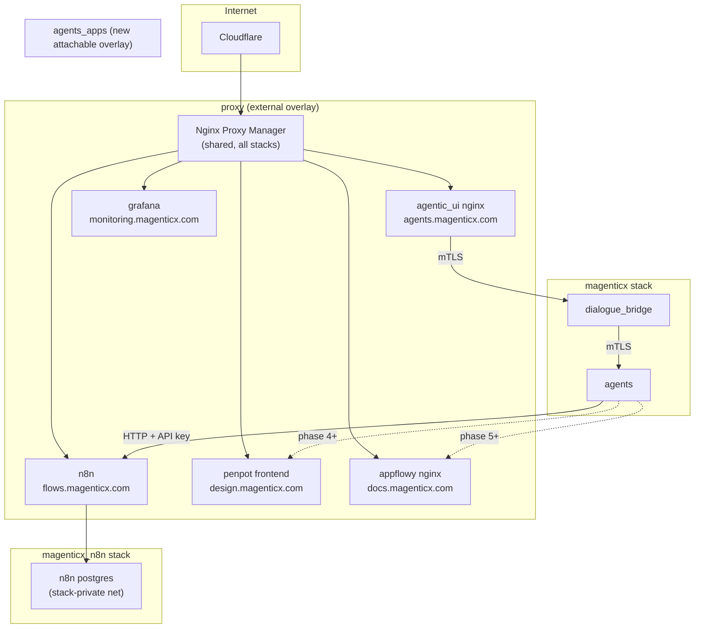

# Open-source services on Dennis

> **Status:** Not started
> **TODO source:** General → "Add as services in denis: n8n, penpot, appflowy, and other open source tools that can be used by the agents and the users."
> **Depends on:** nothing
> **Blocks:** [08 · Workflow / automation builder](08-workflow-automation-builder.md) (n8n is its candidate engine)
> **Services touched:** infra · agents · dialogue_bridge · agentic_ui

This plan turns "run some open-source tools on the VM" into a repeatable deployment contract. The deliverable is not three containers — it is a **pattern for hosting a third-party app next to mAgenticX on Dennis** (its own Portainer Stack, its own overlay network, its own subdomain behind the shared Nginx Proxy Manager, its own Swarm secrets, hard resource limits, and a backup story), plus the first three tenants of that pattern: **n8n** (workflow automation — the engine plan 08 wants), **Penpot** (collaborative design), and **AppFlowy** (docs/wiki). Everything else on the "other open source tools" wish-list becomes a second wave that reuses the same contract without re-deciding anything.

The mental model matters more than the tool list. mAgenticX's production stack is a **closed mesh**: `backend` is `internal: true`, every HTTP hop is mutually authenticated with internal-CA certificates enforced by *our* uvicorn entrypoint, and only `agentic_ui` touches the public `proxy` network. A third-party image cannot join that mesh — it will never run `entrypoint-tls.sh`, it cannot present our client certificate, and it has its own user directory that knows nothing about our Entra identities. So every tool added here is a **neighbour, not a member**: it sits on its own network, is reachable by a deliberately narrow path, and any agent access to it goes through an explicitly designed, credential-scoped seam. The two hardest questions in this plan are therefore not "does the image run on ARM" but **"which network can talk to it"** and **"whose account is the agent acting as when it writes there"**.

---

## 1. Goal & non-goals

**Goals**

1. Define the **third-party stack contract** on Dennis: one Portainer Stack per tool, own overlay network, NPM subdomain, Swarm secrets, bind-mounted config under `/opt/magenticx/<tool>/`, explicit CPU/memory/pids limits, and a documented backup command.
2. Ship **n8n** end-to-end first (deploy → NPM route → secrets → backup → agent reachability), because plan 08 is blocked on it and it is the lowest-risk of the three on ARM64.
3. Ship **Penpot** and **AppFlowy** behind an explicit **ARM64 feasibility spike** each — with a documented "we build the image ourselves or we drop the tool" decision point rather than a surprise mid-deploy.
4. Define **how an agent reaches a hosted tool**: a native `external_app` tool family in the agents service calling the tool's REST API, with credentials from Swarm secrets and a per-user identity story that is *designed*, not accidental.
5. Give users a **launcher** — the hosted apps appear in the UI as links, not as an unmarked pile of subdomains only the operator knows about.

**Non-goals**

- **No SSO integration in this plan.** Wiring Penpot/AppFlowy/n8n logins to Entra is a separate, per-tool project (each has a different OIDC story, and two of them gate it behind a paid tier). Phase 1–6 use each tool's native local accounts, provisioned by the operator. This is called out as the single largest deferred risk in § 12.
- **No mAgenticX data migration into these tools.** No conversation, attachment, or agent-filesystem content is copied into n8n/Penpot/AppFlowy by this plan.
- **No changes to the mTLS mesh.** `REQUIRE_MTLS` stays at its secure default; the app stack's TLS entrypoints are untouched. No tool joins `backend`.
- **No visual workflow builder.** That is plan 08's decision to make; this plan only guarantees n8n exists and is reachable.
- **No RBAC.** Who is *allowed* to use a hosted app is plan [02 · Org + user permissions](02-org-and-user-permissions.md); this plan ships an all-authenticated-users launcher and says so.

---

## 2. Current state

### The production substrate

Dennis runs Docker **Swarm**, and mAgenticX is one Portainer Stack (`magenticx`) among several on a **shared** Nginx Proxy Manager instance. The core stack is [`src/docker-compose-denis.yaml`](../../src/docker-compose-denis.yaml): seven services, five networks ([:331-340](../../src/docker-compose-denis.yaml)) — `backend` (`internal: true`), `frontend`, and three `external: true` overlays (`mcp_gateway`, `proxy`, `hashicorp_vault`) — ten Swarm secrets ([:344-374](../../src/docker-compose-denis.yaml)) and five volumes ([:378-392](../../src/docker-compose-denis.yaml)).

Facts that constrain everything below:

| Fact | Where | Consequence for a new tool |
| --- | --- | --- |
| **Only `agentic_ui` is on `proxy`, and it publishes no ports** | [`docker-compose-denis.yaml:312-315`](../../src/docker-compose-denis.yaml) | A new tool that needs a public URL must join `proxy` itself. Publishing a host port is not an option — NPM is the only ingress. |
| **`backend` is `internal: true`** | [`docker-compose-denis.yaml:332-333`](../../src/docker-compose-denis.yaml) | A tool cannot be reached from `backend` and cannot reach out of it. Any agents→tool call needs a *third* shared network. |
| **mTLS server enforcement lives in a bind-mounted entrypoint, not the image** | [`src/tls/entrypoint-tls.sh`](../../src/tls/entrypoint-tls.sh) (uvicorn-specific: appends `--ssl-ca-certs`/`--ssl-cert-reqs 2`, `exit 1` when the CA is unreadable) | A third-party image cannot participate in the mesh. Its hop is plaintext-on-overlay, exactly like `agents → mcp_gateway` today ([`docker-compose-denis.yaml:91`](../../src/docker-compose-denis.yaml) — `http://mcp_gateway:8005/sse`). |
| **The internal CA issues certs from a fixed service list** | [`src/tls/generate-certs.sh:29`](../../src/tls/generate-certs.sh) — `DEFAULT_SERVICES=(agentic_ui dialogue_bridge agents rag_service chat_postgres vault npm redis)` | Any tool we *do* want to give a cert (e.g. to terminate its own HTTPS toward NPM) must be added to that list and have its cert copied to the VM with the UID-1000/`600` permission dance. |
| **The MCP gateway is plain `docker compose`, not Swarm** | [`src/docker-compose-denis-mcp.yaml`](../../src/docker-compose-denis-mcp.yaml); rationale in `CLAUDE.md` (Swarm strips the mount-namespace caps `dind` needs) | There is precedent for a non-Swarm neighbour, but it is an exception forced by `dind`. New tools have no such excuse and belong in Swarm. |
| **No automated backups exist** | `CLAUDE.md` § Persistent volumes: "There is no automated backup — schedule these manually" | Every new stateful tool *adds* unbacked-up state. Backups are a phase in this plan, not an afterthought. |
| **SSH to Dennis is inspection-only** | `CLAUDE.md` § SSH access to Dennis | Every mutation goes local edit → Docker Hub (only for images we build) → Portainer. Recon is allowed; `docker network create` for a new overlay is **not** — it must be declared by a stack. |
| **Almost nothing has resource limits** | Only `agents` has `deploy.resources.limits.pids: 512` ([`docker-compose-denis.yaml:120-122`](../../src/docker-compose-denis.yaml)) | On a small ARM VM an unbounded new tool can OOM the box and take the app stack with it. Limits are mandatory for new stacks. |

### The reference precedent: the monitoring stack

[`src/docker-compose-denis-monitoring.yml`](../../src/docker-compose-denis-monitoring.yml) is already exactly the pattern this plan generalises, and it should be copied rather than reinvented:

- **Its own overlay** `net` (stack-scoped, becomes `magenticx_monitoring_net`) plus `proxy: external: true` — and **only Grafana joins `proxy`** (`:50-52`). Prometheus/Loki/Alertmanager stay unreachable from outside the stack.
- **No published ports at all.** Grafana is reachable only through NPM at `monitoring.magenticx.com` (`:7`, `:47` `GF_SERVER_ROOT_URL`).
- **It terminates its own HTTPS toward NPM** — `GF_SERVER_PROTOCOL=https` with a cert/key bind-mounted from `/opt/magenticx/monitoring/tls/` (`:20-39`), generated by our CA into [`src/tls/monitoring/`](../../src/tls/).
- **`deploy` blocks everywhere**: `replicas: 1`, `restart_policy.condition: on-failure`, `placement.constraints: node.role == manager` on the singletons; `mode: global` + `memory: 128M` limits on the two exporters.
- **Config is bind-mounted read-only from `/opt/magenticx/monitoring/...`**, with the repo's [`src/monitoring/`](../../src/monitoring/) as the source of truth; only *data* lives in named volumes (`grafana-data`, `prometheus-data`, …).
- **Its two secrets are `external: true`** (`magenticx_alert_smtp_password`, `magenticx_grafana_admin_password`) — declared in the compose, created by hand in Portainer's Secrets tab ([`docs/architecture/secrets.md:57-64`](../architecture/secrets.md)).
- **It does not join `backend`.** Cross-stack telemetry is collected out-of-band (Alloy over the Docker socket, filtered by the `com.docker.stack.namespace == magenticx` label), and the planned bridge is a *new neutral attachable overlay*, not a hole in `backend` ([`docs/development/observability.md:269`](../development/observability.md)).

### What does *not* exist today

There is no NPM configuration in the repo at all — no proxy-host definitions, no hostname map. The only in-repo evidence of the public topology is two strings: `monitoring.magenticx.com` and `ENTRA_REDIRECT_URI=https://agents.magenticx.com/...` ([`docker-compose-denis.yaml:251`](../../src/docker-compose-denis.yaml)). There is no "hosted apps" concept in the bridge, no external-app catalog endpoint, no launcher in the UI, and no agent tool that calls a self-hosted third-party API.

---

## 3. Target design

### The third-party stack contract

Every hosted tool is deployed as an independent Portainer Stack that satisfies all eight clauses:

| # | Clause | Why |
| --- | --- | --- |
| 1 | **Own Portainer Stack**, named `magenticx_<tool>`. Never added to the `magenticx` stack. | A tool's rolling update, crash loop, or image-tag mistake must not be able to recreate `dialogue_bridge` (the same class of accident `--no-deps` guards against locally). |
| 2 | **Own stack-scoped overlay** `net` for intra-tool traffic (app ↔ its DB/cache). | Keeps a tool's Postgres unreachable from anywhere else on the VM. |
| 3 | **`proxy: external: true`, joined by the single web-facing service only.** No `ports:`. | NPM stays the only ingress; the tool's DB never sees the internet. |
| 4 | **One NPM proxy host per tool**, on a `*.magenticx.com` subdomain, Let's Encrypt cert, rules scoped to that host. | NPM is shared with unrelated stacks — a global rule would hit them. |
| 5 | **Secrets as Swarm secrets**, `external: true`, named `magenticx_<tool>_<purpose>`, consumed via the tool's own `*_FILE` convention or a `cat`-in-command shim. | Matches [`secrets.md`](../architecture/secrets.md); keeps values out of the Portainer env dropdown. |
| 6 | **Explicit `deploy.resources.limits` (memory + cpus + pids) and `reservations`**, plus `placement.constraints: node.role == manager` and `restart_policy.condition: on-failure`. | The VM is small; an unbounded neighbour is an availability risk to the product. |
| 7 | **Config bind-mounted read-only from `/opt/magenticx/<tool>/`; data in named volumes**; every stateful volume named in the backup runbook. | Mirrors the monitoring stack and makes the backup script enumerable. |
| 8 | **`agents_net` membership only if an agent must call it**, and only for the tool's API service. | Least privilege: reachability is opt-in per tool, not a shared bus. |

### Network topology

Two new overlays, both declared by stacks (never hand-created over SSH):

- **`apps_ingress`** — not actually new: it is the existing `proxy` overlay. Web-facing tool services join it, exactly as Grafana does.
- **`agents_apps`** — a new attachable overlay whose only members are the `agents` service (added to `magenticx`'s network list) and the API service of each tool an agent may call. This is the same "neutral attachable overlay bridges an `internal: true` network" shape the observability plan settled on ([`observability.md:269`](../development/observability.md)) and it never widens `backend`.

The load-bearing property: **`agents_apps` carries no mAgenticX data of its own**. It is a call-out channel. `dialogue_bridge` is deliberately *not* on it — the bridge never talks to a hosted tool directly, so a compromised tool cannot reach the service that holds sessions and the chat database. (The one exception is plan 08's *inbound* direction, where n8n calls the bridge — and that goes the long way round, through NPM and nginx like any other external client, precisely so it inherits the edge's headers, rate limits and TLS. See [08 § API surface](08-workflow-automation-builder.md).)

### TLS: what is and isn't protected

Public traffic is TLS end-to-end (Cloudflare → NPM → tool). NPM→tool is HTTPS when the tool can terminate it; we give the tool an internal-CA cert the same way Grafana gets one (add it to `generate-certs.sh`'s service list, copy to `/opt/magenticx/<tool>/tls/`, fix permissions). Where a tool's image cannot terminate TLS, NPM→tool is plaintext **on the `proxy` overlay only** — acceptable because that overlay is host-internal, and it is the current state for several NPM tenants already.

`agents → tool` on `agents_apps` is **plaintext + API key**. That is a real, named downgrade relative to the app mesh, and it matches the existing `agents → mcp_gateway` hop. Mitigations, in order: (1) the overlay has exactly two members; (2) the API key is a Swarm secret with per-tool least privilege; (3) the tool's API is bound to its container only, never published; (4) § 12 records "TLS-terminating sidecar for `agents_apps` hops" as the follow-up. What we must **not** do is put a third-party image on `backend` "so it gets TLS" — it would not get mTLS anyway (its uvicorn/nginx isn't ours) and it would gain reach to Postgres, Redis and Vault.

### Per-service assessment

ARM64 is the first gate. Dennis is Oracle Cloud Ampere (`--platform linux/arm64` is why our own images are cross-built). A tool with no official arm64 manifest means **we build and publish it ourselves** — which drags it into the `CLAUDE.md` published-image-tags table, the patch-bump rule, and a permanent maintenance debt on every upstream release. That cost is the deciding factor, not the tool's features.

| Tool | Purpose | Images | arm64? | Stack | Networks | Volumes / state | Exposure |
| --- | --- | --- | --- | --- | --- | --- | --- |
| **n8n** | Trigger→action workflow engine; the candidate engine for plan 08 | `n8nio/n8n:<pinned>` + a stack-private `postgres:16-alpine` | **Yes** — upstream publishes multi-arch (amd64/arm64) release manifests. Verify the *pinned* tag with `docker manifest inspect` before committing. | `magenticx_n8n` | `net` (private, with its Postgres), `proxy`, `agents_apps` | `n8n-data` (`/home/node/.n8n`: encryption-keyed credentials, binary data), `n8n-pgdata` | `flows.magenticx.com` (NPM); API reachable on `agents_apps` only |
| **Penpot** | Collaborative design / UI mockups | `penpotapp/frontend`, `penpotapp/backend`, `penpotapp/exporter` + Postgres + Redis | **RISK — must be verified by spike.** Penpot's published manifests have historically been amd64-first, and the **exporter** is the sharp edge: it drives headless Chromium/Playwright, which is the component most likely to lack an arm64 build or to be unusably slow. Treat "exporter works on arm64" as the spike's exit criterion, not "frontend starts". | `magenticx_penpot` | `net` (frontend+backend+exporter+pg+redis), `proxy` (frontend only) | `penpot-assets` (uploaded files — potentially large), `penpot-pgdata`, `penpot-redis` (ephemeral) | `design.magenticx.com`; **no `agents_apps` in phase 4** (agent access deferred, see § 12) |
| **AppFlowy** | Docs / wiki / structured notes | AppFlowy-Cloud is a **multi-service** deployment: `appflowy_cloud`, `admin_frontend`, `appflowy_worker`, plus its own Postgres (**with pgvector**), Redis, MinIO (S3), GoTrue (auth) and an nginx | **HIGHEST RISK.** Two compounding problems: (a) official arm64 manifests are not reliably published across *all* of those components, and one missing arm64 image blocks the whole stack; (b) even if they exist, it is the largest resource footprint of the three by a wide margin (its own PG + Redis + object store) on a VM that already runs two Postgres databases, Chroma, Redis, and the agent runtime. | `magenticx_appflowy` | `net` (all internal services), `proxy` (its nginx only) | `appflowy-pgdata`, `appflowy-minio`, `appflowy-redis` | `docs.magenticx.com`; no `agents_apps` initially |

**Second wave** (same contract, evaluated only after phase 3 proves the pattern — each is a one-page addendum, not a new plan):

| Tool | Purpose | arm64 outlook | Why it is a good fit here |
| --- | --- | --- | --- |
| **Excalidraw** | Whiteboard / quick diagrams | Straightforward (static frontend, optional tiny collab server) | Near-zero footprint; covers most of Penpot's casual use if Penpot's arm64 spike fails |
| **Stirling-PDF** | PDF split/merge/OCR/convert | Multi-arch published | Immediately useful as an *agent* tool — a stateless HTTP API with no user accounts, so it sidesteps the entire identity problem |
| **NocoDB** or **Baserow** | Spreadsheet-as-database | Multi-arch published | A structured place for workflow output; a natural n8n node target |
| **Docmost** / **Outline** | Wiki | Multi-arch (needs PG + Redis) | The realistic fallback if AppFlowy's footprint is rejected |
| **LibreTranslate** | Self-hosted translation | Multi-arch (large model layers) | Another stateless, account-free agent tool |

Prefer stateless, account-free HTTP APIs (Stirling-PDF, LibreTranslate) when the goal is *agent* capability, and account-bearing apps (Penpot, AppFlowy) only when the goal is *human* capability. That distinction is the cheapest way to avoid the identity problem in § 9.

### How an agent reaches a hosted tool

The agents service has exactly two tool sources today, and neither currently reaches an arbitrary external host. **No native tool provides a generic outbound-HTTP capability** — the only native tool that makes an HTTP call at all is `search_past_conversations`, and it calls the bridge's internal memory endpoint ([`runtime/tools/memory_search.py:69-83`](../../src/agents/runtime/tools/memory_search.py): a `settings`-derived URL plus `internal_service_headers()` and the mTLS client cert). Every other outbound call is a LangGraph *node* hitting `rag_service`, or the voice router hitting OpenAI. Arbitrary external egress exists only *behind* the MCP gateway.

Two candidate seams, and the choice differs by tool:

**Option A — MCP gateway catalog entry.** Add the tool as a server in the gateway's catalog so it appears in the manifest the agents service loads per request ([`utils/mcp_tools.py:177-209`](../../src/agents/utils/mcp_tools.py) — `list_mcp_tools`, `mcp_session_context`, cached in `_MCP_TOOL_MANIFEST_CACHE` at `:18`). Attractive because the tool then flows through the existing per-(user, agent) preference machinery with no new agents-service code — including the *user-enable* path, which lets a user opt into any gateway tool. Three problems: it only works if a maintained MCP server exists for that tool; the gateway is the plain-compose `dind` exception, so every added server multiplies containers on the box least able to afford it; and **MCP tools carry no user identity at all** — nothing injects `user_id` into their arguments or headers, and the gateway hop is unauthenticated plaintext. Best reserved for tools that ship a first-class MCP server *and* need no per-user attribution.

**Option B (recommended default) — a native `external_app` tool family.** Narrowly-typed native tools (`n8n_list_workflows`, `n8n_trigger_workflow`, per-tool equivalents later) registered through `register_native_tool(NativeToolDef(...))` ([`runtime/tools/registry.py:70-75`](../../src/agents/runtime/tools/registry.py), definition shape at `:44-61`), each a `build_*_tool(...) -> StructuredTool` factory in its own module, following `memory_search.py` as the template: URL from `src/agents/core/settings.py`, API key from a Swarm secret via the `*_FILE` convention into a `SecretStr`, explicit `httpx` timeout, typed exception, Pydantic-validated response.

Two properties of the harness make Option B the right seam, and they are also its constraints:

1. **Identity is already available, by closure.** Native tools receive a `NativeToolContext(user_id, agent_slug, conversation_id, …)` ([`registry.py:31-41`](../../src/agents/runtime/tools/registry.py)) built per request at [`deep_agent.py:300-317`](../../src/agents/runtime/abstractions/deep_agent.py) / [`yaml_agent.py:91-103`](../../src/agents/runtime/abstractions/yaml_agent.py), and the builder closes over it. Because there is one agent instance and one compiled graph per request, the closure cannot leak across users. So an `external_app` tool *can* stamp the acting mAgenticX user into every call — which is exactly what the identity story below requires and what an MCP tool cannot do.
2. **A native tool cannot be turned off by the user.** `_apply_tool_disables` subtracts the user's disabled set **minus** the native keys ([`deep_agent.py:336`](../../src/agents/runtime/abstractions/deep_agent.py)), and `toggle_agent_tool` rejects native keys outright ([`utils/agent_tools.py:128-134`](../../src/agents/utils/agent_tools.py)). Therefore an `external_app` tool must be **declared per-agent in `agent.yaml`** (`- {native: n8n_trigger_workflow}`, the XOR form validated at [`declarative/agent_spec.py:37-72`](../../src/agents/runtime/abstractions/agent_spec.py)) and must **never** be `auto_attach`. Auto-attaching an outbound-call tool would give every agent an un-disable-able channel to a third-party app — a capability the user cannot revoke from the UI. That is the sharpest edge in this whole seam.

Fail-closed registration: if the base URL or key is unset, the tool is not registered at all, so an agent never receives a tool guaranteed to 401. (Note there is currently no populated `tools:` list anywhere in the repo — the only `agent.yaml`, [`agents_seed/omni-yaml-v1/agent.yaml`](../../src/agents/agents_seed/), has `tools: []` — so this will be the first real exercise of the declared-tool path.)

Recommendation: **Option B for n8n** (its REST API is simple, plan 08 needs a tight auditable contract, and per-user attribution is mandatory there), Option A only for stateless account-free tools with a maintained MCP server, and **no agent access at all** for Penpot/AppFlowy until the identity question below is answered.

### The identity problem (the real design risk)

Every account-bearing tool here has **its own user directory**. mAgenticX users authenticate against Entra/Vault; n8n, Penpot and AppFlowy know nothing about them. So when an agent calls a hosted tool with a Swarm-secret API key, it is acting as **one shared service account** — which means user A's agent and user B's agent write into the same n8n instance, see the same workflows, and can read each other's execution data. On a single-tenant deployment with one human that is invisible; the moment plan 02 makes this multi-tenant it is a data-segregation defect.

Three options, escalating:

1. **Shared service account + attribution metadata** (phase 2). One API key; every agent-initiated call stamps `mx_user_id` into the tool's own metadata (n8n workflow tags / execution data) and into our structured logs. Cheap, honest, and **only defensible while the deployment is effectively single-tenant.** Must be documented as such in the launcher UI, not just in a doc.
2. **Per-user credentials in Vault** (phase 6, recommended target). Each user links their own tool account once; the credential lands in Vault `kv` at `secret/external_apps/<tool>/<user_id>`, and the agents service fetches it *per run* using the run's user id. Agents does not talk to Vault today (only the bridge does), so this needs either an agents-side Vault client or a bridge-mediated short-lived-credential endpoint — the latter is preferable because it keeps Vault reachability confined to one service.
3. **OIDC federation to Entra** per tool. The correct end state, but per-tool effort with licence-tier landmines. Out of scope here; recorded in § 12.

The rule this plan sets, regardless of option: **an agent-initiated write into a hosted tool is always attributable to a specific mAgenticX user id in that tool's own data**, and any tool where we cannot achieve that does not get agent write access.

---

## 4. Data model & migrations

Phases 0–4 need **no `chat_db` schema change**. Deploying a neighbouring stack touches no bridge table.

Two app-side additions arrive with the launcher and the per-user credential story:

**`external_apps` — not a table.** The catalog of hosted apps (slug, display name, URL, icon, description, whether agents may call it) is *configuration*, not user data: it changes only when the operator deploys a stack. It belongs in `core/settings.py` as a parsed env value (`EXTERNAL_APPS_JSON`) so it stays a one-place edit with no migration. Resisting the urge to make it a table is deliberate — a table would need an admin UI, which needs plan 02.

**`external_app_links` — a real table (phase 6 only).** Non-secret metadata for "user U has linked their account on tool T": the secret itself lives in Vault, never in Postgres.

| Column | Type | Notes |
| --- | --- | --- |
| `id` | `String` PK | `gen_uuid` default, matching every other table |
| `user_id` | `String` FK → `users.id` `ON DELETE CASCADE`, indexed | Unlinking is implied by user deletion; the Vault path must be swept too (see § 9) |
| `app_slug` | `String` not null | Matches a slug in the settings catalog; no FK (config, not a table) |
| `external_account_label` | `String` nullable | What to show the user ("n8n: kostas@…"); never a credential |
| `vault_path` | `String` not null | Where the credential lives; the value is never read by SQL |
| `scopes` | `JSON` nullable | What the linked credential is allowed to do, if the tool supports scoping |
| `linked_at` / `last_used_at` | `DateTime` | Staleness detection |
| — | `UniqueConstraint("user_id", "app_slug")` | One link per (user, app) |

Migration slot: the alembic chain head is `0016_retire_enabled_tools`, so this is **`0017_external_app_links`** — but note plan 08 also claims `0017`. Whichever lands first takes it; the second rebases its `down_revision`, and if both merge in parallel the fix is `alembic merge` (`CLAUDE.md` § Conflict resolution).

---

## 5. API surface

Deliberately tiny. The bridge is not a proxy for hosted apps.

| Method | Path | Auth | Returns | Notes |
| --- | --- | --- | --- | --- |
| `GET` | `/v1/external-apps` | `require_current_user` | `ExternalAppOut[]` | The settings-derived catalog, filtered to apps this deployment actually has. Read-only, no CSRF (GET), covered by the global per-identity budget. **Must not leak** API keys, internal URLs, or ports — only the public `https://.magenticx.com` URL. |
| `GET` | `/v1/external-apps/{slug}/link` | `validate_userId`-style bound user | `ExternalAppLinkOut \| null` | Phase 6. Whether the caller has linked this app. Never returns the credential. |
| `PUT` | `/v1/external-apps/{slug}/link` | bound user + `require_csrf_protection` | `ExternalAppLinkOut` | Phase 6. Body carries the credential once; the handler writes it to Vault and stores only metadata. Own rate-limit scope (`external-app-link`), per-user, following the named-dependency pattern in [`core/security/rate_limit.py:88-162`](../../src/dialogue_bridge/core/security/rate_limit.py). |
| `DELETE` | `/v1/external-apps/{slug}/link` | bound user + CSRF | `204` | Deletes the row **and** the Vault path. Fail loud if the Vault delete fails — a dangling credential is worse than a dangling row. |

Layering per `CLAUDE.md`: router `src/dialogue_bridge/router/external_apps.py` (thin, registered in `main.py` alongside the others at [`main.py:159-246`](../../src/dialogue_bridge/main.py)), logic in `utils/external_apps.py`, schemas in `schemas/__init__.py`, config in `core/settings.py`.

**Agents side:** no new bridge endpoint. The native tool calls the hosted app directly on `agents_apps`; its base URL and secret come from `src/agents/core/settings.py`. Phase 6 adds one internal, `require_internal_caller`-guarded endpoint (`POST /v1/internal/external-apps/credential`) so the agents service can exchange a run's user id for a short-lived credential without gaining Vault access — and, like every internal route, it must also be denied at the nginx edge (the existing `location ^~ /api/v1/internal/ { return 404; }` at [`nginx.conf.template:170-172`](../../src/agentic_ui/nginx.conf.template) already covers the whole prefix).

---

## 6. Frontend surface

A launcher, nothing more. New feature folder `src/agentic_ui/src/features/apps/`:

- `components/AppsLauncher.tsx` — a grid of hosted-app cards (Lucide icon, name, one-line purpose, `target="_blank" rel="noopener noreferrer"`). Empty state explains that no apps are configured for this deployment and does not pretend to offer a fix the user can't perform.
- `hooks/useExternalApps.ts` — fetches the catalog once per session; skeleton (not spinner) while loading, per the frontend standards.
- Entry point: a row in the profile panel sidebar ([`profile_parts/ProfileSidebar.tsx`](../../src/agentic_ui/src/features/settings/components/profile_parts/ProfileSidebar.tsx)) plus an `AppsTab.tsx` under `profile_parts/`, which is where every other operator-facing surface already lives (`McpServersTab.tsx`, `AgentsTab.tsx`, …). Phase 6 adds the link/unlink control to that tab.
- Contracts: `ExternalApp` in `shared/lib/types.ts`, inferred from a Zod schema in `shared/lib/schemas.ts`, fetched via `shared/lib/api.ts` → `shared/lib/http.ts`. No component calls `fetch` directly.
- Semantic tokens only, `prefers-reduced-motion` guard on the card hover/enter motion, 44×44px minimum touch targets, `aria-label` on the icon-only external-link affordance.
- **No snapshot bump**: the catalog is fetched fresh, never persisted into `UISnapshotSerializable` in `uiStateStorage.ts` — so the version-bump rule does not fire.

A visible trust affordance is required, not optional: while option 1 of the identity story is in force, each card whose app is agent-callable says so, and says the agent uses a shared service account. Users should never be surprised that their agent's n8n write is visible to a colleague.

---

## 7. Cross-cutting impact

**Deployment ripple** — the largest part of this plan.

| Ripple | Detail |
| --- | --- |
| **New Portainer Stacks** | `magenticx_n8n`, later `magenticx_penpot`, `magenticx_appflowy`. Each is a new entry in the Stacks tab with its own update/rollback lifecycle. The `magenticx` stack is edited exactly once, in phase 2, to add `agents_apps` to the `agents` service's network list — a change that recreates the `agents` task, so it rides `order: start-first`. |
| **New networks** | `agents_apps` — an attachable overlay. It cannot be created over SSH (inspection-only rule); it is declared by whichever stack owns it and referenced `external: true` by the other, exactly as `mcp_gateway` is today. Decide the owner *before* deploying, or the second stack fails on a missing network. |
| **New secrets** | Per tool, created by hand in Portainer's Secrets tab before the first deploy, `external: true` in the compose, `magenticx_<tool>_<purpose>` naming, fixed in-container alias so rotation is a `name:` bump. For n8n: `magenticx_n8n_encryption_key`, `magenticx_n8n_db_password`, `magenticx_n8n_api_key`. **`N8N_ENCRYPTION_KEY` is the highest-blast-radius new secret on the VM** — it encrypts every credential n8n stores, so losing it bricks every workflow's credentials and rotating it requires re-entering them all. It belongs in the § 12 blast-radius list and in [`secrets.md`](../architecture/secrets.md)'s ordering. |
| **New NPM proxy hosts** | One per tool subdomain, each with its own Let's Encrypt cert and its rules **scoped to that host**. NPM serves unrelated stacks on this VM; a global rate-limit or access-list change is a cross-tenant outage. Nothing about the `agents.magenticx.com` host changes. |
| **Image-tag table discipline** | Third-party images we merely *pull* do **not** belong in `CLAUDE.md`'s published-image-tags table — that table tracks images we build and push. But **every third-party tag must be pinned to an exact version** (never `:latest`) in the compose, and if an arm64 spike forces us to build a tool ourselves, that image *does* enter the table and inherits the patch-bump-only rule. Adding a row for something we don't build would corrupt the table's meaning. |
| **Internal CA** | Any tool terminating its own HTTPS gets added to `generate-certs.sh:29`'s service list, its cert copied to `/opt/magenticx/<tool>/tls/`, and the `chown 1000:1000` + `644`/`600` permission fix applied — the same fail-closed footgun documented for the app services. |
| **Monitoring** | Alloy filters logs by `com.docker.stack.namespace == magenticx` ([`src/monitoring/alloy-config.alloy`](../../src/monitoring/)), so a new stack's logs are **invisible in Grafana by default**. Either widen that matcher to the `magenticx_*` prefix or accept blind spots — and accept them *knowingly*, since a silently failing n8n is exactly how plan 08's automations rot. |
| **Resource envelope** | The VM's real headroom is unknown to this document and must be measured in phase 0 (read-only `free -h`, `df -h`, `docker stats`, `docker service ls`). Every new stack's limits are set from that measurement, and the sum of `reservations` across all stacks must stay below the measured total. |

**Plan ripple**

- **[08 · Workflow builder](08-workflow-automation-builder.md)** is unblocked by phase 1 (n8n running) and phase 2 (agents can reach it). Its inbound direction — n8n calling mAgenticX — is *its* design problem, not this plan's, and deliberately does not use `agents_apps`.
- **[02 · Org + user permissions](02-org-and-user-permissions.md)** owns "who may see/use which hosted app". Until it lands, the launcher is all-authenticated-users and the shared-service-account caveat stands.
- **[04 · Notifications + PWA](04-notifications-and-pwa.md)** is the natural channel for "your hosted-app call failed", instead of a silent tool error inside a run.
- **[11 · Sandbox runner](11-sandbox-runner.md)** is the other plan that adds a service to this trust model; both must not weaken `backend`. Worth reviewing them together, since the sandbox runner also wants a dedicated network and `dind`-class privileges.

**Docs ripple:** `docs/architecture/overview.md` (services/networks/topology + the NPM chain), `docs/architecture/secrets.md` (a new per-stack secrets section), `docs/architecture/configuration.md` (`EXTERNAL_APPS_JSON`, the agents-side tool env), `CLAUDE.md` (a compose-files-on-Dennis row per tool; the deploy workflow note that these are separate stacks), and a new `docs/architecture/hosted-apps.md` holding the contract itself so future tools are a table row, not a rediscovery.

---

## 8. Phased execution

### Phase 0 — Capacity and topology recon (read-only)

Measure before promising. Over SSH, **inspection commands only**: `free -h`, `df -h`, `docker stats --no-stream`, `docker service ls`, `docker network ls`, `docker network inspect proxy` (the `proxy` CIDR is hard-coded as `set_real_ip_from 10.0.9.0/24` at [`nginx.conf.template:36`](../../src/agentic_ui/nginx.conf.template) — confirm it still matches), and NPM's existing proxy-host list. Also run `docker manifest inspect` locally against each candidate's exact pinned tag to settle arm64 on evidence rather than recollection.

**Acceptance:** a written capacity budget (RAM/CPU/disk headroom), the confirmed `proxy` CIDR, the current NPM host list, and a per-candidate arm64 verdict with the manifest output that proves it. No VM state changed.

### Phase 1 — n8n end-to-end, no agent access

One stack, one subdomain, one human user. n8n on its own `net` with a stack-private pinned Postgres; three Swarm secrets; `deploy` limits from phase 0's budget; data in `n8n-data` + `n8n-pgdata`; NPM host `flows.magenticx.com`. Not on `agents_apps` yet. Harden at the tool level too: `N8N_BASIC_AUTH`/owner account set up on first boot, public API enabled but **no** webhook host misconfiguration (set `N8N_HOST`/`WEBHOOK_URL` to the public subdomain or n8n will mint unreachable webhook URLs — the single most common n8n-behind-a-proxy failure).

**Acceptance:** `flows.magenticx.com` serves n8n over a valid public cert; login works; a trivial workflow (Schedule → NoOp) executes and its execution history survives a `docker service update --force`; `docker service ps magenticx_n8n_*` shows all tasks `Running`; the app stack is untouched (`magenticx_*` task IDs unchanged); measured memory sits inside the declared limit.

### Phase 2 — Agent reachability

Declare `agents_apps`; add it to `magenticx`'s `agents` service and to the n8n service; add `N8N_BASE_URL` + `N8N_API_KEY_FILE` to the agents settings; implement the `external_app` native tool family (`n8n_list_workflows`, `n8n_trigger_workflow`) with an `httpx` timeout on every call, typed exceptions (never bare `except Exception`), a Pydantic-validated response, structured logging that never logs the key, and fail-closed registration when config is absent. Declare the tools in exactly one agent's `agent.yaml` to prove per-agent scoping.

**Acceptance:** that agent can list and trigger an n8n workflow in a live run; an agent *without* the tool declared cannot see it; disabling the tool in Settings → Agents removes it from the next run; the key never appears in any log line; a wrong/absent key surfaces as a clean tool error, not a stack trace; `dialogue_bridge` is *not* on `agents_apps` (`docker network inspect`).

### Phase 3 — Backups, limits, observability for the pattern

The phase that makes hosting these things responsible rather than reckless. A single cron'd script on the VM that `pg_dump`s each tool's database and tars its bind-mounted data dirs into a dated archive, with retention; extend it to the app stack's `chat_convs` + `vectorstore` at the same time, since "no automated backup" is an existing gap this plan is otherwise about to widen. Widen Alloy's stack-label matcher so `magenticx_*` stacks log into Loki, and add a Grafana row + a Prometheus/Loki alert for "tool service down" and "tool error-log rate high".

**Acceptance:** a restore rehearsal — wipe a scratch n8n stack, restore from the archive, and the trivial workflow plus its credentials come back; n8n logs appear in Grafana; killing the n8n task fires an alert email; every new stack has non-empty `limits` *and* `reservations`.

### Phase 4 — Penpot (gated on an arm64 spike)

Spike first, locally, on `--platform linux/arm64`: bring up frontend + backend + exporter and **export a document**. If the exporter cannot run arm64, the decision is explicit — build the exporter image ourselves (accepting the maintenance debt and a table row), or drop Penpot in favour of Excalidraw from the second wave. Only after the spike passes: deploy `magenticx_penpot` per the contract, `design.magenticx.com`, no `agents_apps`.

**Acceptance:** the spike's exit criterion is a successful arm64 export, recorded with the command and output; if it fails, a written decision (build vs. substitute) merged into § 12 before any deploy. Deployed: design.magenticx.com works, a file survives a redeploy, resource use is inside limits, assets are in the phase-3 backup.

### Phase 5 — AppFlowy (gated on an arm64 *and* a footprint spike)

Two gates, because AppFlowy fails differently. First arm64 across **every** component (any single missing image blocks the stack). Second, footprint: measure the whole AppFlowy stack's steady-state RAM against phase 0's remaining headroom *after* n8n and Penpot. If either gate fails, substitute Docmost/Outline — a wiki with a PG+Redis footprint instead of PG+Redis+MinIO+GoTrue — and record why.

**Acceptance:** both gates passed with measurements, or a merged substitution decision. Deployed: `docs.magenticx.com` works, a document survives a redeploy, MinIO data is backed up, and the VM retains headroom for the app stack under load (verify with a real inference run while the tool stack is warm).

### Phase 6 — Per-user identity for agent-callable apps

Replace the shared service account with option 2: `external_app_links` + Vault `kv` per (user, app), the bridge-mediated internal credential endpoint, and the link/unlink UI in the profile panel. Sweep the Vault path on user deletion.

**Acceptance:** two users' agents, linked to different n8n accounts, produce writes attributable to each; an unlinked user's agent gets a clean "not linked" tool error, never someone else's credential; deleting a user removes both the row and the Vault path (verified in Vault); the shared-service-account caveat is removed from the launcher UI in the same change.

### Phase 7 — Second wave, as addenda

Add tools from the second-wave table one at a time under the same contract. Prefer stateless account-free APIs first (Stirling-PDF, LibreTranslate) since they give agent capability without touching identity.

**Acceptance:** each addition is a one-page addendum to `docs/architecture/hosted-apps.md` with its table row filled in, and it changed no existing stack.

---

## 9. Security & privacy

**The trust boundary is what this plan actually changes.** Today the attack surface is one hostname and one nginx. After phase 1 it is *N* hostnames, each a full third-party web application with its own auth, its own CVE stream, and its own admin panel — reachable from the internet through the same NPM that fronts unrelated stacks. That is the single biggest risk in this plan set alongside plan 08's inbound API, and it deserves to be treated as a deliberate expansion rather than a side effect.

| Threat | Control |
| --- | --- |
| **A tool's web UI is compromised (RCE, auth bypass, unpatched CVE)** | Blast radius is bounded by network placement: the tool is on its own `net` + `proxy`, never on `backend`. It cannot reach Postgres, Redis, Vault, or the bridge. From `agents_apps` it can reach only the `agents` port — which requires the internal proxy secret *and*, under mTLS, a CA-signed client cert it does not have. Pin versions, subscribe to each tool's release feed, and treat "upgrade the hosted tools" as recurring work with an owner. |
| **Tool admin panel exposed publicly** | Each tool's admin/setup route is scoped in its NPM host (access list or auth) — never left on the default open setup wizard. n8n's owner account is created on first boot, before the host goes live in DNS if possible. |
| **NPM rule bleeds into another tenant** | Every rule is bound to its specific `*.magenticx.com` host. No global NPM settings changes. Reviewed as part of the deploy, not after. |
| **Agent→tool credential theft** | API key is a Swarm secret (tmpfs, never in the compose or Portainer env dropdown), read via the `*_FILE` convention into a `SecretStr`, never logged, never returned by any bridge endpoint. Least privilege per tool (n8n API keys should be as narrow as n8n allows). Rotation is a versioned Swarm `name:` bump with a fixed alias. |
| **`agents_apps` traffic is plaintext** | Named and accepted, with the same reasoning as `agents → mcp_gateway`: two-member overlay, host-internal, no published ports. Follow-up in § 12. What is *not* acceptable is quietly moving a tool onto `backend` to "get TLS". |
| **Cross-user data leakage inside a tool** | The core unresolved issue. Phases 2–5 run a shared service account and **must** disclose that in the launcher UI; phase 6 replaces it with per-user Vault-held credentials. No agent *write* access is granted to a tool where per-user attribution is impossible. |
| **Right-to-erasure breaks** | A user's data now lives outside `chat_db`. Deleting a mAgenticX user must also delete their `external_app_links` row and their Vault credential path — and we must be honest that content they created *inside* Penpot/AppFlowy is not reachable by our deletion path. Document that limitation in the launcher UI rather than implying a completeness we don't have. |
| **New credential type widens auth surface** | This plan adds **no new mAgenticX credential type** — that is plan 08's job. The catalog and link endpoints use the existing session dependency chain (`require_current_user` / bound-user), CSRF on every mutation ([`session.py:434-451`](../../src/dialogue_bridge/core/auth/session.py)), and named per-route rate limits. Keeping the two plans' auth changes separate is deliberate: one new external entry point at a time. |
| **Resource exhaustion as a denial of service** | Every service declares `limits` *and* `reservations`; the sum of reservations stays under phase 0's measured budget. An unbounded n8n workflow loop must not be able to starve `agents`. |
| **Secret loss = permanent data loss** | `magenticx_n8n_encryption_key` is unrecoverable-by-design: without it n8n's stored credentials are ciphertext forever. It goes in the operator's offline notes at the same tier as the Vault unseal keys, and into `secrets.md`'s blast-radius ordering. |

Fail-closed defaults throughout: an agent tool with no configured URL/key is **not registered**; a link endpoint that cannot write to Vault returns an error rather than storing a half-link; a tool whose cert is unreadable follows the existing `REQUIRE_TLS` stance and refuses to serve rather than downgrading.

---

## 10. Testing strategy

Infrastructure is tested by rehearsal and by the app-side code being genuinely unit-testable.

**Local (before any deploy).** Each tool gets a local compose overlay (`src/docker-compose-<tool>.yaml`) following the existing add-on pattern ([`docker-compose-mcp.yaml`](../../src/docker-compose-mcp.yaml)), so the stack composes locally without Swarm. Run every candidate under `--platform linux/arm64` via buildx/QEMU — that is the arm64 gate, run on a laptop instead of discovered on the VM.

**Agents-side unit tests.** The `external_app` tool family is ordinary async code: mock the `httpx` transport and assert (a) a timeout is always set, (b) a non-2xx becomes a typed tool error and never a raw traceback, (c) the API key never appears in any emitted log record — assert against captured log output, not by inspection, (d) missing config means the tool is absent from the registry, (e) the response is Pydantic-validated and a malformed body is rejected. Note the environment caveat: the agents test suite needs `deepagents` 0.6.10, which the host doesn't have — validate with `py_compile` locally and run the suite in-image.

**Bridge-side tests.** Catalog endpoint returns no internal URL/port/key; link endpoints enforce bound-user + CSRF; a Vault write failure yields no orphan row; deleting a user removes row + Vault path. Real database, never a mocked one.

**Frontend.** `tsc` in-image (host TS is older than the container pin); the launcher renders an empty state with no apps configured, and external links carry `rel="noopener noreferrer"`.

**Deploy rehearsals.** For every stack: bring it up, redeploy it with a changed tag, confirm the app stack's task IDs are unchanged; kill a task and confirm restart; **restore from backup into a scratch stack** (phase 3's real acceptance test — an untested backup is not a backup); confirm `docker network inspect agents_apps` lists exactly the intended members.

---

## 11. Docs to update

| Doc | Change |
| --- | --- |
| **new** `docs/architecture/hosted-apps.md` | The third-party stack contract, the per-tool table, the network diagram, the identity story, and the second-wave list. The authoritative home for this plan's output. |
| [`docs/architecture/overview.md`](../architecture/overview.md) | Services-at-a-glance rows; the Docker-networks table (`agents_apps`); the NPM/TLS-termination chain now fanning out to several subdomains. |
| [`docs/architecture/secrets.md`](../architecture/secrets.md) | A per-tool stack section mirroring the monitoring-stack section; add the n8n encryption key to the blast-radius ordering. |
| [`docs/architecture/configuration.md`](../architecture/configuration.md) | `EXTERNAL_APPS_JSON` (bridge), `N8N_BASE_URL` / `N8N_API_KEY_FILE` (agents), per-tool env for each stack. |
| [`docs/architecture/service-startup.md`](../architecture/service-startup.md) | Hosted tools are **not** start gates for any mAgenticX service — state it explicitly so nobody adds a `depends_on`. |
| [`docs/development/tool-harness.md`](../development/tool-harness.md) | The `external_app` native tool family and its fail-closed registration. |
| [`docs/development/observability.md`](../development/observability.md) | The widened Alloy stack-label matcher and the new per-tool alerts. |
| `CLAUDE.md` | A compose-file row per tool under § Compose files on Dennis; a note that these are separate Portainer Stacks; the rule that pulled third-party images stay out of the published-image-tags table unless we build them. |
| [`docs/plans/README.md`](README.md) | Status transitions as phases land. |

---

## 12. Risks & open decisions

**Risks**

| Risk | Severity | Mitigation |
| --- | --- | --- |
| **Penpot / AppFlowy arm64 gaps** | High | Phase 4/5 are spike-gated with a written build-vs-substitute decision. Substitutes (Excalidraw, Docmost) are pre-identified so a failed spike is a pivot, not a stall. |
| **AppFlowy's footprint sinks the VM** | High | Second gate in phase 5 measures steady-state RAM against *remaining* headroom, and verifies a live inference run still performs with the tool stack warm. |
| **Public attack surface multiplies** | High | Version pinning, per-host NPM scoping, network isolation from `backend`, and a named owner for tool upgrades. Accept fewer tools rather than unpatched ones. |
| **Shared service account leaks data between users** | High (once multi-tenant) | Disclosed in the UI during phases 2–5; phase 6 fixes it; no agent write access to tools where attribution is impossible. |
| **Backup gap widens** | Medium-High | Phase 3 lands backups for the *whole* VM, including the app stack's existing gap, and is validated by a restore rehearsal. |
| **Loss of `N8N_ENCRYPTION_KEY`** | Medium-High | Offline operator storage at Vault-unseal-key tier; documented in `secrets.md`. |
| **`agents_apps` plaintext hop** | Medium | Two-member overlay, no published ports, key-authenticated; sidecar TLS as follow-up. |
| **`proxy` CIDR drift** | Low-Medium | `set_real_ip_from 10.0.9.0/24` is hard-coded in the nginx template; re-verify in phase 0 and whenever the network is recreated, or client-IP resolution silently degrades. |
| **New stacks invisible in Grafana** | Low-Medium | Phase 3 widens the Alloy matcher; until then, treat tool health as unmonitored and say so. |

**Open decisions**

1. **Which stack owns `agents_apps`?** The `magenticx` stack declaring it and each tool referencing `external: true` is cleaner conceptually, but couples tool deploys to the app stack existing. The reverse mirrors how `mcp_gateway` works today. **Leaning:** declare it in `magenticx` (the app stack is the always-present one), reference it externally from tool stacks.
2. **One shared Postgres or one per tool?** Reusing `chat_postgres` saves ~150-250 MB per tool but puts third-party schemas in the same instance as all chat data and makes the app's most blast-radius-heavy secret shared with a neighbour. **Leaning:** dedicated per-stack Postgres for isolation, revisited only if phase 0's budget forbids it.
3. **Is Penpot worth its cost?** If the exporter needs a self-built arm64 image, Penpot becomes permanent maintenance. Excalidraw covers the casual-diagram case for a fraction of that. **Leaning:** decide on the phase-4 spike result, and be willing to substitute.
4. **Does AppFlowy survive at all?** Its footprint may simply not fit. **Leaning:** treat Docmost/Outline as the likely outcome, and frame phase 5 as "a wiki" rather than "AppFlowy specifically".
5. **Per-user credentials via an agents-side Vault client or a bridge-mediated endpoint?** The bridge already holds the only Vault identity; giving agents one widens Vault reachability. **Leaning:** bridge-mediated internal endpoint.
6. **OIDC federation to Entra per tool** — the correct end state for human logins. Deferred entirely; needs a per-tool licence/feature audit before it can even be scoped.
7. **Who upgrades the hosted tools, and how often?** Unowned third-party web apps on a public hostname is the failure mode this plan most plausibly ends in. Needs a named cadence before phase 1 goes live in DNS.

---

## 13. File map

| Concept | File | What to look for |
| --- | --- | --- |
| Core stack (networks, secrets, volumes to extend) | [src/docker-compose-denis.yaml](../../src/docker-compose-denis.yaml) | `networks:` :331-340, `secrets:` :344-374, `volumes:` :378-392, `agentic_ui` on `proxy` :312-315, `agents` deploy/pids :115-122 |
| The stack pattern to copy | [src/docker-compose-denis-monitoring.yml](../../src/docker-compose-denis-monitoring.yml) | own overlay `net` + `proxy: external`, no `ports:`, `placement.constraints`, per-service `deploy.resources`, `external: true` secrets |
| Non-Swarm neighbour precedent (and why) | [src/docker-compose-denis-mcp.yaml](../../src/docker-compose-denis-mcp.yaml) | `privileged: true` dind, `mcp_gateway` external overlay |
| Local add-on compose pattern | [src/docker-compose-mcp.yaml](../../src/docker-compose-mcp.yaml) | how an optional service is layered locally |
| mTLS server enforcement (why tools can't join the mesh) | [src/tls/entrypoint-tls.sh](../../src/tls/entrypoint-tls.sh) | `REQUIRE_TLS` / `REQUIRE_MTLS` defaults, `--ssl-cert-reqs 2`, `exit 1` fail-closed |
| nginx client-cert + TLS include generation | [src/tls/entrypoint-nginx-tls.sh](../../src/tls/entrypoint-nginx-tls.sh) | `proxy_ssl_certificate`, `proxy_ssl_verify on`, empty `tls.inc` fallback |
| Internal CA service list | [src/tls/generate-certs.sh](../../src/tls/generate-certs.sh) | `DEFAULT_SERVICES` :29 — add a tool here to give it a cert |
| Edge routing / internal-path deny / real-IP CIDR | [src/agentic_ui/nginx.conf.template](../../src/agentic_ui/nginx.conf.template) | `set_real_ip_from` :36, `location ^~ /api/v1/internal/` :170-172 |
| Internal-caller trust dependency | [src/dialogue_bridge/core/security/internal_trust.py](../../src/dialogue_bridge/core/security/internal_trust.py) | `require_internal_caller` :45-61, `internal_service_headers` :64-86 |
| Per-route rate-limit dependency pattern | [src/dialogue_bridge/core/security/rate_limit.py](../../src/dialogue_bridge/core/security/rate_limit.py) | named `rate_limit(...)` deps :88-162 |
| Router registration slot | [src/dialogue_bridge/main.py](../../src/dialogue_bridge/main.py) | `include_router` block :159-246 |
| Log shipping stack filter (blind spot) | [src/monitoring/alloy-config.alloy](../../src/monitoring/) | `com.docker.stack.namespace == magenticx` matcher |
| Secrets inventory + rotation rules | [docs/architecture/secrets.md](../architecture/secrets.md) | delivery mechanisms, versioned-name rotation, blast-radius ordering |
| Observability overlay decision | [docs/development/observability.md](../development/observability.md) | the neutral attachable overlay that bridges `internal: true` backend |
| Frontend launcher home | [src/agentic_ui/src/features/settings/components/profile_parts/](../../src/agentic_ui/src/features/settings/components/) | `McpServersTab.tsx` as the closest existing sibling |
