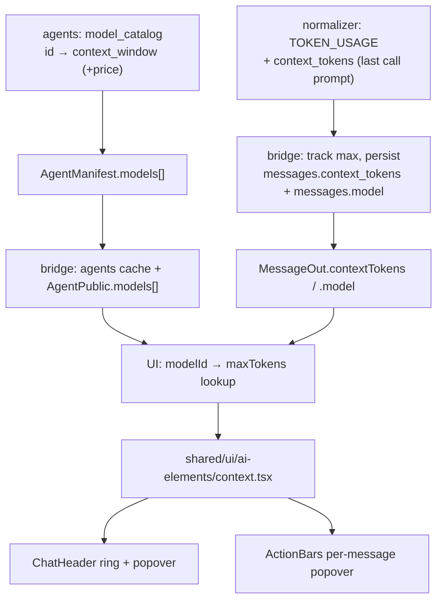

# Context & usage UI

> **Status:** Not started
> **TODO source:** Bugs / Fixes → "Check for context and usage if we can use this one from [shadcn](https://www.shadcn.io/ai/context)."
> **Depends on:** nothing
> **Blocks:** nothing
> **Services touched:** agentic_ui · dialogue_bridge · agents *(no rag_service, no infra)*
> **Related:** [13-charts-and-agui-widgets.md](13-charts-and-agui-widgets.md) *(same vendored-shadcn + AG-UI-event mechanics)* · [14-profile-panel-completion.md](14-profile-panel-completion.md) *(the Usage tab lives in the same settings panel)* · [03-projects-and-workspaces.md](03-projects-and-workspaces.md) *(a workspace tier would re-scope the usage rollup)*

This TODO is a question, not a feature request: *can we use the shadcn.io AI "context" component?* The honest answer is **yes for the visual, no for the data** — and the gap is not small. That component is fundamentally a **context-window meter**: a ring showing `usedTokens / maxTokens`, with a hover breakdown of input / output / reasoning / cached tokens and a dollar cost. We ship three real token surfaces today (a per-message chip, a per-conversation card, a workspace rollup), all of which report **cumulative billed tokens**. We have no context-window size for any model, no model identifier anywhere on the wire the UI can see, and — the subtlest problem — our per-message `input_tokens` is a *sum across every model call and sub-agent in the turn*, which is the wrong numerator for a context gauge and would show 300% occupancy on a long tool-using turn.

So this plan does two things. It records the evaluation and its verdict, so the TODO can be closed with a decision rather than a shrug. And it lays out the minimum path to earn the meter: a model registry that knows each model's context window, a model identifier on the message, and a *context-occupancy* signal distinct from the *billed-total* signal we already have. The component itself is the last and cheapest step.

---

## 1. Goal & non-goals

**Goals.** A decision on the shadcn.io `Context` component, with the reasoning written down. A model registry — the single missing primitive — that maps a model id to its context window (and optionally its per-token price), owned by the agents service and served to the UI through the existing catalog. A model identifier and a context-occupancy token count on the AI message, so the UI can answer "how full is this conversation?" rather than only "how much has it cost so far?". A vendored context meter that respects the repo's semantic-token and reduced-motion rules and lives where it does not contradict a decision we just made deliberately. Progressive disclosure: the ring answers *how full*, the popover answers *of what*.

**Non-goals.** Adding the `tokenlens` dependency (§ 12 explains why we would rather serve our own pricing than bundle a third-party price table that goes stale silently). Re-introducing a composer usage popover — that was **deliberately retired** in the Usage-tab work and this plan does not undo it (§ 2). Per-user spend limits, quotas, or billing enforcement; this is disclosure only. Cost display in phase 1 (pricing is a separate, higher-maintenance data set than window sizes). Live per-token streaming of the meter during a run beyond what the existing `TOKEN_USAGE` event already carries. Multi-currency or tax-aware cost.

---

## 2. Current state

### Three token surfaces already ship, and none of them is a context meter

**Per-message chip.** `ActionBars.tsx:201-218` renders a `TbGauge` icon plus a compact total inside a `Tooltip`, gated at `:168-170` on `showMessageTokenUsage && (typeof message.inputTokens === "number" || typeof message.outputTokens === "number")`. The tooltip body (`:212-215`) prints `Input: … tokens` / `Output: … tokens`. It is behind the `show_message_token_usage` preference (`models.py:116`, default `false`, added by `0006_show_message_token_usage`), toggled in `GeneralTab.tsx:124-130` ("Per-message token usage").

**Per-conversation card.** `ChatPage.tsx:481-483` computes `conversationUsage` with `computeConversationUsage(activeMessages)` — a pure client-side fold in [`shared/lib/utils.ts:304-323`](../../src/agentic_ui/src/shared/lib/utils.ts) over AI messages of the **active branch only**, returning the `ConversationUsage` shape declared at [`shared/lib/types.ts:208-217`](../../src/agentic_ui/src/shared/lib/types.ts) (`totalInput`, `totalOutput`, `totalTokens`, `aiMessageCount`, `avgInput`, `avgOutput`). There is no per-conversation usage endpoint; it is derived from already-hydrated messages, so it renders instantly.

**Workspace rollup.** `GET /v1/usage/{userId}/summary` ([`router/usage.py:19`](../../src/dialogue_bridge/router/usage.py)) → `compute_usage_summary` ([`utils/usage.py:46`](../../src/dialogue_bridge/utils/usage.py)), three aggregate queries (totals + today/7d/30d in one pass at `:69-83`, per-agent capped at `MAX_AGENT_ROWS = 12` at `:85-102`, a 30-day daily series via `date_trunc` at `:104-118`). Response models `UsageWindow` / `UsageAgentBreakdown` / `UsageDailyPoint` / `UsageSummary` at `schemas/__init__.py:370-398`. Rendered by [`UsageTab.tsx`](../../src/agentic_ui/src/features/settings/components/profile_parts/UsageTab.tsx) via `useUsageSummary` (60-line hook, `STALE_AFTER_MS = 60_000`, lazy on tab activation, no polling).

**The composer gauge popover was removed on purpose.** `UsageTab.tsx:19-21` says it outright: the tab carries "the per-conversation stats **that used to live in the composer's gauge popover**." A repo-wide grep for `Gauge` finds it only in `ActionBars.tsx`, `ProfileSidebar.tsx`, and `UsageTab.tsx` — the composer surface is gone. Any placement proposal that puts a token widget back in the composer is re-litigating a settled decision, and § 3 does not.

### The data we persist, and why it is the wrong numerator

Only two usage columns exist on `messages` — [`models.py:233-234`](../../src/dialogue_bridge/core/database/models.py):

```python
input_tokens = Column(Integer, nullable=True)
output_tokens = Column(Integer, nullable=True)
```

The comment immediately above them (`:229-232`) is the crux of this whole plan: *"Per-AI-message token usage, **summed across every model call + sub-agent in the turn** (the true billed consumption — each call re-sends context)."* That is exactly right for billing and exactly wrong for a context ring. A turn with eight tool round-trips re-sends the prompt eight times, so `input_tokens` is roughly eight times the actual context occupancy. Feeding it into `usedTokens / maxTokens` would show a meter pinned past 100% on precisely the long turns where a context warning would matter.

There is **no** `model`, no `cached_tokens`, no `reasoning_tokens`, and no `cost` column. `0004_add_token_usage_to_messages` is explicit that this was collect-only: *"no backfill, no index (read on hydration, never filtered on)."* Wire-out is `MessageOut.inputTokens/outputTokens` (`schemas/__init__.py:483-484`) and `InferenceRunOut` (`:779-780`), transformed client-side at `consts.ts:233-234` and `:313-314`.

### The richer breakdown exists on the wire and is thrown away

The agents service already emits the full detail. `TOKEN_USAGE_EVENT_TYPE = "TOKEN_USAGE"` (`agents/runtime/agui/events.py:12`), and `TokenUsageEvent` (`events.py:80-91`) carries `input_tokens`, `output_tokens`, `total_tokens`, **`input_token_details`**, **`output_token_details`**, and `message_id`. `AGUIEmitter.token_usage` (`emitter.py:314-336`) builds it from the LangChain `usage_metadata`, and `normalizer.py:334-343` emits one per settled AI message, main agent or sub-agent.

The bridge then discards the detail. `InferenceRunRuntime._accumulate_usage` (`utils/inference_runs.py:289-298`) dedupes on `message_id` and adds only `input_tokens` / `output_tokens` into two integer accumulators (`:275-276`); the totals land on the message at `_finish_run` (`:1160-1161`), where a genuine zero is coerced to `NULL`. The event is a plain `CUSTOM` event, so it *does* survive in `raw_events` — the cached/reasoning breakdown is recoverable from the log without any new column, which matters for phase sequencing.

The frontend parses it and then explicitly ignores it. `TokenUsagePayloadSchema` (`features/inference/agui.ts:115-122`) validates all five fields, and the reducer is a documented no-op:

```ts
if (name === TOKEN_USAGE_EVENT_TYPE) {
  // Collect-only: per-message token usage is persisted on the message DTO
  // (MessageOut.inputTokens/outputTokens). The live timeline neither folds
  // nor renders it yet — explicit no-op so it isn't an unhandled event.
  return;
}
```

(`timeline.ts:698-703`.) So token numbers reach the UI only *after* persistence, never live.

### Nothing in this repo knows a context window — and the UI does not know the model

A repo-wide search for `context_window` / `max_context` finds hits only inside bundled skill documentation. There is no model registry module, no `MODEL_*` constant table, no column, no Pydantic field, no TS type.

The one place a window is read is indirect, and it lives in the agents service. [`runtime/middlewares/summarization.py:56-66`](../../src/agents/runtime/middlewares/summarization.py) resolves the model and then inspects the provider's own profile:

```python
profile = getattr(resolved, "profile", None)
has_window = isinstance(profile, dict) and isinstance(profile.get("max_input_tokens"), int)
```

falling back to a fixed `SUMMARIZATION_TRIGGER_TOKENS` (`agents/core/settings.py:539`, default `200000`) when the profile is silent. `SummarizationSettings` (`settings.py:525-540`) trims at `trigger_fraction = 0.92`. **`resolved.profile["max_input_tokens"]` is the window number we need, and it is already available in-process on the agents side.** It is simply never surfaced.

Model ids exist only as configuration: `agents_seed/omni-yaml-v1/agent.yaml:14-18` (`main: openai:gpt-5`, `researcher`/`writer`: `openai:gpt-4o`) plus per-agent defaults across `agents/core/settings.py:288-291`, `:357-364`, `:372-378`, `:389-393`, `:411-413`. They never leave the service: `AgentManifest` (`agents/schemas.py:155-162`) is `id, slug, name, version, type, description, icon`; `AgentTable` (`models.py:40-62`) mirrors it; `AgentPublic` (`schemas/__init__.py:86-95`) adds nothing. `MessageOut` carries `agentId`/`agentName` and no model. **The frontend has zero knowledge of which model produced a message and zero knowledge of any window size.**

### How a new shadcn component gets added here

`components.json` aliases `ui` → `@/shared/ui` and `utils` → `@/shared/lib/utils`, so `npx shadcn@latest add …` lands files directly in `src/agentic_ui/src/shared/ui/`. Three vendored families already live there: `ai-elements/` (9 files — `chain-of-thought`, `code-block`, `confirmation`, `persona`, `response`, `suggestion`, `task`, `tool`, `voice-selector`), `shadcn-io/` (`branch`, `loader`, `shimmering-text`), and `react_bits/`. The convention is visible in [`shadcn-io/shimmering-text.tsx`](../../src/agentic_ui/src/shared/ui/shadcn-io/shimmering-text.tsx): files land essentially verbatim from the registry (`'use client'` retained at `:1` despite `rsc: false`), with only the `cn` import rewritten to the alias (`:6`).

Two facts matter for cost. **No `context`- or `token`-named component is vendored today** — the upstream meter is not present. And the registry ships `motion/react` imports (`shimmering-text.tsx:4`), so `motion@^12.23.24` is already a dependency alongside `framer-motion@^12.23.12`; a vendored `Context` will not pull a new animation library. `tokenlens` is **not** installed.

### What the component actually is

Upstream (`shadcn.io/ai/context`, mirroring ai-elements `Context`) is a compound component: root `Context` with props **`maxTokens`**, **`usedTokens`**, **`usage`** (a `LanguageModelUsage` object), **`modelId`**; children `ContextTrigger`, `ContextContent`, `ContextContentHeader`, `ContextContentBody`, `ContextContentFooter`, and the four breakdown rows `ContextInputUsage`, `ContextOutputUsage`, `ContextReasoningUsage`, `ContextCacheUsage`. Cost comes from `tokenlens`. Every one of the four root props is something we do not currently have in the browser: two need a model registry, one needs a per-turn occupancy number, one needs the token details we drop on the floor.

---

## 3. Target design

**Verdict: adopt the visual, but the component is the last 10% of the work.** Three primitives have to land first, in this order.



**1 — A model registry, owned by the agents service.** A new `runtime/models/catalog.py` exposes, per configured model id, the `context_window` (from `resolve_model(id).profile["max_input_tokens"]`, the same source `summarization.py:59` already trusts) and a static fallback for models whose profile is silent. It is served on `AgentManifest` as a `models: list[ModelInfo]` (main + sub-agents, deduped), flows through `sync_agents_with_service` into `AgentTable`, and out on `AgentPublic`. This is the *only* new cross-service contract in the plan, and it is additive.

**2 — A context-occupancy signal, distinct from the billed total.** `TokenUsageEvent` grows a `context_tokens` field: the `input_tokens` of *that single* model call. `InferenceRunRuntime` keeps its existing summing accumulators untouched (billing semantics must not change) and adds `self.context_tokens = max(self.context_tokens, call_context_tokens)` — the high-water prompt size of the turn, which is the honest answer to "how full was the window at the widest point". It persists to a new nullable `messages.context_tokens`, alongside a nullable `messages.model` recording which model produced the message.

**3 — Placement, respecting the retired popover.** The ring goes in the **conversation header** ([`ChatHeader.tsx`](../../src/agentic_ui/src/features/chat/components/ChatHeader.tsx)), next to the existing action buttons — a conversation-scoped indicator belongs with conversation-scoped controls, and the header is a persistent surface that does not fight the composer. The per-message `ActionBars.tsx:201-218` chip is *upgraded in place*: the same `TbGauge` trigger, but its `Tooltip` becomes a `ContextContent` popover showing the four breakdown rows instead of two hand-written lines. The Usage tab is unchanged — it owns the workspace rollup and keeps doing so. All three stay behind `showMessageTokenUsage` for the per-message surface; the header ring gets its own visibility rule (§ 12 open decision).

The component is vendored to `shared/ui/ai-elements/context.tsx`, joining the nine ai-elements already there, and adapted on two points: raw hex or upstream-palette colors are replaced with semantic tokens (`--primary`, `--warning`, `--destructive` for the three occupancy bands), and any ring animation is gated on `useReducedMotion()` the way `UsageTab.tsx:2` already does.

---

## 4. Data model & migrations

Two nullable columns on `messages`, in one migration. Nullable and un-indexed for the same reason `0004` gave: read on hydration, never filtered on.

| Table | Column | Type | Null | Default | Purpose |
| --- | --- | --- | --- | --- | --- |
| `messages` | `model` | `String` | yes | — | Model id that produced this AI message (e.g. `openai:gpt-5`). NULL on user messages and all historical rows. |
| `messages` | `context_tokens` | `Integer` | yes | — | High-water prompt size across the turn's model calls — the context-ring numerator. Deliberately **not** the same number as `input_tokens`. |

**Alembic slot:** `0017_message_model_and_context_tokens`, `down_revision = "0016_retire_enabled_tools"`. Style reference: `0015_personalization_prefs.py` for the docstring shape (header, `Revision ID:`, `Revises:`, per-column bullets, a closing `Non-destructive:` verdict), `0013_attachment_origin.py:47-48` for plain nullable `add_column` calls.

> **Revision-number collision.** [17-voice-language-dynamic.md](17-voice-language-dynamic.md) also claims `0017`. Both plans are independent and either may land first; whichever merges second renumbers and re-points its `down_revision`. If both land in parallel branches, resolve with `alembic merge` per the CLAUDE.md workflow — do not edit the merged migration.

No backfill. A message with `context_tokens IS NULL` renders no ring; that is the correct display for every message written before this change, and inventing a number from `input_tokens` would be a lie.

---

## 5. API surface

No new endpoint. Three additive fields on existing contracts.

| Contract | Change | File |
| --- | --- | --- |
| `AgentManifest` (agents) | `models: list[ModelInfo] = []`, where `ModelInfo = {id: str, role: Literal["main","subagent"], contextWindow: int \| None}` | [`agents/schemas.py:155-162`](../../src/agents/schemas.py) |
| `AgentPublic` (bridge → UI) | same `models` list, mirrored from the cached manifest | [`schemas/__init__.py:86-95`](../../src/dialogue_bridge/schemas/__init__.py) |
| `MessageOut` | `model: Optional[str]`, `contextTokens: Optional[int]` (with `validation_alias="context_tokens"`, matching `:483-484`) | `schemas/__init__.py:467-495` |
| `TokenUsageEvent` (AG-UI) | `context_tokens: Optional[int]` | [`agents/runtime/agui/events.py:80-91`](../../src/agents/runtime/agui/events.py) |

`GET /v1/catalog/agents` ([`router/catalog.py:24`](../../src/dialogue_bridge/router/catalog.py)) gains the nested list with no route or auth change; it keeps its cache-first behaviour, which means **an agent's model list refreshes on the same schedule as everything else in `_AGENT_CACHE` — process restart** (the constraint recorded in CLAUDE.md § Architecture Constraints). `GET /v1/usage/{userId}/summary` is unchanged in phase 1–3.

Rate limits and auth are unchanged: catalog and usage both sit under the global per-identity budget with `validate_userId`, and no state-mutating endpoint is added, so no new CSRF surface.

---

## 6. Frontend surface

| Concern | Where | Note |
| --- | --- | --- |
| Vendored component | `shared/ui/ai-elements/context.tsx` | `npx shadcn@latest add` lands here via the `components.json` `ui` alias; joins the 9 existing ai-elements |
| Types | `shared/lib/types.ts` | extend `MessageOut` (`:337-356`) with `model?: string; contextTokens?: number;`; extend the `Agent` type with `models?: ModelInfo[]`; keep `ConversationUsage` (`:208-217`) as-is |
| Field whitelist | `shared/lib/consts.ts:220-240` | **`transformMessage` copies only named keys** — a new `MessageOut` field is silently dropped unless added at `:233-234` alongside the token fields. Same for the agent transform. |
| Window lookup | `shared/lib/utils.ts` | `contextWindowFor(agent, modelId)` → `number \| null`; returns null when unknown, and a null window means *no ring*, not a guessed one |
| Header ring | `features/chat/components/ChatHeader.tsx` | `Context` + `ContextTrigger` + `ContextContent`, fed from the newest AI message on the active branch |
| Per-message popover | `features/chat/components/message_parts/ActionBars.tsx:201-218` | replace the two-line `Tooltip` body with `ContextContentBody` rows; keep the `TbGauge` trigger and `aria-label="Token usage for this message"` (`:204`) |
| Usage tab | `features/settings/components/profile_parts/UsageTab.tsx` | unchanged in phases 0–3; § 12 notes the optional cost row |

Rules this must not break: semantic tokens only (the occupancy bands map to `--primary` / `--warning` / `--destructive`, no hex); `useReducedMotion()` around any ring transition; `aria-label` on the icon-only trigger; the popover reachable and dismissible by keyboard; 44×44px touch target on mobile, where the header is tight and the ring may need to collapse to the overflow menu.

---

## 7. Cross-cutting impact

**agents.** A new `runtime/models/` module and a manifest field. The window number comes from the same `resolve_model(...).profile` that `summarization.py:56-66` already reads, so there is no second source of truth to drift — but that also means **a provider that stops publishing `max_input_tokens` degrades both the summarization trigger and the ring at once**, which is a useful coupling to know about rather than one to break.

**dialogue_bridge.** `sync_agents_with_service` and `AgentTable` carry the model list; `InferenceRunRuntime` gains one accumulator and two persisted fields. Billing semantics of `input_tokens`/`output_tokens` are **frozen** — `compute_usage_summary` (`utils/usage.py:31-32`) keeps coalescing exactly those two columns, so the Usage tab's numbers do not move.

**agentic_ui.** One vendored component, one lookup helper, two edited render sites, one whitelist edit.

**AG-UI protocol.** One new optional field on an existing event. No new event type, no new reducer branch required in phase 1–2 — but phase 3's live ring *does* replace the `timeline.ts:698-703` no-op with a real fold, which makes this the first live consumer of `TOKEN_USAGE` and puts it squarely under the agui-protocol doc's ownership.

**Plan interactions.** [13-charts-and-agui-widgets.md](13-charts-and-agui-widgets.md) shares the vendoring and reduced-motion mechanics and, more usefully, shares the finding that a `CUSTOM` event persists in `raw_events` with no bridge code. [03-projects-and-workspaces.md](03-projects-and-workspaces.md) would re-scope the workspace rollup to per-workspace, which is a `compute_usage_summary` join change and does not touch anything here. [02-org-and-user-permissions.md](02-org-and-user-permissions.md) is where org-level spend visibility would live, and it must not be able to read another user's numbers via this route — see § 9.

---

## 8. Phased execution

### Phase 0 — Evaluate and vendor (frontend only, no backend change)

Run `npx shadcn@latest add` for the context component into `shared/ui/ai-elements/`, read the vendored source, and answer three questions that this plan cannot answer from documentation alone: does the root render at all with `maxTokens` omitted or null; does `tokenlens` arrive as a hard import (which would make cost non-optional); and are the breakdown rows usable independently of the ring. Strip `tokenlens` if present and stub cost as unavailable. Convert colors to semantic tokens, gate motion.

**Acceptance:** the component renders in isolation on both light and dark themes; a written note records its degradation behaviour without `maxTokens`; `package.json` has no new dependency; `tsc` clean.

### Phase 1 — Model registry, end to end

`runtime/models/catalog.py` in agents; `ModelInfo` on `AgentManifest`; mirrored through the bridge agent cache to `AgentPublic`; `contextWindowFor()` in `shared/lib/utils.ts`. No UI change yet.

**Acceptance:** `GET /v1/catalog/agents` returns a non-empty `models` array for the seeded agent, with a real integer `contextWindow` for `openai:gpt-5` and `openai:gpt-4o`; a model whose profile lacks `max_input_tokens` returns `null` and does not raise; `contextWindowFor()` returns null for an unknown id.

### Phase 2 — Context-occupancy signal

`context_tokens` on `TokenUsageEvent`; high-water accumulator in `InferenceRunRuntime`; migration `0017`; `model` + `contextTokens` on `MessageOut` and through `transformMessage`.

**Acceptance:** after a multi-tool-call turn, `messages.context_tokens` is materially **less than** `messages.input_tokens` for the same row (proving the two numbers are distinct and the accumulator is not summing); a single-call turn has them approximately equal; the Usage tab's totals are byte-identical to a pre-change snapshot; historical rows are NULL and hydrate without error.

### Phase 3 — The meter, in the header and the message

Header ring fed by the newest AI message; per-message popover upgrade; the `timeline.ts:698-703` no-op replaced by a fold that updates the ring live during a run.

**Acceptance:** the ring reflects occupancy after a turn and updates mid-run; a message with NULL `context_tokens` or an unknown window renders no ring and no broken layout; occupancy above the summarization trigger shows the warning band; keyboard-only open/close works; reduced-motion honoured; usable at 375px width.

### Phase 4 — Cost (optional, gated on § 12)

Only if the pricing decision resolves in favour of shipping it: per-model price on `ModelInfo`, a cost row in `ContextContentFooter`, and a cost column in the Usage tab.

**Acceptance:** cost is absent (not zero, not "$0.00") for any model without a configured price.

---

## 9. Security & privacy

Token counts are metadata, not content — but they are *inference* metadata, and the disclosure rules follow from that.

**Authorization is per-user and already correct; keep it that way.** `compute_usage_summary` scopes every query through the `conversations` join on `user_id` (`utils/usage.py:67`), and `router/usage.py:22` depends on `validate_userId`. The new fields ride `MessageOut`, which is only ever produced for a conversation the caller owns. **No new endpoint means no new authorization surface** — that is a deliberate design property of this plan, not an accident, and the phase-4 cost work must not break it by adding an unscoped pricing or spend route.

**Window sizes and prices are configuration, never agent-supplied.** `contextWindow` originates from the provider profile inside the agents process; a price, if it ships, comes from `core/settings.py`. Nothing on this path accepts a number from a model, a tool result, or a request body — which is what keeps the ring out of the CSS/render injection class of problem that [13](13-charts-and-agui-widgets.md) § 9 has to handle for agent-supplied colors.

**Logging stays counts-only.** `router/usage.py:30-37` already logs shape, not content. The new `model` field is safe to log; `context_tokens` is a count. Nothing here logs prompt text, and `input_token_details` must not be logged verbatim if a provider ever nests identifying data in it.

**Fail-closed display.** Unknown window → no ring. NULL `context_tokens` → no ring. Missing price → no cost. The failure mode of a usage meter is a *confidently wrong number*, and an absent indicator is strictly better than a fabricated one.

---

## 10. Testing strategy

**Bridge (pytest, in-image per the host-version constraint).** A unit test that the high-water accumulator does not sum: feed three `TOKEN_USAGE` events with `context_tokens` of 4000 / 9000 / 6000 and assert the persisted value is 9000 while `input_tokens` is the sum of the three `input_tokens`. A regression test pinning `compute_usage_summary` output across the migration. A hydration test that a message row with NULL `model`/`context_tokens` serialises to `MessageOut` with both absent.

**Agents.** A test that the catalog returns `None` rather than raising for a model whose resolved profile has no `max_input_tokens`, and that `AgentManifest.models` dedupes a sub-agent that shares the main model. (Note the recorded constraint that `tests/agents/` requires deepagents 0.6.10 and fails at import on the host — validate via `py_compile` plus a Docker run.)

**Frontend (`tsc` in-image).** `contextWindowFor()` unit cases: known id, unknown id, agent with no `models`. A `transformMessage` test asserting the two new keys survive the whitelist — this is the exact class of silent-drop bug the whitelist creates. A render test that `Context` with `maxTokens={null}` produces no ring and no thrown error.

**Manual, in the Docker stack at :8050.** A long tool-using turn to confirm the ring stays under 100% while the per-message chip shows a much larger billed total; a turn crossing the 0.92 summarization trigger to confirm the ring plateaus rather than overflowing; dark mode; 375px; keyboard-only.

---

## 11. Docs to update

There is **no doc today that owns token usage display** — the CLAUDE.md documentation table has no row for it, and the material is scattered across `user-preferences.md` (the `showMessageTokenUsage` toggle), `agui-protocol.md` (the `TOKEN_USAGE` event), and `database-schema.md` (the two columns). This plan should create one and register it.

| Doc | Change |
| --- | --- |
| **new** `docs/flows/token-usage-and-context.md` | The owning doc: the three surfaces, billed-total vs context-occupancy (the distinction is the whole point), the registry, fail-closed display. Follow `docs/_template.md`. |
| `CLAUDE.md` § Documentation Update Rule + § Documentation Structure | add the row and the tree entry for the new doc |
| [`docs/architecture/database-schema.md`](../architecture/database-schema.md) | `messages.model`, `messages.context_tokens` in the ER diagram and the column table |
| [`docs/development/agui-protocol.md`](../development/agui-protocol.md) | `TokenUsageEvent.context_tokens`; the `timeline.ts` no-op becomes a real fold in phase 3 |
| [`docs/flows/catalog.md`](../flows/catalog.md) | `AgentManifest.models` / `AgentPublic.models`, and that it refreshes only on bridge restart |
| [`docs/flows/inference-streaming.md`](../flows/inference-streaming.md) | the new accumulator and what `_finish_run` persists |
| [`docs/flows/user-preferences.md`](../flows/user-preferences.md) | what `showMessageTokenUsage` now reveals (a breakdown popover, not two lines) |
| [`docs/development/agent-development.md`](../development/agent-development.md) | the model catalog module and where a model's window comes from |
| `docs/plans/README.md` | flip status when phases land |

---

## 12. Risks & open decisions

**The verdict, stated plainly.** *Adopt the visual — but we must first know each model's context window, and we must stop pretending `input_tokens` is context occupancy.* The component is genuinely good and genuinely cheap to vendor (phase 0 is an afternoon). What it demands is a model registry and a model identifier on the message, neither of which exists, plus a numerator we do not currently compute. If phases 1–2 are not worth doing, then the answer to the TODO is **no** and the right move is to keep the existing three surfaces and close the item — a ring with a guessed denominator is worse than the honest chip we already ship.

**Risk — `input_tokens` misread as occupancy.** The single most likely way this ships wrong: someone wires `usedTokens={message.inputTokens}` because the field is already there. It compiles, it renders, and it is wrong by a factor of the turn's tool-call count. The phase-2 acceptance criterion (`context_tokens` materially less than `input_tokens` on a multi-call turn) exists specifically to catch it, and the two columns should carry comments saying so.

**Risk — the ring plateaus and looks broken.** `summarization.py` compacts at `trigger_fraction = 0.92`, so occupancy should never approach 100% on a healthy run. A meter that always reads 60–90% and never fills teaches the user nothing. Mitigation: band the ring against the *trigger*, not the raw window — "approaching compaction" is the actionable state, and the footer can say so — but that requires the UI to know `trigger_fraction`, which is currently an agents-side env var. **Open decision:** expose the trigger fraction on `ModelInfo`, or hardcode the band thresholds in the UI and accept drift.

**Open decision — `tokenlens`, and cost at all.** Upstream uses `tokenlens` for cost. Adding it means a bundled price table that goes stale silently, in a UI where a wrong dollar figure is worse than no figure. The alternative is per-model prices in `agents/core/settings.py`, served on `ModelInfo` — more work, auditable, absent by default. Recommendation: **no `tokenlens`, no cost in phases 0–3**, revisit in phase 4. This is also why phase 0 must check whether the dependency is a hard import.

**Open decision — header ring visibility.** Always on, behind `showMessageTokenUsage`, or behind a new preference? Always-on adds chrome for users who do not care; reusing `showMessageTokenUsage` conflates "show me per-message numbers" with "show me a context warning", and the second is arguably safety information the user should get regardless. Recommendation: always visible **once occupancy passes the warning band**, and behind `showMessageTokenUsage` below it.

**Open decision — placement, given the retired popover.** § 3 picks the conversation header, because the composer popover was removed on purpose (`UsageTab.tsx:19-21`). The header is tight on mobile, so the ring may have to collapse into the overflow menu at small widths, which weakens it exactly where context limits bite hardest. The alternative — the run timeline's footer, near where the plan card already docks — keeps it out of persistent chrome but makes it invisible between runs. Needs a call before phase 3.

**Risk — provider profile silence.** `max_input_tokens` comes from the provider integration, not from us. A version bump that drops it turns every ring off *and* silently flips `summarization.py:59` onto the fixed-token fallback. Mitigation: log once at agents startup when a configured model resolves without a window, so the degradation is visible rather than mysterious.

**Risk — the field whitelist.** `transformMessage` (`consts.ts:220-240`) copies named keys only. Two new `MessageOut` fields that are not added there arrive at the browser and vanish, with no type error anywhere. Covered by a test in § 10 because this has bitten the repo before.

---

## 13. File map

| Concept | File | What to look for |
| --- | --- | --- |
| The component (to vendor) | `src/agentic_ui/src/shared/ui/ai-elements/context.tsx` | *does not exist yet*; `Context`, `ContextTrigger`, `ContextContent*`, `Context{Input,Output,Reasoning,Cache}Usage` |
| Vendoring convention | [src/agentic_ui/src/shared/ui/shadcn-io/shimmering-text.tsx](../../src/agentic_ui/src/shared/ui/shadcn-io/shimmering-text.tsx) | `'use client'` at `:1`, `cn` alias import at `:6` |
| shadcn aliases | [src/agentic_ui/components.json](../../src/agentic_ui/components.json) | `ui` → `@/shared/ui`, `utils` → `@/shared/lib/utils` |
| Per-message chip | [src/agentic_ui/src/features/chat/components/message_parts/ActionBars.tsx](../../src/agentic_ui/src/features/chat/components/message_parts/ActionBars.tsx) | `usageVisible` gate `:168-170`, chip `:201-218` |
| Conversation aggregate | [src/agentic_ui/src/shared/lib/utils.ts](../../src/agentic_ui/src/shared/lib/utils.ts) | `computeConversationUsage` `:304-323`, `formatCompactTokens` `:296-299` |
| Aggregate type | [src/agentic_ui/src/shared/lib/types.ts](../../src/agentic_ui/src/shared/lib/types.ts) | `ConversationUsage` `:208-217`, `MessageOut` `:337-356` |
| Field whitelist | [src/agentic_ui/src/shared/lib/consts.ts](../../src/agentic_ui/src/shared/lib/consts.ts) | `transformMessage` `:220-240`, token keys `:233-234` |
| Usage tab | [src/agentic_ui/src/features/settings/components/profile_parts/UsageTab.tsx](../../src/agentic_ui/src/features/settings/components/profile_parts/UsageTab.tsx) | docstring `:17-23` (the retired composer popover), `chartConfig` `:35-38` |
| Usage hook | [src/agentic_ui/src/features/settings/hooks/useUsageSummary.ts](../../src/agentic_ui/src/features/settings/hooks/useUsageSummary.ts) | `STALE_AFTER_MS` `:9`, lazy activation `:55-57` |
| Header (ring home) | [src/agentic_ui/src/features/chat/components/ChatHeader.tsx](../../src/agentic_ui/src/features/chat/components/ChatHeader.tsx) | action-button cluster near `:220-264` |
| Client event schema | [src/agentic_ui/src/features/inference/agui.ts](../../src/agentic_ui/src/features/inference/agui.ts) | `TokenUsagePayloadSchema` `:115-122` |
| Reducer no-op to replace | [src/agentic_ui/src/features/inference/timeline.ts](../../src/agentic_ui/src/features/inference/timeline.ts) | `:698-703` |
| Usage endpoint | [src/dialogue_bridge/router/usage.py](../../src/dialogue_bridge/router/usage.py) | `:19-37` |
| Usage aggregation | [src/dialogue_bridge/utils/usage.py](../../src/dialogue_bridge/utils/usage.py) | `_IN`/`_OUT` `:31-32`, `compute_usage_summary` `:46`, scope `:67` |
| Usage/agent schemas | [`src/dialogue_bridge/schemas/__init__.py`](../../src/dialogue_bridge/schemas/__init__.py) | `AgentPublic` `:86-95`, `UsageSummary` `:388-398`, `MessageOut` tokens `:483-484` |
| Token columns | [src/dialogue_bridge/core/database/models.py](../../src/dialogue_bridge/core/database/models.py) | comment `:229-232`, columns `:233-234`, pref `:116` |
| Accumulator + persist | [src/dialogue_bridge/utils/inference_runs.py](../../src/dialogue_bridge/utils/inference_runs.py) | `_accumulate_usage` `:289-298`, dispatch `:422-427`, persist `:1160-1161` |
| Catalog route | [src/dialogue_bridge/router/catalog.py](../../src/dialogue_bridge/router/catalog.py) | `:24-36` |
| Event model | [src/agents/runtime/agui/events.py](../../src/agents/runtime/agui/events.py) | `TOKEN_USAGE_EVENT_TYPE` `:12`, `TokenUsageEvent` `:80-91` |
| Emitter | [src/agents/runtime/agui/emitter.py](../../src/agents/runtime/agui/emitter.py) | `token_usage` `:314-336` |
| Emission site | [src/agents/runtime/agui/normalizer.py](../../src/agents/runtime/agui/normalizer.py) | `:329-343` |
| Window source | [src/agents/runtime/middlewares/summarization.py](../../src/agents/runtime/middlewares/summarization.py) | `profile["max_input_tokens"]` `:56-66` |
| Summarization thresholds | [src/agents/core/settings.py](../../src/agents/core/settings.py) | `SummarizationSettings` `:525-540` |
| Manifest | [src/agents/schemas.py](../../src/agents/schemas.py) | `AgentManifest` `:155-162` |
| Model ids | [src/agents/agents_seed/omni-yaml-v1/agent.yaml](../../src/agents/agents_seed/omni-yaml-v1/agent.yaml) | `model:` `:14-18` |
| Migration slot | `src/dialogue_bridge/migrations/versions/0017_message_model_and_context_tokens.py` | *new*; `down_revision = "0016_retire_enabled_tools"` |
