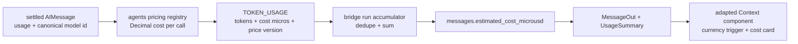

# Cost estimation UI — Context component, cost-only

> **Status:** Not started
> **TODO source:** New Features → "Use the shadcn / AI Elements Context component to present estimated inference cost only."
> **Depends on:** nothing
> **Blocks:** nothing
> **Services touched:** agents · dialogue_bridge · agentic_ui *(no rag_service, no infra)*
> **Related:** [01-custom-agents-per-user.md](done/01-custom-agents-per-user.md) *(model allowlist and pricing share a canonical model-id problem)* · [14-profile-panel-completion.md](14-profile-panel-completion.md) *(the Usage tab lives in the same settings panel)*

Plan 16 no longer proposes a context-window meter. It will use the visual language and compound hover-card structure of the shadcn / AI Elements [`Context`](https://elements.ai-sdk.dev/components/context) component for **estimated monetary cost only**. There is no percentage ring, `usedTokens`, `maxTokens`, context-occupancy field, or context-window registry in this scope.

The existing token counts are the correct basis for billing estimates: each assistant message stores the sum of every model call and sub-agent call made during the turn. They cannot, however, be multiplied by one price after aggregation because a turn can mix differently priced models. Cost must therefore be estimated per settled model call in the agents service, summed by the bridge, persisted on the assistant message, and rendered by an adapted Context component. The UI displays a server-computed estimate; it does not own pricing.

---

## 1. Goal & non-goals

**Goal.** Show a clear, attractive estimated USD cost for each assistant turn, the open conversation, time windows, and the workspace total. Reuse the upstream Context component's trigger, hover card, layout, formatting conventions, and accessibility patterns while replacing its context-percentage trigger with a currency trigger. Keep estimates explainable by retaining the existing input/output token counts beside the estimated total.

**Non-goals.** Context-window occupancy, a circular percentage ring, context-limit warnings, model context windows, quotas, budget enforcement, provider invoice reconciliation, multi-currency support, or exact accounting. This feature is an estimate and must always be labelled as such. It does not use `tokenlens` client-side and does not infer a model price from an aggregated message.

---

## 2. Current state

The agents service emits one `TOKEN_USAGE` custom event for every settled `AIMessage`, including sub-agent messages. [`TokenUsageEvent`](../../src/agents/runtime/agui/events.py) carries input, output, total, cached-input details, reasoning details, and `message_id`; [`normalizer.py`](../../src/agents/runtime/agui/normalizer.py) reads those values from `AIMessage.usage_metadata`.

The bridge's [`InferenceRunRuntime._accumulate_usage`](../../src/dialogue_bridge/utils/inference_runs.py) deduplicates events by `message_id` and sums input/output tokens for the complete turn. [`MessageTable`](../../src/dialogue_bridge/core/database/models.py) persists those totals in `input_tokens` and `output_tokens`. This deliberately includes every main-agent and sub-agent model call and is therefore suitable for cost accounting.

The browser receives only the two token totals. [`ActionBars.tsx`](../../src/agentic_ui/src/features/chat/components/message_parts/ActionBars.tsx) shows a small gauge and an input/output tooltip. [`UsageTab.tsx`](../../src/agentic_ui/src/features/settings/components/profile_parts/UsageTab.tsx) shows conversation and workspace token totals plus the 30-day token chart. A repository search finds no monetary-cost field, price registry, currency formatter, `tokenlens`, Context component, or hover-card primitive.

The upstream Context component can calculate cost from `usage` and `modelId` through `tokenlens`, but that path assumes one model per component instance. mAgenticX persists a multi-call, potentially multi-model turn total, so applying one browser-side model price would be wrong.

---

## 3. Target design

**Pricing authority.** A small agents-side registry maps canonical `provider:model` ids and aliases to effective-dated input, cached-input, and output USD rates per million tokens. It uses `Decimal` arithmetic and returns integer micro-USD. The configured model id should be attached to model-call metadata; provider response metadata is a guarded fallback, not the primary identity source.

**Per-call estimation.** The normalizer calculates each call before aggregation. Cached input is charged at its cached rate when the provider reports it; uncached input is `max(input - cached, 0)`. Output tokens are charged once at the output rate—reasoning tokens already included in output must not be double-counted. Unknown model or incomplete pricing produces no estimate for that call.

**Fail-closed aggregation.** The bridge sums estimates only when every counted usage event with non-zero tokens has a valid estimate. If any call is unpriced, the assistant message's estimate is `NULL`; the UI shows “Estimate unavailable” rather than presenting a misleading partial total.

**Cost-only component adaptation.** Vendor the upstream component into `shared/ui/ai-elements/context.tsx`, then narrow its local API. Use its HoverCard provider, custom trigger support, content sections, semantic styling, compact formatting, and keyboard behaviour. Supply a custom trigger containing the formatted cost, omit `ContextContentHeader`'s progress visualization, and render a footer labelled “Estimated cost”. Accept the precomputed server value; remove `tokenlens` and all `usedTokens / maxTokens` calculations.

---

## 4. Data model & migrations

Add two nullable, unindexed columns to `messages`:

| Column | Type | Purpose |
| --- | --- | --- |
| `estimated_cost_microusd` | `BigInteger` | Complete turn estimate in millionths of one USD; `NULL` means unavailable or incomplete. |
| `cost_pricing_version` | `String` | Effective-date/version identifier of the server price table used for the estimate. |

Integer micro-USD avoids binary floating-point drift and safely supports aggregation. Historical rows remain `NULL`; no backfill guesses old model identities. The migration takes the next free revision after current head `0020_skill_pool_tombstone` (expected `0021_message_estimated_cost`). Downgrade drops only the two new columns.

---

## 5. API surface

No new endpoint is required.

| Contract | Additive fields |
| --- | --- |
| `TokenUsageEvent` | `model_id?: str`, `estimated_cost_microusd?: int`, `pricing_version?: str` |
| `MessageOut` | `estimatedCostMicrousd?: int`, `costPricingVersion?: str` |
| `InferenceRunOut` | the same two persisted cost fields if run polling exposes message usage |
| `UsageWindow` and descendants | `knownEstimatedCostMicrousd: int`, `pricedMessages: int` |
| `UsageSummary` | known-cost and coverage values ride the existing totals, recency windows, per-agent rows, and daily points |

The existing `GET /v1/usage/{userId}/summary` route remains user-scoped and gains only additive response fields. No price table is exposed to the client.

---

## 6. Frontend surface

| Surface | Change |
| --- | --- |
| `shared/ui/ai-elements/context.tsx` | vendor and adapt the component for a precomputed cost, custom currency trigger, and ring-free content |
| `shared/ui/hover-card.tsx` | add the shadcn primitive required by the component; add `@radix-ui/react-hover-card` |
| `shared/lib/types/messages.ts` | add message cost/version fields |
| `shared/lib/types/preferences.ts` and usage schemas | add known-cost and priced-message coverage fields |
| `shared/lib/consts/transforms/message.ts` | preserve the new message fields through the explicit whitelist |
| `shared/lib/utils.ts` | add `formatEstimatedUsd(microusd)` with extra precision for sub-cent values |
| `ActionBars.tsx` | show a compact `$…` trigger; hover/focus reveals “Estimated cost”, input/output tokens, and pricing-version disclosure |
| `UsageTab.tsx` | add “Known estimated cost” metrics plus priced-response coverage for the open conversation, all time, and time windows; keep the token chart unchanged |

Formatting rules: values at or above one cent show two decimals; smaller non-zero values show enough precision to remain meaningful; zero is `$0.00`; `NULL` is “Unavailable”, never `$0.00`. Every surface says “Estimated”, uses tabular numerals, works by keyboard and touch, and uses existing semantic theme tokens.

---

## 7. Cross-cutting impact

**agents.** Own canonical model ids, price data, token-detail normalization, and per-call calculation. This is the only service allowed to turn tokens into money.

**dialogue_bridge.** Preserve existing token semantics, sum already-calculated micro-USD values, persist the result, and aggregate it through the existing usage queries. It must track whether the total is complete rather than treating missing event cost as zero.

**agentic_ui.** Presentation only: format server values and adapt the Context visuals. The client must not import a live pricing catalogue or recalculate historical estimates.

**Other plans.** Plan 01's future model allowlist should reuse the same canonical model ids. Projects/workspaces may later re-scope usage aggregation, but do not change per-message estimates. No context-window registry is introduced.

---

## 8. Phased execution

### Phase 0 — Vendor the visual safely

Install the upstream Context source and HoverCard primitive in a temporary branch, inspect the generated dependency set, then retain only the cost-card composition. Remove `tokenlens`, percentage math, ring markup, and context-window props. Build a fixture-backed Story/test using a precomputed micro-USD value.

**Acceptance:** light/dark, keyboard, touch, and narrow-screen rendering work; no context percentage appears; `package.json` gains only the HoverCard dependency; typecheck passes.

### Phase 1 — Per-call pricing in agents

Add the versioned pricing registry and canonical model id to token-usage emission. Calculate micro-USD per call with cached-input handling and output/reasoning non-double-counting.

**Acceptance:** table-driven tests cover normal input/output, cached input, reasoning output, aliases, unknown models, missing details, and Decimal rounding. An unknown model emits tokens but no cost.

### Phase 2 — Persist and aggregate

Add the migration, bridge accumulator completeness flag, message DTO fields, and cost fields on usage summaries.

**Acceptance:** a mixed main/sub-agent run equals the sum of its independently priced events; one unknown event makes the total unavailable; duplicate events do not double-charge; historical rows hydrate normally; all usage queries remain user-scoped.

### Phase 3 — Cost surfaces

Replace the message token tooltip with the adapted cost popover and add estimated-cost values to the Usage tab. Retain token counts as explanatory secondary data and leave the daily token chart unchanged.

**Acceptance:** per-message, conversation, all-time, per-agent, and window known-cost totals agree; aggregate coverage is visible; sub-cent formatting is readable; unavailable estimates are explicit; reduced-motion and accessibility checks pass at desktop and 375px.

---

## 9. Security & privacy

Costs are inference metadata and inherit existing conversation ownership and `validate_userId` checks. No new endpoint or mutation is added. The pricing registry contains public configuration, not secrets. Logs may include model id, price version, and integer cost but never prompt or response content.

Treat every value emitted by a provider as untrusted input: clamp token counts to non-negative integers, reject impossible cached-token counts, and cap integer conversions before arithmetic. Display is fail-closed: missing or partially priced data is unavailable, not zero.

---

## 10. Testing strategy

**Agents:** unit tests for each rate class, cached-token subtraction, reasoning non-double-counting, aliases, unknown models, negative/oversized input rejection, pricing version, and deterministic Decimal-to-micro-USD rounding.

**Bridge:** accumulator tests for mixed models, duplicate `message_id`, incomplete estimates, persistence, nullable historical rows, and SQL aggregation. Existing token-summary snapshots must remain unchanged.

**Frontend:** formatter boundary tests (`NULL`, zero, sub-cent, cent, dollar, large values), transform-whitelist coverage, accessible custom trigger, cost popover rendering, and Usage-tab aggregate rendering. Run typecheck, focused Vitest tests, and the production build in the frontend container.

**Manual:** a tool-heavy run using a sub-agent; compare raw per-call events with the persisted sum; verify message and Usage-tab totals; dark mode; keyboard-only; 375px viewport.

---

## 11. Docs to update

Create `docs/flows/token-usage-and-cost.md` as the owner of token collection, price versioning, estimation semantics, incomplete totals, and UI surfaces. Update `docs/development/agui-protocol.md`, `docs/architecture/database-schema.md`, `docs/flows/inference-streaming.md`, `docs/flows/user-preferences.md`, and the documentation index in `CLAUDE.md`. Explicitly state that estimates are not invoices and that historical rows are not backfilled.

---

## 12. Risks & open decisions

**Price drift.** Provider prices change. Every registry update must change `pricing_version`; persisted values never recalculate silently. Open decision: whether a later admin-only re-estimation job is worth adding. It is outside this plan.

**Model identity.** Provider response names and configured aliases differ. The configured canonical id must travel with the call; parsing a display name is only a fallback. Unknown identity fails closed.

**Mixed completeness.** A workspace total containing historical `NULL` rows cannot honestly be called an all-time cost. Aggregate only priced messages, label the result “Known estimated cost”, and return `pricedMessages` alongside `aiMessages` so the UI can show exact coverage.

**Upstream fit.** Context is designed around one model and a context percentage. We are intentionally using its composable HoverCard and content presentation, not its calculation contract. Keep the adaptation small and documented so a registry refresh does not restore the ring or browser-side pricing.

**Currency.** Prices and persisted micros are USD. Locale-aware formatting changes separators, not currency. Multi-currency conversion is explicitly deferred.

---

## 13. File map

| Concept | File |
| --- | --- |
| Upstream visual | `https://elements.ai-sdk.dev/components/context` |
| Adapted component | `src/agentic_ui/src/shared/ui/ai-elements/context.tsx` *(new)* |
| HoverCard primitive | `src/agentic_ui/src/shared/ui/hover-card.tsx` *(new)* |
| Pricing registry | `src/agents/runtime/models/pricing.py` *(new)* |
| Token event | [`src/agents/runtime/agui/events.py`](../../src/agents/runtime/agui/events.py) |
| Cost emission | [`src/agents/runtime/agui/normalizer.py`](../../src/agents/runtime/agui/normalizer.py) and [`emitter.py`](../../src/agents/runtime/agui/emitter.py) |
| Bridge accumulator | [`src/dialogue_bridge/utils/inference_runs.py`](../../src/dialogue_bridge/utils/inference_runs.py) |
| Message columns | [`src/dialogue_bridge/core/database/models.py`](../../src/dialogue_bridge/core/database/models.py) |
| Message schema | [`src/dialogue_bridge/schema/messages.py`](../../src/dialogue_bridge/schema/messages.py) |
| Usage aggregation | [`src/dialogue_bridge/utils/usage.py`](../../src/dialogue_bridge/utils/usage.py) and [`schema/usage.py`](../../src/dialogue_bridge/schema/usage.py) |
| Message cost trigger | [`src/agentic_ui/src/features/chat/components/message_parts/ActionBars.tsx`](../../src/agentic_ui/src/features/chat/components/message_parts/ActionBars.tsx) |
| Workspace cost UI | [`src/agentic_ui/src/features/settings/components/profile_parts/UsageTab.tsx`](../../src/agentic_ui/src/features/settings/components/profile_parts/UsageTab.tsx) |
| Migration | `src/dialogue_bridge/core/database/migrations/versions/0021_message_estimated_cost.py` *(new; use the next free revision at implementation time)* |
