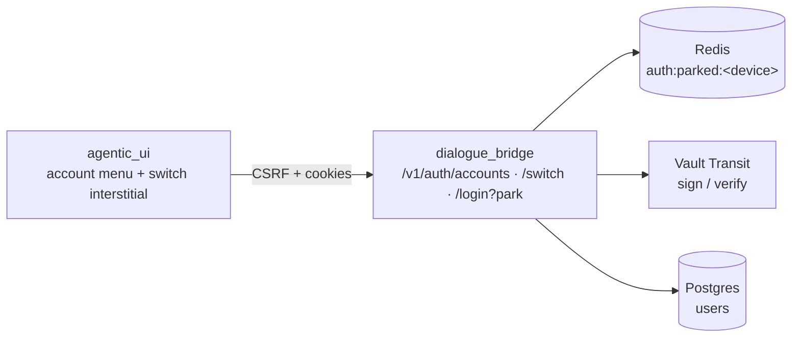
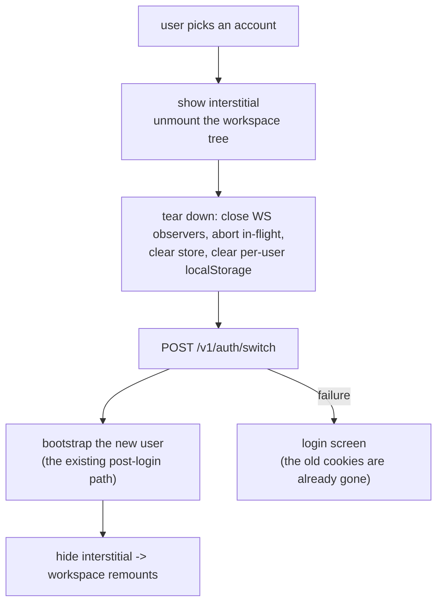

# Multi-account sign-in & switching

> **Status:** **Delivered** (2026-08-24) — backend, switcher UI and interstitial are in and locally verified; three gaps remain, listed in §10. Kept for the reasoning; where the build diverged from this plan the divergence is called out inline.
> **Depends on:** the stateless-JWT auth already shipped ([authentication-and-session](../flows/authentication-and-session.md))
> **Blocks:** nothing. Adjacent: "Log out of all devices" (TODO → Agentic UI → Profile panel), which reuses the same revocation surface
> **Services touched:** dialogue_bridge · agentic_ui (no DB migration)

A user should be able to stay signed in to several accounts at once — a personal one and a work one, say — see them listed under the profile button, and switch with one click instead of logging out and back in. The cost of that convenience lands entirely in the identity layer: auth here is stateless JWTs in `__Host-` cookies, so "several accounts at once" cannot mean "several sets of cookies" without changing what every request means. This plan keeps exactly **one active identity per request** — so every authorization check, rate limiter and audit line downstream stays untouched — and models the other accounts as *parked* sessions the user can promote. Logging out is unchanged and always applies to whichever account is active; to sign out of a specific account you switch to it first.

---

## Services Involved



---

## 1. Goal & non-goals

**Goal.** Several concurrently-authenticated accounts per browser, a switcher in the profile menu, and an "add another account" path — with no change to how an authenticated request is interpreted anywhere downstream.

**Non-goals.**

- **Acting as two accounts at once.** One active identity per request, always. Anything else makes every existing ownership check ambiguous.
- **Cross-account data access.** Switching is re-authentication as another user, not a permission grant. No endpoint ever reads across accounts.
- **Org / team switching.** That is [02 · Org + user permissions](02-org-and-user-permissions.md); this is *user* accounts only.
- **Changing logout semantics.** Logout still ends the active session (§6).

---

## 2. The constraint that shapes the design

Production cookies carry the **`__Host-` prefix** (`__Host-mx_session`, `__Host-mx_refresh`, `__Host-mx_csrf` — see the `host_locked` branch in `core/settings.py`). That prefix **requires `Path=/` and forbids `Domain`**, which rules out the obvious approach of parking other accounts' tokens in a cookie scoped to only the switch endpoint:

| Approach | Why it fails here |
| --- | --- |
| One cookie per parked account | `__Host-` forces `Path=/`, so every parked JWT (~1 KB) rides on **every** request → nginx header limits |
| One cookie holding a token map | The 4 KB per-cookie ceiling caps it at ~3 accounts, with the same header cost |
| Path-scoped parked cookie | Incompatible with `__Host-`; dropping the prefix weakens a high-value credential |

So parked sessions live **server-side**, indexed by a small opaque device cookie:

```text
__Host-mx_device   ->  opaque random id (httpOnly, Secure, SameSite: same hardening as today)
Redis  auth:parked:<device_id>  ->  { user_id: refresh_token, ... }    TTL = refresh idle TTL
```

The **active** account keeps using today's cookies unchanged. This does reintroduce server-side auth *state*, but only as an index of dormant sessions — the active request path stays stateless, which is the property the stateless-JWT overhaul was protecting.

---

## 3. Why the refresh-reuse detector is not a blocker

`RefreshTokenGuard` kills a session when an **old** refresh `jti` is replayed — which is exactly what "store a refresh token and use it later" looks like from the outside. It is safe here because a parked token is **never rotated while parked**: it remains the current `jti` for its `sid`, so `status()` returns `ok`. Every switch *does* rotate it (the promoted session gets a fresh pair, and the demoted one is re-parked with its new token), which makes a stolen parked token **more** detectable, not less.

---

## 4. Phases

### Phase 1 — Backend (no UI)

- Parked-session store: `list` / `park` / `take` / `drop` over `auth:parked:<device_id>`, TTL = refresh idle TTL, capped at **2** accounts in total (active + parked).
- `GET /v1/auth/accounts` — the active account plus the parked ones (id, display name, email, avatar, `expired: bool`). **Never returns tokens.** Requires an active session + device cookie (§5.1) and carries a rate limit.
- `POST /v1/auth/switch {user_id}` — requires an active session, the device cookie and a CSRF token (§5.1); rate-limited; audited. Take the parked refresh token, verify it, mint a fresh pair for that user, re-park the outgoing account's rotated token, and set every cookie **in one response**.
- `POST /v1/auth/login?park=true` — succeeds as today, but parks the outgoing session instead of discarding it.
- Logout: revoke the active `sid` (unchanged) **and** drop it from the parked index.

*Acceptance:* with two accounts parked, `switch` returns 200 and subsequent requests resolve to the new user; the previous account stays listed; another browser's `device_id` can neither enumerate nor take these parked sessions.

### Phase 2 — The switch interstitial

A full-screen blocking screen (**"Switching accounts / Please wait"**) is **load-bearing, not decoration**: it is what lets the client unmount the entire workspace tree, so no live component can receive a late response from the previous account.



- **Reuse the post-login bootstrap** (`features/auth/handlers/auth.ts`) rather than writing a second fetch path — two bootstraps would drift.
- **Minimum visible duration** (~400 ms) so a fast switch does not flash; the shimmer honours `prefers-reduced-motion`.
- **No escape hatch** while it is up: nothing dismissable, nothing interactive behind it.

### Phase 3 — The account menu

Under the profile button: the current account with a check, the other accounts beneath it, a divider, then `+ Add another account` (opens login with `park=true`). Opens on **click as well as hover** — hover alone is unreachable on touch and by keyboard — with arrow-key navigation and a visible focus ring.

### Phase 4 — Polish

Expired parked rows render greyed as *"Signed out — sign in again"* rather than vanishing (silent disappearance reads as a bug). Per-account avatars. (Audit lines are **not** here — they ship in Phase 1, §5.1.)

---

## 5. Security posture & threat model

Multi-account is a **privilege-amplification feature**: it deliberately keeps more live credentials in one browser than a single-session design does. That trade is acceptable only if it is stated and bounded, so this section is normative — Phase 1 is not done until every row holds.

### 5.1 The central trade

| | Single session (today) | Multi-account |
| --- | --- | --- |
| A stolen active session yields | 1 account | **1 account, plus the ability to switch into the other N** |

There is no way to add account switching without this. What is controllable is the cost of exploiting it:

- **A switch requires a valid *active* session, the device cookie, *and* a CSRF token — all three.** The device cookie alone must never be sufficient; otherwise one stolen cookie escalates to every parked account. `GET /accounts` carries the same requirement, so the account list cannot be enumerated with a stolen device cookie either.
- **Every switch rotates both tokens** (§3), so a captured parked token is single-use and its reuse trips `RefreshTokenGuard`.
- **Cap of 2 accounts in total** (the active session plus the parked ones), and parked entries respect the refresh **absolute** TTL (20 days), not just the idle TTL — a parked session can never outlive a normal one.
- **Audit from Phase 1, not Phase 4** (§4): park, switch, drop and cap-rejection each emit an event with the actor, the device id (hashed) and the target account. An auth-state change that leaves no trace is not production-grade.

### 5.2 Redis becomes a credential store

Today Redis holds only *non-credential* auth state: logout markers and the current refresh `jti`. Parking refresh tokens there changes its value as a target — a Redis compromise would hand over usable credentials for every parked account.

- **Parked tokens are encrypted at rest**, not stored raw. Key from a Swarm secret (mirroring `agent_runtime_aes_key` in the agents service) or Vault Transit, which the bridge already talks to for signing. Redis then holds ciphertext, and a Redis-only compromise is insufficient.
- Redis is reached over verified TLS with password auth but `--tls-auth-clients no` (see the deployment notes); carrying credentials strengthens the case for mTLS on that hop.
- The parked entry stores the token and nothing else identifying — display name and email for the menu are read from Postgres at request time, so a Redis dump does not also leak an account roster.

### 5.3 Account injection

If `POST /login?park=true` were reachable cross-site, an attacker could silently add **their own** account to a victim's switcher; the victim later switches to it and types sensitive content into an account the attacker controls. This is the non-obvious attack in the design.

- Login (and therefore park) stays CSRF-protected, and `park=true` is honoured **only** for a request that already carries a valid active session and device cookie.
- The active account must be unmistakable in the UI at all times — the menu shows a check against the current account, and the switch interstitial names the account being entered.
- Adding an account is an audited event, and becomes a notification once the notification service exists.

### 5.4 Rate limiting

`switch`, `accounts` and `login?park` all sit on the auth surface and reuse the existing limiters (`auth_rate_limit` / `refresh_rate_limit` in `core/security/rate_limit.py`). Unlimited switching is both a brute-force oracle against parked entries and a cheap way to churn token rotation.

### 5.5 Shared devices

Logging out the active account must not leave other accounts signed in on a shared machine, so alongside the normal logout there is an explicit **"Log out of all accounts"** that revokes every parked `sid` and deletes the device entry. The device cookie is cleared whenever the parked set empties.

### 5.6 Privacy

The device index makes two identities correlatable as one human — that is new, and it is the point of the feature. It is bounded: the entry is keyed by an opaque random id (never a user id), is deleted when the set empties or on log-out-of-all, carries the refresh TTL, and the device id is hashed in logs like every other identifier.

### 5.7 Residual risks (accepted, documented)

- A live session on a compromised machine reaches every parked account. Mitigated by the cap, rotation, audit and TTLs — **not eliminated**. If a deployment cannot accept that, the feature must be gated by a setting, or a switch must require re-authentication.
- Redis unavailability disables switching (fail closed, §6) — an availability cost taken deliberately in exchange for never guessing about identity.

---

## 6. Sharp edges

- **The cookie swap is a point of no return.** Once `switch` responds, the previous account's cookies are gone. A failure *after* that point must land on the login screen — never a retry as the old account, and never a dead interstitial.
- **Incomplete client teardown is the worst-case bug** (account A's conversations rendered under account B). The interstitial's unmount is the primary defence; a generation guard — the `loadGenRef` pattern already used for conversation loads — is the backstop for anything that survives it.
- **The IndexedDB snapshot is already keyed by `userId`**, so the switch must *load the new user's* snapshot, not clear the store and re-persist over the old key.
- **`localStorage` is not user-scoped**: `selectedAgent`, `lastConversationId` and `isPrivateMode` must be re-read per account or they bleed across a switch.
- **Redis down means switching is unavailable.** Fail **closed** (stay on the active account) — unlike the logout denylist there is no safe fail-open reading of "I could not find your parked session".
- **A parked session can expire on its own** (refresh idle TTL, 12 days), so the switcher must tolerate a dead entry at any moment.

---

## 7. Logout semantics

Logout always ends the **active** session and drops it from the parked index. To sign out of a specific account you switch to it, then log out. When other accounts remain parked, auto-switch to the next one; only fall through to the login screen when none are left.

---

## 8. Testing strategy

Backend: park / take / drop round-trips; the 5-account cap; a switch rotating both tokens; `accounts` never leaking a token; cross-device isolation (device B cannot take device A's parked session); logout dropping the active entry; switch behaviour with Redis unavailable. Frontend: teardown ordering, a late response from the previous account being discarded, and snapshot load-by-`userId` on switch. One integration test walks login → add a second account → switch → converse → logout → auto-switch.

---

## 9. File map

| Concept | File |
| --- | --- |
| Parked-session index | `src/dialogue_bridge/core/auth/parked.py` *(new)* |
| Session cookies, denylist, refresh guard | [core/auth/session.py](../../src/dialogue_bridge/core/auth/session.py) |
| Mint / verify | [core/auth/tokens.py](../../src/dialogue_bridge/core/auth/tokens.py) |
| Auth routes | [router/auth.py](../../src/dialogue_bridge/router/auth.py) |
| Post-login bootstrap (reused by switch) | [features/auth/handlers/auth.ts](../../src/agentic_ui/src/features/auth/handlers/auth.ts) |
| Account menu | `src/agentic_ui/src/features/auth/components/AccountMenu.tsx` *(new)* |
| Switch interstitial | `src/agentic_ui/src/features/auth/components/SwitchingAccounts.tsx` *(new)* |

---

## 10. Where the build diverged from this plan

| Planned | Built | Why |
| --- | --- | --- |
| `switch` + `accounts` on the existing auth limiters | `switch` on `refresh_rate_limit`; **`accounts` on no route limiter** (the global per-identity budget only) | `auth_rate_limit` is the per-IP *credential* bucket for login/refresh. An authenticated read sharing it lets any chatty client starve sign-in — which a render loop in the first cut proved by locking the developer out and hiding the SSO button (both were 429s). |
| "Add another account" navigates back into the app | **Hard `window.location.assign("/")`** | The workspace store is module-level, so a router navigation arrived at `/` still holding the previous account's `userId`; every request keyed on it was rejected as *"Token does not grant access to this user"*. Restarting is the only way to guarantee nothing stale survives. |
| Teardown via the existing chat-clear handler | A new **`resetForAccountSwitch()`** store action | `clearChatAndStopThinking()` turned out to be nothing but `navigate('/')`. Without a real reset, the archived and shared conversation lists (lazily loaded, never re-fetched by the bootstrap) stayed on screen under the new identity. |
| — | Snapshot writes are **stamped with their owner** | The persistence effect is keyed `[userId, persistSignal]`, so a `userId` change re-fired it with the *previous* account's snapshot still in the ref — writing one account's conversations into another's IndexedDB key, where it survived reloads. |
| Audit lines in Phase 4 (polish) | Phase 1 | An auth-state change that leaves no trace is not production-grade. |

---

## 11. Remaining gaps

* **OIDC cannot add an account.** `?park=true` is honoured on password login only; the Entra callback has no way to carry the intent through the redirect. Adding a *userpass* account while signed in with Entra works; the reverse does not.
* **"Log out of all accounts" has no UI.** The endpoint is implemented and tested (§5.5 calls it a requirement), but nothing calls it — it belongs as a row in Settings → Security.
* **CSRF enforcement on the new routes is untested.** The suite overrides `require_csrf_protection` app-wide, so the tests prove the dependency is *declared*, not that it rejects. Declared identically to `/logout` and `/session/refresh`.
* **Not exercised in a browser by the author** beyond the two bugs the user hit; the state-reset fix in particular wants a click-through of Archived and Shared after a switch.

---
