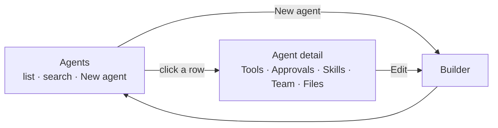

# 20 — Agents tab: UX/UI restructure

**Status:** Partially shipped — the agents index (§3), agent detail with the dense grouped tool list (§4), and the builder shell (§5: section tabs, slug subtext, icon dropdown, pinned actions) are in. **Remaining:** the builder's Tools and Team sections (§5.1, §5.3), the approvals matrix (§5.2), and the backend key work behind it (§6) — the last two are being re-planned separately.
**Touches:** `agentic_ui` (Agents tab, agent builder), `agents` (approvals for MCP tools — §6 only)

This is a redesign of what the two screens actually look like and how they flow —
the agent chooser, the tool list, and the create-agent form.

---

## 1. What is wrong, screen by screen

### 1.1 The Agents tab

```text
WORKSPACE                                       ← eyebrow 1
Choose an agent                    [ Your agents ]
Pick an agent to manage its tools…

  ( Omni )  ( Omni (YAML) )                     ← 2 chips, full card

TOOLS                                           ← eyebrow 2
Omni's tools
Turn off any of the agent's own tools, or turn on extra…

AVAILABLE TO ADD                                ← eyebrow 3
Tools from the connected apps…

┌────────────────────────────────────────────────────┐
│ download_paper   MCP                          ( ) │
│ Download and convert an arXiv paper to readable    │  ~100px
│ markdown format for analysis and reading. This…    │  per row
└────────────────────────────────────────────────────┘
```

| # | Problem | Why it hurts |
| --- | --- | --- |
| 1 | **Three stacked eyebrows** before any content — `WORKSPACE`, `TOOLS`, `AVAILABLE TO ADD` | Five headings before the first tool. The screen announces itself three times. |
| 2 | **A whole card to choose between two chips** | The chooser occupies the most valuable space on the page for the least valuable decision. |
| 3 | **~100px per tool row** | Six tools fill the viewport. A 24-tool gateway is an endless scroll. |
| 4 | **The description is the LLM's prompt text**, truncated mid-word | *"converts it to markdown using advanced…"* is written for the model, not for someone scanning a list. |
| 5 | **No search, no grouping, no counts** | Every tool from every MCP server is one flat list. Nothing says how many are on. |
| 6 | **The copy promises something the screen doesn't show** | "Turn off any of the agent's own tools" — but Omni declares none, so only *Available to add* renders. The instruction describes a section that isn't there. |
| 7 | **`Your agents` is a ghost button in the header** | Authoring — the reason to visit this tab — is the least prominent thing on it. |

### 1.2 The create-agent form

```text
CREATE
New agent                                     [ ← Back ]

Name                          Model
[ Research Bot            ]   [ GPT-4o  Balanced      ⌄ ]
Identifier: –                                 ← dangling en-dash

Description
[ What is this agent for?                             ]

Icon
(Bot)(BrainCircuit)(Telescope)(Sparkles)(Compass)
(Scale)(FlaskConical)(Library)(PenLine)(Wrench)       ← 2 rows of chips

Instructions
┌──────────────────────────────────────────────────────┐
│ You are Research Bot. You dig into topics…           │ ← red border
└──────────────────────────────────────────────────────┘
```

| # | Problem | Why it hurts |
| --- | --- | --- |
| 8 | **`Identifier: –`** | A field showing an en-dash reads as broken. The slug is derived from the name — it should appear *under* the name as it types, or not at all. |
| 9 | **Ten icon chips across two rows** | The least important decision on the form takes the most vertical space. |
| 10 | **Red border with no message visible** | The error state is styled but the reason sits elsewhere. |
| 11 | **One flat scroll, no map** | Identity → instructions → skills → sub-agents → files, ~1,000 lines of form, with no indication of how much is left or where you are. |
| 12 | **Save is at the very bottom** | On a long form you scroll to act, then scroll back. |
| 13 | **No tools, no approvals anywhere** | The two things you asked for do not exist in this form at all. |

---

## 2. The new flow

Today the tab opens on *tool management* and hides authoring. That inverts.



Three screens, each with one job, each with a real URL so back works.

---

## 3. Mock — Agents (the new landing)

```text
┌──────────────────────────────────────────────────────────────────────┐
│  Agents                                             [ + New agent ]  │
│  Configure what each agent can do, or build your own.                │
│                                                                      │
│  ⌕ Search agents…                     ( All )( Platform )( Yours )   │
│                                                                      │
│  ┌────────────────────────────────────────────────────────────────┐  │
│  │  ⬡   Omni                                          Platform    │  │
│  │      General-purpose research and writing                      │  │
│  │      GPT-4o · 6 tools · 3 need approval · 2 sub-agents      ›  │  │
│  └────────────────────────────────────────────────────────────────┘  │
│  ┌────────────────────────────────────────────────────────────────┐  │
│  │  ⬡   Omni (YAML)                                   Platform    │  │
│  │      Declarative twin of Omni                                  │  │
│  │      GPT-4o · 6 tools · 3 need approval                     ›  │  │
│  └────────────────────────────────────────────────────────────────┘  │
│  ┌────────────────────────────────────────────────────────────────┐  │
│  │  ⬡   Research Bot                             Yours       ⋯    │  │
│  │      Digs into topics and returns sourced findings             │  │
│  │      GPT-4o · 4 tools · 2 need approval · 1 skill           ›  │  │
│  └────────────────────────────────────────────────────────────────┘  │
└──────────────────────────────────────────────────────────────────────┘
```

**What changed**

- The chooser card is gone. Agents *are* the page.
- One list for platform and authored agents, with a `Platform` / `Yours` badge, so
  there is no second hidden screen behind a ghost button.
- Each row answers *what is this and what can it do* before you open it. The
  **`3 need approval`** count makes gating visible from the top level.
- `⋯` menu (Edit · Duplicate · Delete) on authored rows only. Delete goes through a
  confirm dialog instead of the current click-twice.
- Search + segmented filter, so this still works at thirty agents.
- **Empty state carries its own button** rather than pointing at one elsewhere.

---

## 4. Mock — Agent detail → Tools

The screen from problem #3–#6, rebuilt.

```text
┌──────────────────────────────────────────────────────────────────────┐
│  ‹ Agents        ⬡ Omni                                   Platform   │
│  ──────────────────────────────────────────────────────────────────  │
│   Overview   [ Tools ]   Approvals   Skills   Team   Files           │
│  ──────────────────────────────────────────────────────────────────  │
│                                                                      │
│  ⌕ Search tools…                  ( All )( On )( Off )   6 of 24 on  │
│                                                                      │
│  Built in                                                    5 on ⌄  │
│  ┌────────────────────────────────────────────────────────────────┐  │
│  │  read_file       Read a file from the workspace          ●━━  │  │
│  │  write_file      Write a file to the workspace  🔒        ●━━  │  │
│  │  render_chart    Draw a chart inline in the reply        ●━━  │  │
│  │  present_artifact  Hand a finished document to the user  ●━━  │  │
│  └────────────────────────────────────────────────────────────────┘  │
│                                                                      │
│  arXiv                                        MCP · 1 of 4 on    ⌄   │
│  ┌────────────────────────────────────────────────────────────────┐  │
│  │  download_paper  Fetch an arXiv paper as markdown        ━━○  │  │
│  │  list_papers     List papers already downloaded          ━━○  │  │
│  │  read_paper      Read a downloaded paper                 ●━━  │  │
│  │  search_papers   Search arXiv by topic or author         ━━○  │  │
│  └────────────────────────────────────────────────────────────────┘  │
│                                                                      │
│  Tavily                                       MCP · 0 of 2 on    ›   │
└──────────────────────────────────────────────────────────────────────┘
```

**What changed**

- **One line per tool.** ~100px → ~40px. Six tools became twenty on the same screen.
- **Description trimmed to one line**, written for a human. Full prompt text moves to
  a tooltip / the MCP Servers tab, where it belongs.
- **Grouped by source, collapsible**, each group showing `n of m on`. Tavily is
  collapsed because nothing in it is enabled.
- **Search + On/Off filter**, and a running `6 of 24 on` in the header.
- **`🔒` marks a tool that needs approval**, right next to it — the link between the
  Tools list and the Approvals section is visible instead of implied.
- The `Built in` / `arXiv` grouping replaces `The agent's tools` / `Available to add`,
  which described *provenance* rather than *what it is* — and broke when an agent
  declared none.

---

## 5. Mock — Builder

```text
┌──────────────────────────────────────────────────────────────────────┐
│  ‹ Agents         New agent                                          │
│  ──────────────────────────────────────────────────────────────────  │
│   [ Identity ]  Instructions  Tools  Approvals  Team  Files          │
│  ──────────────────────────────────────────────────────────────────  │
│                                            ┌──────────────────────┐  │
│   Name                                     │  Preview             │  │
│   [ Research Bot                       ]   │                      │  │
│   research-bot                       ← live│   ⬡  Research Bot    │  │
│                                            │      Digs into…      │  │
│   Description                              │                      │  │
│   [ Digs into topics and returns…      ]   │   GPT-4o             │  │
│                                            │   4 tools            │  │
│   Model                                    │   2 need approval    │  │
│   [ GPT-4o · Balanced               ⌄ ]    │   1 sub-agent        │  │
│                                            │   1 skill            │  │
│   Icon                                     │                      │  │
│   [ ⬡ Bot                           ⌄ ]    └──────────────────────┘  │
│                                                                      │
├──────────────────────────────────────────────────────────────────────┤
│                                             Cancel    Save agent     │
└──────────────────────────────────────────────────────────────────────┘
```

**What changed**

- **Section tabs across the top.** You can see the whole form at a glance and jump
  to any part. A section with an error shows a dot on its tab, so a validation
  failure is visible rather than discovered on save.
  *Horizontal, not a left rail — the settings panel already has a left sidebar, and
  two vertical navs side by side is one nav too many.*
- **`Identifier: –` is gone.** The slug renders as quiet subtext under the Name field
  and updates as you type. Nothing shows until there is something to show.
- **Icon is a dropdown**, not ten chips across two rows.
- **Live preview** on the right: the agent card as it will appear in the composer,
  plus its capability counts. This is what makes tools and approvals feel real while
  you are still filling the form. Collapses below the form under `lg`.
- **Sticky footer** — Save is always reachable.
- **Two new sections**: `Tools` and `Approvals`.

### 5.1 Builder → Tools

Same component as §4, minus the live toggles — here it selects what the agent
*declares*, rather than what a user has switched on afterwards.

### 5.2 Builder → Approvals

```text
┌──────────────────────────────────────────────────────────────────────┐
│   Identity  Instructions  Tools  [ Approvals ]  Team  Files          │
│  ──────────────────────────────────────────────────────────────────  │
│                                                                      │
│  Ask me before the agent…                              2 of 9 gated  │
│                                                                      │
│  ┌────────────────────────────────────────────────────────────────┐  │
│  │  write_file       Writes a file             Built in   🔒 Always │
│  │  edit_file        Edits a file              Built in   🔒 Always │
│  │  execute          Runs code                 Built in   🔒 Always │
│  │  task             Delegates to a sub-agent  Built in   🔒 Always │
│  │  create_skill     Creates a new skill       Built in   🔒 Always │
│  ├────────────────────────────────────────────────────────────────┤  │
│  │  read_file        Reads a file              Built in      ━━○  │  │
│  │  render_chart     Draws a chart             Built in      ━━○  │  │
│  │  search_papers    Searches arXiv            MCP           ●━━  │  │
│  │  tavily/search    Searches the web          MCP           ━━○  │  │
│  └────────────────────────────────────────────────────────────────┘  │
│                                                                      │
│  🔒 Five tools always ask, on every agent. This cannot be turned off. │
└──────────────────────────────────────────────────────────────────────┘
```

The five mandatory gates render locked at the top with one explanation underneath,
instead of today's paragraph describing rules you cannot see. Everything else is a
plain switch.

### 5.3 Builder → Team (sub-agents)

Each sub-agent becomes a card that can carry its own model and tool subset, rather
than the current name/description/prompt only:

```text
┌────────────────────────────────────────────────────────────────┐
│  researcher                                              ⋯     │
│  Deep-dives a topic and gathers sources                        │
│  Model  [ Inherit — GPT-4o            ⌄ ]                      │
│  Tools  [ read_file ×] [ search_papers ×]  + Add               │
└────────────────────────────────────────────────────────────────┘
                                          [ + Add sub-agent ]
```

---

## 6. The one thing that needs backend work

Row `tavily/search` in §5.2 does not work today. Approvals are keyed on plain tool
names (`write_file`); MCP tools are keyed `server_id/tool_name`. **No MCP tool can be
gated at all right now** — an enabled web search or an automation trigger runs without
asking.

That is fine while the gateway only carries read-only tools, and not fine the moment
it carries anything that writes or sends. An approvals screen that silently omits the
agent's outward-facing tools would teach the wrong thing, so the backend key format
lands **before** the Approvals section ships.

Everything else in this plan is frontend only.

---

## 7. Visual corrections applied throughout

| Fix | Detail |
| --- | --- |
| **Row height** | ~100px → ~40px for tool rows; one line of human-written description |
| **Heading depth** | Three stacked eyebrows → one page title + section tabs |
| **Radius** | `--radius` exists but components hardcode `rounded-xl`/`2xl`. Containers `2xl`, panels `xl`, controls `lg`, so nesting reads |
| **Loading** | The literal string *"Loading tools…"* → `Skeleton` rows, which `UsageTab` already uses in the same panel |
| **Numbers** | `tabular-nums` on every count, so `6 of 24 on` does not jitter as it changes |
| **Press state** | Nothing in the tab has `:active` today. Add `scale(0.98)`, 150–200ms, `transform`/`opacity` only |
| **Markup** | Rows are `<div>`s. Use `<ul>`/`<li>`, `<section>`, `<nav>` |
| **Entry** | Staggered row fade-in, behind `useReducedMotion` |
| **Empty states** | Carry their own primary action instead of pointing at a button elsewhere |

**Kept deliberately:** the `InfoCard` / `SoftPanel` chrome and Lucide icons. The problem
is hierarchy and density, not the cards — and the icon set is a project-wide rule.

**Noted, not changed:** the accent is hue 293, a purple that reads as the standard "AI"
palette. That is brand, not this tab's decision.

---

## 8. Phases

| # | Phase | Screens |
| --- | --- | --- |
| 0 | Routes for index / detail / builder — back button works, no visual change | — |
| 1 | **Agents list** — search, filter, badges, `⋯` menu, confirm dialog, empty state | §3 |
| 2 | **Agent detail** — section tabs; tool list rebuilt dense, grouped, searchable | §4 |
| 3 | **Builder shell** — section tabs, slug subtext, icon dropdown, sticky footer, preview | §5 |
| 4 | **Builder: Tools + Team** — tool selection, per-sub-agent model and tools | §5.1, §5.3 |
| 5 | **MCP approval keys** *(backend)* | §6 |
| 6 | **Builder: Approvals** | §5.2 |
| 7 | Visual corrections, docs, tests | §7 |

---

## 9. Files

| Concern | File |
| --- | --- |
| The tab | `src/agentic_ui/src/features/settings/components/profile_parts/AgentsTab.tsx` |
| The form | `src/agentic_ui/src/features/settings/components/profile_parts/AgentBuilder.tsx` |
| Card / panel chrome | `src/agentic_ui/src/features/settings/components/profile_parts/shared.tsx` |
| Panel shell + left sidebar | `src/agentic_ui/src/features/settings/components/ProfilePanel.tsx` |
| Agent + tool APIs | `src/agentic_ui/src/shared/lib/api/agents.ts`, `catalog.ts` |
| Theme tokens | `src/agentic_ui/src/styles/tokens.light.css`, `tokens.dark.css` |
| Spec the form must express | `src/agents/runtime/abstractions/agent_spec.py` |
| Approval floor + validation | `src/agents/runtime/abstractions/user_agents.py` |
| Approval resolution (Phase 5) | `src/agents/runtime/abstractions/deep_agent.py` |
